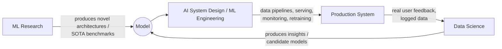
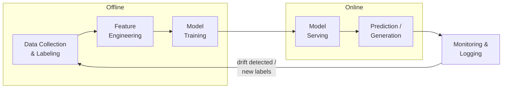

## Introduction

When people hear "system design," they usually picture whiteboards full of load balancers, databases, and message queues — the world of URL shorteners, chat apps, and rate limiters. **AI System Design** borrows that same engineering discipline but points it at a different kind of problem: systems where a *model*, not just a set of deterministic rules, sits in the critical path of a decision.

That single change — replacing deterministic logic with a learned, probabilistic component — ripples through every layer of the system. Data becomes a first-class engineering artifact instead of just storage. Correctness becomes statistical instead of binary. And the system's behavior can silently drift over time even when no code has changed.

This chapter sets the foundation for the rest of the series: what AI System Design actually means, who practices it, and how it relates to (and differs from) the disciplines you may already know.

## AI System Design vs Traditional System Design

Traditional (HLD) system design asks: *"How do I move data reliably, quickly, and at scale?"* AI System Design asks the same question, plus a second one that traditional systems never had to answer: *"How do I make a good decision under uncertainty, and keep making a good decision as the world changes?"*

| Dimension | Traditional System Design | AI System Design |
|---|---|---|
| Core unit of work | Deterministic request/response | Prediction / generation under uncertainty |
| Correctness | Binary (matches spec or it doesn't) | Statistical (accuracy, precision, calibration) |
| Source of failure | Bugs, infra outages | Bugs, infra outages, **and** data drift, label noise, model decay |
| Testing | Unit/integration tests | Unit/integration tests **and** offline eval, A/B tests, shadow traffic |
| What changes post-launch | Code | Code **and** the data distribution the model was trained on |
| Rollback unit | A deployment/version | A deployment/version **and** a model artifact/weights |

AI System Design doesn't replace traditional system design — it's built directly on top of it. Every AI system still needs an API layer, a database, caching, and scaling strategies. What's added is an entire second lifecycle around data and models that traditional systems never had to manage.

## AI System Design vs Data Science / ML Research

It also helps to separate this discipline from data science and ML research, which is a common point of confusion, especially in interviews.

- **ML Research** asks: *"Can we build a model architecture that achieves a new state-of-the-art result?"* The focus is model quality in isolation — usually measured on a fixed benchmark dataset.
- **Data Science** asks: *"What does the data tell us, and which model best captures the pattern?"* The focus is analysis, hypothesis testing, and model selection — often in a notebook, not a production system.
- **AI System Design (ML Engineering)** asks: *"Given a model (possibly not even the fanciest one), how do I build a reliable, scalable, observable system around it that keeps working in production, under real traffic, real users, and a real budget?"*

A useful mental model: a research team can produce a model with 95% offline accuracy that never ships, because nobody solved data pipelines, latency, monitoring, or the retraining loop. AI System Design is the discipline that gets a model — often a "good enough" one — safely and durably into the hands of users.

## Why AI System Design Became Its Own Interview Category

A decade ago, "ML System Design" interviews were rare and mostly reserved for research-heavy roles. Three shifts changed that:

1. **ML moved from a side feature to the core product.** Recommendation, ranking, fraud detection, and now conversational AI are the product for many companies, not an add-on — so companies need engineers who can design the whole system, not just tune a model.
2. **The GenAI/LLM wave created a new class of system problems.** Prompt design, retrieval, context windows, hallucination, and inference cost are system design problems as much as they are model problems.
3. **Companies learned (the hard way) that most ML project failures are engineering failures, not modeling failures** — bad data pipelines, training/serving skew, no monitoring, no rollback plan. Interviewers now specifically probe for this judgment.

This is exactly why this series exists: the goal isn't to make you a better model-builder, but a better *systems* thinker for AI-centric products.

## Who Does This Work? (Role Landscape)

Understanding the role landscape helps you calibrate what depth an interviewer expects from you:

- **ML Engineer** — owns the production system: pipelines, training infra, serving, monitoring. This is the primary audience for this series.
- **Applied Scientist / Research Scientist** — owns model quality and experimentation; increasingly expected to reason about serving constraints too.
- **MLOps / Platform Engineer** — owns the shared infrastructure (feature stores, training platforms, serving platforms) that many ML teams build on top of.
- **Data Engineer** — owns the pipelines that feed the entire system; a weak link here breaks everything downstream.
- **AI/LLM Engineer (newer title)** — owns LLM-specific system concerns: prompting, RAG, agents, guardrails, inference cost. Parts 8-13 of this series map directly to this role.

In practice, especially at mid-sized companies, one engineer wears several of these hats — which is exactly why AI System Design interviews test breadth across the entire lifecycle, not depth in just one slice.

## The Shape of an AI System (Preview)

Every AI system you'll design in this series — no matter how different the use case — decomposes into the same five stages. We'll go deep on each one in later Parts, but it's worth seeing the whole shape now:

Notice the loop at the end: production is not the finish line. The logs and outcomes from serving flow back into data collection, which is what makes ML systems fundamentally *cyclical* rather than linear — a theme we'll return to constantly.

## Key Takeaways

- AI System Design extends traditional system design with a second lifecycle: data → training → serving → monitoring → back to data.
- Correctness in AI systems is statistical, not binary — this changes how you test, deploy, and roll back.
- It sits between ML research/data science (model quality) and platform engineering (infrastructure), while owning the connective tissue between them.
- The discipline exists as its own interview category because most real-world ML failures are engineering failures, not modeling failures.

---

## Interview Questions

**1. How is AI System Design different from traditional (HLD) system design?**
Traditional system design is about moving and storing data reliably and quickly under a deterministic contract — the same input always produces the same output. AI System Design adds a probabilistic component: a model whose behavior depends on training data, and which can degrade silently even when the code hasn't changed. This means you need additional infrastructure (data pipelines, feature stores, retraining loops) and additional testing strategies (offline evaluation, A/B tests, shadow deployments) that traditional systems don't need.
*Follow-up: Can you give an example of a failure mode that exists only in AI systems, not traditional ones?*
Data drift — the distribution of incoming production data shifts away from the training distribution (e.g., user behavior changes after a holiday), causing accuracy to silently decay with zero code changes and zero infra alerts unless you've built drift monitoring specifically for it.

**2. What is "training-serving skew," and why does it matter?**
It's a mismatch between how a feature is computed at training time versus at serving (inference) time — for example, computing a rolling average over 30 days in a batch job for training, but only having access to 7 days of data in the real-time serving path. Even a perfectly good model performs poorly in production if the input features it receives at serving time don't match what it saw during training.
*Follow-up: How would you prevent training-serving skew in practice?*
Use a single shared feature computation pipeline (a feature store) so training and serving pull feature values from the same logic and, ideally, the same store — rather than maintaining two separate implementations.

**3. Why do most ML projects fail in production, despite good offline model performance?**
The majority of failures are engineering and process failures, not modeling failures: no data validation (garbage data reaches the model), no monitoring (nobody notices decay), no retraining pipeline (the model goes stale), or a mismatch between the offline metric optimized during training and the actual business metric it's meant to improve. A model with 95% offline accuracy that nobody can safely deploy, monitor, or update is a failed system.
*Follow-up: How does this change what you should optimize for in an interview answer?*
Show that you think about the full lifecycle — data quality, deployment strategy, monitoring, and retraining — not just about which model architecture to pick, since architecture is usually a small fraction of real-world project risk.

**4. What is the ML system lifecycle, and why is it a loop rather than a straight line?**
It's Data Collection → Feature Engineering → Training → Serving → Monitoring, and then back to Data Collection. It's a loop because production traffic generates new signals (user clicks, corrections, outcomes) that become tomorrow's training data. A system that doesn't close this loop stagnates: the model never learns from real-world mistakes, and data drift accumulates unchecked.
*Follow-up: What's a concrete mechanism for "closing the loop" in a recommendation system?*
Logging user interactions (clicks, watch time, skips) as implicit feedback, joining them with the original recommendation requests to create labeled training examples, and feeding those back into the next training run — often on a scheduled or continuous basis.

**5. How would you decide whether a problem needs "AI system design" thinking at all, versus a simpler rules-based system?**
Use ML when the relationship between inputs and the desired output is too complex or too variable to hand-write as explicit rules, and where you have (or can get) enough labeled data to learn that relationship. If a simple rule (e.g., "flag any transaction over $10,000") captures 90% of the value, a rules engine is cheaper to build, easier to debug, and easier to explain — introducing ML adds real cost (data pipelines, monitoring, retraining) that should be justified by a real accuracy or scale gain.
*Follow-up: What's a red flag in an interview that a candidate is over-applying ML?*
Reaching for a model before establishing a baseline heuristic or a simple rule-based system, and before checking if a much simpler approach would meet the bar — strong candidates always start with the simplest baseline and justify added complexity.

**6. What roles typically collaborate on an AI system, and where are the handoff risks?**
Data engineers (pipelines), data scientists/researchers (modeling), ML engineers (productionization), and platform/MLOps engineers (shared infra) all touch the system. The biggest risk is at handoffs: a data scientist's notebook feature logic doesn't match the ML engineer's production implementation (training-serving skew again), or a model is handed off for deployment without documentation on its assumptions, input ranges, or failure modes.
*Follow-up: How do feature stores address this handoff risk specifically?*
By giving both the offline (training) and online (serving) paths a single, shared definition and computation path for each feature, so there's no "reimplementation" step where skew can creep in.

**7. What does "statistical correctness" mean, and how does it change how you test an AI system?**
Instead of asserting "given input X, output must equal Y" (as in unit tests), you assert "given a representative dataset, the aggregate error rate/precision/recall must stay within an acceptable range." This means testing shifts toward offline evaluation on held-out data, continuous monitoring of live metrics, and statistical significance testing (A/B tests) rather than pass/fail assertions.
*Follow-up: Does this mean traditional unit tests are useless for ML systems?*
No — you still unit-test the deterministic parts (data validation logic, feature transformation code, API contracts); you're only replacing the "is the answer exactly right" test with a statistical one for the model's actual predictions.

**8. Give an example of an AI system where the "model" itself is a small part of the overall engineering effort.**
A fraud detection system for a payments company: the model itself might be a few hundred lines of code, but the surrounding system — real-time feature computation on transaction streams, a feature store serving sub-50ms lookups, a rules engine for hard blocks, an A/B testing framework for new model versions, and monitoring for both fraud-catch-rate and false-positive-rate — is 10-20x more engineering effort than the model.
*Follow-up: What ratio of "model work" to "system work" would you expect in a typical production ML project, and why does this matter for interviews?*
Commonly cited as roughly 10-20% model work to 80-90% surrounding system work (data, infra, monitoring); interviewers use this to check whether you default to discussing infrastructure and lifecycle, or get stuck only talking about model architecture.

**9. How do LLM/GenAI systems change the classic "AI System Design" picture from a few years ago?**
They shift some of the traditional lifecycle stages: instead of training a model from scratch, you're often adapting a pre-trained foundation model (via prompting, fine-tuning, or RAG). New system concerns emerge that didn't exist before — context window management, retrieval pipelines, token cost, latency from autoregressive generation, and safety guardrails against prompt injection. However, the core loop (get good input, produce a decision, monitor, improve) is unchanged.
*Follow-up: Which parts of the classic ML lifecycle become less relevant, and which become more relevant, when building an LLM-based feature?*
Feature engineering and from-scratch model training become far less relevant (you rarely train an LLM in-house); data pipelines, evaluation, retrieval/RAG design, and inference cost/latency optimization become far more relevant.

**10. What's the difference between "model quality" and "system quality," and why must both be evaluated?**
Model quality asks "does the model make good predictions on held-out data?" System quality asks "does the overall product experience meet latency, reliability, cost, and safety requirements when this model is embedded in it?" A model can have excellent offline accuracy but be part of a poor system if it's too slow to serve within an SLA, too expensive to run at scale, or fails ungracefully when its inputs are malformed.
*Follow-up: Can you have a "good enough" model in a great system, and would you prefer that over a great model in a mediocre system?*
Yes, and in most production contexts you should prefer it — a slightly less accurate model that's fast, reliable, monitored, and easy to roll back typically delivers more real-world value than a marginally more accurate model with no operational safety net.

**11. What is meant by an ML system being able to "silently fail," and what causes it?**
It means the system continues to run without crashing or throwing errors, but produces increasingly poor predictions — caused by things like data drift, upstream schema changes that silently null out a feature, or a labeling process that quietly changes definition. Unlike a traditional system crash, there's no stack trace or 500 error to alert you.
*Follow-up: What's the single most effective mitigation for silent failures?*
Continuous monitoring of live model output distributions and key business/quality metrics (not just infra metrics like uptime and latency), with automated alerting on statistically significant deviation from a baseline.

**12. Interviewers sometimes ask candidates to "just design a recommendation system" with almost no other context. How should you respond first, before diving into a solution?**
Clarify scope and constraints before designing: what's the business goal (engagement, revenue, retention)? What scale (users, items, QPS)? What data is available (explicit ratings, implicit signals)? What latency/consistency requirements exist? Is this a cold-start-heavy scenario? Skipping this step is one of the most common reasons strong technical candidates give incomplete or misaligned answers.
*Follow-up: Why is this "clarify first" step evaluated so heavily in ML system design interviews specifically, more so than in generic coding interviews?*
Because ML systems have many more valid designs depending on constraints (batch vs real-time, cold-start strategy, offline vs online metrics) — jumping to a solution without clarifying scope risks solving the wrong problem entirely, which is exactly the failure mode interviewers are screening for.

**13. What's the relationship between "AI System Design" and "MLOps"?**
MLOps is the set of practices and tooling (CI/CD for models, experiment tracking, model registries, monitoring platforms) that make the operational side of the ML lifecycle repeatable and automatable. AI System Design is the broader discipline of architecting the whole system — MLOps is one major pillar of it (alongside data engineering, serving architecture, and model development), roughly analogous to how DevOps is a pillar of traditional system design, not the whole of it.
*Follow-up: Could you have good AI System Design without any MLOps practices in place?*
Only at a very small scale or in a prototype — as soon as you have multiple models, frequent retraining needs, or multiple engineers touching the same system, the absence of MLOps practices (versioning, tracking, automated pipelines) turns into operational chaos.

**14. Why might a company choose a simpler, less accurate model over a more complex, more accurate one in a production AI system?**
Reasons include: lower inference latency/cost at scale, easier interpretability for regulatory or trust reasons (e.g., credit decisions), lower operational complexity (fewer things that can break or drift), and faster iteration cycles for experimentation. A 1-2% accuracy gain rarely justifies 10x more infrastructure complexity or latency.
*Follow-up: In which domains is interpretability specifically a hard requirement rather than a nice-to-have?*
Regulated domains like lending/credit scoring, insurance underwriting, and healthcare, where laws (e.g., adverse action notices in credit) or ethical/clinical requirements demand that a decision be explainable to the affected person or a regulator.

**15. How would you explain to a non-technical stakeholder why an AI system needs continuous investment after "launch," unlike a typical CRUD feature?**
A CRUD feature's behavior is fixed by its code and generally stays correct until the code or requirements change. An AI system's behavior depends on the real world it was trained to model, and the real world keeps changing — user behavior shifts, new fraud patterns emerge, language evolves. Without ongoing monitoring and periodic retraining, the same model that worked well at launch will quietly become less accurate over time, even though nothing was "broken" in the traditional sense.
*Follow-up: How would you frame the cost of ongoing ML maintenance to a stakeholder pushing to cut it after launch?*
Frame it as the cost of preventing silent revenue/trust loss — point to a concrete metric (e.g., fraud catch rate, recommendation click-through rate) and explain that unmonitored, unretrained models degrade gradually and invisibly until the damage shows up in that metric, at which point it's harder and more expensive to diagnose and fix.
