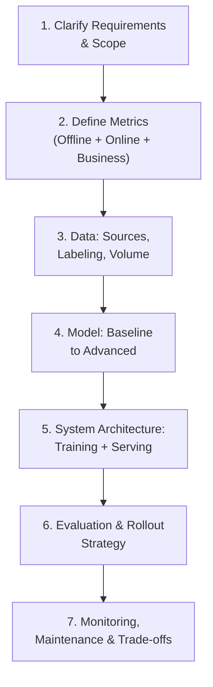
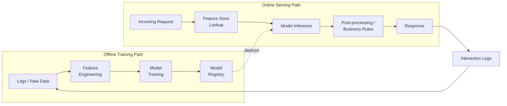

## Introduction

If Chapter 1 established *what* AI System Design is, this chapter gives you the *how* — a repeatable structure you can apply to any AI system design interview question, whether it's "design a recommendation system," "design a fraud detection pipeline," or "design a RAG-based support chatbot." Having a framework doesn't make you sound robotic; it makes sure that, under interview pressure, you never forget an entire dimension of the problem (a very common way strong candidates lose points).

We'll use this exact framework as the skeleton for every case study chapter later in the series (Part 14), so it's worth internalizing now.

## Why a Framework Matters More Here Than in HLD Interviews

In a traditional HLD interview, the failure modes are fairly narrow: forgetting to discuss scaling, or missing an obvious database choice. In AI System Design interviews, the *design space is much larger* — for the same prompt, valid answers can differ wildly depending on data availability, latency needs, cold-start conditions, and business metric. A framework keeps you from either (a) freezing under the scope of the problem, or (b) diving straight into "let's use a transformer" without justifying it.

## The 7-Step Framework

### Step 1 — Clarify Requirements & Scope

Never start designing before you understand the problem's boundaries. Ask about:
- **Business goal**: What decision or action does this system drive? (e.g., "increase watch time," "reduce fraud losses," "reduce support ticket volume")
- **Scale**: How many users/items/requests per second? Is this a global product or a niche internal tool?
- **Latency & consistency requirements**: Real-time (sub-100ms), near-real-time (seconds), or batch/offline (hours)?
- **Existing data & infra**: Is there historical data? Existing pipelines? A cold-start problem (no data yet)?
- **Constraints**: Budget, regulatory requirements (e.g., explainability), team size.

A good clarifying exchange takes 2-4 minutes; skipping it is the single most common reason otherwise-strong candidates give an unfocused answer.

### Step 2 — Define Success Metrics

Every AI system needs metrics at three levels, and confusing them is a classic interview mistake:

- **Offline / Model metrics** — measured on held-out data before deployment (e.g., precision, recall, AUC, RMSE, BLEU/ROUGE for generation).
- **Online metrics** — measured on live traffic after deployment (e.g., click-through rate, latency P99, conversion rate).
- **Business / North-Star metrics** — the actual outcome the company cares about (e.g., revenue, retention, fraud losses prevented).

A model can improve an offline metric while hurting a business metric (e.g., a recommender that maximizes short-term clicks but promotes clickbait, hurting long-term retention) — stating this tension explicitly is a strong signal in an interview.

### Step 3 — Data: Sources, Labeling & Volume

Discuss where the data comes from (logs, user actions, third-party data, human annotation), how labels are obtained (explicit user feedback, implicit signals, human labelers, weak supervision), and rough volume/freshness needs. This is also where you flag data quality risks: class imbalance, label noise, or privacy-sensitive fields that need special handling.

### Step 4 — Model: Baseline to Advanced

**Always start with the simplest reasonable baseline** — a heuristic, a logistic regression, a popularity-based ranker — and explicitly justify moving to something more complex (gradient boosted trees, deep learning, an LLM). Interviewers reward this progression far more than jumping straight to the fanciest architecture, because it shows engineering judgment, not just technical vocabulary.

### Step 5 — System Architecture: Training + Serving

This is where you sketch the actual system: the offline training pipeline (data ingestion → feature engineering → training → evaluation → registry) and the online serving path (request → feature lookup → model inference → post-processing → response). Call out where a feature store, cache, or message queue is needed, and whether the design is batch, near-real-time, or real-time end to end.

### Step 6 — Evaluation & Rollout Strategy

Discuss how you'd validate the model before full rollout: offline evaluation on a held-out set, then shadow deployment (running the new model silently alongside the old one), then a controlled A/B test on a small percentage of traffic, before a gradual ramp-up. This staged approach limits the blast radius of a bad model.

### Step 7 — Monitoring, Maintenance & Trade-offs

Close every answer by discussing what happens *after* launch: what you'd monitor (data drift, prediction distribution, business metrics), how you'd detect and respond to decay, your retraining cadence, and the key trade-offs in your design (e.g., accuracy vs latency, complexity vs maintainability, personalization vs privacy). This step is what separates a "model design" answer from a true "system design" answer.

## A Worked Mini-Example

Suppose you're asked: *"Design a system to detect spam comments on a social media platform."* Applying the framework in compressed form:

1. **Clarify**: Real-time detection needed before a comment is published? What's an acceptable false-positive rate (blocking real users is costly)?
2. **Metrics**: Offline — precision/recall on labeled spam. Online — reported-spam rate post-launch. Business — user trust/retention, moderation team workload.
3. **Data**: Historical comments labeled by moderators + user reports as weak labels; class imbalance (spam is rare).
4. **Model**: Start with a rule-based/keyword baseline, move to a text classifier (e.g., fine-tuned transformer) if the baseline's recall is too low.
5. **Architecture**: Real-time inference path with sub-100ms latency requirement; async pipeline continuously ingesting new labeled examples for retraining.
6. **Rollout**: Shadow mode first (log predictions without acting on them) to measure real-world precision/recall before enforcing any blocks.
7. **Monitoring**: Track prediction distribution drift as spammers adapt tactics (adversarial drift); plan for frequent retraining given this adversarial nature.

Notice how little of this is about model architecture — most of the substance is about metrics, data, rollout risk, and adaptation.

## Common Pitfalls to Avoid

- **Jumping straight to a model name** ("I'd use BERT") without justifying why, or what simpler approach you're skipping.
- **Ignoring the offline/online/business metric distinction**, treating "accuracy" as the only metric that matters.
- **Designing only the happy path** — never discussing rollout risk, monitoring, or what happens when the model is wrong.
- **Over-scoping**: trying to design a perfect system for unlimited scale when the interviewer only asked about an MVP.
- **Under-communicating trade-offs**: not stating *why* you picked one option over an alternative.

## Key Takeaways

- Use a consistent 7-step framework: Clarify → Metrics → Data → Model → Architecture → Evaluation/Rollout → Monitoring.
- Metrics exist at three levels (offline, online, business) — conflating them is a common and costly mistake.
- Always start with a simple baseline and justify escalation in model complexity.
- The best interview answers spend as much time on rollout and monitoring as they do on model choice.

---

## Interview Questions

**1. Walk me through your framework for approaching an open-ended AI system design question.**
Clarify requirements and scope first (business goal, scale, latency, existing data), then define metrics at three levels (offline, online, business), then discuss data sourcing and labeling, then propose a model starting from a simple baseline, then sketch the training and serving architecture, then describe the evaluation/rollout strategy, and finally close with monitoring and maintenance concerns and key trade-offs.
*Follow-up: Which step do candidates most commonly skip, and what impression does that leave?*
Monitoring and rollout strategy — skipping it makes an answer look like a "one-time model build" rather than a production system, which is exactly the gap AI System Design interviews are designed to surface.

**2. Why is it important to ask clarifying questions before proposing a design, and what happens if you skip this step?**
Because the "right" design for an ML system depends heavily on constraints that aren't given upfront — scale, latency, data availability, and business goal can each individually flip the correct answer between a batch heuristic and a real-time deep learning pipeline. Skipping this step risks solving a different (often over- or under-engineered) problem than the one being asked, and signals to the interviewer that you don't have real-world experience scoping ambiguous problems.
*Follow-up: What are 2-3 "must-ask" clarifying questions for almost any ML system design prompt?*
What's the primary business metric this system should move? What scale and latency are expected? Is there existing labeled data, or is this a cold-start problem?

**3. What's the difference between an offline metric and an online metric, and why do you need both?**
An offline metric is computed on a static, held-out dataset before deployment (e.g., precision/recall, AUC) and answers "is this model good in isolation?" An online metric is measured on live production traffic after deployment (e.g., click-through rate, conversion, latency) and answers "does this model, embedded in the real system with real users, actually help?" You need both because a model can look great offline but fail online due to feedback loops, distribution shift, or UI/UX interaction effects that a static dataset can't capture.
*Follow-up: Can you give an example where offline and online metrics disagree?*
A recommender model with higher offline click-prediction AUC might reduce online watch-time if it starts recommending clickbait-style content that gets clicked but not genuinely watched — the offline metric (predicted click probability) improves while the true business proxy (engagement/retention) worsens.

**4. Why should you always propose a simple baseline before a complex model?**
A baseline establishes a performance floor and sanity-checks the problem itself — if a simple heuristic already captures most of the value, that tells you the marginal benefit of a complex model might not justify its added latency, cost, and maintenance burden. It also demonstrates engineering judgment to an interviewer: proposing complexity only when justified by measured need, rather than by default.
*Follow-up: What would you consider a reasonable baseline for a recommendation system with almost no historical data?*
A non-personalized popularity-based ranker (e.g., trending/most-purchased items), possibly combined with simple rule-based filters (category, recency) — this requires no training data and gives you a benchmark to beat once personalized data accumulates.

**5. What does "rollout strategy" mean in the context of an ML system, and what are the typical stages?**
It's the staged process of introducing a new or updated model into production while limiting the risk (or "blast radius") of it performing worse than expected. Typical stages: offline evaluation on held-out data → shadow deployment (model runs alongside production but its output isn't acted on, just logged and compared) → small-percentage A/B test → gradual ramp-up to full traffic, with automated rollback criteria at each stage.
*Follow-up: What's the purpose of shadow deployment specifically, if you're going to A/B test anyway?*
Shadow deployment catches infrastructure and correctness issues (crashes, latency spikes, wildly wrong predictions) with zero user impact, before you ever expose real users to the new model in an A/B test — it's a cheaper, lower-risk gate that should happen first.

**6. How do you decide the right level of detail to go into for the "model" part of your answer versus the "system" part?**
Take a cue from the interviewer's reactions and the seniority/role being interviewed for: for ML-engineering-focused interviews, spend more time on architecture, data pipelines, serving, and monitoring, and treat model choice as one component among several; for research-scientist-focused interviews, you may go deeper into model architecture trade-offs. When unsure, default to roughly 20-30% model discussion and 70-80% system/lifecycle discussion, and explicitly ask the interviewer if they want you to go deeper into either.
*Follow-up: What's a good way to explicitly check in with the interviewer mid-answer without seeming unsure of yourself?*
A brief, confident checkpoint like "I want to go a level deeper on the serving architecture next — let me know if you'd rather I focus more on model choice at this point," which shows both structure and responsiveness rather than hesitation.

**7. What trade-offs should you proactively bring up even if the interviewer doesn't ask?**
Accuracy vs latency/cost, personalization vs privacy, model complexity vs maintainability/explainability, and freshness of data/retraining frequency vs infrastructure cost. Proactively naming these shows you understand there's no single "correct" design — only one that best fits the stated constraints.
*Follow-up: How would you discuss the accuracy vs latency trade-off concretely for a real-time fraud detection system?*
A more complex ensemble model might catch 2% more fraud but add 40ms of latency to checkout — if checkout latency directly affects conversion rate, you'd quantify the expected fraud-loss reduction against the expected conversion loss, and consider a two-tier design (fast rule-based/simple-model gate for most transactions, complex model only for borderline cases) to get most of the accuracy gain without paying the latency cost on every request.

**8. Why does an ML system design answer need to include "monitoring and maintenance," when a similar traditional system design answer might only briefly mention it?**
Because ML systems can degrade silently through data drift, concept drift, and feedback loops even when no code changes have been made — a failure mode that doesn't exist for most deterministic systems. Explicitly designing for detection (drift monitors, business metric dashboards, alerting) and response (automated or scheduled retraining, rollback procedures) is what makes the system durable rather than a one-time launch.
*Follow-up: What's a minimal but meaningful monitoring setup you'd propose for a system with limited engineering resources?*
Track the live distribution of a few key input features and the model's output distribution against their training-time baselines (simple statistical checks, e.g., population stability index), plus a dashboard of the core business metric with automated alerting on a significant deviation — this catches the majority of real-world drift issues without needing a full-blown ML observability platform.

**9. How would your framework change (if at all) when designing an LLM-based feature versus a classical ML feature?**
The same 7 steps apply, but the content within each step shifts: "data" becomes more about retrieval corpora/prompt examples than labeled training sets; "model" is more about choosing/adapting a foundation model (prompting, RAG, fine-tuning) than training from scratch; "metrics" add LLM-specific concerns (hallucination rate, faithfulness, toxicity); and "monitoring" adds token cost and latency tracking specific to autoregressive generation. The framework's shape doesn't change — its content specializes.
*Follow-up: What's a metric that matters for LLM systems that has no clean equivalent in classical ML system design?*
Faithfulness/groundedness (whether a generated answer is actually supported by the retrieved or provided context) — there's no exact analog in classical classification/regression metrics, since it requires evaluating the relationship between generated free text and a separate source of truth, often via a secondary judge model or human review.

**10. What's a sign, during an interview, that you should slow down and go deeper on a step rather than move to the next one?**
If the interviewer asks a pointed follow-up question, interrupts to probe an assumption, or looks confused/unconvinced by a claim, that's a signal to pause and go deeper rather than plow ahead with your planned structure — interviewers often deliberately probe one step in depth to see how you handle unplanned complexity, and rigidly sticking to a rehearsed structure despite their signals reads as inflexibility.
*Follow-up: How would you handle a follow-up question that reveals a flaw in an assumption you made two steps earlier?*
Acknowledge it directly and revise forward rather than defending the original assumption — e.g., "good catch, that changes my data availability assumption, which means I'd actually favor a semi-supervised approach here instead" — since demonstrating the ability to update your design under new information is itself a strong signal.

**11. Why is defining the "business metric" first (even before the ML metric) so important, and what mistake does skipping it lead to?**
The business metric is the actual reason the system exists — engagement, revenue, reduced losses, reduced support cost — and every other metric (offline model metrics, online product metrics) should be justified as a reasonable proxy for it. Skipping this step leads to "metric myopia," where you (or a real production team) optimize a proxy metric like click-through rate to the point that it actively works against the real business goal, such as promoting clickbait or short-term engagement at the cost of long-term trust.
*Follow-up: Describe a realistic scenario where optimizing the chosen ML metric directly hurt the true business metric.*
An engagement-optimizing news feed ranker that maximizes predicted click probability can learn to surface increasingly sensational or polarizing content, boosting short-term clicks and time-on-app while measurably eroding user trust and long-term retention — a well-known failure pattern in feed-ranking systems.

**12. How do you handle a system design prompt that's extremely vague, e.g., "design an AI system for our e-commerce app"?**
Immediately narrow scope through clarifying questions rather than trying to design "everything" — ask what specific problem within e-commerce they mean (search, recommendations, fraud, pricing, inventory forecasting), since each is a substantially different system. Propose 2-3 plausible interpretations if the interviewer doesn't specify, and let them pick one, which also demonstrates breadth of knowledge across the domain.
*Follow-up: What if the interviewer says "you pick, whatever you're most comfortable with"?*
Pick a problem you can go deepest on and briefly justify the choice (e.g., "I'll go with product recommendations since it covers cold-start, real-time personalization, and evaluation trade-offs well") — this shows both technical depth and the judgment to make a reasonable scoping decision independently.

**13. What's the risk of over-engineering an answer for scale the interviewer never asked about?**
It wastes limited interview time on complexity that may not be relevant, can make your answer harder to follow, and can come across as pattern-matching to "big tech scale" answers rather than genuinely reasoning about the stated problem. Always calibrate scale/complexity to what was actually asked, and explicitly note that your design would change at a different scale rather than assuming maximum scale by default.
*Follow-up: How would you signal to an interviewer that you're intentionally simplifying for now?*
State it directly: "I'm assuming moderate scale here — say, thousands of requests per second — since that wasn't specified; if this needed to handle millions of QPS I'd revisit the serving architecture with additional caching and horizontal sharding," which shows awareness without committing time to an unconfirmed requirement.

**14. How does this 7-step framework map onto the "applied case studies" chapters later in this series?**
Each case study chapter (Part 14) follows this exact structure — clarify → metrics → data → model → architecture → evaluation/rollout → monitoring — so that by the time you reach those chapters, applying the framework to a brand-new prompt (an interviewer's live question) becomes close to automatic rather than something you have to consciously assemble each time.
*Follow-up: Why is repetition of the same structure across many different case studies pedagogically useful, rather than varying the structure per case study?*
Repetition with varied content is what turns a checklist you consciously recall into a default mental model you apply under pressure — since interview conditions are stressful and time-boxed, you want the *structure* of your answer to require zero cognitive effort so all your energy goes into the *substance* specific to that problem.

**15. What's a good way to close out an AI system design answer once you've covered all 7 steps?**
Briefly summarize the key design decisions and the trade-offs they represent, and proactively mention 1-2 things you'd want to validate or revisit with more information (e.g., "if the cold-start rate turns out to be higher than expected, I'd reconsider leaning more heavily on content-based features early on") — this shows the design is a reasoned starting point, not a rigid final answer, and invites further discussion rather than ending abruptly.
*Follow-up: Why does ending with "things I'd revisit" tend to land well with interviewers, rather than presenting your design as final and complete?*
It demonstrates the same humility and adaptability that real production ML systems require — since no design is ever truly final in a domain where the underlying data and user behavior keep shifting — and it invites the interviewer to steer the remaining conversation toward whatever they care most about evaluating.
