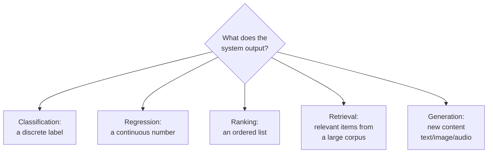

## Introduction

Before you can design a system, you need to correctly identify *what kind of problem* it's solving. This sounds obvious, but misclassifying the problem type is one of the fastest ways to derail an interview answer — proposing a classification metric (accuracy) for what's actually a ranking problem, for instance, leads to a design that quietly optimizes the wrong thing.

This chapter is a field guide to the five fundamental problem types you'll encounter across almost every AI system: **classification, regression, ranking, retrieval, and generation** — plus the increasingly important hybrid case of **agentic/decision-making** systems. Every case study in Part 14 is, underneath its business framing, one or a combination of these.

## The Five Fundamental Problem Types

### 1. Classification

**Question answered:** "Which category does this belong to?"

The model outputs a discrete label from a fixed set — binary (spam/not-spam, fraud/not-fraud) or multi-class (categorize a support ticket into one of 20 departments). Classification is the most common entry point into ML system design because its metrics (precision, recall, F1, AUC) are well understood and its failure modes (false positives vs false negatives) map cleanly onto business costs.

- **Examples**: spam detection, fraud detection, content moderation (toxic/not-toxic), churn prediction (will-churn/won't-churn), medical diagnosis screening.
- **Key design question**: what's the cost asymmetry between a false positive and a false negative? Blocking a legitimate transaction (false positive) and missing actual fraud (false negative) rarely have equal cost — this drives your choice of decision threshold, not just model architecture.

### 2. Regression

**Question answered:** "What numeric value should I predict?"

The output is a continuous number rather than a category — a price, a duration, a probability, a count. Regression problems often hide inside larger systems even when they're not the headline use case (e.g., predicting expected watch-time as an input signal to a ranking system).

- **Examples**: demand forecasting, estimated delivery time, house price prediction, predicted lifetime value (LTV), ETA prediction in ride-sharing.
- **Key design question**: is the error cost symmetric? Under-predicting delivery time by 10 minutes might frustrate a customer far more than over-predicting it by 10 minutes — this asymmetry should shape your loss function, not just your accuracy metric (e.g., using an asymmetric loss instead of plain MSE).

### 3. Ranking

**Question answered:** "In what order should these items be shown?"

Ranking doesn't just classify or score items independently — it produces a *relative ordering* optimized for what a user will engage with, purchase, or find relevant, typically under a position constraint (only the top-K items are seen). This is arguably the single most common problem type in consumer tech, powering search, feeds, and recommendations.

- **Examples**: search result ranking, news feed ranking, product recommendation ordering, ad ranking.
- **Key design question**: ranking metrics (NDCG, MRR, MAP) evaluate the *order* of results, not just whether individual predictions are correct — a model can have great per-item accuracy but poor ranking quality if it fails to correctly order items relative to each other. We cover this in depth in Chapter 21.

### 4. Retrieval

**Question answered:** "Which items, out of millions or billions, are even relevant candidates?"

Retrieval is often the unsung first stage of a two-stage system: before you can *rank* the top 10 results, you need to *retrieve* a manageable candidate set (say, 1,000 items) out of a much larger corpus (say, 100 million items) cheaply enough to run in real time. Retrieval has become central to modern AI systems because of RAG (Retrieval-Augmented Generation), where retrieving the right supporting documents directly determines the quality of an LLM's answer.

- **Examples**: the candidate-generation stage of a recommender, semantic/vector search, retrieving supporting documents for a RAG-based chatbot.
- **Key design question**: retrieval optimizes for *recall* over precision at this stage (don't miss a relevant item), because a downstream ranking stage will refine precision — conflating retrieval and ranking into a single stage is a common early-design mistake we'll unpack in Chapter 60.

### 5. Generation

**Question answered:** "What new content should the system produce?"

Unlike the previous four types, which select from a fixed or existing set of options, generation produces novel output — text, images, audio, or code — token by token or pixel by pixel. This is the category that has exploded with the rise of LLMs and diffusion models, and it introduces evaluation challenges the other four types don't have (there's often no single "correct" answer to compare against).

- **Examples**: LLM chat responses, text summarization, image generation, code generation/autocomplete, machine translation.
- **Key design question**: how do you evaluate quality without a single ground-truth answer? This drives the need for reference-free metrics, LLM-as-judge evaluation, and human evaluation — topics we cover in depth in Part 13.

## A Sixth, Hybrid Category: Sequential Decision-Making / Agents

Some systems don't fit neatly into a single prediction — they take a sequence of actions, observe the result, and decide the next action, often using tools along the way (an AI agent booking a flight, a recommendation system that adapts within a session, a bidding system in an ad auction). These systems typically combine several of the five fundamental types under the hood (e.g., an agent might use classification to decide "should I call a tool," retrieval to fetch context, and generation to produce a response) plus concepts from reinforcement learning and control. We dedicate all of Part 12 to this category, since it has become central to modern LLM-based products.

## Why This Classification Matters for System Design

Getting the problem type right changes almost every downstream decision:

| Problem Type | Typical Metric | Typical Latency Need | Typical Data Volume Concern |
|---|---|---|---|
| Classification | Precision/Recall/F1/AUC | Low-to-medium | Class imbalance |
| Regression | RMSE/MAE/MAPE | Low-to-medium | Outlier sensitivity |
| Ranking | NDCG/MRR/MAP | Very low (user-facing) | Position bias in labels |
| Retrieval | Recall@K, latency | Very low, at massive scale | Index freshness/size |
| Generation | BLEU/ROUGE/human eval/LLM-judge | Higher (autoregressive) | Reference-free evaluation |

A common interview trap: a candidate is asked to "design a recommendation system," treats it purely as classification ("will the user click, yes/no?"), and misses that the real system is a two-stage **retrieval + ranking** pipeline — leading to a design that can't scale to a large item catalog.

## A Worked Example: Same Business Problem, Different Framings

Take "reduce customer support ticket resolution time." This single business goal can be framed as *any* of the five problem types, and each framing leads to a completely different system:

- **Classification**: predict the ticket's category/urgency to route it to the right team.
- **Regression**: predict expected resolution time to set customer expectations.
- **Ranking**: rank suggested knowledge-base articles for the support agent, most relevant first.
- **Retrieval**: retrieve the most similar past resolved tickets to use as a reference.
- **Generation**: draft a suggested reply for the agent to review and send.

In practice, a mature support-AI system uses *all five* as different components working together — which is exactly why correctly identifying the problem type(s) at play, rather than picking just one, is a core system design skill.

## Key Takeaways

- Every AI system, underneath its business framing, is built from one or more of five fundamental problem types: classification, regression, ranking, retrieval, and generation.
- Misidentifying the problem type leads to the wrong metric, the wrong architecture, and often a design that can't scale (e.g., treating a large-catalog recommendation problem as pure classification instead of retrieval + ranking).
- Sequential decision-making/agentic systems are a hybrid category that combines several fundamental types with a control loop.
- A single business goal can often be decomposed into multiple problem-type framings, each addressing a different part of the system.

---

## Interview Questions

**1. What are the five fundamental problem types in AI systems, and how do you distinguish between them?**
Classification (output is a discrete label), regression (output is a continuous number), ranking (output is an ordering over a set of items), retrieval (output is a relevant subset selected from a much larger corpus), and generation (output is novel content, not selected from a fixed set). You distinguish them by asking what the model's raw output actually represents — a category, a number, an order, a subset, or newly created content.
*Follow-up: Which of these five is most often confused with another, and why?*
Ranking and classification are most commonly conflated — a naive approach frames "will the user click this item" as independent binary classification per item, missing that the true goal is a correctly *ordered* list, which requires ranking-specific metrics and often pairwise/listwise training objectives instead of simple per-item classification loss.

**2. Why is a large-catalog recommendation system typically designed as two stages (retrieval then ranking) rather than one?**
Running a complex, accurate ranking model over every single item in a catalog of millions is computationally infeasible within real-time latency budgets. Retrieval first cheaply narrows millions of items down to a few hundred or thousand plausible candidates (optimizing for recall — don't miss good items), and then a more expensive, more accurate ranking model reorders just that candidate set (optimizing for precision at the top positions).
*Follow-up: What's the risk of skipping the retrieval stage and just ranking the full catalog with a lighter-weight model to keep it fast?*
You'd sacrifice ranking quality across the board just to make the full-catalog pass feasible, whereas the two-stage design gets you a cheap-but-broad first pass and an expensive-but-narrow second pass — the combination outperforms a single medium-quality model at the same latency/compute budget.

**3. How does the choice of problem type affect what metric you'd propose in an interview?**
Classification calls for precision/recall/F1/AUC depending on class balance and error cost asymmetry; regression calls for RMSE/MAE/MAPE depending on outlier sensitivity; ranking calls for order-aware metrics like NDCG/MRR/MAP rather than plain accuracy; retrieval calls for Recall@K and latency; generation calls for reference-based metrics (BLEU/ROUGE) plus increasingly LLM-as-judge or human evaluation, since there's rarely one correct output.
*Follow-up: Why would using plain accuracy be a mistake for a ranking problem, even if each individual prediction is fairly accurate?*
Accuracy treats each item's prediction independently and ignores position — a model could correctly predict relevance for every item yet still produce a poorly ordered list if it doesn't correctly rank *relative* relevance, which is exactly what NDCG and similar rank-aware metrics are designed to capture.

**4. What is the "cost asymmetry" consideration in classification problems, and how does it change your design?**
Cost asymmetry is the recognition that a false positive and a false negative often have very different real-world costs — e.g., in fraud detection, missing real fraud (false negative) might cost far more than incorrectly flagging a legitimate transaction (false positive), or vice versa depending on the business. This asymmetry should directly inform your decision threshold (not just the raw model score) and sometimes your choice of loss function during training (e.g., weighting the minority/costlier class more heavily).
*Follow-up: How would you determine the "right" decision threshold in practice, rather than defaulting to 0.5?*
Analyze the precision-recall trade-off curve and pick the threshold that best matches the actual business cost of each error type, often by explicitly assigning a dollar (or other unit) cost to false positives and false negatives and choosing the threshold that minimizes total expected cost, then validating that choice with an online experiment.

**5. Give an example of a regression problem where a symmetric loss function (like MSE) would be the wrong choice, and explain why.**
Delivery time (ETA) prediction: underestimating delivery time (telling a customer 20 minutes when it actually takes 40) creates a broken promise and customer frustration, while overestimating (telling them 40 minutes when it takes 20) is a pleasant surprise with much lower cost. A symmetric loss like MSE penalizes both errors equally, so you'd instead use an asymmetric loss function that penalizes underestimation more heavily, aligning the trained model's behavior with the true business cost structure.
*Follow-up: Are there regression problems where MSE actually is the right choice? Give an example.*
Yes — house price prediction, where being $10K too high or $10K too low both have roughly similar practical impact on a buyer/seller's decision-making, makes symmetric loss functions like MSE or MAE reasonable defaults absent other business context suggesting an asymmetry.

**6. What's the difference between retrieval and ranking, and why does confusing the two lead to a poor system design?**
Retrieval selects a relevant subset from a very large corpus, optimizing primarily for recall (not missing good candidates) under a tight latency/compute budget; ranking then orders that smaller subset by relevance, optimizing for precision at the top of the list, and can afford to be computationally heavier since it only operates on a small candidate set. Confusing them leads candidates to propose running an expensive ranking model directly over an entire large catalog, which either fails to meet latency requirements at scale or forces an unnecessarily simplistic model just to make that feasible.
*Follow-up: In a RAG system, which stage — retrieval or ranking (often called "re-ranking" there) — has historically received more optimization attention, and why is that changing?*
Retrieval (via vector search/embeddings) historically received the most attention since it was the novel piece enabling RAG at all; re-ranking is now receiving increasing attention because raw vector similarity search alone often surfaces topically related but not truly answer-relevant documents, and a dedicated re-ranking model applied to the top retrieved candidates meaningfully improves the final answer quality — this is covered in depth in Chapter 63.

**7. Why is evaluating generation problems fundamentally harder than evaluating classification or regression problems?**
Classification and regression have a single correct (or numerically close) ground-truth answer to compare against for each example, enabling simple, automatable metrics. Generation problems (summarization, chat responses, translation) often have many valid correct answers with different wording, so simple string-overlap metrics (BLEU/ROUGE) only weakly correlate with actual quality, requiring either human evaluation or an LLM-as-judge approach to approximate human judgment at scale.
*Follow-up: What's a risk of relying entirely on LLM-as-judge evaluation for a generation system, without any human evaluation?*
The judge model can share the same blind spots or biases as the model being evaluated (e.g., both preferring longer or more confident-sounding responses regardless of actual correctness), and it can be gamed or drift over time without a human baseline to periodically validate that its judgments still align with actual user satisfaction.

**8. How would you frame "predicting customer lifetime value (LTV)" — as classification, regression, or ranking — and what would drive that choice?**
It's most naturally a regression problem if you need the actual predicted dollar value (e.g., for financial forecasting or setting a customer acquisition cost ceiling), but it can be framed as ranking if the actual downstream use is only to prioritize which customers to target with a retention campaign (in which case you only need the *relative order* of customers by value, not the precise dollar figure). The choice depends entirely on how the output will be consumed downstream.
*Follow-up: If the downstream use is ranking customers for a limited-budget retention campaign, why might a ranking-optimized model outperform a regression model even on that specific task?*
A ranking-optimized model directly optimizes for correctly ordering customers relative to each other (which is exactly what the campaign selection needs), whereas a regression model optimized for absolute dollar-value accuracy might get the relative order wrong for customers in the middle of the value range even while achieving a lower overall numeric error, since minimizing absolute error doesn't guarantee preserving relative order.

**9. What makes agentic/sequential decision-making systems a "hybrid" category rather than a sixth fundamental type?**
Because under the hood, an agent's individual decisions typically map onto one of the five fundamental types — deciding "should I call a tool" is a classification decision, retrieving relevant context is a retrieval operation, producing the final response is generation — combined with an explicit control loop (observe → decide → act → observe again) borrowed from reinforcement learning/control theory. It's the composition and sequencing of the fundamental types, not a wholly separate kind of prediction.
*Follow-up: What specifically does the "control loop" add on top of the fundamental problem types that isn't present when you use them individually?*
State management across multiple steps (remembering what's already been tried or learned within the episode) and a decision about when to stop or continue — neither of which exists in a single-shot classification, regression, ranking, retrieval, or generation call, since those are all stateless, one-time predictions given their input.

**10. How does correctly identifying the problem type help you clarify requirements faster in an interview?**
Once you name the problem type, you immediately know which follow-up questions matter — for ranking, you'd ask about position bias and how many results are shown; for retrieval, you'd ask about corpus size and freshness requirements; for generation, you'd ask about acceptable latency for autoregressive decoding and how correctness/quality will be judged. This turns generic "requirements gathering" into a targeted, efficient conversation.
*Follow-up: What's a clarifying question specific to retrieval problems that wouldn't make sense to ask for a classification problem?*
"How large and how frequently updated is the corpus we're retrieving from?" — this directly affects index architecture and update strategy (e.g., approximate nearest neighbor index rebuild frequency), a concern that simply doesn't exist for a classification problem operating on a fixed feature vector per example.

**11. Can a single AI system involve multiple problem types simultaneously? Give a concrete example.**
Yes — a search engine typically combines retrieval (find candidate documents matching the query from a massive index), ranking (order those candidates by relevance), and increasingly generation (an AI-generated summary answer at the top of the results, as in modern search engines' AI overviews). Each stage has its own metrics, latency budget, and failure modes, even though they compose into one user-facing feature.
*Follow-up: Why is it important to design and evaluate each stage of such a multi-stage system separately, rather than only evaluating the final end-to-end output?*
Evaluating only the end-to-end output makes it hard to diagnose *where* a problem originates — a poor final answer could stem from retrieval missing the right document, ranking demoting it, or the generation stage misrepresenting it — whereas stage-specific metrics (Recall@K for retrieval, NDCG for ranking, faithfulness for generation) let you isolate and fix the actual bottleneck.

**12. Why do interviewers sometimes intentionally give an ambiguous prompt (e.g., "design a system to improve user engagement") that could map to several problem types?**
To see whether you'll proactively identify and articulate the possible framings, ask which one the business cares about most, and justify your choice — rather than silently picking one interpretation and hoping it's the one they had in mind. This tests problem-framing skill, which is a distinct and highly valued competency separate from knowing how to build any single one of the systems.
*Follow-up: If the interviewer says "I want you to decide," what's a strong way to make and justify that decision on the spot?*
Pick the framing most directly tied to a measurable, common business lever (e.g., ranking for a feed, since engagement is most directly influenced by what content is shown first) and state your reasoning briefly, while noting the other framings (e.g., generation for personalized notifications) as complementary approaches you'd consider in a fuller system.

**13. How does class imbalance typically manifest differently across classification, ranking, and retrieval problems?**
In classification, class imbalance (e.g., 0.1% fraud rate) can cause a naive model to just predict the majority class and still score high on raw accuracy, requiring careful metric choice (precision/recall over accuracy) and resampling/weighting techniques. In ranking, the analogous issue is that only a tiny fraction of shown items get positive engagement, requiring careful negative sampling during training rather than treating all non-clicked items as equally "negative." In retrieval, imbalance shows up as most of the corpus being irrelevant to any given query, which is precisely why retrieval optimizes for a completely different regime (approximate search over huge negative sets) than classification's typical balanced-ish training approach.
*Follow-up: Why can't you simply undersample the majority class in a ranking or retrieval context the same way you might in a classification context?*
Because in ranking and retrieval, the "majority class" (non-relevant items) *is* the space you need the model to correctly discriminate against at serving time across the full corpus — undersampling it during training risks the model failing to distinguish subtly-irrelevant-but-similar items from truly relevant ones in production, where it must correctly rank/retrieve against the full, imbalanced real-world item set.

**14. What role does "problem type" play in deciding your training data collection strategy?**
Classification and regression need explicit or implicit labels per example (this happened / this value was observed). Ranking needs relative preference signals, often derived from position-normalized click data or explicit pairwise comparisons, since absolute per-item labels alone don't capture ordering preference. Retrieval needs query-document relevance pairs, often bootstrapped from click-through data or human relevance judgments. Generation needs either reference outputs for supervised fine-tuning or preference/comparison data (for techniques like RLHF) rather than single "correct" labels.
*Follow-up: Why is click data alone often insufficient as a ranking training signal without additional correction?*
Click data suffers from position bias — items shown higher get clicked more often regardless of true relevance, simply because users see them first — so raw click data must be corrected (e.g., via inverse propensity weighting or randomized exploration data) before being used as an unbiased ranking training signal, a topic we return to in Chapter 21.

**15. If you were mentoring a junior engineer who kept defaulting to "classification" for every new problem, what would you tell them to watch for?**
I'd tell them to ask two questions before framing any problem: "does the output need to be an ordering over multiple items, not just a per-item label?" (a sign it's ranking, not classification) and "does the output need to be selected from an enormous, possibly unbounded set, or newly created rather than chosen from a fixed small set of labels?" (a sign it's retrieval or generation, not classification). Classification is often the most familiar hammer, but many real business problems — especially anything involving showing users an ordered list or a large catalog — are actually ranking or retrieval problems in disguise, and treating them as plain classification leads to metrics and architectures that don't match how the system is actually used.
*Follow-up: What's a good habit to build to catch this mistake early, before it shapes an entire system's design?*
Always explicitly write down, before choosing a model or metric, exactly what the system's output will be consumed as by the next component or the end user (a single flag used to gate an action? an ordered list a user scrolls through? a document set to feed an LLM?) — since the *consumption pattern* almost always reveals the true problem type, even when the initial business framing obscures it.
