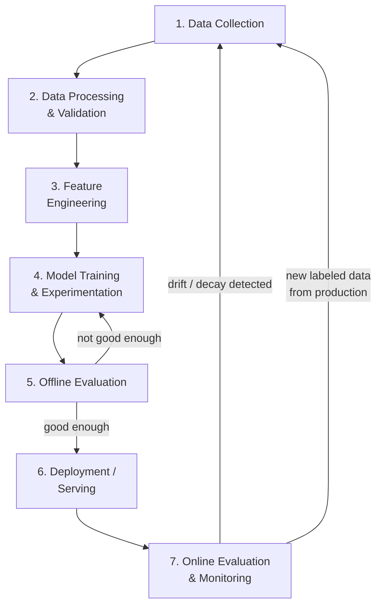
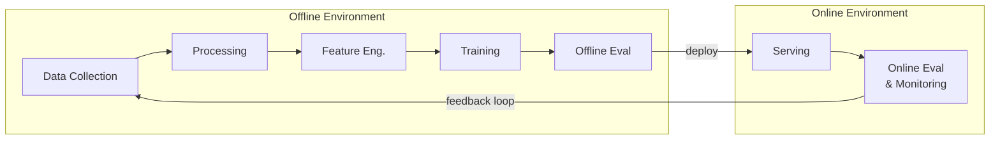

## Introduction

Chapter 1 previewed the shape of an AI system as a loop: data → training → serving → monitoring → back to data. This chapter unpacks each stage of that loop in detail, because the rest of this series (Parts 2 through 7) is essentially a deep dive into one stage at a time. Understanding the lifecycle as a *whole* first gives you the map you'll need before we zoom into any single region of it.

## The Full Lifecycle

Let's walk through each stage, what decisions it forces you to make, and how it connects to the next.

### Stage 1 — Data Collection

Everything downstream depends on this stage, and it's the one most often underestimated in interviews. Data can come from several sources: **explicit** signals (user ratings, form submissions, human-labeled annotations) or **implicit** signals (clicks, dwell time, purchases, skips). Each source has trade-offs — explicit labels are cleaner but sparse and effortful for users to provide; implicit signals are abundant but noisy and prone to bias (e.g., position bias in clicks, covered in Chapter 21).

Key questions at this stage: How much data is realistically available? Is it labeled, or does it need a labeling pipeline (human annotators, weak supervision, or bootstrapped from existing heuristics)? Is there a cold-start problem — a brand-new product or feature with no historical data at all?

### Stage 2 — Data Processing & Validation

Raw data is rarely training-ready. This stage handles cleaning (deduplication, handling missing values), schema validation (catching upstream changes that silently break a field), and detecting quality issues (label noise, outliers, class imbalance) before they propagate into a trained model. A recurring lesson in production ML: silent data quality issues are far more common, and far more damaging, than model bugs — we dedicate all of Chapter 12 to this.

### Stage 3 — Feature Engineering

This is where raw fields become the actual inputs a model consumes: normalizing numeric fields, encoding categorical variables, computing aggregates (e.g., "average order value over last 30 days"), and increasingly, generating embeddings from raw text/image/user-behavior data. The critical system design concern introduced here is **training-serving consistency** — whatever logic computes a feature for training must produce an identical value when computing that same feature at serving time, which is the entire reason feature stores exist (Chapter 13).

### Stage 4 — Model Training & Experimentation

Here you select an algorithm, tune hyperparameters, and iterate through experiments — usually many of them, tracked systematically (Chapter 26) rather than in scattered notebooks. This stage is the most visible part of "ML" to outsiders, but in a mature production system it typically represents a modest fraction of total engineering effort compared to the surrounding stages.

### Stage 5 — Offline Evaluation

Before anything reaches a real user, the trained model is evaluated against a held-out dataset it never saw during training. This stage answers "is this candidate model even good enough to consider deploying?" using metrics matched to the problem type (Chapter 3). A model that fails offline evaluation loops back to Stage 4 rather than proceeding — offline evaluation is the first and cheapest gate against shipping a bad model.

### Stage 6 — Deployment / Serving

A model that passes offline evaluation is packaged and deployed into a serving system that can handle real production traffic within latency and reliability requirements. This stage is rarely a single "flip the switch" event — it typically follows the staged rollout pattern from Chapter 2 (shadow → small A/B test → gradual ramp-up), which is why Stage 6 and Stage 7 are tightly coupled in practice.

### Stage 7 — Online Evaluation & Monitoring

Once live, the system's real-world behavior is continuously measured: online metrics (Chapter 2's second metric tier), infrastructure health (latency, error rates), and — uniquely to ML systems — statistical health of the model itself (input feature drift, output prediction drift, and downstream business metric movement). This is the stage that closes the loop: monitoring surfaces both problems (drift, decay) that send you back to Stage 1 for a fix, and fresh labeled data (from real user interactions) that becomes tomorrow's training set.

## Why This Is a Loop, Not a Pipeline

A one-time pipeline runs once and produces a final artifact. The AI system lifecycle never truly finishes, for two structural reasons:

1. **The world the model was trained on keeps changing** (new users, new products, new fraud tactics, seasonal shifts) — so a model trained on last year's data steadily becomes less representative of this year's reality, a phenomenon called concept drift, which we formalize in Chapter 32.
2. **Production traffic itself generates new data** — every prediction the system makes, and every outcome that follows (a user clicked or didn't, a transaction was confirmed fraudulent or not), becomes a new labeled example that can improve the next model version.

An AI system that doesn't close this loop — that trains once and never revisits Stage 1 — will, without exception, degrade over time even if it was excellent at launch. This is the single most important structural difference between AI systems and traditional software systems, and it's why Chapter 1 emphasized that "launch" is not the finish line.

## Offline vs Online: Two Parallel Environments

It's worth being explicit that Stages 1-5 typically run in an **offline environment** (batch jobs, training clusters, experimentation notebooks) while Stages 6-7 run in an **online environment** (production serving infrastructure, real user traffic). Keeping these environments *consistent* — especially around feature computation — is one of the most common sources of production bugs in ML systems, and is the direct motivation for feature stores and shared feature-computation code, which we'll cover in depth in Part 3.

## How Ownership Typically Splits Across a Team

In a mature organization, different stages of the lifecycle are often owned by different roles (tying back to Chapter 1's role landscape):

- **Data engineers**: Stages 1-2 (collection, processing, validation pipelines)
- **ML engineers / applied scientists**: Stages 3-5 (features, training, offline evaluation)
- **ML engineers / platform engineers**: Stage 6 (serving infrastructure, deployment tooling)
- **ML engineers / SRE-adjacent roles**: Stage 7 (monitoring, alerting, incident response)

In practice these boundaries blur constantly, and knowing where handoffs typically occur (and where things typically break at those handoffs) is a valuable thing to mention in an interview — it shows you've thought about the lifecycle as an organizational process, not just a technical diagram.

## Key Takeaways

- The AI system lifecycle has seven stages: collection, processing/validation, feature engineering, training, offline evaluation, deployment/serving, and online evaluation/monitoring.
- It's a loop, not a pipeline — production feedback (both new data and detected decay) continuously feeds back into Stage 1.
- The lifecycle spans two environments (offline and online) that must stay consistent, especially in feature computation.
- Understanding which stage owns which failure mode helps you localize problems quickly, both in real systems and in interview answers.

---

## Interview Questions

**1. Walk me through the full AI system lifecycle, stage by stage.**
Data collection (gathering raw signals, explicit or implicit) → data processing and validation (cleaning, schema checks, quality gates) → feature engineering (transforming raw data into model inputs) → model training and experimentation → offline evaluation against held-out data → deployment/serving into production → online evaluation and monitoring, which feeds back into data collection, closing the loop.
*Follow-up: Which two stages, if merged or confused, most commonly cause production bugs?*
Feature engineering (offline) and the equivalent feature computation at serving time (online) — if these aren't unified through a shared system like a feature store, training-serving skew results, where the model receives different feature values in production than it learned from during training.

**2. Why is the AI system lifecycle described as a loop rather than a linear pipeline?**
Because production behavior generates two things that flow back into the start of the lifecycle: new labeled data from real user outcomes (which can be used to retrain and improve the model), and monitoring signals that reveal drift or decay (which trigger the need for new data collection, relabeling, or retraining). A linear pipeline that runs once and stops would leave the model to silently degrade as the real-world data distribution shifts away from what it was trained on.
*Follow-up: What would happen to a production ML system if this loop were deliberately never closed — i.e., the team never retrains and never monitors after initial launch?*
The model's accuracy would degrade gradually and invisibly as concept drift accumulates (user behavior evolves, new categories/patterns emerge that the model never saw), with no automatic signal that anything is wrong, until the degradation becomes visible in downstream business metrics — often only after significant, hard-to-diagnose damage has occurred.

**3. What's the difference between the "offline environment" and the "online environment" in the ML lifecycle, and why does keeping them consistent matter?**
The offline environment covers data processing, feature engineering, training, and evaluation — typically run as batch jobs against historical data. The online environment covers serving and monitoring — running against live traffic in real time. They must stay consistent, especially in feature computation logic, because any divergence (training-serving skew) causes the model to receive different inputs in production than it learned to expect during training, silently degrading its real-world accuracy even though the model itself hasn't changed.
*Follow-up: What's a concrete engineering pattern that enforces this consistency rather than relying on developer discipline?*
A feature store that exposes a single feature computation definition, materialized to both an offline store (for training, computed in batch over historical data) and an online store (for low-latency serving lookups) — so both paths pull from the same underlying logic rather than two independently maintained implementations.

**4. At what stage of the lifecycle would you catch a labeling error that was introduced by an annotation vendor, and how?**
Ideally at Stage 2 (data processing & validation), through automated data quality checks — e.g., comparing label distributions against expected historical baselines, flagging anomalous spikes in a particular label, or running inter-annotator agreement checks on a sample. If it slips past Stage 2, it would typically surface at Stage 5 (offline evaluation) as an unexpected drop in validation performance, or worse, only at Stage 7 (online monitoring) as a real production accuracy issue — each stage later in the pipeline makes the error more expensive to diagnose and fix.
*Follow-up: Why is it significantly more expensive to catch a data quality issue at Stage 7 versus Stage 2?*
By Stage 7, the bad data has already been used to train a deployed model affecting real users/business metrics, and diagnosing the root cause requires working backward through training, feature engineering, and processing to eventually find the original data issue — versus catching it at Stage 2, where the fix is immediate (reject or correct the bad batch) and no downstream artifact has yet been built on top of the corrupted data.

**5. How does the ownership of different lifecycle stages typically split across a team, and why does this matter for identifying where systems break?**
Data engineers typically own collection and processing; ML engineers or applied scientists own feature engineering, training, and offline evaluation; platform or ML engineers own serving infrastructure; and monitoring is often shared between ML engineers and SRE-adjacent roles. This matters because handoffs between differently-owned stages (e.g., a data scientist's notebook feature logic being reimplemented by an ML engineer for production) are disproportionately common sources of bugs, specifically because no single person sees the full lifecycle end to end.
*Follow-up: What organizational practice helps reduce bugs at these ownership handoffs?*
Shared infrastructure and contracts across the handoff points — e.g., a feature store that both the data science and ML engineering teams read from and write to using the same interface, or a model registry with a standardized metadata schema — so the handoff is a well-defined, testable contract rather than an informal, easily-mismatched translation between teams.

**6. What triggers a system to move from Stage 7 (monitoring) back to Stage 1 (data collection), and what are the two distinct triggers?**
Two distinct triggers exist: (1) detected drift or decay — the monitoring system observes that live data or model output distributions have shifted meaningfully from training-time baselines, or that a business metric has degraded, prompting a need for fresh, more representative data; and (2) routine accumulation of new labeled data from normal production operation — every real user interaction and outcome is a potential new training example, independent of whether decay has been detected, supporting regularly scheduled retraining even absent an emergency.
*Follow-up: Should a system only retrain reactively (triggered by detected drift) or also on a fixed schedule? Why?*
Both — reactive retraining catches sudden, unexpected shifts (e.g., a new fraud pattern), while scheduled retraining (e.g., weekly or monthly) captures the slow, continuous accumulation of new representative data and gradual concept drift that might not individually trigger an alert threshold but compounds over time if left unaddressed; relying on only one strategy leaves a real gap.

**7. Why is offline evaluation (Stage 5) described as "the first and cheapest gate" against shipping a bad model?**
Because it happens entirely within the offline environment, against historical data, before any real user or production system is exposed to the new model — a model that fails here is simply sent back for more training/tuning at negligible cost. Every stage after this point (shadow deployment, A/B testing, full rollout) involves progressively more real-world exposure and progressively higher cost if the model turns out to be flawed, so catching problems as early as possible in this sequence is a core system design principle.
*Follow-up: Can a model pass offline evaluation with strong metrics and still fail at Stage 7? Why doesn't offline evaluation catch everything?*
Yes — offline evaluation is limited to the historical data distribution it was tested against, and cannot capture live phenomena like feedback loops (the model's own predictions changing future user behavior), real-time infrastructure issues (latency under production load), or genuinely new patterns that didn't exist in the historical data at all; this is exactly why online evaluation and monitoring remain necessary even after strong offline results.

**8. How would you explain the concept of "concept drift" using the lifecycle framework from this chapter?**
Concept drift is what happens when Stage 1's snapshot of the world (the training data) becomes an increasingly inaccurate representation of the world the model faces in Stage 6/7 (production), because the underlying relationship between inputs and outputs has genuinely changed over time — not just a temporary anomaly. In lifecycle terms, it's the reason the loop from Stage 7 back to Stage 1 must exist: without it, the growing gap between training-time and serving-time reality would never be corrected.
*Follow-up: How would you distinguish concept drift from a one-off data quality bug using monitoring signals?*
A data quality bug typically shows up as a sudden, sharp anomaly (e.g., a spike of null values or an obviously malformed feature) tied to a specific upstream change, whereas concept drift shows up as a gradual, sustained shift in the statistical relationship between features and the true outcome over weeks or months — distinguishing them usually requires looking at the trend shape and correlating it with known upstream deployments versus broader environmental changes (seasonality, market shifts, user behavior evolution).

**9. If you had a limited engineering budget and could only invest heavily in improving one stage of the lifecycle, which would you pick for a brand-new AI product with almost no existing data, and why?**
Stage 1 (data collection) — for a cold-start product, no amount of sophisticated modeling, feature engineering, or serving infrastructure compensates for insufficient or low-quality data, since every downstream stage is bottlenecked by what Stage 1 provides. Establishing a solid data collection and labeling strategy (even if initially manual or heuristic-driven) creates the raw material every later investment depends on.
*Follow-up: How would your answer change for a mature product that already has years of high-quality data but is currently experiencing repeated production incidents?*
I'd shift investment toward Stage 7 (monitoring) and Stage 6 (serving/deployment safety mechanisms like canary releases and automated rollback) — with abundant good data already available, the marginal value of yet more data collection is lower than the marginal value of catching and containing production issues before they cause significant business impact.

**10. What's a common mistake teams make regarding Stage 3 (feature engineering) when transitioning a model from a research/notebook environment to production?**
They reimplement the feature computation logic separately for the production serving path (often in a different language or framework than the original notebook/training code), introducing subtle discrepancies — different rounding behavior, different handling of missing values, different time-window boundaries for aggregates — between what the model saw during training and what it receives in production. This is the classic training-serving skew failure mode.
*Follow-up: What's the most robust long-term fix for this, versus a short-term workaround?*
The robust long-term fix is a shared feature store or feature computation library used by both training and serving paths, so there's only ever one implementation of each feature's logic; a short-term workaround (e.g., careful manual code review and integration testing comparing offline and online feature values) reduces risk but doesn't eliminate the structural risk of maintaining two separate implementations indefinitely.

**11. How does the lifecycle differ (if at all) when the "model" is actually a pre-trained foundation model (like an LLM) rather than something trained from scratch?**
Stages 3-4 (feature engineering and training) shrink dramatically or disappear entirely for the base model, since you're typically not training an LLM in-house — instead, "adaptation" (prompt engineering, RAG, or fine-tuning) takes their place. Stages 1-2 shift focus toward curating retrieval corpora, few-shot examples, or fine-tuning datasets rather than classical labeled training sets. Stages 5-7 (evaluation, serving, monitoring) remain structurally similar but gain LLM-specific concerns (hallucination evaluation, token-cost monitoring, context-window management).
*Follow-up: Does the "loop back to Stage 1" concept still apply for an LLM-based system that isn't being retrained from scratch?*
Yes — the loop still applies but manifests differently: production interactions (user feedback, flagged bad responses, new documents) feed back into improving the retrieval corpus, refining prompts/few-shot examples, or curating fine-tuning data, rather than directly retraining model weights from scratch; the underlying principle (production feedback should continuously improve the system) is unchanged even though the mechanism differs.

**12. Why might a company deliberately choose to run Stage 6 (deployment) less frequently than Stage 4 (training/experimentation)?**
Frequent experimentation and offline evaluation is relatively low-risk and cheap (it doesn't touch production), so teams can and should iterate quickly at that stage. Deployment, by contrast, carries real risk to users and business metrics, so companies often batch up validated improvements and deploy them on a more controlled, less frequent cadence (e.g., weekly releases with a full staged rollout) even if new candidate models are being trained and evaluated daily — decoupling the pace of experimentation from the pace of production risk exposure.
*Follow-up: What infrastructure or process would let a company safely increase deployment frequency without proportionally increasing risk?*
Strong automation around the staged rollout process from Chapter 2 (automated shadow deployment, automated statistical significance checks for A/B tests, automated rollback triggers on metric regression) — this is a core goal of MLOps/CI-CD-CT practices covered in Part 7, letting deployment frequency scale up because the safety checks are automated rather than manual and slow.

**13. How would you use this lifecycle framework to structure a post-incident review after a production ML model caused a significant business metric regression?**
Walk backward through the seven stages to localize where the problem originated: Did monitoring (Stage 7) fail to catch it, or did it catch it too late? Was it a deployment/rollout process gap (Stage 6) — e.g., skipping the shadow or A/B testing step? Was the model actually fine but received bad features due to a skew issue (Stage 3)? Or did the training data itself have a quality issue (Stages 1-2) that offline evaluation (Stage 5) failed to catch? This structured walk-back both finds the root cause faster and reveals which stage's safeguards need strengthening to prevent recurrence.
*Follow-up: Why is it valuable to identify not just "what broke" but "which stage's safeguard should have caught it," in a postmortem?*
Because fixing the immediate symptom (e.g., rolling back the bad model) doesn't prevent a similar future issue from a different root cause; identifying which stage's safeguard failed (e.g., "offline evaluation didn't include a test for this edge case" or "the rollout skipped the shadow-deployment stage") lets you strengthen the systemic guardrail itself, addressing an entire class of future failures rather than just the one instance.

**14. Some candidates describe the lifecycle as a straight pipeline in interviews and never mention feedback loops. How significant is this omission, and why?**
It's a significant gap, because it signals the candidate is thinking about ML as a one-time software delivery project rather than a continuously operating system — which is precisely the mental model shift that separates junior ML engineering thinking from senior ML system design thinking. Interviewers specifically listen for whether a candidate volunteers the feedback loop (new data from production, drift-triggered retraining) without being explicitly prompted, since real production ML failures overwhelmingly stem from teams that built the pipeline once and never closed the loop.
*Follow-up: If you notice mid-answer that you've described the lifecycle as linear, how would you correct course gracefully?*
Explicitly circle back: "One thing I should add — this isn't actually a one-time pipeline; the monitoring stage feeds back into data collection both when we detect drift and just from normal production data accumulating, so the system keeps improving and adapting over time," which both fixes the gap and demonstrates self-awareness about the completeness of your own answer.

**15. How does the "two parallel environments" (offline/online) framing help you reason about latency requirements in a system design interview?**
It clarifies that only the online environment's stages (serving, and any real-time components of monitoring) are subject to strict user-facing latency requirements (e.g., sub-100ms) — the offline environment's stages (data processing, training, offline evaluation) can typically run as batch jobs over minutes to hours without directly impacting user experience. This distinction prevents a common mistake of over-optimizing training pipeline speed at the expense of serving latency, or vice versa, when they actually have very different constraints.
*Follow-up: Are there cases where the offline environment does have meaningful latency/freshness requirements, despite not being user-facing in real time?*
Yes — for use cases requiring near-real-time model freshness (e.g., a fraud model that needs to incorporate patterns from transactions just minutes old, or a trending-content ranker), the offline pipeline itself needs low end-to-end latency (streaming feature computation and frequent incremental retraining) even though no single user request waits on it directly — this blurs the offline/online line and is a major theme we return to in Chapter 5 on batch vs streaming systems.
