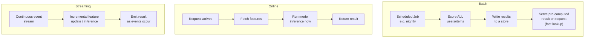
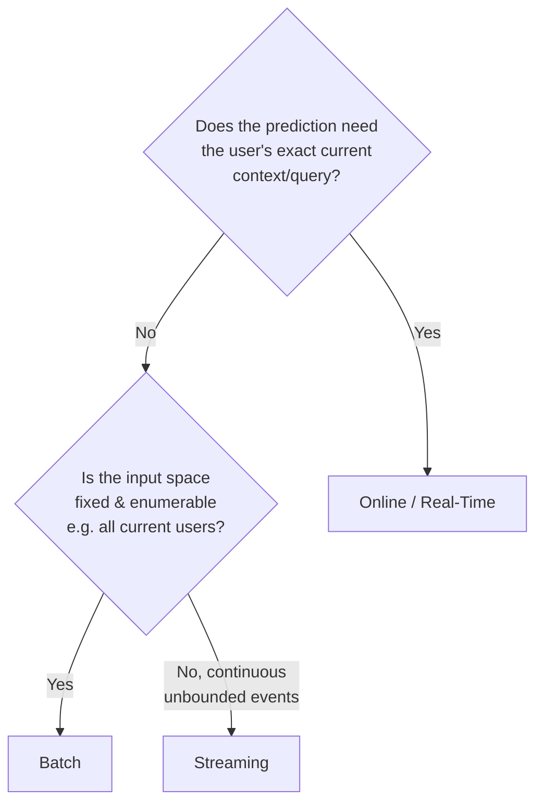

## Introduction

One of the earliest and highest-leverage decisions in any AI system design is *when* predictions get made: ahead of time in bulk, on-demand the instant a request arrives, or continuously as new data streams in. This single decision shapes your entire architecture — storage layout, infrastructure cost, latency profile, and even how "fresh" the model's view of the world can be.

This chapter builds the decision framework you'll use throughout the series (especially in the Part 14 case studies) to choose between **batch**, **online (real-time)**, and **streaming** inference.

## The Three Paradigms

### Batch Inference

Predictions are computed **ahead of time**, for all relevant entities at once, on a fixed schedule (hourly, nightly, weekly). The results are written to a fast-lookup store (a key-value store, a database table), and at request time the system simply reads a pre-computed value rather than running the model live.

- **Strengths**: cheap and simple to operate (no low-latency serving infrastructure needed for the model itself), easy to debug (you can inspect the full batch output before it's used), works well when the input space is well-defined and finite (a fixed list of users/items).
- **Weaknesses**: predictions can be stale by the time they're used (hours or a day old), can't react to real-time context (a search query, current cart contents, this exact session's behavior), and total compute cost scales with the *entire* population, even entities that never end up being queried.
- **Examples**: nightly churn-risk scores for every customer, weekly product recommendation lists refreshed once a day, monthly credit risk re-scoring.

### Online (Real-Time) Inference

Predictions are computed **on-demand**, the moment a request arrives, using the freshest available context (the actual query, the current session, real-time features). This requires a low-latency serving path: the model itself, plus any feature lookups, must complete within the request's latency budget (often tens of milliseconds).

- **Strengths**: uses the most current context available, only computes predictions for entities that are actually requested (no wasted compute on the full population), naturally supports personalization based on in-the-moment signals.
- **Weaknesses**: requires investment in low-latency serving infrastructure (model optimization, caching, possibly GPU inference), harder to debug in the moment (predictions aren't pre-computed and inspectable), and a slow model directly and immediately hurts user experience.
- **Examples**: search ranking for a live query, fraud scoring at the moment of a transaction, an LLM chatbot responding to a live message.

### Streaming Inference

Predictions or feature updates happen **continuously**, incrementally, as new events arrive on a stream (e.g., Kafka), rather than waiting for either a scheduled batch job or an explicit user request. Streaming is often used to keep features fresh for a downstream online system, or to make continuous decisions on an event-by-event basis (e.g., flagging every transaction as it occurs).

- **Strengths**: keeps data/features nearly as fresh as real-time without paying the cost of computing everything on-demand per request; naturally suited to event-driven, high-volume, continuous data (transaction streams, clickstreams, sensor data).
- **Weaknesses**: the most operationally complex of the three paradigms (requires stream processing infrastructure — Kafka, Flink, Spark Streaming — and careful handling of out-of-order events, late data, and exactly-once processing semantics).
- **Examples**: continuously updating a "user's last 10 actions" feature for a recommender, real-time anomaly detection on IoT sensor data, live trending-topic detection on a social feed.

## A Practical Decision Framework

Ask, in order:
1. **Does this prediction fundamentally depend on real-time context that doesn't exist until the moment of the request** (the exact search query, the current shopping cart, this specific message)? If yes → **online**.
2. If not, **is the set of entities to predict for fixed and enumerable** (e.g., "all 5 million current customers")? If yes, and freshness of hours-to-a-day is acceptable → **batch**.
3. If the entities/events are continuous and unbounded (an ongoing transaction stream, a live clickstream) and you need near-real-time freshness without paying full online-inference cost per request → **streaming** (often used to keep a feature fresh, feeding into an online system's feature lookup).

## Hybrid Architectures Are the Norm, Not the Exception

In practice, most mature production AI systems combine all three paradigms rather than picking just one:

- A **recommendation system** might batch-compute a candidate list of 500 items overnight (batch), narrow and personalize it in real time based on the current session (online), while a streaming pipeline continuously updates each user's "recently viewed" feature that both the batch and online stages read from (streaming).
- A **fraud detection system** might use streaming to maintain up-to-the-second aggregate features (e.g., "transaction count in the last 5 minutes"), online inference to score each transaction the instant it occurs using those fresh features, and a batch job to periodically retrain the model itself on the last 30 days of transactions.

This is why the decision framework above should be applied *per component of the system*, not once for the entire system — a strong interview answer explicitly identifies which pieces need which paradigm rather than declaring the whole system "batch" or "real-time."

## Latency Budgets in Practice

A useful mental anchor for online/streaming latency budgets:

| Latency Budget | Typical Use Case |
|---|---|
| < 10ms | In-memory feature lookup, simple model (logistic regression) |
| 10-100ms | Typical online ML inference (gradient boosted trees, small neural nets), most API-facing predictions |
| 100ms - 1s | Complex models, multiple feature store round-trips, ensemble models |
| 1s - several seconds | LLM generation (autoregressive decoding), complex multi-stage pipelines |
| Minutes to hours | Streaming feature updates (near-real-time, not truly instantaneous) |
| Hours to a day | Batch inference jobs |

Notice that LLM-based systems (Part 8 onward) often sit in an unusual spot: users tolerate multi-second response times for generation (unlike a 10ms search ranking call), but the underlying infrastructure challenges (batching requests, managing GPU memory, streaming tokens back as they're generated) are unique to this latency band, which is why Part 10 is dedicated entirely to LLM inference and serving.

## Cost Implications

Batch inference's cost scales with **the size of the full population**, regardless of how many predictions are actually used (you compute a score for every user overnight, whether or not they log in that day). Online inference's cost scales with **the number of actual requests**, but each request costs more per unit (you need always-on, low-latency infrastructure, often over-provisioned for peak load). Streaming's cost sits in between and includes the ongoing infrastructure overhead of the stream processing platform itself, independent of the actual data volume most of the time.

A common interview discussion point: for a feature only 2% of users engage with daily, is it worth the operational overhead of real-time online inference for the other 98% who'll never see the result that day? Often, batch inference for the broad population plus online inference only for a smaller, high-value active segment is the more cost-effective hybrid design.

## Key Takeaways

- Batch, online, and streaming are the three fundamental inference paradigms, distinguished by *when* predictions are computed relative to when they're consumed.
- The decision hinges on whether real-time context is required, whether the entity space is fixed/enumerable, and the acceptable freshness/latency trade-off.
- Most real production systems are hybrids, applying different paradigms to different components rather than choosing one globally.
- Cost structure differs fundamentally across the three: batch scales with population size, online scales with request volume at a higher per-unit cost, and streaming carries ongoing infrastructure overhead independent of a specific request.

---

## Interview Questions

**1. What are the three fundamental inference paradigms in AI systems, and what's the core distinguishing factor between them?**
Batch (predictions computed ahead of time, on a schedule, for a fixed population), online/real-time (predictions computed on-demand at request time, using the freshest context), and streaming (predictions or feature updates computed continuously and incrementally as events arrive). The core distinguishing factor is *when* the computation happens relative to *when* the result is consumed — in advance, on-demand, or continuously.
*Follow-up: Which of the three is generally the cheapest to build and operate initially, and why might a team start there even if it's not the ideal long-term architecture?*
Batch is generally cheapest and simplest to build initially, since it doesn't require any low-latency serving infrastructure or stream processing systems — a team often starts with batch as an MVP to validate that a model provides value at all, before investing in the added infrastructure complexity of online or streaming serving.

**2. When would you choose online inference over batch inference, even though online is more operationally complex?**
When the prediction fundamentally depends on context that only exists at the moment of the request — a live search query, the current contents of a shopping cart, the specific message a user just sent — batch inference simply cannot incorporate that information since it runs ahead of time without knowledge of the future request. Any use case requiring true personalization to an in-the-moment signal needs online inference regardless of the added infrastructure cost.
*Follow-up: Can you give an example where a naive design mistakenly used batch inference for something that actually needed online inference, and what went wrong?*
A search ranking system that pre-computes a single "best" result order for each query term overnight would fail to account for the searcher's current location, device, or session history — producing generic, poorly-personalized results — which is exactly why search ranking is virtually always implemented as online inference incorporating real-time query and session context.

**3. Describe a hybrid architecture that combines all three paradigms within a single AI system.**
A recommendation system: a nightly batch job pre-computes a broad candidate pool of items per user based on longer-term preferences; a streaming pipeline continuously updates short-term signals like "items viewed in the last few minutes"; and an online inference layer combines the batch-computed candidates with the freshest streaming-updated signals to produce the final personalized ranking the instant the user opens the app.
*Follow-up: What's the benefit of this hybrid approach over a purely online, fully real-time architecture that recomputes everything from scratch on every request?*
It avoids redundantly recomputing expensive, slowly-changing signals (like a user's broad long-term preference profile) on every single request, reserving the more expensive real-time computation only for the parts of the prediction that genuinely benefit from up-to-the-second freshness — this significantly reduces serving cost and latency without sacrificing the personalization that truly needs real-time context.

**4. What operational complexities does a streaming architecture introduce that batch and simple online architectures don't have to deal with?**
Handling out-of-order events (data arriving later than expected due to network delays), late-arriving data (an event that should have been counted in an earlier time window), and ensuring correct processing semantics (exactly-once vs at-least-once) to avoid double-counting or dropping events — none of which are concerns in a batch job (which processes a complete, static dataset) or a simple online request/response system (which doesn't maintain continuous state across events).
*Follow-up: How would you handle a late-arriving event that should have contributed to a feature aggregate for a time window that's already closed and been used for a prediction?*
Depending on the tolerance for correction, you can either use a windowing strategy with a grace period that allows late events within a bounded delay to still update the aggregate before finalizing it, or accept the resulting small inaccuracy as a known trade-off and periodically reconcile via a batch correction job — the right choice depends on how costly an inaccurate real-time decision is versus the cost of added windowing complexity.

**5. How does the cost model differ between batch and online inference, and how would you use that difference to justify an architecture choice in an interview?**
Batch inference cost scales with the size of the entire population you compute predictions for, regardless of how many of those predictions actually get used, while online inference cost scales with the number of actual requests but at a higher per-unit cost due to the always-on, low-latency infrastructure required. You'd justify batch for a large, mostly-inactive population where only a small fraction of pre-computed predictions get consumed daily, and justify online where the active fraction is high enough, or the context-dependency strong enough, to make per-request computation worthwhile.
*Follow-up: For a feature where only 2% of a 10-million-user base engages daily, what hybrid design would you propose to balance cost and quality?*
Batch pre-compute a broad, less personalized prediction for the entire 10 million users (cheap, done once), but layer a real-time online re-ranking or refinement step only for the subset of users actively using the app in a session — capturing most of the personalization value for the active minority without paying real-time compute costs for the 98% who won't see a result that day.

**6. What's an appropriate latency budget for online ML inference versus LLM-based generation, and why is the difference so large?**
Typical online ML inference (e.g., a fraud score, a ranking call using gradient boosted trees or small neural nets) usually targets 10-100ms, since it's often embedded in a larger request path with its own tight end-to-end latency budget. LLM-based generation often takes several hundred milliseconds to multiple seconds because autoregressive decoding generates output token by token sequentially, and users have empirically shown more tolerance for this latency in a conversational context (especially when tokens are streamed back progressively) than they would for, say, a search results page.
*Follow-up: How does token-by-token streaming change the perceived latency experience for an LLM system, even if the total generation time is unchanged?*
Streaming lets the user start reading the response as soon as the first tokens are generated rather than waiting for the entire response to complete, which significantly improves perceived responsiveness (time-to-first-token becomes the critical metric) even though the total wall-clock time to generate the full response is the same — this is a key reason LLM serving systems (Chapter 56) prioritize optimizing time-to-first-token specifically.

**7. Why might streaming feature computation be preferred over recomputing a feature from scratch on every online request?**
Recomputing an aggregate feature (e.g., "number of transactions in the last hour") from scratch on every request would require scanning raw event history each time, which becomes prohibitively expensive and slow at high request volume; a streaming pipeline instead maintains that aggregate incrementally as events arrive, so the online serving path only needs a cheap lookup of an already-updated value, decoupling the expensive incremental computation from the latency-sensitive request path.
*Follow-up: What's the trade-off of this approach versus just computing the feature fully on-demand?*
The trade-off is added system complexity (a separate stream processing pipeline to build, operate, and monitor) and a small amount of staleness (the aggregate reflects events up to the last processed update, not literally the current instant) in exchange for dramatically lower and more predictable online latency at scale.

**8. How would you decide whether a new AI feature should start as batch, and later evolve to online or streaming?**
Start with batch if the initial goal is to validate that the model provides real value with minimal infrastructure investment, and there's no hard requirement for real-time context — you can always measure the actual business impact of freshness/personalization gaps before investing further. If the batch version demonstrates clear value but user feedback or metrics show that staleness or lack of real-time context is limiting further improvement (e.g., users complain recommendations feel outdated), that's the signal to invest in evolving toward online or streaming.
*Follow-up: What metric would concretely tell you that staleness is now the limiting factor, justifying the investment to move from batch to online/streaming?*
A gap between the offline model's evaluated potential (e.g., accuracy on data with real-time features available) and the actual online business metric achieved using only stale, batch-computed features — if simulations or ablation studies show that adding real-time features would meaningfully close this gap, that's concrete evidence justifying the added infrastructure investment.

**9. Give an example of a system where using online inference for every prediction, instead of a hybrid batch+online approach, would be wasteful.**
A "customers who bought this also bought" product recommendation widget on an e-commerce site: the co-purchase relationships between products change slowly (over days or weeks, not seconds), so recomputing them via expensive online inference on every single page view would be wasteful — a nightly or weekly batch job to pre-compute these relationships, served via a fast lookup at request time, achieves nearly the same quality at a fraction of the compute cost.
*Follow-up: What signal would tell you it's time to add a real-time layer on top of this batch-computed feature?*
If you find that incorporating the shopper's real-time session behavior (what they've viewed or added to cart in just the last few minutes) meaningfully improves conversion over the static co-purchase list alone — measured via an A/B test comparing a real-time re-ranked version against the batch-only baseline — that would justify adding an online re-ranking layer on top of the batch-computed base recommendations.

**10. What does "exactly-once processing semantics" mean in a streaming context, and why does it matter for ML feature computation?**
It means each event is guaranteed to affect the computed state (e.g., a running aggregate) exactly one time, even in the presence of failures, retries, or system restarts — as opposed to "at-least-once" semantics, where a failure and retry could cause an event to be double-counted, or "at-most-once," where an event could be silently dropped. For ML features like transaction counts or spend aggregates, double-counting or dropping events directly corrupts the feature value the model relies on, potentially causing a fraud model to under- or over-flag transactions based on incorrect aggregate history.
*Follow-up: What's a practical technique to achieve exactly-once semantics without needing a fully idempotent, transactionally-guaranteed stream processing framework?*
Using idempotency keys (unique event IDs) combined with a deduplication check at the point of state update — even if the underlying delivery mechanism only guarantees at-least-once delivery, tracking which event IDs have already been applied to the aggregate lets you safely ignore duplicate deliveries and achieve effectively-exactly-once behavior at the application level.

**11. How does the choice between batch, online, and streaming affect how you'd design your monitoring strategy for the system?**
For batch systems, monitoring focuses on the completeness and timeliness of each scheduled run (did the job finish, did it cover the full expected population, did output distributions look reasonable compared to the previous run) since a failed or delayed batch job silently leaves stale predictions in place. For online systems, monitoring focuses on real-time latency, error rates, and live prediction/business metric tracking, since issues manifest immediately in the user-facing path. For streaming systems, monitoring must additionally track pipeline lag (how far behind real-time the stream processing is running) and data completeness (are all expected events being processed, or are some being dropped).
*Follow-up: What's a monitoring blind spot specific to batch systems that online systems don't have?*
A batch job can silently fail to run at all (e.g., due to an upstream scheduling issue) and the system will continue serving the previous, now-stale batch results indefinitely without any obvious error — since there's no live request-path failure to trigger an alert — making "did the batch job actually complete and refresh the data as expected" a monitoring check that must be explicitly built, unlike an online system where a failure typically surfaces immediately as elevated error rates.

**12. Why is it a mistake to describe an entire large-scale AI system as simply "batch" or simply "real-time" in an interview?**
Because most substantial production AI systems are actually hybrids, using different paradigms for different components based on each component's specific freshness, cost, and context-dependency requirements — describing the whole system with a single label oversimplifies the design and misses an opportunity to demonstrate nuanced understanding of where each paradigm's trade-offs actually apply within the system.
*Follow-up: How would you structure your answer to avoid this oversimplification when asked to design a large system end to end?*
Explicitly decompose the system into its major components (e.g., candidate generation, feature computation, ranking, final serving) and state the inference paradigm chosen for each one individually, along with a one-sentence justification tied to that component's specific latency/freshness/cost needs, rather than making a single blanket architectural claim for the entire system.

**13. What's the relationship between "streaming" (as covered in this chapter) and the "streaming feature store" concept you'll encounter later in Part 3?**
This chapter's streaming refers to the general inference/computation paradigm — continuously processing events as they arrive — while the streaming feature store in Part 3 is a specific application of that paradigm: using stream processing to keep the *online feature store* continuously updated with fresh feature values, so that an online inference request can perform a fast lookup rather than triggering an expensive on-demand computation. The feature store is one common consumer of the broader streaming paradigm described here.
*Follow-up: Could you have a streaming feature store without a corresponding online (real-time) inference layer? What would that combination even be used for?*
Yes — you could stream-compute and store features continuously purely to keep them fresh for a later batch job (e.g., a nightly batch inference run that reads the latest streamed feature values rather than stale day-old aggregates), which improves batch prediction freshness without requiring the added complexity of a fully real-time inference serving path.

**14. How would you handle a situation where business stakeholders want "real-time" personalization, but budget constraints only support a batch architecture?**
Clarify precisely what "real-time" means to the stakeholder in business terms (is it truly instant, in-session personalization, or would daily-refreshed personalization actually satisfy the underlying need?), then propose the most cost-effective hybrid that gets closest to the perceived need within budget — for example, hourly or even sub-hourly batch refreshes (rather than nightly) can often approximate the perceived freshness of "real-time" at a fraction of the cost of a fully online architecture, especially if paired with lightweight real-time re-ranking on top of the batch-computed base.
*Follow-up: How would you measure whether the cheaper hybrid approach is actually satisfying the underlying business need, rather than just assuming it is?*
Run a controlled experiment comparing user engagement/conversion metrics under the hybrid approach against a smaller-scale, higher-cost fully real-time pilot for a subset of traffic — if the metric gap between the two is small relative to the added infrastructure cost of full real-time, that's concrete evidence the hybrid approach adequately satisfies the business need without the added investment.

**15. In an LLM-based system, would you classify the model inference call itself as "batch," "online," or "streaming" — and why is this classification slightly different from classical ML systems?**
The model inference call is online (triggered on-demand by a user's request, using their exact current input), but the *response generation process itself* is often streamed back to the user token by token as it's produced — which is a form of streaming applied to the output delivery of a single online request, not the continuous, ongoing event-processing sense of streaming used elsewhere in this chapter. This is a subtly different, narrower use of the word "streaming" specific to how LLM output is delivered, and worth explicitly distinguishing in an interview to avoid confusing the interviewer about which concept you mean.
*Follow-up: Could an LLM system also use the broader, event-processing sense of "streaming" described in this chapter, in addition to token-streaming its output?*
Yes — for example, a system that continuously ingests new documents into a RAG corpus as they're published (an ongoing event stream updating the retrieval index) is using the broader streaming paradigm from this chapter, entirely separate from and in addition to the token-by-token streaming of any individual LLM response generated using that continuously-updated corpus.
