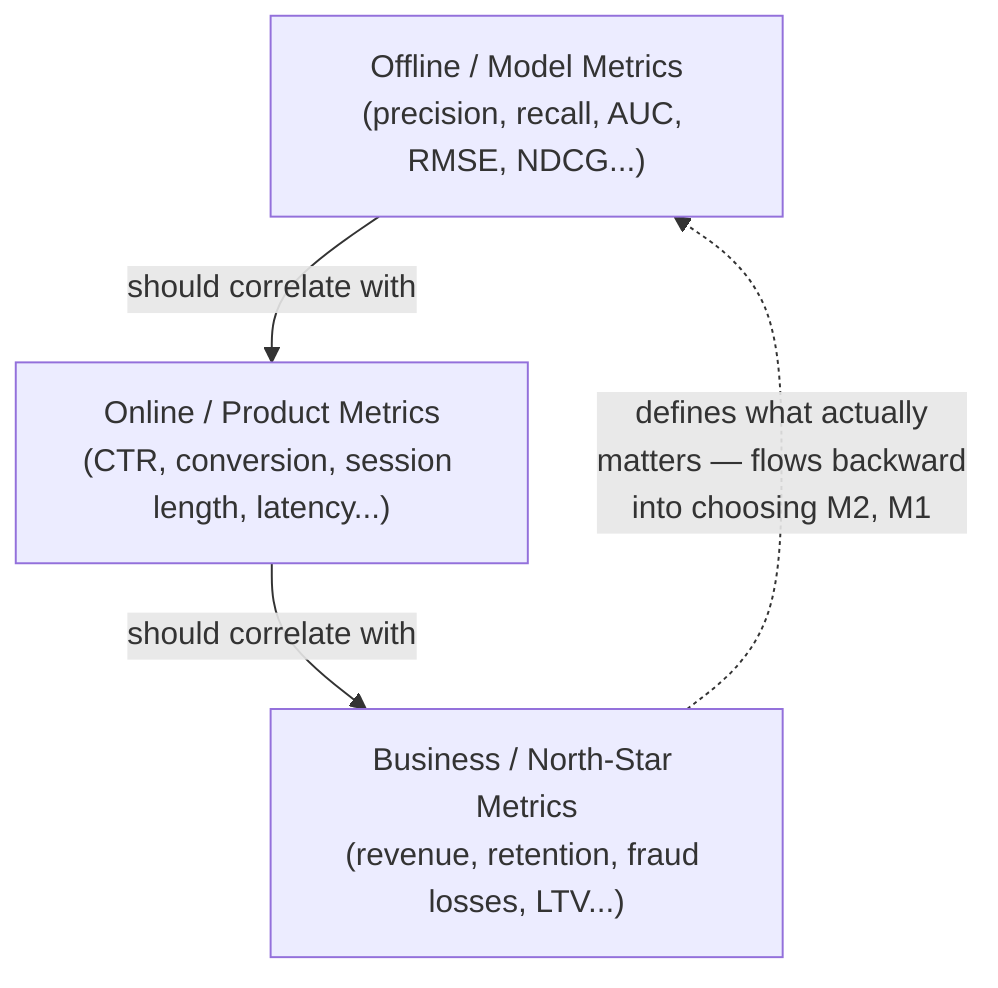

## Introduction

Chapter 2 introduced the three metric tiers as one step in the interview framework. This chapter goes deep on the topic in its own right, because getting metrics right — and getting the *relationships between* the three tiers right — is arguably the single most consequential decision in any AI system's design. A system optimized against the wrong metric will confidently, efficiently, and invisibly steer the business in the wrong direction.

## The Three Tiers, Revisited

The arrows matter: business metrics are the actual reason the system exists, and ideally, online metrics are a *reasonably fast-to-measure proxy* for business metrics, and offline metrics are a *reasonably cheap-to-compute proxy* for online metrics. Every layer down (business → online → offline) trades fidelity to the true goal for speed and cost of measurement. The central risk in this chapter is that this proxy chain breaks — and when it does, a team can spend months improving an offline metric that has stopped moving the business metric at all.

## Tier 1: Offline / Model Metrics

Computed on static, held-out data, before any real user sees the model's output. These are the metrics we introduced by problem type in Chapter 3:

- **Classification**: precision, recall, F1, AUC-ROC, AUC-PR (better for imbalanced classes)
- **Regression**: RMSE, MAE, MAPE
- **Ranking**: NDCG, MRR, MAP
- **Retrieval**: Recall@K, Precision@K
- **Generation**: BLEU, ROUGE, perplexity, and increasingly LLM-as-judge scores

**Why they're not enough on their own**: offline metrics are computed against a fixed, historical dataset, so they can't capture feedback loops (the model's predictions changing future user behavior), real-world distribution shift since the data was collected, or interaction effects with the actual UI/UX the prediction is embedded in.

## Tier 2: Online / Product Metrics

Measured on live production traffic, after deployment. These describe how the *system*, model included, behaves and is used in the real world:

- **Engagement metrics**: click-through rate (CTR), session length, dwell time, scroll depth
- **Conversion metrics**: purchase rate, sign-up rate, completion rate
- **Operational metrics**: latency (P50/P95/P99), error rate, throughput
- **Safety/quality metrics**: reported-content rate, complaint rate, override rate (how often a human overrides the model's decision)

**Why they're not the full picture either**: online metrics can be short-term proxies that don't capture long-term effects — a model can boost this week's CTR through increasingly sensational content while quietly eroding next quarter's retention, a phenomenon covered in depth in Chapter 22 on A/B testing pitfalls.

## Tier 3: Business / North-Star Metrics

The actual outcome the organization cares about — usually financial or strategic, and usually slower and more expensive to measure than the other two tiers:

- Revenue, gross margin
- User retention / churn rate
- Customer lifetime value (LTV)
- Fraud losses prevented (net of false-positive costs)
- Support cost reduction

**Why you still need the other two tiers**: business metrics often take weeks or months to move measurably and are influenced by countless factors outside the AI system's control (seasonality, marketing campaigns, macroeconomic conditions) — waiting for business metrics alone to evaluate every model iteration would make experimentation impossibly slow. This is precisely why teams build a proxy chain of faster, cheaper metrics that are validated (ideally through past experiments) to correlate with the north-star.

## When the Proxy Chain Breaks: Goodhart's Law in ML Systems

> "When a measure becomes a target, it ceases to be a good measure." — Goodhart's Law

This is the single most important risk in metric design for AI systems. A few concrete failure patterns:

- **Clickbait spiral**: optimizing a feed ranker purely for predicted click probability (offline metric) increases CTR (online metric) in the short term, but trains the system to favor sensational, low-quality content that erodes trust and long-term retention (business metric) — the proxy chain silently inverted.
- **Engagement over well-being**: maximizing "time spent" as an online metric can correlate with addictive, not genuinely valuable, product experiences — a well-documented tension in social media feed design.
- **Precision-only fraud tuning**: over-optimizing a fraud model's offline precision (minimizing false positives) can push the decision threshold to a point where recall (catching actual fraud) drops enough that real-world fraud losses (business metric) increase, even as the offline metric improves.

The mitigation isn't to avoid proxy metrics (you can't operate without them) — it's to **periodically validate that the proxy chain still holds**, usually via long-running holdout experiments that measure the actual business metric alongside the faster proxy metrics, and to **explicitly design guardrail metrics** (e.g., a content-quality score, a user-reported-issue rate) that catch the specific ways a proxy metric could be gamed.

## Guardrail Metrics

A guardrail metric is one you don't try to directly improve, but you monitor to make sure your *primary* metric optimization isn't causing collateral damage. For example:

- **Primary metric**: engagement (session length)
- **Guardrail metrics**: reported-content rate, user-survey satisfaction score, next-day retention

If the primary metric improves while a guardrail metric significantly worsens, that's a strong signal the model has found an unintended shortcut — a classic and highly-tested interview topic, since proposing guardrail metrics alongside a primary metric signals mature system design thinking.

## Choosing Metrics: A Worked Example

Suppose you're designing a **content moderation** classifier. Let's trace the three tiers:

- **Business metric**: platform trust and safety (hard to measure directly and immediately) — proxied by regulatory compliance risk, advertiser trust, and user retention among those exposed to policy-violating content.
- **Online metric**: reported-content rate after moderation, human-moderator override rate (how often the model's decision is reversed by a human reviewer), user appeal rate.
- **Offline metric**: precision and recall against a human-labeled validation set, with particular attention to recall on rare-but-severe violation categories (where a false negative is far more costly than a false positive).

Notice the explicit cost asymmetry (from Chapter 3) baked into the offline metric choice — a single aggregate accuracy number would hide catastrophic failures on rare, high-severity categories.

## Statistical Significance and Metric Noise

A subtlety often missed: online metrics are noisy, and a small change (say, +0.3% CTR) might just be random variance rather than a true effect. This is why online metric evaluation almost always requires a properly designed A/B test with statistical significance testing (Chapter 22) rather than simply comparing before/after numbers — a topic important enough to warrant its own dedicated chapter later in this series.

## Key Takeaways

- Metrics exist in three tiers — offline/model, online/product, and business/north-star — each trading measurement fidelity for speed and cost.
- The tiers should form a proxy chain: offline metrics should correlate with online metrics, which should correlate with business metrics; when this chain breaks, you're optimizing the wrong thing.
- Goodhart's Law is a real, recurring risk in ML systems — heavily optimizing any single proxy metric can produce unintended, sometimes actively harmful, side effects.
- Guardrail metrics — deliberately not optimized, only monitored — are the primary defense against a primary metric being gamed or causing collateral damage.

---

## Interview Questions

**1. What are the three tiers of metrics in an AI system, and how do they relate to each other?**
Offline/model metrics (computed on held-out historical data, like precision/recall/NDCG), online/product metrics (measured on live traffic, like CTR/conversion/latency), and business/north-star metrics (the actual organizational outcome, like revenue/retention). They should form a proxy chain where improvements in offline metrics predict improvements in online metrics, which in turn predict improvements in business metrics — each tier trading fidelity to the true goal for speed and cost of measurement.
*Follow-up: Why can't you just measure the business metric directly for every model iteration and skip the other two tiers?*
Business metrics are typically slow to move (weeks to months), noisy due to countless external factors (seasonality, marketing, competition), and expensive to measure per iteration — using them as the sole evaluation signal would make experimentation and iteration prohibitively slow, so faster proxy metrics are necessary for practical day-to-day model development.

**2. What is Goodhart's Law, and how does it apply specifically to ML system metric design?**
Goodhart's Law states that when a measure becomes a target, it ceases to be a good measure — in ML systems, this means that heavily optimizing any single proxy metric (like predicted click probability) can cause the model to find unintended shortcuts that technically improve that metric while working against the true underlying goal it was meant to represent (like long-term user trust or retention).
*Follow-up: Give a concrete real-world-plausible example of Goodhart's Law breaking a metric proxy chain in a feed-ranking system.*
A feed ranker heavily optimized for predicted click-through rate can learn to systematically favor sensational, outrage-inducing, or clickbait-style content, since such content reliably generates clicks — the offline and online click metrics both improve, but the true business goal (long-term user trust, retention, and platform health) can simultaneously deteriorate as users grow fatigued or distrustful of the content quality.

**3. What is a guardrail metric, and why is it different from a primary metric?**
A guardrail metric is a metric you deliberately don't try to optimize but continuously monitor alongside your primary metric, specifically to detect unintended collateral damage from optimizing the primary metric — e.g., monitoring user-reported-content rate as a guardrail while optimizing engagement as the primary metric. If the primary metric improves while a guardrail metric significantly worsens, that's a signal the optimization found an unintended, harmful shortcut.
*Follow-up: How would you decide which guardrail metrics to track for a new system, before you've seen any actual gaming behavior occur?*
Think through the most plausible ways the primary metric could be "gamed" or over-optimized at the expense of quality (e.g., for engagement, guardrails might include content diversity, user-reported-issue rate, and next-day retention) — essentially doing a pre-mortem on how the primary metric could be satisfied in an unintended way, and instrumenting metrics that would catch each plausible failure mode.

**4. Why might a model that improves an offline metric (like AUC) actually make the online/business outcome worse?**
Offline metrics are computed against a static historical dataset and can't capture feedback loops, distribution shift since data collection, or interaction effects with the live product experience — a model can be genuinely better at the narrow statistical task measured offline (e.g., predicting whether a user will click) while making choices that are worse for the actual product experience (e.g., systematically favoring content that gets clicks but reduces satisfaction), a gap that only becomes visible in online or business metrics.
*Follow-up: What kind of testing would you add specifically to catch this gap before a full production rollout?*
A staged online evaluation — shadow deployment followed by a properly randomized A/B test — measuring both the intended online metric and a set of guardrail metrics (content quality signals, user satisfaction surveys, next-period retention on the treatment group) before committing to a full rollout, rather than relying solely on the offline metric improvement as sufficient evidence.

**5. How would you choose between optimizing for precision versus recall in a classification-based AI system, and how does that choice connect back to business metrics?**
The choice depends on the relative real-world cost of false positives versus false negatives, which should be derived from the business metric, not chosen arbitrarily — for example, in a content moderation system for severe policy violations, missing a real violation (false negative) may cause significant business/legal/trust harm, favoring higher recall even at the cost of more false positives (which primarily cost some moderator review time); in a system that blocks legitimate customer transactions, a false positive might cost a lost sale and customer trust, favoring higher precision.
*Follow-up: How would you translate this precision/recall trade-off decision into a concrete, defensible number (like a specific decision threshold) rather than a qualitative preference?*
Assign an estimated dollar (or other business-relevant unit) cost to each type of error based on historical data or business input, then choose the decision threshold along the precision-recall curve that minimizes total expected cost — making the trade-off an explicit, quantifiable optimization rather than an intuition-based choice, and revisiting it periodically as the relative costs of each error type may shift over time.

**6. Why is a single aggregate metric (like overall accuracy) often insufficient for evaluating a production ML system, even if it looks good?**
An aggregate metric can hide severe failures on specific subgroups or rare-but-critical categories — a spam classifier could have 99.5% overall accuracy while performing terribly on a rare, high-severity type of abuse that makes up a tiny fraction of the dataset but carries disproportionate real-world cost, or perform much worse for a particular demographic subgroup, raising fairness concerns covered in Chapter 25.
*Follow-up: What practice would you put in place to catch this kind of hidden subgroup failure before deployment?*
Slice-based evaluation — deliberately breaking down offline (and later online) metrics by relevant subgroups (severity category, demographic group, geography, device type) rather than relying solely on the aggregate number, and setting minimum acceptable performance thresholds for each critical slice, not just the overall average.

**7. How do you validate that your chosen online metric is actually a good proxy for the true business metric, rather than assuming it is?**
Run experiments (or analyze historical data) that measure both the online metric and the business metric together over a sufficiently long time horizon, and check whether changes in the online metric reliably predict changes in the business metric in the same direction — for example, confirming that a treatment group with improved CTR also shows improved long-term retention or revenue, not just improved short-term clicks that later reverse.
*Follow-up: What would you do if you discovered that your chosen online metric (e.g., CTR) had stopped correlating with the business metric (e.g., retention) over time?*
Investigate why the correlation broke — often due to the model having been optimized against the online metric long enough to find unintended shortcuts (Goodhart's Law) — and consider either redefining the online metric to be more robust to gaming (e.g., a longer-horizon or higher-quality-weighted engagement measure) or introducing new guardrail metrics that specifically catch the gaming behavior you've identified.

**8. Why do offline metrics for generation problems (LLMs) require fundamentally different tools than offline metrics for classification problems?**
Classification has a single correct label to compare a prediction against, enabling exact-match-based metrics; generation problems often have many valid correct answers with different valid phrasings, so simple string-overlap metrics like BLEU/ROUGE only weakly correlate with true quality, requiring either human evaluation or LLM-as-judge scoring that can assess semantic correctness, coherence, and faithfulness rather than exact textual overlap.
*Follow-up: What's a risk of relying solely on an automated reference-free metric (like an LLM-as-judge score) as your only offline evaluation signal for a generation system?*
The judge model may share systematic biases with the model being evaluated (e.g., a preference for longer, more confident-sounding, or more fluent-but-incorrect responses) and can be gamed by outputs that exploit those biases without genuinely improving quality — periodic human evaluation is needed to validate that the automated judge's scores still track real user-perceived quality.

**9. In an interview, how would you respond if asked "what metric would you use" for an ambiguous system, without first being given the business goal?**
I'd ask what business outcome the system is meant to drive before proposing any specific metric, since the correct metric — and even the correct tier of metric to focus discussion on — depends entirely on that goal; for example, "maximize engagement" and "maximize purchase conversion" for the same recommendation system would lead to meaningfully different metric choices and potentially different model designs, so proposing a metric without first clarifying the goal risks optimizing the wrong thing entirely.
*Follow-up: If the interviewer insists you pick without further clarification, how would you proceed?*
State an explicit, reasonable assumption about the business goal (e.g., "I'll assume the goal is maximizing long-term user engagement, not just short-term clicks, since that's the more common goal for a consumer feed product") and proceed with metrics aligned to that assumption, while noting that the choice would change under a different stated goal — this demonstrates both flexibility and the underlying reasoning process even without a definitive answer from the interviewer.

**10. What's the difference between a "leading" and a "lagging" metric in the context of AI system evaluation, and why does this distinction matter?**
A leading metric changes quickly and gives an early signal of whether a change is working (e.g., CTR, which can be measured within hours or days), while a lagging metric changes slowly and reflects the true, delayed outcome (e.g., retention over 30-90 days, or revenue over a quarter). This distinction matters because relying solely on lagging metrics makes iteration too slow, while relying solely on leading metrics risks missing delayed negative effects that only show up in the lagging metric later.
*Follow-up: How would you structure an experimentation program to get the benefits of both leading and lagging metrics?*
Use leading metrics for fast day-to-day iteration and initial go/no-go decisions on smaller experiments, but require periodic (e.g., quarterly) longer-horizon holdout experiments that track lagging metrics to validate that the leading metric improvements accumulated over time are genuinely translating into the intended lagging business outcomes, adjusting the leading metric definition if a persistent gap is found.

**11. How would you design metrics differently for a system with a severe cost asymmetry between error types (e.g., medical screening) versus one with roughly symmetric error costs (e.g., a movie recommendation)?**
For severe cost asymmetry, you'd prioritize a metric and threshold that heavily weights minimizing the costlier error type (e.g., high recall for a medical screening tool where missing a true positive is far worse than a false alarm that leads to further, more precise testing), often reporting metrics like sensitivity at a fixed, clinically-acceptable specificity rather than a single blended score like accuracy or F1. For roughly symmetric costs, a balanced metric like F1 or simple accuracy, without heavy threshold skewing toward one error type, is often reasonable.
*Follow-up: Why is a single blended metric like F1-score potentially misleading for the medical screening example?*
F1-score treats precision and recall as equally important by default, but in medical screening the actual costs of a false negative (missed disease) and a false positive (unnecessary follow-up testing) are typically very different — a system tuned to maximize F1 could land at a threshold that's clinically unacceptable (too low recall) even while reporting a strong-looking blended score, so cost-weighted or recall-prioritized metrics are more appropriate and more honest about what the system is actually optimizing.

**12. What's the danger of treating "online metric improvement in an A/B test" as sufficient proof that a model change should be permanently rolled out?**
Short-term A/B test results can be affected by novelty effects (users temporarily engaging more with something new simply because it's different, not because it's better), can fail to capture longer-term effects that only emerge after users adapt to the change, and can improve a proxy metric while a slower-moving guardrail or business metric quietly degrades — treating a short-term significant result as final proof skips these important validation steps.
*Follow-up: How would you specifically test for and rule out a novelty effect in an A/B test result?*
Extend the experiment duration and examine whether the treatment effect persists, shrinks, or reverses over time — a genuine improvement should remain stable or grow as users continue to experience it, whereas a novelty effect typically shows an initial spike in the treatment metric that decays back toward the control group's level after the first days or weeks of exposure.

**13. How should the choice of business metric change your evaluation strategy for a recommendation system versus a fraud detection system?**
For a recommendation system, the business metric (engagement, revenue, retention) is typically something you want to *maximize*, and the evaluation strategy centers on A/B testing incremental improvements against a baseline, often tolerating gradual, continuous experimentation. For a fraud detection system, the business metric (net fraud losses after accounting for false-positive costs) is something you want to *minimize* while staying within a strict guardrail on customer friction (blocked legitimate transactions) — the evaluation strategy often requires more conservative rollout (e.g., starting with monitoring-only shadow mode) since the cost of a bad model actively blocking legitimate customers can cause immediate, direct financial and trust harm rather than a gradual, correctable engagement dip.
*Follow-up: Why might shadow deployment (Chapter 2) be considered non-negotiable for a fraud model but optional for a minor recommendation ranking tweak?*
A fraud model making live blocking decisions on a flawed threshold can directly and immediately harm real customers and revenue the moment it goes live, whereas a suboptimal recommendation ranking change typically just under-delivers on engagement upside without directly harming users — the asymmetry in downside risk between the two use cases justifies a more conservative, always-shadow-first rollout policy for the fraud model specifically.

**14. Why is "user-reported issue rate" often chosen as a guardrail metric across many different types of AI systems (recommendations, moderation, search), despite each system having very different primary metrics?**
Because it's a relatively universal, low-noise signal of user dissatisfaction that's largely independent of what specific primary metric a system is being optimized for — regardless of whether you're optimizing for engagement, conversion, or ranking relevance, a spike in users actively reporting problems is a strong, hard-to-game indicator that something has gone wrong for real users, making it a broadly reusable safety net across very different system types.
*Follow-up: What's a limitation of relying on user-reported issue rate as your only guardrail, even though it's broadly useful?*
Reporting behavior itself can be biased (only a small, non-representative fraction of dissatisfied users actually bother to report an issue, and reporting rates can vary by user demographic or product familiarity), so a stable or even declining report rate doesn't guarantee broad user satisfaction — it should be complemented by other guardrails like periodic user satisfaction surveys or behavioral proxies (e.g., reduced return usage) that don't depend on users taking explicit action.

**15. How would you explain the concept of a "proxy chain" of metrics to a product manager who's frustrated that the team is optimizing an "arbitrary-seeming" offline metric instead of directly targeting revenue?**
I'd explain that revenue is genuinely the goal, but it's too slow and noisy to measure for every single model iteration, so the team uses faster, cheaper metrics (an online engagement metric, and an even faster offline model metric) that have been validated, through past experiments, to reliably predict revenue outcomes — the offline metric isn't arbitrary, it's a deliberately chosen, tested stand-in that lets the team iterate quickly while remaining confident that progress on it translates to progress on revenue, with periodic checks to confirm that connection still holds.
*Follow-up: What would you tell the same product manager if a recent check actually revealed the proxy chain had broken — i.e., the offline metric was improving but revenue wasn't?*
I'd be transparent that we've found evidence the proxy relationship has weakened, likely because the model has been optimized against that specific metric long enough to find shortcuts that satisfy it without truly improving the underlying user experience (Goodhart's Law), and propose either redefining the metric to close that gap or temporarily reverting to more frequent, small-scale revenue-linked experiments while the team develops a more robust proxy — framing this as a normal, expected part of maintaining a healthy measurement system rather than a failure of the original approach.
