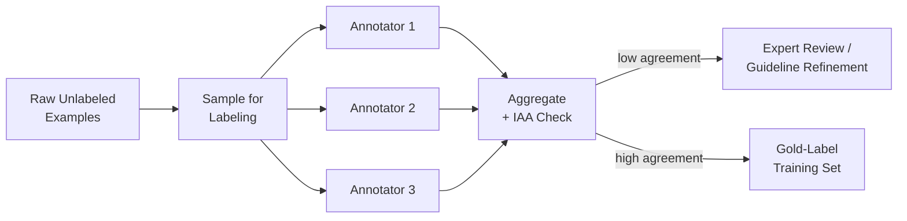
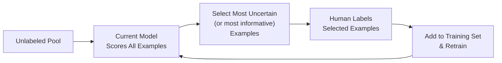

## Introduction

Every model, no matter how sophisticated, is bounded by the quality and coverage of the data it was trained on. Part 2 of this series goes deep on data engineering — the unglamorous but highest-leverage layer of any AI system. This chapter starts at the very beginning of the lifecycle from Chapter 4: how do you actually *get* the data in the first place, and how do you get it *labeled*?

## Explicit vs Implicit Signals

Data broadly falls into two categories, and the trade-off between them shows up in almost every AI system design decision:

- **Explicit signals**: data a user or annotator deliberately provides — a star rating, a thumbs up/down, a form submission, a human-labeled category. Clean, directly interpretable, but sparse (most users never leave a rating) and can introduce selection bias (only unusually satisfied or unusually angry users tend to leave reviews).
- **Implicit signals**: data inferred from behavior — clicks, dwell time, purchases, skips, scroll depth. Abundant and free (generated as a byproduct of normal usage), but noisy and ambiguous (a click doesn't necessarily mean satisfaction — it could be an accidental tap, or curiosity followed by disappointment).

Most production recommendation and ranking systems lean heavily on implicit signals purely for volume, while using sparser explicit signals as a higher-trust calibration set — a pattern we'll revisit throughout Part 3 and Part 14's case studies.

## Human Annotation

When you need ground-truth labels that can't be inferred from behavior (e.g., "is this image a cat," "is this comment toxic," "is this transaction fraudulent" for training data), human annotation is the default source. Key design decisions:

- **In-house vs outsourced/crowdsourced annotators**: in-house annotators (or subject-matter experts) give higher quality for nuanced or domain-specific tasks (e.g., medical image labeling), but don't scale cheaply; crowdsourced platforms (e.g., Amazon Mechanical Turk, Scale AI, Labelbox) scale cheaply but need more quality control.
- **Annotation guidelines**: ambiguous or underspecified labeling instructions are the single most common source of noisy labels — a rigorous, example-rich guideline document (with edge cases explicitly resolved) pays for itself many times over in final model quality.
- **Inter-annotator agreement (IAA)**: measuring how often multiple annotators agree on the same example (e.g., via Cohen's Kappa or Fleiss' Kappa) both quality-checks your guidelines and flags genuinely ambiguous examples that may need special handling or exclusion.
- **Multiple labels per example + aggregation**: for subjective or noisy tasks, collecting 3-5 labels per example and aggregating (majority vote, or a trained aggregation model) produces meaningfully cleaner labels than a single annotator's judgment.



## Weak Supervision

Human labeling is expensive and slow. Weak supervision generates approximate, noisy labels programmatically, at scale, using heuristics, existing rules, or heuristic functions ("labeling functions") — trading some label quality for orders-of-magnitude more coverage.

```python
# A simplified weak-supervision "labeling function" example (Snorkel-style pattern)
# Each function returns a vote (1 = spam, 0 = not spam, -1 = abstain)

def lf_contains_url(text: str) -> int:
    return 1 if "http://" in text or "https://" in text else -1

def lf_excessive_caps(text: str) -> int:
    letters = [c for c in text if c.isalpha()]
    if not letters:
        return -1
    caps_ratio = sum(1 for c in letters if c.isupper()) / len(letters)
    return 1 if caps_ratio > 0.5 else -1

def lf_known_spam_phrase(text: str) -> int:
    spam_phrases = ["click here now", "limited time offer", "act now"]
    return 1 if any(p in text.lower() for p in spam_phrases) else -1

def aggregate_votes(votes: list[int]) -> int:
    # Simple majority vote over non-abstaining labeling functions;
    # production systems (e.g., Snorkel's label model) learn per-LF
    # reliability weights instead of a flat majority vote.
    active = [v for v in votes if v != -1]
    if not active:
        return -1
    return 1 if sum(active) > 0 else 0
```

Weak supervision is especially valuable for bootstrapping a labeled dataset for a brand-new problem, or for continuously generating fresh labels for a fast-moving domain (like spam or fraud, where hand-labeling can't keep pace with new patterns).

## Active Learning

Rather than randomly sampling examples to label, active learning strategically selects the examples that would most improve the model if labeled — typically the ones the current model is *most uncertain about*. This concentrates limited human labeling budget where it has the highest marginal value.



A common uncertainty measure is entropy of the predicted class probabilities — an example the model predicts as 51%/49% between two classes is far more informative to label than one it's 99% confident about, since the latter likely wouldn't change the model's decision boundary even if labeled.

## The Cold-Start Problem

Brand-new products or features often have zero historical data — a fundamental chicken-and-egg problem: you need data to train a good model, but you need a model (or product) to generate that data. Common strategies:

1. **Bootstrap with a rules-based or heuristic system** that requires no training data, and log its predictions and outcomes as your first labeled dataset.
2. **Use a proxy dataset** from a similar, more mature domain (e.g., using a general-purpose sentiment dataset before you've collected domain-specific labeled reviews) via transfer learning.
3. **Leverage a pre-trained foundation model** (especially relevant post-LLM era) via prompting or few-shot learning, avoiding the need for a large labeled dataset entirely for many tasks.
4. **Deliberately collect exploration data**, sometimes at a short-term cost to the user experience (e.g., showing some randomized, non-personalized results early on) purely to generate unbiased labeled data for future training — a technique closely related to multi-armed bandits, covered in Chapter 33.

## Data Volume and Freshness Trade-offs

More data isn't always strictly better — the *right* trade-off depends on how quickly the underlying patterns change. A fraud detection model benefits enormously from very recent data (fraud tactics evolve monthly), so a smaller, fresher dataset may outperform a much larger but staler one. A general language understanding model, by contrast, can benefit from a large historical corpus since language patterns change comparatively slowly. Explicitly reasoning about this trade-off, rather than defaulting to "more data is always better," is a mark of a mature system design answer.

## Key Takeaways

- Data comes from explicit signals (clean but sparse) and implicit signals (abundant but noisy) — most systems combine both.
- Human annotation quality hinges on clear guidelines, inter-annotator agreement measurement, and label aggregation across multiple annotators.
- Weak supervision trades some label accuracy for massive scale and speed, especially valuable for bootstrapping or fast-moving domains.
- Active learning concentrates limited labeling budget on the most informative (usually most uncertain) examples.
- Cold-start problems require bootstrap strategies — rules-based systems, transfer learning, foundation models, or deliberate exploration — before a fully data-driven approach becomes viable.

---

## Interview Questions

**1. What's the difference between explicit and implicit signals for training data, and what are the trade-offs of each?**
Explicit signals are deliberately provided by users or annotators (ratings, labels, form submissions) — clean and directly interpretable but sparse and prone to selection bias. Implicit signals are inferred from behavior (clicks, dwell time, purchases) — abundant and free but noisy and ambiguous, since behavior doesn't always cleanly map to the underlying preference or outcome you're trying to model.
*Follow-up: Why might a system that relies purely on implicit signals systematically over-represent certain types of user behavior?*
Because implicit signals like clicks are influenced by exposure and UI placement (position bias — items shown first get clicked more regardless of true relevance) rather than pure preference, so a model trained naively on raw implicit data can conflate "was shown prominently" with "was actually preferred," a bias that needs explicit correction (covered further in Chapter 21).

**2. Why is inter-annotator agreement (IAA) an important metric to track during a human labeling effort, and what does low agreement typically indicate?**
IAA measures how consistently multiple independent annotators label the same examples, serving as both a quality check on your labeling guidelines and a signal of genuine task ambiguity. Low agreement typically indicates either unclear or incomplete labeling guidelines (fixable by adding examples and resolving edge cases), or that the underlying task itself is inherently subjective/ambiguous for certain examples, which may require a different labeling strategy (e.g., collecting a distribution of opinions rather than forcing a single "correct" label).
*Follow-up: What would you do differently if you discovered the low agreement was due to genuine task ambiguity rather than unclear guidelines?*
Rather than continuing to force a single ground-truth label, I'd consider training the model to predict a distribution or confidence score over possible labels (reflecting genuine ambiguity) rather than a single hard label, and/or route genuinely ambiguous cases to a human-in-the-loop review process in production instead of expecting the model to resolve inherent ambiguity on its own.

**3. What is weak supervision, and when would you use it instead of full human annotation?**
Weak supervision uses programmatic heuristics or rules ("labeling functions") to generate approximate, noisy labels at scale, rather than relying entirely on manual human annotation. You'd use it when you need labels far faster or cheaper than human annotation allows, when the domain moves quickly enough that hand-labeling can't keep pace (like spam or fraud pattern evolution), or to bootstrap an initial labeled dataset before investing in more expensive human annotation for the hardest or highest-value examples.
*Follow-up: How do you mitigate the fact that weak supervision labels are individually noisier than human-annotated labels?*
Combine multiple independent labeling functions and use a statistical aggregation model (rather than simple majority vote) that learns each labeling function's reliability from their agreement/disagreement patterns across the dataset — approaches like Snorkel's label model do this — which produces a probabilistic label that's typically much more accurate than any single labeling function alone, even without ground truth.

**4. Explain active learning and why it's more efficient than randomly sampling examples for human labeling.**
Active learning uses the current model to identify which unlabeled examples would be most informative to label next — typically those the model is most uncertain about — and prioritizes human labeling budget on exactly those examples, rather than randomly sampling from the full unlabeled pool where many examples might be redundant or already well-understood by the model. This concentrates a limited and expensive labeling budget where it has the highest expected impact on model improvement.
*Follow-up: What's a risk of relying purely on model uncertainty to select examples for active learning?*
The model might become uncertain about examples that are actually just noisy, mislabeled, or outlier/edge cases that aren't representative of the real data distribution, wasting labeling budget on essentially unlearnable examples — a common mitigation is combining uncertainty sampling with a diversity or representativeness criterion, so selected examples are both informative and representative of the broader data distribution.

**5. How would you bootstrap a labeled dataset for a completely new product feature with zero historical data?**
Start with a rules-based or heuristic system that requires no training data at all, and log its predictions plus real user outcomes as your first source of (admittedly imperfect) labeled data; in parallel, consider transfer learning from a similar existing domain's dataset, or leveraging a pre-trained foundation model via prompting/few-shot learning to get a reasonable baseline without needing a large labeled dataset upfront. Once initial data accumulates from the bootstrap approach, you can begin training and improving a dedicated model.
*Follow-up: What's a risk of relying solely on the rules-based system's own predictions as your bootstrap training labels?*
The rules-based system's blind spots become baked into the resulting training data — if the heuristic systematically misses a certain category of cases, the model trained on its logged predictions will inherit and potentially reinforce that same blind spot, so it's important to also collect some independent, unbiased ground truth (even a small human-labeled sample) to validate against.

**6. Why might you deliberately choose to show some users randomized, non-personalized content, even at a short-term cost to engagement?**
This is a form of deliberate exploration to generate unbiased training data — a fully personalized system only ever shows users content the current model believes they'll like, so all collected feedback is confounded by the model's own existing biases (you never learn what a user would have thought about content the model chose not to show them). A small, randomized "exploration" slice breaks this feedback loop and produces genuinely unbiased data to train the next, better model.
*Follow-up: How would you size the exploration traffic percentage to balance the value of unbiased data against the short-term engagement cost?*
Typically a small fraction (often single-digit percentages) of total traffic is allocated to exploration, sized based on how quickly you need fresh unbiased data versus how costly the short-term engagement dip is to the business — this is closely related to the exploration/exploitation trade-off formalized by multi-armed bandit algorithms, covered in depth in Chapter 33.

**7. What's the risk of training a fraud detection model on a large historical dataset spanning several years, versus a smaller but more recent dataset?**
Fraud tactics evolve continuously as fraudsters adapt to detection methods, so patterns from several years ago may no longer be representative of current fraud behavior — training heavily on stale historical data risks the model anchoring on outdated patterns and missing newer fraud tactics, even though the larger dataset might otherwise seem statistically preferable. A smaller but more recent, representative dataset can outperform a larger but staler one for fast-evolving adversarial domains.
*Follow-up: How would you decide the right balance between dataset size and recency for a given problem?*
Assess how quickly the underlying data-generating process changes (concept drift rate) for that specific domain — for a slow-changing domain (e.g., general image recognition of static objects), favor a larger historical dataset; for a fast-changing, adversarial domain (fraud, spam, viral content trends), favor recency even if it means a smaller effective training set, potentially supplemented with a weighting scheme that down-weights older examples rather than a hard cutoff.

**8. How would you design a labeling guideline document to minimize inter-annotator disagreement from the start, rather than discovering issues after the fact?**
Include concrete, worked examples for both clear-cut and ambiguous/edge cases rather than only abstract rules, explicitly resolve known ambiguous scenarios (don't leave them to individual annotator judgment), and pilot the guidelines on a small sample with multiple annotators before scaling up, measuring IAA on that pilot to catch and fix systematic disagreement sources before committing to full-scale labeling.
*Follow-up: What would you do if, even after a careful pilot, IAA remained low for a specific sub-category of examples?*
Investigate whether that sub-category represents genuine, irreducible ambiguity (in which case I'd consider a different labeling scheme, like collecting a distribution of opinions rather than a forced single label) versus a guideline gap specific to that sub-category (in which case I'd add explicit, worked examples for exactly that sub-category and re-pilot), rather than assuming all disagreement stems from the same root cause.

**9. What's the trade-off between using an in-house/expert annotation team versus a crowdsourced platform?**
In-house or subject-matter-expert annotators typically produce higher-quality, more consistent labels for nuanced or domain-specific tasks (e.g., medical, legal, or highly technical content) but are expensive and don't scale to very large volumes quickly. Crowdsourced platforms scale much more cheaply and quickly but require more robust quality control mechanisms (multiple labels per example, qualification tests, ongoing quality audits) since individual crowdworker quality and domain expertise vary widely.
*Follow-up: For a task requiring deep domain expertise, like labeling medical images, would you ever still use a crowdsourced approach? How?*
Yes, in a hybrid design — using crowdsourced annotators for coarser, easier-to-judge pre-filtering or triage (e.g., flagging obviously normal vs potentially abnormal images) to reduce the volume that needs expert review, while reserving expensive expert (radiologist) time specifically for the harder or flagged cases, which meaningfully reduces total expert labeling cost while maintaining quality where it matters most.

**10. How does the choice between explicit and implicit signals affect the design of your evaluation dataset versus your training dataset?**
Training data often leans on abundant implicit signals to achieve sufficient scale, even with their inherent noise, since a model can often learn robust patterns despite noisy individual labels given enough volume. Evaluation datasets, by contrast, benefit far more from smaller but higher-trust explicit or expert-labeled data, since an unreliable evaluation set undermines your ability to trust any conclusion drawn from it — you're far more sensitive to noise in the (typically much smaller) evaluation set than in the (typically much larger) training set.
*Follow-up: Would you ever use noisy implicit signals for your evaluation set despite this trade-off? Under what circumstance?*
If obtaining sufficient volume of high-trust explicit/expert labels for evaluation is genuinely infeasible (e.g., a very rare event class), you might use implicit signals for evaluation but explicitly quantify and report the estimated label noise's impact on your metric's reliability, and prioritize getting at least a smaller high-trust "gold" evaluation subset for critical, high-stakes categories even if the broader evaluation set uses noisier signals.

**11. Why might active learning be less useful, or even counterproductive, in the early stages of a brand-new model with almost no training data yet?**
Active learning depends on having a reasonably calibrated model to identify genuinely informative/uncertain examples — an untrained or very early-stage model's uncertainty estimates are themselves unreliable, so the examples it flags as "most uncertain" may not actually be the most informative for genuine model improvement, potentially wasting labeling effort on unhelpful examples. It's often more effective to first label a random, representative sample to establish a reasonable baseline model before switching to active learning for subsequent labeling rounds.
*Follow-up: At what point in a project's lifecycle would you introduce active learning, and how would you validate that it's actually helping?*
Introduce it once you have a baseline model with reasonably calibrated confidence estimates (often after an initial random-sampling-based labeling round), and validate its benefit by comparing model improvement per labeled example under active learning versus continued random sampling on a held-out evaluation set — if active learning genuinely helps, you should see faster improvement in the evaluation metric per additional labeled example compared to random sampling.

**12. How would you handle a situation where your weak supervision labeling functions systematically conflict with each other on a significant fraction of examples?**
Rather than ignoring the conflict or forcing an arbitrary tie-breaking rule, I'd use a statistical label aggregation model that learns each labeling function's accuracy and correlation with others from the pattern of agreements and disagreements across the full dataset, weighting more reliable labeling functions more heavily in the final aggregated label — and I'd also treat high-conflict regions of the data as a signal to potentially collect a small amount of human-labeled ground truth specifically for those regions, to both validate the aggregation and improve the labeling functions themselves.
*Follow-up: What would persistent, unresolved high conflict on a specific sub-population of examples suggest about your weak supervision approach for that sub-population?*
It suggests that sub-population may be a genuine blind spot for your current set of labeling functions — none of them capture the pattern needed to correctly label those examples — which is a strong signal that new labeling functions need to be authored specifically for that sub-population, or that it should be routed to human labeling rather than relying on weak supervision alone.

**13. What role does data labeling play differently in an LLM-centric system compared to a classical supervised learning system?**
In classical supervised learning, labeled data is typically the primary and often sole source of training signal for the model from scratch. In LLM-centric systems, the base model is usually pre-trained on massive unlabeled or weakly-labeled text, and "labeling" work shifts toward smaller-scale, higher-value activities: curating high-quality instruction-following examples for fine-tuning, collecting human preference comparisons for techniques like RLHF, or crafting few-shot examples for prompting — the labeling effort is smaller in raw volume but often requires more careful curation and quality control per example.
*Follow-up: Why does data quality often matter even more, per example, in LLM fine-tuning/instruction-tuning datasets compared to classical large-scale supervised datasets?*
Fine-tuning datasets for LLMs are typically orders of magnitude smaller than pre-training corpora or classical large-scale supervised datasets, so each individual example has proportionally much more influence on the resulting model's behavior — a small number of poorly-written, inconsistent, or low-quality examples can disproportionately and visibly degrade the fine-tuned model's output style and reliability, making per-example curation quality a much higher priority than in large-scale classical supervised learning.

**14. How would you decide the right volume of labeled data needed before starting to train a model for a new classification task?**
There's no universal fixed number — it depends on the complexity of the underlying pattern, the number of classes, the class balance, and the chosen model's complexity (simpler models like logistic regression often need less data than deep neural networks). A practical approach is to plot a learning curve — model performance on a held-out set as a function of training set size — using progressively larger labeled subsets; if performance is still climbing steeply at your current data volume, more labeling is likely to yield meaningful further gains, whereas a plateauing curve suggests additional labeling has diminishing returns and effort might be better spent elsewhere (e.g., feature engineering or model architecture).
*Follow-up: What would a plateauing learning curve at a still-unsatisfactory performance level suggest, as opposed to a plateau at a satisfactory level?*
A plateau at an unsatisfactory performance level suggests the bottleneck isn't data volume but something else — insufficient feature signal, an inherently noisy or ambiguous label definition, or a model that's too simple to capture the underlying pattern — so the fix should shift toward better features, label quality improvements, or a more expressive model architecture, rather than continuing to invest in acquiring more of the same kind of labeled data.

**15. In an interview, if asked to design the data collection strategy for a brand-new AI product with strict user privacy requirements, how would you balance data needs with privacy constraints?**
I'd prioritize minimizing data collection to only what's strictly necessary for the model's purpose (data minimization), favor implicit and aggregated signals over collecting new explicit personal data where possible, explore privacy-preserving techniques like on-device feature computation or differential privacy for aggregate statistics, and be explicit that some model quality trade-off may be an acceptable cost for meeting privacy requirements — framing privacy not as an afterthought but as a constraint that shapes the data strategy from the very first design decision.
*Follow-up: How would you communicate the potential model quality trade-off from strict privacy constraints to a business stakeholder who wants both maximum privacy and maximum model performance?*
I'd present concrete options along a privacy-performance spectrum (e.g., "full personalization using individual behavioral history" vs "cohort-level personalization using aggregated, anonymized group statistics" vs "no personalization"), along with the realistic expected performance and privacy-risk profile of each, letting the stakeholder make an informed trade-off decision rather than presenting privacy and performance as if both can be simultaneously maximized without any cost.
