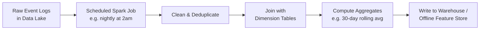
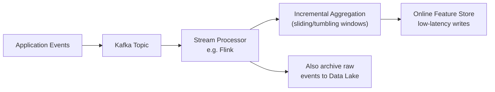
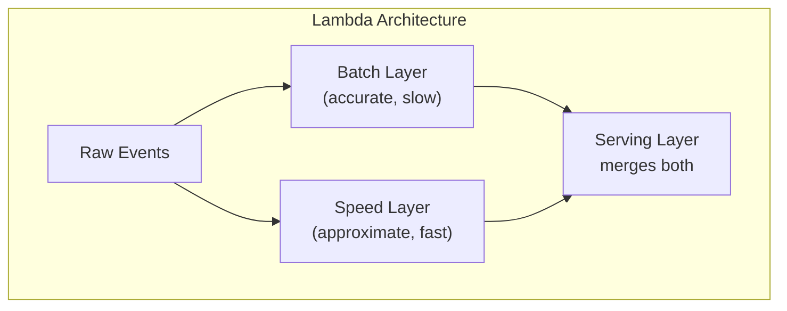

## Introduction

Chapter 5 covered batch vs online vs streaming *inference*. This chapter covers a closely related but distinct concept: batch vs streaming **data pipelines** — the infrastructure that moves and transforms raw data *before* it ever reaches a model, whether for training or for feature computation. It's easy to conflate the two, so we'll be explicit about the difference throughout this chapter.

## Data Pipelines vs Inference Pipelines

An inference pipeline (Chapter 5) answers "when does the model produce a prediction?" A data pipeline answers "how does raw data get from its source (application logs, third-party feeds, user events) into a form a model or feature store can consume?" The two are connected — a streaming *data* pipeline often feeds a real-time *feature store*, which in turn supports online *inference* — but they're independently designed decisions. You could have a streaming data pipeline feeding purely batch inference (features refreshed continuously, but predictions still computed nightly), or a batch data pipeline feeding online inference (features updated daily, but predictions computed live per-request using those day-old features).

## Batch Data Pipelines

Data is processed in discrete, scheduled chunks — hourly, nightly, weekly — typically using distributed batch processing frameworks like **Apache Spark**. A batch pipeline reads a complete (or complete-as-of-a-cutoff) dataset, applies transformations, and writes the result to a destination store.



**Strengths**: simpler programming model (process a complete, static dataset — easier to reason about and debug), efficient for large-scale transformations and joins across huge historical datasets, mature tooling (Spark, dbt, Airflow) with strong community support.

**Weaknesses**: inherent latency equal to the batch interval (a nightly job means features/data are always up to 24 hours stale), and reprocessing an entire dataset for a small correction can be computationally expensive.

```python
# Simplified PySpark batch job: compute 30-day rolling transaction
# aggregates per user, to be written to an offline feature store.

from pyspark.sql import SparkSession, functions as F
from pyspark.sql.window import Window

spark = SparkSession.builder.appName("user_txn_features").getOrCreate()

transactions = spark.read.parquet("s3://data-lake/transactions/")

window_30d = (
    Window.partitionBy("user_id")
    .orderBy(F.col("event_time").cast("long"))
    .rangeBetween(-30 * 86400, 0)  # 30 days in seconds
)

features = transactions.select(
    "user_id",
    "event_time",
    "amount",
    F.count("*").over(window_30d).alias("txn_count_30d"),
    F.sum("amount").over(window_30d).alias("txn_amount_sum_30d"),
    F.avg("amount").over(window_30d).alias("txn_amount_avg_30d"),
)

(
    features.write.mode("overwrite")
    .partitionBy("event_date")
    .parquet("s3://feature-store/offline/user_txn_features/")
)
```

## Streaming Data Pipelines

Data is processed continuously, event by event (or in small "micro-batches"), as it arrives — typically using a message broker like **Apache Kafka** paired with a stream processing engine like **Apache Flink** or **Spark Structured Streaming**.



**Strengths**: near-real-time freshness (seconds, not hours), naturally suited to continuously-arriving, high-volume event data, avoids reprocessing entire historical datasets for incremental updates.

**Weaknesses**: significantly more operationally complex — you must handle out-of-order events, late-arriving data, exactly-once processing semantics (Chapter 5), and windowing logic (tumbling, sliding, or session windows) that has no equivalent complexity in a batch job operating over a complete static dataset.

```python
# Conceptual example using Faust (a Python stream processing library,
# similar in spirit to Kafka Streams) to maintain a real-time
# "transaction count in the last 5 minutes" feature per user.

import faust

app = faust.App("fraud-features", broker="kafka://localhost:9092")

class Transaction(faust.Record):
    user_id: str
    amount: float
    timestamp: float

transactions_topic = app.topic("transactions", value_type=Transaction)

# Tumbling 5-minute window table, keyed by user_id
txn_count_5m = app.Table(
    "txn_count_5m", default=int
).tumbling(300, expires=600)  # 5-minute windows, expire after 10 min

@app.agent(transactions_topic)
async def process(transactions):
    async for txn in transactions:
        txn_count_5m[txn.user_id] += 1
        # Downstream: this value is read directly by the online
        # feature store / fraud model at inference time.
```

## The Lambda and Kappa Architectures

Two well-known architectural patterns address the batch-vs-streaming trade-off directly:

- **Lambda Architecture**: run *both* a batch pipeline (for accurate, complete, but stale historical aggregates) and a streaming pipeline (for fast, approximate, real-time aggregates) in parallel, merging their outputs at query/serving time. The batch layer periodically "corrects" any small inaccuracies accumulated by the streaming layer.
- **Kappa Architecture**: use *only* a streaming pipeline for everything, including reprocessing historical data by replaying the event log from the beginning when needed, eliminating the need to maintain two separate codebases (batch and streaming) for the same logic.



Kappa has become increasingly popular as stream processing engines have matured (Flink, in particular, supports efficient reprocessing), since maintaining two parallel codebases for the same logical transformation (as Lambda requires) is a well-known source of subtle bugs and skew — directly echoing the training-serving skew problem from Chapter 4, but between the batch and streaming *data pipelines* themselves this time.

## Choosing Between Batch and Streaming Data Pipelines

The decision framework closely mirrors Chapter 5's inference framework, but applied to data freshness needs rather than prediction timing:

1. **How fresh does the downstream feature/data need to be?** If hours-to-a-day of staleness is acceptable (e.g., a weekly content recommendation refresh), batch is simpler and cheaper. If sub-minute freshness materially matters (e.g., fraud detection reacting to an ongoing attack), streaming is necessary.
2. **What's the data volume and arrival pattern?** Continuously arriving, high-volume event data (clickstreams, transaction logs) is naturally suited to streaming; periodically-refreshed, bulk external data (a daily third-party data feed, a weekly export from another system) is naturally suited to batch.
3. **What's the team's operational maturity and tooling investment?** Streaming pipelines require meaningfully more operational expertise (Kafka/Flink cluster management, handling backpressure, monitoring consumer lag) — a team without this expertise should have a strong, validated reason before taking on that complexity.

In practice, most mature data platforms run **both**, using batch pipelines for large-scale historical processing, model training data preparation, and less time-sensitive aggregates, and streaming pipelines specifically for the subset of features or signals that genuinely require near-real-time freshness — directly mirroring the hybrid inference architectures from Chapter 5.

## Data Pipeline Orchestration

Batch pipelines in particular need orchestration — scheduling, dependency management between jobs, retry logic, and alerting on failures. **Apache Airflow** is the most widely used tool for this, representing a pipeline as a Directed Acyclic Graph (DAG) of tasks with explicit dependencies (we cover this in depth in Chapter 28, in the context of training pipeline orchestration specifically).

## Key Takeaways

- Data pipelines (moving/transforming raw data) are distinct from inference pipelines (Chapter 5) — a streaming data pipeline can feed batch inference, and vice versa.
- Batch pipelines (Spark-style) are simpler to build and debug but introduce staleness equal to the batch interval; streaming pipelines (Kafka/Flink-style) achieve near-real-time freshness at significantly higher operational complexity.
- The Lambda architecture runs both batch and streaming in parallel for accuracy plus speed, at the cost of maintaining two codebases; the Kappa architecture uses only streaming, including for reprocessing, to avoid that duplication.
- Most mature systems use a hybrid: batch for large-scale historical/training data preparation, streaming reserved specifically for the subset of features that genuinely need near-real-time freshness.

---

## Interview Questions

**1. What's the difference between a "data pipeline" and an "inference pipeline," and why is this distinction important in system design?**
A data pipeline moves and transforms raw data (from logs, events, external feeds) into a form usable for training or feature computation, while an inference pipeline (Chapter 5) is about when and how a model actually produces predictions from that data. They're independent design decisions — you can have a streaming data pipeline feeding either batch or online inference, and vice versa — so conflating them leads to an incomplete or confused system design, especially when explaining freshness and latency trade-offs.
*Follow-up: Give an example of a system with a streaming data pipeline but batch inference, and explain why that combination makes sense.*
A demand forecasting system might use a streaming pipeline to keep raw sales and inventory data continuously fresh in a data lake/warehouse, while still running the actual forecasting model as a nightly batch job — since forecasts are used for next-day planning decisions that don't need to update every second, but having the freshest possible input data going into that nightly job still improves forecast accuracy over relying on day-old raw data.

**2. What are the core trade-offs between batch and streaming data pipelines?**
Batch pipelines are simpler to build, test, and debug (they operate on a complete, static dataset), efficient for large historical joins/aggregations, and rely on mature tooling, but introduce staleness equal to the batch interval. Streaming pipelines achieve near-real-time freshness and avoid reprocessing full historical datasets for incremental updates, but require significantly more operational complexity — handling out-of-order events, exactly-once semantics, and windowing logic that batch jobs don't need to worry about.
*Follow-up: Why is "out-of-order events" specifically a non-issue for batch pipelines but a real engineering challenge for streaming pipelines?*
A batch job processes a complete, already-collected dataset where all events for the time period being processed are already present and can simply be sorted by timestamp before any aggregation — there's no notion of "waiting" for a late event since the whole dataset is available upfront; a streaming pipeline, by contrast, must decide when to "close" a time window and finalize an aggregate while events for that window may still be arriving late due to network delays or upstream processing lag, requiring explicit strategies (watermarks, grace periods) to balance completeness against timely output.

**3. What is the Lambda architecture, and what problem does it solve?**
It's a data architecture pattern that runs both a batch layer (producing accurate but stale aggregates over the full historical dataset) and a speed/streaming layer (producing fast but approximate real-time aggregates) in parallel, merging their outputs at serving time — giving you both the accuracy of batch processing and the freshness of streaming, since the batch layer periodically corrects any small errors that accumulated in the faster streaming layer.
*Follow-up: What's the main drawback of the Lambda architecture that led to the development of the Kappa architecture as an alternative?*
Lambda requires maintaining two separate codebases implementing essentially the same logical transformation (once in a batch framework like Spark, once in a streaming framework like Flink), which is a significant engineering burden and a recurring source of subtle bugs when the two implementations drift out of sync with each other over time — directly analogous to training-serving skew, but between two data pipeline implementations rather than between training and serving.

**4. How does the Kappa architecture avoid the dual-codebase problem of Lambda, and what capability does it rely on?**
Kappa uses only a single streaming pipeline for everything, including historical reprocessing — when you need to recompute historical aggregates (e.g., after fixing a bug in the transformation logic), you simply replay the raw event log from the beginning through the same streaming pipeline, rather than maintaining a separate batch implementation. This relies on the underlying message broker (like Kafka) retaining a sufficiently long history of raw events, and the stream processing engine being efficient enough to reprocess that history in a reasonable amount of time when needed.
*Follow-up: What's a scenario where Lambda might still be preferred over Kappa despite the dual-codebase maintenance burden?*
When certain large-scale historical aggregations or joins are genuinely more efficient or more mature in a dedicated batch framework (e.g., complex multi-way joins across very large historical datasets, which batch engines like Spark are often better optimized for than streaming engines), a team might accept Lambda's maintenance cost in exchange for using the best-suited tool for each specific type of computation, rather than forcing everything through a streaming paradigm that may not be optimal for every use case.

**5. Why would a team choose to invest in a streaming data pipeline for a specific feature rather than sticking with a simpler batch pipeline?**
When the feature's usefulness genuinely depends on sub-minute (or faster) freshness — e.g., a fraud model needing "transaction count in the last 5 minutes" to catch a rapid, ongoing attack pattern that a 24-hour-stale batch aggregate would completely miss. The decision should be justified by a concrete, measurable need for that freshness (ideally validated by comparing model or business performance with fresh versus stale versions of the feature), not adopted as a default "more real-time is always better" choice given its added operational complexity.
*Follow-up: How would you validate, before building the streaming infrastructure, that the freshness gain would actually matter for model performance?*
Run an offline analysis comparing model performance (e.g., on historical fraud data) using the feature computed with different staleness levels (e.g., simulating 5-minute-fresh vs 1-hour-fresh vs 24-hour-fresh versions of the same aggregate) to see how much accuracy is lost as staleness increases — if the accuracy drop between "fresh" and "somewhat stale" is small, that's evidence the added streaming infrastructure investment may not be justified; if it's large, that's a strong case for the investment.

**6. What does "watermarking" mean in a streaming pipeline, and what problem does it solve?**
A watermark is a mechanism the stream processor uses to estimate "how late can an event realistically arrive" for a given time window, allowing the system to eventually close and finalize a windowed aggregate (e.g., "5-minute transaction count") even though it can never be 100% certain no more late events will arrive for that window. It solves the fundamental tension in streaming between waiting indefinitely for potential late data (which would mean never producing a timely result) and closing windows too early (which would produce inaccurate, incomplete aggregates).
*Follow-up: What's the trade-off in setting a watermark's allowed lateness threshold too high versus too low?*
Setting it too low risks prematurely closing windows and dropping/miscounting genuinely late-but-valid events, reducing aggregate accuracy; setting it too high delays how quickly you can finalize and use a windowed result, increasing end-to-end latency and partially undermining the reason you chose a streaming pipeline in the first place — the right threshold is a deliberate trade-off based on the observed distribution of event lateness in your specific system.

**7. How would you design a data pipeline to prepare training data for a batch-retrained fraud detection model that also needs real-time features at serving time?**
Use a batch pipeline (e.g., a scheduled Spark job) to prepare the bulk historical training dataset, joining raw transaction logs with labels and computing the same feature definitions that will be used at serving time; separately, use a streaming pipeline to continuously maintain the online feature store with fresh real-time aggregates for serving. Critically, both pipelines should compute each feature using the exact same logical definition — ideally sharing code or being generated from a single feature specification — to avoid training-serving skew between the batch-computed training features and the streaming-computed serving features.
*Follow-up: What's a concrete engineering pattern to ensure the batch and streaming pipelines don't silently drift apart in their feature computation logic over time?*
Define each feature's transformation logic once, in a shared, versioned specification (or shared code library) that both the batch training pipeline and the streaming serving pipeline import and execute, rather than allowing two engineers or teams to independently reimplement the same feature in Spark SQL versus a Flink/Faust streaming job — a feature store platform (Chapter 13/17) is often the concrete system that enforces this shared-definition pattern.

**8. What role does Apache Airflow (or similar orchestration tools) play in a batch data pipeline, and why is it necessary beyond just running Spark jobs?**
Airflow (or similar tools) manages the scheduling, sequencing, and dependency relationships between multiple batch jobs — for example, ensuring a "join transactions with user profiles" job only runs after both the transactions ingestion job and the user profile export job have successfully completed, retrying failed tasks automatically, and alerting engineers when a pipeline fails. Without an orchestrator, a team would need to manually manage these dependencies and failure conditions, which becomes unmanageable as the number of interdependent batch jobs grows.
*Follow-up: What's a specific failure mode that a good orchestration setup should catch, that a naive cron-job-based scheduling approach would miss?*
A naive cron-based approach might trigger the "join" job at a fixed time regardless of whether its upstream dependency jobs actually completed successfully — silently processing incomplete or partial data if an upstream job failed or ran late — whereas a proper orchestrator (Airflow) explicitly models the dependency graph and only triggers downstream tasks after upstream tasks report successful completion, preventing this kind of silent data corruption.

**9. Why might a company choose to archive raw streaming events into a data lake even if they're also being processed in real time?**
Raw event archival preserves the ability to reprocess historical data later — for backfilling a new feature definition that didn't exist when the events originally occurred, for debugging a data quality issue by replaying exactly what happened, or for training models on a longer historical window than the streaming pipeline's in-memory or short-term state retains. Without this archival, once a streaming pipeline has processed and discarded raw events, that historical detail is permanently lost.
*Follow-up: How does this raw-event-archival practice relate to the Kappa architecture's approach of "replaying the event log" for reprocessing?*
It's the same underlying capability — Kappa's ability to reprocess historical data by replaying from the beginning depends entirely on the raw events actually being retained (either in the message broker itself, like Kafka's configurable retention period, or in a separate archival data lake) rather than being discarded once initially processed, so this archival practice is a prerequisite for the Kappa architecture to work at all.

**10. How would you handle schema evolution (e.g., a new field being added to an event) in a streaming pipeline without breaking downstream consumers?**
Use a schema registry (e.g., Confluent Schema Registry for Kafka) that enforces backward/forward compatibility rules on schema changes — for example, requiring new fields to be optional with sensible defaults, so that older consumers can safely ignore fields they don't understand and newer consumers can gracefully handle events that predate a new field's addition. This prevents a schema change from silently breaking downstream consumers or causing a pipeline outage.
*Follow-up: What's a risk of not enforcing schema compatibility rules, specific to ML feature pipelines rather than generic data pipelines?*
An incompatible schema change could silently cause a feature computation to receive null or missing values for a field it depends on, without necessarily crashing the pipeline outright — this could quietly degrade a model's input features (and therefore its predictions) for an extended period before anyone notices, since there's no obvious error, just gradually worse model performance, tying directly back to the "silent failure" risk discussed in Chapter 4.

**11. Why is data pipeline design considered a foundational, high-leverage part of AI system design, even though it involves no actual model training or inference?**
Because every downstream stage of the ML lifecycle — feature engineering, training, serving — depends entirely on the data pipeline delivering correct, timely, and consistent data; a flaw introduced at the pipeline level (a subtle join bug, a schema mismatch, an incorrect windowing calculation) silently propagates into every model trained on that data, and can be extremely difficult to diagnose after the fact since the model training and evaluation code itself may be functioning perfectly correctly on flawed input data.
*Follow-up: How would you prioritize testing effort between data pipeline code and model training code, given limited QA/testing resources?*
I'd prioritize data pipeline testing at least as highly as, and often higher than, model training code testing — since pipeline bugs affect every model trained downstream and are harder to detect through model performance metrics alone (a model can appear to train "successfully" on subtly corrupted data), whereas model training code issues (e.g., a bug in a loss function) often surface more visibly and immediately through obviously poor training metrics.

**12. How would you decide the right batch interval (hourly vs nightly vs weekly) for a given batch data pipeline?**
Base the interval on how quickly the underlying business need for freshness degrades in value beyond that interval, weighed against the computational cost of running the job more frequently — e.g., a weekly content trends report might be perfectly fine refreshed weekly since the underlying trends don't shift meaningfully faster than that, while a daily personalized email campaign selection might need at least daily freshness to reflect recent user behavior. Avoid defaulting to the most frequent interval technically possible without justifying the added infrastructure cost against the actual marginal value of that increased freshness.
*Follow-up: What would push you to switch a pipeline from a fixed interval to an event-triggered (rather than time-triggered) execution model?*
If the meaningful "freshness" boundary is defined by a business event rather than a fixed clock time — for example, "recompute inventory-based recommendations whenever a new shipment arrives" rather than "recompute every 6 hours regardless of whether anything actually changed" — an event-triggered pipeline avoids both unnecessary recomputation when nothing has changed and unnecessary staleness when something significant has changed but the fixed interval hasn't yet elapsed.

**13. What's a common mistake teams make when first introducing a streaming pipeline into a previously all-batch data architecture?**
Attempting to convert the entire pipeline to streaming at once, rather than identifying the specific subset of features or use cases that genuinely require the added freshness and complexity, and migrating only those incrementally while leaving the rest on the simpler, well-understood batch architecture. This "big bang" migration significantly increases risk and operational burden without a proportional benefit for the parts of the system that never needed sub-batch-interval freshness in the first place.
*Follow-up: How would you identify which specific features or pipelines are the best first candidates for a streaming migration?*
Look for features where you have concrete evidence (from the kind of offline staleness-sensitivity analysis described earlier in this chapter, or from observed business impact of stale data) that reduced latency/freshness would measurably improve model or business outcomes, and start the migration with those highest-value, most freshness-sensitive cases first, treating the migration as an incremental, validated rollout rather than a wholesale architectural switch.

**14. How does the choice of batch versus streaming data pipeline affect your approach to data pipeline testing and validation?**
Batch pipeline testing can rely heavily on comparing output against expected results for a fixed, deterministic input dataset — since batch jobs are inherently reproducible given the same input, tests can be relatively straightforward unit/integration tests. Streaming pipeline testing must additionally account for timing-dependent behavior, out-of-order event scenarios, and windowing edge cases (e.g., what happens to an event that arrives exactly at a window boundary), which requires more sophisticated test harnesses that can simulate realistic timing and ordering scenarios, not just static input/output comparisons.
*Follow-up: What's a specific streaming-pipeline testing technique that has no real batch-pipeline equivalent?*
Testing with deliberately injected out-of-order and late-arriving events (simulating realistic network delay and clock skew scenarios) to verify the pipeline's watermarking and windowing logic behaves correctly under those conditions — since a batch pipeline processes a complete, already-ordered dataset by design, there's no equivalent "what if data arrives in the wrong order" scenario to test for.

**15. If an interviewer asks you to design the data pipeline for a system without specifying freshness requirements, how would you proceed?**
I'd explicitly ask about freshness requirements before committing to batch or streaming, since this is one of the most consequential and cost-differentiating decisions in the entire pipeline design — but if pressed to proceed without an answer, I'd default to proposing a batch pipeline as the simpler, lower-risk starting architecture, while explicitly noting which specific features or components I'd revisit for a streaming upgrade if real-time freshness later proves to matter, rather than defaulting to a more complex streaming architecture without justification.
*Follow-up: Why is defaulting to batch, rather than streaming, generally the safer assumption when freshness requirements are unclear?*
Batch pipelines are simpler to build, test, debug, and operate, and the cost of under-provisioning freshness (discovering later that some feature needed to be fresher) is generally lower and easier to incrementally fix (migrate that specific feature to streaming) than the cost of over-provisioning complexity upfront (building and operating a full streaming architecture that turns out to be unnecessary for the actual business need) — this mirrors the general system design principle of starting simple and adding complexity only when justified by a demonstrated need.
