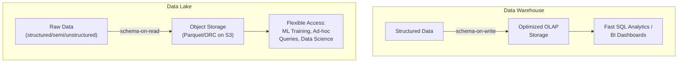
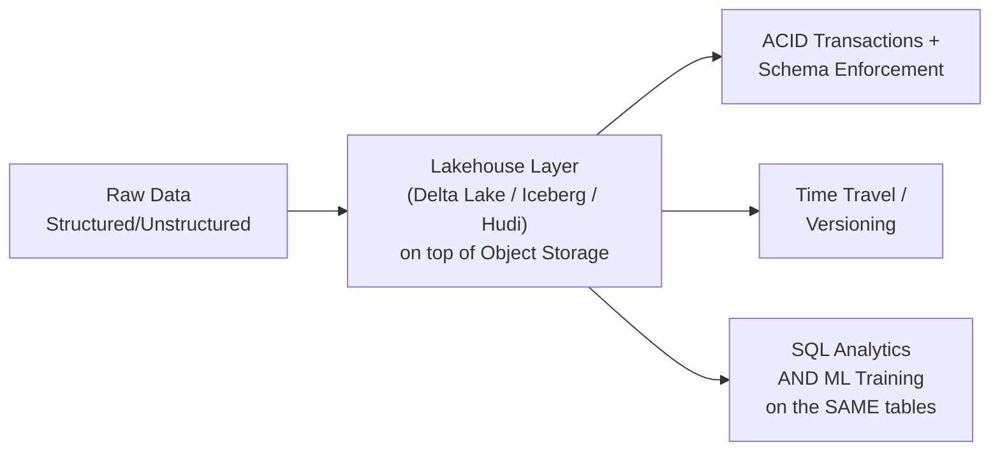

## Introduction

Where does all the data from Chapters 7 and 8 actually *live*? This chapter covers the three dominant storage architectures underpinning AI systems: the **data lake**, the **data warehouse**, and the more recent **lakehouse** that attempts to combine the strengths of both. Choosing correctly here affects training data preparation cost, query flexibility, and how quickly your data science and ML engineering teams can iterate.

## Data Warehouses

A data warehouse stores **structured, schema-enforced** data, optimized for fast analytical (OLAP) queries — think large fact and dimension tables, star schemas, and SQL-based access. Examples: Snowflake, Google BigQuery, Amazon Redshift.

- **Schema-on-write**: data must conform to a predefined schema before it's loaded in, enforced upfront.
- **Strengths**: fast, well-optimized SQL queries over structured data; strong governance and data quality guarantees (bad data is rejected at write time); mature BI tool integration.
- **Weaknesses**: expensive to store large volumes of raw, unstructured, or semi-structured data (images, free text, logs, JSON blobs) — everything has to fit a schema; less suited to the exploratory, ad-hoc access patterns common in ML feature engineering and model training.

## Data Lakes

A data lake stores **raw data in its native format** — structured, semi-structured, or unstructured — at massive scale and low cost, typically on object storage (Amazon S3, Google Cloud Storage, Azure Data Lake Storage), using open file formats (Parquet, ORC, Avro).

- **Schema-on-read**: data is stored as-is; schema/structure is applied only when the data is read/queried, giving maximum flexibility for varied data types.
- **Strengths**: cheap, massively scalable storage for any data type (raw logs, images, text, video, structured tables); ideal for the kind of large, varied, and often messy datasets ML training requires; no upfront schema enforcement means faster ingestion of new data sources.
- **Weaknesses**: without discipline, becomes a "data swamp" — ungoverned, undocumented, hard to trust or query efficiently; historically lacked strong transactional guarantees (a query could read a data lake file mid-write and see corrupted, inconsistent data); typically slower for ad-hoc SQL analytics than a purpose-built warehouse.

## The Lakehouse: Combining Both

The lakehouse architecture (popularized by Delta Lake, Apache Iceberg, and Apache Hudi) adds **warehouse-like reliability and query performance directly on top of data-lake-style low-cost storage**, closing the gap between the two paradigms:

- **ACID transactions** on top of object storage — solving the data lake's historical "read mid-write corruption" problem.
- **Schema enforcement and evolution** — you get governance similar to a warehouse, but with the flexibility to evolve schemas over time without a full rewrite.
- **Time travel / versioning** — query the data lake as it existed at a previous point in time, extremely valuable for ML reproducibility (Chapter 13) since you can exactly reconstruct the training data snapshot used for a specific model version.
- **Unified batch and streaming writes** into the same underlying tables.

For AI systems specifically, the lakehouse pattern has become dominant because it removes a historically painful requirement: maintaining **two separate copies** of your data — one in a lake for ML training, one in a warehouse for analytics — which inevitably drift out of sync and duplicate storage cost.

## Feature Store as a Layer On Top

It's worth previewing a connection to Part 3: a **feature store** (Chapter 13/17) is typically built *on top of* one of these storage layers (often a lakehouse for the offline side, plus a low-latency key-value store like Redis or DynamoDB for the online side) — the feature store adds a feature-specific abstraction (feature definitions, point-in-time correctness, online/offline consistency) rather than being a separate storage paradigm of its own.

## Choosing the Right Architecture: A Decision Guide

| Requirement | Best Fit |
|---|---|
| Fast SQL analytics/BI dashboards over structured business data | Data Warehouse |
| Storing raw, varied data (logs, images, text) cheaply at scale for ML training | Data Lake |
| Need both governed, reliable analytics AND flexible ML training on the same data, without duplication | Lakehouse |
| Need exact reproducibility of a training dataset snapshot from 6 months ago | Lakehouse (time travel) or a data lake with explicit dataset versioning (Chapter 13) |
| Strict schema governance is a hard compliance requirement | Data Warehouse (or a lakehouse with strict schema enforcement enabled) |

## A Worked Example: Storage Architecture for a Recommendation System

- **Raw event logs** (clicks, views, purchases) land in a **data lake** in their native, high-volume, semi-structured form (e.g., JSON or Parquet), ingested via the streaming or batch pipelines from Chapter 8.
- A **lakehouse layer** (e.g., Delta Lake tables) sits on top, providing ACID guarantees and enabling both the data science team to run ad-hoc SQL exploration and the ML training pipeline to reliably read a consistent, versioned snapshot of that same data.
- Curated, business-critical aggregates (e.g., daily active users, revenue by category) are also materialized into a **data warehouse** for executive dashboards and BI reporting, where query performance and strict governance matter more than ML flexibility.
- A **feature store** reads from the lakehouse to materialize offline training features and pushes the same feature definitions to a low-latency online store for real-time serving.

## Data Governance Considerations

Regardless of architecture, at scale you need a **data catalog** (e.g., Apache Atlas, DataHub, or a cloud provider's native catalog) to track what data exists, its schema, its lineage (where did this table's data originally come from, and what transformations produced it), and its ownership — without this, even a well-architected lakehouse can degrade into an undiscoverable, untrusted "data swamp" over time as the number of tables and pipelines grows into the hundreds or thousands. We dedicate Chapter 11 specifically to the privacy and governance dimension of this problem.

## Key Takeaways

- Data warehouses offer fast, governed SQL analytics over structured, schema-enforced data but are costly and rigid for varied, large-scale ML training data.
- Data lakes offer cheap, flexible storage for any data type at massive scale but historically lacked transactional reliability and strong governance.
- The lakehouse architecture combines both — ACID transactions, schema enforcement, and time travel directly on low-cost object storage — and has become the dominant modern pattern specifically because it avoids maintaining duplicate, drifting copies of data for analytics versus ML training.
- A feature store is typically built as a layer on top of a lakehouse (offline) plus a low-latency store (online), not a separate storage paradigm.

---

## Interview Questions

**1. What's the fundamental difference between a data lake and a data warehouse?**
A data warehouse enforces a predefined schema at write time (schema-on-write) and stores structured, cleaned data optimized for fast SQL analytical queries; a data lake stores raw data in its native format (structured, semi-structured, or unstructured) at low cost and applies schema only when the data is read (schema-on-read), prioritizing flexibility and scale over upfront structure and query performance.
*Follow-up: Why is schema-on-read particularly valuable for ML training data specifically, compared to schema-on-write?*
ML training often needs access to varied, evolving raw data (new event types, unstructured text/images, experimental new fields) before a rigid schema has been finalized or agreed upon — schema-on-read lets you ingest and start using this data immediately, applying whatever interpretation/schema makes sense for a specific training job, without needing to first redesign and migrate a warehouse schema every time a new data type or field is introduced.

**2. What problem does the "lakehouse" architecture solve that a plain data lake doesn't?**
A plain data lake historically lacked ACID transactional guarantees, meaning a query could read a file while it was still being written, seeing incomplete or corrupted data; it also lacked strong schema enforcement, which over time can degrade an unmanaged lake into an untrusted "data swamp." The lakehouse architecture (e.g., Delta Lake, Iceberg) adds ACID transactions, schema enforcement/evolution, and time-travel/versioning directly on top of the same low-cost object storage, giving you data-lake-level flexibility and cost with warehouse-level reliability.
*Follow-up: What's a concrete ML use case that specifically benefits from a lakehouse's "time travel" capability?*
Reproducing the exact training dataset snapshot used to train a specific historical model version — if a model's performance regresses in production and you need to debug whether the issue stemmed from a change in the underlying data versus the model code, time travel lets you query the lakehouse tables exactly as they existed at the time that model was originally trained, isolating the data as a variable rather than guessing.

**3. Why did companies historically end up maintaining separate copies of data in both a data lake and a data warehouse, and what problem did that create?**
Data lakes were used for ML training and exploratory data science (needing raw, flexible, large-scale data), while data warehouses were used for business intelligence and analytics (needing fast, governed, structured queries) — since neither system alone satisfied both use cases well, teams would ETL (extract-transform-load) data from the lake into the warehouse, creating two copies. This created data duplication cost, synchronization lag between the two copies, and a recurring class of bugs where the two copies drifted out of consistency with each other over time.
*Follow-up: How does the lakehouse architecture directly eliminate this duplication problem?*
By adding warehouse-like reliability, schema enforcement, and query performance directly on top of the lake's existing object storage, a single set of lakehouse tables can serve both the BI/analytics use case (via fast SQL queries with ACID guarantees) and the ML training use case (via direct, flexible access to the same underlying data), removing the need to maintain and synchronize two separate copies.

**4. When would you still choose a dedicated data warehouse over a lakehouse, despite the lakehouse's broader capabilities?**
When the workload is overwhelmingly structured, well-defined analytical SQL queries and BI dashboards with strict governance/compliance requirements, and there's little to no need for flexible, ML-training-style access to raw unstructured data — a purpose-built, highly optimized warehouse can still offer superior query performance and more mature BI tool integrations for that narrower use case than a more general-purpose lakehouse, especially for organizations without significant unstructured/ML data needs.
*Follow-up: Is this trade-off more about raw technical capability, or about organizational and tooling maturity? Explain.*
It's largely about tooling maturity and workload specificity rather than a fundamental technical limitation — modern lakehouse platforms have closed much of the historical performance gap for structured analytical queries, but organizations with deeply entrenched BI tooling, established warehouse-specific optimizations, and purely structured-data needs may not see enough marginal benefit from migrating to justify the transition cost, especially if they have no significant unstructured or ML training data requirements driving the need for lakehouse flexibility.

**5. How would you design the storage architecture for a recommendation system that needs both ML training data and executive BI dashboards?**
Raw event logs land in a data lake (or lakehouse) in their native format via the ingestion pipelines from Chapter 8; a lakehouse layer on top provides ACID guarantees and schema management, serving as the single source of truth that both the ML training pipeline and ad-hoc data science exploration read from directly; curated, pre-aggregated business metrics (e.g., daily revenue, active users) are additionally materialized into a data warehouse (or a warehouse-like layer within the same lakehouse) specifically optimized for fast BI dashboard queries, since those queries have different performance characteristics than large-scale ML training data reads.
*Follow-up: Why might you still materialize a separate, curated warehouse layer for BI even when using a lakehouse that could theoretically serve both use cases from the same tables?*
BI dashboard queries are typically small, highly repetitive, latency-sensitive aggregate queries (e.g., "today's revenue by region") that benefit from pre-aggregation and warehouse-specific query optimization, whereas the underlying raw or lightly-processed lakehouse tables used for ML training are often much larger and structured for different access patterns (full historical scans, complex feature joins) — materializing a curated, pre-aggregated layer specifically for BI avoids forcing every dashboard query to scan and aggregate large raw tables on the fly, even if both ultimately trace back to the same lakehouse source of truth.

**6. What is "schema evolution," and why does it matter more in a lakehouse than in a traditional data warehouse?**
Schema evolution is the ability to add, remove, or modify columns/fields in a table's structure over time without requiring a full rewrite of existing data or breaking existing queries/consumers. It matters more in ML-heavy lakehouse contexts because ML feature engineering and data sources evolve rapidly and frequently (new features are constantly being explored and added) compared to the more stable, carefully-governed schemas typical of traditional warehouse fact/dimension tables, so the lakehouse needs to gracefully accommodate this faster pace of change without sacrificing the reliability guarantees warehouses traditionally provided.
*Follow-up: What's a risk of schema evolution being too permissive, without any governance controls?*
Overly permissive schema evolution (e.g., silently allowing any new field to be added, or allowing a field's data type to change without validation) can reintroduce the "data swamp" problem the lakehouse was meant to solve — inconsistent, undocumented, or incompatible schema changes propagating downstream and silently breaking consumers (including ML feature pipelines) that assumed a stable schema, so schema evolution should be paired with governance policies (e.g., requiring backward compatibility, requiring new fields to have defaults) rather than allowing unrestricted changes.

**7. How does a feature store relate to data lakes, warehouses, and lakehouses — is it a fourth, separate storage paradigm?**
No — a feature store is typically built as a specialized layer on top of one or more of these existing storage paradigms rather than being an independent storage architecture itself: it commonly uses a lakehouse (or data lake) for its offline store (serving large-scale batch feature retrieval for training) and a separate low-latency key-value store (like Redis or DynamoDB) for its online store (serving fast feature lookups at inference time), adding feature-specific abstractions (feature definitions, point-in-time correctness, offline/online consistency) on top of that underlying storage.
*Follow-up: Why does the online store component of a feature store typically use a different underlying technology (like Redis) rather than reusing the lakehouse for both offline and online serving?*
Lakehouse/data-lake storage (built on object storage like S3) is optimized for large-scale batch reads and writes, not for the sub-10-millisecond, high-throughput point lookups required for real-time online inference — a purpose-built low-latency key-value store like Redis or DynamoDB is architecturally suited to that specific access pattern in a way that object-storage-based lakehouse tables are not, which is why feature stores typically use two different underlying storage technologies for their offline versus online components.

**8. What does "data swamp" mean, and what causes a data lake to degrade into one?**
A data swamp is a data lake that has become disorganized, undocumented, and untrusted — so much raw data has accumulated without proper cataloging, schema documentation, quality validation, or ownership tracking that it becomes difficult or impossible for teams to discover what data exists, trust its accuracy, or understand its lineage. It's caused by the very flexibility that makes data lakes valuable (schema-on-read, minimal upfront structure) being exploited without complementary governance investment (data catalogs, quality checks, clear ownership) to keep the lake navigable and trustworthy as it grows.
*Follow-up: What specific tooling or practice would you introduce to prevent a growing data lake from becoming a data swamp?*
A data catalog (e.g., DataHub, Apache Atlas, or a cloud-native equivalent) that tracks schema, data lineage (what upstream sources and transformations produced this table), ownership, and usage/quality metadata for every dataset in the lake, combined with automated data quality validation checks (Chapter 12) integrated into the ingestion pipelines, so that both discoverability (can people find and understand the data) and trustworthiness (is the data actually correct) are actively maintained rather than left to erode as the lake grows.

**9. Why is "time travel" in a lakehouse particularly valuable for debugging a production ML incident, compared to not having it?**
Without time travel, if a model trained weeks or months ago starts behaving unexpectedly in production, you have no reliable way to inspect exactly what the training data looked like at the time that model was trained — the underlying tables have since been updated, corrected, or had new data appended, making it impossible to cleanly separate "did the model code have a bug" from "did the training data itself have an issue that's since been silently fixed or changed." Time travel lets you query the lakehouse tables exactly as they existed at a specific historical timestamp, isolating the data as a fixed, reproducible variable during debugging.
*Follow-up: How does this connect to the broader ML system design principle of reproducibility, covered elsewhere in this series?*
Time travel is one of the key infrastructure capabilities that makes reproducibility (Chapter 13's data versioning discussion) actually achievable at the storage layer — reproducibility requires being able to reconstruct the exact inputs (data, code, configuration) that produced a specific model, and without a storage layer capable of preserving and retrieving historical data states, data versioning would require maintaining full, expensive, manually-managed snapshots rather than relying on the lakehouse's built-in versioning mechanism.

**10. How would you handle storing large volumes of unstructured data (e.g., images or video) for training a computer vision model, given the storage architectures discussed in this chapter?**
Store the raw unstructured files (images/video) directly in object storage (the foundation of a data lake), typically with a companion structured or semi-structured metadata table (in the lakehouse layer) that references each file's storage location alongside relevant metadata (labels, capture timestamp, source, quality flags) — this separates the bulk, immutable raw binary data (which benefits from cheap object storage) from the queryable, evolving metadata (which benefits from a lakehouse's schema enforcement, ACID transactions, and query capabilities).
*Follow-up: Why wouldn't you store the raw image/video binary data directly inside a data warehouse table?*
Data warehouses are optimized for structured, typically much smaller, analytical data and are not cost-effective or architecturally well-suited for storing very large binary blobs at scale — object storage underlying a data lake is dramatically cheaper per unit of storage for this kind of bulk, unstructured data, and warehouses generally aren't designed to efficiently serve large binary file reads the way object storage and its associated access patterns are.

**11. What's the relationship between data storage architecture choice and training-serving skew (introduced in Chapter 4)?**
While storage architecture alone doesn't directly cause or prevent training-serving skew (that's primarily a feature computation consistency issue), a poorly governed or duplicated storage architecture — e.g., separate, drifting copies of data in a lake versus a warehouse — increases the risk that the offline training pipeline and online serving pipeline end up reading from subtly different, out-of-sync versions of what should be the same underlying data, compounding the risk of skew. A well-designed lakehouse, serving as a single consistent source of truth for both analytics and ML training, reduces (though doesn't eliminate) this particular risk factor.
*Follow-up: Does eliminating storage-level duplication (via a lakehouse) fully solve training-serving skew on its own? Why or why not?*
No — training-serving skew is primarily about ensuring the *feature computation logic* itself (not just the raw underlying data) is identical between the offline training path and the online serving path; even with a single consistent lakehouse as the data source, if the training pipeline and serving pipeline independently reimplement the same feature's transformation logic (e.g., a rolling average calculation) in different code, skew can still occur — this is exactly why a feature store (Chapter 13/17), which unifies the feature computation logic itself, is needed as an additional layer beyond just consistent underlying storage.

**12. If you were designing a storage architecture from scratch for a startup with limited engineering resources, would you start with a lakehouse or a simpler data lake, and why?**
I'd generally start with a simpler, well-organized data lake (with basic governance practices like clear naming conventions, a lightweight data catalog, and consistent file formats like Parquet) rather than immediately adopting a full lakehouse platform, since the added complexity and operational overhead of ACID transaction guarantees and time-travel capabilities may not be justified at a small scale with few concurrent readers/writers and limited historical reproducibility needs — I'd plan to migrate to a lakehouse architecture once the team's data volume, concurrent access patterns, or reproducibility/compliance needs grow enough to justify the added investment.
*Follow-up: What specific signal or trigger would tell you it's time to migrate from a plain data lake to a lakehouse architecture?*
Recurring data consistency issues (e.g., analysts or ML engineers encountering incomplete or corrupted reads due to concurrent writes), a growing need for reliable historical reproducibility (e.g., regulatory requirements or repeated debugging needs requiring exact historical data snapshots), or the pain of maintaining duplicate lake-and-warehouse copies becoming a measurable engineering burden — any of these concrete pain points would justify the migration investment, rather than adopting the more complex architecture preemptively without a demonstrated need.

**13. How does data storage architecture choice affect the feasibility of building a real-time feature store, as discussed in Chapter 8's streaming pipelines?**
A lakehouse or data lake, built on object storage, is fundamentally not designed for the low-latency point lookups a real-time feature store's online component requires — regardless of storage architecture choice at the batch/analytical layer, a separate low-latency store (Redis, DynamoDB, or similar) is still necessary for the online serving path; however, a well-designed lakehouse does make it easier to reliably materialize the *offline* half of the feature store (historical feature values for training) with strong consistency guarantees, which indirectly supports overall feature store reliability even though it doesn't replace the need for a dedicated online store.
*Follow-up: Could a company theoretically skip a separate low-latency online store and serve real-time features directly from a lakehouse? What would be the consequence?*
Technically possible for very low-traffic or latency-tolerant use cases, but for most real-time inference scenarios requiring sub-10-50ms feature lookups, querying object-storage-backed lakehouse tables directly would introduce latency far exceeding acceptable serving budgets — the consequence would be either unacceptably slow online predictions or the need to build significant additional caching infrastructure on top of the lakehouse anyway, effectively reinventing a dedicated low-latency store rather than truly avoiding the need for one.

**14. In an interview, how would you justify choosing a lakehouse architecture over maintaining separate lake and warehouse systems, if a candidate proposed the latter?**
I'd point out that maintaining separate systems requires an ETL process to copy and transform data from the lake into the warehouse, which introduces synchronization lag (the warehouse copy is always somewhat behind the lake), duplicated storage cost, and — most importantly — a recurring risk of the two copies drifting out of consistency with each other over time as pipelines evolve independently; a lakehouse eliminates this entire class of problems by serving both use cases from a single, consistently governed set of tables, at the cost of some additional platform complexity in setting up the lakehouse layer itself.
*Follow-up: Is there ever a valid reason to still prefer the separate lake-and-warehouse approach today, given mature lakehouse platforms exist?*
Yes — an organization with deep existing investment in a specific warehouse platform's proprietary optimizations, tooling, and team expertise, and with data/workload characteristics that don't significantly benefit from lakehouse-specific capabilities (e.g., minimal ML training needs, purely structured data, no significant reproducibility/time-travel requirements), might reasonably decide that the migration cost and risk of consolidating onto a lakehouse outweighs the benefits, especially if their current separate-system pain points (sync lag, duplication cost) are already well-managed and not causing significant operational issues.

**15. How would you explain the evolution from data warehouse to data lake to lakehouse as a historical narrative, and what does that evolution reveal about how ML needs shaped data infrastructure?**
Data warehouses came first, optimized for structured business analytics; as ML and data science needs grew, teams needed cheap, flexible storage for the large, varied, often unstructured datasets ML training requires, which warehouses weren't well-suited for — giving rise to data lakes. But data lakes, in solving the flexibility and cost problem, sacrificed the reliability and governance that warehouses provided, leading to the "data swamp" problem; the lakehouse emerged specifically to bring warehouse-level reliability and governance back to the flexible, low-cost lake foundation, driven substantially by the growing recognition that ML and analytics needs could and should be served from a single, consistent, well-governed data platform rather than perpetually trading off between the two.
*Follow-up: What does this evolution suggest about how you should evaluate emerging data infrastructure trends in the future?*
It suggests that new data infrastructure trends often emerge from genuine, identifiable pain points in previous approaches (rigid schemas blocking ML flexibility → lakes; lakes' lack of governance and reliability → lakehouses) rather than being adopted purely for novelty, so when evaluating a new trend, the right question is "what specific, concrete pain point does this solve that our current architecture genuinely suffers from," rather than assuming newer inherently means better for every use case and team's specific needs.
