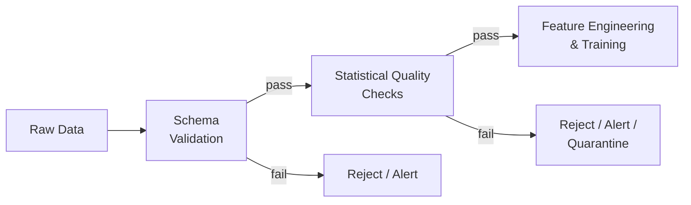
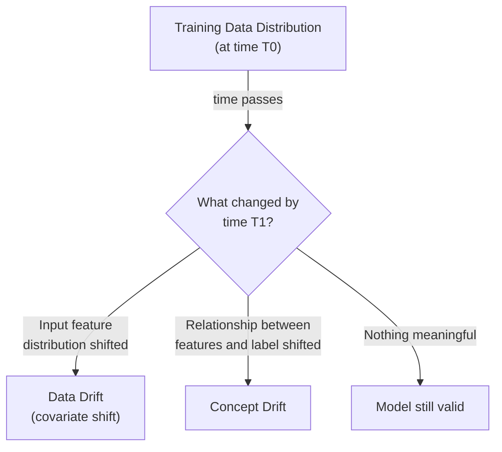

## Introduction

Chapter 1 made a bold claim: most ML system failures are engineering failures, not modeling failures, and a large share of those trace back to data quality. This chapter builds the concrete toolkit for catching bad data *before* it silently corrupts a model — schema validation, statistical data quality checks, and an introduction to drift detection (which we'll revisit in full production depth in Chapter 32, once we've covered serving).

## Why Data Validation Deserves Its Own Pipeline Stage

Recall Stage 2 of the lifecycle from Chapter 4: data processing and validation, sitting between raw collection and feature engineering. Validation exists as an explicit, separate stage because catching a data issue here is orders of magnitude cheaper than catching it after a model has already been trained on it (Stage 5) or, worse, after that model is already in production (Stage 7) — the further downstream an issue is caught, the more expensive and harder-to-diagnose it becomes.



## Schema Validation

The first line of defense: does the incoming data even conform to the expected structure? This catches issues like:

- **Type mismatches**: a numeric field unexpectedly containing a string.
- **Missing required fields**: an upstream change silently drops a field the pipeline depends on.
- **Unexpected new fields**: not necessarily an error, but worth flagging for review (could indicate an upstream schema change that needs to be intentionally incorporated).
- **Value range violations**: an "age" field containing a negative number, or a "percentage" field containing 150.

```python
# Example using Pandera, a Python library for declarative
# schema validation of pandas/Spark DataFrames.

import pandera as pa
from pandera.typing import Series

class TransactionSchema(pa.DataFrameModel):
    user_id: Series[str] = pa.Field(nullable=False)
    amount: Series[float] = pa.Field(ge=0, le=1_000_000)  # sane bounds
    currency: Series[str] = pa.Field(isin=["USD", "EUR", "GBP", "INR"])
    timestamp: Series[pa.DateTime] = pa.Field(nullable=False)

    class Config:
        coerce = True  # attempt type coercion before failing

def validate_batch(df):
    try:
        TransactionSchema.validate(df, lazy=True)  # collect ALL errors, not just first
        return True, None
    except pa.errors.SchemaErrors as e:
        # e.failure_cases gives a structured report of every violation
        return False, e.failure_cases
```

## Statistical Data Quality Checks

Schema validation catches structural issues but misses *distributional* ones — a field can be perfectly well-typed and within range, yet still represent a meaningful quality problem. Statistical checks catch things like:

- **Null/missing rate spikes**: a field that's normally 99% populated suddenly drops to 60% populated — likely an upstream pipeline break, not a genuine change in the world.
- **Unexpected class distribution shifts**: the ratio of fraud to non-fraud labels in a new data batch is wildly different from historical norms — could be a genuine trend, or a labeling pipeline bug.
- **Duplicate rate anomalies**: a spike in exact-duplicate records, often indicating an upstream retry-without-deduplication bug.
- **Outlier rate anomalies**: a sudden increase in extreme values that fall many standard deviations from the historical mean.

```python
# Example using Great Expectations, a popular open-source
# data validation framework, to define statistical expectations
# on a batch of data before it proceeds downstream.

import great_expectations as gx

context = gx.get_context()
validator = context.sources.pandas_default.read_csv("transactions_batch.csv")

# Structural expectations
validator.expect_column_values_to_not_be_null("user_id")
validator.expect_column_values_to_be_between("amount", min_value=0, max_value=1_000_000)

# Statistical / distributional expectations
validator.expect_column_proportion_of_unique_values_to_be_between(
    "transaction_id", min_value=0.99, max_value=1.0  # should be nearly all unique
)
validator.expect_column_mean_to_be_between(
    "amount", min_value=20, max_value=80  # based on historical norms
)
validator.expect_column_value_lengths_to_be_between("currency", min_value=3, max_value=3)

results = validator.validate()
if not results["success"]:
    # Route to alerting / quarantine rather than letting bad
    # data silently flow into feature engineering and training.
    raise ValueError("Data quality check failed — see results for details")
```

Tools like **Great Expectations**, **Deequ** (from AWS), and **TensorFlow Data Validation (TFDV)** are purpose-built for expressing and automatically checking these kinds of expectations as part of a data pipeline, rather than relying on ad-hoc scripts or manual review.

## Introducing Drift: Why Validation Alone Isn't Enough

Schema and statistical validation catch *known, expected* quality bars being violated. But there's a subtler, harder problem: data that's perfectly well-formed, within expected ranges, and passes every explicit check — yet the underlying real-world distribution it represents has genuinely shifted. This is **drift**, and it's the reason validation checks alone don't fully solve the "silent failure" problem from Chapter 4.

Two flavors matter here, previewed now and covered in full production depth in Chapter 32:

- **Data drift (covariate shift)**: the distribution of input features changes, even though the relationship between features and the true label hasn't changed. Example: your user base's average age shifts because of a successful new marketing campaign targeting a younger demographic.
- **Concept drift**: the relationship between input features and the true label itself changes. Example: the same spending pattern that used to indicate "not fraud" now indicates "fraud" because fraudsters have adapted their tactics to mimic legitimate behavior.



## A First Look at Drift Detection Techniques

A full treatment belongs in Chapter 32 (once we've covered serving, since production monitoring is where drift detection is actually operationalized), but it's worth previewing the core statistical tools here since they build directly on the data quality foundation of this chapter:

- **Population Stability Index (PSI)**: a single number summarizing how much a feature's distribution has shifted between two time periods (e.g., training time vs. current production data), by comparing the proportion of examples falling into each bucket of the feature's range.
- **Kolmogorov-Smirnov (KS) test**: a statistical test comparing whether two samples (e.g., training-time feature values vs. current feature values) come from the same underlying distribution.
- **Chi-squared test**: similar in spirit to KS but suited to categorical rather than continuous features.

```python
# Simplified PSI calculation for a single numeric feature,
# comparing a reference (training-time) distribution to a
# current (production) distribution.

import numpy as np

def population_stability_index(reference: np.ndarray, current: np.ndarray, buckets: int = 10) -> float:
    breakpoints = np.quantile(reference, np.linspace(0, 1, buckets + 1))
    breakpoints[0], breakpoints[-1] = -np.inf, np.inf  # catch all values

    ref_counts, _ = np.histogram(reference, bins=breakpoints)
    cur_counts, _ = np.histogram(current, bins=breakpoints)

    ref_pct = np.clip(ref_counts / len(reference), 1e-6, None)  # avoid log(0)
    cur_pct = np.clip(cur_counts / len(current), 1e-6, None)

    psi = np.sum((cur_pct - ref_pct) * np.log(cur_pct / ref_pct))
    return psi

# Rule-of-thumb interpretation:
#   PSI < 0.1  -> no significant shift
#   0.1 - 0.25 -> moderate shift, worth investigating
#   PSI > 0.25 -> significant shift, likely needs action
```

## Data Quality as Part of the Feedback Loop

Data quality checks aren't a one-time gate you set up and forget — they should be run continuously, on every new batch or streaming micro-batch, as a permanent part of the pipeline (tying directly back to Chapter 4's "loop, not pipeline" framing). A validation suite that was correct when written can itself become outdated as the business legitimately evolves (e.g., a new valid currency is added, and your `isin=["USD","EUR","GBP","INR"]` check now incorrectly rejects valid data) — so validation rules themselves need periodic review and versioning, not just the data they check.

## Key Takeaways

- Data validation deserves its own explicit pipeline stage, because catching a data issue here is far cheaper than catching it after training or in production.
- Schema validation catches structural issues (types, missing fields, range violations); statistical quality checks catch distributional issues (null-rate spikes, class imbalance shifts, outlier anomalies) that schema validation alone misses.
- Tools like Great Expectations, Deequ, and TFDV let you express these checks declaratively and run them automatically as part of every pipeline run.
- Drift (data drift and concept drift) is a distinct, harder problem beyond simple validation — data can be perfectly well-formed and still represent a meaningfully shifted, and therefore less-representative, distribution.
- Data quality rules themselves need periodic review, since a rule that was correct when written can become outdated as the business legitimately evolves.

---

## Interview Questions

**1. Why is data validation treated as its own dedicated pipeline stage, rather than something checked only once during initial model training?**
Because data quality issues can be introduced at any point — an upstream schema change, a bug in a labeling pipeline, an external data provider's format change — and the cost of catching an issue rises dramatically the further downstream it's discovered; validating continuously at the point of ingestion, on every new batch, catches issues immediately and cheaply, before they propagate into feature engineering, training, or worst of all, a production model silently making bad predictions on corrupted input.
*Follow-up: What's a concrete cost difference between catching a data quality issue at the validation stage versus discovering it only after a model is already in production?*
Catching it at validation typically means simply rejecting or quarantining the bad batch and alerting an engineer, a fix that can happen within minutes to hours with minimal downstream impact; discovering it in production means a model has already been trained on (or is actively receiving) corrupted data, requiring you to retroactively identify which model versions and downstream business decisions were affected, retrain and redeploy a corrected model, and potentially remediate any business harm already caused — a process that can take days to weeks and carries real financial or trust cost.

**2. What's the difference between schema validation and statistical data quality checks, and why do you need both?**
Schema validation checks structural correctness — data types, required fields present, values within a defined valid range — catching issues like a numeric field unexpectedly containing text or a percentage field containing an impossible value like 150. Statistical data quality checks examine distributional properties — null rate, class balance, duplicate rate, outlier rate — catching issues that are structurally valid (every value is a well-typed, in-range number) but still represent a meaningful quality problem, like a sudden spike in missing values or an unexpected shift in class distribution. Schema validation alone would miss these distributional anomalies entirely, since each individual value can still be perfectly valid according to the schema.
*Follow-up: Give an example of a data quality issue that would pass schema validation but fail a statistical check.*
A sudden drop in a normally 99%-populated "email" field down to 40% populated — every present email value is still perfectly well-formed and passes schema validation (correct type, valid format), but the sharp increase in null values likely indicates an upstream pipeline break or a change in how the data is being collected, which only a statistical null-rate check would catch.

**3. What is Population Stability Index (PSI), and how would you interpret different PSI values in a production monitoring context?**
PSI is a statistical measure that summarizes how much a feature's distribution has shifted between a reference period (e.g., the training data) and a current period (e.g., recent production data), by comparing the proportion of examples in each bucket of the feature's range between the two periods. As a rule of thumb, a PSI below roughly 0.1 suggests no significant shift, 0.1-0.25 suggests a moderate shift worth investigating, and above 0.25 suggests a significant shift likely requiring action (such as retraining or investigating the root cause).
*Follow-up: What's a limitation of using PSI as your only drift detection method?*
PSI is typically computed per individual feature and doesn't directly capture shifts in the joint relationship between multiple features, or shifts in the relationship between features and the true label (concept drift) — a feature could show a low PSI (its individual distribution looks stable) while the underlying relationship it has with the outcome you're predicting has still meaningfully changed, so PSI alone isn't sufficient to catch every form of drift, and should be complemented by monitoring actual model performance metrics where ground truth is available.

**4. What's the difference between data drift and concept drift, and why does it matter which one you're experiencing?**
Data drift (covariate shift) is a change in the distribution of input features, while the underlying relationship between those features and the true outcome remains unchanged — e.g., your user base's age distribution shifts due to a marketing campaign, but age still relates to purchasing behavior the same way it always did. Concept drift is a change in the actual relationship between features and the outcome itself — e.g., a spending pattern that used to reliably indicate legitimate behavior now indicates fraud because fraudsters have adapted. It matters because the appropriate response differs: data drift might just require ensuring your model has seen a representative range of the new input distribution (potentially solvable with re-sampling or additional training data), while concept drift means the model's learned relationships are now fundamentally wrong and require retraining on newly-labeled, recent data reflecting the new relationship.
*Follow-up: Can you have data drift without concept drift, or vice versa? Give an example of each.*
Yes to both — data drift without concept drift: a recommendation system sees a shift in the age distribution of its users, but younger and older users still exhibit the same underlying preference patterns relative to their demographics, so the model's learned relationships remain valid even though the input distribution has shifted. Concept drift without significant data drift: a fraud model sees roughly the same distribution of transaction amounts and patterns as before, but fraudsters have learned to structure their transactions to look statistically identical to legitimate ones, meaning the same input distribution now maps to a different, more ambiguous true label distribution than the model was trained on.

**5. Why can't schema and statistical validation alone fully protect you against the "silent failure" problem introduced in Chapter 4?**
Both types of validation check against fixed, predefined expectations of what "good" data looks like based on historical patterns — but drift (data or concept drift) can occur even when every individual value remains well-formed, in-range, and doesn't trigger any statistical anomaly threshold, because the shift is a genuine, gradual, and legitimate change in the real world rather than a data quality "bug" that validation rules are designed to catch. Distinguishing "the world has genuinely and validly changed" from "there's a data quality bug" requires ongoing comparison of the model's actual real-world performance and behavior, not just checks on the raw data's structural or statistical properties in isolation.
*Follow-up: What kind of monitoring, beyond data validation, is needed to catch drift that passes all validation checks?*
Monitoring the model's own prediction distribution over time (has the mix of predicted outcomes shifted meaningfully?) and, wherever ground truth eventually becomes available, tracking actual model accuracy/performance metrics on live data — since a genuine, valid distributional or relational shift that still causes the model to make worse decisions will eventually show up in degraded live performance metrics, even if it passed every upstream data validation check, which is the full production monitoring topic covered in Chapter 32.

**6. How would you decide what to do when a data validation check fails — should it always block the pipeline, or are there cases where you'd let it proceed with a warning?**
It depends on the severity and confidence of the failure: a hard schema violation (e.g., a required field is entirely missing, or a critical field's type is wrong) should typically block the pipeline entirely, since downstream processing likely can't function correctly at all; a statistical anomaly (e.g., null rate slightly above a threshold, or a minor distributional shift) might instead trigger an alert and quarantine the specific affected records for review, while allowing the rest of the batch to proceed, especially if blocking the entire pipeline for a partial, lower-severity issue would cause more business harm (e.g., delayed model refresh) than the data quality issue itself.
*Follow-up: How would you design the system to avoid "alert fatigue" if these thresholds are set too sensitively?*
Establish clear severity tiers (e.g., critical/blocking vs warning/non-blocking) with different response requirements for each, calibrate thresholds based on historical natural variation in each specific metric (rather than using one-size-fits-all thresholds across all fields), and periodically review and tune thresholds based on how often past alerts turned out to be genuine issues versus false alarms — an alerting system that cries wolf too often trains engineers to ignore it, which defeats the entire purpose of having validation in place.

**7. What tools are commonly used for expressing and automating data quality checks in production pipelines, and what do they provide that ad-hoc validation scripts don't?**
Tools like Great Expectations, AWS Deequ, and TensorFlow Data Validation (TFDV) let you declaratively define expectations (e.g., "this column should never be null," "this column's mean should be between X and Y") as structured, reusable, version-controlled configuration rather than scattered, imperative validation code — they also typically provide built-in reporting/dashboarding of validation results over time, integration with pipeline orchestration tools (to automatically block or alert on failures), and the ability to auto-generate a baseline set of expectations by profiling an initial "known good" dataset.
*Follow-up: Why is having validation expectations be declarative and version-controlled particularly valuable for a team, beyond just convenience?*
Declarative, version-controlled expectations create an explicit, auditable, and reviewable record of exactly what "data quality" means for a given dataset at any point in time — this makes it possible to track how expectations have evolved (e.g., when a new valid currency was added to the accepted list), to code-review changes to data quality rules the same way you'd review any other code change, and to quickly diagnose whether a validation failure is due to genuinely bad data or an outdated/incorrect expectation that needs to be updated as the business has legitimately evolved.

**8. Why do data quality validation rules themselves need periodic review, rather than being set once and left unchanged?**
Because the business and its data legitimately evolve over time — a new valid category, currency, or field value can be introduced that's entirely correct but wasn't anticipated when the original validation rule was written, causing the rule to incorrectly reject valid data; similarly, natural shifts in a metric's typical range (e.g., organic business growth increasing average order value) can cause a previously reasonable statistical threshold to start generating false alarms. Without periodic review, validation rules risk becoming a source of pipeline friction and false rejections rather than a genuine quality safeguard.
*Follow-up: How would you design a process to catch a validation rule that's become outdated, before it starts blocking legitimate new data?*
Track and periodically review the rate and root cause of validation failures — if a specific rule starts failing unusually often and investigation reveals the underlying data is actually valid (just previously unanticipated), that's a signal the rule itself needs updating rather than the data being genuinely problematic; some teams also build a lightweight approval/exception process so an engineer can quickly and explicitly approve a rule change (e.g., adding a new valid currency to an `isin` check) as part of routine data pipeline maintenance rather than treating every legitimate business change as an emergency data quality incident.

**9. How would you validate data quality differently for a batch pipeline versus a streaming pipeline?**
For a batch pipeline, validation typically runs as a discrete step after a complete batch has landed and before it's used downstream, checking the entire batch's schema and statistical properties at once, which allows for more thorough, potentially slower checks (e.g., computing full distributional comparisons across an entire day's data). For a streaming pipeline, validation must run on individual events or small micro-batches in near-real-time, requiring lighter-weight, faster checks (e.g., simple schema/type validation per event) since a full statistical distribution comparison isn't feasible on a single event, with heavier statistical drift checks instead computed periodically over an accumulating rolling window rather than per-event.
*Follow-up: What's a practical compromise for getting meaningful statistical quality checks (which typically need a batch of data to compute) within a streaming pipeline's real-time constraints?*
Maintain rolling window aggregates (e.g., a sliding 1-hour or 1-day window) of the statistics you care about (null rate, mean, class distribution) as part of the streaming pipeline's incremental state, and periodically (e.g., every few minutes) compare the current rolling window's statistics against a longer-term historical baseline — this gives you near-real-time statistical quality monitoring without requiring per-event full-distribution comparisons, which wouldn't be statistically meaningful or computationally feasible at that granularity.

**10. What's the relationship between data validation (this chapter) and the model monitoring covered later in Chapter 32?**
Data validation is a proactive, upstream safeguard applied to raw or lightly-processed data before it's used for training or fed into a live model, catching known structural and statistical quality issues early in the pipeline; model monitoring (Chapter 32) is a downstream, ongoing observability practice applied to the live production system, tracking the model's actual input feature distributions, output prediction distributions, and (where available) real accuracy against ground truth over time. They share underlying statistical techniques (like PSI and distributional comparison tests) but data validation focuses on catching data quality problems before they reach a model, while model monitoring focuses on detecting when a model already in production is behaving in a way that suggests degraded real-world performance, whether from a data issue, drift, or something else.
*Follow-up: Could a data quality issue exist that data validation would never catch, but model monitoring eventually would? Give an example.*
Yes — a subtle, valid, but consequential shift like concept drift (the fraud example from earlier in this chapter) can pass every data validation check (all values remain well-typed, in-range, and don't trigger any statistical anomaly on the input features alone) yet still cause a real accuracy degradation, because the *relationship* between the (still normal-looking) inputs and the true outcome has changed — this kind of drift is fundamentally only detectable by tracking actual model performance against ground truth over time, which is squarely model monitoring's domain rather than upstream data validation's.

**11. Why is `lazy=True` (or an equivalent "collect all errors" mode) an important detail when configuring a schema validation library like Pandera, rather than failing on the first error encountered?**
Failing immediately on the first validation error found means you only learn about one issue per validation run, requiring multiple slow fix-and-rerun cycles to discover and address a batch of data that might have several independent quality problems; collecting all failures in a single pass (lazy validation) gives you a complete picture of every issue present in that batch at once, letting you triage and fix multiple problems together rather than incrementally, which is significantly more efficient, especially for large, complex validation suites with many independent checks.
*Follow-up: Is there ever a case where you'd deliberately want fail-fast (non-lazy) validation instead?*
Yes — in extremely performance-sensitive contexts (e.g., validating a very high-throughput streaming pipeline where every millisecond of validation overhead matters), failing immediately on the first detected critical error can save meaningful compute by avoiding the cost of continuing to check remaining rules on data you already know is invalid and will be rejected regardless — this is a deliberate trade-off between comprehensive diagnostic information (lazy) and validation performance/speed (fail-fast), and the right choice depends on whether the validation step is on a latency-critical path.

**12. How would you approach setting statistical thresholds (e.g., "alert if null rate exceeds X%") for a brand-new data source with no historical baseline yet?**
Start conservatively with wide, generous thresholds (or purely observational logging without hard alerting) for an initial "burn-in" period, during which you collect enough historical data on that source's natural variation to establish a reasonable, statistically-grounded baseline (e.g., mean and standard deviation of the null rate over several weeks); only after this baseline period would you tighten the thresholds to something that would meaningfully catch genuine anomalies without generating excessive false alarms based on natural, expected variation you hadn't yet observed and accounted for.
*Follow-up: What's the risk of setting overly strict thresholds immediately, before this burn-in period, for a brand-new data source?*
You risk a high rate of false-positive alerts based on normal variation you simply hadn't observed yet (since you have no real baseline to compare against), which both wastes engineering time investigating non-issues and, more damagingly, trains the team to distrust or ignore alerts from that data source going forward — undermining the credibility and effectiveness of the entire validation and alerting system for that source even once genuine issues do arise.

**13. Why might you choose to quarantine (rather than immediately reject) records that fail a data quality check?**
Quarantining — routing failed records to a separate holding area for review rather than immediately discarding them — preserves the ability to manually inspect, understand, and potentially recover or correct the data later, and provides a valuable audit trail for diagnosing recurring or systemic data quality issues; immediately and silently discarding failed records risks losing potentially valuable or correctable data and makes it harder to understand the scope and pattern of a recurring data quality problem, since there's no retained record of what was rejected and why.
*Follow-up: What's a risk of quarantining data indefinitely without a clear process for reviewing and resolving quarantined records?*
The quarantine area can itself become a kind of data swamp (echoing Chapter 9's concept) — an ever-growing, unreviewed backlog of rejected records that nobody actively investigates or resolves, providing false comfort that "the bad data is being caught" while the underlying root causes producing that bad data are never actually diagnosed or fixed, and any genuinely valuable or correctable data sitting in quarantine is effectively lost by never being reviewed and reintegrated.

**14. How would data validation strategy differ between a slow-moving, well-understood data source (e.g., a stable internal database) versus a fast-changing, less controlled external data source (e.g., a third-party API feed)?**
For a stable internal source, validation rules can be relatively strict and tightly calibrated, since you have strong historical understanding and control over what "normal" looks like, and legitimate schema or distribution changes are typically rare, planned, and coordinated in advance; for a less controlled external source, validation needs to be more defensive and adaptive, anticipating unannounced schema changes, format inconsistencies, or data quality degradation from the third party, often requiring more generous initial thresholds, more robust error handling/fallback behavior, and closer, more frequent monitoring for unexpected changes that you have no advance warning of.
*Follow-up: What specific engineering pattern would you add for the external, less-controlled data source that you might not need for the stable internal one?*
A circuit breaker or fallback mechanism (conceptually related to Chapter 75's circuit breaker pattern) that detects when the external source's data quality has degraded beyond an acceptable threshold and automatically falls back to a cached last-known-good version of that data (or gracefully degrades the downstream feature/model that depends on it), rather than allowing a third-party data quality issue to directly and immediately propagate into your production pipeline the way you might more safely tolerate for a well-understood, trusted internal source.

**15. If an interviewer asks "how would you know if your training data was corrupted three months ago, and you're only discovering it now," how would you approach diagnosing this?**
I'd first check whether data validation logs and quarantine records from that period show any flagged issues around the suspected corruption timeframe, which would immediately localize when and what kind of issue occurred; if validation didn't catch it (suggesting either a genuine drift the validation rules weren't designed to detect, or a gap in validation coverage), I'd use a lakehouse's time-travel capability (Chapter 9) if available to directly inspect the data as it existed at that historical point, comparing its schema and statistical properties against both earlier and later periods to pinpoint exactly when the anomaly began and what it affected; from there, I'd trace the data lineage backward through the pipeline to identify the root cause, and forward to identify every downstream model or decision that consumed the corrupted data during that window.
*Follow-up: What would this investigation reveal about a gap in the original data validation and monitoring setup, and how would you use that finding going forward?*
It would reveal a specific blind spot — either a check that should have existed but didn't, or a threshold that was too permissive to catch this particular anomaly — and the concrete follow-up is to add or tighten that specific validation rule going forward, while also considering whether similar blind spots might exist for related data sources or features that share the same root cause, turning a single incident into a systemic improvement rather than just a one-off fix for the specific issue found.
