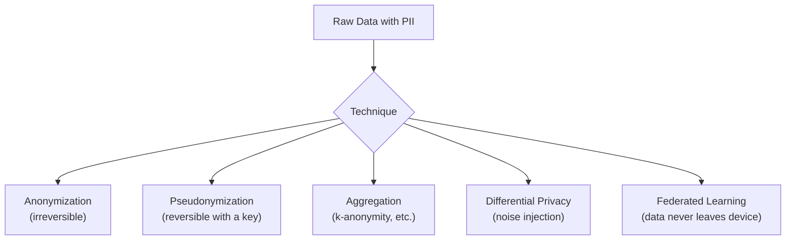

## Introduction

Part 2 closes with the constraint that shapes every decision covered in Chapters 7-10: privacy and governance. It's tempting to treat privacy as a legal afterthought bolted on after a system is designed — but strong AI system design treats it as a first-class constraint from the very first data collection decision, the same way latency or cost would be treated. This chapter covers what personally identifiable information (PII) is, the main techniques for protecting it, and the governance practices that keep an organization compliant and trustworthy at scale.

## What Counts as PII?

Personally Identifiable Information is any data that can identify a specific individual, either on its own (**direct identifiers**: name, email, phone number, government ID number) or in combination with other data (**quasi-identifiers**: ZIP code + birthdate + gender, which research has shown can uniquely identify a large majority of the US population even without a name attached). A common mistake is to only protect direct identifiers while leaving quasi-identifiers unprotected, not realizing that combinations of "harmless-looking" fields can still re-identify someone.

Special categories often subject to stricter regulatory protection include health data, financial data, biometric data, and data about children — these typically demand additional safeguards beyond standard PII handling (e.g., HIPAA for health data in the US, COPPA for children's data).

## Regulatory Landscape (High-Level)

- **GDPR** (EU): grants individuals rights including access, correction, deletion ("right to be forgotten"), and data portability; requires a lawful basis for processing personal data; mandates data minimization.
- **CCPA/CPRA** (California): grants similar rights to California residents, including the right to know what data is collected and to opt out of its sale.
- **HIPAA** (US healthcare): strict rules on protected health information (PHI), including de-identification standards.
- **Industry/sector-specific rules**: e.g., financial services (GLBA), children's data (COPPA).

You don't need to be a lawyer to design AI systems well, but you do need to know these regulations exist and shape hard requirements — e.g., "right to be forgotten" directly affects whether and how you can retain a user's data in a training dataset, which is a genuinely difficult system design problem we'll unpack below.

## Core Privacy-Preserving Techniques



### Anonymization

Irreversibly removing or transforming identifying information such that the original individual cannot be re-identified, even by the organization holding the data. True anonymization is strong but comes at a cost: it's often impossible to later correct an error, respond to a "right to be forgotten" request tied to specific records, or re-link data if genuinely needed for a legitimate purpose, since the transformation is one-way.

### Pseudonymization

Replacing direct identifiers with a reversible token or pseudonym (e.g., replacing a user's email with a hashed or randomly generated user ID), where the mapping back to the real identity is kept separately, under strict access control. This is the most common approach in practice for ML training data — it lets you retain the ability to delete/correct a specific user's data on request (since you can still find their records via the pseudonym) while ensuring anyone with access to the training dataset alone can't directly see who a given record belongs to.

```python
import hashlib
import hmac

# A per-organization secret key, kept separately and NOT included
# in the pseudonymized dataset itself.
SECRET_KEY = b"stored-in-a-secrets-manager-not-in-code"

def pseudonymize_user_id(raw_user_id: str) -> str:
    """
    Deterministic pseudonymization: the same raw_user_id always maps
    to the same pseudonym, allowing joins across datasets, but the
    pseudonym cannot be reversed to the raw_user_id without the key.
    """
    return hmac.new(SECRET_KEY, raw_user_id.encode(), hashlib.sha256).hexdigest()

# Example: a training dataset can now safely use pseudonymized IDs
# for joins/aggregation without exposing raw user identifiers.
training_record = {
    "pseudo_user_id": pseudonymize_user_id("user_12345@example.com"),
    "purchase_amount": 49.99,
    "category": "electronics",
}
```

### Aggregation & k-Anonymity

Rather than working with individual-level records at all, aggregate data to a group level (e.g., "average purchase amount for users aged 25-34 in California," rather than individual purchase records). **k-anonymity** is a formal property: a dataset satisfies k-anonymity if every combination of quasi-identifiers appears at least *k* times, meaning no individual can be distinguished from at least *k-1* others based on those fields alone — directly defending against the quasi-identifier re-identification risk mentioned above.

### Differential Privacy

A mathematically rigorous technique that adds carefully calibrated random noise to query results or to the training process itself, providing a formal, provable guarantee that no individual's presence or absence in the dataset can be inferred from the output — even by an attacker with significant auxiliary information. Differential privacy is increasingly used for training ML models directly (e.g., DP-SGD, differentially private stochastic gradient descent), at the cost of some model accuracy, in exchange for a strong, mathematically provable privacy guarantee rather than a heuristic one.

```python
# Conceptual illustration of the Laplace mechanism for differential
# privacy on an aggregate query (e.g., "average transaction amount").
# Real production systems typically use a library like Google's
# differential-privacy or OpenDP rather than a hand-rolled version.

import numpy as np

def dp_average(values: np.ndarray, epsilon: float, sensitivity: float) -> float:
    """
    epsilon: privacy budget (smaller = more private, more noise)
    sensitivity: max change one individual's data can cause in the
                 true average (bounded by clipping input values)
    """
    true_average = np.mean(values)
    noise_scale = sensitivity / epsilon
    noise = np.random.laplace(loc=0.0, scale=noise_scale)
    return true_average + noise
```

### Federated Learning

Instead of centralizing raw user data at all, the model is trained directly on-device (e.g., on a user's phone), and only aggregated model updates (not raw data) are sent back to a central server to update the global model — the raw data never leaves the user's device. This is a fundamentally different architectural approach rather than a post-hoc privacy technique applied to already-centralized data, and it's covered in more depth in Chapter 45 in the context of edge AI.

## Data Minimization

A foundational privacy principle, and often the highest-leverage one from a system design perspective: **collect and retain only the data you genuinely need** for a specific, justified purpose, for only as long as needed. This is both a legal requirement under regulations like GDPR and a practical risk-reduction strategy — data you never collected can never be breached, misused, or become a compliance liability. In system design terms, this means designing schemas and pipelines deliberately, rather than defaulting to "log everything, we might need it someday."

## The "Right to Be Forgotten" as a Genuine System Design Problem

GDPR's right to erasure requires that, upon a valid request, an organization delete an individual's personal data — including, in principle, its influence on any trained models. This is deceptively hard in ML systems:

1. **Deleting from raw data stores** is relatively straightforward if you've pseudonymized data properly (Chapter 9's lakehouse capabilities, including targeted row deletion, help here).
2. **Deleting from already-trained models** is much harder — a model's weights are a compressed, distributed representation of the entire training set, and there's no simple way to "subtract" one individual's specific influence from a trained neural network's weights.
3. **Practical approaches**: exclude the individual's data from the *next* scheduled retraining cycle (accepting that the currently-deployed model retains some residual influence until it's naturally retrained and redeployed), or in highly regulated contexts, use specialized "machine unlearning" techniques (an active research area) that attempt to efficiently approximate the effect of retraining without their data.

This is a genuinely good system design interview topic because it has no fully clean answer — a strong candidate acknowledges the trade-off (data deletion is immediate; full model "forgetting" typically isn't) rather than claiming a false, complete solution.

## Data Governance Practices

Beyond individual privacy techniques, mature organizations establish governance processes:

- **Data classification**: tagging data by sensitivity level (public, internal, confidential, restricted/PII) so that access controls and handling requirements can be automatically enforced based on classification.
- **Access controls**: role-based access control (RBAC) ensuring only authorized personnel/systems can access raw PII, with audit logging of every access.
- **Data lineage tracking**: knowing exactly which downstream tables, features, and models were derived from a given source dataset — essential both for debugging (Chapter 10) and for fulfilling deletion requests completely (you need to know everywhere a piece of data flowed to).
- **Privacy review / DPIA (Data Protection Impact Assessment)**: a formal review process before launching a new data collection or ML feature that processes significant personal data, assessing risk and required safeguards upfront rather than after the fact.

## Key Takeaways

- PII includes both direct identifiers (name, email) and quasi-identifiers (ZIP + birthdate + gender) that can re-identify someone in combination — protecting only direct identifiers is a common and serious mistake.
- Pseudonymization is the most common practical technique for ML training data, preserving the ability to correct/delete specific records while limiting who can see raw identities.
- Differential privacy provides a mathematically rigorous, provable privacy guarantee at the cost of some accuracy, increasingly used directly in model training (DP-SGD).
- Data minimization — collecting only what's genuinely needed — is the highest-leverage privacy practice, since data never collected can never be breached or misused.
- The "right to be forgotten" is a genuinely hard, unsolved-in-general problem for trained ML models, requiring pragmatic trade-offs (excluding from next retraining) rather than a fully clean immediate solution.

---

## Interview Questions

**1. What's the difference between direct identifiers and quasi-identifiers, and why is protecting only direct identifiers a common mistake?**
Direct identifiers (name, email, government ID) can identify an individual on their own; quasi-identifiers (ZIP code, birthdate, gender) can't identify someone individually but can do so in combination with each other or with external data — research has shown that ZIP code, birthdate, and gender alone can uniquely identify a large majority of the US population. Protecting only direct identifiers while leaving quasi-identifiers untouched in a dataset can still allow re-identification of individuals, defeating the purpose of the anonymization effort.
*Follow-up: How would you defend against re-identification via quasi-identifiers in a dataset you need to share for analysis?*
Apply techniques like k-anonymity (ensuring every combination of quasi-identifiers appears at least k times in the dataset, so no individual is distinguishable from at least k-1 others) or generalize/coarsen quasi-identifier fields (e.g., replacing exact birthdate with just birth year, or ZIP code with a broader region) to reduce their re-identifying power while retaining enough analytical value for the dataset's intended purpose.

**2. What's the difference between anonymization and pseudonymization, and why is pseudonymization more commonly used in practice for ML training data?**
Anonymization is an irreversible transformation that permanently removes the ability to re-identify an individual, even by the data holder; pseudonymization replaces identifiers with a reversible token, with the mapping kept separately under strict access control, so the data holder retains the ability to re-link records to a real identity when legitimately necessary (e.g., fulfilling a deletion request). Pseudonymization is more commonly used for ML training data because it strikes a practical balance — it protects against casual or unauthorized exposure of identity to anyone working with the training dataset, while preserving the operational ability to find, correct, or delete a specific individual's records later, which true (irreversible) anonymization would prevent.
*Follow-up: What access control measures would you put in place to ensure pseudonymization actually provides meaningful protection?*
Store the mapping between pseudonyms and real identities in a separate, tightly access-controlled system (distinct from the pseudonymized training data itself), restrict access to that mapping to only a small number of authorized systems/personnel with a legitimate, audited need (e.g., a deletion-request-fulfillment service), and log every access to the mapping for audit purposes — without these controls, an attacker or insider with access to both the pseudonymized dataset and an unsecured mapping table could trivially reverse the pseudonymization, defeating its purpose.

**3. What is differential privacy, and what does it formally guarantee that heuristic anonymization techniques don't?**
Differential privacy adds carefully calibrated random noise to query results or to the training process itself, providing a mathematically provable guarantee that the output's distribution changes negligibly whether or not any single individual's data is included in the dataset — meaning an observer, even one with significant auxiliary information about the dataset, cannot confidently infer whether a specific individual's data was used. Heuristic techniques like simple pseudonymization or generalization can often be reversed or exploited by a sufficiently determined attacker with enough auxiliary data (as demonstrated in several real-world re-identification research studies), whereas differential privacy's guarantee holds mathematically regardless of what auxiliary information an attacker might have.
*Follow-up: What's the practical trade-off organizations face when adopting differential privacy for model training (e.g., via DP-SGD)?*
Differentially private training typically reduces model accuracy compared to standard, non-private training, since the injected noise (necessary for the privacy guarantee) also degrades the signal the model can learn from — organizations must choose a "privacy budget" (epsilon) that balances an acceptable level of accuracy loss against the strength of the privacy guarantee, with smaller epsilon values providing stronger privacy at a greater accuracy cost, and this trade-off needs to be explicitly evaluated and justified rather than defaulting to an arbitrary epsilon value.

**4. Why is "data minimization" often described as the single highest-leverage privacy practice, above and beyond specific technical anonymization techniques?**
Because data that was never collected in the first place cannot be breached, misused, subject to a costly deletion request, or become a compliance liability — no matter how sophisticated your anonymization or access control techniques are, they only reduce risk on data you've already chosen to collect and retain, while data minimization eliminates the underlying risk at its source by simply not collecting or retaining unnecessary data in the first place. It shifts the privacy strategy from "protect everything we collect" to "collect less to begin with," which is both a stronger security posture and often a genuine engineering simplification.
*Follow-up: How would you push back, as an engineer, against a common organizational instinct to "log everything, we might need it someday"?*
I'd advocate for a deliberate, justified data collection policy tied to specific, current product or model needs, with an explicit process for requesting additional data collection when a genuinely new need arises, rather than defaulting to unlimited collection "just in case" — framing this not just as a compliance requirement but as reducing long-term technical debt (unused data still needs governance, storage cost, and security investment) and genuine security risk exposure for data that may never actually be used for its speculative future purpose.

**5. Why is the "right to be forgotten" (GDPR's right to erasure) a genuinely hard system design problem for ML systems, rather than a simple database deletion?**
While deleting an individual's raw data from a properly pseudonymized data store is relatively straightforward, a model already trained on that individual's data has incorporated their influence into its learned weights in a way that can't be cleanly "subtracted out" — there's no simple operation to reverse a specific training example's contribution to a neural network's parameters after the fact, unlike deleting a row from a database table. This means full compliance with a deletion request, in the strictest interpretation, would require retraining the model from scratch without that individual's data, which is often impractical to do immediately for every single deletion request given the cost and time of full retraining.
*Follow-up: What's a pragmatic compromise organizations typically adopt to handle this tension, and what trade-off does it involve?*
A common pragmatic approach is to immediately delete the individual's data from raw and training datasets, and exclude it from all future retraining cycles, while acknowledging that the currently-deployed model (trained before the deletion request) retains some residual, diffuse influence from that individual's data until it's naturally retrained and redeployed on the next scheduled cycle — this trade-off accepts a delay between "data deleted" and "model fully forgets" rather than claiming an immediate, complete technical solution that doesn't practically exist for most production systems.

**6. What is k-anonymity, and how would you apply it to a dataset before sharing it for external analysis?**
K-anonymity is a formal privacy property requiring that every combination of quasi-identifier values in a dataset (e.g., ZIP code + age + gender) appears at least k times, ensuring no individual can be distinguished from at least k-1 others based on those fields alone. To apply it, you'd generalize or suppress quasi-identifier fields as needed — for example, replacing exact ages with age ranges, or broader ZIP code prefixes instead of full ZIP codes — iteratively coarsening the data until every combination of quasi-identifiers meets the minimum k threshold, balancing privacy protection against how much analytical granularity/utility is preserved in the resulting dataset.
*Follow-up: What's a known limitation of k-anonymity that more advanced techniques like l-diversity or differential privacy attempt to address?*
K-anonymity ensures indistinguishability among a group of k individuals based on quasi-identifiers, but if all k individuals in a group happen to share the same sensitive attribute value (e.g., all k individuals in an anonymized group have the same medical diagnosis), an attacker can still infer that sensitive attribute for any individual known to be in that group, even without identifying exactly which individual it is — l-diversity addresses this by additionally requiring sufficient diversity of sensitive attribute values within each k-anonymous group, while differential privacy sidesteps this class of limitation entirely through its fundamentally different, noise-based mathematical guarantee.

**7. How would federated learning change the privacy risk profile of an ML system compared to traditional centralized training?**
In traditional centralized training, raw user data is collected and transferred to a central server/data store, creating a centralized point of privacy risk (a single breach could expose large amounts of raw personal data) and requiring the full privacy governance apparatus (access controls, anonymization, retention policies) around that centralized data. In federated learning, the model is trained directly on-device using the user's local, raw data, and only aggregated model updates (not raw data) are sent to the central server — this fundamentally reduces the centralized privacy risk surface, since raw personal data never leaves the user's device at all, though the aggregated model updates themselves can still, in some cases, leak partial information about the underlying data if not further protected (e.g., combined with differential privacy on the updates themselves).
*Follow-up: What practical challenges does federated learning introduce that centralized training doesn't have to deal with?*
Federated learning must handle highly heterogeneous, non-uniform data distributions across devices (each user's local data may look very different from another's, unlike a centrally shuffled and pooled dataset), unreliable and intermittent device connectivity (devices going offline mid-training round), and significantly more complex infrastructure for coordinating training across potentially millions of edge devices compared to a controlled, centralized training cluster — trade-offs covered further in Chapter 45's discussion of edge AI.

**8. Why does data lineage tracking matter specifically for privacy and governance, beyond its role in debugging data quality issues (Chapter 10)?**
To fully honor a "right to be forgotten" or data correction request, an organization needs to know every downstream table, feature, and model that was derived from a specific individual's original data — without reliable data lineage tracking, it's practically impossible to guarantee complete deletion or correction, since the data may have propagated into numerous derived datasets, cached features, or training sets that aren't obviously connected back to the original source without an explicit lineage record.
*Follow-up: What would an incomplete data lineage system risk in the context of a regulatory deletion request?*
An organization could delete an individual's data from the original source table while remaining unaware that a downstream aggregated feature, a cached model input, or a separate analytics export still retains derived information from that individual — resulting in incomplete compliance with the deletion request despite good-faith efforts, which carries real legal and reputational risk if a regulator or the individual later discovers that their data persisted somewhere the organization didn't realize it had propagated to.

**9. How would you design the data collection and storage strategy differently for a healthcare AI application (subject to HIPAA) compared to a general consumer recommendation system?**
For the healthcare application, I'd apply significantly stricter data minimization and access controls from the outset (treating essentially all patient data as protected health information requiring the highest sensitivity classification), likely use formal de-identification methods meeting HIPAA's specific safe-harbor or expert-determination standards rather than general-purpose pseudonymization, restrict access on a strict need-to-know basis with comprehensive audit logging of every access, and potentially avoid centralizing certain highly sensitive data at all in favor of techniques like federated learning or differential privacy for model training. For the general consumer recommendation system, standard pseudonymization, reasonable access controls, and data minimization practices are typically sufficient, since the regulatory and ethical stakes of a data exposure are generally lower (though still meaningful) compared to sensitive health information.
*Follow-up: Why might "reasonable" privacy practices for a consumer app be considered insufficient or even negligent for a healthcare application, even if both handle personal data?*
The potential harm from a health data exposure is categorically more severe and harder to remedy than exposure of typical consumer behavioral data — health information can affect employability, insurability, and personal safety/dignity in ways that a leaked purchase history generally doesn't, and healthcare-specific regulations (HIPAA) codify correspondingly stricter, legally mandated requirements precisely because of this heightened potential harm, making "reasonable for a typical consumer app" an insufficient standard for a domain with both higher stakes and explicit, stricter legal requirements.

**10. What's the role of a Data Protection Impact Assessment (DPIA), and when in the AI system design process should it happen?**
A DPIA is a formal, structured review process conducted before launching a new data collection effort or ML feature that processes significant personal data, assessing the privacy risks involved and the safeguards needed to mitigate them — it should happen early in the design process (ideally during the "clarify requirements" step from Chapter 2's framework), before significant engineering investment, so that privacy risks and required mitigations can shape the system's architecture from the start rather than being retrofitted after a design (or worse, a launched product) already exists.
*Follow-up: What's the cost of conducting a DPIA-equivalent review only after a system has already been built and launched?*
Discovering a significant privacy risk or regulatory gap only after launch often requires expensive, disruptive retrofitting — redesigning data pipelines, adding anonymization or access controls to already-flowing data, or in the worst case, pausing or shutting down a launched feature entirely — whereas addressing the same risk during the design phase might have simply meant choosing a different, privacy-preserving architecture (e.g., aggregation instead of individual-level data, or on-device processing instead of centralized collection) at a much lower cost and with far less business disruption.

**11. How would you balance the tension between building a highly personalized recommendation system and minimizing the collection of personal data?**
I'd explore techniques that achieve meaningful personalization without requiring maximal raw data collection — for example, on-device feature computation and federated learning approaches that keep detailed behavioral data local to the user's device, cohort-based or aggregate-level personalization (grouping similar users rather than tracking granular individual behavior), and being deliberate about which specific signals genuinely drive personalization quality (measured via ablation experiments) versus which are collected speculatively without a demonstrated need — quantifying the actual personalization-quality trade-off of stricter data minimization choices, rather than assuming maximal data collection is always necessary for good personalization.
*Follow-up: How would you measure whether a stricter data minimization approach is meaningfully hurting personalization quality, to make an informed trade-off decision?*
Run controlled experiments (or offline ablation studies) comparing model/system performance using the full, maximal dataset versus a more privacy-preserving, minimized version of the data — if the personalization quality gap (measured via the online metrics from Chapter 6) is small, that's strong evidence the additional data collection isn't proportionally justified by its privacy cost; if the gap is large, that's a concrete, quantified trade-off that can be explicitly presented to stakeholders for an informed decision, rather than treating "more data" as an unquestioned default.

**12. Why might an organization choose to apply differential privacy to a model's training process rather than simply relying on pseudonymizing the training data?**
Pseudonymization protects against a specific type of risk — someone with access to the training dataset directly seeing an individual's raw identity — but doesn't prevent more sophisticated attacks like membership inference (determining whether a specific individual's data was used in training at all, purely by analyzing the trained model's behavior) or model inversion (reconstructing approximate original training examples from the model itself). Differential privacy, applied during training, provides a formal guarantee against exactly these more sophisticated model-level attacks, which pseudonymizing the underlying data alone does nothing to prevent, since the model itself — not just the raw dataset — can leak information about individuals who contributed to training it.
*Follow-up: Can you briefly explain what a "membership inference attack" is, and why it's a real concern even for a fully pseudonymized training dataset?*
A membership inference attack attempts to determine whether a specific individual's data was part of a model's training set, typically by observing that models tend to behave subtly differently (e.g., higher confidence, lower loss) on examples they were trained on versus similar examples they weren't — this attack operates purely on the trained model's outputs/behavior and doesn't require any access to the original raw or pseudonymized training data at all, meaning pseudonymizing the training data provides no protection against it, since the vulnerability lies in what the trained model itself reveals through its behavior on queries, not in the storage or handling of the original training dataset.

**13. How would you explain to a product manager why "we already pseudonymized the data" isn't necessarily sufficient to satisfy all privacy and regulatory requirements?**
I'd explain that pseudonymization protects against a specific, narrower risk — direct exposure of a user's identity to someone with dataset access — but most privacy regulations (like GDPR) still classify pseudonymized data as personal data subject to the same rights and obligations (access, correction, deletion) as fully identifiable data, since the mapping back to identity still technically exists somewhere in the organization; additionally, pseudonymization alone doesn't protect against quasi-identifier re-identification, model-level attacks like membership inference, or fulfill obligations like the right to be forgotten for already-trained models — so it's an important, necessary layer of protection, but not a complete privacy or compliance solution on its own.
*Follow-up: What would you tell the product manager needs to happen in addition to pseudonymization to more fully address these gaps?*
I'd outline the additional layers needed depending on the specific risk and regulatory context: strict access controls and audit logging around the pseudonymization mapping itself, quasi-identifier protection (generalization or k-anonymity) if the data will be broadly shared or analyzed, a defined and tested process for handling deletion/correction requests (including the model retraining trade-offs discussed earlier), and potentially differential privacy for the training process itself if the model's exposure risk (e.g., through a public-facing API) and the sensitivity of the underlying data warrant that stronger, more expensive guarantee.

**14. What's a practical way to enforce data minimization and proper PII handling across a large engineering organization, rather than relying on every individual engineer remembering the policy?**
Implement data classification tagging at the schema/pipeline level (automatically flagging fields as PII, sensitive, or public based on defined rules or patterns), enforce automated policy checks in CI/CD pipelines that block a new pipeline or schema change from introducing unclassified or improperly-handled sensitive fields, and build shared, easy-to-use libraries/tooling for common privacy operations (pseudonymization, differential privacy noise injection) so that doing the right thing is the path of least resistance for engineers, rather than relying purely on training, documentation, or manual review to catch every case.
*Follow-up: Why is "making the right thing the path of least resistance" a more scalable governance strategy than relying on policy documentation and training alone?*
Policy documentation and training rely on every individual engineer remembering and correctly applying often-complex rules consistently across every single pipeline or feature they build, which doesn't scale reliably as an organization and its data infrastructure grow — automated tooling and enforced guardrails shift the burden from individual human vigilance and memory to systemic, consistently-applied technical controls, meaning compliance doesn't depend on everyone always remembering the rules correctly, which is a far more robust and scalable approach at organizational scale.

**15. In an AI system design interview, how would you demonstrate privacy-conscious thinking without being explicitly asked about privacy?**
I'd proactively raise privacy and data minimization considerations naturally at the "data" step of the interview framework from Chapter 2 — for example, explicitly noting which specific fields are genuinely necessary for the proposed feature versus which might be collected out of habit, mentioning pseudonymization as a default practice for any user-level training data, and flagging if the proposed system touches a specially-regulated data category (health, children, financial) that would need additional safeguards — treating this as a natural, integrated part of the data design discussion rather than a separate, bolted-on compliance checklist item only addressed if the interviewer specifically asks.
*Follow-up: Why does proactively raising privacy considerations, without being prompted, particularly impress interviewers evaluating for senior or staff-level roles?*
It signals that the candidate has internalized privacy as a genuine first-class system design constraint (on par with latency, cost, and scalability) rather than treating it as an externally-imposed compliance checkbox to address only when explicitly required — this reflects the kind of mature, risk-aware engineering judgment expected of senior engineers who are trusted to make sound architectural decisions independently, without needing a compliance team or interviewer to explicitly flag every privacy consideration for them.
