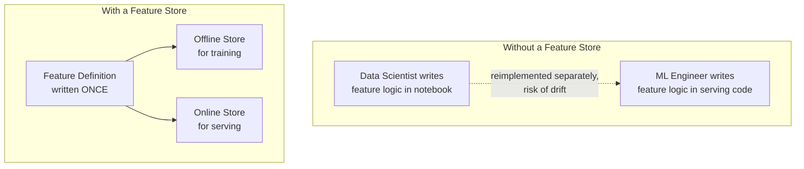
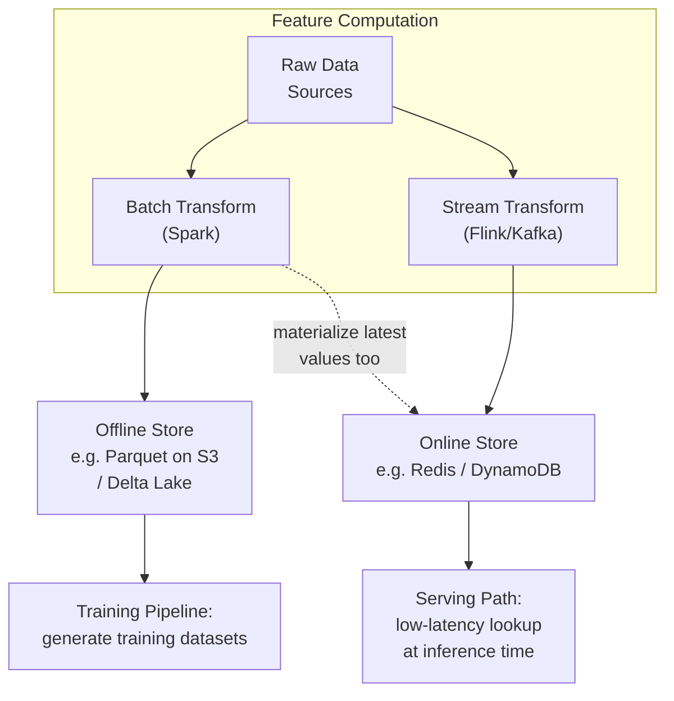
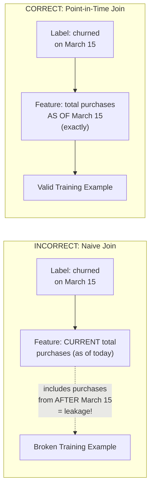

## Introduction

Chapters 4, 8, and 12 all previewed the same recurring problem from different angles: feature computation logic must stay consistent between the offline training environment and the online serving environment, or the model silently degrades. The **feature store** is the system-level answer to this problem — a dedicated piece of infrastructure that has become foundational to mature ML platforms. This chapter covers what a feature store actually is, its core architecture, and the specific correctness guarantee (point-in-time correctness) that makes it more than "just a database for features."

## What Problem Does a Feature Store Actually Solve?

Without a feature store, a typical (and typically broken) pattern looks like this: a data scientist writes feature computation logic in a training notebook (say, in pandas). Later, an ML engineer reimplements that same logic in the production serving service (say, in Java or a different Python service) for real-time inference. These two implementations inevitably drift — different rounding, different handling of edge cases, different time-window boundaries — producing training-serving skew (a topic we dedicate all of Chapter 15 to). A feature store eliminates this by giving both training and serving a **single, shared definition and computation path** for every feature.



## The Dual-Store Architecture

Every feature store has two logically distinct components serving very different access patterns:

- **Offline Store**: optimized for large-scale batch reads over historical data, typically built on the data lake/lakehouse infrastructure from Chapter 9 (e.g., Parquet files on S3, or a Delta Lake/Iceberg table). Used to generate training datasets by joining feature values with historical labels.
- **Online Store**: optimized for low-latency, high-throughput point lookups (single-digit to tens of milliseconds), typically built on a key-value store like Redis, DynamoDB, or Cassandra. Used to fetch the *current* feature values for a specific entity (a user, a product) at inference time.



Both stores are populated from the *same* underlying feature definitions — this shared definition is the actual product a feature store platform provides, not just "two databases."

## Point-in-Time Correctness

This is the single most important, and most commonly misunderstood, correctness property a feature store must provide. When building a training dataset, for each historical labeled example (e.g., "did this user churn on March 15th?"), the feature values joined to that example must reflect **only information that was actually available at that point in time** — not the feature's current, up-to-date value.

**Without point-in-time correctness (a serious and common bug called "label leakage" or "future leakage")**: if you naively join today's current "total lifetime purchases" value to a training example from six months ago, that feature would include purchases that happened *after* the labeled event, effectively letting the model "see the future" during training. Offline evaluation metrics on such a dataset look great, but the model fails badly in production because it was never actually trained on a realistic, time-consistent view of the world.



```python
# Conceptual illustration of a point-in-time correct join,
# similar to what a feature store (e.g., Feast) automates for you.

import pandas as pd

def point_in_time_join(labels_df: pd.DataFrame, feature_log_df: pd.DataFrame,
                        entity_col: str, timestamp_col: str, feature_col: str) -> pd.DataFrame:
    """
    labels_df: one row per labeled training example, with an event timestamp
    feature_log_df: a full history of feature values over time (entity, timestamp, value)
    Returns labels_df with the feature value that was TRUE at each label's timestamp.
    """
    results = []
    for _, label_row in labels_df.iterrows():
        entity = label_row[entity_col]
        as_of = label_row[timestamp_col]

        candidate_values = feature_log_df[
            (feature_log_df[entity_col] == entity)
            & (feature_log_df[timestamp_col] <= as_of)  # ONLY data available by "as_of"
        ]
        if candidate_values.empty:
            value = None  # no history yet for this entity at this point in time
        else:
            value = candidate_values.sort_values(timestamp_col).iloc[-1][feature_col]

        results.append({**label_row.to_dict(), feature_col: value})

    return pd.DataFrame(results)
```

Purpose-built feature store platforms (Feast, Tecton) implement this join efficiently at scale (this naive row-by-row example wouldn't scale to millions of rows) using optimized time-travel joins against the offline store.

## Feature Store Components

A production feature store platform typically provides:

- **A feature registry**: a central, versioned catalog of feature definitions — what each feature means, how it's computed, its data type, its owner — providing discoverability across teams (avoiding duplicate reimplementation of the same feature by different teams) and governance.
- **Transformation engines**: integration with batch (Spark) and streaming (Flink/Kafka) compute to actually materialize feature values into both stores from raw data sources.
- **Serving APIs**: a low-latency API that a production service calls at inference time to fetch the current feature vector for a given entity.
- **Point-in-time join capability**: as detailed above, for generating correct training datasets.
- **Monitoring**: tracking feature freshness, null rates, and distributional statistics (tying back to Chapter 10's data quality checks, now applied continuously to materialized features specifically).

## Popular Feature Store Platforms

- **Feast**: a popular open-source feature store, cloud-agnostic, integrates with various offline stores (BigQuery, Snowflake, Parquet on S3) and online stores (Redis, DynamoDB).
- **Tecton**: a commercial, fully-managed feature platform built by some of the original Uber Michelangelo feature store team, offering more built-in streaming transformation capability out of the box.
- **Cloud-native options**: AWS SageMaker Feature Store, Google Vertex AI Feature Store, Databricks Feature Store — integrated directly into their respective ML platforms.

## When Is a Dedicated Feature Store Worth the Investment?

A feature store is genuine infrastructure investment — it's not free, and a small team or early-stage project may not need one yet. Signals that it's time to invest:

- **Multiple models/teams need the same features**, and you're seeing duplicated, drifting reimplementations of the same logical feature.
- **You've experienced (or are worried about) training-serving skew bugs** that were hard to diagnose.
- **You need real-time features** requiring a genuinely low-latency online store, beyond what ad-hoc caching solutions comfortably provide.
- **Reproducibility and point-in-time correctness matter** for compliance, debugging, or simply model quality — and you're currently handling this manually and error-pronely.

A single-model, single-team project with modest scale might reasonably defer this investment and use simpler, more direct feature computation, revisiting the decision as the system (and the number of models/features/teams) grows — directly analogous to the "start simple, add complexity when justified" principle from Chapter 5.

## Key Takeaways

- A feature store's core purpose is giving training and serving a single, shared feature definition and computation path, directly preventing training-serving skew.
- It has a dual architecture: an offline store (batch-optimized, for training data generation) and an online store (latency-optimized, for real-time serving lookups), both populated from the same feature definitions.
- Point-in-time correctness — ensuring training examples only see feature values that were actually available at the time of the labeled event — is the store's most important and most commonly misunderstood correctness guarantee; violating it causes label leakage.
- Feature stores are a genuine infrastructure investment best justified by multi-team/multi-model feature reuse, real-time serving needs, or a demonstrated training-serving skew risk — not a default requirement for every project.

---

## Interview Questions

**1. What is the core problem a feature store solves, and why can't you just solve it with good engineering discipline and code review alone?**
It solves training-serving skew — the risk that feature computation logic implemented separately for offline training and online serving drifts apart over time, producing subtly different feature values in production than the model was trained on. While good discipline and code review help, they don't scale reliably as the number of features, models, and teams grows, and they don't provide a structural guarantee — a feature store instead provides a single, shared, enforced definition and computation path for every feature, making consistency a property of the system's architecture rather than something that depends on every engineer remembering to keep two implementations in sync.
*Follow-up: Why does this problem get specifically worse, not just linearly harder, as an organization scales to more ML teams and models?*
As more teams and models independently define and compute similar or overlapping features (e.g., multiple teams each building their own version of "user's average order value"), the number of potential places for drift to occur grows combinatorially, and the same feature may end up computed in genuinely inconsistent ways by different teams unaware of each other's implementations — a purely code-review-based discipline can't catch this cross-team duplication and drift, since no single reviewer typically has visibility into every other team's independent feature implementation.

**2. Explain the difference between a feature store's offline store and online store, including why they typically use different underlying technologies.**
The offline store handles large-scale batch reads over historical data, used primarily for generating training datasets, and is typically built on data lake/lakehouse infrastructure (e.g., Parquet on S3, Delta Lake) optimized for high-throughput, large-volume batch access; the online store handles low-latency, high-throughput single-entity lookups at inference time, and is typically built on a key-value store (Redis, DynamoDB) optimized for sub-10-50ms point reads. These have fundamentally different access patterns and performance requirements, so a single underlying storage technology optimized for one typically performs poorly for the other, justifying the dual-store architecture.
*Follow-up: How does a feature store ensure the values in these two differently-implemented stores stay consistent with each other, given they use different technologies?*
Both stores are populated from the same underlying feature definitions and transformation logic (defined once in the feature registry) — the same computed feature values (or the same computation pipeline outputs) are written to both the offline store (for historical/training use) and materialized/synced to the online store (for current-value serving use), so consistency comes from a shared source of truth and computation pipeline, not from the storage technologies themselves being identical.

**3. What is point-in-time correctness, and what specific bug does it prevent?**
Point-in-time correctness ensures that when generating a training example from a historical labeled event, the feature values joined to that example reflect only the information that was genuinely available at that historical point in time — not the feature's current, up-to-date value as of today. It prevents label leakage (also called future leakage): naively joining a feature's current value to a historical training example can inadvertently include information that only became available after the labeled event occurred, letting the model implicitly "see the future" during training, which produces deceptively strong offline metrics but a model that fails in real production use, since that future information obviously isn't available at real prediction time.
*Follow-up: Why does label leakage from a point-in-time correctness violation often go undetected until a model is already in production?*
Offline evaluation metrics computed on a dataset with this kind of leakage typically look excellent, since the model effectively has access to future information during both training and offline evaluation, making the leakage invisible in standard train/test split validation — the problem only becomes apparent once the model is deployed to genuinely real-time production conditions where that future information is, correctly, no longer available, causing a sharp and often confusing gap between strong offline metrics and poor real-world online performance.

**4. Walk through a concrete example of how a point-in-time correctness violation could occur, and how a feature store prevents it.**
Suppose you're training a churn prediction model using "total lifetime purchases" as a feature, with labels indicating whether a user churned on a specific historical date. A naive join might attach today's current total lifetime purchase count to that historical training example — but if the user made purchases after their labeled churn date (perhaps they later returned, or the churn label was based on a different signal), those post-label purchases would be incorrectly included in the "total lifetime purchases" feature for a training example dated before those purchases occurred. A feature store's point-in-time join instead retrieves the total lifetime purchases value exactly as it stood at the labeled event's timestamp, correctly excluding any purchases that happened afterward.
*Follow-up: Why would this specific bug be especially hard to catch through manual code review of the training pipeline?*
The bug often isn't in any single obviously incorrect line of code — a straightforward-looking SQL join or pandas merge between a labels table and a "current" features table looks entirely reasonable and bug-free on its own; the issue is a subtler, conceptual mismatch between what timestamp the features table represents (current state) versus what timestamp the join actually needs (historical state as of the label), which requires understanding the semantics of point-in-time correctness specifically to catch, rather than being detectable through standard code review practices focused on syntax and logic correctness.

**5. What role does the "feature registry" play in a feature store platform, beyond just storing feature values?**
The feature registry is a central, versioned catalog of feature *definitions* — metadata describing what each feature means, how it's computed, its data type, its owner, and its lineage — providing discoverability (so a new team can find and reuse an existing feature rather than reimplementing it from scratch) and governance (tracking who owns and is responsible for each feature's correctness and quality) across an organization. It's distinct from the actual stored feature *values* (which live in the offline/online stores) — the registry is about the definitions and metadata that generate those values.
*Follow-up: How does the feature registry help prevent the kind of cross-team feature duplication and drift discussed earlier in this chapter?*
By making existing feature definitions discoverable and searchable across the organization, a team starting a new project can check the registry first to see if a feature they need (e.g., "user's average order value over 30 days") already exists, and reuse that exact, already-validated definition rather than independently reinventing a similar but subtly different version — this discoverability is what actually prevents duplication in practice, since the underlying shared-definition architecture only helps if teams are actually aware of and use the existing definitions rather than working in isolation.

**6. When would a small startup or early-stage ML project reasonably decide NOT to invest in a dedicated feature store platform yet?**
When there's a single model (or a very small number of models) owned by a single, small team, without significant real-time low-latency serving requirements, and without yet having experienced concrete pain from training-serving skew or feature duplication across teams — in this context, the operational overhead of standing up and maintaining a full feature store platform likely exceeds its current benefit, and simpler, more direct feature computation (with careful manual consistency checks) is a reasonable, pragmatic starting point.
*Follow-up: What specific signals or events would indicate it's time to revisit this decision and invest in a feature store?*
Experiencing an actual training-serving skew incident that was costly or difficult to diagnose, seeing multiple teams or models independently reimplementing similar features with inconsistent results, a growing need for genuinely low-latency real-time features that ad-hoc caching solutions are struggling to support reliably, or facing compliance/reproducibility requirements that demand robust point-in-time correctness guarantees you're currently unable to provide manually with confidence.

**7. How does a feature store's online store get populated with the latest feature values, given that raw data changes continuously?**
Through a materialization process: batch-computed features are periodically (e.g., hourly or daily) pushed/synced from the offline store into the online store to keep it reasonably current, while features requiring true real-time freshness are computed via a streaming pipeline (Chapter 8) that writes incremental updates directly into the online store as new events arrive — the online store is essentially a continuously-updated cache of the "current" value for each feature, sourced from whichever computation path (batch or streaming) is appropriate for that specific feature's freshness requirement.
*Follow-up: What happens if the materialization/sync process from the offline store to the online store fails or falls behind schedule — what's the production impact?*
The online store would continue serving increasingly stale feature values to the production model without necessarily triggering an obvious error (since a "successful" lookup would still return a value, just an outdated one), silently degrading model performance in a way that mirrors the "silent failure" data drift risk discussed in Chapter 4 and Chapter 10 — this is why feature stores need explicit freshness monitoring (checking how recently each feature was last updated in the online store) as part of their production observability, rather than assuming the materialization pipeline is always working correctly without verification.

**8. Why might an organization choose a commercial feature store platform (like Tecton) over an open-source option (like Feast), or vice versa?**
A commercial platform like Tecton typically offers more built-in, production-ready streaming transformation capability, managed infrastructure (reducing the operational burden of running and scaling the platform yourself), and dedicated vendor support, which can be valuable for organizations without deep in-house platform engineering expertise or that want to move faster without building and maintaining this infrastructure themselves; an open-source option like Feast offers more flexibility, no vendor lock-in, and no direct licensing cost, which can be preferable for organizations with strong in-house engineering capability willing to invest in operating and potentially extending the platform themselves, or with specific customization needs a commercial platform's more opinionated design might not accommodate as easily.
*Follow-up: What's a risk of choosing an open-source feature store platform without adequately budgeting for the ongoing engineering investment it requires?*
Open-source infrastructure still requires meaningful ongoing engineering investment for deployment, scaling, monitoring, upgrades, and handling edge cases or bugs that a commercial vendor's support team would otherwise help resolve — underestimating this ongoing operational cost can lead to a feature store platform that's initially adopted with enthusiasm but becomes under-maintained and unreliable over time, ultimately failing to deliver the consistency and reliability benefits it was meant to provide, potentially even reintroducing the kind of feature drift and skew problems it was adopted specifically to prevent.

**9. How would you monitor the health of a feature store in production, beyond simply ensuring it's not returning errors?**
Track feature freshness (how recently each feature's value was last updated relative to its expected update cadence), null/missing rate for each feature in the online store (a spike could indicate an upstream computation pipeline failure), and distributional statistics of served feature values compared to their offline training-time distributions (applying the same data quality and drift detection techniques from Chapter 10, now specifically to the feature store's served values) — a feature store returning a successful response with a stale or statistically anomalous value is a "silent failure" that simple uptime/error-rate monitoring alone would completely miss.
*Follow-up: Why is monitoring feature freshness specifically important, beyond general error-rate monitoring, for a feature store's online store?*
The online store could be fully operational, returning fast, error-free responses for every request, while silently serving values that are hours or days out of date due to an upstream materialization pipeline failure — since there's no explicit error being thrown, general error-rate and uptime monitoring wouldn't catch this at all, and only dedicated freshness monitoring (checking the timestamp of each feature's last successful update against its expected refresh cadence) would surface this specific, otherwise invisible degradation.

**10. What's the relationship between a feature store and the data pipelines (batch and streaming) covered in Chapter 8?**
A feature store sits as a specialized layer on top of the data pipelines from Chapter 8 — batch pipelines (Spark jobs) and streaming pipelines (Kafka/Flink) are the actual compute engines that transform raw data into feature values, while the feature store provides the surrounding abstraction (feature definitions, the dual online/offline storage architecture, point-in-time correctness, and a unified serving API) that makes those computed features consistently usable for both training and serving. The feature store doesn't replace the need for batch/streaming pipelines — it orchestrates, standardizes, and adds correctness guarantees on top of them.
*Follow-up: Could you build a feature store's core value (consistency between training and serving) without adopting a formal feature store platform, using just disciplined data pipeline engineering? What would be missing?*
To some degree yes, with sufficient discipline — e.g., using a single shared code library for feature transformation logic that both the batch training pipeline and the online serving path import and execute — but you'd typically still be missing the more sophisticated capabilities a dedicated feature store platform provides out of the box, like automated, efficient point-in-time joins at scale, a centralized feature registry for cross-team discoverability, and built-in feature-specific freshness/quality monitoring — meaning you could achieve partial consistency benefits, but would likely be reinventing (often less robustly) significant parts of what a mature feature store platform already provides.

**11. In an interview, if asked to design a real-time fraud detection system, how would you use the concepts from this chapter to justify including a feature store in your design?**
I'd justify it based on two specific needs the fraud detection use case has: first, real-time serving requires an online store capable of sub-50ms feature lookups combined with streaming-computed features (like "transaction count in the last 5 minutes" from Chapter 8), which a feature store's online store component directly supports; second, given fraud detection's need for frequent retraining on recent data (from Chapter 7's discussion of data recency), point-in-time correctness becomes especially critical to avoid subtly leaking future information into retraining datasets that are refreshed often — both needs together make a strong case for a feature store rather than ad-hoc, ungoverned feature computation.
*Follow-up: How would this justification change if you were instead designing a simple, low-stakes internal reporting dashboard that happens to use a basic predictive model?*
For a low-stakes internal dashboard with a simple model, infrequent retraining needs, and no real-time serving requirement, the justification for a full feature store platform would be much weaker — the operational complexity and cost of standing up a feature store likely wouldn't be justified by the relatively low risk and low frequency of potential training-serving skew issues in this simpler context, and a more direct, straightforward feature computation approach would be the more proportionate engineering choice.

**12. Why is it insufficient for a feature store to only guarantee that the "same code" computes features for both training and serving, without also addressing point-in-time correctness?**
Even if the exact same feature computation code/logic is shared between training and serving, if the training pipeline naively applies that shared logic to *current* data when generating historical training examples (rather than correctly reconstructing what the data looked like at each historical example's specific timestamp), it can still produce point-in-time correctness violations and label leakage — code-sharing solves the "different implementations drift apart" problem, but not the separate "correctly reconstructing historical state at each point in time" problem, which requires the point-in-time join capability specifically, not just consistent code.
*Follow-up: Does this mean point-in-time correctness and shared feature-computation code address completely independent risks? How do they relate?*
They're related but distinct: shared code ensures that, given the same input data, both training and serving compute the same output feature value (addressing implementation drift); point-in-time correctness ensures that the training pipeline is given the *correct historical input data* in the first place (reflecting only information available as of each example's timestamp) — a feature store needs both properties together to provide its full correctness guarantee, since having consistent code applied to incorrect (leaked) historical input data would still produce a flawed, leaky training dataset despite the code itself being perfectly consistent between training and serving.

**13. How would you explain a feature store's value proposition to a skeptical engineering leader who views it as "just another expensive platform investment"?**
I'd frame it in terms of the concrete costs it avoids rather than abstract platform value: quantify (using past incidents if available, or realistic hypotheticals) the cost of training-serving skew bugs — engineering time spent diagnosing subtle production accuracy regressions, potential business impact from a model silently underperforming for weeks before detection, and duplicated engineering effort across teams independently reimplementing similar features — and compare that ongoing, recurring cost against the one-time and ongoing operational cost of adopting a feature store platform, framing it as a risk-reduction and efficiency investment rather than a speculative or purely "nice to have" platform expense.
*Follow-up: What evidence would you want to gather before making this pitch, to make it maximally convincing rather than purely theoretical?*
Concrete internal evidence of the problem the feature store would solve — for example, documented past incidents where a training-serving skew issue caused a measurable production accuracy regression and the engineering hours spent diagnosing and fixing it, or an audit showing how many times similar features have been independently reimplemented by different teams with inconsistent definitions — grounding the pitch in the organization's own actual historical pain points rather than only generic industry best-practice arguments, which tends to be far more persuasive to a skeptical, cost-conscious engineering leader.

**14. What's a limitation of feature stores when it comes to LLM-based systems, and how does the "feature" concept change in that context?**
Classical feature stores are designed around structured, typically numeric or categorical feature vectors computed from tabular data sources — this maps cleanly onto classical ML use cases (fraud detection, recommendation ranking) but less directly onto LLM-based systems, where the equivalent "input" is often unstructured text (a prompt, retrieved documents, conversation history) rather than a fixed-schema feature vector; some of the same underlying concerns (consistency between how context was prepared during evaluation/testing versus production, freshness of retrieved information) still apply, but the infrastructure and abstractions look different — closer to a RAG pipeline and prompt/context management system (covered in Part 11) than a classical feature store's online/offline store architecture.
*Follow-up: Is there a meaningful analog to "training-serving skew" in an LLM/RAG-based system, even without a classical feature store?*
Yes — a comparable risk exists if the retrieval or context-construction logic used during offline evaluation/testing of a RAG system (e.g., which documents get retrieved, how they're formatted into the prompt) differs from the logic actually used in the production serving path, causing the model to be evaluated against a different effective "input" than what it actually receives from real users — this is conceptually the same underlying risk (inconsistency between evaluation-time and serving-time input construction) as classical training-serving skew, even though the specific infrastructure and terminology differ significantly in the LLM/RAG context, a topic we return to in Chapter 66 on evaluating RAG systems.

**15. How would you design a migration plan for an organization currently suffering from training-serving skew issues, moving from ad-hoc feature computation to a proper feature store, without disrupting existing production models?**
I'd start by identifying and prioritizing the highest-risk or most-duplicated features first (rather than attempting a full, all-at-once migration), formally defining those specific features in the new feature store's registry, and running the feature store's computed values in parallel/shadow mode alongside the existing ad-hoc computation for a validation period — comparing the two to confirm they produce consistent values and to catch any subtle discrepancies before fully cutting over; only after this validation would I switch the production serving path to read from the feature store for those specific features, then incrementally repeat this process for additional features/models over time.
*Follow-up: Why is running the new feature store's computed values in shadow mode alongside the existing system, rather than switching over immediately, an important risk-mitigation step in this migration?*
Immediately switching to the new feature store's computation without validation risks introducing a *new* source of inconsistency or bugs (e.g., a subtle difference in how the new system handles an edge case like a missing value or a boundary timestamp) precisely while trying to fix the original inconsistency problem — running both systems in parallel and comparing their outputs on real production traffic before fully committing lets you catch and resolve any such discrepancies safely, without any risk to the live production model's actual behavior, mirroring the same shadow-deployment risk-mitigation principle introduced in Chapter 2 for model rollouts, now applied to a feature infrastructure migration instead.
