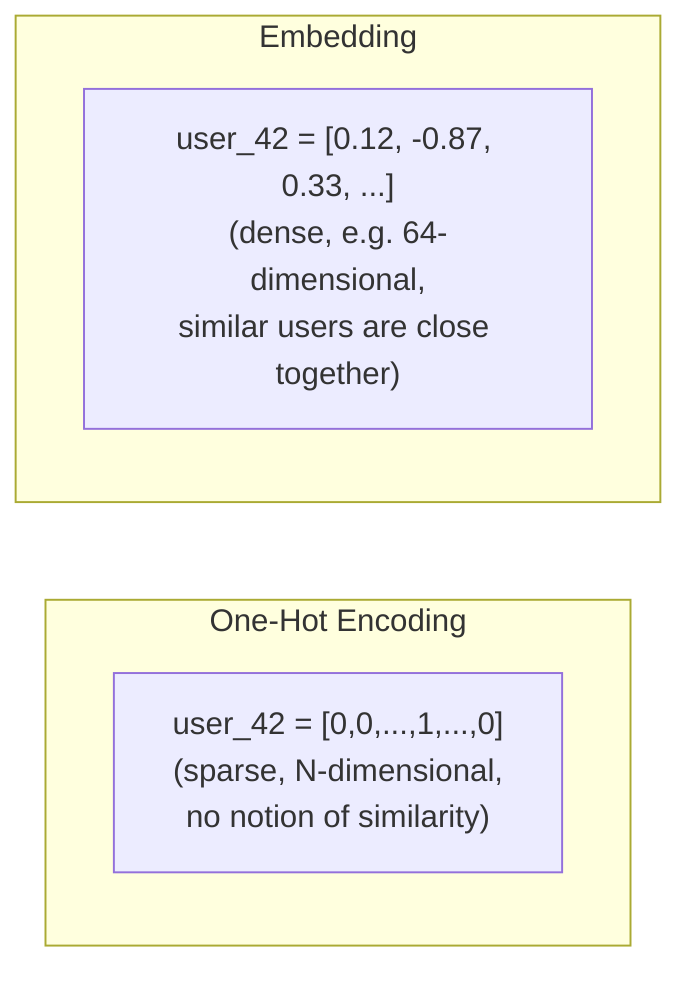

## Introduction

Chapter 12 mentioned embeddings briefly as a solution to high-cardinality categorical encoding. This chapter gives them the full treatment they deserve — embeddings are arguably the single most important representational concept in modern AI systems, underpinning recommendation systems, semantic search, and (as we'll see in Part 11) the entire RAG/vector database ecosystem.

## What Is an Embedding?

An embedding is a **dense, low-dimensional vector representation** of an entity (a word, a user, a product, an image, a sentence) learned such that entities with similar meaning or behavior end up positioned close together in the resulting vector space. Contrast this with the one-hot encoding from Chapter 12: a one-hot vector for "user_id=42" is sparse (mostly zeros), high-dimensional (as large as the number of users), and carries zero inherent notion of similarity (every user is equidistant from every other). An embedding for the same user might be a dense 64-dimensional vector where users with similar preferences end up numerically close to each other — similarity becomes a computable, geometric property.



## How Embeddings Are Learned

Embeddings are almost always learned as a **byproduct of training a model on a related task**, not hand-engineered directly. A few common patterns:

- **Co-occurrence-based** (classic word embeddings like Word2Vec, GloVe): learn a vector for each word such that words appearing in similar contexts end up with similar vectors — "king" and "queen" end up close together because they occur in similar surrounding contexts across a large text corpus.
- **Supervised task byproduct**: train a neural network on a supervised task (e.g., "will this user click this product?"), and the network's internal embedding layer for user IDs and product IDs — originally just an architectural convenience for handling high-cardinality categoricals — turns out to capture genuinely meaningful similarity structure as a side effect of learning to solve the main task.
- **Self-supervised / contrastive learning** (modern text and image embeddings, e.g., Sentence-BERT, CLIP): train a model to pull "similar" pairs (e.g., a sentence and its paraphrase, or an image and its caption) close together in the embedding space, while pushing dissimilar pairs apart — this is the dominant paradigm behind modern embedding models used in RAG systems (Part 11).

```python
# A minimal PyTorch example: learning a user embedding as part of a
# simple recommendation model trained on click prediction. The
# embedding itself is never directly supervised — it emerges from
# training on the click-prediction task.

import torch
import torch.nn as nn

class SimpleRecModel(nn.Module):
    def __init__(self, num_users: int, num_products: int, embed_dim: int = 32):
        super().__init__()
        self.user_embedding = nn.Embedding(num_users, embed_dim)
        self.product_embedding = nn.Embedding(num_products, embed_dim)
        self.output_layer = nn.Linear(embed_dim, 1)

    def forward(self, user_ids: torch.Tensor, product_ids: torch.Tensor) -> torch.Tensor:
        user_vecs = self.user_embedding(user_ids)          # (batch, embed_dim)
        product_vecs = self.product_embedding(product_ids)  # (batch, embed_dim)
        interaction = user_vecs * product_vecs               # element-wise product
        click_logit = self.output_layer(interaction).squeeze(-1)
        return torch.sigmoid(click_logit)  # predicted click probability

# After training on historical (user, product, clicked) data,
# model.user_embedding.weight[user_id] gives that user's learned
# embedding — useful far beyond the original click-prediction task,
# e.g., for finding "similar users" via nearest-neighbor search.
```

## Measuring Similarity

Once entities are represented as vectors, "similarity" becomes a well-defined mathematical operation:

- **Cosine similarity**: measures the angle between two vectors, ignoring their magnitude — the most common choice for text/semantic embeddings, since it captures directional similarity in meaning regardless of vector length.
- **Euclidean (L2) distance**: measures straight-line distance between two points — sensitive to magnitude, often used when vector norms carry meaningful information.
- **Dot product**: a computationally cheap similarity measure, commonly used in retrieval systems where embeddings are trained specifically to make dot product a meaningful relevance score (e.g., in dense retrieval architectures for search).

```python
import numpy as np

def cosine_similarity(a: np.ndarray, b: np.ndarray) -> float:
    return np.dot(a, b) / (np.linalg.norm(a) * np.linalg.norm(b))

# Example: finding the most similar product to a given product,
# out of a small candidate set, using learned embeddings.
def most_similar(query_embedding: np.ndarray, candidate_embeddings: dict[str, np.ndarray], top_k: int = 5):
    scores = {
        product_id: cosine_similarity(query_embedding, emb)
        for product_id, emb in candidate_embeddings.items()
    }
    return sorted(scores.items(), key=lambda x: x[1], reverse=True)[:top_k]
```

At production scale (millions to billions of embeddings), computing similarity against every candidate one by one (as in the toy example above) is far too slow — this motivates **Approximate Nearest Neighbor (ANN)** search algorithms and dedicated vector databases, which we cover in full depth in Chapter 59 and Chapter 58 respectively, once we reach Part 11.

## Key Use Cases in AI Systems

### Recommendation Systems

User and item embeddings, learned jointly (as in the PyTorch example above), let you compute a personalized relevance score for any user-item pair via a simple dot product or similarity computation — this is the mathematical foundation of most modern "two-tower" recommendation architectures, which we'll explore further in Chapter 80's case study.

### Semantic Search

Instead of matching queries to documents by exact keyword overlap (traditional lexical search, like BM25), a **query embedding** and **document embeddings** are compared via similarity search, allowing retrieval of documents that are conceptually relevant even without exact keyword matches — e.g., a search for "affordable places to stay" can retrieve a document about "budget hotels" despite sharing no keywords. This is the foundational mechanism behind dense retrieval in modern search and RAG systems.

### RAG (Retrieval-Augmented Generation)

An LLM-based system embeds a user's question and a large corpus of documents into the same vector space, retrieves the most semantically similar document chunks via similarity search, and provides them as context to the LLM for generating a grounded answer — this entire pipeline, covered fully in Part 11, depends entirely on the embedding concepts introduced in this chapter.

### Anomaly & Fraud Detection

Embedding a transaction or user behavior pattern into a vector space lets you detect anomalies as points that fall far from any dense cluster of "normal" behavior in that space — a geometrically elegant way to operationalize "this looks unusual" without hand-engineering explicit anomaly rules.

## Embedding Dimensionality: A Practical Trade-off

Choosing embedding dimensionality (e.g., 32, 128, 768, 1536) is a real trade-off, not an arbitrary choice:

- **Too low-dimensional**: insufficient capacity to capture meaningful distinctions between entities — many genuinely different entities get squeezed into similar vector positions.
- **Too high-dimensional**: more storage and compute cost (multiplied across potentially billions of entities in a large-scale system), increased risk of overfitting with limited training data, and diminishing returns since real-world similarity structure rarely requires thousands of dimensions to represent well.

In practice, this is usually tuned empirically — evaluating downstream task performance (e.g., recommendation click-through rate, or retrieval recall) across a few candidate dimensionalities, rather than derived analytically.

## Cold-Start for Embeddings

A brand-new entity (a new user, a new product) has no learned embedding yet — the same cold-start problem introduced in Chapter 7, now specifically in embedding terms. Common mitigations: initialize new entities with an average/default embedding until sufficient interaction data accumulates, or derive an initial embedding from available content/metadata (e.g., a new product's category and description) rather than purely from interaction history, a technique often called a "content-based" or "hybrid" cold-start embedding.

## Key Takeaways

- Embeddings are dense, low-dimensional vectors where geometric closeness represents semantic or behavioral similarity — a fundamentally different and more powerful representation than sparse one-hot encoding.
- They're almost always learned as a byproduct of training on a related task (supervised, co-occurrence-based, or self-supervised/contrastive), not hand-engineered directly.
- Cosine similarity, Euclidean distance, and dot product are the standard ways to quantify similarity between embeddings, with the right choice depending on the specific model and use case.
- Embeddings underpin recommendation systems, semantic search, RAG, and anomaly detection — making them one of the most broadly applicable concepts across this entire series.
- Embedding cold-start (a new entity with no learned representation yet) requires the same mitigation strategies as general cold-start problems: default embeddings, or content-derived initial embeddings.

---

## Interview Questions

**1. What is an embedding, and how does it fundamentally differ from a one-hot encoded representation?**
An embedding is a dense, low-dimensional vector representation of an entity, learned such that entities with similar meaning or behavior end up close together in the vector space, making similarity a computable geometric property. A one-hot encoding is sparse, high-dimensional (proportional to the number of distinct categories), and carries no inherent notion of similarity — every category is equally distant from every other category by construction, regardless of any real-world similarity between them.
*Follow-up: Why does this lack of inherent similarity in one-hot encoding become a practical limitation as the number of categories grows very large?*
With a large number of categories (e.g., millions of user or product IDs), one-hot encoding produces extremely high-dimensional, extremely sparse vectors that are computationally expensive to store and process, and provide the model no useful starting signal about which categories might behave similarly — every new, rarely-seen category is treated as entirely unrelated to every other category, making it very hard for a model to generalize from categories it has seen a lot of data for to related but less-seen categories, a limitation embeddings directly address by learning a compact representation that naturally captures such similarity.

**2. Describe three different ways embeddings can be learned, and give an example use case for each.**
Co-occurrence-based methods (like Word2Vec) learn embeddings from patterns of what appears near what in large corpora — useful for learning general-purpose word embeddings from raw text without explicit labels. Supervised task byproduct methods learn embeddings as an internal layer of a model trained on a specific supervised task (like click prediction) — useful when you want embeddings specifically optimized for a particular business objective, like a recommendation system's user/item embeddings. Self-supervised/contrastive learning methods (like Sentence-BERT or CLIP) explicitly train a model to pull semantically similar pairs together and push dissimilar pairs apart — useful for general-purpose semantic similarity tasks like search or RAG, where you need embeddings that capture broad meaning rather than being tied to one narrow downstream task.
*Follow-up: Which of these three approaches would you choose if you needed embeddings specifically optimized for your company's unique product catalog and user base, rather than general-purpose semantic similarity?*
The supervised task byproduct approach, since training directly on your own interaction data (e.g., clicks, purchases) produces embeddings specifically tuned to the actual patterns and relationships relevant to your specific products and users, which a general-purpose pre-trained embedding model (trained on broad, generic text/image data) wouldn't capture as precisely for your particular business context — though in practice, many systems combine both, using general-purpose pre-trained embeddings as a strong starting point (or for content-based cold-start) alongside task-specific fine-tuning or additional supervised embeddings.

**3. Why is cosine similarity often preferred over Euclidean distance for comparing text/semantic embeddings?**
Cosine similarity measures the angle between two vectors, ignoring their magnitude, which makes it well-suited for semantic embeddings where the direction of the vector (representing meaning) matters more than its length (which can vary due to factors like text length or training artifacts unrelated to actual semantic content); Euclidean distance is sensitive to magnitude, so two vectors representing very similar meaning but with different overall magnitudes (e.g., due to differing input lengths in some embedding models) could appear more "distant" under Euclidean distance than their actual semantic similarity would suggest.
*Follow-up: Is there a scenario in recommendation or search systems where dot product, rather than cosine similarity, is deliberately preferred?*
Yes — many dense retrieval and two-tower recommendation architectures are explicitly trained such that the dot product between a query/user embedding and a document/item embedding directly represents relevance or preference strength, incorporating magnitude as meaningful signal (e.g., a larger dot product for a strongly preferred item versus a weakly preferred one) rather than normalizing it away; in these cases dot product is deliberately used both because it's computationally cheaper than cosine similarity (no normalization step needed) and because the model was specifically trained with dot product as its target similarity function, making it the "correct" metric to use at serving time to match how the model was actually trained.

**4. How would you design a two-tower recommendation architecture using embeddings, and why is it called "two-tower"?**
A two-tower architecture has two separate neural network "towers" — one that takes user features (including a learned user ID embedding) and produces a user embedding vector, and another that takes item features (including a learned item ID embedding) and produces an item embedding vector — trained jointly such that the dot product (or cosine similarity) between a user's and item's embeddings predicts their affinity (e.g., likelihood of a click or purchase). It's called "two-tower" because of this parallel, two-branch architecture, and its key practical advantage is that item embeddings can be pre-computed and indexed offline, allowing extremely fast retrieval of top candidate items for a given user via approximate nearest neighbor search at serving time, rather than needing to run the full model for every user-item pair.
*Follow-up: Why does the two-tower architecture's ability to pre-compute item embeddings offline matter so much for serving-time performance at scale?*
Without this separation, scoring every candidate item for a given user at request time would require running a full forward pass of a potentially complex joint model for every single user-item pair, which becomes computationally infeasible at scale (e.g., scoring a user against millions of items in real time); by pre-computing and indexing item embeddings offline, serving-time work is reduced to computing just the user embedding once per request and then performing a fast approximate nearest neighbor search against the pre-indexed item embeddings, which is dramatically more efficient and is precisely the retrieval-stage optimization discussed in Chapter 3's two-stage retrieval-then-ranking pattern.

**5. What is the "cold-start" problem for embeddings specifically, and what strategies address it?**
It's the situation where a brand-new entity (a new user or a new product with no prior interaction history) has no learned embedding yet, since embeddings are typically learned from historical interaction data that simply doesn't exist for a brand-new entity — a naive system would have no meaningful vector representation to use for this entity at all. Strategies include initializing new entities with a default or average embedding (a crude but simple fallback until real data accumulates), or deriving an initial embedding from available content/metadata (e.g., a new product's text description or category, embedded using a general-purpose content embedding model) rather than relying solely on interaction-based learning, providing a reasonable starting representation even before any interaction history exists.
*Follow-up: How would you validate whether your chosen cold-start strategy is actually producing useful embeddings for new items, rather than just avoiding an outright system failure?*
Track the performance of predictions/recommendations specifically for the subset of new, cold-start items over their first days or weeks in the system (e.g., their click-through rate or conversion rate compared to a reasonable baseline like popularity-based recommendation), and compare this against how quickly performance for these items improves once sufficient interaction data accumulates and their embeddings can be learned normally — a cold-start strategy that produces embeddings no better than random placement would show consistently poor performance for new items regardless of how long they've been live, signaling the need for a better cold-start approach (e.g., richer content-based initialization) rather than just declaring the current approach adequate because it doesn't outright crash.

**6. Why can't you simply compute exact nearest-neighbor similarity search against every embedding in a large-scale production system?**
Computing exact similarity between a query embedding and every single candidate embedding (a brute-force linear scan) has computational cost that scales linearly with the total number of candidates — at production scale, this can mean comparing against millions or billions of embeddings for every single query, which becomes far too slow to meet real-time latency requirements (from Chapter 5's latency budgets), even though it would technically produce perfectly accurate results.
*Follow-up: What's the general trade-off that Approximate Nearest Neighbor (ANN) algorithms make to solve this scaling problem, at a conceptual level, without going into a specific algorithm's implementation details?*
ANN algorithms sacrifice a small amount of retrieval accuracy (they might occasionally miss the single mathematically closest match, or return an approximately-but-not-exactly closest set) in exchange for dramatically faster search — typically achieved by pre-organizing the embedding space into a searchable index structure (like a graph or a set of clusters) that allows the search to intelligently narrow down to a small, promising subset of candidates rather than exhaustively comparing against every single one, a topic covered in full technical depth in Chapter 59.

**7. How does the choice of embedding dimensionality affect a production system, and how would you approach choosing it?**
Too low a dimensionality risks insufficient representational capacity, causing genuinely different entities to be squeezed into similar vector positions and losing meaningful distinctions the model needs to make good predictions; too high a dimensionality increases storage cost (multiplied across potentially billions of stored embeddings), computational cost at both training and serving time, and risk of overfitting with limited training data, often with diminishing accuracy returns beyond a certain point. In practice, this is tuned empirically by evaluating downstream task performance (e.g., recommendation accuracy, retrieval recall) across a few candidate dimensionalities and choosing the smallest one that achieves acceptable performance, rather than defaulting to the largest dimensionality technically feasible.
*Follow-up: Why might "the smallest dimensionality that achieves acceptable performance," rather than the dimensionality with the absolute best offline metric, be the right choice for a production system?*
Because storage and serving costs (especially for approximate nearest neighbor search, whose speed and memory footprint scale with embedding dimensionality) compound significantly at production scale across potentially billions of stored embeddings and high query volumes, so a small offline metric improvement from a higher dimensionality may not justify the meaningfully higher infrastructure cost and latency it introduces — this is a direct application of the general system design principle from Chapter 6 that a marginal accuracy gain must be weighed against its real operational cost, not pursued as an end in itself.

**8. Explain how embeddings enable semantic search to outperform traditional keyword-based (lexical) search for certain queries.**
Traditional lexical search (like BM25) matches queries to documents based on exact or near-exact keyword overlap, meaning a query like "affordable places to stay" would fail to retrieve a highly relevant document about "budget hotels" if there's no shared vocabulary between the two; semantic search instead embeds both the query and documents into the same vector space using a model trained to capture meaning rather than exact wording, allowing retrieval of the "budget hotels" document because its embedding is close to the query's embedding in meaning-space, despite sharing no exact keywords — directly addressing the vocabulary mismatch problem that limits purely lexical search.
*Follow-up: Does this mean semantic search should always be preferred over lexical search? What's a scenario where lexical search still has an advantage?*
No — lexical search still has real advantages for queries requiring precise, exact matches, such as searching for a specific product SKU, an exact error code, a proper noun, or an exact phrase, where semantic search's tendency to retrieve "conceptually similar" results could actually be less precise or even miss the exact intended match; this is precisely why modern production search and RAG systems increasingly use hybrid search (covered in Chapter 62), combining both lexical (BM25) and semantic (embedding-based) retrieval to get the complementary strengths of each approach rather than relying on either one exclusively.

**9. How would you use embeddings to build a fraud or anomaly detection signal, and what's the underlying intuition?**
Embed each transaction or user behavior pattern into a vector space (learned via a model trained on normal behavior patterns, or via a self-supervised approach), and then flag transactions/behaviors whose embeddings fall far from any dense cluster of "normal" behavior in that space as potential anomalies — the underlying intuition is that normal, legitimate behavior tends to form dense, well-populated clusters in a well-trained embedding space, while genuinely unusual or fraudulent behavior tends to be geometrically isolated, distant from these normal clusters, providing a flexible, learned notion of "unusualness" without needing to hand-engineer explicit anomaly detection rules for every possible fraud pattern.
*Follow-up: What's a risk of relying purely on embedding-based distance from normal clusters, without any additional signal, for a production fraud detection system?*
Genuinely novel but legitimate behavior (e.g., a user's first-ever large purchase for a special occasion, or a new but valid usage pattern following a product feature launch) could also appear geometrically distant from previously-observed normal clusters, potentially triggering false positives that block or flag legitimate users — this is why production fraud systems typically combine embedding-based anomaly signals with other complementary signals (rule-based checks, explicit classification models trained on labeled fraud examples) rather than relying on embedding distance as the sole detection mechanism, and carefully calibrate thresholds against the cost-asymmetry considerations from Chapter 3.

**10. Why do modern RAG systems depend so heavily on the embedding concepts introduced in this chapter?**
RAG systems need to retrieve the most relevant documents/chunks from a potentially massive corpus to provide as context to an LLM, and doing this based on semantic relevance (rather than exact keyword matching) requires embedding both the user's query and the corpus documents into a shared vector space, then using similarity search (the same cosine similarity/dot product concepts from this chapter) to find the most relevant matches — without embeddings, RAG systems would be limited to much less effective keyword-based retrieval, significantly reducing their ability to find genuinely relevant context for queries phrased differently than the source documents.
*Follow-up: What specific property must an embedding model have to be suitable for RAG's retrieval step, beyond simply being able to produce embeddings at all?*
The embedding model must be trained (typically via contrastive learning) such that a query and its truly relevant documents end up close together in the embedding space, even when they don't share significant vocabulary overlap — a general-purpose embedding model not specifically trained for this query-to-document relevance relationship (for instance, one trained only to capture generic sentence similarity between similarly-phrased sentences) may not perform well for RAG's specific retrieval task, which is why RAG systems often use embedding models specifically fine-tuned or designed for asymmetric query-document retrieval, a nuance covered further in Chapter 58.

**11. How would you decide whether to use a general-purpose, pre-trained embedding model (e.g., a public sentence embedding model) versus training your own custom embeddings from scratch for a specific business use case?**
Use a general-purpose pre-trained model when you lack sufficient proprietary interaction data to train meaningful custom embeddings, need to get a working system up quickly, or are working with genuinely general-domain content (e.g., general natural language text) where broad, pre-trained semantic understanding transfers well; train custom embeddings when you have substantial proprietary interaction data (clicks, purchases, ratings) reflecting business-specific patterns that a general-purpose model wouldn't capture, or when your domain is sufficiently specialized (e.g., internal technical jargon, a unique product catalog) that general-purpose embeddings would perform poorly, justifying the additional investment in training and maintaining custom embeddings.
*Follow-up: Is choosing between these two options mutually exclusive, or can they be combined? Explain how.*
They can be combined — a common and often highly effective approach is to start with general-purpose pre-trained embeddings as a strong initialization or baseline (especially valuable for the cold-start scenario discussed earlier in this chapter), and then fine-tune those embeddings on your own proprietary interaction data to adapt them to your specific business context and patterns, getting the benefit of broad pre-trained semantic knowledge while still specializing the final embeddings for your particular use case, rather than choosing one approach exclusively over the other.

**12. What's the relationship between the "target encoding" technique from Chapter 12 and embeddings — are they fundamentally different approaches to the same problem?**
Both are techniques for converting a high-cardinality categorical variable into a useful numeric representation, but they differ in expressiveness and how they're learned: target encoding produces a single scalar value per category (the average target outcome for that category), directly and simply tied to the specific target variable it was computed against, while an embedding produces a multi-dimensional dense vector per category, typically learned jointly as part of a larger model, capable of capturing much richer, multi-faceted similarity structure beyond a single scalar summary statistic — embeddings are generally more expressive and powerful, especially for deep learning architectures, but require more data and computational infrastructure to learn and use effectively than the comparatively simple target encoding approach.
*Follow-up: In what scenario might target encoding still be preferable to a full learned embedding, despite embeddings' greater expressiveness?*
For a simpler model architecture (like gradient boosted trees, which don't naturally incorporate a learned embedding layer the way neural networks do) or a scenario with limited training data (where learning a meaningful multi-dimensional embedding per category may not be reliably achievable), target encoding provides a simpler, more data-efficient way to inject useful categorical signal into the model without requiring the additional infrastructure and data volume that training genuinely useful embeddings typically demands.

**13. How would you handle updating embeddings for entities as their underlying behavior or characteristics change over time (e.g., a user's evolving preferences)?**
Embeddings need to be periodically retrained or incrementally updated to reflect current, not just historical, behavior — this is typically handled as part of the model's regular retraining cadence (covered in Chapter 20's discussion of retraining strategies), where the full model (including its embedding layers) is retrained on recent data on a scheduled basis; some systems also support incremental or online embedding updates for specific high-value entities using more recent interaction data, though full retraining remains the more common and more robust approach for capturing genuinely evolved patterns across the whole embedding space consistently.
*Follow-up: What's a risk of updating a single entity's embedding independently and more frequently than the rest of the embedding space is updated?*
If one entity's embedding is updated on a different retraining schedule/basis than the rest of the entities in the same embedding space, the relative geometric relationships between that entity and all others may no longer be meaningfully comparable — since the "meaning" of specific positions and distances in the embedding space is defined relative to how all entities were jointly trained together at a specific point in time, independently updating just one entity's position risks it no longer being coherently comparable to the other embeddings that were trained together, potentially producing misleading similarity results.

**14. Why is it important to keep an entity's embedding stored and accessible via a feature store (Chapter 13), rather than recomputing it fresh on every request?**
Recomputing an embedding requires running the full trained embedding model (or a portion of a larger joint model) for that entity, which is computationally more expensive than a simple lookup — especially undesirable in a real-time serving path with strict latency budgets (Chapter 5); storing pre-computed embeddings in a feature store's online store (particularly for entities like users and products whose embeddings don't need to change on every single request) allows serving-time access to be a fast, cheap lookup rather than an expensive re-computation, directly analogous to why aggregated features in general benefit from the feature store architecture rather than on-demand recomputation.
*Follow-up: Are there scenarios where you would still want to compute an embedding fresh, on-demand, at serving time, rather than using a pre-computed and stored version?*
Yes — for entities that don't have a stable, pre-existing identity to look up (e.g., embedding a brand-new, never-before-seen user query in a semantic search system, which by definition can't have been pre-computed and stored ahead of time), the query embedding must be computed fresh at request time; this is a common pattern in search and RAG systems, where the query-side embedding is always computed on-demand while the (much larger, more stable) document/item-side embeddings are pre-computed and stored/indexed offline for efficient retrieval.

**15. In an interview, if asked to design a "similar products" feature for an e-commerce site, how would you use the embedding concepts from this chapter to structure your answer?**
I'd propose learning product embeddings — either as a byproduct of a supervised model trained on co-purchase or co-view data (capturing behavioral similarity), or via a content-based approach embedding product descriptions/images (capturing semantic/visual similarity), or ideally a hybrid combining both — then, at serving time, given a specific product, retrieve its nearest neighbors in the embedding space using an efficient approximate nearest neighbor search (rather than brute-force comparison) to surface the top-K most similar products, pre-computing and indexing all product embeddings offline given they don't need to change on every single request, following the two-tower/retrieval-stage pattern from Chapter 3.
*Follow-up: How would you handle a newly-listed product with no purchase or view history yet, within this proposed design?*
I'd address this with the embedding cold-start strategy discussed earlier in this chapter — initially deriving the new product's embedding purely from its available content (description, category, images) using a content-based embedding model, which provides a reasonable "similar products" signal from launch, then transitioning toward incorporating behavioral co-purchase/co-view signal into its embedding once sufficient interaction data accumulates through the system's regular retraining cadence, ensuring the feature works reasonably well even for brand-new products rather than only for established ones with rich interaction history.
