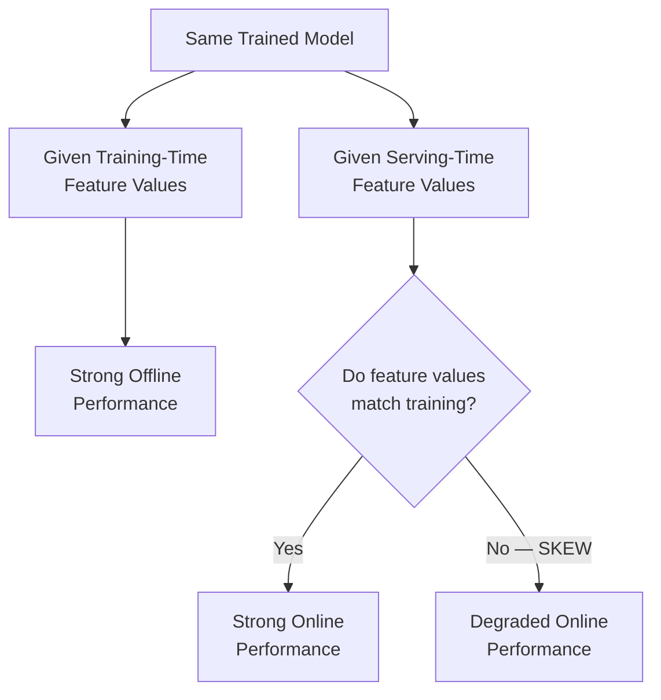
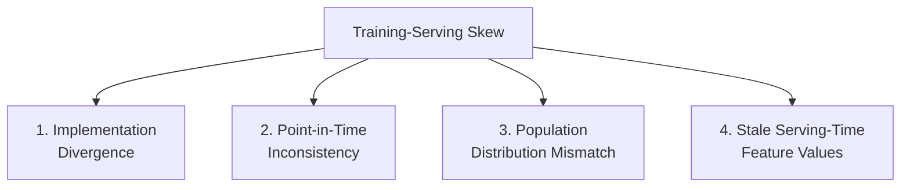

## Introduction

Training-serving skew has been referenced in nearly every chapter so far — Chapter 1 introduced it as a defining AI-system failure mode, Chapter 4 identified it as the classic handoff-risk between offline and online environments, Chapter 8 showed how batch and streaming pipelines can silently diverge, and Chapter 13 presented the feature store as its primary architectural solution. This chapter pulls all of that together into a single, systematic treatment: what skew actually is, its distinct root causes, how to detect it, and the concrete engineering discipline that prevents it. If you take away one production-readiness lesson from this entire series, it should probably be this chapter.

## What Is Training-Serving Skew, Precisely?

Training-serving skew is a discrepancy between the feature values (or feature distributions) a model sees during training and the feature values it sees at serving time, such that the model's real-world production performance is meaningfully worse than its offline evaluation performance predicted — even though the model itself hasn't changed at all. It's important to separate this from *concept drift* (Chapter 10): drift is a change in the real world over time; skew is an *inconsistency in engineering* that can exist on day one, before the real world has changed at all.



## The Four Root Causes

### 1. Implementation Divergence

The most classic cause, introduced in Chapters 4 and 13: feature computation logic is implemented twice — once in an offline training pipeline (often Python/pandas/Spark) and once in an online serving system (often a different language, like Java, for performance reasons) — and the two implementations subtly differ. Common concrete examples: different rounding/floating-point behavior, different null-handling defaults, off-by-one errors in a time window boundary (`>` vs `>=`), or a string normalization step (lowercasing, trimming whitespace) applied in one path but forgotten in the other.

### 2. Point-in-Time Inconsistency (Data Leakage)

Covered in full depth in Chapter 13: if the training pipeline computes a feature using data that wouldn't actually have been available at real prediction time (e.g., using a "current" aggregate instead of a historical, as-of-that-moment aggregate), the model learns to rely on information it will never actually have access to in production, causing a sharp, confusing gap between offline and online performance.

### 3. Data Distribution Skew Between Training and Serving Populations

Even with perfectly consistent feature computation logic, if the *population* used for training differs systematically from the population seen at serving time, the model can underperform. A classic example: training data is sampled only from users who completed a particular funnel step (e.g., only logged-in users), while the serving population includes all users (including logged-out ones) — the model was never exposed to the serving-time population's actual characteristics during training.

### 4. Stale or Mismatched Serving-Time Features

Even with correct logic and matched populations, if the online feature store (Chapter 13) serves a stale value — due to a materialization pipeline lag, a caching bug, or a feature that simply hasn't been refreshed as frequently as assumed — the model receives an outdated snapshot of the world that doesn't match what it would have seen for the equivalent feature during training on fresher historical data.



## Detecting Skew

Skew is a "silent failure" (Chapter 4) by nature — nothing crashes, nothing throws an error, the model just quietly underperforms. Detection requires deliberate, proactive engineering:

- **Feature distribution comparison**: log the actual feature values used at serving time, and periodically compare their statistical distribution (using the same PSI/KS-test techniques from Chapter 10) against the feature distribution used during training. A significant, unexplained divergence is a strong skew signal.
- **Shadow scoring with ground truth**: where feasible, compute both the "offline-style" feature value and the "online-style" feature value for the same real production event, and directly diff them — this is the most precise way to catch implementation divergence specifically.
- **Online vs offline metric gap monitoring**: if a newly deployed model's online performance (Chapter 6) is significantly worse than its offline evaluation predicted, and no other obvious cause (like a genuine, coincidental concept drift event) is apparent, skew should be a top suspect.

```python
# A practical skew-detection utility: log a sample of (feature_name,
# training_time_value, serving_time_value) pairs for the SAME
# underlying entity/event, and flag any statistically significant
# or high-magnitude mismatches for investigation.

import numpy as np

def detect_feature_skew(training_values: dict[str, float],
                          serving_values: dict[str, float],
                          relative_tolerance: float = 0.01) -> list[str]:
    """
    Compares feature values computed by the offline training pipeline
    vs. the online serving pipeline for the SAME entities/events,
    flagging features whose values differ beyond a small tolerance
    (allowing for legitimate floating-point precision differences).
    """
    mismatches = []
    for feature_name, train_val in training_values.items():
        serve_val = serving_values.get(feature_name)
        if serve_val is None:
            mismatches.append(f"{feature_name}: MISSING at serving time")
            continue
        if train_val == 0:
            if abs(serve_val) > relative_tolerance:
                mismatches.append(f"{feature_name}: train=0, serve={serve_val}")
            continue
        relative_diff = abs(train_val - serve_val) / abs(train_val)
        if relative_diff > relative_tolerance:
            mismatches.append(
                f"{feature_name}: train={train_val}, serve={serve_val} "
                f"(relative diff={relative_diff:.2%})"
            )
    return mismatches
```

## Preventing Skew: The Engineering Discipline

1. **Use a feature store with a single, shared feature definition** (Chapter 13) as the default, structural prevention mechanism for implementation divergence — this is the single highest-leverage fix available.
2. **Enforce point-in-time correct joins** for every training dataset generation job, using either a feature store's built-in point-in-time join capability or a carefully engineered equivalent (Chapter 13's worked example).
3. **Validate population consistency** between your training sample and your expected serving population *before* training — explicitly check that filtering criteria used to construct the training set (e.g., "only users active in the last 90 days") match the actual population the model will be scored against in production.
4. **Monitor online feature freshness** continuously (Chapter 13), treating a stale feature as a first-class incident, not a silent inconvenience.
5. **Run shadow deployment** (Chapter 2) before every full rollout specifically to catch skew that only manifests under real production conditions, which offline evaluation alone cannot reveal.
6. **When reimplementation across languages is unavoidable** (e.g., a Python training pipeline and a low-latency Java/C++ serving path), invest in cross-language contract tests that run the same feature computation logic against a shared, versioned test dataset in both languages, and fail CI if the two implementations disagree — an explicit engineering guardrail against the specific risk of maintaining two codebases.

## A Worked Example: Diagnosing a Real Skew Incident

Suppose a newly deployed fraud model's online precision is dramatically lower than its offline-evaluated precision, despite passing rigorous offline evaluation. A systematic diagnosis:

1. **Check feature freshness first** (cheapest check): is the online feature store serving stale values for any input feature? If a critical feature like "transaction count in last hour" is stuck at a stale value due to a broken streaming pipeline, that alone could explain the gap.
2. **Compare feature distributions**: pull a sample of real production feature vectors and compare their distribution against the training set's distribution using PSI. A large divergence on a specific feature narrows the investigation.
3. **Audit the specific feature's computation logic** in both pipelines side by side, looking specifically for the classic implementation-divergence culprits: time window boundaries, null handling, rounding.
4. **Check the training population's construction logic**: was the training set filtered in a way (e.g., only chargebacks that were reported within 30 days) that doesn't match the true serving-time population (which includes all transactions, not just ones with a fast-resolving outcome)?

This systematic, elimination-based diagnostic process — rather than jumping straight to "let's retrain with more data" — is exactly the kind of debugging reasoning that distinguishes a senior ML engineer's answer in an interview.

## Key Takeaways

- Training-serving skew is an *engineering* inconsistency between training-time and serving-time feature values, distinct from concept drift, which is a genuine change in the real world over time.
- Four root causes: implementation divergence, point-in-time inconsistency (leakage), training/serving population mismatch, and stale serving-time features.
- Skew is a silent failure by nature and requires deliberate detection: feature distribution comparison, shadow diffing of offline vs online computed values, and monitoring the gap between offline and online metrics.
- The single highest-leverage prevention mechanism is a feature store providing one shared feature definition for both training and serving — supplemented by point-in-time correct joins, population consistency checks, freshness monitoring, and shadow deployment.

---

## Interview Questions

**1. What is training-serving skew, and how is it different from concept drift?**
Training-serving skew is an engineering-level inconsistency between the feature values a model sees during training and the feature values it receives at serving time, causing degraded real-world performance even though the model itself hasn't changed and the real world hasn't necessarily changed either. Concept drift, by contrast, is a genuine change in the real-world relationship between features and outcomes over time — skew can exist on day one of deployment purely due to engineering inconsistency, while drift specifically requires the passage of time and genuine environmental change to occur.
*Follow-up: Could a system experience both skew and drift simultaneously, and how would that complicate diagnosis?*
Yes — a system could have an underlying implementation divergence (skew) that's present from launch, while the real world is also genuinely drifting over time (concept drift), and both would independently contribute to a growing gap between expected and actual model performance; this complicates diagnosis because a naive investigation might attribute the entire performance gap to drift and simply retrain more frequently, without ever noticing and fixing the underlying skew issue, which would continue silently degrading every future retrained model as well until specifically identified and addressed as a separate root cause.

**2. What are the four root causes of training-serving skew described in this chapter, and which is generally considered the most common in practice?**
Implementation divergence (feature logic reimplemented differently in training vs serving code), point-in-time inconsistency/data leakage (training features reflect information not actually available at real prediction time), training/serving population mismatch (the training sample's population differs systematically from the actual serving population), and stale/mismatched serving-time features (the online feature store serves outdated values due to pipeline lag or bugs). Implementation divergence is generally considered the most common in practice, precisely because it's the natural, almost inevitable result of maintaining two independently-written codebases for the same underlying logic without a shared, unifying system like a feature store.
*Follow-up: Why might point-in-time inconsistency (data leakage) be considered the most dangerous of the four, even if not the most common?*
Because it can produce a training dataset with genuinely inflated, misleadingly optimistic offline evaluation metrics that pass every standard validation check with flying colors, creating false confidence that the model is excellent before it ever reaches production — the other three causes at least sometimes produce visible signals (stale features might show obviously outdated values, population mismatch might be caught by careful data auditing), whereas leakage can be completely invisible until the model is already live and performing surprisingly poorly, at which point the root cause can be genuinely difficult to trace back to a subtle historical join logic issue.

**3. Explain how a feature store directly addresses training-serving skew, and specifically which root cause(s) it targets.**
A feature store directly targets implementation divergence by providing a single, shared feature definition and computation path used by both the offline training pipeline and the online serving path, eliminating the need to maintain two independent implementations of the same logic that could drift apart over time; it also directly targets point-in-time inconsistency through its point-in-time join capability, ensuring training datasets only see feature values that were genuinely available as of each historical example's timestamp. It does not, on its own, fully solve population mismatch (which requires separate, deliberate validation of your training sample's construction) or stale serving-time features (which requires separate freshness monitoring, even though the feature store's online store is the component being monitored).
*Follow-up: Given that a feature store doesn't solve all four root causes, what additional practices would you still need even after adopting one?*
You'd still need explicit validation that your training data sampling/filtering criteria match your true serving-time population (a data engineering and experimental design discipline, not something a feature store automatically enforces), and dedicated freshness monitoring on the feature store's online store itself (checking that materialization pipelines are actually keeping features up to date as expected) — adopting a feature store significantly reduces skew risk but doesn't eliminate the need for these complementary practices addressing the remaining two root causes.

**4. How would you detect training-serving skew in a system where you don't have an obvious symptom like a sudden accuracy drop?**
Proactively compare the statistical distribution of feature values actually used in production serving against the distribution of those same features in the training dataset, using techniques like PSI or KS-tests (from Chapter 10), on a regular, ongoing basis rather than waiting for a visible performance problem to trigger investigation; additionally, for a subset of real production events, you can compute the same feature both via the "offline-style" logic and the "online-style" logic and directly diff the two values, which precisely surfaces any implementation divergence even when its aggregate impact on overall model accuracy might otherwise be too subtle to notice through metric monitoring alone.
*Follow-up: Why is it important to detect skew proactively, rather than waiting for it to show up as a business metric regression?*
Because skew can cause a meaningful but not immediately obvious degradation in model quality that erodes value gradually and invisibly (e.g., slightly worse recommendations, slightly more missed fraud) without necessarily triggering an alarming, easily-noticed metric drop — by the time a broad business metric regression becomes visible and prompts investigation, the skew could have already been silently costing the business value for an extended period, whereas proactive feature-level monitoring can catch and fix the underlying issue well before it accumulates into a large, visible business impact.

**5. Describe a concrete, realistic example of implementation-divergence-caused skew, and explain exactly where the divergence occurs.**
A ride-sharing ETA model is trained using a feature "average trip duration for this route over the last 30 days," computed in a Python/Spark batch job that defines "last 30 days" as a rolling window ending at midnight of the current day; the production serving system, implemented separately in a low-latency Java service for performance reasons, computes the same nominal feature but defines its 30-day window as ending at the exact current timestamp (including partial-day data) rather than midnight — a subtle but real difference in window boundary semantics that causes the feature's numeric value to differ meaningfully between the two paths, especially for routes with unusual traffic patterns earlier that same day, even though both implementations are individually "correct" according to their own author's interpretation of "last 30 days."
*Follow-up: How would a shared feature store, specifically, have prevented this particular divergence from ever occurring?*
A feature store would require the "last 30 days average trip duration" feature to be defined exactly once — including the precise window boundary semantics (e.g., explicitly specifying "rolling 30 days ending at the current timestamp" or "ending at midnight," whichever is intended) — in a single, versioned feature definition that both the offline training pipeline and the online Java serving path would then read from or be generated from, rather than allowing two separate engineers or teams to each independently interpret and implement the ambiguous phrase "last 30 days" according to their own reasonable but different assumptions.

**6. How would you validate that your training data's population matches your serving-time population, and what's a red flag that would indicate a mismatch?**
Compare the demographic/behavioral distribution of the training sample's population against the actual serving-time population using the same statistical distribution comparison techniques used for feature drift detection — for example, checking whether the proportion of new vs returning users, or the distribution of account age, geography, or device type, looks similar between the two populations. A red flag would be a training set that was implicitly or explicitly filtered by some criterion related to how the training data was sourced (e.g., only users who completed a specific action, only data from a specific time period or region) that isn't representative of the full range of entities the model will actually be scored against in production.
*Follow-up: Give a realistic example where a seemingly reasonable data filtering decision during training data preparation could inadvertently cause this kind of population mismatch.*
Filtering training data to only include transactions where the true fraud/not-fraud label was confirmed within 7 days (a reasonable-seeming choice to ensure label quality and avoid using potentially stale/unconfirmed labels) could inadvertently bias the training population toward simpler, more quickly-resolved fraud cases, while excluding more complex or ambiguous cases that took longer to investigate and confirm — the resulting model would be trained on a population skewed toward "easy" cases, but at serving time it must score every transaction, including the harder, more ambiguous ones systematically underrepresented in its training data.

**7. What's the danger of "stale serving-time features" specifically, and how would you build a monitoring system to catch this before it causes a significant business impact?**
A stale serving-time feature means the online feature store is providing an outdated snapshot of information (e.g., a "transactions in the last hour" count that hasn't been updated in several hours due to a broken streaming pipeline), causing the model to make decisions based on genuinely wrong, outdated input even though the model logic itself and its training were entirely correct — this is dangerous precisely because it produces no obvious error, just quietly wrong predictions that can persist until someone notices a resulting business impact. A monitoring system should explicitly track each feature's "last updated" timestamp in the online store against its expected refresh cadence (e.g., alerting if a feature meant to update every 5 minutes hasn't updated in 30 minutes), treating a stale feature as a first-class, immediately actionable incident rather than something only discovered indirectly through downstream metric degradation.
*Follow-up: Why is monitoring feature freshness a more robust detection strategy than monitoring the downstream model's overall accuracy for this specific failure mode?*
Monitoring overall model accuracy for a downstream regression relies on that regression being large enough, and having sufficiently fast-arriving ground truth, to be statistically detectable — for many use cases (especially ones with delayed ground truth, like long-term churn), this detection could take days or weeks, by which point significant harm may already have accumulated; directly monitoring feature freshness catches the actual root cause (a stale upstream pipeline) immediately and directly, often before it's even had time to meaningfully affect enough predictions to show up in a downstream accuracy metric, providing much faster time-to-detection for this specific failure mode.

**8. Why is shadow deployment (Chapter 2) specifically useful for catching training-serving skew that offline evaluation alone would miss?**
Offline evaluation runs entirely within the offline/training environment, using pre-computed, offline-pipeline-generated feature values that never actually pass through the real, separately-implemented online serving path — meaning any implementation divergence, staleness, or population mismatch specific to the actual online serving infrastructure would never be exercised or exposed during purely offline evaluation. Shadow deployment runs the new model against genuinely live production traffic, using the actual online feature store and serving infrastructure to generate real feature values, precisely surfacing any discrepancy between what the offline evaluation assumed and what the real online system actually provides, before any real user is affected by the results.
*Follow-up: What specific comparison would you make during a shadow deployment period to explicitly test for skew, rather than just observing the shadow model's raw predictions?*
Compare the actual feature values retrieved by the live online serving path during the shadow deployment against what the offline training pipeline would have computed for the equivalent historical inputs (using the skew-detection diffing approach described earlier in this chapter) — if these values match closely, you've validated consistency between the two pipelines under real production conditions; if they diverge, you've caught a skew issue during a safe, shadow-mode testing period, before it could have caused any real-world harm through an actual production rollout.

**9. How would you approach the challenge of maintaining consistent feature logic when your training pipeline is written in Python but your serving system, for performance reasons, is written in Java or C++?**
The most robust approach is to avoid true reimplementation altogether by using a feature store platform that generates or provides the feature computation for both languages from a single shared definition (many feature store platforms support this multi-language serving capability); if genuine reimplementation across languages is unavoidable for a specific performance-critical feature, invest in explicit cross-language contract tests — running both the Python and Java/C++ implementations against a shared, versioned test dataset of representative inputs, and failing continuous integration if their outputs ever disagree beyond an acceptable numerical tolerance — turning what would otherwise be a silent, undetected divergence risk into an explicit, continuously-tested engineering contract.
*Follow-up: Why is a one-time manual code review comparing the two implementations insufficient as a long-term solution, even if it catches the initial divergence at the time of writing?*
A one-time review only validates consistency at a single point in time — as either implementation is subsequently modified (e.g., a bug fix, a refactor, a new edge case handled in one language but not the other) by different engineers who may not even be aware the other implementation exists or needs corresponding updates, the two implementations can silently drift apart again after the initial review, with no ongoing mechanism to catch that later divergence; only an automated, continuously-run contract test integrated into the standard development workflow provides ongoing protection against this recurring risk, rather than a single point-in-time check.

**10. If a newly deployed model shows a large gap between its offline-evaluated performance and its actual online performance, what would be your step-by-step diagnostic approach?**
Start with the cheapest, most likely explanations first: check feature freshness in the online store for any staleness issues, then compare the statistical distribution of actual serving-time feature values against the training-time feature distribution to identify which specific feature(s) show the largest divergence; from there, audit that specific feature's computation logic in both the offline and online pipelines side by side for implementation divergence (checking classic culprits like window boundaries, null handling, and rounding); if features check out consistent, investigate whether the training data's population/sampling criteria genuinely match the real serving-time population; only after systematically ruling out all of these skew-related causes would you consider genuine concept drift or a more fundamental modeling issue as the explanation.
*Follow-up: Why does this diagnostic process deliberately check for skew-related causes before considering "the model itself might just be bad" as an explanation?*
Because skew-related causes are both common in practice and, importantly, don't reflect any actual flaw in the model's learned relationships — they reflect an engineering inconsistency that, once identified and fixed, requires no change to the model architecture or retraining strategy at all; jumping straight to "let's try a different model architecture" or "let's collect more training data" without first ruling out these engineering causes risks spending significant time and effort on modeling changes that would never have been necessary had the actual, simpler engineering root cause been identified and fixed first.

**11. Why might a model's performance actually look better in production than it did in offline evaluation, and would this still be considered "skew"?**
Yes, this asymmetric direction of skew is still training-serving skew — for example, if the offline evaluation dataset happened to include a disproportionate share of genuinely hard, ambiguous examples (perhaps due to how the evaluation set was sampled or labeled) compared to the real serving-time population's typical difficulty distribution, the model could appear to underperform in offline evaluation relative to how it actually performs against the generally "easier" real-world population it's serving in production. This is just as much a sign of inconsistency between the two environments as the more commonly discussed skew, and should be investigated with the same rigor rather than simply welcomed as a pleasant surprise.
*Follow-up: Why is it important to investigate this "positive" direction of skew rather than just accepting the better-than-expected online performance at face value?*
An unexplained mismatch between offline and online performance in either direction indicates that your offline evaluation is not a reliable, representative proxy for real online performance — even if the current discrepancy happens to be favorable, this same underlying evaluation unreliability could just as easily mask a genuine future problem (e.g., a subsequent model version might look artificially fine offline while actually performing worse online, and you'd have no reliable offline signal to catch it), so understanding and fixing the root cause of any offline/online mismatch is important for maintaining trustworthy evaluation regardless of which direction the current discrepancy happens to point.

**12. How does the concept of training-serving skew change (if at all) for an LLM-based system using RAG, compared to a classical ML system with a feature store?**
The core underlying risk is conceptually the same — inconsistency between what the system was evaluated against and what it actually receives in production — but it manifests differently: rather than numeric feature values differing between training and serving, the risk in a RAG system is that the retrieval logic, prompt template, or context-formatting used during offline evaluation/testing differs from what's actually used in the live production serving path (e.g., a different chunking strategy, a different number of retrieved documents, or a different prompt template being used for testing versus production), causing the LLM to receive a meaningfully different effective "input" in production than what was validated during evaluation, even though no classical numeric "feature skew" in the traditional sense is involved.
*Follow-up: What practice from this chapter would you adapt to detect and prevent this RAG-specific analog of training-serving skew?*
The shadow deployment and diffing approach adapts well — running the actual production RAG pipeline (real retrieval logic, real prompt construction) against a held-out or synthetic set of evaluation queries and directly comparing the retrieved documents/constructed prompts against what your offline evaluation pipeline used for the same queries, specifically checking for divergence in retrieval results or prompt construction before trusting that offline RAG evaluation results will hold in production — the same fundamental discipline of "verify consistency between evaluation-time and serving-time processing," just applied to retrieval and prompt construction logic instead of classical numeric feature computation.

**13. Why is it insufficient to only test for training-serving skew once, at the time a model is first deployed, rather than continuously?**
Both the training pipeline and the serving pipeline are living, evolving codebases that continue to be modified over time — a subsequent bug fix, refactor, or feature addition to either pipeline (often made independently, by different engineers, possibly unaware of the skew risk) can reintroduce divergence even if the two were verified to be perfectly consistent at initial deployment; without continuous, ongoing skew monitoring (feature distribution comparison, freshness checks) as a standing part of production observability, a newly introduced divergence from a seemingly unrelated code change elsewhere in the pipeline could silently reintroduce the exact problem that was originally solved, without anyone noticing until a business-impacting regression eventually surfaces.
*Follow-up: How would you build this continuous verification into a team's standard engineering workflow, rather than relying on periodic manual audits?*
Integrate automated feature-consistency checks (the contract tests and distribution comparisons described earlier) directly into continuous integration/deployment pipelines for both the training and serving codebases, so that any change to either pipeline automatically triggers a validation against the other, failing the build/deployment if a meaningful divergence is detected — this makes skew prevention a structural, automatically-enforced property of the development workflow itself, rather than something dependent on an engineer remembering to periodically run a manual audit, which is both less reliable and less timely.

**14. How would you explain, to a data scientist who's frustrated that their model performs worse in production than in their notebook, why this might not indicate a problem with their modeling approach at all?**
I'd explain that a gap between notebook/offline performance and real production performance very often stems from training-serving skew — an engineering inconsistency in how features are computed or data is sampled between the two environments — rather than any flaw in their actual model architecture, feature selection, or training approach; I'd walk through the systematic diagnostic process from this chapter (checking feature freshness, comparing feature distributions, auditing implementation consistency, validating population match) to help them determine whether the root cause is actually an engineering/infrastructure issue rather than something they need to "fix" by trying a different model or more feature engineering, potentially saving significant wasted modeling effort chasing the wrong root cause.
*Follow-up: Why is this distinction between "modeling problem" and "engineering/skew problem" particularly important for how a team allocates its time and effort when facing this kind of gap?*
If the true root cause is skew but the team assumes it's a modeling problem, they'll spend significant time and effort iterating on model architecture, hyperparameters, or additional feature engineering — none of which will actually fix the underlying issue, since the model was never the problem in the first place — while the actual engineering inconsistency continues to silently degrade every future model version trained and deployed through the same flawed pipeline; correctly diagnosing skew versus a genuine modeling issue redirects effort to where it will actually be effective, avoiding a potentially long and frustrating cycle of unproductive model iteration chasing a problem that better feature/pipeline engineering, not better modeling, would actually solve.

**15. In a system design interview, how would you proactively demonstrate awareness of training-serving skew without being explicitly asked about it?**
I'd naturally raise it when discussing the system's feature engineering and serving architecture (following the interview framework from Chapter 2) — for example, explicitly stating that I'd use a feature store or an equivalent shared-computation mechanism specifically to prevent the classic training-serving skew problem, and mentioning that I'd validate point-in-time correctness when constructing training datasets, and that I'd include shadow deployment specifically to catch any skew that offline evaluation might miss before a full rollout — weaving this awareness naturally into the relevant parts of a complete system design answer rather than treating it as a separate, bolted-on topic only discussed if specifically prompted.
*Follow-up: Why does proactively raising training-serving skew, unprompted, tend to be a particularly strong signal to interviewers evaluating for senior ML engineering roles specifically?*
Training-serving skew is exactly the kind of subtle, non-obvious, but extremely common real-world production failure mode that primarily becomes apparent through direct hands-on production ML experience rather than through purely academic or research-focused ML knowledge — proactively raising it signals that the candidate has genuinely grappled with the operational realities of running ML systems in production (not just building and evaluating models in a research/notebook context), which is precisely the kind of practical judgment senior ML engineering roles are specifically trying to assess and differentiate from more junior or purely research-oriented candidates.
