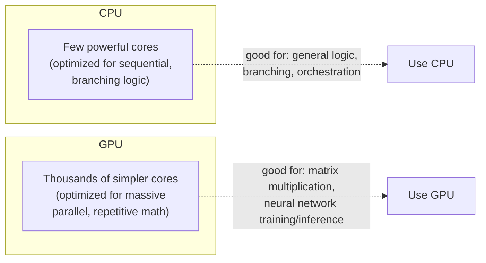
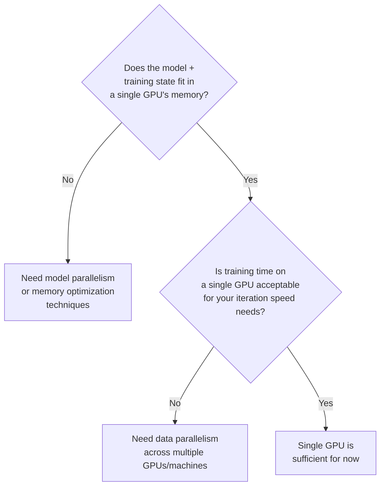

## Introduction

Part 3 gave a model good inputs. Part 4 turns to how the model actually gets trained — starting, in this chapter, with the hardware and infrastructure foundations that make training fast enough to be practical at all. You don't need to be a hardware engineer to design AI systems well, but you do need enough working knowledge of *why* training is expensive, *what* a GPU actually accelerates, and *when* a single machine stops being sufficient — because these facts directly shape cost, timeline, and architecture decisions throughout the rest of this series.

## Why CPUs Aren't Enough: The Case for GPUs

A CPU is optimized for **low-latency, sequential, branching logic** — a handful of powerful cores executing complex instructions one after another very quickly. Neural network training, by contrast, is dominated by **matrix multiplication and other highly parallel, repetitive numeric operations** — the same simple operation (multiply-and-add) applied to millions of independent data points simultaneously.

A **GPU (Graphics Processing Unit)**, originally designed for rendering millions of independent pixels in parallel, turns out to be architecturally ideal for this: thousands of simpler cores executing the same operation across massive amounts of data at once. This single architectural mismatch — CPUs optimized for sequential complexity, GPUs optimized for parallel simplicity — is why training a modern deep learning model on a CPU can be 10-100x slower than on a GPU.



## TPUs: Purpose-Built for Deep Learning

A **TPU (Tensor Processing Unit)**, developed by Google, takes specialization even further than a general-purpose GPU — it's an ASIC (Application-Specific Integrated Circuit) designed *specifically* for the tensor operations that dominate deep learning (matrix multiplication and convolution), at the cost of the general-purpose flexibility a GPU still retains for other parallel workloads (like graphics rendering or general scientific computing). TPUs are available primarily through Google Cloud, while GPUs (dominated by NVIDIA) are available across all major cloud providers and on-premise — this availability difference, alongside the maturity of each ecosystem's software tooling (CUDA for NVIDIA GPUs is extremely mature), is often as decisive a factor in the choice as raw hardware performance.

## Key Hardware Metrics That Matter for System Design

- **Compute throughput** (measured in FLOPS — floating point operations per second): how many mathematical operations the hardware can perform per second. Higher-end training GPUs (e.g., NVIDIA H100) offer dramatically more FLOPS than consumer-grade GPUs.
- **Memory capacity (VRAM)**: how large a model (and its associated training state — gradients, optimizer state, activations) can fit directly on a single accelerator. This is frequently the actual bottleneck for large model training, not raw compute — a model that doesn't fit in memory can't be trained on that hardware at all, regardless of available compute.
- **Memory bandwidth**: how quickly data can move between the accelerator's memory and its compute cores — often the true bottleneck even when there's compute FLOPS to spare, since modern accelerators can frequently compute faster than they can be fed data.
- **Interconnect bandwidth** (e.g., NVLink between GPUs on the same machine, InfiniBand between machines in a cluster): how quickly multiple accelerators can communicate with each other — critical once training spans more than a single device, which is the focus of Chapter 17's data/model parallelism discussion.

## When Does Single-Machine Training Stop Being Enough?



Two independent questions determine whether you need distributed training at all:

1. **Does the model fit in memory on a single accelerator?** If not, you have no choice but to split the model itself across multiple devices (model parallelism, Chapter 17) — this isn't an optimization choice, it's a hard requirement.
2. **Is training time on a single accelerator acceptable?** Even if a model fits comfortably on one GPU, training on a large enough dataset can still take days or weeks — unacceptable for a team that needs to iterate quickly. Splitting the *data* (not the model) across multiple accelerators, each training a copy of the same model in parallel (data parallelism, Chapter 17), addresses this.

A common interview mistake is to jump straight to "let's use distributed training" for every scenario without first establishing whether it's actually necessary — much like Chapter 5's caution against defaulting to unnecessary architectural complexity. Many production models, especially classical ML models (gradient boosted trees, smaller neural networks), train perfectly well on a single machine, and the added complexity of a distributed training setup (covered fully in Chapters 17-18) should be justified by a genuine, measured need.

## The Training Cluster: A High-Level Picture

Once distributed training is genuinely needed, a training cluster typically consists of:

- **Compute nodes**: machines, each with one or more GPUs/TPUs, that actually run the training computation.
- **High-speed interconnect**: specialized networking (InfiniBand, or high-bandwidth Ethernet) connecting nodes, since distributed training requires frequent, high-volume communication between nodes (e.g., synchronizing gradients — the core mechanic of data parallelism, detailed in Chapter 17).
- **Shared, high-throughput storage**: a distributed file system or object storage (tying back to Chapter 9's data lake/lakehouse) that every node can read training data from in parallel, avoiding a single node becoming a data-loading bottleneck.
- **A cluster scheduler/orchestrator**: software (e.g., Kubernetes, Slurm, or a managed cloud training service) that allocates GPU resources to training jobs, handles job queuing, and manages failures — covered further in Chapter 28's training pipeline orchestration discussion.

```python
# A minimal illustration of checking GPU availability and moving
# a model + data onto the GPU in PyTorch — the very first practical
# step in any GPU-accelerated training setup.

import torch

device = torch.device("cuda" if torch.cuda.is_available() else "cpu")
print(f"Training on device: {device}")
if torch.cuda.is_available():
    print(f"GPU: {torch.cuda.get_device_name(0)}")
    print(f"Available GPUs: {torch.cuda.device_count()}")

model = MyModel().to(device)          # move model parameters to GPU
for batch in dataloader:
    inputs, labels = batch
    inputs, labels = inputs.to(device), labels.to(device)  # move data to GPU
    outputs = model(inputs)
    loss = loss_fn(outputs, labels)
    loss.backward()
    optimizer.step()
```

## Cost Considerations

GPU/TPU compute is one of the most expensive line items in an ML system's operating budget, and cost-consciousness is an explicit part of good training infrastructure design, not an afterthought:

- **On-demand vs spot/preemptible instances**: spot instances offer significantly lower cost in exchange for the possibility of being reclaimed by the cloud provider mid-training — viable for fault-tolerant training jobs with frequent checkpointing (Chapter 19), risky for long, uncheckpointed runs.
- **Right-sizing hardware to the actual workload**: using an expensive, high-end GPU for a small model that would train perfectly well on cheaper hardware wastes budget without any corresponding benefit.
- **Utilization monitoring**: an idle or underutilized GPU (e.g., one waiting on slow data loading, discussed above under memory bandwidth) is a direct, visible cost with no corresponding training progress — treating GPU utilization as a monitored, optimized metric is a mark of mature ML infrastructure practice, and we return to this cost dimension explicitly in Chapter 20.

## Key Takeaways

- GPUs (and the more specialized TPUs) accelerate deep learning training because their massively parallel architecture matches the highly parallel, repetitive matrix-multiplication-dominated computation of neural network training.
- Memory capacity and memory/interconnect bandwidth are often the true bottlenecks in training performance, not raw compute FLOPS alone.
- Distributed training is only needed when a model doesn't fit on a single accelerator (forcing model parallelism) or when single-accelerator training time is unacceptably slow for iteration needs (motivating data parallelism) — it shouldn't be adopted as a default without a demonstrated need.
- A training cluster combines compute nodes, high-speed interconnect, shared high-throughput storage, and an orchestrator — and GPU/TPU cost management (spot instances, right-sizing, utilization monitoring) is a first-class system design concern.

---

## Interview Questions

**1. Why are GPUs so much faster than CPUs for training deep learning models?**
GPUs have thousands of simpler cores designed to execute the same operation across massive amounts of data simultaneously, which architecturally matches neural network training's dominant workload — matrix multiplication and other highly parallel, repetitive numeric operations applied across millions of data points. CPUs, by contrast, have a small number of powerful cores optimized for fast, sequential, branching logic, which is a poor architectural match for this kind of massively parallel numeric computation, resulting in CPUs being dramatically (often 10-100x) slower for the same deep learning training workload.
*Follow-up: Does this mean CPUs have no role at all in a modern ML training pipeline?*
No — CPUs still handle tasks that are inherently sequential or logic-heavy rather than massively parallel numeric computation, such as data loading and preprocessing, orchestrating the overall training loop, and running the general-purpose code that coordinates when and how the GPU is used; a well-designed training pipeline uses the CPU for these orchestration and data-preparation tasks while offloading the actual heavy numeric computation to the GPU, and a poorly balanced pipeline (e.g., slow CPU-based data loading) can even leave an expensive GPU idle and underutilized, which is itself a common and costly training infrastructure problem.

**2. What's the difference between a GPU and a TPU, and what trade-off does choosing a TPU involve?**
A GPU is a general-purpose parallel processor (originally designed for graphics rendering) that has been adapted and is widely used for deep learning, retaining flexibility for other parallel workloads; a TPU is an ASIC (application-specific chip) built specifically and exclusively for the tensor operations dominant in deep learning, offering potentially superior performance and efficiency for those specific operations but sacrificing the general-purpose flexibility a GPU still provides. The trade-off in practice also includes availability and ecosystem maturity — TPUs are primarily available through Google Cloud, while GPUs (particularly NVIDIA, with its mature CUDA software ecosystem) are broadly available across all major cloud providers and on-premise infrastructure.
*Follow-up: Beyond raw performance, what practical factor might make a team choose GPUs over TPUs even if TPUs offered a theoretical performance edge for their specific workload?*
Software ecosystem maturity and portability — the NVIDIA CUDA ecosystem has decades of accumulated tooling, framework support (PyTorch, TensorFlow), community knowledge, and debugging resources, and choosing GPUs avoids potential vendor lock-in to a single cloud provider (Google Cloud) that TPU adoption would create, which can be a significant practical consideration for a team valuing infrastructure flexibility and broader hiring/tooling compatibility over a potentially narrower performance edge.

**3. Why is memory capacity (VRAM) often described as a bigger practical constraint in large model training than raw compute (FLOPS)?**
A model's total training memory footprint includes not just the model's parameters themselves, but also gradients, optimizer state (e.g., momentum and variance terms for Adam-style optimizers, which can be 2-3x the size of the parameters alone), and intermediate activations needed for backpropagation — if this total footprint exceeds a single accelerator's available memory, training simply cannot proceed on that hardware at all, regardless of how much spare compute capacity might be available; this makes memory capacity a hard, binary constraint in a way that compute throughput (which mainly affects how long training takes, not whether it's possible at all) usually isn't.
*Follow-up: What are some techniques (without going into full technical depth) that address memory constraints without necessarily needing model parallelism across multiple devices?*
Techniques like gradient checkpointing (recomputing certain activations during the backward pass instead of storing them all in memory, trading compute time for memory savings), mixed-precision training (using lower-precision number formats like FP16/BF16 for parts of the computation, roughly halving memory usage for those components), and reducing batch size (directly reducing the memory needed for activations, at some cost to training efficiency/stability) can all extend how large a model can be trained on a single device before model parallelism becomes strictly necessary.

**4. What two distinct questions determine whether a team actually needs distributed training, rather than adopting it as a default?**
First, does the model (plus its associated training state) fit within a single accelerator's memory — if not, model parallelism across multiple devices is a hard requirement, not an optional optimization. Second, is training time on a single accelerator acceptable for the team's needed iteration speed — if training on one GPU takes an unacceptably long time (days or weeks) for a team that needs to experiment and iterate quickly, data parallelism across multiple accelerators becomes justified even though it's not strictly required for the model to be trainable at all.
*Follow-up: Why is it important to distinguish between these two motivations (memory constraint vs. speed constraint) rather than treating "we need distributed training" as a single, undifferentiated decision?*
Because the two motivations call for fundamentally different distributed training strategies — a memory constraint requires model parallelism (splitting the model itself across devices), while a speed/iteration constraint is addressed by data parallelism (replicating the full model across devices, each training on different data) — conflating them risks choosing the wrong distributed training architecture for the actual underlying problem, adding significant complexity (Chapter 17 details this) without addressing the real bottleneck the team is trying to solve.

**5. Why might a well-designed training pipeline still leave an expensive GPU underutilized, and why does this matter for system design?**
If the CPU-based data loading, preprocessing, or augmentation pipeline feeding the GPU can't keep up with how quickly the GPU can consume and process batches of data, the GPU will sit idle waiting for the next batch to be ready — meaning the bottleneck is actually in the data pipeline, not the GPU's own compute capacity, despite the GPU being the most expensive piece of hardware in the setup. This matters for system design because it means simply provisioning a more powerful (and more expensive) GPU wouldn't improve training speed at all in this scenario — the actual fix requires optimizing the data loading pipeline (e.g., parallelizing data loading across multiple CPU workers, pre-fetching batches, or using a faster data format), a classic example of investing in the wrong part of the system based on an incomplete understanding of the actual bottleneck.
*Follow-up: How would you diagnose whether a slow training run is actually GPU-compute-bound versus data-loading-bound?*
Monitor GPU utilization metrics during training (most cloud/hardware monitoring tools report this) — consistently high GPU utilization (e.g., near 100%) during training indicates the GPU is genuinely the bottleneck and would benefit from more/faster compute, while GPU utilization that frequently drops or fluctuates low (e.g., spending significant time idle between batches) indicates the data pipeline is the actual bottleneck, and the fix should focus there (parallelizing data loading, pre-fetching, faster storage/data format) rather than upgrading the GPU hardware itself.

**6. What role does interconnect bandwidth (like NVLink or InfiniBand) play in distributed training, and why does it become increasingly important as you scale to more devices?**
Distributed training requires frequent communication between devices — most notably synchronizing gradients across all devices in data-parallel training (detailed in Chapter 17) — and this communication happens over the interconnect linking devices together, whether within a single machine (NVLink between GPUs) or across machines in a cluster (InfiniBand or high-bandwidth Ethernet). As you add more devices to a distributed training job, the volume and frequency of this required communication generally increases, and if the interconnect bandwidth can't keep pace, devices spend an increasing proportion of their time waiting for communication to complete rather than doing useful computation — meaning the benefit of adding more compute devices diminishes or even reverses beyond a certain point if the interconnect becomes the bottleneck.
*Follow-up: What does this suggest about the relationship between the number of GPUs used and the resulting training speedup, in practice?*
Speedup from adding more GPUs to a distributed training job is sub-linear in practice (doubling the number of GPUs typically doesn't exactly halve training time), and the gap between theoretical and actual speedup tends to widen as more devices are added, precisely because a growing share of each device's time goes toward communication overhead rather than useful computation — this is a key reason why simply "throwing more GPUs at the problem" has diminishing returns, and why interconnect quality (and the specific parallelism strategy chosen, covered in Chapter 17) matters as much as raw device count for actual achieved training speed.

**7. When would you choose spot/preemptible instances for a training job, and what engineering practice is essential to make this choice safe?**
Spot/preemptible instances offer significantly reduced cost compared to on-demand instances in exchange for the cloud provider being able to reclaim them with little notice when capacity is needed elsewhere — this is a good trade-off for training jobs that are fault-tolerant and can gracefully resume after an interruption, since the cost savings can be substantial, especially for large-scale or long-running training jobs. The essential practice that makes this safe is frequent checkpointing (saving the model and optimizer state to persistent storage at regular intervals during training), so that if a spot instance is reclaimed mid-training, the job can resume from the most recent checkpoint rather than losing all progress and having to restart from scratch.
*Follow-up: What's the trade-off in choosing how frequently to checkpoint during a spot-instance-based training run?*
Checkpointing too infrequently risks losing more training progress (and therefore more wasted compute cost/time) if an interruption occurs between checkpoints, while checkpointing too frequently introduces its own overhead (time spent writing large model/optimizer state to storage, and potentially I/O contention with the actual training computation) that can meaningfully slow down overall training throughput — the right checkpointing frequency balances the expected cost of lost progress from an interruption (informed by how frequently interruptions actually occur for the specific spot instance type/region being used) against the cumulative overhead of more frequent checkpointing.

**8. Why is "right-sizing" hardware to the actual training workload an important cost consideration, and what's a sign that a team has over-provisioned?**
Using a more powerful (and more expensive) accelerator than a given model/workload actually requires wastes budget without providing any corresponding benefit — if a smaller, cheaper GPU would complete training in an acceptable timeframe, paying for a top-tier GPU provides no practical advantage and directly inflates cost unnecessarily; a sign of over-provisioning is low GPU utilization or memory usage relative to the hardware's actual capacity (e.g., using only a small fraction of an expensive GPU's available memory or compute throughput), indicating the workload doesn't actually need that level of hardware capability.
*Follow-up: How would you build a practice of right-sizing into a team's regular training workflow, rather than treating it as a one-time decision?*
Establish regular monitoring and review of GPU utilization and memory usage across training jobs (as part of standard MLOps observability practice, tying into Chapter 47's broader observability discussion), and periodically benchmark whether a given team's typical workloads could run acceptably well on smaller/cheaper hardware tiers, treating hardware allocation decisions as an ongoing, data-informed practice rather than a one-time default choice made when a project first started (which may no longer reflect the workload's actual current needs as the project evolves).

**9. In an interview, how would you decide whether to recommend distributed training for a candidate system, given no explicit constraints from the interviewer?**
I'd first estimate (even roughly) the model size and dataset scale implied by the problem to assess whether a single accelerator's memory would likely be sufficient (ruling model parallelism in or out as a hard requirement), and separately consider the team's likely iteration speed needs based on the business context (e.g., a system requiring frequent retraining on fast-moving data, from Chapter 7's data recency discussion, would benefit more from faster, distributed training than a system retrained rarely) — rather than defaulting to recommending distributed training complexity without first establishing that a single-machine setup would genuinely be insufficient for the stated or reasonably inferred requirements.
*Follow-up: What would you say if the interviewer explicitly asked you to assume "very large scale" without more specific numbers?*
I'd state a reasonable assumption explicitly (e.g., "I'll assume this implies a model and dataset large enough to require distributed training, given the stated very large scale") and proceed to discuss the appropriate distributed training strategy, while noting that in a real scoping conversation I'd want concrete numbers (model parameter count, dataset size, target iteration speed) to make a more precise, justified recommendation rather than assuming maximum complexity is always the correct default for any vague indication of "scale."

**10. What's the relationship between the training cluster's shared storage system and the data lake/lakehouse concepts from Chapter 9?**
The shared, high-throughput storage that feeds a training cluster (allowing every compute node to read training data in parallel without becoming bottlenecked) is very often built directly on top of the same data lake/lakehouse infrastructure discussed in Chapter 9 — training jobs typically read their input data directly from these existing lakehouse tables or lake-stored files (e.g., Parquet on S3), rather than requiring an entirely separate, dedicated storage system just for training; the training cluster adds specific access-pattern optimizations (high-throughput parallel reads across many compute nodes simultaneously) on top of this underlying storage layer.
*Follow-up: What's a potential performance issue that could arise from training many large models concurrently, all reading from the same underlying lakehouse storage?*
Contention for shared storage I/O bandwidth — if the lakehouse/object storage system's total available throughput is exceeded by the combined simultaneous read demands of multiple large-scale training jobs running concurrently, each individual job could experience slower-than-expected data loading, becoming a shared, cluster-wide data-loading bottleneck (echoing the earlier discussion of GPU idle time caused by slow data loading) — this motivates careful capacity planning and potentially dedicated, higher-throughput storage tiers or caching layers specifically for the highest-priority or most I/O-intensive training workloads.

**11. Why might mixed-precision training (using lower-precision number formats like FP16/BF16) be an attractive technique to mention when discussing training infrastructure trade-offs?**
Mixed-precision training uses lower-precision (16-bit rather than the traditional 32-bit) number representations for parts of the training computation, which roughly halves the memory required for those components (model weights, activations) and can significantly speed up computation on hardware with specialized support for lower-precision arithmetic (which most modern training GPUs have) — all while maintaining training stability and final model accuracy close to full-precision training through careful technique (e.g., maintaining a master copy of weights in higher precision, and dynamic loss scaling to prevent numerical underflow), making it a relatively low-cost way to meaningfully improve training speed and reduce memory pressure.
*Follow-up: What's a risk of naively converting an entire training pipeline to lower precision without the specific stabilizing techniques mentioned?*
Naively using lower precision throughout can introduce numerical instability — certain values (particularly small gradients) can underflow to zero in lower precision, effectively vanishing and preventing the model from learning properly, or the reduced numerical range and precision can cause training to diverge or converge to a worse final result than full-precision training — this is exactly why production mixed-precision training implementations include specific stabilizing techniques (loss scaling, selectively maintaining certain values in higher precision) rather than simply switching every number format to a lower precision without any additional safeguards.

**12. How would you explain to a non-technical stakeholder why training a large model can be so expensive, connecting it back to the hardware concepts in this chapter?**
I'd explain that training a large model requires specialized, expensive hardware (GPUs or TPUs) specifically because of the massive amount of parallel mathematical computation involved, and that this hardware needs to run continuously, often for many hours to weeks depending on model and dataset size, incurring significant cloud compute costs for the duration of that continuous usage — additionally, larger or more complex models may require multiple such expensive accelerators working together (distributed training), further multiplying the cost, and the underlying infrastructure (high-speed networking between machines, high-throughput storage) needed to support this distributed setup adds further cost on top of the raw compute hardware itself.
*Follow-up: How would you help the stakeholder understand what levers exist to control or reduce this cost, without necessarily going into deep technical detail?*
I'd frame it around a few accessible levers: right-sizing the model and hardware to the actual business need rather than always using the largest/most powerful option available, using discounted spot/preemptible compute where the training job can tolerate interruptions, being deliberate about how often and how extensively the model needs to be retrained (tying back to Chapter 6's discussion of balancing freshness needs against cost), and monitoring hardware utilization to catch and fix situations where expensive hardware is sitting idle due to bottlenecks elsewhere in the pipeline — framing these as concrete, actionable cost-management levers rather than abstract technical trade-offs.

**13. Why might a team choose to train a smaller model on a single, less expensive GPU rather than investing in the infrastructure for training a much larger model, even if the larger model would likely achieve somewhat better offline accuracy?**
This connects back to the general trade-off discussed in Chapter 1 and Chapter 6 — a marginal accuracy improvement must be weighed against its real cost, which in this case includes both the significantly higher training infrastructure investment (potentially requiring distributed training setup, more expensive hardware, and the associated engineering complexity) and the correspondingly higher ongoing inference/serving cost a larger model typically carries (tying to Chapter 5's latency and cost discussions) — if the achievable accuracy gain doesn't translate into a proportionally significant business metric improvement, the substantially higher total cost of training and serving a larger model may not be justified.
*Follow-up: How would you go about quantifying whether this trade-off is worth making for a specific business context, rather than making the decision based on intuition alone?*
Run a controlled comparison (or at minimum a careful offline analysis) measuring the actual online/business metric impact (from Chapter 6's metric tiers) of the smaller versus larger model's accuracy difference — if a modest offline accuracy improvement from the larger model translates into a negligible online/business metric improvement, that's concrete evidence the added training and serving cost isn't justified; if the online business impact is substantial (e.g., meaningfully higher conversion or significantly reduced fraud losses), that provides a quantified basis for justifying the additional infrastructure investment, rather than relying on offline accuracy numbers or intuition alone to make this consequential and costly infrastructure decision.

**14. What's a practical reason a team might need to revisit their training infrastructure choices as their product or model scope grows over time, even if their initial single-GPU setup worked well at launch?**
As a product grows, the underlying training dataset typically grows substantially (more users, more historical data, more features), and/or the model itself may need to grow in complexity/size to continue capturing increasingly nuanced patterns in a larger, richer dataset — either of these growth dimensions can eventually push the training workload past what a single accelerator can handle in acceptable time (motivating data parallelism) or fit in memory (motivating model parallelism), meaning an infrastructure choice that was entirely appropriate and sufficient at an earlier, smaller scale can become a genuine bottleneck as the system scales, requiring a deliberate re-evaluation rather than assuming the original setup will remain adequate indefinitely.
*Follow-up: What metric or signal would prompt a team to proactively revisit this decision, rather than waiting until training becomes obviously, painfully slow?*
Tracking training time trends over successive retraining cycles as data volume grows (even if still within an acceptable range today, a clear upward trend signals an approaching limit), alongside monitoring how training time growth compares to the team's required iteration cadence (from Chapter 6 and Chapter 20's retraining frequency discussions) — proactively projecting forward based on current growth trends, rather than reactively waiting until training time has already become an acute, obviously painful bottleneck, allows the infrastructure investment decision to be made deliberately and with adequate lead time rather than under time pressure.

**15. How would you frame the decision between GPUs and TPUs, or between different distributed training approaches, if an interviewer pushes you to make a specific hardware recommendation with limited information?**
I'd state the key factors the decision should hinge on (model/dataset scale determining whether distributed training is even needed at all, existing team expertise and cloud provider relationships affecting ecosystem fit, and budget constraints), make a reasonable default recommendation based on general industry prevalence (e.g., defaulting to GPUs given their broader availability and more mature, portable tooling ecosystem, absent a specific reason favoring TPUs), and explicitly note that this is a starting assumption I'd want to validate against the team's actual existing infrastructure, cloud commitments, and specific workload characteristics in a real scoping conversation, rather than presenting a single, context-free "best" hardware choice as if one universally correct answer existed independent of these situational factors.
*Follow-up: Why is explicitly naming your assumptions and the factors driving your recommendation more valuable to an interviewer than simply stating a confident, singular answer?*
It demonstrates that you understand hardware/infrastructure decisions are genuinely context-dependent trade-offs rather than having a single universally correct answer, and it shows the kind of structured reasoning process a senior engineer would actually apply when facing this decision with incomplete information in a real project — a confident but unexplained single answer risks looking like pattern-matched, memorized knowledge rather than genuine engineering judgment, while explicitly naming the deciding factors and your assumptions invites productive follow-up discussion and demonstrates you'd make a similarly well-reasoned decision when faced with a real, ambiguous production scenario.
