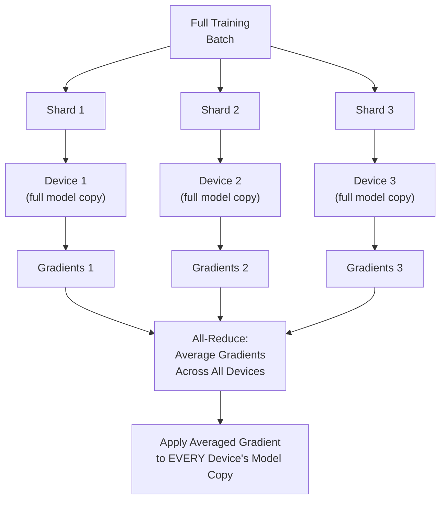
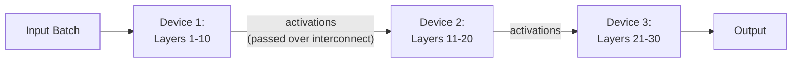
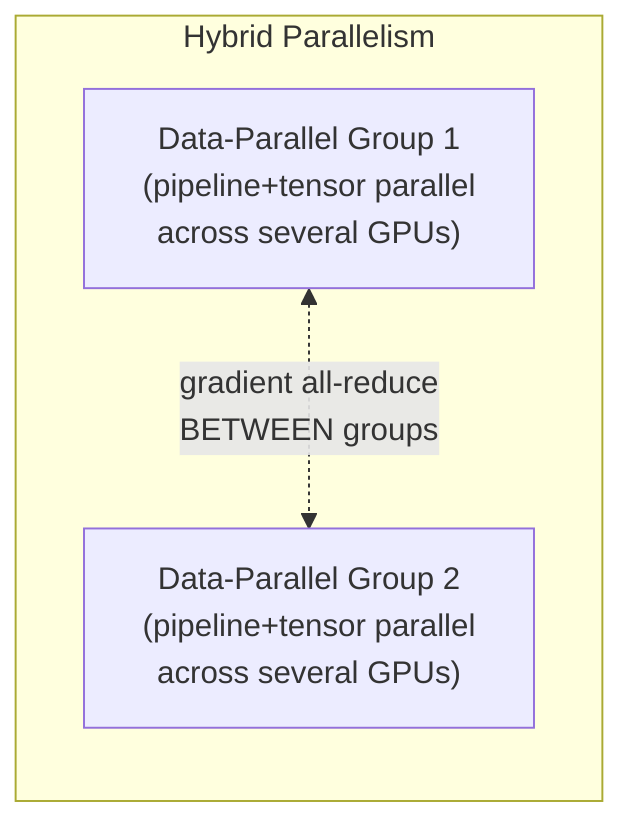
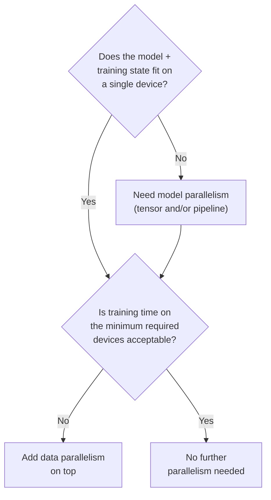

## Introduction

Chapter 16 established *when* distributed training becomes necessary: either the model doesn't fit on a single accelerator (a memory constraint) or single-accelerator training is too slow (a speed constraint). This chapter covers *how* — the two fundamental strategies, data parallelism and model parallelism, that directly correspond to those two constraints, plus the hybrid approaches that combine them for the largest-scale training jobs.

## Data Parallelism

**The idea**: replicate the *entire model* onto every device, and split the *training data* into shards, with each device processing a different shard of data on its own full copy of the model, in parallel.



**How it works, step by step**:
1. Each device holds an identical, full copy of the model.
2. A large batch of training data is split into smaller sub-batches, one per device.
3. Each device independently runs a forward and backward pass on its own sub-batch, producing its own set of gradients.
4. An **all-reduce** operation averages the gradients across all devices (this is the critical communication step, requiring the interconnect bandwidth discussed in Chapter 16).
5. Every device applies the same, averaged gradient update to its own model copy — keeping all copies identical after every step.

**When to use it**: data parallelism is the right tool specifically for the *speed* constraint from Chapter 16 — the model comfortably fits on a single device, but you want to process more data per unit time by parallelizing across devices. It's simpler to implement and reason about than model parallelism, and is the default, most common form of distributed training in practice.

**Limitation**: data parallelism does nothing to help if the model itself is too large to fit on a single device in the first place — every device still needs a full copy of the entire model.

```python
# Minimal illustration of data parallelism using PyTorch's
# DistributedDataParallel (DDP) — the standard, production-grade
# approach (preferred over the simpler, less efficient DataParallel).

import torch
import torch.distributed as dist
from torch.nn.parallel import DistributedDataParallel as DDP

def setup(rank: int, world_size: int):
    dist.init_process_group("nccl", rank=rank, world_size=world_size)
    torch.cuda.set_device(rank)

def train(rank: int, world_size: int, dataset):
    setup(rank, world_size)
    model = MyModel().to(rank)
    ddp_model = DDP(model, device_ids=[rank])

    sampler = torch.utils.data.distributed.DistributedSampler(
        dataset, num_replicas=world_size, rank=rank
    )  # ensures each device sees a distinct data shard
    loader = torch.utils.data.DataLoader(dataset, sampler=sampler, batch_size=32)

    optimizer = torch.optim.Adam(ddp_model.parameters())
    for inputs, labels in loader:
        inputs, labels = inputs.to(rank), labels.to(rank)
        optimizer.zero_grad()
        loss = loss_fn(ddp_model(inputs), labels)
        loss.backward()  # DDP automatically all-reduces gradients here
        optimizer.step()
```

## Model Parallelism

**The idea**: split the *model itself* across multiple devices, with each device responsible for only a portion of the model's layers or parameters. Every device sees the *same* data, but each only computes a piece of the full forward/backward pass.



There are two main variants:

- **Tensor (intra-layer) parallelism**: splits individual large layers/matrices themselves across devices (e.g., splitting a single massive weight matrix's columns across 4 GPUs, with each computing a slice of the matrix multiplication) — used for extremely large individual layers common in modern large language models.
- **Pipeline (inter-layer) parallelism**: assigns different, sequential *groups of layers* to different devices (as depicted above), with activations passed from one device to the next like a pipeline/assembly line.

**When to use it**: model parallelism is the right tool specifically for the *memory* constraint from Chapter 16 — the model itself, or its associated training state, is too large to fit on a single device's memory, regardless of how much time you're willing to spend training. This is a hard requirement, not an optimization, once a model's size crosses this threshold (as is common for large language models with tens or hundreds of billions of parameters).

**Limitation**: model parallelism introduces significant communication overhead (activations must be passed between devices at every layer boundary) and can leave devices idle waiting for their turn in the pipeline (a problem called "pipeline bubbles," mitigated by techniques like micro-batching, where the input batch is further split into smaller micro-batches to keep the pipeline more continuously busy).

```python
# A greatly simplified illustration of pipeline (inter-layer)
# model parallelism, manually splitting a model's layers across
# two devices. Production systems typically use a dedicated
# library (e.g., PyTorch's pipeline parallelism APIs, or DeepSpeed)
# rather than this manual approach, but the core idea is the same.

import torch
import torch.nn as nn

class Stage1(nn.Module):
    def __init__(self):
        super().__init__()
        self.layers = nn.Sequential(nn.Linear(1024, 1024), nn.ReLU())

    def forward(self, x):
        return self.layers(x.to("cuda:0"))

class Stage2(nn.Module):
    def __init__(self):
        super().__init__()
        self.layers = nn.Sequential(nn.Linear(1024, 10))

    def forward(self, x):
        return self.layers(x.to("cuda:1"))  # activation crosses device boundary here

stage1 = Stage1().to("cuda:0")
stage2 = Stage2().to("cuda:1")

def forward_pass(x):
    intermediate = stage1(x)          # computed on device 0
    output = stage2(intermediate)      # computed on device 1
    return output
```

## Comparing the Two Approaches

| Dimension | Data Parallelism | Model Parallelism |
|---|---|---|
| Solves which constraint | Training speed | Model memory footprint |
| What's split | The data | The model itself |
| Communication pattern | Gradient all-reduce (periodic, at each step) | Activation passing (constant, at every layer boundary) |
| Implementation complexity | Lower — well-supported, mature tooling (DDP) | Higher — requires careful model partitioning |
| Common failure mode | Diminishing returns from communication overhead as device count grows | "Pipeline bubbles" — devices idle waiting for their pipeline stage |

## Hybrid Approaches: Combining Both

For the largest modern training jobs (e.g., training a large language model from scratch), a single strategy alone is usually insufficient — a model may be too large for a single device (requiring model parallelism) *and* the total dataset too large to train in acceptable time on just the minimum number of devices needed for that model parallelism (requiring data parallelism on top). This leads to **hybrid/3D parallelism**: combining data parallelism, tensor parallelism, and pipeline parallelism simultaneously, with different groups of devices handling different combinations of splitting. Frameworks like **DeepSpeed** and **Megatron-LM** (covered in full in Chapter 18) are specifically designed to orchestrate this multi-dimensional combination, since manually coordinating it is extremely complex.



## A Decision Framework



This mirrors the same reasoning discipline emphasized throughout this series — apply the minimum complexity that satisfies the actual constraint, checking memory first (a hard requirement) and speed second (an optimization), rather than reaching for the most sophisticated hybrid approach by default.

## Key Takeaways

- Data parallelism replicates the full model across devices and splits the data, synchronizing via gradient averaging — it solves the *speed* constraint and is the simpler, more common default.
- Model parallelism splits the model itself (via tensor and/or pipeline parallelism) across devices that all see the same data — it solves the *memory* constraint and is required, not optional, once a model exceeds a single device's capacity.
- The two solve different problems and are often combined (hybrid/3D parallelism) for the largest training jobs, orchestrated by frameworks like DeepSpeed and Megatron-LM.
- The right amount of parallelism should be determined by checking the hard memory constraint first, then the speed/iteration-time constraint second — not adopted as maximal complexity by default.

---

## Interview Questions

**1. What's the fundamental difference between data parallelism and model parallelism, and what distinct problem does each solve?**
Data parallelism replicates the entire model on every device and splits the training data across devices, with each device computing gradients on its own data shard that are then averaged across all devices — it solves the problem of training being too slow on a single device. Model parallelism splits the model itself across devices, with every device seeing the same data but each computing only a portion of the model's layers or parameters — it solves the problem of the model being too large to fit in a single device's memory at all, which is a fundamentally different, harder constraint than mere training speed.
*Follow-up: Could you use data parallelism to solve a model-that-doesn't-fit-in-memory problem? Why or why not?*
No — data parallelism requires every device to hold a full, complete copy of the model, so if the model itself doesn't fit in a single device's memory, it also can't fit as a full replicated copy on any of the data-parallel devices; data parallelism only helps once the model already fits comfortably on a single device and you simply want to process more data faster by using multiple devices in parallel, making it structurally unable to address the memory-constraint problem that model parallelism is specifically designed to solve.

**2. Walk through the step-by-step mechanics of how data parallelism synchronizes model updates across devices.**
Each device holds an identical copy of the model and receives its own shard of the current training batch; each device independently performs a forward pass and backward pass on its data shard, producing its own local gradients; an all-reduce communication operation then averages these gradients across every participating device; finally, every device applies this same averaged gradient to update its own local model copy, ensuring all devices' model copies remain identical to each other after every training step, ready to repeat the process on the next batch.
*Follow-up: What would happen if the all-reduce step were skipped, and each device simply updated its own model copy using only its own local gradients?*
The model copies on different devices would immediately diverge from each other, since each would be updated based on different, independently-computed gradients from different data shards — this would effectively mean you're training multiple separate, inconsistent models rather than one single model benefiting from the combined signal of the full distributed batch, defeating the entire purpose of data parallelism, which specifically relies on the gradient averaging step to keep all replicas synchronized and equivalent to training on the full combined batch.

**3. What is a "pipeline bubble" in the context of pipeline (inter-layer) model parallelism, and what causes it?**
A pipeline bubble is idle time experienced by a device in a pipeline-parallel setup while it waits for its specific stage's input (activations from the previous device in the pipeline) to become available, particularly pronounced at the very start and end of processing each batch, when earlier or later pipeline stages haven't yet received data to work on or have already finished — it's caused by the inherently sequential, dependency-chained nature of pipeline parallelism, where a later stage cannot begin its computation until the preceding stage has completed and passed along its output.
*Follow-up: How does micro-batching help reduce the impact of pipeline bubbles?*
By splitting a full training batch into several smaller micro-batches and feeding them through the pipeline in a staggered, overlapping fashion, a later pipeline stage can begin processing an earlier micro-batch's output while an earlier pipeline stage is still working on a subsequent micro-batch — this keeps more devices busy simultaneously (processing different micro-batches at different pipeline stages at the same time) rather than each device sitting fully idle waiting for one large batch to fully clear each preceding stage, meaningfully reducing (though not entirely eliminating) the proportion of time lost to pipeline bubbles.

**4. Why does data parallelism's benefit tend to diminish as you add more and more devices, even though it seems like it should scale training speed linearly?**
As more devices are added, the total volume of gradient data that must be communicated and averaged during the all-reduce step at every training step also grows, and this communication takes real time over the interconnect (Chapter 16) — at some point, the time spent on this communication overhead becomes a significant, and eventually dominant, fraction of each training step's total time, meaning each additional device contributes progressively less net speedup (sub-linear scaling) rather than the naively expected linear speedup from simply dividing the data across more parallel workers.
*Follow-up: What infrastructure investment would help mitigate this diminishing-returns effect as you scale to more devices?*
Investing in higher-bandwidth, lower-latency interconnect (e.g., NVLink for intra-machine communication, InfiniBand for inter-machine communication, as discussed in Chapter 16) directly reduces the time cost of the gradient all-reduce communication step, allowing data parallelism to scale more effectively (closer to linear speedup) to a larger number of devices before communication overhead becomes the dominant bottleneck — this is a key reason specialized, high-bandwidth networking is such a significant and deliberate infrastructure investment for large-scale distributed training clusters.

**5. When would tensor (intra-layer) parallelism specifically be necessary, as opposed to pipeline (inter-layer) parallelism, within the broader category of model parallelism?**
Tensor parallelism is specifically necessary when an individual layer itself (e.g., a single massive weight matrix in a large language model's feed-forward or attention layers) is too large to fit on a single device, requiring that specific layer's computation to be split (e.g., splitting a matrix multiplication's columns) across multiple devices simultaneously; pipeline parallelism, by contrast, works at a coarser granularity, assigning different, complete groups of sequential layers to different devices, which is sufficient when individual layers themselves fit comfortably on a single device but the total number of layers across the full model doesn't.
*Follow-up: Why might a very large modern language model need to use both tensor and pipeline parallelism simultaneously, rather than choosing just one?*
For sufficiently large models (tens or hundreds of billions of parameters), even a single layer's weight matrices can be too large for one device's memory (requiring tensor parallelism to split those individual layers), while the model also has far too many total layers to fit within the memory of just the small number of devices being used for tensor parallelism alone (requiring pipeline parallelism to further distribute different layer groups across additional devices) — using both together allows the model's memory footprint to be distributed both "within" individual layers and "across" groups of layers, which is necessary to fit models at this scale onto the hardware available.

**6. How would you decide, for a new large model training project, how many devices to allocate to model parallelism versus how many to data parallelism?**
First determine the minimum number of devices required for model parallelism alone, based purely on the model's memory footprint — this is a hard requirement, not a choice, and represents the smallest possible "model-parallel group" needed just to fit the model at all; then, evaluate whether training on that minimum-sized model-parallel group would complete in an acceptable amount of time given the full training dataset size — if not, replicate that entire model-parallel group multiple times (each full replica being a data-parallel copy) and apply data parallelism across these replicas, effectively creating a hybrid setup with pipeline/tensor parallelism sized minimally to fit the model, and additional data parallelism layered on top to meet speed requirements.
*Follow-up: Why is it generally preferable to use the minimum necessary degree of model parallelism, adding data parallelism on top, rather than maximizing model parallelism across all available devices?*
Model parallelism introduces significant communication overhead (constant activation-passing between devices, as opposed to data parallelism's periodic gradient-averaging) and can suffer from pipeline bubble inefficiencies, making it generally less communication-efficient per device than data parallelism for a given amount of total compute; using only the minimum model parallelism necessary to fit the model, and preferring data parallelism (which typically scales more efficiently) to add additional throughput, generally achieves better overall training efficiency than maximizing the more communication-heavy model parallelism dimension beyond what's strictly required by the memory constraint.

**7. What's the difference between PyTorch's older `DataParallel` and the modern, recommended `DistributedDataParallel` (DDP)?**
`DataParallel` uses a single-process, multi-threaded approach on a single machine, with one primary GPU coordinating and aggregating work from other GPUs, which introduces a communication and coordination bottleneck at that primary GPU and doesn't scale well beyond a single machine; `DistributedDataParallel` (DDP) uses a multi-process approach (one process per GPU, potentially across multiple machines), with each process independently performing its own forward/backward pass and participating symmetrically in a more efficient, decentralized all-reduce communication pattern for gradient synchronization — this generally makes DDP both faster and more scalable, extending naturally to multi-machine training in a way `DataParallel` does not, which is why DDP is the standard, production-recommended approach today.
*Follow-up: Why does DataParallel's single-process, primary-GPU-coordinated design create a bottleneck that DDP's approach avoids?*
In DataParallel, the primary GPU is responsible for both distributing the input batch to other GPUs and collecting/aggregating their outputs and gradients, meaning it does proportionally more communication and coordination work than the other GPUs, which can become a serialization bottleneck as more GPUs are added (the primary GPU's capacity to coordinate becomes the limiting factor); DDP's decentralized, symmetric all-reduce approach distributes this communication burden evenly across all participating processes/devices rather than concentrating it on a single coordinator, avoiding this specific bottleneck and scaling more gracefully to larger numbers of devices.

**8. How would you explain "hybrid" or "3D parallelism" to someone familiar with data and model parallelism individually, but not how they're combined?**
Hybrid parallelism organizes devices into a grid-like structure: within a smaller group of devices, model parallelism (both tensor and pipeline) is used to fit and compute the model itself, splitting it across just enough devices to make it fit and process the pipeline; then, this entire model-parallel group is replicated multiple times across additional devices, with data parallelism used *between* these replicated groups (rather than between individual devices) — meaning gradient all-reduce communication happens between corresponding devices in different model-parallel replica groups, effectively getting the memory-fitting benefit of model parallelism and the speed benefit of data parallelism simultaneously, at the cost of significantly increased orchestration complexity.
*Follow-up: Why is this level of orchestration complexity typically handled by a specialized framework (like DeepSpeed) rather than implemented manually by an ML engineering team?*
Correctly coordinating which devices participate in which type of parallelism (tensor, pipeline, or data), managing the different communication patterns each requires (activation-passing for model parallelism, gradient all-reduce for data parallelism) simultaneously without conflicts or deadlocks, and optimizing the resulting complex communication schedule for efficiency, is an extremely intricate distributed systems engineering problem — specialized frameworks like DeepSpeed and Megatron-LM have already solved and heavily optimized this specific orchestration problem, and reimplementing it correctly and efficiently from scratch would require significant, specialized distributed systems expertise that most ML engineering teams reasonably prefer to avoid duplicating, covered further in Chapter 18.

**9. If a candidate proposes model parallelism for a model that comfortably fits on a single GPU, purely to make training faster, how would you respond as an interviewer, and what would this reveal about the candidate's understanding?**
I'd point out that this reveals a likely conflation of the two distinct problems data and model parallelism solve — model parallelism specifically addresses a memory constraint (the model not fitting on a single device), and using it purely to improve training speed when the model already fits on a single device would introduce significant, unnecessary communication overhead (constant activation-passing between devices, plus potential pipeline bubble inefficiency) without providing any memory benefit that's actually needed in this scenario; data parallelism would be the appropriate, more efficient choice for a pure speed improvement in this case, since it avoids this unnecessary overhead while still parallelizing training across multiple devices.
*Follow-up: What follow-up question would you ask to help the candidate arrive at this realization themselves, rather than simply telling them they're wrong?*
I'd ask them to walk through specifically what problem model parallelism solves that data parallelism doesn't, and then ask them to confirm whether the stated scenario (a model that comfortably fits on a single GPU) actually has that specific problem — prompting them to recognize, through their own reasoning, that the memory constraint model parallelism is designed to address simply doesn't apply here, and that data parallelism's simpler, generally more communication-efficient approach would be the better-justified choice for the stated goal of purely improving training speed.

**10. How does the communication pattern required by data parallelism (periodic gradient all-reduce) differ from that required by model parallelism (constant activation-passing), and why does this difference matter for infrastructure design?**
Data parallelism's communication happens in discrete, periodic bursts — once per training step, after each device has computed its local gradients, all devices synchronize via all-reduce, and then proceed independently until the next synchronization point — allowing for some overlap between computation and communication if implemented well. Model parallelism's communication (particularly pipeline parallelism's activation-passing between sequential stages) happens continuously and is on the critical path of the forward/backward computation itself — a later pipeline stage genuinely cannot proceed until it receives the required activations from the preceding stage, making this communication far more latency-sensitive and less tolerant of network delays than data parallelism's periodic, batchable gradient synchronization.
*Follow-up: What does this difference suggest about which type of parallelism is more sensitive to using devices spread across multiple physical machines (with higher latency) versus devices within a single machine (with lower latency, like NVLink)?*
Model parallelism (especially pipeline and tensor parallelism, with their latency-sensitive, on-the-critical-path communication) benefits disproportionately from being placed within a single machine or a small number of tightly-coupled machines with very high-bandwidth, low-latency interconnect like NVLink, since any added latency directly stalls the computation pipeline; data parallelism, with its more infrequent, batchable communication pattern, is comparatively more tolerant of being spread across multiple, more loosely-connected machines (relying on InfiniBand or even standard high-bandwidth Ethernet), which is part of why hybrid parallelism setups typically place model-parallel groups within tightly-coupled machine groups, and use data parallelism as the outer layer of replication across those groups.

**11. Why might a team choose to use gradient checkpointing (mentioned briefly in Chapter 16) as an alternative to model parallelism, and what trade-off does it involve?**
Gradient checkpointing reduces a model's memory footprint by not storing all intermediate activations needed for backpropagation, instead recomputing them on-the-fly during the backward pass when needed — trading additional computation time (the cost of recomputing activations) for significantly reduced memory usage, potentially allowing a model that would otherwise require model parallelism to fit and train on a single device instead. This can be an attractive alternative to the added engineering and communication complexity of model parallelism, when the memory savings from checkpointing alone are sufficient to fit the model on a single device.
*Follow-up: Under what circumstance would gradient checkpointing alone be insufficient, still requiring model parallelism regardless?*
If the model's parameters and optimizer state alone (independent of activations, which is what checkpointing specifically targets) already exceed a single device's memory capacity, gradient checkpointing's activation-memory savings wouldn't be sufficient to make the model fit — checkpointing only addresses the activation-memory component of a model's total memory footprint, so for sufficiently large models where parameters and optimizer state alone are the dominant memory cost, model parallelism (splitting the parameters themselves across devices) remains necessary regardless of any activation-memory optimization technique applied on top.

**12. How would you approach explaining, in a system design interview, why you'd choose NOT to use distributed training for a specific proposed system?**
I'd explicitly walk through the two-question framework from Chapter 16 and this chapter: first confirming that the proposed model's expected size is well within a single accelerator's memory capacity (ruling out the hard memory constraint that would require model parallelism), and second, estimating whether the expected dataset size and required retraining cadence would allow training to complete in an acceptable timeframe on a single device (ruling out the speed constraint that would motivate data parallelism) — concluding that, absent evidence of either constraint being violated, a simpler single-device training setup is the appropriate, proportionate choice, avoiding unnecessary distributed training complexity that the stated requirements don't actually justify.
*Follow-up: Why does explicitly justifying the absence of a need for distributed training demonstrate stronger system design judgment than simply defaulting to a single-device assumption without discussion?*
It demonstrates that the decision was made deliberately, based on an explicit evaluation of the actual constraints at play, rather than either defaulting to unnecessary complexity (proposing distributed training without justification) or defaulting to oversimplification (assuming single-device training without considering whether it's actually sufficient) — showing this reasoning process explicitly signals to an interviewer that you understand distributed training as a deliberate, justified engineering trade-off rather than either a default best practice to always reach for or an afterthought to only consider if explicitly prompted.

**13. What's a scenario where you might choose model parallelism even though the model technically fits on a single device, if barely?**
If a model just barely fits on a single device's memory when accounting only for the model's parameters and optimizer state, but leaves insufficient remaining memory for a reasonably-sized training batch's activations (forcing an impractically small batch size that would hurt training stability, efficiency, or gradient quality), a team might choose to use a modest degree of model parallelism anyway — trading some added communication complexity for the ability to use a healthier, more practical batch size, rather than being forced into an awkwardly tiny batch size purely to squeeze everything onto a single device.
*Follow-up: What's an alternative to model parallelism that might address this same "just barely fits, awkward batch size" scenario?*
Gradient checkpointing (discussed in question 11) or reducing memory usage via mixed-precision training (from Chapter 16) could free up enough additional memory headroom to accommodate a more reasonably-sized batch without needing to introduce model parallelism's added communication complexity at all — these memory-optimization techniques are often tried first, as a lower-complexity alternative, before resorting to model parallelism specifically to solve a "just barely doesn't fit comfortably" scenario, reserving model parallelism for cases where the model is unambiguously and substantially too large for these simpler techniques to resolve.

**14. How does the choice between data and model parallelism affect fault tolerance and checkpointing strategy (referenced in Chapter 16) during training?**
In pure data parallelism, since every device holds a complete, independent copy of the full model, checkpointing is relatively straightforward — any single device's model copy (or a designated primary device's copy) fully represents the entire model's current state and can be saved as a complete checkpoint. In model parallelism, since no single device holds the complete model, a valid checkpoint requires coordinating and combining the model state fragments from every device participating in the model-parallel group, making checkpoint creation (and, symmetrically, resuming training from a checkpoint) meaningfully more complex, since it requires correctly reassembling a consistent, complete model state from multiple distributed, interdependent pieces.
*Follow-up: What practical implication does this added checkpointing complexity have for a team's decision to use spot/preemptible instances (from Chapter 16) for a model-parallel training job?*
The more complex checkpoint creation and restoration process for model-parallel training makes recovering from a spot instance preemption interruption inherently slower and more operationally delicate than for pure data-parallel training, since resuming requires correctly reconstructing the distributed model state across multiple recovered devices rather than simply reloading a single, complete checkpoint file — teams using model parallelism on spot/preemptible infrastructure need correspondingly more robust, well-tested distributed checkpointing and recovery tooling to make this trade-off viable, and might reasonably be more conservative about relying on preemptible instances for model-parallel workloads compared to simpler data-parallel ones.

**15. In an interview, how would you handle a follow-up question asking you to estimate the training time speedup from adding more GPUs, without exact benchmarking data available?**
I'd explain that the relationship isn't linear due to communication overhead (as covered earlier in this chapter) and give a qualitative, reasoned estimate rather than a false-precision exact number — describing that speedup would be close to linear for a small number of additional devices where communication overhead is still a small fraction of total step time, but would show diminishing returns as more devices are added and communication increasingly competes with computation time, and noting that the actual inflection point depends heavily on the specific interconnect bandwidth available and the model's communication-to-computation ratio — framing this as the kind of question that in a real project would be answered with actual benchmarking on the target hardware, rather than purely theoretical estimation.
*Follow-up: Why is acknowledging "this would need real benchmarking to answer precisely" a stronger answer than confidently stating a specific speedup number you can't actually justify?*
Confidently stating a precise, unjustified number risks looking like a fabricated or memorized figure rather than genuine engineering reasoning, and could actively mislead a real project relying on that estimate for planning purposes; explicitly acknowledging the qualitative shape of the relationship (diminishing returns, driven by communication overhead) while being honest that precise numbers require actual empirical benchmarking on the specific hardware and model in question demonstrates both technical understanding of the underlying mechanism and appropriate epistemic humility about the limits of purely theoretical estimation — a combination that reflects how a genuinely experienced engineer would actually approach this question in practice.
