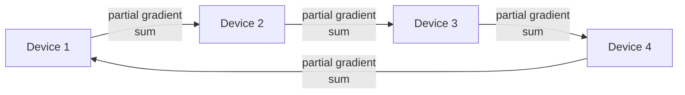
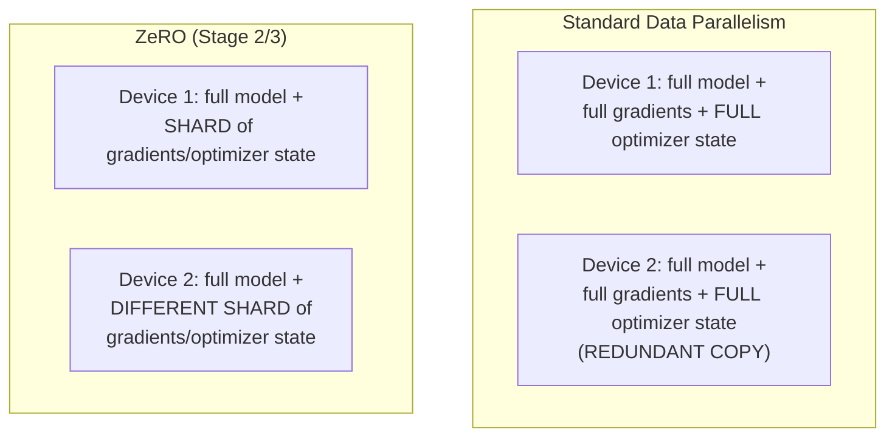
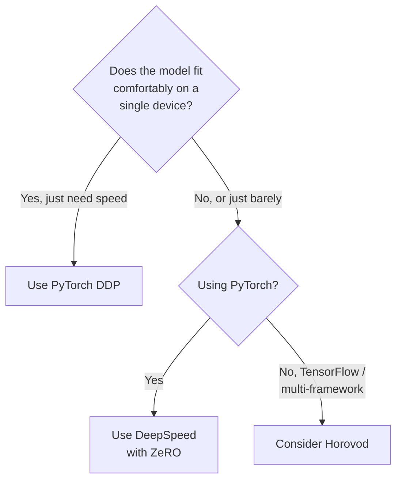

## Introduction

Chapter 17 covered the *concepts* of data and model parallelism. This chapter covers the actual *tools* that implement them in practice — PyTorch's native `DistributedDataParallel`, Horovod, and DeepSpeed — since a system design interview increasingly expects you to know not just the theory but which framework fits which situation, and why the ecosystem has evolved the way it has.

## PyTorch DistributedDataParallel (DDP)

Introduced in Chapter 17, DDP is PyTorch's **native, built-in** implementation of data parallelism. It uses a multi-process design (one process per GPU) and an efficient, decentralized all-reduce communication pattern (via NCCL, NVIDIA's collective communication library, on GPU clusters).

**Strengths**: tightly integrated into PyTorch with no additional dependency, well-documented, the default choice for most pure data-parallel workloads today.

**Limitations**: on its own, DDP only implements data parallelism — it doesn't natively provide model parallelism or the more advanced memory-optimization techniques needed for very large models, which is exactly the gap DeepSpeed fills.

## Horovod

Developed originally at Uber, **Horovod** is a framework-agnostic distributed training library (supporting PyTorch, TensorFlow, and others) built around an efficient **ring-all-reduce** algorithm for gradient synchronization.

**How ring-all-reduce works (conceptually)**: rather than every device communicating with every other device directly (which scales poorly), devices are arranged in a logical ring, and gradient data is passed incrementally around the ring, with each device aggregating a portion of the total gradient as it passes through — this achieves bandwidth-optimal gradient averaging that scales more gracefully to a large number of devices than naive all-to-all communication.



**Strengths**: framework-agnostic (a genuine advantage for organizations using multiple deep learning frameworks), historically was significantly ahead of native framework tooling in multi-node scaling efficiency at the time of its introduction.

**Current relevance**: since Horovod's introduction, PyTorch's native DDP has closed much of this original performance gap, incorporating similar efficient communication algorithms internally — so while Horovod remains a solid, mature choice (especially for TensorFlow users, or multi-framework organizations), many pure-PyTorch teams today default to native DDP rather than adding Horovod as an extra dependency, unless there's a specific cross-framework need.

## DeepSpeed

Developed by Microsoft, **DeepSpeed** is the framework most directly aimed at training *very large* models — going well beyond simple data parallelism to provide integrated memory optimization and model parallelism support.

### ZeRO (Zero Redundancy Optimizer)

DeepSpeed's signature innovation. Recall from Chapter 16 that a model's total training memory footprint includes parameters, gradients, *and* optimizer state (which can be the single largest component, especially for optimizers like Adam). In standard data parallelism, this full optimizer state is **redundantly duplicated** on every single device. ZeRO eliminates this redundancy by partitioning the optimizer state (and optionally gradients and parameters themselves) across data-parallel devices, with each device only holding and updating its own shard, communicating what's needed just-in-time.



ZeRO has three progressive stages, each partitioning more state (and therefore saving more memory, at the cost of more communication):
- **Stage 1**: partitions optimizer state only.
- **Stage 2**: partitions optimizer state and gradients.
- **Stage 3**: partitions optimizer state, gradients, *and* model parameters themselves — at this stage, ZeRO effectively achieves a memory-efficient form of model parallelism without requiring the manual model-splitting engineering that traditional tensor/pipeline parallelism demands.

**Strengths**: dramatically extends the size of model trainable on a given amount of hardware without manual model partitioning, integrates data parallelism, pipeline parallelism, tensor parallelism (often via integration with Megatron-LM), and mixed precision into one coordinated system — this is the framework of choice for training very large models (including most large language model pre-training pipelines) at organizations without the resources to build this orchestration from scratch.

**Limitations**: significantly more complex to configure and tune than plain DDP; the added communication from state partitioning (especially at ZeRO Stage 3) can introduce overhead that needs to be weighed against its memory savings, particularly on lower-bandwidth interconnects.

```python
# Illustrative DeepSpeed configuration enabling ZeRO Stage 2,
# combined with mixed-precision training — a common realistic
# starting configuration for training a large model.

# ds_config.json
ds_config = {
    "train_batch_size": 256,
    "gradient_accumulation_steps": 4,
    "fp16": {"enabled": True},
    "zero_optimization": {
        "stage": 2,
        "offload_optimizer": {"device": "cpu"},  # further memory savings,
                                                     # offloading optimizer
                                                     # state to CPU RAM
        "contiguous_gradients": True,
        "overlap_comm": True,
    },
}

# In the training script:
import deepspeed

model_engine, optimizer, train_loader, _ = deepspeed.initialize(
    model=model,
    model_parameters=model.parameters(),
    training_data=train_dataset,
    config=ds_config,
)

for batch in train_loader:
    inputs, labels = batch
    outputs = model_engine(inputs)
    loss = loss_fn(outputs, labels)
    model_engine.backward(loss)   # DeepSpeed handles ZeRO communication
    model_engine.step()
```

## Comparing the Frameworks

| Framework | Primary Strength | Best Fit |
|---|---|---|
| PyTorch DDP | Simple, native, mature data parallelism | Most models that fit on a single device, needing only speed via data parallelism |
| Horovod | Framework-agnostic, mature ring-all-reduce | Multi-framework organizations, or TensorFlow-based teams |
| DeepSpeed | ZeRO memory optimization + integrated hybrid parallelism | Very large models (LLM pre-training/fine-tuning) exceeding single-device memory |

## Choosing a Framework: A Practical Decision Path



## Framework Choice in the LLM Era

It's worth noting explicitly: the vast majority of AI System Design interviews and real production work today involve **fine-tuning or serving** pre-trained foundation models, not training them from scratch — meaning most engineers will interact with DeepSpeed (or the increasingly popular **Hugging Face Accelerate**, which provides a simplified abstraction layer over DDP/DeepSpeed/other backends) for fine-tuning workloads (Chapter 20, Chapter 49) rather than the full from-scratch pre-training scenarios where hybrid 3D parallelism is most heavily used. Knowing the concepts in this chapter remains valuable for system design reasoning even if you personally never configure a full 3D-parallel training run — it's the vocabulary that lets you reason clearly about why fine-tuning is dramatically cheaper and simpler than pre-training, a distinction central to Part 9 of this series.

## Key Takeaways

- PyTorch DDP is the native, mature default for straightforward data parallelism when a model already fits on a single device.
- Horovod offers framework-agnostic, ring-all-reduce-based data parallelism, most relevant today for multi-framework or TensorFlow-based teams, since PyTorch DDP has closed much of Horovod's original performance advantage for PyTorch users.
- DeepSpeed's ZeRO optimizer eliminates redundant optimizer state/gradient/parameter storage across data-parallel devices, dramatically extending trainable model size without manual model partitioning — making it the standard choice for very large model training.
- Most practitioners today interact with these frameworks primarily through fine-tuning workflows rather than from-scratch large-scale pre-training, but understanding the underlying concepts remains essential system design vocabulary.

---

## Interview Questions

**1. What's the key architectural difference between PyTorch's DistributedDataParallel and Horovod, given that both implement data parallelism?**
Both achieve efficient gradient synchronization across devices, but DDP is natively built into and tightly integrated with PyTorch specifically, using PyTorch's own multi-process design and NCCL-based communication, while Horovod is a separate, framework-agnostic library that layers its own ring-all-reduce implementation on top of whichever deep learning framework (PyTorch, TensorFlow, or others) it's integrated with — meaning Horovod's key advantage is being usable across multiple frameworks within the same organization, at the cost of adding an additional dependency layer compared to DDP's native integration for PyTorch-only teams.
*Follow-up: Given that PyTorch DDP has closed much of Horovod's original performance advantage, in what specific organizational scenario would Horovod still be a clearly better choice today?*
An organization that uses both PyTorch and TensorFlow across different teams or projects, and wants a single, consistent distributed training approach and tooling investment across both frameworks rather than maintaining separate framework-specific distributed training expertise and infrastructure for each — Horovod's framework-agnostic design directly addresses this specific organizational need in a way that PyTorch's native DDP (being PyTorch-specific by definition) cannot.

**2. Explain what problem DeepSpeed's ZeRO optimizer solves, and why standard data parallelism doesn't already solve it.**
Standard data parallelism requires every device to hold a complete, redundant copy of not just the model parameters, but also the full gradients and full optimizer state (which, for optimizers like Adam, can be 2-3x larger than the parameters themselves) — this redundancy means the total memory required per device doesn't decrease at all as you add more data-parallel devices, even though you now have more total aggregate memory across the cluster combined. ZeRO solves this by partitioning (sharding) the optimizer state, gradients, and optionally parameters across the data-parallel devices, so each device only stores its own shard rather than a full redundant copy, meaningfully reducing per-device memory requirements and allowing larger models to be trained within the same per-device memory budget.
*Follow-up: Why does ZeRO's approach specifically become more valuable as you increase the number of data-parallel devices, compared to training on fewer devices?*
Since ZeRO shards the optimizer state/gradients/parameters across all participating data-parallel devices, the more devices you have, the smaller each individual device's shard becomes (e.g., with ZeRO Stage 1 across 8 devices, each device holds only 1/8th of the total optimizer state) — meaning the memory-saving benefit of ZeRO scales favorably with more devices, in contrast to standard data parallelism where adding more devices provides no such memory relief per device at all, since each would still redundantly hold the complete, unsharded optimizer state regardless of how many total devices are involved.

**3. Describe the three progressive stages of ZeRO, and the trade-off involved in moving to a higher stage.**
Stage 1 partitions only the optimizer state across devices; Stage 2 additionally partitions the gradients; Stage 3 additionally partitions the model parameters themselves, at which point ZeRO effectively achieves a memory-efficient equivalent of model parallelism without manual model-splitting engineering. Each progressive stage saves more memory per device by partitioning more of the total training state, but also requires more communication between devices to reconstruct the full state needed at various points during the forward/backward pass — meaning higher ZeRO stages trade increased communication overhead for greater memory savings, and the right stage for a given workload depends on how tightly memory-constrained the workload is versus how much spare interconnect bandwidth is available to absorb the additional communication cost.
*Follow-up: How would you decide, for a specific training job, which ZeRO stage to start with?*
Start with the lowest stage (Stage 1) that's still sufficient to fit the model and desired batch size within available device memory, since it introduces the least additional communication overhead — only escalate to Stage 2 or Stage 3 if the lower stage's memory savings prove insufficient for your specific model size and hardware, since needlessly escalating to a higher, more communication-heavy stage than actually required by your memory constraints would sacrifice training speed for memory savings you don't actually need.

**4. Why might an organization choose to offload optimizer state to CPU RAM (as shown in the DeepSpeed configuration example), and what's the trade-off?**
Offloading optimizer state from GPU memory to the much larger (and cheaper) CPU RAM further extends the maximum trainable model size beyond what ZeRO's GPU-only partitioning alone would allow, since CPU RAM capacity on a typical training server significantly exceeds GPU VRAM capacity — this can be the difference between a model fitting at all versus not fitting on the available hardware. The trade-off is that CPU RAM has much lower bandwidth and higher latency for the GPU to access compared to GPU memory itself, meaning offloading introduces additional data transfer overhead between CPU and GPU during training, which can meaningfully slow down each training step compared to keeping everything in faster GPU memory.
*Follow-up: In what scenario would this CPU offloading trade-off clearly be worth accepting, despite the added latency?*
When the alternative is simply being unable to train the model at all on the available GPU hardware (i.e., the model genuinely doesn't fit even with ZeRO Stage 3's GPU-based partitioning across all available devices) — in this scenario, a slower but successful training run using CPU offloading is clearly preferable to no successful training run at all, making the trade-off worthwhile specifically when it's the difference between feasibility and infeasibility, rather than being used routinely when the model would otherwise comfortably fit in GPU memory without it.

**5. Why is it argued that most ML engineers today interact with these distributed training frameworks primarily through fine-tuning rather than from-scratch pre-training?**
Training a large foundation model completely from scratch requires an enormous dataset, enormous compute budget, and the full sophistication of hybrid 3D parallelism (data, tensor, and pipeline parallelism combined) that only a small number of organizations with very large resources typically undertake; the vast majority of practical, production ML work instead starts from an existing pre-trained model and adapts it to a specific task or domain via fine-tuning (covered in Chapter 20), which requires meaningfully less data, compute, and often only a simpler subset of the full distributed training toolkit (e.g., data parallelism alone, or a lighter-weight parameter-efficient fine-tuning technique from Chapter 45), even though the same underlying frameworks (DeepSpeed, DDP) are often still used for this lighter-weight fine-tuning workload.
*Follow-up: Does this mean understanding hybrid 3D parallelism and ZeRO Stage 3 is not valuable for most ML engineers, if they'll mostly be fine-tuning rather than pre-training?*
It's still valuable as foundational system design knowledge — even if you personally never configure a full pre-training run, understanding these concepts helps you reason clearly about why fine-tuning is so much cheaper and more accessible than pre-training (directly informing decisions in Part 9 about when fine-tuning versus using a fully pre-trained model as-is makes sense), and provides the vocabulary and mental model needed to have an informed conversation with specialized infrastructure teams or to scale up your own fine-tuning workload if a larger model or dataset eventually requires some of these more advanced techniques.

**6. How would you explain "ring-all-reduce" to someone unfamiliar with it, and why is it more scalable than a naive approach where every device sends its gradients directly to every other device?**
In ring-all-reduce, devices are logically arranged in a ring, and each device only ever communicates with its immediate neighbors in that ring, passing along and progressively aggregating a portion of the total gradient data as it circulates around the ring, until every device ends up with the complete, correctly-averaged gradient; a naive all-to-all approach, where every device sends its full gradient directly to every other device, requires a number of point-to-point communications that grows quadratically with the number of devices, quickly overwhelming available network bandwidth as more devices are added, whereas ring-all-reduce's neighbor-only communication pattern keeps the total communication volume per device roughly constant regardless of how many total devices participate, making it dramatically more scalable to large numbers of devices.
*Follow-up: Why does keeping communication volume "roughly constant per device" as more devices are added matter specifically for the large-scale training clusters discussed in this chapter?*
Large-scale training clusters can involve hundreds or even thousands of devices, and if per-device communication volume grew significantly (as it would with a naive all-to-all approach) as more devices were added, communication overhead would very quickly dominate and overwhelm any computational benefit gained from adding those additional devices — ring-all-reduce's near-constant per-device communication cost is precisely what allows data parallelism to scale to these very large device counts while still achieving meaningful (even if sub-linear, as discussed in Chapter 17) speedup from the additional compute capacity.

**7. What's the relationship between Hugging Face Accelerate and the frameworks discussed in this chapter (DDP, DeepSpeed)?**
Hugging Face Accelerate is a higher-level abstraction library that sits on top of these underlying frameworks, providing a simplified, unified interface that lets an engineer write largely framework-agnostic training code and then choose (often via a simple configuration flag) whether to actually run that training using plain PyTorch, DDP, DeepSpeed, or other backends, without needing to rewrite significant portions of the training loop for each different underlying framework — it doesn't replace or compete with DDP/DeepSpeed's actual distributed training mechanics, but rather makes it significantly easier and less error-prone to adopt and switch between them.
*Follow-up: Why might a team prioritize learning a tool like Accelerate before diving deep into DeepSpeed's own native configuration API?*
For many common fine-tuning and moderate-scale training workflows, Accelerate's simplified interface provides sufficient control and can automatically apply reasonable, sensible defaults for the underlying distributed training mechanics, letting a team get productive with distributed training quickly without first needing to master DeepSpeed's more extensive and detailed native configuration options — diving into DeepSpeed's full native API becomes more valuable specifically once a team's needs grow beyond what Accelerate's simplified abstraction comfortably supports (e.g., needing very fine-grained control over specific ZeRO stage configuration details), which for many teams' fine-tuning-focused workloads may never actually be necessary.

**8. If an interviewer asks you to justify why you'd use DeepSpeed instead of plain PyTorch DDP for a specific proposed system, what would your justification need to include?**
I'd need to establish that the proposed model's size (in terms of parameters, gradients, and optimizer state) genuinely exceeds what would comfortably fit using plain data parallelism's fully-redundant per-device memory requirement on the available hardware — without this specific memory justification, recommending DeepSpeed over the simpler, more mature, and less operationally complex plain DDP wouldn't be well-justified, echoing the general principle from this Part that additional distributed training complexity should be adopted only in response to a genuine, demonstrated constraint (in this case, specifically a memory constraint that ZeRO's partitioning is designed to relieve) rather than by default.
*Follow-up: What would you say if the interviewer pushed back and said "just use DeepSpeed for everything, since it can also do plain data parallelism if needed"?*
I'd acknowledge that DeepSpeed can technically handle simple data-parallel workloads too, but point out that it introduces additional configuration complexity, an extra dependency, and operational surface area that provides no benefit for a workload that doesn't actually need ZeRO's memory optimization or advanced hybrid parallelism features — for a model that comfortably fits using plain data parallelism, the added complexity of DeepSpeed would be pure overhead without corresponding benefit, so I'd still recommend the simpler, well-understood plain DDP setup for that specific case, reserving DeepSpeed for scenarios where its specific capabilities are actually needed.

**9. How would you decide whether a training job's slowdown is due to genuine compute limitations versus overhead introduced by a distributed training framework's communication pattern (e.g., ZeRO's partitioning communication)?**
Profile the training run to measure the proportion of time spent in actual forward/backward computation versus time spent in communication operations (gradient/state synchronization) — most distributed training frameworks and monitoring tools provide this breakdown; if communication time represents a disproportionately large and growing share of total step time, especially after switching to a more communication-heavy configuration like a higher ZeRO stage, that's a strong signal that communication overhead (rather than genuine compute limitation) is the actual bottleneck, potentially suggesting the chosen level of state partitioning is more aggressive than the available interconnect bandwidth can efficiently support.
*Follow-up: What would you consider adjusting first if this profiling revealed communication overhead as the dominant bottleneck?*
I'd first consider stepping down to a lower ZeRO stage (e.g., from Stage 3 back to Stage 2, or Stage 2 back to Stage 1) if the current stage's memory savings aren't strictly necessary for the model to fit, since this directly reduces the communication burden at the cost of somewhat higher per-device memory usage — only if the higher stage's memory savings are genuinely required would I instead look at improving the underlying interconnect infrastructure (e.g., ensuring devices are using the fastest available network configuration) or enabling communication-computation overlap optimizations (like the `overlap_comm` setting shown in the earlier DeepSpeed configuration example) as an alternative way to mitigate the overhead without sacrificing needed memory savings.

**10. Why is it important, when discussing distributed training frameworks in an interview, to distinguish between what problem each framework was originally designed to solve, rather than treating them as interchangeable options?**
Each framework emerged to address a specific, distinct gap at the time of its creation — Horovod addressed the lack of efficient, framework-agnostic multi-node data parallelism in early deep learning framework ecosystems; DeepSpeed addressed the memory redundancy problem in standard data parallelism that became a critical blocker specifically for training increasingly large models — understanding this history and specific motivation helps you reason correctly about when each framework's specific strengths are actually relevant to a given problem, rather than defaulting to whichever framework happens to be most popular or most recently discussed without considering whether its specific design motivation actually matches your system's actual constraints.
*Follow-up: How would this historical, motivation-focused understanding help you evaluate a new distributed training framework that might emerge in the future, one you've never heard of before?*
Rather than evaluating a new framework purely based on marketing claims or benchmark numbers in isolation, you'd know to ask what specific problem or gap in existing tooling (data parallelism efficiency, memory constraints for large models, ease of use, cross-framework compatibility, or something else entirely) the new framework claims to solve, and then assess whether your own system's actual constraints genuinely match that specific problem — this kind of first-principles, motivation-driven evaluation approach generalizes well to evaluating any new tool or framework, not just the three specifically covered in this chapter.

**11. What's a risk of a team adopting DeepSpeed's most advanced configuration (ZeRO Stage 3 with CPU offloading) as their default setup for all training jobs, regardless of model size?**
For smaller models that would fit comfortably using simple data parallelism or even a lower ZeRO stage, using the most aggressive configuration (Stage 3 with CPU offloading) introduces unnecessary communication and CPU-GPU data transfer overhead that would measurably slow down training compared to a simpler, better-matched configuration — this is a form of premature or excessive optimization that trades away training speed for memory savings the smaller model doesn't actually need, directly echoing the broader system design principle (introduced in Chapter 5 and reinforced throughout this Part) of matching the complexity of your solution to the actual, demonstrated constraint rather than defaulting to the most sophisticated available option.
*Follow-up: How would you structure a team's training infrastructure and workflow to avoid this kind of default-to-maximum-complexity mistake?*
Establish a practice of profiling and right-sizing the distributed training configuration for each specific model/workload (similar to the hardware right-sizing discussion in Chapter 16) — starting from the simplest configuration that fits the model's memory requirements and empirically escalating only as far as genuinely needed, rather than copying the most advanced configuration used for the team's largest project as a default template for every new, potentially much smaller project, ensuring the configuration complexity actually matches each specific workload's real constraints.

**12. How would you compare the operational/engineering complexity of adopting DDP versus DeepSpeed, and what does this suggest about team skill investment?**
DDP requires relatively modest additional code changes to a standard PyTorch training script (primarily setting up the distributed process group and wrapping the model), with well-documented, widely-understood patterns and a smaller number of configuration decisions to get right; DeepSpeed requires more extensive configuration (choosing ZeRO stages, deciding on offloading strategies, tuning communication overlap settings) and a deeper understanding of the underlying memory and communication trade-offs to configure effectively and diagnose issues when they arise, representing a meaningfully steeper learning curve and higher ongoing operational complexity. This suggests that a team should generally invest in DDP proficiency as a baseline skill for any team doing GPU-based training at all, while DeepSpeed proficiency is a more specialized investment justified specifically by projects genuinely requiring training models at a scale that exceeds what DDP alone can handle.
*Follow-up: How would you advise a team that anticipates needing DeepSpeed's capabilities in the near future, but isn't there yet, to prepare?*
I'd advise starting with well-structured, DDP-based training code following good practices (clean separation of model, data loading, and training loop logic), since many training frameworks and abstraction libraries (like Hugging Face Accelerate, discussed earlier) are specifically designed to allow a relatively smooth transition from DDP to DeepSpeed later with comparatively modest code changes once cleanly structured — investing early in this clean structure, and perhaps running small-scale experiments with DeepSpeed on a toy problem to build team familiarity ahead of actual need, positions the team to make a smoother transition when the genuine scale requirement arrives, rather than needing to learn DeepSpeed from scratch under the time pressure of an already-pressing scale requirement.

**13. Why might partitioning gradients and optimizer state (ZeRO Stages 1-2) introduce meaningfully less communication overhead than partitioning the model parameters themselves (ZeRO Stage 3)?**
Optimizer state and gradients are primarily needed and used locally on each device during the parameter update step at the end of each training step, so partitioning them requires communication mainly at that specific point in the training loop; model parameters, by contrast, are needed throughout the entire forward and backward pass computation itself (every layer needs its own parameters to compute its output) — partitioning parameters (Stage 3) therefore requires additional communication to reconstruct the needed parameter values on-demand throughout the forward/backward computation, not just at the update step, resulting in more frequent, more finely-interleaved communication with the actual computation compared to the more contained, end-of-step communication pattern of Stages 1-2.
*Follow-up: Given this, why might a team specifically prefer Stage 2 over Stage 3 even if Stage 3 would provide additional memory savings they don't strictly need?*
If a team's model already fits comfortably within Stage 2's memory savings, escalating to Stage 3 would introduce this additional, more finely-interleaved communication overhead throughout the forward/backward pass without providing any memory benefit that's actually needed — since Stage 3's added complexity and communication cost only pays for itself when its additional memory savings are genuinely required to fit an otherwise-too-large model, a team should prefer stopping at the lowest ZeRO stage sufficient for their actual memory constraints, consistent with the broader right-sizing principle discussed throughout this chapter.

**14. How would you handle a hypothetical interview question asking you to design the training infrastructure for fine-tuning a 70-billion-parameter open-source LLM on a company's proprietary data, given a fixed budget of 8 GPUs?**
I'd start by estimating whether a 70-billion-parameter model's full parameters, gradients, and optimizer state could plausibly fit across 8 GPUs even with full ZeRO Stage 3 partitioning (a rough calculation based on typical per-parameter memory requirements), and given that this is likely to be tight or insufficient with full fine-tuning, I'd propose considering a parameter-efficient fine-tuning technique (like LoRA, previewed in this Part and covered fully in Chapter 45) combined with DeepSpeed ZeRO to fit within the given hardware budget, rather than assuming full fine-tuning of all 70 billion parameters is necessarily the right or even feasible approach given the stated constraint — explicitly connecting the hardware constraint to a fine-tuning strategy decision rather than treating them as unrelated aspects of the problem.
*Follow-up: Why does this answer deliberately connect a training infrastructure question (Part 4's topic) to a fine-tuning strategy question (Part 9's topic), rather than answering purely within this chapter's scope?*
Because in a real system design scenario, hardware constraints and modeling/fine-tuning strategy decisions are deeply interdependent — proposing a training infrastructure plan without considering whether the fine-tuning approach itself needs to adapt to fit the given hardware budget would be an incomplete, siloed answer; demonstrating the ability to connect concepts across different parts of the overall system design (infrastructure constraints informing modeling strategy choices, and vice versa) is exactly the kind of holistic, practical reasoning that distinguishes a strong senior-level system design answer from one that mechanically applies isolated concepts without recognizing their real-world interdependencies.

**15. What would you tell a junior engineer who wants to learn distributed training but is unsure where to start, given the depth and complexity covered in Chapters 16-18?**
I'd recommend starting with a solid, hands-on understanding of plain PyTorch DDP on a small, genuinely multi-GPU (even just 2 GPUs) setup first, to build real intuition for the core data-parallelism mechanics (gradient synchronization, distributed samplers) before introducing any additional framework complexity; only after that foundational comfort is established would I suggest exploring DeepSpeed's ZeRO stages on a deliberately memory-constrained toy model (e.g., artificially limiting available GPU memory to force the memory-saving benefits of ZeRO to become concretely, tangibly apparent) — building conceptual understanding through direct, hands-on experience with genuinely binding constraints, rather than only reading about these concepts abstractly, tends to produce much more durable, transferable understanding of when and why each tool's specific capabilities actually matter.
*Follow-up: Why is deliberately working with a memory-constrained toy scenario a more effective learning approach than immediately trying to replicate a large-scale, realistic production training setup?*
A large-scale production setup often requires significant cloud budget and infrastructure access that may not be readily available for exploratory learning, and its scale can also obscure the core underlying concepts behind a large amount of incidental operational complexity (cluster provisioning, job scheduling, extensive monitoring) that isn't actually essential to understanding the fundamental memory/communication trade-offs being taught — a deliberately small, artificially memory-constrained toy scenario isolates and makes tangible the specific concept being learned (e.g., "without ZeRO, this model doesn't fit; with ZeRO Stage 2, it does") at a fraction of the cost and complexity, making the underlying lesson clearer and more directly experienced rather than lost within a mass of unrelated production infrastructure details.
