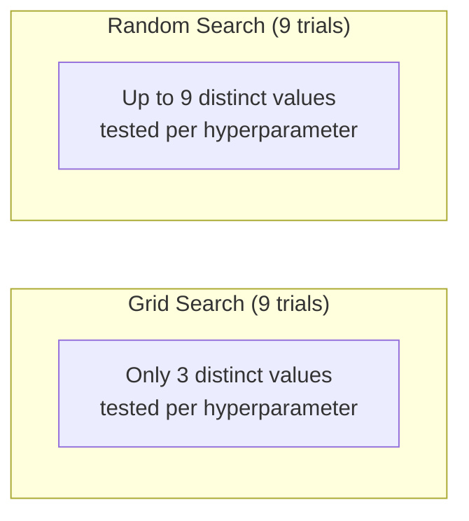
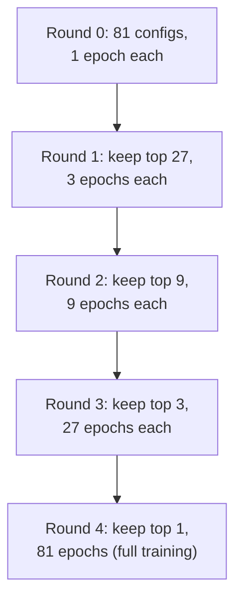

## Introduction

A model's final performance depends not just on its architecture and data, but on a set of configuration values chosen *before* training begins — learning rate, batch size, regularization strength, number of layers, and dozens of other **hyperparameters**. Unlike model parameters (which are learned via gradient descent during training), hyperparameters must be searched for, and doing this search efficiently at scale is a genuine system design problem, not just a modeling detail — it directly consumes the expensive training infrastructure from Chapters 16-18, often many times over.

## Why Hyperparameter Tuning Is a System Design Concern

A naive hyperparameter search multiplies your training cost by the number of configurations tried — if a single training run costs $500 in compute and takes 6 hours, a naive grid search over 100 configurations costs $50,000 and 25 days of wall-clock time (or requires 100x the parallel infrastructure to run concurrently). This directly connects hyperparameter tuning to Chapter 16's cost-consciousness theme: an efficient search *strategy* can be the difference between a tuning budget that fits a startup's resources and one that doesn't.

## Search Strategies

### Grid Search

Exhaustively evaluates every combination of a predefined set of values for each hyperparameter (e.g., learning rate ∈ {0.001, 0.01, 0.1} × batch size ∈ {32, 64, 128} = 9 combinations).

**Strengths**: simple, exhaustive within the defined grid, easy to parallelize (each combination is independent).

**Weaknesses**: the number of combinations grows exponentially with the number of hyperparameters (the "curse of dimensionality" applied to search, echoing Chapter 12) — searching 5 hyperparameters with 5 values each requires 3,125 runs. It also wastes compute on unpromising regions of the search space uniformly, with no ability to focus effort where it matters most.

### Random Search

Instead of an exhaustive grid, randomly samples hyperparameter combinations from defined distributions/ranges, for a fixed budget of total trials.

**Strengths**: research (notably Bergstra & Bengio, 2012) has shown random search often outperforms grid search for the same compute budget, because most hyperparameters don't matter equally — random search explores more distinct values of the *important* hyperparameters within a fixed trial budget, while grid search wastes many trials varying unimportant hyperparameters across a fixed grid.



### Bayesian Optimization

Builds a probabilistic model (a "surrogate model," often a Gaussian Process) of how hyperparameter values map to performance, based on trials completed so far, and uses this model to intelligently choose the *next* most promising combination to try — balancing **exploitation** (trying values near known good results) and **exploration** (trying under-explored regions that might hide a better result).

**Strengths**: significantly more sample-efficient than grid or random search — often finds a comparably good configuration in a fraction of the trials, which directly translates to real compute cost savings.

**Weaknesses**: inherently sequential (each new trial depends on the results of previous ones), which limits parallelization compared to grid/random search's fully independent trials; the surrogate model itself has overhead and can struggle in very high-dimensional hyperparameter spaces.

```python
# A minimal illustration using Optuna, a popular hyperparameter
# optimization library implementing Bayesian-optimization-style
# search (via Tree-structured Parzen Estimators) with built-in
# support for pruning (early stopping unpromising trials).

import optuna

def objective(trial: optuna.Trial) -> float:
    learning_rate = trial.suggest_float("learning_rate", 1e-5, 1e-1, log=True)
    batch_size = trial.suggest_categorical("batch_size", [16, 32, 64, 128])
    num_layers = trial.suggest_int("num_layers", 2, 8)
    dropout = trial.suggest_float("dropout", 0.0, 0.5)

    model = build_model(num_layers=num_layers, dropout=dropout)
    val_accuracy = train_and_evaluate(
        model, learning_rate=learning_rate, batch_size=batch_size,
        trial=trial,  # allows Optuna to prune this trial early if it's underperforming
    )
    return val_accuracy

study = optuna.create_study(direction="maximize", pruner=optuna.pruners.MedianPruner())
study.optimize(objective, n_trials=100, n_jobs=4)  # 4 trials run in parallel

print(f"Best hyperparameters: {study.best_params}")
print(f"Best validation accuracy: {study.best_value}")
```

### Early-Stopping-Based Methods: Hyperband and ASHA

A distinct and highly practical idea: rather than deciding upfront which few configurations to fully train, start training *many* configurations simultaneously with a small compute budget each, and progressively **eliminate the worst performers early**, reallocating the freed-up compute to let the remaining, more promising configurations continue training with a larger budget.



**Hyperband** formalizes this successive-halving idea, systematically varying how aggressively to eliminate configurations early versus give them more of a chance. **ASHA (Asynchronous Successive Halving Algorithm)** extends this to run asynchronously across a distributed cluster, avoiding the need for all configurations in a "round" to finish before advancing the next round — critical for efficiently using a cluster where trials naturally complete at different times.

**Strengths**: dramatically more compute-efficient than fully training every candidate configuration, since most of the eliminated configurations are cut off after only a small fraction of full training cost — this is often the most practical, highest-value technique for large-scale hyperparameter search in production.

**Weaknesses**: relies on the assumption that a configuration's *early* performance (after a small compute budget) is a reasonably reliable predictor of its *eventual* performance (after full training) — this assumption can fail for hyperparameters whose benefit only manifests later in training (e.g., certain learning rate schedules), risking prematurely eliminating a configuration that would have eventually performed well.

## Choosing a Strategy: A Practical Guide

| Strategy | Best Fit |
|---|---|
| Grid Search | Very few hyperparameters (1-2), small, well-understood ranges |
| Random Search | Simple, reasonably parallelizable baseline; a solid default when unsure |
| Bayesian Optimization | Expensive individual trials, limited total trial budget, want maximum sample efficiency |
| Hyperband / ASHA | Large search spaces, ability to run many trials with early-stopping capability, distributed cluster available |

In practice, modern hyperparameter tuning platforms (Optuna, Ray Tune, Google Vertex AI Vizier) often **combine** these ideas — e.g., using Bayesian optimization to select promising configurations to try, combined with ASHA-style early stopping to cut off clearly underperforming trials quickly, getting the sample efficiency of Bayesian methods with the compute efficiency of early stopping.

## Hyperparameter Tuning and Experiment Tracking

Hyperparameter search generates a large volume of trials, each with its own configuration and results — making rigorous **experiment tracking** (covered fully in Chapter 26) not optional but essential infrastructure for hyperparameter tuning at scale. Without it, a large sweep of hundreds of trials becomes an unmanageable, unreproducible mess; with it, every trial's configuration, metrics, and artifacts are logged systematically, letting you confidently identify and reproduce the actual best-performing configuration.

## When to Stop Tuning

Hyperparameter tuning has diminishing returns, and knowing when to stop is itself a system design judgment call: track the best-observed validation metric across trials as tuning progresses, and stop once additional trials are producing negligible further improvement relative to their compute cost — a decision that should be made deliberately, informed by the actual cost-benefit trade-off (echoing Chapter 6's framing), rather than either stopping arbitrarily early or continuing to tune indefinitely without a clear stopping criterion.

## Key Takeaways

- Hyperparameter tuning multiplies training cost by the number of trials, making search *strategy* — not just search *space* — a genuine cost and system design concern.
- Random search generally outperforms grid search for the same budget, because it explores more distinct values of the hyperparameters that actually matter.
- Bayesian optimization is highly sample-efficient but inherently sequential, limiting parallelization; early-stopping methods (Hyperband/ASHA) are often the most practically compute-efficient approach at scale, especially combined with a distributed cluster.
- Rigorous experiment tracking is essential infrastructure for making sense of and reproducing results from any large-scale hyperparameter search.

---

## Interview Questions

**1. Why does hyperparameter tuning represent a genuine system design and cost concern, rather than being purely a modeling detail?**
Each hyperparameter trial requires a full (or partial) training run, meaning a naive search strategy directly multiplies the compute cost and wall-clock time of training by the number of trials attempted — for expensive-to-train models, an inefficient search strategy over many trials can easily cost tens of thousands of dollars in compute and weeks of time, directly consuming the same expensive GPU/TPU infrastructure discussed in Chapter 16, making the choice of search strategy itself a consequential engineering and budget decision, not just an implementation detail left to a data scientist's preference.
*Follow-up: How would you communicate this cost implication to a stakeholder who wants "the best possible model" without considering the tuning budget?*
I'd frame the trade-off explicitly in terms of diminishing returns versus cost — showing (ideally with a plot of best-observed validation metric versus cumulative trials/compute spent) that hyperparameter improvements typically show rapidly diminishing returns after an initial number of trials, and that pursuing marginal further improvement via exhaustive tuning carries a real, quantifiable compute cost that should be weighed against the actual expected business value of that marginal improvement, rather than treating "the best possible model" as a goal to pursue without any cost consideration at all.

**2. Why does random search often outperform grid search for the same total number of trials, despite grid search seeming more systematic?**
Not all hyperparameters have equal impact on model performance — often only a small subset genuinely matter significantly. Grid search, by exhaustively testing every combination of a fixed grid, ends up testing very few distinct values for each individual hyperparameter (e.g., only 3 distinct learning rate values in a 3x3 grid), including for the hyperparameters that matter most; random search, by independently sampling each hyperparameter's value for every trial, ends up testing many more distinct values for every hyperparameter within the same total trial budget, giving it a much better chance of stumbling onto a good value for whichever hyperparameters actually matter most, even if you don't know in advance which ones those are.
*Follow-up: Does this mean grid search should never be used? Under what specific circumstance would grid search still be a reasonable choice?*
Grid search remains reasonable when there are very few hyperparameters to tune (one or two) with a small, well-understood range of plausible values — in this low-dimensional case, grid search's exhaustive coverage doesn't suffer from the same combinatorial explosion or value-diversity disadvantage relative to random search, and its simplicity and interpretability (you get a complete, easily visualized picture of how performance varies across the entire defined grid) can be a genuine practical advantage when the search space is small enough to make this exhaustive coverage affordable.

**3. Explain the core idea behind Bayesian optimization for hyperparameter tuning, and why it's more sample-efficient than random search.**
Bayesian optimization builds a probabilistic surrogate model of the relationship between hyperparameter values and resulting performance, based on the results of trials completed so far, and uses this model to intelligently select the next hyperparameter combination to try — balancing exploiting regions that have shown good results so far against exploring regions that remain uncertain and might hide an even better result. This is more sample-efficient than random search because each new trial is informed by everything learned from previous trials, actively steering the search toward promising regions of the hyperparameter space, rather than random search's uninformed, independent sampling that gives no special preference to areas that previous trials have already suggested might be promising.
*Follow-up: What's the key limitation of Bayesian optimization that prevents it from being universally preferred over random search or Hyperband-style approaches?*
Because each new trial's choice depends on the results of previous trials, Bayesian optimization is inherently more sequential and harder to fully parallelize compared to random search or grid search (where every trial can be launched completely independently and simultaneously) — in a scenario with abundant parallel compute available and a need to complete tuning quickly in wall-clock time, this sequential dependency can make Bayesian optimization's superior sample efficiency less valuable in practice than a more parallelizable, if less sample-efficient, alternative approach.

**4. What is the core idea behind Hyperband/ASHA, and why is it often described as one of the most practically compute-efficient hyperparameter search strategies?**
Rather than committing full training budget to every candidate configuration upfront, Hyperband/ASHA starts many configurations training simultaneously with only a small initial compute budget each, then progressively eliminates the worst-performing configurations early (based on their partial, early performance), reallocating the freed compute to let the remaining, more promising configurations continue training further — this means the vast majority of clearly unpromising configurations are cut off after only a small fraction of the full training cost, rather than being fully trained to completion just to confirm they're not competitive, dramatically reducing total wasted compute compared to strategies that fully train every candidate configuration.
*Follow-up: What key assumption does this early-elimination strategy rely on, and what's the risk if that assumption doesn't hold for a specific model or hyperparameter?*
It relies on the assumption that a configuration's relative performance early in training (after a small compute/epoch budget) is a reasonably reliable predictor of its relative performance after full training — if this assumption doesn't hold (e.g., for a hyperparameter like a learning rate schedule whose benefit only becomes apparent much later in training, or a regularization technique that trades short-term performance for better long-term generalization), Hyperband/ASHA risks prematurely eliminating a configuration that would have eventually outperformed the configurations that were kept, silently biasing the search away from strategies with this kind of "slow starter" characteristic.

**5. How would you decide, for a specific project, whether Bayesian optimization or Hyperband/ASHA is the more appropriate hyperparameter search strategy?**
Consider the relative cost of individual trials and the available parallelism: if individual training runs are very expensive and you have a limited total trial budget with modest parallel infrastructure, Bayesian optimization's superior sample efficiency (getting more improvement per trial, even if trials must run somewhat sequentially) is likely more valuable; if you have access to a large, highly parallel distributed cluster and individual configurations can be meaningfully evaluated with a partial/reduced training budget (i.e., early performance is a reasonably reliable signal for your specific model type), Hyperband/ASHA's ability to run many trials in parallel while aggressively cutting off unpromising ones early is likely to deliver a better result faster in wall-clock time, even if it uses more total trials than a pure Bayesian approach might need.
*Follow-up: Is it possible to combine both approaches, and if so, what would that combination look like?*
Yes — many modern hyperparameter tuning platforms combine Bayesian-optimization-style intelligent trial selection (deciding which hyperparameter combinations are most promising to try next) with Hyperband/ASHA-style early stopping (cutting off any individual trial early if its partial performance suggests it's unlikely to be competitive) — this combination gets the sample efficiency benefit of Bayesian methods in choosing what to try, plus the compute efficiency benefit of early stopping in not wasting full training budget on trials that turn out to be unpromising, representing the practical state of the art used by tools like Optuna and Ray Tune today.

**6. Why is rigorous experiment tracking described as "essential infrastructure," not merely a nice-to-have, for hyperparameter tuning at scale?**
A large-scale hyperparameter search can generate hundreds or thousands of individual trials, each with its own specific configuration, resulting metrics, and potentially model artifacts — without systematic tracking, it becomes practically impossible to reliably identify which specific configuration actually produced the best result, to reproduce that winning configuration's exact setup later, or to analyze patterns across trials (e.g., which hyperparameters seem to matter most) to inform future tuning efforts; this isn't a convenience feature but a basic prerequisite for the entire hyperparameter tuning exercise to produce a trustworthy, reproducible, and actionable result at all.
*Follow-up: What specific information would you want captured for every single trial in a hyperparameter search, at minimum?*
At minimum: the complete hyperparameter configuration used for that trial, the resulting validation metric(s) (and ideally the metric's trajectory over training, not just the final value, to support early-stopping-based analysis), the training duration/compute cost consumed, and enough information about the code/data version used to allow the specific trial to be exactly reproduced later if needed — omitting any of these makes it harder to fully trust, reproduce, or learn from the tuning results after the fact.

**7. How would you approach hyperparameter tuning differently for an extremely expensive-to-train model (e.g., a multi-day training run) compared to a cheap, fast-to-train model (e.g., a model that trains in minutes)?**
For an extremely expensive model, I'd strongly favor a highly sample-efficient search strategy (Bayesian optimization) combined with aggressive early-stopping (ASHA-style), and likely start with a smaller, cheaper proxy version of the problem (e.g., a scaled-down version of the model or a subsample of the full training dataset) to do initial, cheaper hyperparameter exploration before committing full-scale compute to only the most promising few configurations identified from that cheaper proxy search. For a cheap, fast-to-train model, the cost of running many trials is low enough that a simpler, more exhaustive strategy (even a reasonably fine-grained grid search or a large random search with generous trial budget) becomes practical and doesn't require the same careful cost-consciousness, since the total cost of over-searching is comparatively low.
*Follow-up: What's a risk of using a cheaper, scaled-down proxy problem to guide hyperparameter search for a much larger, more expensive full-scale model?*
The optimal hyperparameters for a scaled-down proxy problem (smaller model, smaller dataset) don't always transfer perfectly to the full-scale problem — certain hyperparameters (like learning rate or regularization strength) can have a genuinely different optimal value at a different model or dataset scale, a phenomenon sometimes related to the broader research area of scaling laws (previewed in Part 8) — so while using a cheaper proxy for initial exploration is a reasonable, pragmatic cost-saving strategy, it's important to validate the proxy-derived best configuration with at least a few confirmation trials at the true full scale before fully committing to it, rather than assuming perfect transferability without verification.

**8. Why might a candidate's proposal to "just grid search over all hyperparameters simultaneously" be a red flag in a system design interview for a large-scale ML training system?**
It suggests the candidate hasn't considered the combinatorial cost explosion that grid search suffers from as the number of hyperparameters grows (a handful of hyperparameters with even a modest number of values each can produce thousands of combinations), nor considered the research-supported fact that random search or more sophisticated methods generally achieve comparable or better results at a fraction of the cost for the same trial budget — proposing exhaustive grid search over many hyperparameters for a large-scale, expensive-to-train model signals a lack of awareness of the real cost implications of hyperparameter tuning strategy choice, which is exactly the kind of practical, cost-conscious system design judgment this Part of the series (and this chapter specifically) emphasizes.
*Follow-up: How would you guide a candidate (or a junior engineer on your team) toward a better answer if they proposed this?*
I'd ask them to estimate the total number of trials their proposed grid search would require given a realistic number of hyperparameters and values per hyperparameter, and then ask them to multiply that by the cost/time of a single training run — making the cost implication concrete and tangible often naturally leads the person to recognize the problem themselves and reconsider in favor of a more efficient strategy (random search, Bayesian optimization, or Hyperband/ASHA), which is a more effective teaching approach than simply stating that grid search is a mistake without letting them work through the concrete cost reasoning themselves.

**9. How does hyperparameter tuning interact with the distributed training concepts from Chapters 17-18 — are they the same kind of parallelism, or something different?**
They're a different, complementary kind of parallelism: Chapters 17-18 covered parallelizing a *single* training run across multiple devices (splitting either the data or the model itself to train one model faster or fit a larger model); hyperparameter tuning parallelism instead runs *multiple, independent* training runs (each potentially using its own single device, or even its own multi-device distributed setup from Chapters 17-18) simultaneously, each with a different hyperparameter configuration — these two forms of parallelism can be combined (e.g., running many hyperparameter trials in parallel, where each individual trial itself uses data parallelism across a few GPUs), but they solve fundamentally different problems (training one model faster/bigger, versus searching efficiently across many different model configurations).
*Follow-up: How would you allocate a fixed pool of, say, 32 GPUs between these two forms of parallelism for a hyperparameter tuning task?*
The right allocation depends on the specific trade-off between the number of concurrent hyperparameter trials versus the speed of each individual trial — for example, you might allocate 8 GPUs per trial (using data parallelism to speed up each individual trial) and run 4 trials concurrently, or run 32 fully independent single-GPU trials simultaneously for lower per-trial speed but broader simultaneous hyperparameter exploration; the right balance depends on factors like whether the search strategy (e.g., ASHA) benefits more from a higher number of concurrent trials to compare against each other early, versus whether faster individual trials (enabling more sequential rounds of Bayesian-optimization-style informed search) would be more valuable for the specific search strategy being used.

**10. Why is it important to distinguish between hyperparameters and model parameters when discussing tuning, and how would you explain this distinction to someone new to ML?**
Model parameters (like the weights in a neural network) are learned automatically during training through gradient descent, based on the training data itself, and are the actual output/product of a single training run; hyperparameters (like learning rate, batch size, number of layers, or regularization strength) are configuration choices set *before* training begins that control *how* that learning process happens, and cannot themselves be learned via the same gradient descent process used for model parameters — they require a separate search process (the subject of this chapter) precisely because gradient descent has no direct way to optimize them the way it optimizes the model's actual learnable weights.
*Follow-up: Are there any exceptions to this clean distinction — hyperparameters that can, in some more advanced setups, actually be learned during training rather than fixed beforehand?*
Yes — techniques like learnable learning rate schedules, or more advanced approaches like meta-learning and certain neural architecture search techniques, blur this line by treating what would traditionally be considered fixed hyperparameters as additional learnable quantities optimized as part of (or alongside) the main training process; these represent more advanced, specialized techniques beyond the standard hyperparameter search methods covered in this chapter, but it's worth acknowledging in an interview that the classical hyperparameter-versus-parameter distinction, while a useful and standard mental model, isn't an absolute, universally rigid boundary across all of modern ML research and practice.

**11. What's a practical reason a team might choose to tune hyperparameters on a smaller subset of their full training dataset before scaling up to the full dataset?**
Running the full hyperparameter search directly on the complete, full-scale training dataset would multiply the already-substantial cost of training on that full dataset by the number of trials attempted, which can be prohibitively expensive; tuning on a smaller, representative subset first is a common cost-saving strategy that allows many more trials to be explored cheaply and quickly, narrowing down to a small number of promising configurations before committing the full compute budget to validate and potentially fine-tune those specific promising configurations on the complete, full-scale dataset.
*Follow-up: What risk does this subset-based tuning strategy share with the scaled-down-model proxy approach discussed earlier in this chapter?*
Both share the same fundamental risk of imperfect transferability — the optimal hyperparameters found using a smaller data subset don't always perfectly transfer to the full dataset (for example, certain regularization strengths that work well to prevent overfitting on a small subset might be unnecessarily restrictive once trained on the full, larger dataset, where overfitting risk is naturally reduced by the larger volume of training data) — so, just as with the scaled-down-model proxy approach, it's important to validate the subset-derived best configuration(s) with confirmation runs on the full dataset before fully committing, rather than assuming the subset-based tuning results transfer perfectly and without any need for validation.

**12. How would you explain the concept of "early stopping" within a single training run (a well-known general ML technique) versus "early stopping" of an entire hyperparameter trial (as used in Hyperband/ASHA) — are these the same idea?**
They share the same underlying principle (stop investing further compute once continuing is unlikely to be worthwhile) but apply it at different levels: early stopping within a single training run halts that one specific run once its validation performance stops improving (typically to prevent overfitting and save unnecessary further compute on a single model), while Hyperband/ASHA's early stopping operates at the level of an entire hyperparameter search, comparing *multiple different trials against each other* and eliminating the relatively worst-performing trials early, even if those specific trials' own validation performance might still technically be slowly improving — the comparison basis is fundamentally different (a single run's performance over time, versus relative performance across multiple different configurations at the same point in time).
*Follow-up: Could both forms of early stopping be used together within the same overall hyperparameter tuning workflow? What would that look like?*
Yes — within each individual hyperparameter trial (which may itself run for many epochs), standard within-run early stopping could still be applied to stop that specific trial once its own validation performance plateaus, saving compute on that individual trial; simultaneously, at the higher level of the overall Hyperband/ASHA search, that same trial could also be eliminated early relative to other concurrently-running trials if its performance is significantly worse than other trials' performance at the same point in the search — these two forms of early stopping operate independently and can be combined for even greater overall compute efficiency, addressing waste at both the individual-trial level and the cross-trial comparison level simultaneously.

**13. If an interviewer asks you to justify a specific hyperparameter tuning budget (e.g., "why 50 trials and not 500?") for a proposed system, how would you respond?**
I'd explain that the right number of trials should be determined empirically and iteratively rather than fixed arbitrarily upfront — starting with a smaller initial budget (e.g., 50 trials) using an efficient search strategy, and monitoring the trajectory of the best-observed validation metric as trials accumulate; if that trajectory shows the metric is still meaningfully improving with each additional batch of trials, that's justification for extending the budget further, while a trajectory that has clearly plateaued suggests further trials would yield diminishing returns not worth their additional compute cost — framing the specific number as a data-informed, adaptive decision rather than an arbitrary fixed target chosen without evidence.
*Follow-up: How would you build this kind of adaptive stopping decision into an actual automated tuning pipeline, rather than relying on manual judgment each time?*
Implement an automated stopping criterion that monitors the rate of improvement in the best-observed metric over a rolling window of recent trials, and automatically halts the search once this rate of improvement falls below a predefined, reasoned threshold for a sustained number of consecutive trials (rather than a single lucky or unlucky trial triggering a premature stop) — many hyperparameter tuning platforms support this kind of automated, adaptive stopping criterion directly, removing the need for a human to manually monitor and decide when to stop the search, while still being grounded in the same data-informed reasoning discussed above.

**14. Why does the reliability of Hyperband/ASHA's early-elimination assumption vary across different types of hyperparameters, and can you give a specific example of a hyperparameter where this assumption is more likely to fail?**
The assumption (that a configuration's early performance predicts its eventual final performance) tends to hold well for hyperparameters whose benefit is consistently visible from early in training (e.g., a learning rate that's clearly too high, causing early instability, will very likely still be problematic later), but can fail for hyperparameters whose benefit specifically emerges later in training — a classic example is a learning rate *decay schedule* or a regularization technique like dropout, where a configuration with a more aggressive regularization strength might show slightly worse early-training performance (since regularization can slow initial learning) but ultimately generalize better and achieve superior final validation performance after the model has had enough time to benefit from that regularization, particularly on tasks prone to overfitting.
*Follow-up: How would you adapt your hyperparameter search strategy if you specifically suspected this kind of "slow starter" pattern might be relevant to your search space?*
I'd consider using a less aggressive early-elimination schedule within Hyperband/ASHA (giving configurations a somewhat larger initial compute budget before the first elimination round, reducing the risk of prematurely cutting off a legitimately slow-starting but eventually superior configuration), or alternatively supplement the automated early-stopping-based search with a smaller number of full-length training runs for a hand-picked subset of configurations specifically suspected of exhibiting this slow-starter behavior, ensuring they get a fair, full-length evaluation despite the broader search's more aggressive early elimination for other configurations.

**15. How would you frame the overall value and limitations of hyperparameter tuning to a stakeholder who believes it's the primary lever for improving model performance?**
I'd explain that while hyperparameter tuning can provide meaningful, sometimes significant, performance improvements, it typically has a much smaller impact ceiling than the levers discussed elsewhere in this series — better feature engineering (Chapter 12), more or higher-quality training data (Chapter 7), or addressing a fundamental data quality/skew issue (Chapters 10 and 15) — often provide substantially larger performance gains than exhaustively tuning hyperparameters around an already-reasonable default configuration; I'd position hyperparameter tuning as a valuable but comparatively lower-leverage optimization to apply once these more foundational aspects of the system are already solid, rather than the primary or first lever to reach for when trying to improve overall model performance.
*Follow-up: How would you help this stakeholder prioritize where to invest limited engineering time, between hyperparameter tuning and these other levers, for a project currently showing disappointing model performance?*
I'd recommend first diagnosing the likely root cause of the disappointing performance (using the systematic diagnostic approaches discussed in Chapters 10 and 15 for data quality/skew issues, and considering whether the feature set genuinely captures the signal needed for the task) before investing significant time in hyperparameter tuning — since if the underlying data or features are the actual bottleneck, no amount of hyperparameter tuning around a fundamentally data-or-feature-limited model will meaningfully close that gap, and the limited engineering time would be much better spent addressing the more foundational issue first, only turning to hyperparameter tuning as a refinement step once those more foundational aspects are already in reasonably good shape.
