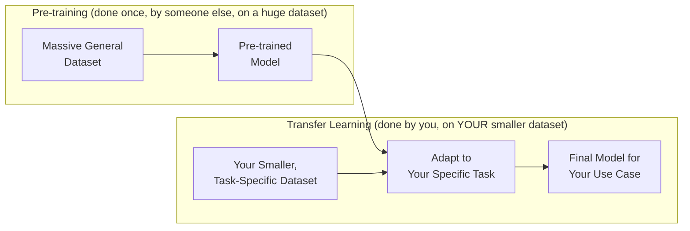
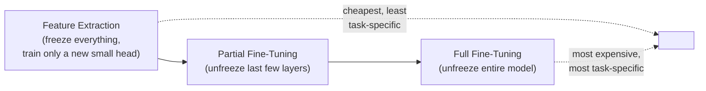
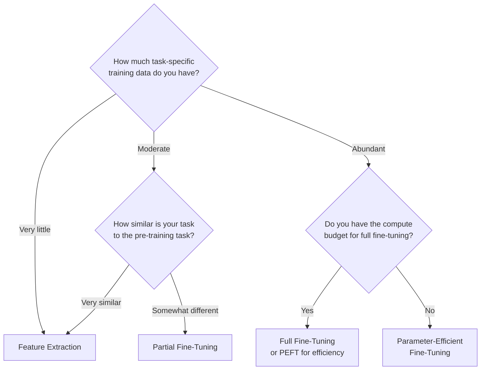

## Introduction

Part 4 closes with the concept that makes almost everything in Chapters 16-19 optional for most real-world teams: **transfer learning**. Rather than training a model from scratch — requiring the massive datasets, distributed infrastructure, and extensive hyperparameter search covered so far in this Part — most production systems today start from an existing, pre-trained model and adapt it to their specific task. This chapter covers the spectrum of adaptation strategies, from lightweight feature extraction to full fine-tuning, and the practical trade-offs between them. It also directly sets up Part 9, where we'll go deep on fine-tuning specifically in the LLM context.

## What Is Transfer Learning?

Transfer learning is the practice of taking a model already trained on one task (often on a very large, general-purpose dataset) and adapting it to a new, typically more specific task — leveraging the general patterns the model already learned rather than learning everything from raw data again. The intuition: a model trained on millions of general images has already learned to recognize edges, textures, shapes, and objects — reusable visual building blocks that a new, more specific task (e.g., classifying defects in manufactured parts) can build on top of, rather than relearning these fundamental visual concepts from a much smaller, specific dataset.



This is precisely why Chapters 16-19's full training infrastructure is often unnecessary for most teams — the extremely expensive, large-scale pre-training step (requiring the distributed training frameworks and massive datasets discussed throughout this Part) has typically already been done by a large lab or company and released as an open or accessible pre-trained model, leaving your team with the comparatively much cheaper and faster adaptation step.

## The Spectrum of Adaptation Strategies



### Feature Extraction

Freeze the entire pre-trained model's weights (they never get updated), and add a small, new, trainable "head" (often just one or two layers) on top, trained only on your specific task's data.

**Strengths**: extremely cheap and fast — you're only training a small number of new parameters, not the entire (often huge) pre-trained model; works well when your task is similar to what the model was originally trained for, and your own dataset is small.

**Weaknesses**: limited ability to adapt the model's deeper, more fundamental representations to your specific task — if your task requires meaningfully different patterns than what the model originally learned, feature extraction alone may underperform.

```python
# Feature extraction example: freezing a pre-trained ResNet's
# weights and training only a new classification head.

import torch
import torch.nn as nn
from torchvision import models

pretrained = models.resnet50(weights="IMAGENET1K_V2")

for param in pretrained.parameters():
    param.requires_grad = False  # freeze ALL pre-trained weights

# Replace the final classification layer with a new, trainable head
# sized for our specific number of classes (e.g., 5 defect types).
num_features = pretrained.fc.in_features
pretrained.fc = nn.Linear(num_features, 5)  # only this layer trains

optimizer = torch.optim.Adam(pretrained.fc.parameters(), lr=1e-3)
# Only the new head's parameters are passed to the optimizer,
# so only they will be updated during training.
```

### Partial Fine-Tuning

Unfreeze only the last few layers of the pre-trained model (in addition to the new head), allowing the model's higher-level, more task-specific representations to adapt, while keeping the earlier, more general/fundamental layers frozen.

**Strengths**: a middle ground — allows meaningfully more task-specific adaptation than pure feature extraction, at a fraction of full fine-tuning's compute and data requirements; the intuition is that earlier layers capture general, broadly-reusable patterns (e.g., edges and textures in vision, general grammar in language), while later layers capture more task-specific, abstract patterns that benefit most from adaptation.

**Weaknesses**: requires a judgment call about exactly how many layers to unfreeze, which is often tuned empirically rather than derived analytically.

### Full Fine-Tuning

Unfreeze the *entire* pre-trained model, allowing every parameter to be updated based on your specific task's data — effectively continuing the training process, but starting from the pre-trained weights rather than random initialization.

**Strengths**: maximum adaptation capability and typically the best achievable task-specific performance, given sufficient data.

**Weaknesses**: requires meaningfully more compute (approaching, though usually still well below, the cost of full pre-training) and, critically, meaningfully more task-specific training data to avoid overfitting or **catastrophic forgetting** — the phenomenon where fine-tuning on a new task causes the model to "forget" the general knowledge it originally learned during pre-training, since every parameter is now being pulled toward the new, narrower task's objective.

## Catastrophic Forgetting: A Key Risk of Full Fine-Tuning

When every parameter of a pre-trained model is updated based on a new, often much smaller and narrower dataset, the model can lose previously-learned general capabilities that aren't reinforced by the new fine-tuning data — a genuine, well-documented risk, not a theoretical concern. This is especially relevant for LLM fine-tuning (Part 9), where a model fine-tuned heavily on a narrow domain (e.g., legal document summarization) can measurably lose some of its broader, general-purpose conversational or reasoning ability that made it valuable in the first place.

**Mitigations**:
- **Lower learning rates during fine-tuning** than would be used for training from scratch — smaller updates are less likely to drastically overwrite existing learned knowledge.
- **Fewer fine-tuning epochs** — stopping before the model has had the opportunity to overfit heavily to the narrow fine-tuning dataset at the expense of general knowledge.
- **Mixing in some of the original (or similar general-purpose) training data** alongside the new task-specific data during fine-tuning, so the model continues to see and reinforce some of its original broader knowledge even while adapting.
- **Parameter-efficient fine-tuning (PEFT)** techniques like LoRA, which only train a small number of additional parameters while leaving the original pre-trained weights frozen and untouched — inherently limiting the risk of overwriting general knowledge, since the original weights are never modified at all. We preview this here and cover it in full technical depth in Chapter 45.

## Choosing an Adaptation Strategy: A Decision Framework



This decision closely echoes the "start simple, escalate only when justified" discipline from Chapters 5 and 17 — feature extraction should generally be your starting point and default baseline (following Chapter 2's interview framework), escalating toward partial or full fine-tuning only when justified by a demonstrated performance gap and sufficient data/compute to support the added complexity.

## Retraining Cadence: How Often to Fine-Tune Again

Once a fine-tuned model is in production, Chapter 4's lifecycle loop applies directly: as new task-specific data accumulates and/or concept drift (Chapter 10) occurs, the fine-tuned model needs periodic retraining/re-fine-tuning. The right cadence depends on the same factors discussed in Chapter 7 (how quickly the underlying domain changes) — a model fine-tuned for a fast-evolving domain (e.g., customer support tickets reflecting rapidly changing product features) needs more frequent re-fine-tuning than one for a comparatively stable domain (e.g., classifying scientific paper topics).

## Key Takeaways

- Transfer learning lets teams build on an already-expensive pre-training investment (done by someone else, on massive data) rather than training from scratch — making Chapters 16-19's full training infrastructure largely unnecessary for most production teams.
- The adaptation spectrum runs from feature extraction (cheapest, freezes everything but a new head) through partial fine-tuning (unfreezes some layers) to full fine-tuning (unfreezes everything, most expensive and most adaptable).
- Full fine-tuning risks catastrophic forgetting — losing general pre-trained knowledge while adapting to a narrow new task — mitigated by lower learning rates, fewer epochs, data mixing, or parameter-efficient fine-tuning (PEFT) techniques like LoRA.
- The right adaptation strategy depends on available task-specific data volume, task similarity to the original pre-training objective, and available compute budget — starting simple (feature extraction) and escalating only when justified.

---

## Interview Questions

**1. What is transfer learning, and why has it become the dominant approach for most production ML systems rather than training from scratch?**
Transfer learning takes a model already trained on a large, often general-purpose dataset and adapts it to a new, more specific task, leveraging the general patterns and representations it already learned rather than learning everything from raw data again; it's dominant because the extremely expensive, large-scale pre-training step (requiring massive datasets and the distributed training infrastructure from earlier chapters in this Part) has typically already been done by a large lab or company and made available as a pre-trained model, letting most production teams skip straight to the much cheaper, faster adaptation step rather than bearing the full cost of training a capable model from scratch themselves.
*Follow-up: Does this mean the concepts from Chapters 16-19 (distributed training, hyperparameter tuning at scale) are irrelevant for most teams practicing transfer learning?*
Not entirely irrelevant, but significantly less central for most teams — full fine-tuning of a very large pre-trained model can still require meaningful compute and, at large enough scale, some of the same distributed training techniques (particularly relevant for full fine-tuning of large language models, covered in Part 9); however, the *scale* of infrastructure typically needed for fine-tuning/adaptation is usually dramatically smaller than what's needed for pre-training from scratch, and lighter adaptation strategies like feature extraction or parameter-efficient fine-tuning often require no distributed training infrastructure at all, which is precisely why understanding where you fall on this cost spectrum (covered later in this chapter) is an important system design decision.

**2. Describe the difference between feature extraction and full fine-tuning, and the core trade-off between them.**
Feature extraction freezes the entire pre-trained model's weights and trains only a small, new "head" layer on top, using the pre-trained model purely as a fixed feature generator; full fine-tuning unfreezes and updates every parameter in the pre-trained model based on the new task's data, allowing much deeper adaptation of the model's learned representations to the specific new task. The core trade-off is cost and data requirements versus adaptation capability: feature extraction is dramatically cheaper and works with much less task-specific data, but has limited ability to adapt to tasks that differ meaningfully from the original pre-training objective, while full fine-tuning can achieve much better task-specific performance but requires substantially more compute and, critically, enough task-specific data to avoid overfitting or catastrophic forgetting.
*Follow-up: In what scenario would feature extraction alone likely be insufficient, signaling a need to move toward fine-tuning instead?*
When the new task requires distinguishing patterns that are meaningfully different from what the original pre-trained model was optimized to represent — for example, using a general-purpose image classification model's frozen features for a highly specialized medical imaging task, where the fine-grained visual patterns relevant to the medical diagnosis may not be well-captured by features originally learned for general object recognition; if feature extraction's offline performance clearly plateaus below an acceptable level despite reasonable head architecture experimentation, that's a signal that some degree of fine-tuning (allowing the model's deeper representations to adapt) is likely necessary.

**3. What is catastrophic forgetting, and why is it a particular risk of full fine-tuning specifically, more so than feature extraction or partial fine-tuning?**
Catastrophic forgetting is the phenomenon where fine-tuning a model on a new, often narrower task causes it to lose previously-learned general knowledge or capabilities from its original pre-training, since every parameter is being updated to optimize for the new, narrower objective, potentially at the expense of the broader patterns it originally learned. This risk is highest in full fine-tuning because every single parameter — including the earlier, more general-purpose layers — is subject to modification; feature extraction inherently avoids this risk entirely (the original weights are never touched at all), and partial fine-tuning limits the risk by keeping the earlier, more general layers frozen while only allowing the later, more task-specific layers to adapt.
*Follow-up: How would you detect catastrophic forgetting in a fine-tuned model, beyond just measuring performance on your specific fine-tuning task?*
Evaluate the fine-tuned model on a separate, held-out benchmark or set of tasks representative of the original pre-trained model's general capabilities (not just your specific fine-tuning task's test set) and compare its performance on that general benchmark before and after fine-tuning — a significant performance drop on this general benchmark, even while your specific fine-tuning task's performance has improved, is direct evidence of catastrophic forgetting, and this kind of dual evaluation (specific task plus general capability regression) should be a standard practice whenever full fine-tuning is used, not an afterthought.

**4. Explain how parameter-efficient fine-tuning (PEFT) techniques like LoRA address the catastrophic forgetting risk, at a conceptual level.**
PEFT techniques like LoRA freeze the original pre-trained model's weights entirely (never modifying them) and instead introduce a small number of new, additional trainable parameters (e.g., low-rank adapter matrices) that are trained to capture the task-specific adaptation, while the original weights remain completely untouched throughout the fine-tuning process; since the model's original knowledge is encoded entirely in the frozen, unmodified weights, there's no mechanism by which that original knowledge could be overwritten or degraded during fine-tuning — inherently sidestepping catastrophic forgetting as a structural property of the approach, rather than requiring careful hyperparameter tuning (low learning rates, few epochs) to merely mitigate the risk as full fine-tuning does.
*Follow-up: Given this apparent advantage, why wouldn't PEFT techniques always be preferred over full fine-tuning?*
While PEFT techniques structurally avoid catastrophic forgetting and are dramatically cheaper in compute and memory, they generally have somewhat less total adaptation capacity than full fine-tuning, since only a small number of new parameters are being trained rather than the model's full parameter set — for tasks requiring very substantial, deep adaptation from the original pre-trained behavior (where the task is quite different from the original pre-training objective and abundant task-specific data is available), full fine-tuning can still achieve meaningfully better task-specific performance than PEFT, making the choice a genuine trade-off between adaptation capacity/performance ceiling and cost/forgetting-risk, rather than PEFT being a strictly dominant choice in every scenario, a nuance covered in full depth in Chapter 45.

**5. Why might mixing in some of the original pre-training data (or similarly general-purpose data) during fine-tuning help mitigate catastrophic forgetting?**
By including some general-purpose data alongside the new, narrow task-specific fine-tuning data, the model continues to see and receive gradient updates that reinforce at least some of its original broader knowledge and capabilities during the fine-tuning process, rather than the entire training signal exclusively pulling the model's parameters toward only the new, narrow task — this acts as a kind of "rehearsal" that helps preserve general capability alongside the new, specialized adaptation, rather than allowing the new narrow objective to be the sole force shaping every parameter update.
*Follow-up: What's a practical challenge in implementing this data-mixing mitigation strategy?*
Determining the right mixing ratio between the general-purpose data and the new task-specific data is a non-trivial, largely empirical hyperparameter-like decision (echoing Chapter 19's hyperparameter tuning discussion) — too much general-purpose data dilutes the fine-tuning signal for the actual task you care about, potentially resulting in insufficient adaptation to the new task, while too little provides insufficient "rehearsal" to meaningfully counteract catastrophic forgetting, meaning the right balance typically requires experimentation and evaluation against both the specific task performance and general capability benchmarks discussed in the previous question.

**6. How would you decide how many layers to unfreeze in a partial fine-tuning approach, given that this is described as a judgment call rather than a fixed formula?**
I'd approach this empirically, similar to hyperparameter tuning (Chapter 19) — starting with a small number of unfrozen layers (closer to feature extraction) and progressively unfreezing more layers, evaluating validation performance at each step, until either performance plateaus (indicating further unfreezing isn't providing meaningful additional benefit) or the available task-specific data proves insufficient to support the additional trainable parameters without overfitting; the general heuristic that later layers capture more task-specific, abstract representations while earlier layers capture more general, broadly reusable patterns provides a reasonable starting intuition (unfreeze from the later layers first), but the exact number is typically validated empirically for a specific model and task rather than derived analytically from first principles.
*Follow-up: What would be a warning sign, during this progressive unfreezing experimentation, that you've unfrozen too many layers relative to your available task-specific data?*
A growing gap between training performance and validation performance (the model's validation performance stops improving or starts degrading even as training performance continues to improve, or improves unrealistically quickly) is a classic overfitting signal, suggesting that the number of trainable parameters introduced by unfreezing additional layers has exceeded what your available task-specific dataset can reliably support without the model starting to memorize idiosyncrasies of the specific training set rather than learning genuinely generalizable patterns — this would be a signal to unfreeze fewer layers, gather more task-specific data, or apply stronger regularization to counteract the overfitting.

**7. Why does the "start simple and escalate only when justified" principle, emphasized throughout this series, apply directly to choosing between feature extraction, partial fine-tuning, and full fine-tuning?**
Just as with distributed training complexity (Chapter 17) or hardware provisioning (Chapter 16), each step up the adaptation spectrum (feature extraction → partial fine-tuning → full fine-tuning) introduces meaningfully more compute cost, data requirements, and risk (catastrophic forgetting) — starting with the simplest, cheapest approach (feature extraction) and only escalating to more expensive, riskier options when a demonstrated performance gap justifies the added cost and risk mirrors the same disciplined, evidence-based escalation principle applied consistently across this entire series, rather than defaulting to full fine-tuning "because it's likely to give the best performance" without first establishing that the cheaper alternatives are genuinely insufficient.
*Follow-up: How would you communicate this "start simple" recommendation to a data scientist eager to jump straight to full fine-tuning because "it should give the best results"?*
I'd acknowledge that full fine-tuning likely would give somewhat better raw offline performance in many cases, but reframe the decision around the full cost-benefit picture — the added compute cost, the additional task-specific data needed to safely support it without overfitting or catastrophic forgetting, and the added engineering complexity of managing that larger, fully-retrained model — and propose establishing a feature-extraction baseline first specifically to measure how large the actual performance gap to full fine-tuning would be, letting that measured gap (rather than an assumption) inform whether the additional cost and risk of full fine-tuning is actually justified for this specific project's stakes and constraints.

**8. How does transfer learning specifically relate to solving the cold-start problem introduced in Chapter 7?**
Transfer learning directly addresses a specific flavor of the cold-start problem — when a team has very little or no task-specific labeled data for a brand-new product or feature, starting from a pre-trained model (which already encodes substantial general-purpose knowledge from its much larger pre-training dataset) and applying even lightweight feature extraction can produce a far more capable starting model than attempting to train a model entirely from scratch on the team's own limited, cold-start-stage data — effectively substituting someone else's large-scale pre-training data investment for the team's own currently-insufficient task-specific data.
*Follow-up: Does transfer learning fully solve the cold-start problem, or does some version of it persist even when using a pre-trained model?*
It significantly alleviates but doesn't fully eliminate cold-start challenges — while the pre-trained model provides valuable general-purpose starting knowledge, the model still needs at least some task-specific data to adapt (even lightweight feature extraction requires some labeled examples for the new task) and to properly evaluate whether the adaptation is actually working well for your specific use case; additionally, for genuinely novel domains that differ substantially from anything represented in typical pre-training data (highly specialized technical domains, or entirely new categories with no analog in existing pre-trained models' training data), transfer learning's benefit may be more limited, and some version of the original cold-start data-collection challenge from Chapter 7 still applies, just at a reduced scale.

**9. Why might a company choose a smaller pre-trained model with full fine-tuning over a larger pre-trained model with only feature extraction, even if the larger model's frozen features perform comparably well?**
If the larger model's serving/inference cost (latency, compute, memory — tying to Chapter 5's cost/latency framework) is significantly higher than a smaller model's, and the smaller model, once fully fine-tuned, can close most or all of the performance gap for the specific task at hand, the smaller fully-fine-tuned model may represent a better overall system trade-off — accepting the higher one-time training cost and complexity of full fine-tuning on the smaller model in exchange for meaningfully lower ongoing production serving costs, which, especially at high request volume, can dwarf the training cost difference many times over across the model's production lifetime.
*Follow-up: How would you quantify this trade-off to make a well-justified recommendation, rather than relying on general intuition?*
Compare the total cost of ownership for each option over a realistic production time horizon — for the larger frozen-feature model, its lower one-time training cost plus its higher per-request serving cost multiplied by expected production request volume over that time horizon; for the smaller fully-fine-tuned model, its higher one-time training cost plus its lower per-request serving cost over the same volume and time horizon — and compare the two total costs alongside their respective task performance levels, allowing a genuinely quantified, evidence-based recommendation rather than a qualitative judgment based on general principles alone.

**10. How does the concept of "catastrophic forgetting" specifically apply to fine-tuning large language models, and why is it discussed as a particularly acute concern in that context (previewing Part 9)?**
LLMs are pre-trained on extremely broad, general-purpose text data, giving them broad general knowledge, reasoning ability, and conversational capability that constitutes much of their value; fine-tuning heavily on a narrow domain (e.g., only legal documents, or only customer support conversations for one specific product) risks the model losing some of this valuable, broad general capability in favor of narrow specialization — which is a particularly acute concern for LLMs specifically because their broad general capability is often exactly what makes them valuable in the first place (unlike, say, a narrow image classifier where the model was never expected to have broad general capability beyond its specific classification task to begin with).
*Follow-up: How does this specific concern shape the choice between full fine-tuning and PEFT techniques (like LoRA) for LLM adaptation, in practice?*
This is precisely why PEFT techniques have become the dominant, default approach for adapting LLMs to specific tasks or domains in most production contexts — since PEFT's structural avoidance of catastrophic forgetting (by leaving the original pre-trained weights entirely untouched) directly and reliably preserves the broad general capability that makes the base LLM valuable, while still achieving meaningful task-specific adaptation through the small number of additional trained parameters, making PEFT a generally safer, more broadly-applicable default choice for LLM adaptation than full fine-tuning, a topic we return to in full technical depth in Chapter 45.

**11. What signals in a production system would tell you it's time to re-fine-tune (rather than just retrain from the same fine-tuning dataset again) a previously fine-tuned model?**
The same signals that generally motivate retraining in the classical ML lifecycle (Chapter 4 and Chapter 10) apply here — detecting data or concept drift in the task-specific domain the model was fine-tuned for (e.g., the nature of customer support inquiries has genuinely shifted due to new product features), or a degradation in the fine-tuned model's online performance metrics (Chapter 6) that isn't explained by training-serving skew (Chapter 15) — both would suggest the previously fine-tuned model's adaptation to the task has become stale and would benefit from re-fine-tuning on more recent, representative task-specific data, following whatever retraining cadence is appropriate given how quickly the specific domain evolves (as discussed for the general case in Chapter 7).
*Follow-up: Would you re-fine-tune starting from the original pre-trained base model again, or continue fine-tuning from the previous fine-tuned checkpoint? What's the trade-off?*
Continuing fine-tuning from the previous fine-tuned checkpoint is generally faster (since it's already closer to a good task-specific solution) but risks compounding catastrophic forgetting over successive rounds of fine-tuning, and can make it harder to cleanly incorporate a meaningfully different or expanded fine-tuning dataset if the task's nature has evolved substantially; restarting fine-tuning from the original pre-trained base model each time is more computationally expensive but avoids this compounding forgetting risk and ensures a clean, consistent starting point each time — the right choice often depends on how significantly the task-specific domain has evolved and how much compute budget is available for the retraining cycle, and some teams adopt a hybrid practice of periodically restarting from the original base model (e.g., quarterly) while doing faster incremental re-fine-tuning from the previous checkpoint in between those periodic full resets.

**12. In an interview, if asked to design a system for classifying customer support tickets into categories, how would you use the concepts from this chapter to justify your modeling approach?**
I'd propose starting with transfer learning from a pre-trained general-purpose language model, beginning with feature extraction (using the pre-trained model's embeddings as fixed features, feeding a new, lightweight classification head trained on the company's own labeled ticket data) as an initial, low-cost baseline (following Chapter 2's "start with a baseline" framework principle); I'd then explicitly state I'd measure whether this baseline's performance is sufficient, and only escalate to partial or full fine-tuning if there's a demonstrated performance gap and sufficient task-specific labeled data (a reasonable number of labeled tickets per category) to support that additional adaptation without excessive overfitting risk, rather than assuming full fine-tuning is necessary from the outset.
*Follow-up: How would your answer change if the interviewer specified that the company has only a few hundred labeled examples total, across all categories?*
With such a small labeled dataset, I'd strongly favor feature extraction (or, at most, very limited partial fine-tuning of just the final layer or two) over any more extensive fine-tuning, since full or even substantial partial fine-tuning with only a few hundred total examples would carry a very high risk of overfitting to that small dataset — I'd also explore whether few-shot prompting of a capable pre-trained LLM (previewed here, covered fully in Part 8) might be a more data-efficient alternative to any traditional fine-tuning approach at all, given how severely data-constrained this specific scenario is, potentially avoiding the need for any gradient-based training step whatsoever for an initial version of this system.

**13. Why is it important to evaluate a fine-tuned model against both its specific target task's test set AND a separate general-capability benchmark, rather than relying solely on the target task's metrics?**
Relying solely on the target task's test set metrics would only reveal how well the model performs on the narrow task it was fine-tuned for, completely missing any catastrophic forgetting of broader general capabilities that occurred during the fine-tuning process — a model could show excellent, improving performance on its specific fine-tuning task's metrics while simultaneously suffering significant degradation in other capabilities that weren't directly measured but might still matter for the broader system (e.g., a customer support ticket classifier that's also expected to occasionally handle general conversational queries outside strict ticket classification) or might matter for future re-purposing of the same fine-tuned model for a different but related task.
*Follow-up: What would you do if you discovered significant general-capability degradation during this dual evaluation, but your target task's performance was excellent and met the project's needs?*
I'd weigh whether the general-capability degradation actually matters for this specific system's real-world use — if the fine-tuned model is deployed in a narrow, well-scoped context where only the specific fine-tuned task's capability is ever actually exercised in production (e.g., it's exclusively used behind an API that only ever sends ticket classification requests, never general conversational queries), the general-capability degradation may be an acceptable, even irrelevant, trade-off; however, if there's any realistic chance the model's broader capabilities might be relied upon elsewhere in the system or in a future use case, I'd consider mitigations like PEFT (question 4) or data-mixing (question 5) to preserve more of that general capability, even at some cost to the narrow task's peak performance.

**14. How would you explain to a stakeholder why "just use the biggest, most powerful pre-trained model available and fully fine-tune it" isn't automatically the right default engineering decision?**
I'd explain that this approach carries several real costs and risks that need to be weighed against the specific project's actual requirements: full fine-tuning of the largest available model requires significantly more compute and, critically, more task-specific labeled data to do safely without overfitting or catastrophic forgetting than the project may actually have available; it also results in a larger, more expensive model to serve in production, potentially conflicting with latency or cost requirements (Chapter 5); and if the actual task doesn't require the full capability of the largest available model, a smaller model with an appropriately-matched adaptation strategy (potentially even just feature extraction) may achieve comparable task-specific performance at a fraction of the total training and serving cost — framing the recommendation as "right-sized for the specific task and constraints" rather than "biggest and most powerful available," directly echoing the hardware right-sizing principle from Chapter 16.
*Follow-up: What evidence would you want to gather to make this "right-sized" recommendation concrete and convincing, rather than purely theoretical?*
I'd propose running a small, controlled comparison — evaluating a few different model sizes and adaptation strategies (e.g., a smaller model with feature extraction, a smaller model with full fine-tuning, and the largest available model with feature extraction) against the specific project's actual validation data and business metrics, quantifying both the resulting task performance and the associated training/serving cost for each option — letting this concrete, project-specific evidence directly inform and justify the final right-sized recommendation, rather than relying on general principles or intuition alone to make the case to the stakeholder.

**15. How does this chapter's transfer learning and fine-tuning discussion set up the topics covered later in Part 8 and Part 9 of this series?**
This chapter established the general principles — the adaptation spectrum from feature extraction to full fine-tuning, the catastrophic forgetting risk and its mitigations (including a preview of parameter-efficient fine-tuning), and the framework for deciding how much adaptation a given task and data situation actually justifies — using classical ML/deep learning examples (like image classification) as the illustrative context; Part 8 and Part 9 apply these exact same underlying principles specifically to large language models, going into much greater technical depth on parameter-efficient fine-tuning techniques (LoRA, QLoRA, adapters), instruction tuning, and RLHF, all of which are, at their core, specific, more sophisticated instances of the general transfer-learning and fine-tuning adaptation spectrum introduced in this chapter.
*Follow-up: Why is it valuable to first understand these concepts in a general, non-LLM-specific context before diving into their LLM-specific applications later in this series?*
Understanding the underlying principles in a simpler, more classical context (like image classification, where the concepts of frozen versus trainable layers and catastrophic forgetting are often more intuitively visualized and explained) builds a solid conceptual foundation that transfers directly to the LLM-specific material later in this series, without needing to simultaneously grapple with both the fundamental transfer-learning concepts AND the added complexity of transformer architectures and LLM-specific terminology all at once — this kind of general-to-specific learning progression, building foundational concepts before layering on domain-specific complexity, is a deliberate pedagogical choice made throughout this series' overall structure, not just within this particular chapter.
