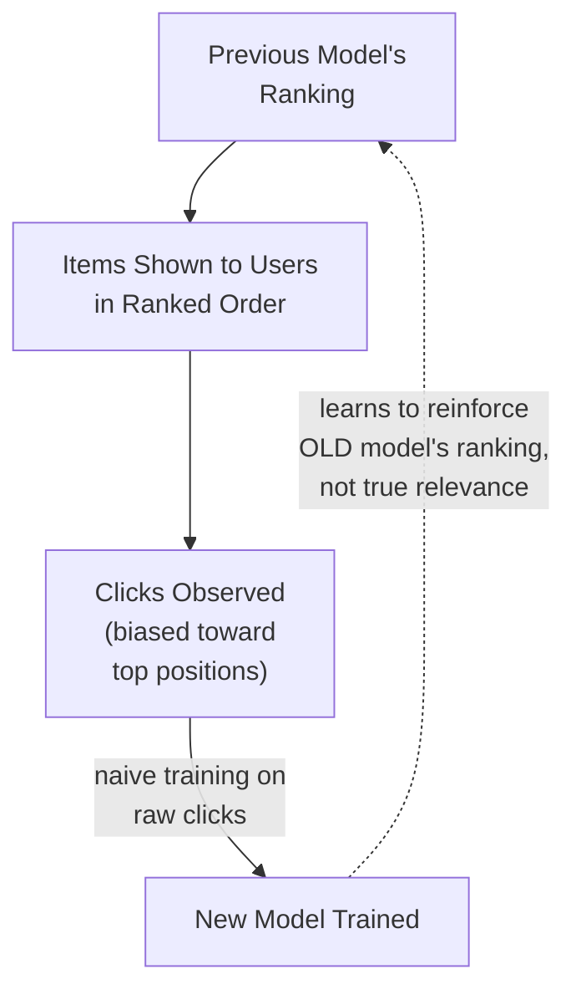
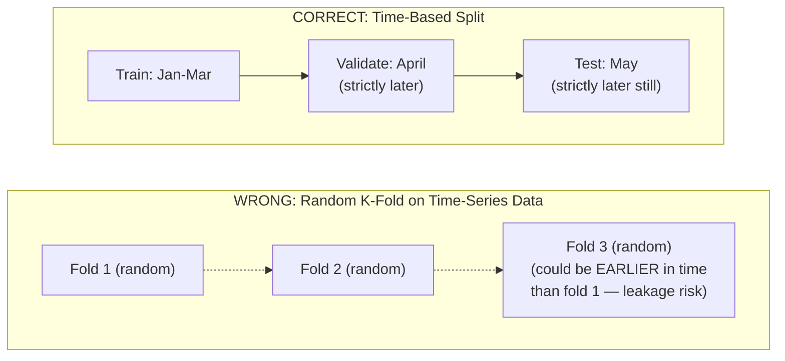

## Introduction

Chapter 6 introduced the three-tier metric framework (offline, online, business) at a conceptual level. Part 5 now goes deep on each tier in turn, starting here with offline evaluation — the metrics computed on held-out historical data before a model ever reaches a real user. Getting this right, per problem type from Chapter 3, is foundational: every subsequent decision (which model to deploy, how to A/B test it, whether it's fair) rests on trustworthy offline evaluation.

## Classification Metrics, Precisely

- **Accuracy**: fraction of predictions that are correct. Misleading for imbalanced classes (Chapter 3) — a 99.5%-accurate fraud model that never flags anything is useless if fraud is 0.5% of transactions.
- **Precision**: of everything the model flagged as positive, what fraction was actually positive — `TP / (TP + FP)`. High precision means few false alarms.
- **Recall (Sensitivity)**: of everything actually positive, what fraction did the model catch — `TP / (TP + FN)`. High recall means few missed cases.
- **F1-Score**: the harmonic mean of precision and recall — `2 * (P * R) / (P + R)`. Useful as a single balanced number when both errors matter roughly equally, but hides the underlying precision/recall trade-off (Chapter 3), so should rarely be the *only* metric reported.
- **AUC-ROC**: area under the Receiver Operating Characteristic curve (true positive rate vs. false positive rate across all thresholds) — measures the model's ability to rank positive examples above negative ones, independent of any specific threshold choice.
- **AUC-PR**: area under the Precision-Recall curve — generally more informative than AUC-ROC for heavily imbalanced classes, since AUC-ROC can look deceptively good even for a weak model when negatives vastly outnumber positives.

```python
from sklearn.metrics import precision_recall_curve, roc_auc_score, average_precision_score
import numpy as np

def evaluate_classifier(y_true: np.ndarray, y_scores: np.ndarray):
    """
    y_true: ground truth binary labels
    y_scores: predicted probabilities (not hard 0/1 predictions) —
              threshold-independent metrics need the raw scores.
    """
    roc_auc = roc_auc_score(y_true, y_scores)
    pr_auc = average_precision_score(y_true, y_scores)  # AUC-PR

    precisions, recalls, thresholds = precision_recall_curve(y_true, y_scores)

    return {
        "roc_auc": roc_auc,
        "pr_auc": pr_auc,
        "precision_recall_curve": (precisions, recalls, thresholds),
    }
```

## Regression Metrics, Precisely

- **MAE (Mean Absolute Error)**: average of `|predicted - actual|` — robust to outliers, interpretable in the original unit (e.g., "off by $5 on average").
- **RMSE (Root Mean Squared Error)**: square root of the average squared error — penalizes large errors disproportionately more than MAE, appropriate when large errors are genuinely worse than proportionally more small errors.
- **MAPE (Mean Absolute Percentage Error)**: average of `|predicted - actual| / actual` — expresses error as a percentage, useful for comparing across differently-scaled targets, but undefined/unstable when the true value is near zero.
- **R² (coefficient of determination)**: fraction of variance in the target explained by the model — useful for a quick sense of overall fit, but can be misleading in isolation (a high R² doesn't guarantee the model is useful for the specific decisions it'll be used for).

## Ranking Metrics, Precisely

Ranking metrics (introduced conceptually in Chapter 3) require special care because they must capture *order*, not just per-item correctness — and because real-world position bias (users are far more likely to click higher-ranked items regardless of true relevance) contaminates naive evaluation using raw click data.

- **Precision@K / Recall@K**: precision or recall considering only the top K ranked items — directly relevant since users typically only see/engage with the first few results.
- **MRR (Mean Reciprocal Rank)**: the reciprocal of the rank position of the *first* relevant result, averaged across queries — appropriate when there's typically only one "correct" answer per query (e.g., a factual question-answering system).
- **MAP (Mean Average Precision)**: averages precision at each position where a relevant item appears, across all relevant items and all queries — appropriate when there can be multiple relevant items per query and you care about all of them, not just the first.
- **NDCG (Normalized Discounted Cumulative Gain)**: the most widely used ranking metric in modern search/recommendation systems — assigns graded relevance scores (not just binary relevant/irrelevant) and discounts the value of a relevant item logarithmically based on its position, then normalizes against the best-possible ranking's score.

```python
import numpy as np

def dcg_at_k(relevance_scores: list[float], k: int) -> float:
    """Discounted Cumulative Gain at position k."""
    relevance_scores = np.asarray(relevance_scores)[:k]
    if relevance_scores.size == 0:
        return 0.0
    discounts = np.log2(np.arange(2, relevance_scores.size + 2))  # positions start at 1, discount at log2(rank+1)
    return np.sum(relevance_scores / discounts)

def ndcg_at_k(relevance_scores: list[float], k: int) -> float:
    """Normalized DCG: DCG of the actual ranking / DCG of the ideal (best possible) ranking."""
    actual_dcg = dcg_at_k(relevance_scores, k)
    ideal_dcg = dcg_at_k(sorted(relevance_scores, reverse=True), k)
    return actual_dcg / ideal_dcg if ideal_dcg > 0 else 0.0

# Example: a ranked list's relevance scores (0 = irrelevant, higher = more relevant)
ranked_relevance = [3, 2, 0, 1, 0]  # relevance of items in the order the model ranked them
print(f"NDCG@5: {ndcg_at_k(ranked_relevance, k=5):.3f}")
```

## The Position Bias Problem in Ranking Evaluation

If you naively evaluate a ranking model using raw historical click data as your "ground truth" relevance labels, you run into a serious confound: items shown in higher positions get clicked more often *simply because they were shown first*, independent of their true relevance. A model trained and evaluated on this raw, biased click data can learn to reinforce whatever the *previous* model already ranked highly, rather than learning genuine relevance — a self-fulfilling feedback loop.

**Mitigations**:
- **Inverse Propensity Weighting (IPW)**: weight each observed click by the inverse of the probability that the item would have been seen/clicked at its shown position, correcting for the fact that lower-positioned items had less opportunity to be clicked in the first place.
- **Randomized exploration data**: as introduced in Chapter 7, deliberately showing some fraction of results in randomized order breaks the position-relevance confound, providing unbiased data at the cost of some short-term user experience.
- **Explicit relevance judgments**: using human-labeled relevance scores (rather than inferred click behavior) for evaluation, sidestepping the position bias problem entirely at the cost of the labeling expense discussed in Chapter 7.



## Cross-Validation and Data Splitting Strategy

A single train/test split can give a misleadingly noisy or optimistic performance estimate, especially with limited data. **K-fold cross-validation** — splitting data into K folds, training on K-1 and testing on the held-out fold, rotating which fold is held out, and averaging results — gives a more robust performance estimate and an indication of variance across different data subsets.

**Critical caveat for time-series or production ML data**: standard random K-fold cross-validation can leak future information into training folds when data has a temporal structure (directly related to Chapter 13's point-in-time correctness) — always use **time-based splits** (train on earlier data, validate on strictly later data) for any system where the deployed model will predict on future, not-yet-seen data, which describes essentially every production ML system.



## Choosing the Right Metric: Revisiting Chapter 6's Framework

Every offline metric choice should trace back to the cost-asymmetry and business-goal reasoning from Chapters 3 and 6 — never choose a metric because it's the default in a library's documentation. A concrete checklist:
1. What problem type is this (Chapter 3)? This narrows the candidate metric family (classification/regression/ranking).
2. Is there a meaningful cost asymmetry between error types? This determines whether to favor precision, recall, or a specific point on a curve rather than a single blended score.
3. Does the deployment context involve position/exposure effects (as in ranking)? If so, plan for position-bias-aware evaluation from the start, not as an afterthought.
4. Is the offline evaluation split constructed with proper point-in-time discipline, avoiding leakage?

## Key Takeaways

- Classification metrics (precision, recall, F1, AUC-ROC, AUC-PR) each surface different aspects of model quality — the right choice depends on class balance and cost asymmetry, not library defaults.
- Regression metrics (MAE, RMSE, MAPE, R²) differ in outlier sensitivity and interpretability — MAE and RMSE answer meaningfully different questions about error magnitude.
- Ranking metrics (Precision@K, MRR, MAP, NDCG) must capture order, not just per-item correctness, and evaluation using raw click data is contaminated by position bias unless explicitly corrected.
- Cross-validation should always respect temporal structure in production ML data — random K-fold splitting risks the same point-in-time leakage problem introduced in Chapter 13.

---

## Interview Questions

**1. Why is accuracy often a misleading metric for a fraud detection or other highly imbalanced classification task?**
When one class (e.g., "fraud") is a tiny fraction of the total population, a model that simply predicts the majority class ("not fraud") for every single example can still achieve very high accuracy without ever correctly identifying a single actual fraud case — accuracy treats all correct predictions equally regardless of class, hiding the fact that the model may be providing zero real value for the minority class that actually matters most for the business, making precision, recall, and AUC-PR far more informative metrics for this kind of imbalanced scenario.
*Follow-up: Why is AUC-PR generally recommended over AUC-ROC specifically for heavily imbalanced classification problems?*
AUC-ROC's false positive rate calculation is normalized by the (very large) number of true negatives in an imbalanced dataset, which can make even a fairly weak model's ROC curve look deceptively good since a large absolute number of false positives still represents a small false positive *rate* relative to the huge negative class; AUC-PR, by contrast, is based on precision (which directly reflects how many of the model's positive predictions are actually correct, unaffected by the size of the negative class), making it much more sensitive to and representative of a model's actual practical usefulness for the minority class in an imbalanced setting.

**2. Explain the difference between MAE and RMSE, and describe a scenario where you'd specifically prefer one over the other.**
MAE (Mean Absolute Error) averages the absolute value of each prediction error, treating all errors proportionally to their size; RMSE (Root Mean Squared Error) squares each error before averaging and taking the square root, which disproportionately penalizes larger errors compared to several smaller ones of the same total magnitude. You'd prefer RMSE when large errors are genuinely much worse than many small errors combined (e.g., in a demand forecasting system where a single wildly wrong prediction could cause a severe stockout, you want the metric — and the model's training objective — to specifically discourage large individual errors); you'd prefer MAE when errors of any size matter roughly proportionally, and you want a metric that's more robust to and less dominated by a small number of outlier predictions, giving a more representative picture of "typical" error magnitude.
*Follow-up: If your business stakeholder cares primarily about avoiding any single catastrophically wrong prediction, which metric's underlying training objective would you lean toward, and why?*
I'd lean toward RMSE (or a loss function based on squared error) as the model's training objective, since it directly and disproportionately penalizes exactly the kind of catastrophic large individual errors the stakeholder cares most about avoiding — a model trained to minimize MAE alone would treat a single huge error as equivalent in cost to a proportionally larger number of small errors, which doesn't match the actual business preference for avoiding rare, severe mistakes even at the cost of slightly more frequent small mistakes elsewhere.

**3. What is NDCG, and why has it become the dominant ranking metric in modern search and recommendation system evaluation, more so than simpler metrics like MRR?**
NDCG (Normalized Discounted Cumulative Gain) supports graded relevance (an item can be "somewhat relevant," "very relevant," etc., not just binary relevant/irrelevant), discounts a relevant item's contribution to the score based on how far down the ranked list it appears (since users are less likely to see or value items further down), and normalizes the resulting score against the best-possible achievable ranking, producing a score between 0 and 1 that's comparable across different queries with different numbers of relevant items. MRR, by contrast, only considers the position of the *first* relevant result and treats relevance as binary, making it well-suited to scenarios with a single correct answer per query but poorly suited to the much more common real-world scenario (search, recommendations) where multiple items can be relevant to varying degrees, and where the position and relative ordering of several relevant items — not just the very first one — genuinely matters for user experience.
*Follow-up: In what scenario would MRR still be the more appropriate metric to use over NDCG?*
MRR remains the more appropriate choice for tasks where there's essentially one correct answer per query and the user's goal is specifically to find that one answer as quickly as possible — for example, a factual question-answering system or a "find this exact document" search task, where ranking additional, partially-relevant results after the single correct answer provides little to no additional value to the user, making NDCG's more nuanced handling of multiple graded-relevance results unnecessary complexity for that specific use case.

**4. What is position bias in the context of evaluating a ranking system using historical click data, and why does it pose a serious risk if not corrected for?**
Position bias is the tendency for items shown in higher-ranked positions to receive more clicks simply because users see them first and are more likely to interact with whatever is presented earlier, independent of the item's true underlying relevance — if you naively treat raw historical clicks as ground-truth relevance labels for evaluating (or training) a new ranking model, the resulting evaluation is confounded, since it's partly measuring "how good was the previous model's ranking that determined what got shown" rather than "how relevant is this item truly." This creates a risk of a self-reinforcing feedback loop, where each successive model is evaluated and trained to simply reproduce and entrench the ranking decisions of whatever model came before it, rather than genuinely improving relevance.
*Follow-up: Describe one concrete technique to correct for position bias, and explain at a conceptual level how it addresses the problem.*
Inverse Propensity Weighting (IPW) addresses this by weighting each observed click according to the inverse of the estimated probability that an item at that specific position would have been seen and clicked at all, regardless of its true relevance — this effectively "up-weights" clicks on lower-positioned items (which had a lower baseline probability of being clicked simply due to their position) and "down-weights" clicks on higher-positioned items (which had a higher baseline probability of being clicked regardless of relevance), producing an evaluation signal that more fairly reflects true relevance rather than simply reflecting the previous model's position-driven exposure pattern.

**5. Why is standard random K-fold cross-validation potentially dangerous for evaluating a production ML model trained on data with temporal structure?**
Random K-fold cross-validation shuffles all examples randomly before splitting into folds, which means a "training" fold in one iteration could easily contain examples chronologically *later* than examples in the "test" fold for that same iteration — since a production model will always be predicting on genuinely future, not-yet-seen data relative to when it was trained, evaluating with random folds that mix past and future data doesn't accurately simulate this real deployment scenario, and can leak future information into training in ways that inflate offline evaluation metrics beyond what the model would actually achieve in real, forward-looking production use — directly analogous to the point-in-time correctness violation discussed in Chapter 13, just occurring during the evaluation/cross-validation process rather than the training feature computation process.
*Follow-up: How would you modify your cross-validation strategy to correctly account for this temporal structure?*
Use a time-based (or "rolling-origin") cross-validation approach, where each fold's training data consists only of examples chronologically earlier than that fold's validation data — for example, training on January-March data and validating on April, then training on January-April and validating on May, and so on — ensuring that every validation fold genuinely simulates the real production scenario of predicting on data that occurred strictly after the training data's time range, avoiding any temporal leakage between the two.

**6. How would you decide between reporting a single blended metric (like F1-score) versus reporting precision and recall separately, when communicating offline evaluation results to a stakeholder?**
A single blended metric like F1-score is convenient for quick comparison between model versions or for automated decision-making (e.g., an automated gate in a CI/CD pipeline, covered in Chapter 46) where a single number is operationally useful, but it obscures the underlying precision/recall trade-off and can hide the fact that two models with the same F1-score might have very different, and very differently consequential, error profiles (one favoring precision, one favoring recall); when communicating with a stakeholder who needs to understand and weigh in on the actual real-world cost implications of the model's error types (Chapter 3's cost-asymmetry discussion), reporting precision and recall separately — ideally alongside a concrete framing of what each means in business terms — provides much more actionable, transparent information than a single blended number.
*Follow-up: What's a risk of relying solely on F1-score as an automated model-selection criterion across successive model versions, without ever inspecting precision and recall separately?*
An automated process optimizing purely for F1-score could silently select a new model version that has shifted the precision/recall balance in a way that's actually worse for the specific business context (e.g., trading meaningfully higher precision for a smaller recall improvement, when the business specifically cares more about not missing positive cases), even though the blended F1 score technically went up — without separately monitoring precision and recall trends, this kind of consequential shift in the model's error profile could go completely unnoticed despite the headline metric technically "improving."

**7. Why might a model with a very high R² still be practically useless for the business decisions it's meant to inform?**
R² measures the proportion of variance in the target variable explained by the model relative to a naive baseline (predicting the mean), but a high R² doesn't guarantee the model's actual absolute error magnitude is small enough to be useful for the specific decision at hand — for example, a demand forecasting model might explain 95% of the variance in daily sales (a seemingly excellent R²) while still having an absolute error large enough to cause meaningful over- or under-stocking decisions in absolute unit terms; R² is a relative, variance-explained measure, not a direct statement about whether the model's absolute error is small enough for practical decision-making.
*Follow-up: What would you look at in addition to R² to determine whether a regression model's performance is actually sufficient for its intended business use?*
I'd look at the model's absolute error metrics (MAE or RMSE) in the target's original, business-meaningful units, and compare that error magnitude directly against the specific decision thresholds or tolerances relevant to the business use case (e.g., "is a prediction error of plus-or-minus 50 units acceptable for our inventory reorder decisions, given our typical order quantities and holding costs") — R² alone, being a relative and somewhat abstract statistical measure, doesn't answer this concrete, business-relevant question on its own.

**8. How would you evaluate a ranking system if you don't have reliable historical click data at all (e.g., a brand-new search feature), given the position bias concerns discussed in this chapter?**
I'd rely primarily on explicit human relevance judgments — having human raters assess the relevance of candidate results for a representative sample of queries, producing graded relevance labels that sidestep the position bias problem entirely since they're independent of any previous model's exposure pattern — and compute standard ranking metrics (NDCG, MAP) against these human judgments; this is more expensive than using existing click data (tying back to the labeling cost discussion in Chapter 7), but is often the only reliable evaluation option in a cold-start scenario with no prior unbiased interaction data available yet.
*Follow-up: Once the new search feature has been live for a while and click data starts accumulating, how would you transition toward using that click data for ongoing evaluation without reintroducing position bias?*
I'd introduce a small amount of deliberately randomized result ordering (the exploration-data strategy from Chapter 7) for a fraction of live traffic specifically to collect position-bias-free click data going forward, and/or apply inverse propensity weighting techniques to the naturally-collected click data to statistically correct for the position bias introduced by the feature's actual (non-randomized) ranking — gradually supplementing or replacing the more expensive human-judgment-based evaluation with this statistically-corrected click data as it accumulates, rather than either abruptly switching to naive uncorrected click data or continuing to rely solely on the more expensive human judgment approach indefinitely.

**9. Why is it important to compute classification metrics like precision and recall using the model's predicted probabilities and an explicitly chosen threshold, rather than assuming a default 0.5 threshold?**
The default 0.5 threshold is an arbitrary convention with no inherent connection to the actual cost asymmetry of the specific business problem (Chapter 3) — computing precision and recall (and choosing a threshold) should instead be driven by the actual relative costs of false positives versus false negatives for the specific use case, which may justify a threshold significantly higher or lower than 0.5 depending on whether the business needs to prioritize minimizing false alarms or minimizing missed cases; reporting metrics only at the default 0.5 threshold, without considering the full precision-recall trade-off curve and the business-appropriate operating point on it, risks presenting a misleading picture of the model's true practical usefulness for its intended decision-making context.
*Follow-up: How would you present offline evaluation results to make this threshold dependency transparent, rather than reporting a single set of precision/recall numbers?*
I'd present the full precision-recall curve (or a table of precision/recall pairs across a range of candidate thresholds) rather than a single point, along with a specific recommended operating threshold justified by an explicit cost-benefit analysis tied to the business's actual error costs — this makes clear that precision and recall are not fixed, inherent properties of the model alone, but rather a tunable trade-off that depends on where the threshold is set, giving stakeholders the full picture needed to make an informed decision about where on that trade-off curve the deployed system should actually operate.

**10. What's the relationship between the offline evaluation practices covered in this chapter and the point-in-time correctness concept introduced in Chapter 13's feature store discussion?**
Both are concerned with the same underlying risk — using information that wouldn't actually be available at genuine prediction time, thereby producing misleadingly optimistic evaluation results — but applied at different stages: Chapter 13's point-in-time correctness concerns whether the *feature values* used to construct a training/evaluation example reflect only information available as of that example's timestamp; this chapter's time-based cross-validation concern is about whether the *train/validation split itself* respects chronological order, ensuring validation data is always chronologically later than the training data used to evaluate against it — both are specific instances of the same broader principle: offline evaluation must faithfully simulate the real, forward-looking nature of production deployment, or its results can't be trusted to predict real-world performance.
*Follow-up: Could a model pass a properly time-based cross-validation split, yet still suffer from a point-in-time correctness violation in its feature computation? Explain how these are independent risks.*
Yes — even if your train/validation split correctly separates data chronologically (correct time-based splitting), the *features themselves* used within both the training and validation examples could still be computed using a naive join that incorporates information from after each individual example's specific timestamp (a point-in-time correctness violation in feature computation) — these are independent risks because one concerns the macro-level chronological ordering of your dataset splits, while the other concerns the micro-level correctness of each individual example's feature values relative to its own specific timestamp; you need to get both right independently to have a fully trustworthy, leakage-free offline evaluation.

**11. How would you approach offline evaluation differently for a model that will be used to make a small number of high-stakes decisions (e.g., loan approvals) versus a model used for a large volume of low-stakes decisions (e.g., which ad to show)?**
For the high-stakes, lower-volume use case, I'd invest more heavily in careful, possibly manual inspection of individual errors (not just aggregate metrics), pay close attention to subgroup/slice-based performance (echoing Chapter 6's discussion of aggregate metrics hiding subgroup failures, and directly connecting to Chapter 25's fairness auditing), and likely require a higher evidentiary bar (larger, more carefully curated evaluation sets, possibly with human expert review of edge cases) before considering the model ready for deployment; for the high-volume, lower-stakes use case, aggregate statistical metrics computed on a large, representative evaluation set are typically sufficient, since the cost of any single individual error is low and issues are more efficiently caught and corrected through fast online A/B testing (Chapter 22) and iteration rather than exhaustive upfront offline scrutiny of every individual case.
*Follow-up: Why might it still be a mistake to skip subgroup-based evaluation even for the high-volume, "lower stakes" ad-serving example?*
Even individually low-stakes decisions can aggregate into a significant, systematically unfair pattern at scale if a model consistently underperforms or behaves differently for a specific subgroup across millions of low-stakes decisions (e.g., a systematic difference in ad relevance or ad category shown to different demographic groups) — while any single ad impression might be low-stakes, the cumulative pattern across a large population can raise real fairness and reputational concerns (Chapter 25) that wouldn't be visible in an aggregate-only evaluation, meaning subgroup-based evaluation still has real value even in ostensibly "lower stakes" high-volume contexts, just weighed differently against the cost of that additional evaluation effort.

**12. Why might two different teams, evaluating the exact same trained model on the exact same dataset, report meaningfully different offline metric values, and how would you prevent this kind of inconsistency?**
Differences can arise from subtle implementation variations — different handling of tied predictions, different treatment of missing/undefined values (e.g., MAPE when the true value is zero), different threshold choices for classification metrics, or even different library implementations of nominally the same metric having slightly different default behaviors or edge-case handling — echoing the same kind of implementation-divergence risk discussed for feature computation in Chapter 15, just applied to evaluation code instead. Preventing this requires establishing and enforcing a single, shared, well-tested evaluation library/codebase used consistently by every team and every model version, rather than allowing each team or project to implement its own version of standard metrics independently.
*Follow-up: What practice would you put in place to catch this kind of evaluation inconsistency before it causes a real decision-making error (e.g., choosing the wrong model version to deploy)?*
Establish a shared, centralized, version-controlled evaluation library or service that every team is required to use for computing standard offline metrics, along with a small set of "golden" test cases with known, manually-verified expected metric outputs that can be run against the evaluation library itself to confirm it's functioning correctly — treating the evaluation code itself as a piece of critical, carefully-tested infrastructure (similar in spirit to the cross-language contract testing discussed in Chapter 15 for feature computation) rather than an afterthought each team implements independently and informally.

**13. How would you explain to a data scientist why achieving a high NDCG score offline doesn't guarantee the ranking model will actually improve the real online business metric (e.g., revenue or engagement)?**
I'd explain this through the proxy-chain and Goodhart's Law framing from Chapter 6 — NDCG, however carefully computed, is still only a proxy for genuine user satisfaction and business value, and its reliability as a proxy depends on how well the underlying relevance judgments used to compute it (whether from human labels or corrected click data) actually reflect what drives real user behavior and business outcomes; a model could improve NDCG against a specific relevance-judgment dataset while still failing to move the actual online business metric, either because the relevance judgments themselves don't perfectly capture what genuinely satisfies users, or because of factors NDCG doesn't account for at all (like diversity of results, or downstream effects on user trust and long-term retention) — meaning a strong offline NDCG result is a necessary but not sufficient signal of real-world success, always requiring subsequent online validation (Chapter 22) before broader rollout.
*Follow-up: What would make you more confident that a specific offline ranking metric improvement genuinely reflects the kind of real-world value that would show up in online business metrics?*
Historical evidence, ideally from past experiments, showing a consistent correlation between offline NDCG improvements and subsequent online metric improvements for similar types of model changes within this specific system — establishing and periodically re-validating this offline-to-online correlation (mirroring the proxy-chain validation discussed in Chapter 6) provides much stronger evidence than simply trusting the offline metric improvement in isolation, and if such historical validation doesn't exist yet for a given system, that itself is a signal to invest in establishing it before placing too much confidence in offline metric improvements alone.

**14. In an interview, if asked "which offline metric would you use" for an ambiguous ranking system prompt, how would you respond?**
I'd first ask whether there's typically a single correct/most-relevant result per query or potentially multiple relevant results of varying degrees of relevance, since this determines whether MRR (single-answer scenarios) or NDCG/MAP (multiple graded-relevance scenarios) is the more appropriate metric family; I'd also ask whether reliable relevance labels are available or whether the team would need to rely on click-based signals (raising the position bias considerations discussed in this chapter) — using these clarifying questions to arrive at a well-justified specific metric recommendation, rather than defaulting to naming a single "standard" ranking metric without first understanding these problem-specific factors that should actually drive the choice.
*Follow-up: If the interviewer says "assume there can be multiple relevant results, and you have reliable human relevance judgments available," what would you recommend and why?*
I'd recommend NDCG as the primary offline evaluation metric, since it directly supports multiple graded-relevance results (rather than requiring a simplification to binary relevant/irrelevant, as some other ranking metrics do), appropriately discounts the value of relevant items based on their position to reflect real user attention patterns, and normalizes scores to allow fair comparison across queries with differing numbers of relevant items — and since reliable human relevance judgments are available in this scenario, I'd note that the position bias concerns that complicate click-based ranking evaluation don't apply here, making NDCG computed directly against these human judgments a clean, trustworthy offline evaluation approach.

**15. How would you design an offline evaluation strategy for a model that will be retrained frequently (e.g., weekly), to ensure consistent, comparable evaluation across successive model versions over time?**
I'd establish a fixed, held-out evaluation dataset (or a consistent, well-defined methodology for constructing a fresh, comparable held-out set for each retraining cycle using proper time-based splitting) that remains stable in its construction methodology across retraining cycles, ensuring that metric changes between successive model versions genuinely reflect model quality changes rather than differences in how the evaluation set itself was constructed each time; I'd also maintain a historical log of offline metrics for every model version over time (tying into the experiment tracking practices covered in Chapter 26), enabling trend analysis to catch gradual degradation or unexpected metric shifts across successive retraining cycles, not just a single before/after comparison for any individual model update.
*Follow-up: Why is it important for the evaluation dataset construction methodology to stay consistent across retraining cycles, rather than simply using "the most recent available data" as the evaluation set each time?*
If the evaluation set's construction methodology (e.g., how far back it looks, what filtering criteria it applies, how it's time-split relative to the training data) changes between retraining cycles, any observed change in a model's offline metric could be confounded by a genuine change in the underlying evaluation data's difficulty or composition, rather than reflecting an actual change in model quality — maintaining a consistent, well-documented evaluation methodology (even as the specific most-recent data window naturally shifts forward in time with each retraining cycle) is essential for making valid, apples-to-apples comparisons of model quality trends over time, rather than conflating evaluation methodology changes with genuine model performance changes.
