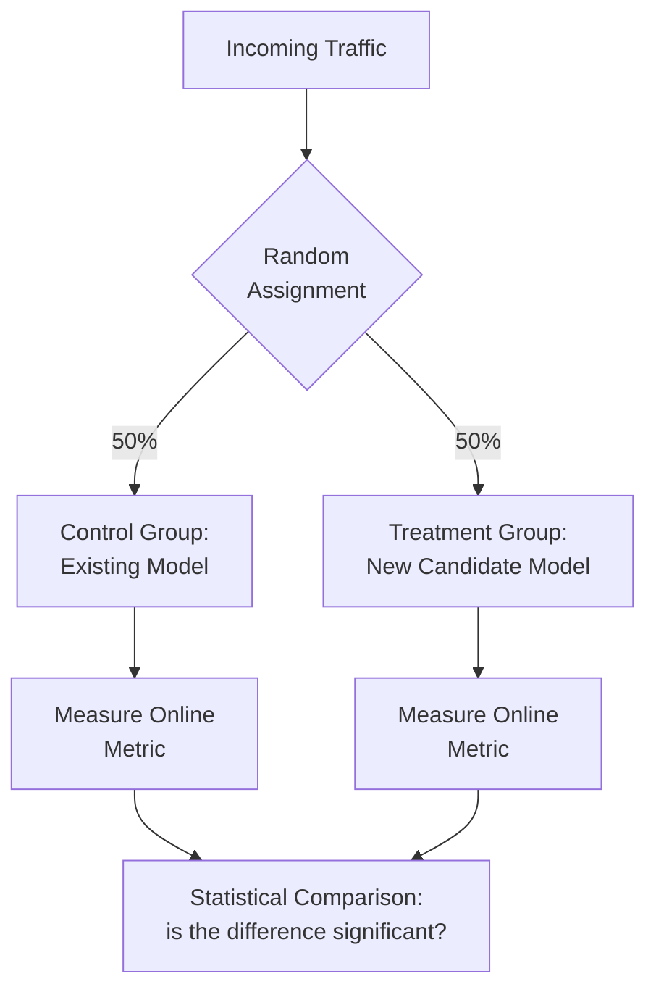
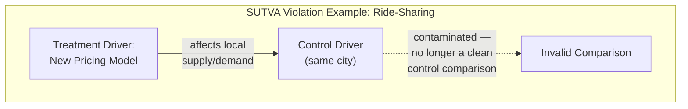

## Introduction

Chapter 21 covered offline evaluation — a necessary but, as its final section emphasized, insufficient signal of real-world value. This chapter covers the mechanism that actually validates whether a model improvement translates into genuine online/business impact: the **A/B test**, formally known as a randomized controlled experiment. A/B testing is the rigorous statistical backbone underneath the "online evaluation" tier from Chapter 6, and it deserves careful treatment because subtle mistakes here routinely lead teams to confidently ship models that don't actually help — or worse, quietly hurt — the business.

## The Core Idea

Randomly split incoming traffic (users, sessions, or requests) into two (or more) groups: a **control** group that experiences the current, existing system (or model), and a **treatment** group that experiences the new candidate. Because assignment is random, any systematic difference in the outcome metric between the two groups can be attributed to the change being tested, rather than to some other confounding factor — this randomization is what makes an A/B test a far stronger form of evidence than simply comparing before/after metrics without a controlled comparison group.



## Statistical Significance and Hypothesis Testing

An observed difference between control and treatment metrics could be a genuine effect, or it could be random noise. A **hypothesis test** formalizes this distinction:

- **Null hypothesis (H₀)**: there is no real difference between control and treatment.
- **p-value**: the probability of observing a difference at least as extreme as what you measured, *if the null hypothesis were actually true* (i.e., if there were no real effect).
- **Significance threshold (α)**: a pre-chosen cutoff (commonly 0.05) — if the p-value is below this threshold, you reject the null hypothesis and conclude the observed difference is statistically significant, unlikely to be due to chance alone.

```python
from scipy import stats
import numpy as np

def ab_test_significance(control_conversions: int, control_total: int,
                           treatment_conversions: int, treatment_total: int,
                           alpha: float = 0.05):
    """
    A two-proportion z-test — the standard approach for comparing
    conversion rates (or CTR, or any binary outcome) between two groups.
    """
    p_control = control_conversions / control_total
    p_treatment = treatment_conversions / treatment_total
    p_pooled = (control_conversions + treatment_conversions) / (control_total + treatment_total)

    se = np.sqrt(p_pooled * (1 - p_pooled) * (1 / control_total + 1 / treatment_total))
    z_score = (p_treatment - p_control) / se
    p_value = 2 * (1 - stats.norm.cdf(abs(z_score)))  # two-tailed test

    return {
        "control_rate": p_control,
        "treatment_rate": p_treatment,
        "relative_lift": (p_treatment - p_control) / p_control,
        "p_value": p_value,
        "significant": p_value < alpha,
    }
```

## Type I and Type II Errors

- **Type I error (false positive)**: concluding there's a real effect when there actually isn't one — controlled by your chosen significance threshold α.
- **Type II error (false negative)**: failing to detect a real effect that actually exists — related to **statistical power** (1 minus the Type II error rate), which depends heavily on sample size.

A common and costly mistake: running an A/B test with too small a sample size, finding no statistically significant difference, and concluding "the new model doesn't help" — when in reality, the test was simply **underpowered** to detect the (real, but modest) effect size that was actually present.

## Sample Size and Test Duration

Before running a test, you should calculate the **minimum sample size** needed to reliably detect a meaningful effect size, given your desired significance level and statistical power (commonly 80% or 90%). This calculation depends on the baseline conversion rate, the minimum effect size you care about detecting, and your traffic volume — determining how long the test needs to run.

```python
import statsmodels.stats.power as smp

def required_sample_size(baseline_rate: float, minimum_detectable_effect: float,
                           alpha: float = 0.05, power: float = 0.8) -> int:
    """
    Estimate minimum sample size PER GROUP needed to detect a given
    relative effect size, using a standard power analysis for
    comparing two proportions.
    """
    effect_size = smp.proportion_effectsize(
        baseline_rate, baseline_rate * (1 + minimum_detectable_effect)
    )
    analysis = smp.NormalIndPower()
    n = analysis.solve_power(effect_size=effect_size, alpha=alpha, power=power, ratio=1.0)
    return int(np.ceil(n))

# Example: baseline 5% conversion rate, want to detect a 10% relative lift
n_needed = required_sample_size(baseline_rate=0.05, minimum_detectable_effect=0.10)
print(f"Need approximately {n_needed} users per group")
```

A crucial, common mistake: **peeking** at results repeatedly before the pre-calculated sample size/duration is reached, and stopping the test as soon as it happens to look significant. This inflates the true false-positive rate far beyond your chosen α, because you're effectively running many small hypothesis tests (one at each peek) instead of one — a problem formally addressed by "sequential testing" methods, but most simply avoided by committing to the pre-calculated sample size and duration before starting.

## Common Pitfalls Specific to ML A/B Tests

### Novelty Effects

Users may temporarily engage more with a new model's output simply because it's *different*, not because it's genuinely better — an effect that typically fades after the initial period of exposure. Mitigation: run tests long enough to observe whether an initial lift persists or decays back toward baseline over subsequent weeks (Chapter 6's leading vs. lagging metric distinction is directly relevant here).

### Network Effects / Interference (SUTVA Violations)

Standard A/B test statistics assume the **Stable Unit Treatment Value Assumption (SUTVA)**: one user's assigned treatment doesn't affect another user's outcome. This assumption breaks down in systems with social or marketplace dynamics — e.g., a ride-sharing pricing model tested on a subset of drivers can affect the supply/demand balance experienced by *control-group* drivers too, contaminating the comparison. Mitigation: **cluster-based randomization** (randomizing by geographic region, or entire marketplace segments, rather than by individual user) to contain the interference within each randomized unit.



### Multiple Comparisons Problem

Testing many metrics (or many model variants) simultaneously increases the chance that *some* comparison will appear statistically significant purely by chance, even if no real effect exists anywhere — the more hypotheses you test, the higher your effective false-positive rate across the whole set of comparisons. Mitigation: correct for multiple comparisons (e.g., Bonferroni correction, which divides α by the number of comparisons), and, more fundamentally, pre-register a single primary metric before running the test rather than data-mining many metrics after the fact and reporting whichever one happened to look significant.

### Delayed / Long-Horizon Outcomes

Some important business metrics (like 90-day retention, or lifetime value) take far longer to materialize than the typical A/B test duration — directly echoing Chapter 6's leading-vs-lagging metric tension. Mitigation: use validated shorter-term leading metrics for fast iteration, paired with periodic longer-horizon holdout experiments (Chapter 6) to confirm the leading metric's improvements genuinely translate into the lagging business outcome over time.

## Structuring the Rollout: Connecting Back to Chapter 2

Recall the staged rollout process from Chapter 2's interview framework: shadow deployment (Chapter 23) → small-percentage A/B test → gradual ramp-up. This chapter's A/B testing rigor is what makes the middle stage trustworthy — a statistically well-designed A/B test, run for a properly calculated duration, with a pre-registered primary metric and guardrail metrics (Chapter 6) monitored throughout, is the actual evidentiary basis for the decision to proceed to full rollout.

## Key Takeaways

- A/B testing uses random assignment to isolate the causal effect of a model change from confounding factors — a fundamentally stronger form of evidence than before/after comparison.
- Statistical significance and power must be calculated *before* running a test, with a pre-committed sample size/duration to avoid the inflated false-positive risk of repeated peeking.
- ML-specific pitfalls include novelty effects (temporary lift that fades), SUTVA violations/interference in systems with marketplace or social dynamics (requiring cluster-based randomization), and the multiple comparisons problem from testing many metrics or variants at once.
- A/B testing is the statistical backbone of the online evaluation stage in the staged rollout process, providing the actual evidence needed to justify moving from a small test to a full production rollout.

---

## Interview Questions

**1. Why is a properly randomized A/B test considered stronger evidence than simply comparing a metric before and after deploying a new model?**
Randomization ensures that, on average, the control and treatment groups are statistically similar in every respect except for the one change being tested, so any observed difference in outcomes can be causally attributed to that change; a simple before/after comparison, by contrast, is confounded by anything else that changed between the two time periods (seasonality, concurrent marketing campaigns, external market conditions), making it impossible to cleanly attribute an observed metric change to the model update specifically rather than to any of these other simultaneously-occurring factors.
*Follow-up: In what scenario might a team be forced to rely on a before/after comparison despite its weaker causal evidence?*
When true randomization is genuinely infeasible — for example, a policy or pricing change that must be applied uniformly across an entire market for legal, competitive, or logistical reasons, preventing a proper control group from existing at all — in this case, a team might use a "difference-in-differences" or synthetic control approach (comparing the treated market's before/after change against a similar, untreated market's before/after change over the same period) as a partial mitigation, acknowledging it provides weaker causal evidence than a true randomized experiment but is still meaningfully better than a naive single-market before/after comparison alone.

**2. What does a p-value actually represent, and what's a common misinterpretation of it?**
A p-value represents the probability of observing a difference between groups at least as extreme as what was actually measured, assuming the null hypothesis (no real effect) is true — it's a statement about how surprising the observed data would be if there were truly no effect, not a direct statement about the probability that the null hypothesis itself is true or false. A common misinterpretation is treating a p-value of, say, 0.03 as "there's a 97% probability the new model is genuinely better" — this reverses the actual conditional logic of what the p-value measures, which is about the probability of the data given the null hypothesis, not the probability of the hypothesis given the data.
*Follow-up: Why does this misinterpretation matter practically, beyond being a technically imprecise way of speaking?*
This misinterpretation can lead to overconfidence in a single significant result — treating a low p-value as near-certain proof of a real, substantial effect can cause a team to skip additional validation (like a longer-horizon confirmation experiment) or to overstate the expected magnitude of the improvement to stakeholders, when in reality the p-value alone says nothing about the actual size or practical importance of the effect, only about the (in)consistency of the observed data with there being no effect at all — a statistically significant but practically tiny effect can still have a low p-value with a sufficiently large sample size.

**3. What is statistical power, and why might an A/B test that shows "no significant difference" actually be an inconclusive result rather than evidence that the new model doesn't help?**
Statistical power is the probability that a test will correctly detect a real effect, given that one actually exists — it depends on sample size, the true effect size, and the chosen significance threshold; if a test is underpowered (too small a sample size relative to the actual effect size present), it can easily fail to reach statistical significance even when a real, meaningful effect genuinely exists, simply because there wasn't enough data to reliably distinguish that real effect from random noise. In this scenario, "no significant difference" doesn't mean "no real difference" — it means "we don't have enough evidence either way," a critically important distinction that's often missed.
*Follow-up: How would you determine, after the fact, whether a "no significant difference" result was due to a genuinely negligible effect versus simply an underpowered test?*
Calculate the test's actual achieved statistical power retroactively, given the sample size that was actually collected and a specific effect size you'd consider meaningful (e.g., "would we have reliably detected a 5% relative improvement, if it existed, with the sample size we actually had?") — if the retroactive power calculation reveals the test was substantially underpowered for effect sizes that would still be business-meaningful, that's a signal the "no significant difference" result is genuinely inconclusive and the test should be extended or rerun with a larger sample, rather than treated as definitive evidence that the new model provides no benefit.

**4. Why is "peeking" at A/B test results before the pre-calculated sample size is reached, and stopping early if it looks significant, a serious statistical mistake?**
Each time you check the results and make a stop/continue decision, you're effectively running an additional hypothesis test, and the probability of at least one of these repeated checks showing a "significant" result purely by random chance — even when there's no real underlying effect — grows substantially higher than your originally intended significance threshold (e.g., a nominal 5% false-positive rate can inflate to 20-30% or more with frequent peeking and early stopping) — this means a team practicing this pattern will end up "confirming" false positive results far more often than their stated significance level would suggest, without realizing their actual error rate is much higher than intended.
*Follow-up: What's a legitimate, statistically sound way to allow for early stopping of an A/B test, if a team genuinely needs the ability to react quickly to interim results?*
Use a formally designed sequential testing methodology (such as a sequential probability ratio test, or Bayesian sequential testing approaches), which are specifically constructed to allow valid, statistically sound interim analysis and early stopping decisions while correctly controlling the overall false-positive rate across all the interim looks — this requires explicitly planning for and using these specialized statistical methods from the start of the experiment design, rather than simply monitoring a standard fixed-sample-size test's results informally and stopping early whenever it happens to look favorable.

**5. What is a novelty effect in the context of an A/B test, and how would you design your experiment to distinguish a genuine improvement from a temporary novelty effect?**
A novelty effect is a temporary increase in engagement or a metric simply because users are reacting to something new or different, independent of whether the change is genuinely, sustainably better — this effect typically fades as users become accustomed to the change, potentially reverting the metric back toward (or even below) the original baseline. To distinguish this from a genuine, durable improvement, you'd run the test for a sufficiently long duration and specifically examine the treatment effect's trend over time (rather than only looking at the aggregate effect across the whole test period) — a genuine improvement should remain stable or even grow as users continue to experience the change, while a pure novelty effect typically shows an initial spike that decays back toward baseline over the following days or weeks.
*Follow-up: What's a practical challenge in extending test duration specifically to rule out novelty effects, especially for a fast-moving product team?*
Extending test duration delays the team's ability to make a rollout decision and move on to the next iteration, directly trading off against development velocity and the opportunity cost of not yet fully benefiting from (or fully rejecting) the tested change — teams often need to balance this trade-off pragmatically, for example by using a shorter initial test to rule out clearly negative or clearly strongly positive results quickly, while reserving longer-duration novelty-effect-checking specifically for borderline or highly consequential changes where the risk of being misled by a fading novelty effect is high enough to justify the additional delay.

**6. What is SUTVA (Stable Unit Treatment Value Assumption), and describe a realistic scenario where it's violated in an ML system's A/B test.**
SUTVA assumes that one experimental unit's (e.g., one user's) assigned treatment doesn't affect another unit's outcome — that treatment and control groups don't interfere with or influence each other. This is violated in systems with genuine social, network, or marketplace interactions — for example, testing a new ride-sharing pricing algorithm on a random subset of drivers in a city can change the overall supply of available drivers in that city, which in turn affects wait times and pricing dynamics experienced by *control-group* drivers and riders in the same city too, meaning the control group's outcomes are no longer a clean, uncontaminated baseline unaffected by the treatment.
*Follow-up: How would cluster-based (or geographic) randomization address this specific SUTVA violation?*
Instead of randomly assigning individual drivers or riders to treatment/control (which allows interference within a shared local market), you'd randomize at the level of entire, sufficiently isolated clusters — for example, assigning whole cities or geographic regions entirely to either treatment or control — so that any interference effects (changes in supply/demand dynamics) are contained *within* each cluster and don't leak across the treatment/control boundary, since drivers and riders in a control-assigned city have no interaction with the treatment condition being tested in a different, treatment-assigned city, restoring a valid, uncontaminated comparison at the cluster level.

**7. Explain the multiple comparisons problem, and describe a scenario in ML system evaluation where it commonly arises.**
The multiple comparisons problem arises when you test many hypotheses (many different metrics, many different model variants, or many different subgroups) simultaneously — even if no real effect exists anywhere, the probability that at least one of these many comparisons will appear statistically significant purely by random chance increases substantially with the number of comparisons made, inflating your true overall false-positive rate well beyond your intended per-comparison significance threshold. This commonly arises in ML evaluation when a team tracks dozens of secondary metrics alongside a primary metric and, upon seeing the primary metric show no significant effect, searches through the many secondary metrics until finding one that happens to show a "significant" result, then reports that one as if it were the pre-planned focus of the analysis.
*Follow-up: What practice would you establish to prevent a team from falling into this trap, even unintentionally?*
Require pre-registration of a single, specific primary metric (and a small number of pre-specified guardrail metrics) before the experiment begins, with any other metrics examined afterward explicitly treated as exploratory/hypothesis-generating rather than confirmatory evidence — any promising pattern found in these exploratory secondary metrics should be treated as a new hypothesis requiring its own dedicated, properly-powered follow-up experiment to confirm, rather than being reported and acted upon as if it were confirmed evidence from the original experiment's data-mined result.

**8. Why is it important to calculate the required sample size and expected test duration before starting an A/B test, rather than simply running the test until "it feels like enough data"?**
Calculating the required sample size in advance, based on the baseline metric rate, the minimum effect size you actually care about detecting, and your desired statistical power, ensures you have a principled, pre-committed stopping point that provides adequate power to detect a business-meaningful effect if one exists, while also serving as the safeguard against the "peeking" problem discussed earlier — without this upfront calculation, a team either risks stopping too early (an underpowered, inconclusive test that gets misinterpreted as "no effect") or continuing indefinitely without a clear, principled endpoint, potentially wasting time and traffic on either an obviously conclusive result that could have stopped sooner, or an inconclusive one that needed to run much longer than intuition alone would have suggested.
*Follow-up: What information would you need to gather before you could actually perform this sample size calculation for a specific proposed A/B test?*
You'd need the baseline rate/value of the primary metric under the current system (e.g., current conversion rate), the minimum effect size (relative or absolute improvement) that would be considered meaningful enough to justify a rollout decision, the desired significance level (commonly 0.05) and statistical power (commonly 80-90%), and an estimate of the available traffic volume per unit time, which together let you calculate both the required total sample size and, given the traffic volume, translate that into an expected test duration in days or weeks.

**9. How would you handle a situation where an A/B test's primary metric shows a statistically significant improvement, but a guardrail metric (from Chapter 6) shows a significant, concerning regression?**
I would not proceed with a full rollout based on the primary metric improvement alone — the entire purpose of guardrail metrics is to catch exactly this kind of unintended collateral damage from optimizing a primary metric (Chapter 6's Goodhart's Law discussion), so a significant guardrail regression is a serious signal that needs investigation before any rollout decision; I'd investigate the root cause of the guardrail regression (is it a genuine, concerning side effect of the model change, or a separate, unrelated issue coincidentally occurring during the test period), and depending on the severity and nature of the finding, either reject the rollout, propose a modified version of the change that addresses the guardrail concern, or in some cases accept a rollout with the trade-off explicitly acknowledged and monitored, but never simply ignore a significant guardrail regression in favor of the more favorable-looking primary metric result.
*Follow-up: What would make it appropriate to still proceed with a rollout despite a guardrail metric regression, versus when it would clearly be inappropriate?*
It might be appropriate to proceed if the guardrail regression is small in absolute/practical terms (even if statistically significant, given a large enough sample size any tiny difference can become "significant"), and the primary metric's improvement represents a substantial, clearly business-justified gain that reasonably outweighs the modest guardrail cost, with an explicit plan to continue monitoring the guardrail metric post-rollout; it would be clearly inappropriate to proceed if the guardrail regression represents a serious, qualitative concern (e.g., a spike in a fairness-related guardrail metric, or a signal of genuine user harm) regardless of the primary metric's improvement, since some guardrail violations represent risks or values (safety, fairness, trust) that shouldn't be traded off against engagement or revenue gains at all.

**10. Why might a company choose to run a "holdback" or long-running holdout group even after a model has been fully rolled out to the rest of the population?**
A long-running holdout group — a small percentage of traffic permanently kept on an older baseline (or a simpler heuristic) even after the new model has been rolled out everywhere else — provides an ongoing, continuously available control group that lets the team measure the cumulative, longer-term effect of the model (and potentially several subsequent iterations of it) over a much longer time horizon than any single A/B test would typically run, directly addressing the delayed/long-horizon outcome challenge discussed in this chapter, and providing a way to periodically validate that faster-moving leading metrics used for day-to-day iteration are still tracking genuine long-term business value (echoing Chapter 6's proxy-chain validation) without needing to design and launch a brand-new dedicated experiment each time.
*Follow-up: What's the cost or trade-off of maintaining a long-running holdout group indefinitely?*
The holdout group is deliberately not receiving the benefit of the improved model (and any subsequent improvements built on top of it), representing a real, ongoing opportunity cost in terms of the metric/business value being foregone for that segment of users for as long as the holdout is maintained — companies typically balance this cost against the value of the ongoing measurement capability by keeping the holdout group relatively small (a small percentage of total traffic) and/or periodically retiring and refreshing the holdout (e.g., rotating which specific users are held out, or periodically confirming the holdout is still providing valuable signal before continuing to maintain it) rather than committing to an indefinitely fixed, unchanging holdout population.

**11. How would you design an A/B test to evaluate a new ranking algorithm for a two-sided marketplace (e.g., a food delivery platform matching restaurants and customers), given the SUTVA concerns discussed in this chapter?**
Given the strong potential for interference between treatment and control groups sharing the same local marketplace (a change to ranking affecting which restaurants get orders could shift restaurant capacity/availability in ways that affect other users in the same area regardless of their own assigned condition), I'd use cluster-based randomization at the geographic market level (e.g., randomizing entire cities or delivery zones to treatment or control, rather than individual users), ensuring the marketplace dynamics within each randomized cluster are self-contained and don't leak across the treatment/control boundary, even though this reduces the effective sample size (number of independent randomized units) compared to individual-level randomization.
*Follow-up: What's the practical statistical consequence of using cluster-based randomization instead of individual-level randomization, and how would you account for it in your sample size calculation?*
Cluster-based randomization has a much smaller number of independent randomized units (e.g., tens of cities rather than millions of individual users), which generally requires either a much longer test duration or accepting lower statistical power to detect a given effect size compared to individual-level randomization with the same number of underlying users, since the effective sample size for statistical purposes is closer to the number of clusters, not the number of individuals within them; sample size calculations for cluster-randomized experiments need to explicitly account for this reduced effective sample size and for potential correlation of outcomes within each cluster (a concept sometimes called the "design effect"), rather than naively using individual-level user counts as if each were an independent randomized unit.

**12. In a system design interview, how would you respond if asked to design an A/B test for a change you believe might have a very small, hard-to-detect effect size?**
I'd explain that detecting a small effect size reliably requires either a much larger sample size (potentially requiring a longer test duration, or applying to systems with high enough traffic volume to reach the needed sample size in a reasonable time) or accepting lower statistical power (a higher risk of a Type II error/false negative); I'd propose calculating the actual required sample size for the specific small effect size in question, and use that calculation to have an explicit, informed conversation about whether the available traffic and acceptable test duration can support reliably detecting an effect of that size — potentially concluding that, if the required sample size is genuinely infeasible given real traffic constraints, a different validation approach (like a longer-horizon holdout, or accepting a lower confidence threshold) might be more pragmatic than an underpowered, formally structured A/B test that would be unlikely to produce a conclusive result either way.
*Follow-up: What would you say to a stakeholder who's frustrated that testing for a small effect requires so much more traffic and time than testing for a large, obvious effect?*
I'd explain this using the core intuition of signal versus noise — a small, subtle effect is inherently harder to distinguish from the natural random variation that exists in any metric, and reliably telling a small real signal apart from that background noise fundamentally requires more data (more observations) to average out the noise sufficiently, much the same way you'd need more measurements to reliably detect a very slight difference in the weight of two similar objects compared to detecting an obvious, large weight difference — this isn't an arbitrary rule or overcautious statistical convention, but a fundamental, unavoidable consequence of how statistical inference from noisy, real-world data actually works.

**13. Why might a data scientist choose a Bayesian A/B testing approach over the traditional frequentist hypothesis testing approach described in this chapter, and what's a practical benefit this can offer?**
A Bayesian approach directly estimates the probability distribution of the true effect size (or the probability that treatment is actually better than control) given the observed data, which many practitioners find more intuitive to interpret and communicate to stakeholders than a frequentist p-value's more indirect, conditional-probability-based interpretation (addressed in an earlier question in this chapter); Bayesian methods also more naturally support principled sequential monitoring and early stopping without the same inflated false-positive risk that naive frequentist peeking introduces, since Bayesian inference updates a probability distribution incrementally as data arrives rather than relying on a single, fixed-sample-size hypothesis test framework.
*Follow-up: What's a trade-off or criticism of Bayesian A/B testing approaches that a team should be aware of before adopting them?*
Bayesian approaches require specifying a prior probability distribution (reflecting existing beliefs about the likely effect size before seeing the current experiment's data), and the choice of this prior can meaningfully influence the resulting conclusions, especially with limited data — a poorly-chosen or overly subjective prior can bias results in ways that are less immediately apparent than the more standardized, prior-free assumptions of frequentist hypothesis testing, meaning teams adopting Bayesian methods need to be thoughtful, transparent, and ideally use well-justified, defensible priors (or sufficiently "weak"/uninformative priors when appropriate) rather than treating prior specification as an arbitrary or purely subjective step in the process.

**14. How would you explain to a product manager why "we saw a 2% lift with a p-value of 0.04" doesn't necessarily mean the team should immediately roll out the change to 100% of users?**
I'd explain that statistical significance (p-value of 0.04) tells us the observed 2% lift is unlikely to be pure random chance, but it doesn't by itself confirm the effect is stable over a longer time horizon (ruling out novelty effects), doesn't confirm that important guardrail metrics haven't also shifted in a concerning direction, and doesn't account for whether a 2% lift is actually large enough to be worth the engineering and operational cost of a full rollout (statistical significance and practical/business significance are different things, especially with large sample sizes where even very small, practically unimportant effects can become statistically significant) — I'd recommend confirming the guardrail metrics look healthy, considering whether the effect has been observed to persist over a sufficient duration to rule out novelty effects, and explicitly weighing the practical magnitude of the 2% lift against the cost of full rollout, before treating this single result as sufficient grounds for an immediate, unconditional full rollout decision.
*Follow-up: What would a reasonable, staged next step look like, rather than either fully rolling out immediately or dismissing the result entirely?*
Following the staged rollout framework from Chapter 2, a reasonable next step would be to gradually ramp up the treatment's traffic allocation (e.g., from the initial test's smaller percentage to a larger percentage, but not immediately 100%) while continuing to monitor both the primary metric and guardrail metrics at this larger scale, confirming the effect holds up and no new issues emerge as exposure increases, before finally committing to a full 100% rollout — this staged approach captures most of the value of the promising result while retaining the ability to detect and roll back from any issues that only become apparent at larger scale or over a longer time horizon.

**15. How would you handle designing an A/B test for a genuinely novel feature (e.g., a brand-new AI capability) where you have no strong prior expectation of the likely effect size, making sample size calculation difficult?**
I'd start with a reasonable, conservative estimate of the minimum effect size that would be considered meaningful enough to justify shipping the feature (even without strong prior data, product/business stakeholders can usually articulate "we'd need to see at least X% improvement to justify this investment"), and use that business-defined threshold as the basis for the sample size calculation, rather than trying to precisely predict the actual expected effect size in advance; I'd also consider running an initial, smaller-scale pilot test specifically to get a rough, even if imprecise, empirical estimate of the likely effect size and its variance, which could then inform a more precisely-calculated, properly-powered follow-up test if the pilot suggests the feature shows enough promise to warrant that further, more rigorous investment.
*Follow-up: Why is using a business-defined "minimum meaningful effect size" a more robust approach than trying to guess the likely true effect size when calculating sample size for a genuinely novel feature?*
Guessing the likely true effect size for something genuinely novel, with no historical precedent, is highly unreliable and could lead to either a wildly underpowered test (if you guess too optimistically) or an unnecessarily large, resource-wasting test (if you guess too conservatively); using a business-defined minimum meaningful effect size instead grounds the sample size calculation in something the team can actually reason about with more confidence — "how much benefit would we need to see to justify this feature's ongoing engineering and maintenance cost" — rather than requiring an speculative, likely-inaccurate prediction about a genuinely unprecedented feature's actual real-world impact.
