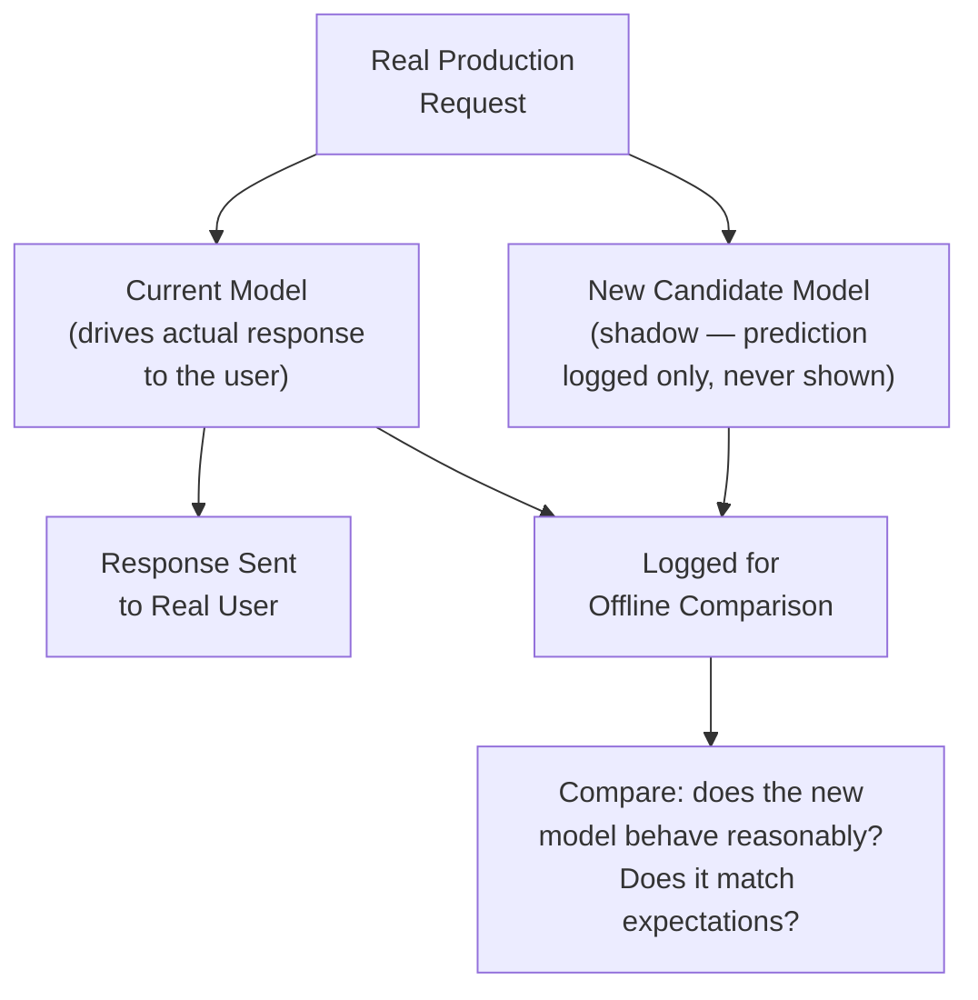
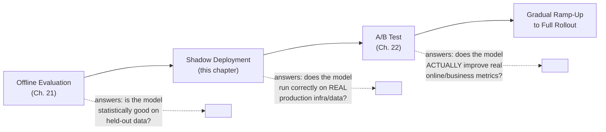
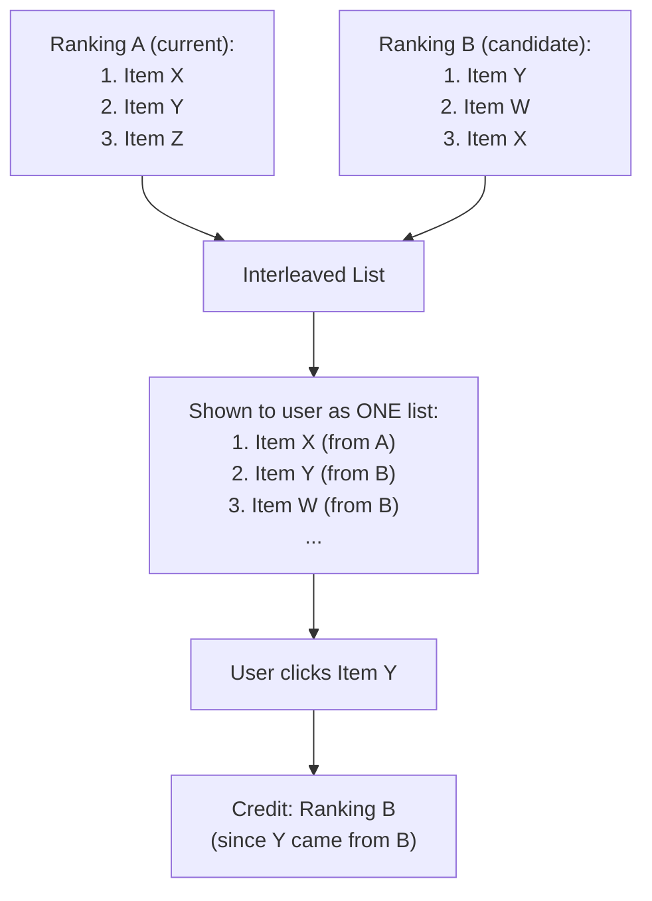

## Introduction

Chapter 22 covered A/B testing — the workhorse of online evaluation, but one that necessarily exposes real users to a new, unproven model. This chapter covers the stage that comes *before* that exposure: **shadow deployment**, which lets you validate a model against real production traffic with zero user-facing risk, plus related online evaluation techniques (canary releases, interleaving experiments) that fill out the complete staged-rollout picture first introduced in Chapter 2.

## What Is Shadow Deployment?

Shadow deployment (also called "shadow mode" or "dark launch") runs a new candidate model **alongside** the current production model, receiving the exact same real production requests, computing predictions in parallel — but the new model's predictions are only **logged and compared**, never actually shown to users or used to make real decisions. The production system continues to be driven entirely by the existing, proven model.



## What Shadow Deployment Uniquely Catches

This is precisely the mechanism Chapter 15 pointed to for catching training-serving skew that offline evaluation alone cannot reveal, because it's the *first* point in the pipeline where the new model encounters:

- **Real, live production infrastructure**: the actual online feature store (Chapter 13), the actual serving latency environment, the actual request format and edge cases — not a curated offline evaluation dataset.
- **Genuinely current data distributions**: unlike an offline evaluation set (necessarily somewhat stale, from Chapter 21), shadow traffic is today's real traffic, right now.
- **Infrastructure-level issues**: does the new model crash on some unexpected input format? Does it introduce unacceptable latency? Does it consume more memory than the serving infrastructure can handle at real production request volume? These are operational risks entirely separate from the model's statistical quality, and shadow deployment is the cheapest place to catch them.

Because shadow deployment produces zero user-facing impact even if the new model is completely broken, it's the natural first checkpoint after offline evaluation passes — and skipping it is one of the more common and costly rollout mistakes a team can make.

## What Shadow Deployment Cannot Tell You

It's important to be precise about the boundary here, since this is a common point of confusion: shadow deployment tells you whether the new model **runs correctly and produces reasonable-looking predictions** in the real production environment — it does **not** tell you whether the new model actually **improves the online/business metrics** that matter, because its predictions are never actually acted upon. A model could shadow-deploy flawlessly (no crashes, no latency issues, plausible-looking predictions) and still fail to improve — or even harm — the true business metric once it's actually used to drive real decisions. That causal question can only be answered by an actual A/B test (Chapter 22), where the new model's predictions are genuinely acted upon for a real subset of traffic.



## Practical Implementation of Shadow Deployment

```python
# A simplified illustration of a shadow-deployment request handler.
# The current production model's response is what's actually
# returned to the user; the shadow model's prediction is computed
# and logged, but never affects the response.

import time
import logging

logger = logging.getLogger("shadow_deployment")

def handle_request(request, current_model, shadow_model, feature_store):
    features = feature_store.get_online_features(request.entity_id)

    # Production path — this is what the real user actually experiences
    current_prediction = current_model.predict(features)

    # Shadow path — computed for logging/comparison ONLY
    try:
        shadow_start = time.monotonic()
        shadow_prediction = shadow_model.predict(features)
        shadow_latency_ms = (time.monotonic() - shadow_start) * 1000

        logger.info({
            "request_id": request.id,
            "current_model_prediction": current_prediction,
            "shadow_model_prediction": shadow_prediction,
            "shadow_latency_ms": shadow_latency_ms,
            "features": features,
        })
    except Exception as e:
        # Critically: a shadow model failure must NEVER affect the
        # real user-facing response. Log and move on.
        logger.error(f"Shadow model failed for request {request.id}: {e}")

    return current_prediction  # ONLY the current model's output is returned
```

A few critical implementation details this example highlights:
- **Isolation**: an exception in the shadow model's code path must never propagate to or delay the real user-facing response — this requires careful error handling and, ideally, running shadow inference asynchronously or on separate infrastructure so it can't create latency or reliability risk for real users.
- **Comprehensive logging**: capturing enough detail (predictions from both models, latency, input features) to support the kind of skew-detection diffing described in Chapter 15.
- **Resource cost awareness**: shadow deployment effectively doubles inference compute cost for the shadowed traffic (Chapter 5's cost discussion) — a real, ongoing expense that should be weighed against its risk-reduction value, typically justifying shadow deployment for major model updates rather than running it as a permanent default for every trivial change.

## Canary Releases

A related but distinct technique: rather than shadowing 100% of traffic with zero real impact, a **canary release** exposes the new model to a very small, real percentage of production traffic (e.g., 1%) and closely monitors for operational health (error rates, latency, crash rates) before deciding whether to proceed — named after the historical practice of using canaries to detect dangerous gas in mines before it affected miners.

**Canary vs. Shadow vs. A/B Test**:
- **Shadow**: zero real user impact, validates infrastructure/operational correctness only.
- **Canary**: small real user impact, primarily validates operational health (not necessarily statistical business-metric improvement) at real (if limited) production scale.
- **A/B Test**: real user impact on a properly randomized, statistically-sized population, specifically designed to validate business/online metric improvement with statistical rigor.

These three techniques are often used in sequence, each answering a different question, forming the complete staged-rollout pipeline from Chapter 2.

## Interleaving Experiments

A specialized online evaluation technique particularly relevant for **ranking systems**: rather than showing different users different rankings (as in a standard A/B test) and measuring aggregate metric differences between groups, **interleaving** shows a single user a *blended* ranking constructed by interleaving results from both the current and candidate ranking models, and observes which model's items the user actually engages with within that same blended list.

**Why it's valuable**: interleaving is dramatically more statistically sensitive than standard A/B testing for ranking comparisons — because every single user directly compares both rankings simultaneously (rather than being assigned to only one), interleaving requires far fewer users/impressions to reach statistical significance for a given effect size, which matters enormously for ranking changes with subtle effects that would otherwise require prohibitively large standard A/B test sample sizes.



## Choosing the Right Online Evaluation Technique

| Technique | Question Answered | Real User Impact | Statistical Sensitivity |
|---|---|---|---|
| Shadow Deployment | Does it run correctly on real infra? | None | N/A (not a statistical comparison) |
| Canary Release | Is it operationally healthy at small real scale? | Small, real | Low (not the primary purpose) |
| Standard A/B Test | Does it improve the target metric? | Real, at test scale | Moderate (needs proper sample size, Chapter 22) |
| Interleaving | Which ranking do users actually prefer? | Real, but blended | High (most sensitive for ranking specifically) |

## Key Takeaways

- Shadow deployment runs a new model against real production traffic with zero user-facing impact, validating operational/infrastructure correctness and catching training-serving skew — but it cannot validate actual business metric improvement, since its predictions are never acted upon.
- Canary releases expose a small percentage of real traffic to validate operational health at real (if limited) scale, distinct from a full A/B test's statistical business-metric validation purpose.
- Interleaving experiments are a specialized, highly statistically-sensitive technique for comparing ranking systems, requiring far fewer users than standard A/B testing to detect subtle ranking-quality differences.
- These techniques form a staged pipeline (shadow → canary → A/B test → gradual ramp-up), each answering a progressively more specific and more real-user-impactful question before full rollout.

---

## Interview Questions

**1. What specific question does shadow deployment answer, and what question does it explicitly NOT answer?**
Shadow deployment answers whether a new candidate model runs correctly, without crashing, within acceptable latency, and produces plausible-looking predictions when exposed to real, live production traffic and infrastructure — essentially validating operational and infrastructure-level correctness. It explicitly does not answer whether the new model actually improves the target online or business metric, since its predictions are only logged for comparison and never actually acted upon to drive a real user-facing decision — that causal, business-impact question requires an actual A/B test where the new model's predictions genuinely affect what real users experience.
*Follow-up: Why is it a mistake to skip the A/B testing stage entirely if a model performs flawlessly during shadow deployment?*
Flawless shadow deployment only confirms the model is technically reliable and infrastructure-compatible — it says nothing about whether the model's actual predictions, when genuinely acted upon, would produce better real-world outcomes for users or the business; a model could produce technically valid, non-crashing, low-latency predictions that are nonetheless worse (in terms of actual relevance, accuracy, or user satisfaction) than the current production model, a failure mode shadow deployment is structurally incapable of detecting since it never lets the new model's predictions actually influence any real decision or outcome.

**2. Why must a shadow model's failure or exception be carefully isolated from the real, user-facing response path?**
Since the entire premise of shadow deployment is zero real user-facing impact, allowing a bug, crash, or excessive latency in the untested shadow model's code to propagate into or delay the actual production response would completely defeat this core purpose, potentially causing real production incidents (increased latency, errors, or downtime for real users) precisely from the model that was supposed to be tested with zero risk — proper isolation (careful exception handling, ideally running the shadow inference asynchronously or on separate infrastructure/resources) is what makes shadow deployment's "zero risk" promise actually true in practice, rather than just true in theory.
*Follow-up: What's a concrete infrastructure pattern that would provide strong isolation guarantees for a shadow model, beyond simple try/except error handling in the main request path?*
Running the shadow model's inference as a completely separate, asynchronous process or service — for example, publishing the request/feature data to a message queue that a separate shadow-inference service consumes independently, entirely decoupled from the main production request-handling path's timing and resource constraints — ensures that even a severe failure, resource exhaustion, or extreme latency spike in the shadow model's inference has no possible mechanism to affect the main production path's response time or reliability at all, providing much stronger isolation than in-process error handling alone.

**3. How does a canary release differ from shadow deployment, given that both are lower-risk than a full A/B test?**
Shadow deployment involves zero real user impact — the new model's predictions are never actually shown to or acted upon by any real user, only logged for comparison; a canary release, by contrast, does expose a small percentage of real traffic to the new model's actual predictions/decisions, but at a small enough scale that any negative operational impact (crashes, elevated error rates, latency issues) affects only a limited number of real users and can be quickly detected and rolled back — canary releases are therefore validating real, if limited-scale, operational health under genuine usage, which is a meaningfully different and more real-world-grounded test than shadow deployment's zero-impact infrastructure validation.
*Follow-up: Why might a team choose to run both shadow deployment AND a canary release, rather than just one or the other?*
Shadow deployment first catches the most severe, obvious issues (crashes, major latency problems) with absolutely zero real user risk, providing an initial, very cheap safety filter; a subsequent canary release then validates operational health under genuine, real user interaction at small scale, which can reveal certain issues that shadow deployment might miss (e.g., how the model's actual predictions, now genuinely acted upon, interact with real downstream systems or user behavior in ways not fully captured by simply comparing logged predictions) — running both in sequence provides layered, progressively more realistic validation, each catching different classes of potential issues before committing to a full-scale A/B test.

**4. Why is interleaving described as more statistically sensitive than a standard A/B test specifically for comparing ranking systems?**
In a standard A/B test, each user is assigned to see results from only one of the two rankings being compared, meaning any observed difference in aggregate engagement metrics between the two groups must overcome the substantial natural variation in behavior between different users (some users are just naturally more or less likely to click regardless of which ranking they see); in interleaving, every single user sees a blended list combining results from both rankings simultaneously, so the comparison of which ranking's items get engaged with happens *within* the same user's single interaction, eliminating between-user variation as a source of noise in the comparison and requiring dramatically fewer total users/impressions to reliably detect a given true difference in ranking quality.
*Follow-up: What's a practical limitation of interleaving that prevents it from being used for every type of ML system comparison, not just ranking systems?*
Interleaving specifically relies on being able to meaningfully blend and interleave discrete, comparable items from two different rankings into a single combined list that still makes sense to show to a user — this works well for search results, recommendation lists, and similar ranked-item scenarios, but doesn't translate to other problem types like classification (there's no meaningful way to "interleave" two different fraud/not-fraud decisions for the same transaction) or generation (there's no clean way to interleave two different generated text responses into one coherent blended response), making interleaving a specialized technique specific to ranking system evaluation rather than a general-purpose alternative to standard A/B testing.

**5. Describe a realistic scenario where a model passes offline evaluation and shadow deployment cleanly, but still fails during the subsequent A/B test.**
A recommendation model could show strong offline evaluation metrics (good NDCG against historical relevance judgments) and clean shadow deployment behavior (no crashes, acceptable latency, plausible-looking recommendations logged) — but once genuinely deployed to real users in an A/B test, the recommendations, despite being individually "relevant" by the offline metric's definition, might lack diversity or introduce a filter-bubble effect that actually reduces overall user engagement or satisfaction in a way the offline relevance-focused metric never measured, revealing a gap between "individually relevant items" (what offline evaluation and shadow deployment can check) and "genuinely satisfying overall experience" (which only shows up once real users interact with and are influenced by the actual, acted-upon recommendations over time).
*Follow-up: What earlier chapter's concept does this scenario most directly illustrate, and how?*
This directly illustrates Chapter 6's discussion of the proxy-metric chain potentially breaking down (Goodhart's Law) — the offline NDCG metric served as a proxy for genuine recommendation quality, but optimizing for it without also considering the actual online/business metric (which captures effects like diversity and genuine long-term satisfaction that the offline proxy doesn't) led to a model that looked good on the proxy while failing on the true underlying goal, which is exactly why the full staged rollout process (offline → shadow → A/B test) exists rather than trusting offline evaluation and shadow deployment's operational-correctness checks alone.

**6. Why might a team decide NOT to use shadow deployment for every single model update, despite its safety benefits?**
Shadow deployment effectively doubles the inference compute cost for all shadowed traffic (since both the current and shadow models must run on every request), representing a real, ongoing infrastructure expense; for very minor, low-risk model updates (e.g., a small, well-understood hyperparameter retraining on the same architecture and feature set with a track record of predictable, safe updates), the operational risk that shadow deployment is designed to catch may be low enough that the added compute cost and engineering overhead of setting up and monitoring shadow deployment isn't justified, whereas for significant architectural changes, new feature additions, or the first deployment of a substantially different modeling approach, shadow deployment's risk-reduction value is much more clearly worth its cost.
*Follow-up: How would you establish a policy for a team to decide when shadow deployment is warranted versus when it can reasonably be skipped?*
I'd establish a risk-based policy tied to the nature and scope of the change — for example, requiring shadow deployment for any change involving a new feature source, a significant architecture change, or a first-time deployment of a new model type, while allowing routine, well-understood scheduled retrainings of an already-proven, stable model/feature set to skip shadow deployment and proceed more directly to canary/A/B testing — codifying this as an explicit, documented policy (rather than an ad-hoc, case-by-case judgment call) ensures consistent risk management practice across the team rather than relying on individual engineers' potentially inconsistent risk assessments each time.

**7. How would you use shadow deployment specifically to validate that a newly-built feature store (as discussed in the migration scenario from Chapter 13) produces consistent results with the legacy ad-hoc feature computation it's replacing?**
Run the new feature store's computed feature values in shadow mode alongside the existing legacy feature computation for the same real production requests, logging both sets of values without letting the new feature store's values actually affect any real production decision yet, and then systematically diff the two sets of values (using the same kind of skew-detection comparison introduced in Chapter 15) to identify and resolve any discrepancies before ever cutting production traffic over to rely on the new feature store — this is a direct, practical application of shadow deployment's core value (validating real-world behavioral consistency with zero user-facing risk) to a feature infrastructure migration rather than strictly a model rollout.
*Follow-up: What would you do if this shadow comparison revealed a small but consistent discrepancy between the legacy and new feature store's computed values for one specific feature?*
I'd investigate the root cause of that specific discrepancy — likely an implementation difference between the legacy ad-hoc computation and the new feature store's definition for that particular feature (echoing Chapter 15's implementation-divergence root cause) — and resolve it by aligning one implementation to match the other's intended, correct definition (ideally the new feature store's definition, if it more correctly reflects the feature's intended semantics) before proceeding to cut over, rather than allowing a known, unresolved discrepancy to be introduced into production, since even a small systematic discrepancy could meaningfully affect the model consuming that feature once it's genuinely relied upon in production.

**8. What role does logging play in making shadow deployment actually useful, beyond simply running the shadow model?**
Comprehensive logging of both the current and shadow models' predictions, the input features they received, latency, and any errors is what actually enables the subsequent comparison and analysis that gives shadow deployment its value — without this logging, you'd be running the shadow model's computation but have no way to systematically review, compare, or learn from its behavior relative to the current production model, effectively wasting the compute cost of running it at all; the logging infrastructure is arguably as important a component of a shadow deployment system as the actual parallel inference execution itself.
*Follow-up: What's a practical concern with logging every shadow prediction and its associated features at full production traffic volume, and how would you address it?*
At high production traffic volume, logging every single request's full feature vector and both models' predictions can generate a very large volume of log data, incurring meaningful storage and processing cost, and potentially raising the same privacy/PII considerations discussed in Chapter 11 if the logged features include sensitive information; a practical mitigation is to log only a representative sample of shadow traffic (rather than 100% of it) for detailed comparison purposes, sized appropriately using similar statistical reasoning to the sample size calculations from Chapter 22, while still applying appropriate anonymization/pseudonymization and retention policies to whatever sample is logged, balancing the need for sufficient comparison data against storage cost and privacy/governance requirements.

**9. How would you explain the value of shadow deployment to a stakeholder who says "if the model passed offline evaluation, why do we need this extra step before A/B testing?"**
I'd explain that offline evaluation runs against a fixed, historical, and necessarily somewhat stale dataset, computed and evaluated entirely outside the actual production serving environment — it can't catch issues that only manifest when the model encounters the real, live production infrastructure (the actual feature store, real request formats and edge cases, current traffic patterns and volume) it will actually run on, and it's specifically the kind of issue (crashes, unacceptable latency, unexpected behavior on live data) that, if first discovered during an actual A/B test exposing real users, would have real, immediate user-facing consequences; shadow deployment provides a zero-risk way to catch exactly these operational issues before any real user is ever exposed to them, which offline evaluation alone structurally cannot do.
*Follow-up: What would you say if the stakeholder pushed back further, arguing the extra shadow deployment step delays getting the model's real business benefit to users?*
I'd acknowledge the real trade-off between speed and risk-mitigation, but point out that a serious production incident caused by skipping this safety check (e.g., a crash or severe latency regression discovered only during a live A/B test affecting real users) would likely cause far more delay and harm — both to the immediate user experience and to the team's ability to move quickly and confidently on future model updates — than the relatively short, low-cost shadow deployment period itself; framing shadow deployment not as a bureaucratic delay but as a deliberate, evidence-based investment that actually enables faster, more confident iteration over time by catching costly issues early and cheaply, rather than expensively and publicly later.

**10. Why might interleaving experiments be particularly valuable for a search engine or recommendation system with relatively low overall traffic, compared to a standard A/B test?**
Standard A/B tests require a sample size large enough to reliably detect the effect size of interest given the natural between-user variance in the metric being measured (Chapter 22) — for a system with relatively low overall traffic, reaching this required sample size for subtle ranking quality differences could take an impractically long time; interleaving's much higher statistical sensitivity (since every user directly compares both rankings within a single interaction, eliminating between-user variance as a noise source) means a meaningful, statistically confident comparison can often be achieved with a much smaller total number of users/impressions, making it a particularly valuable technique specifically for lower-traffic systems where a standard A/B test's required sample size might otherwise be prohibitively slow to reach.
*Follow-up: Would interleaving be equally valuable for a very high-traffic system, or does its advantage diminish in that context?*
Interleaving's statistical sensitivity advantage remains real and valuable even for high-traffic systems (since even at high traffic, more sensitive tests can still detect smaller effect sizes, or reach the same confidence level faster, freeing up traffic/time for testing more variants), but the *practical urgency* of that advantage is naturally lower when a standard A/B test can already reach adequate statistical power in a reasonably short time simply due to the abundant available traffic — meaning interleaving remains a generally valuable technique for ranking system evaluation regardless of traffic volume, but its advantage is most acutely valuable and often decisive specifically in lower-traffic contexts where standard A/B testing would otherwise be impractically slow.

**11. How would you design the transition from shadow deployment to a full A/B test, in terms of infrastructure and process, to ensure a smooth handoff?**
I'd ensure the shadow deployment period has run long enough and across enough traffic to build reasonable confidence in the new model's operational stability (no crashes, acceptable latency, plausible predictions across a representative range of real production inputs) before proceeding; I'd then configure the A/B test's random traffic-splitting infrastructure to route a small, pre-calculated percentage of real traffic (per Chapter 22's sample size methodology) to actually use the new model's predictions (rather than just logging them), while continuing to monitor both the primary metric and guardrail metrics closely during this transition, treating the first days of the actual A/B test with extra vigilance (e.g., more frequent manual monitoring) even though the model has already cleared the shadow deployment safety check, since this A/B test stage is the first time the model's predictions genuinely affect real user experience.
*Follow-up: What specific monitoring would you want in place during this transition that goes beyond what was monitored during shadow deployment?*
Beyond the operational health metrics (latency, error rate) already monitored during shadow deployment, I'd add close monitoring of the actual online business/product metrics (Chapter 6) that the A/B test is specifically designed to evaluate, along with guardrail metrics, specifically because this is the first point at which the model's predictions genuinely drive real outcomes — shadow deployment's monitoring is purely about "does it run correctly," while the A/B test's additional monitoring is about "is it actually achieving the intended real-world improvement without unintended side effects," a fundamentally different and more consequential question that only becomes measurable once real users are genuinely exposed to the model's actual decisions.

**12. Why is it important to distinguish "canary release" as validating operational health rather than statistical business-metric improvement, even though both involve exposing real users to the new model?**
A canary release is typically too small in scale and too short in duration to provide the statistical power needed to reliably detect a genuine business-metric improvement or regression (the sample size and duration requirements from Chapter 22 still apply) — its primary and appropriately-scoped purpose is instead to catch severe, easily-detectable operational problems (crashes, error rate spikes, major latency regressions) at real, if limited, production scale, which don't require large sample sizes to detect since they represent large, obvious deviations rather than the subtle statistical effects a proper A/B test is designed to measure; conflating these two purposes risks a team either treating a canary's inconclusive "no obvious problem" result as false reassurance that the model actually improves the business metric (which it doesn't validate), or unnecessarily scaling up a canary to full A/B-test-level size and duration when its more limited, operational-health purpose didn't actually require it.
*Follow-up: What specific metrics would you monitor during a canary release that differ from the metrics you'd focus on during the subsequent A/B test?*
During a canary release, I'd focus primarily on infrastructure and operational health metrics — error rates, latency percentiles, resource utilization (CPU/memory), and any obvious crash or exception rates — looking for large, easily-detectable deviations from the current production baseline; during the subsequent A/B test, I'd shift focus to the actual online business/product metrics (conversion, engagement, or whatever the primary metric is) and guardrail metrics from Chapter 6, since validating genuine business impact — as opposed to basic operational health — is the A/B test's specific, statistically-rigorous purpose.

**13. In an interview, if asked to design the rollout process for a new fraud detection model, how would you sequence shadow deployment, canary release, and A/B testing, and why?**
Given fraud detection's high-stakes, asymmetric-cost nature (Chapter 3), I'd sequence all three stages deliberately and conservatively: first, a shadow deployment period long enough to validate the model runs correctly against real transaction volume and produces plausible-looking fraud scores without any operational issues; then a small canary release where the new model's decisions genuinely affect a small percentage of real transactions, closely monitored for both operational health and any obvious, severe issues (e.g., an unexpectedly high block rate that would suggest a serious problem); only then a properly-sized, statistically rigorous A/B test comparing the new model's actual fraud-catch-rate and false-positive-rate against the current production model, with guardrail metrics specifically monitoring customer complaint/support ticket rates, before finally a gradual, monitored ramp-up to full production traffic.
*Follow-up: Why is this full three-stage sequence particularly justified for a fraud detection system specifically, compared to a lower-stakes system like a content recommendation ranker, where a team might reasonably skip or abbreviate some stages?*
Fraud detection decisions can directly and immediately harm real customers (blocking a legitimate transaction) or cause direct financial loss (missing real fraud) the moment a flawed model is exposed to real decisions, with much higher-severity, harder-to-reverse consequences than a suboptimal content recommendation (which mostly just under-delivers on engagement, a comparatively lower-severity, more easily-corrected outcome) — this asymmetry in downside risk directly justifies a more conservative, fully-staged rollout process for fraud detection, whereas a lower-stakes recommendation system might reasonably move faster through an abbreviated version of this sequence (e.g., a shorter shadow period, or skipping a formal canary stage and moving more directly from shadow to a modestly-sized A/B test) given its comparatively lower downside risk per individual incorrect decision.

**14. How would you handle a situation where shadow deployment reveals that a new model's predictions differ substantially from the current model's predictions for a significant fraction of requests, without any obvious bug or error in either system?**
I'd investigate whether this divergence represents the new model genuinely learning a different, and hopefully better, decision boundary (a legitimate, expected outcome of training an improved model) versus an unexpected or concerning behavioral difference that warrants further scrutiny — this typically involves manually inspecting a sample of the specific cases where the two models diverge most significantly, checking whether the new model's predictions seem more reasonable or genuinely worse on those specific examples, and cross-referencing against offline evaluation results (Chapter 21) to see whether this divergence pattern is consistent with the improvements the new model was expected to provide based on its offline evaluation profile.
*Follow-up: Why is manual inspection of specific divergent cases valuable here, rather than relying solely on aggregate statistical comparison?*
Aggregate statistics (like "the new model's predictions differ from the old model's on 15% of requests") tell you *that* a divergence exists but not *why*, or whether it's a good or bad divergence — manually inspecting specific, concrete examples of where and how the two models disagree provides qualitative insight into the *nature* of the change (e.g., "the new model is more aggressive on this specific type of edge case, which seems like a genuine improvement" versus "the new model seems to behave erratically on cases with missing data, which is concerning") that aggregate statistics alone can't reveal, and this qualitative understanding is often essential for making a confident, well-informed decision about whether to proceed to the next stage of rollout.

**15. How would you explain, in an interview, the complementary relationship between shadow deployment, canary release, and interleaving/A-B testing as a unified risk-management strategy, rather than three unrelated techniques?**
I'd frame them as progressively answering different, increasingly consequential questions along a single risk-reduction spectrum: shadow deployment first asks "does this even work correctly on real infrastructure, with zero risk?"; canary release next asks "is it operationally healthy when genuinely exposed to a small slice of real usage?"; and interleaving or standard A/B testing finally asks "does it actually, statistically, improve the outcome we care about, when genuinely relied upon?" — each stage is specifically designed to catch a different class of potential problem (infrastructure/correctness issues, operational health issues, and genuine business-impact questions respectively) at progressively increasing but still carefully controlled levels of real-world exposure and risk, together forming a coherent, layered defense against shipping a bad model, rather than being three redundant or interchangeable options to choose between.
*Follow-up: Why does presenting this unified, staged framing tend to be more convincing to an interviewer than describing each technique in isolation?*
Presenting the techniques as a unified, purposefully-sequenced risk-management strategy demonstrates systems-level thinking about the entire rollout process as a coherent whole, rather than just listing individual tools or techniques the candidate happens to know about — this kind of integrated, purpose-driven framing is exactly what distinguishes a senior engineer's understanding (who thinks about how techniques compose together to solve a broader problem) from a more junior understanding (who might know individual techniques exist but not necessarily how or why they specifically fit together into a deliberate, complete strategy), which is precisely the kind of judgment AI System Design interviews are designed to surface.
