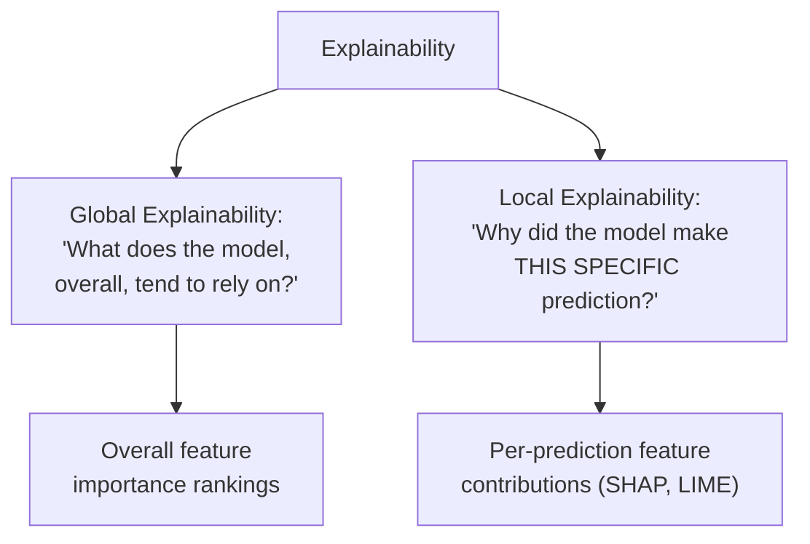
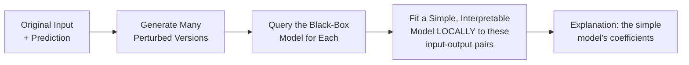

## Introduction

Chapters 21-23 answered "is this model good?" This chapter answers a different, equally important question: "*why* did this model make this specific decision?" Model explainability has moved from a nice-to-have to a hard requirement in many production contexts — regulatory (credit decisions), operational (debugging a surprising prediction), and trust-building (helping a human reviewer decide whether to override a model's recommendation). This chapter covers the core techniques (SHAP, LIME) and, just as importantly, the system design judgment about when explainability is actually required.

## Why Explainability Matters as a System Design Concern

Recall Chapter 6's discussion of interpretability as a hard requirement in regulated domains (lending, insurance, healthcare) — explainability isn't purely an academic or debugging interest, it's frequently a legal and product requirement that shapes model choice from the very start of a project, not an afterthought bolted on after a black-box model is already built. Beyond regulation, explainability serves several distinct practical purposes:

- **Debugging**: understanding *why* a model made a surprising or wrong prediction is often the fastest path to identifying a data quality issue (Chapter 10), a feature bug, or a training-serving skew problem (Chapter 15).
- **Building user/stakeholder trust**: a human loan officer, doctor, or content moderator is far more likely to appropriately trust (or appropriately override) a model's recommendation if they understand the reasoning behind it, rather than treating it as an opaque oracle.
- **Regulatory compliance**: laws like the US Equal Credit Opportunity Act require lenders to provide specific reasons for adverse credit decisions — a black-box model that can't produce a human-understandable reason is a genuine legal liability, not just a technical limitation.
- **Fairness auditing**: understanding which features drive a model's predictions is a prerequisite for the bias-auditing work covered in Chapter 25 — you can't investigate whether a model relies improperly on a proxy for a protected attribute if you can't see what it's relying on at all.

## Global vs. Local Explainability



- **Global explainability** describes the model's overall behavior — which features, on average, matter most across all predictions. Useful for high-level model understanding, sanity-checking that the model relies on sensible features, and communicating with stakeholders about the model's general logic.
- **Local explainability** describes a *single, specific* prediction — why did the model output this particular score for this particular input? Useful for debugging individual surprising cases, providing a specific customer or regulator with a reason for a specific decision, and supporting human-in-the-loop review workflows.

## Intrinsically Interpretable Models vs. Post-Hoc Explanation

Before reaching for a technique like SHAP or LIME, it's worth asking whether you need a **post-hoc explanation method** at all, or whether an **intrinsically interpretable model** (one whose structure is transparent by construction, like linear regression or a shallow decision tree) would satisfy your requirements directly. This is a genuine design trade-off: intrinsically interpretable models sacrifice some potential predictive accuracy in exchange for guaranteed, faithful transparency (a linear model's coefficients *are* the full explanation, with no approximation involved), while post-hoc methods let you use a more powerful "black-box" model (gradient boosted trees, deep neural networks) and *approximate* an explanation after the fact — an approximation that, unlike an intrinsically interpretable model's exact transparency, can itself be imperfect or occasionally misleading.

## LIME (Local Interpretable Model-agnostic Explanations)

**Core idea**: to explain a single prediction, LIME generates many small perturbations of the input (slightly modified versions of the same example), gets the black-box model's prediction for each perturbed version, and fits a simple, interpretable model (typically linear regression) to these perturbed input-output pairs *locally*, in the neighborhood of the original prediction — the simple local model's coefficients then serve as the explanation.



```python
# Simplified illustration of LIME's core idea for a tabular model
# (production use should rely on the `lime` library directly, which
# handles perturbation strategy and weighting far more carefully).

import numpy as np
from sklearn.linear_model import Ridge

def lime_explain(black_box_model, original_input: np.ndarray,
                   feature_stds: np.ndarray, num_samples: int = 500):
    # 1. Generate perturbed samples around the original input
    perturbations = original_input + np.random.normal(
        0, feature_stds, size=(num_samples, len(original_input))
    )

    # 2. Get black-box predictions for every perturbed sample
    predictions = black_box_model.predict(perturbations)

    # 3. Weight samples by proximity to the original input (closer = more weight)
    distances = np.linalg.norm(perturbations - original_input, axis=1)
    weights = np.exp(-(distances ** 2) / (2 * np.mean(distances) ** 2))

    # 4. Fit a simple, interpretable (linear) model to this LOCAL neighborhood
    local_model = Ridge(alpha=1.0)
    local_model.fit(perturbations, predictions, sample_weight=weights)

    return local_model.coef_  # these coefficients are the local explanation
```

**Strengths**: model-agnostic (works with any black-box model — trees, neural networks, ensembles), intuitive local approximation.

**Weaknesses**: the explanation depends on the perturbation strategy and neighborhood size chosen, which can produce somewhat unstable explanations (running LIME twice on the same prediction can give slightly different results); the local linear approximation can be a poor fit for a model with highly non-linear behavior in that specific region of the input space.

## SHAP (SHapley Additive exPlanations)

**Core idea**: grounded in cooperative game theory's **Shapley values**, which fairly distribute credit for an outcome among multiple contributing "players" — SHAP treats each feature as a "player" contributing to the difference between the model's actual prediction and its average (baseline) prediction, and computes each feature's fair share of that difference by considering all possible orderings in which features could be "added" to the prediction.

**Why this game-theoretic foundation matters**: SHAP values have mathematically guaranteed properties (efficiency: contributions sum exactly to the actual prediction's difference from baseline; consistency: a feature that always contributes at least as much in every possible scenario gets an SHAP value at least as high) that ad-hoc explanation methods don't guarantee — this theoretical rigor is a major reason SHAP has become the more widely trusted and adopted standard in production settings.

```python
import shap

# Works with tree-based models (TreeSHAP — exact and efficient),
# and also supports deep learning and other model types via
# different SHAP explainer variants (KernelSHAP, DeepSHAP).

explainer = shap.TreeExplainer(trained_gbm_model)
shap_values = explainer.shap_values(X_sample)

# Local explanation: why did the model predict this for a SPECIFIC example?
shap.force_plot(explainer.expected_value, shap_values[0], X_sample.iloc[0])

# Global explanation: aggregate feature importance across many predictions
shap.summary_plot(shap_values, X_sample)
```

**Strengths**: strong theoretical guarantees (consistency, local accuracy), works for both local (individual prediction) and global (aggregate) explanations using the same underlying framework, `TreeExplainer` variant is computationally efficient and exact for tree-based models specifically (a huge practical advantage, since gradient boosted trees are extremely common in production tabular ML).

**Weaknesses**: computing exact Shapley values is computationally expensive in general (exponential in the number of features) — practical implementations use approximations or model-specific optimizations (like `TreeExplainer`) to make this tractable; interpretation still requires some statistical literacy to communicate correctly to a non-technical audience.

## SHAP vs. LIME: A Practical Comparison

| Dimension | LIME | SHAP |
|---|---|---|
| Theoretical foundation | Local linear approximation, heuristic | Cooperative game theory (Shapley values), rigorous |
| Consistency guarantees | None | Yes (mathematically guaranteed) |
| Stability | Can vary between runs | More stable, especially with exact methods like TreeExplainer |
| Computational cost | Generally faster | Can be expensive for non-tree models (approximations needed) |
| Best fit | Quick, model-agnostic local explanations | Production systems needing rigorous, defensible explanations (e.g., regulatory contexts) |

## Explainability's Limits: What It Cannot Do

An important, often-tested nuance: an explanation method like SHAP tells you which features *contributed* to a specific prediction — it does **not** tell you whether the model's underlying reasoning is *correct*, *fair*, or *causally valid*. A model can have a perfectly coherent, internally consistent SHAP explanation (e.g., "this loan was denied primarily due to low credit score and high debt-to-income ratio") while still being systematically biased in ways that require the dedicated fairness-auditing techniques of Chapter 25 to detect — explainability and fairness are related but distinct concerns, and a clean-looking explanation should never be treated as proof of fairness on its own.

## Key Takeaways

- Explainability serves distinct practical purposes: debugging, building trust, regulatory compliance, and enabling fairness auditing — and in regulated domains, it's a hard requirement that shapes model choice from the start.
- Global explainability describes overall model behavior; local explainability describes a single specific prediction — different techniques and use cases call for different ones.
- LIME approximates a black-box model locally with a simple, interpretable model around a specific prediction; SHAP uses game-theoretic Shapley values to fairly attribute a prediction's difference from baseline across features, with stronger theoretical guarantees than LIME.
- An explanation reveals what a model relied on, not whether that reliance is correct, fair, or causally valid — explainability and fairness auditing (Chapter 25) are related but distinct, necessary complements.

---

## Interview Questions

**1. Why has model explainability become a hard system design requirement in certain domains, rather than a nice-to-have feature?**
In regulated domains like lending, insurance, and healthcare, laws often explicitly require that a decision-making entity provide specific, human-understandable reasons for an adverse decision affecting an individual (e.g., a denied loan application) — a black-box model that cannot produce such a reason isn't just a technical limitation, it's a genuine legal compliance failure that can expose the organization to real regulatory and legal risk, meaning the requirement for explainability must be factored into the model selection and system design process from the very beginning, not addressed as an afterthought once a high-performing but opaque model has already been built and deployed.
*Follow-up: How would this requirement change your model selection process compared to a domain without such regulatory requirements?*
In a regulated domain, I'd weigh explainability as an explicit, non-negotiable constraint alongside accuracy and latency from the very start of model selection — potentially favoring an intrinsically interpretable model (or a black-box model with a well-validated, production-grade post-hoc explanation method like SHAP already integrated into the serving pipeline) even at some cost to raw predictive accuracy, whereas in an unregulated domain I might more freely prioritize raw predictive performance and treat explainability as a secondary, debugging-focused concern rather than a hard, legally-mandated requirement shaping the model choice itself.

**2. What's the difference between global and local explainability, and when would you need each?**
Global explainability describes the model's overall behavior across all predictions — which features matter most on average — useful for high-level model sanity-checking, communicating general model logic to stakeholders, and initial fairness auditing screening; local explainability describes why the model made one specific prediction for one specific input, useful for debugging an individual surprising or contested case, and for providing a specific, individualized reason to a customer or regulator about a specific decision that affected them. You'd need global explainability when validating or communicating about the model as a whole, and local explainability when investigating or justifying any single, specific prediction.
*Follow-up: Could a model have a globally sensible explanation but a locally concerning one for a specific prediction? Give an example.*
Yes — a credit model might show, globally, that income and credit history are its most important features on average across the whole population (a sensible, expected overall pattern), while for one specific rejected applicant, a local SHAP explanation might reveal that a seemingly unrelated or subtly problematic feature (e.g., zip code, which can act as a proxy for a protected attribute) played an unusually large role in that particular individual's specific decision — this kind of local anomaly, invisible in an aggregate global view, is exactly the kind of case-specific issue that local explainability and fairness auditing (Chapter 25) are designed to catch.

**3. Explain the core mechanism behind LIME, and why it's described as a "local" explanation method.**
LIME generates many small, randomly perturbed variations of the specific input you want to explain, obtains the black-box model's prediction for each perturbed version, and then fits a simple, interpretable model (typically linear regression) to these input-output pairs, weighted by their proximity to the original input — the resulting simple model's coefficients serve as the explanation. It's described as "local" because this simple model is only fit to and only claimed to be accurate within a small neighborhood immediately surrounding the specific original input being explained, not as a general approximation of the black-box model's behavior across its entire input space.
*Follow-up: Why might running LIME twice on the exact same prediction produce somewhat different explanations?*
LIME's perturbation and sampling process involves randomness (which specific perturbed samples are generated, and potentially some randomness in fitting the local linear model), so two separate runs, even on the identical original input and identical black-box model, can sample a somewhat different set of perturbed points in the local neighborhood, leading to a slightly different fitted local linear model and therefore a slightly different explanation — this instability is a recognized limitation of LIME and a key reason SHAP, with its more rigorous and generally more stable theoretical foundation, is often preferred for production use cases requiring consistent, defensible explanations.

**4. What theoretical property do SHAP values have that LIME's explanations lack, and why does this matter practically?**
SHAP values are grounded in cooperative game theory's Shapley values, which guarantee properties like "efficiency" (the sum of all features' SHAP values exactly equals the difference between the actual prediction and the model's average/baseline prediction) and "consistency" (a feature that contributes at least as much to the prediction in every possible scenario is guaranteed to receive an SHAP value at least as high) — LIME's local linear approximation provides no such mathematical guarantees, since it's a heuristic approximation rather than a value derived from a rigorous theoretical framework. This matters practically because SHAP's guaranteed properties make its explanations more theoretically defensible and trustworthy for high-stakes uses (like regulatory compliance or fairness auditing), where an explanation method's explanations need to hold up to rigorous scrutiny rather than being merely a reasonable-seeming heuristic approximation.
*Follow-up: Does having these theoretical guarantees mean SHAP explanations are always more useful in practice than LIME's, in every scenario?*
Not necessarily in every scenario — SHAP's theoretical rigor generally makes it the better default choice for production, regulatory, or fairness-auditing use cases, but LIME's typically faster, model-agnostic computation can still be a practical advantage for quick, exploratory debugging scenarios (e.g., a data scientist wanting a fast, rough sense of what's driving a specific surprising prediction during interactive model development) where the added computational cost and complexity of a rigorous SHAP calculation isn't justified by the lower-stakes, exploratory nature of that specific use — the right choice still depends on the actual use case's stakes and requirements, not simply defaulting to the more theoretically rigorous option universally.

**5. Why is `TreeExplainer` (SHAP's tree-specific variant) particularly valuable in production ML systems, compared to the general-purpose `KernelExplainer`?**
`TreeExplainer` exploits the specific, known internal structure of tree-based models (like gradient boosted trees) to compute *exact* Shapley values efficiently, in polynomial rather than exponential time relative to the number of features, making it fast enough for practical, even real-time, production use; `KernelExplainer`, the general-purpose, model-agnostic SHAP variant, must approximate Shapley values through a more expensive sampling-based process (conceptually similar in spirit to LIME's perturbation approach) that doesn't scale as efficiently, especially for models with many features — since gradient boosted trees are extremely common for production tabular ML use cases, `TreeExplainer`'s efficient, exact computation represents a major practical advantage that directly enables using SHAP explanations at production scale for a large fraction of real-world tabular ML systems.
*Follow-up: What would you need to consider if you were using a deep neural network model instead of a tree-based model, and still wanted SHAP explanations?*
I'd need to use a different SHAP explainer variant specifically designed for neural networks (like `DeepSHAP`, which uses a different, more efficient approximation approach exploiting neural network structure, or `GradientExplainer`), since `TreeExplainer`'s specific optimizations don't apply to a fundamentally different model architecture — I'd also need to weigh the generally higher computational cost of neural-network-appropriate SHAP variants against my system's latency and cost requirements (Chapter 5), potentially deciding to compute and cache explanations offline/asynchronously rather than requiring them to be computed within the real-time serving latency budget, if live, on-demand explanation generation proves too expensive for the specific model and traffic volume involved.

**6. Why is it a mistake to treat a clean, coherent explanation (from SHAP or LIME) as proof that a model is fair or unbiased?**
An explanation method reveals *which features the model relied on and to what degree* for a given prediction — it doesn't independently verify whether that reliance is legitimate, causally valid, or free from encoding unfair bias against a protected group; a model could produce a perfectly coherent, internally consistent-looking explanation (e.g., "denied due to low income and high debt") while one of those seemingly legitimate features is itself a strong proxy for a protected attribute (e.g., income correlating strongly with a demographic characteristic in a specific population), or while the model's overall pattern of predictions still shows a disparate, unfair impact on a specific group even though each individual explanation looks reasonable in isolation — explainability and fairness require genuinely separate, dedicated analysis (Chapter 25), and a good-looking explanation should never be treated as a substitute for actual fairness auditing.
*Follow-up: How would you combine explainability techniques with fairness auditing techniques to get a more complete picture of a model's behavior?*
I'd use explainability techniques (like SHAP) to identify which features are driving the model's predictions in aggregate and for specific concerning cases, and then specifically use that information to inform fairness auditing — for example, checking whether any of the most influential features are known or suspected proxies for a protected attribute (Chapter 25's proxy-variable discussion), and separately, directly measuring the model's actual predictive outcomes across different demographic subgroups (independent of the explanation) to check for disparate impact — using explainability as a diagnostic input into the fairness investigation, rather than treating either technique in isolation as sufficient on its own to establish that a model is genuinely fair.

**7. How would you decide between using an intrinsically interpretable model (like logistic regression) versus a black-box model (like gradient boosted trees) with a post-hoc explanation method (like SHAP)?**
I'd weigh the specific accuracy gap between the two approaches (measured empirically, following Chapter 2's baseline-first principle) against the strength of the explainability requirement in the specific context — if regulatory or trust requirements demand guaranteed, exact transparency with zero risk of an imperfect approximation (e.g., a high-stakes, heavily-scrutinized credit decision context), an intrinsically interpretable model's exact, non-approximated transparency may be worth accepting some accuracy trade-off for; if the accuracy gap between the interpretable model and the more powerful black-box model is substantial, and a rigorous, well-validated post-hoc method like SHAP provides sufficient practical transparency for the actual regulatory or trust requirements at hand (which is often the case — SHAP explanations are widely accepted in many regulated contexts today), the black-box-plus-SHAP approach may capture most of the interpretability benefit while retaining significantly better predictive performance.
*Follow-up: Is this a decision you'd make once at the start of a project, or would you revisit it over the project's lifecycle? Why?*
I'd revisit it periodically rather than treating it as a permanently fixed, one-time decision — as post-hoc explanation methods and their acceptance within regulatory and industry contexts continue to evolve (SHAP's growing acceptance is itself a relatively recent development), and as the actual measured accuracy gap between interpretable and black-box approaches may change as more data accumulates or the problem's nature evolves, periodically reassessing whether the original trade-off decision still holds is a reasonable ongoing practice, rather than assuming a decision made early in a project's life necessarily remains optimal indefinitely.

**8. Describe a realistic scenario where local explainability would be the key tool for debugging a specific, surprising production prediction.**
A fraud detection model unexpectedly flags a long-standing, clearly legitimate customer's routine transaction as high-risk fraud — using a local explanation method (SHAP) on this specific prediction, an engineer could identify exactly which input features contributed most to this unexpectedly high fraud score (perhaps revealing that a recently-introduced feature computation bug caused a "days since last transaction" feature to incorrectly compute a large, anomalous value due to a timezone handling error), providing a direct, actionable path to identifying and fixing the root cause, rather than having to guess or manually inspect many possible causes without this targeted, prediction-specific diagnostic information.
*Follow-up: How does this debugging use case connect to the training-serving skew detection techniques discussed in Chapter 15?*
Local explainability can be a powerful complementary diagnostic tool alongside the direct feature-value comparison techniques from Chapter 15 — while Chapter 15's approach directly compares training-time versus serving-time feature values to detect skew, local explainability helps you understand *which* specific features, if skewed, would actually matter most for a given surprising prediction, helping prioritize where to focus a skew investigation (e.g., "this feature has an unusually high SHAP contribution for this surprising prediction — let's specifically check if it's suffering from implementation divergence between training and serving") rather than needing to exhaustively check every single feature for potential skew with no prioritization guidance.

**9. Why might a company choose to compute and cache explanations offline/asynchronously rather than generating them in real time as part of the online serving path?**
Computing rigorous explanations (especially SHAP values for non-tree models, or even TreeExplainer for very large models/feature sets) can introduce meaningful additional latency and compute cost on top of the model's own inference cost, which may not be acceptable within a real-time serving path's strict latency budget (Chapter 5) — if explanations aren't needed for every single prediction in real time (e.g., they're only needed when a human reviewer specifically requests a reason for a flagged case, or for periodic batch fairness auditing rather than live, per-request display), computing them asynchronously or on a batch/on-demand basis, decoupled from the latency-critical real-time prediction path, avoids this cost and latency impact on the primary serving path while still making explanations available when and where they're actually needed.
*Follow-up: In what scenario would real-time, synchronous explanation generation be genuinely necessary, despite the added latency cost?*
If the explanation must be displayed to the end user or decision-maker at the exact moment the prediction itself is delivered — for example, a loan application system that must immediately show the applicant specific reasons for a decision as part of the same user-facing interaction, rather than as a separate, delayed follow-up — real-time, synchronous explanation generation becomes a genuine functional requirement rather than an optional nice-to-have, and the system would need to be architected (potentially using a faster, if less universally accurate, explanation method, or a pre-computed explanation for common decision patterns) to meet this real-time requirement despite its added cost.

**10. How would you handle a situation where a business stakeholder wants a "simple, one-sentence explanation" for every model prediction, but the underlying SHAP analysis reveals that predictions are typically driven by complex interactions between many features rather than one dominant factor?**
I'd explain to the stakeholder that forcing a genuinely complex, multi-feature-driven prediction into an artificially oversimplified one-sentence explanation risks being actively misleading — presenting a single dominant "reason" for a decision that was actually the product of many contributing factors could create false confidence or an inaccurate mental model in whoever receives that explanation; I'd propose an alternative approach, such as surfacing the top 2-3 most influential contributing factors (still simplified, but more honestly representative of the actual multi-factor nature of the decision) rather than a single artificially-simplified factor, or providing a tiered explanation (a brief summary for quick review, with a more detailed breakdown available on request) that balances the stakeholder's desire for simplicity against the genuine complexity of the underlying model's actual behavior.
*Follow-up: Why is this tension between "genuinely faithful explanation" and "simple, easily digestible explanation" a recurring theme in explainability system design, rather than a one-off problem specific to this scenario?*
This tension reflects a fundamental trade-off inherent to explainability itself — the more faithfully an explanation represents a genuinely complex model's actual behavior, the more likely it is to itself be somewhat complex and nuanced (since a truly complex underlying reality can't always be honestly compressed into an arbitrarily simple form without losing important information), while stakeholders and end users generally want and need simple, quickly-digestible explanations for practical usability — this same tension recurs across nearly every explainability application (regulatory disclosures, customer-facing reason codes, internal dashboards), making the skill of finding an appropriate, honest balance between faithfulness and simplicity a core, recurring competency for anyone designing production explainability systems, not a problem that gets permanently solved once for a specific use case.

**11. In an interview, how would you respond if asked to design an explainability system for a deep learning-based image classification model used in a medical diagnosis support tool?**
Given the extremely high-stakes nature of medical diagnosis (where a clinician needs to understand and appropriately trust or challenge the model's reasoning) and the fact that deep learning models for images are inherently black-box, I'd propose using an appropriate post-hoc explanation method suited to image models specifically — such as SHAP's `DeepExplainer`/`GradientExplainer` variants, or specialized visual explanation techniques like Grad-CAM (which highlights which regions of an image most influenced the model's prediction, visually overlaid on the image itself) — providing both a visual, intuitive local explanation for each specific diagnosis prediction (which regions of this specific scan most influenced the model's assessment) that a clinician can directly inspect and cross-reference against their own clinical judgment, given that visual/spatial explanations tend to be far more immediately interpretable to a human reviewer for image-based tasks than a list of abstract feature importance values would be.
*Follow-up: Why might visual explanation techniques like Grad-CAM be particularly well-suited to this specific use case, compared to a generic tabular-style SHAP feature importance list?*
Grad-CAM's output — a heatmap overlaid directly on the original image, highlighting the specific spatial regions the model attended to — maps naturally and intuitively onto how a clinician already thinks about and reviews medical images (visually inspecting a particular region of concern), making the explanation immediately actionable and interpretable in the clinician's own existing visual/spatial mental framework; a generic tabular list of abstract feature importances (which would require first decomposing an image into some feature representation) would be a much less natural, less immediately useful form of explanation for this specific, inherently visual and spatial diagnostic task, even if it were technically computable.

**12. Why is explainability sometimes described as adding "engineering surface area" to a production ML system, and what should this imply for a team's design and testing practices?**
An explainability system (whether generating explanations in real time, in batch, or on-demand) is itself a piece of production infrastructure — with its own code, dependencies, potential failure modes, latency/cost impact, and need for testing and monitoring, just like the core prediction-serving system itself — meaning it introduces genuine additional engineering complexity and potential points of failure, not just a "free" add-on layered painlessly on top of an existing model; this implies that a team should treat their explainability system with the same rigor as any other production component — testing it for correctness (does it produce accurate, faithful explanations, not just plausible-looking ones), monitoring its performance and reliability, and planning for its failure modes (what happens if explanation generation fails or times out — should the underlying prediction still be served, or should a failure here block the response?) — rather than treating it as a lower-priority, best-effort feature.
*Follow-up: What would be an appropriate fallback behavior if an explanation-generation step fails or times out for a specific prediction, in a system where explanations are meant to accompany every user-facing decision?*
Generally, I'd design the system so a failure or timeout in explanation generation does not block or fail the underlying prediction itself (since the prediction is typically the primary, more critical piece of functionality) — instead falling back to either a generic, pre-written explanation template appropriate to the general type of decision, or clearly indicating to the requester that a detailed explanation is temporarily unavailable and will be provided separately once resolved, ensuring the core prediction functionality remains robust and available even if the supplementary explainability layer experiences an issue, following the same kind of graceful-degradation thinking applied to other non-critical-path system components discussed elsewhere in this series.

**13. How would you validate that a SHAP-based explanation is actually "correct" or trustworthy, rather than assuming its mathematical rigor automatically guarantees this?**
While SHAP's mathematical properties (efficiency, consistency) are guaranteed by construction relative to the specific model being explained, this doesn't automatically guarantee the explanation is *useful* or *intuitively correct* from a domain-expert perspective — I'd validate SHAP explanations by cross-referencing them against domain expert judgment for a sample of predictions (does a credit expert agree that the features SHAP identifies as most influential for a specific denied application actually make sense given their own understanding of credit risk?), and by checking that the global aggregate SHAP feature importance patterns align with reasonable domain expectations (e.g., confirming that income and credit history rank as highly important for a credit model, rather than some clearly spurious or nonsensical feature dominating unexpectedly, which would be a red flag suggesting either a genuine, concerning model issue or a bug in the explanation computation itself).
*Follow-up: What would a mismatch between SHAP's mathematical guarantees and a domain expert's intuitive judgment actually reveal — a flaw in SHAP, or something else?*
It would most likely reveal something genuinely interesting and worth investigating about the underlying model's actual learned behavior, rather than a flaw in SHAP's mathematical correctness itself — SHAP faithfully reports what the model actually relied on, so a mismatch with domain expert intuition suggests the model may have learned a genuinely different, and possibly problematic (or possibly a legitimately overlooked but valid), pattern from the training data than a domain expert would expect, which is exactly the kind of valuable, actionable insight explainability tools are meant to surface — prompting further investigation into whether the model's learned pattern reflects a genuine data quality issue, an overlooked but valid signal, or a fairness/bias concern, rather than simply distrusting SHAP's output as "wrong."

**14. Why might an organization need to maintain explainability capability not just for its currently-deployed model, but also for historical model versions?**
If a decision made months or years ago (e.g., a loan denial) is later challenged, audited by a regulator, or becomes the subject of a legal dispute, the organization may need to reproduce and explain the specific reasoning behind that historical decision using the exact model version that was actually in production at that time — not the current, potentially very different model version — requiring the organization to retain both the historical model artifacts themselves (tying back to the model registry and versioning concepts to be covered in Part 6/7) and the ability to run the appropriate explanation method against that specific historical model version on demand, potentially long after it's been superseded by newer model versions in actual production use.
*Follow-up: What infrastructure or practice would need to be in place to make this kind of historical explanation retrieval feasible, beyond just retaining the model artifacts themselves?*
Beyond retaining versioned model artifacts (a model registry, covered in later chapters), the organization would need to also retain the specific historical input feature values used for that specific historical prediction (tying back to the point-in-time correctness and feature store concepts from Chapter 13, and data retention/lineage practices from Chapter 11), since reproducing a faithful explanation requires being able to reconstruct both the exact model version AND the exact input it received at that historical point in time — without both pieces retained and properly linked together, a genuinely faithful historical explanation may not be reconstructible even if the model artifact itself is preserved.

**15. How would you frame the relationship between explainability (this chapter) and the offline/online evaluation techniques (Chapters 21-23) as complementary parts of a complete model evaluation and governance strategy?**
Offline and online evaluation (Chapters 21-23) answer "is this model's aggregate, statistical performance good?" — a necessary but insufficient foundation; explainability answers a different, complementary question — "can we understand, trust, and justify the *specific reasoning* behind individual predictions this model makes?" — which matters for regulatory compliance, debugging individual surprising cases, and as a diagnostic input into the fairness auditing covered next in Chapter 25; together, rigorous statistical evaluation and rigorous explainability form two necessary, complementary pillars of a mature model governance strategy — a model could pass every statistical evaluation check while still raising serious explainability, trust, or fairness concerns on individual cases, meaning neither pillar alone is sufficient without the other for genuinely responsible production ML system design.
*Follow-up: How would you prioritize investment between these two pillars (statistical evaluation rigor versus explainability infrastructure) for a team with limited resources, and does this priority depend on the specific use case?*
Yes, the priority genuinely depends on the specific use case's stakes and regulatory context — for a lower-stakes, purely engagement-optimization-focused system (e.g., a content recommendation ranker with no regulatory explainability requirement), I'd prioritize statistical evaluation rigor (proper A/B testing, guardrail metrics) more heavily, treating explainability as a valuable but secondary debugging tool; for a high-stakes, regulated, or trust-critical system (credit decisions, medical diagnosis support, content moderation with significant free-speech implications), I'd insist on comparable investment in both pillars from the start, since for these use cases, strong statistical performance without adequate explainability represents a genuine, potentially blocking gap in the system's real-world deployability and legitimacy, not merely a nice-to-have enhancement layered on top of an already-complete system.
