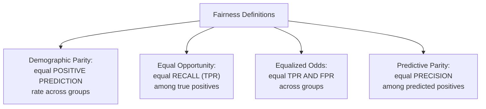

## Introduction

Part 5 closes with fairness and bias auditing — the discipline of systematically checking whether a model's predictions treat different groups of people equitably, and what to do when they don't. This builds directly on Chapter 24: explainability tells you *what* a model relies on; fairness auditing asks whether that reliance produces *equitable outcomes* across different subgroups. It's a genuinely hard topic — there is no single, universally agreed-upon mathematical definition of "fair" — but AI System Design interviews increasingly expect candidates to reason carefully about it rather than treat it as an afterthought.

## Why Bias Enters ML Systems

Bias isn't necessarily the result of a "biased algorithm" in the sense of deliberately unfair code — it typically enters through the data and problem-framing choices covered throughout this series:

- **Historical bias in training data**: if historical hiring decisions were biased against a group, a model trained to predict "who would have been hired" learns to reproduce that historical bias, even with a perfectly correct, unbiased training algorithm.
- **Sampling bias**: if training data underrepresents a subgroup (Chapter 7's population mismatch concern from Chapter 15 applies directly here), the model has less signal to learn accurate patterns for that subgroup, often resulting in systematically worse performance for it.
- **Proxy variables**: a feature that seems neutral (ZIP code, name, browsing behavior) can be strongly correlated with a protected attribute (race, gender, age) due to real-world societal patterns — a model can learn to effectively discriminate on a protected attribute *through* an apparently neutral proxy, without ever directly using the protected attribute itself as an input.
- **Label bias**: even the ground-truth labels themselves can encode bias — e.g., "was this employee rated highly by their manager" can reflect the manager's own biases rather than the employee's true performance.

## Defining Fairness: There Is No Single Answer

This is the single most important, and most commonly under-appreciated, fact in this entire chapter: there are multiple, mathematically **incompatible** definitions of fairness, and satisfying all of them simultaneously is, in general, mathematically impossible except in special cases. A strong interview answer acknowledges this tension explicitly rather than naming one metric as "the" fairness metric.

### Demographic Parity (Statistical Parity)

The model's positive prediction rate should be equal across groups — e.g., the approval rate for a loan model should be the same for every demographic group, regardless of each group's actual underlying rate of creditworthiness in the training data.

### Equal Opportunity

Among people who are genuinely qualified (true positives in the ground truth), the model's true positive rate (recall) should be equal across groups — e.g., among applicants who would actually repay a loan, the approval rate should be the same regardless of demographic group.

### Equalized Odds

A stricter version of equal opportunity: both the true positive rate *and* the false positive rate should be equal across groups — the model should be equally good at correctly approving qualified applicants *and* equally good at correctly rejecting unqualified applicants, across every group.

### Predictive Parity

Among people the model predicts positively, the actual positive rate (precision) should be equal across groups — e.g., among approved loan applicants, the actual repayment rate should be the same across demographic groups.



### The Impossibility Theorem

A landmark 2016 result (often associated with the ProPublica COMPAS controversy) proved that, except in the special case where the base rates (the true underlying prevalence of the positive outcome) are identical across groups, it is mathematically **impossible** to simultaneously satisfy predictive parity, equal false positive rates, and equal false negative rates across groups. This isn't a limitation of any particular algorithm — it's a mathematical fact about the structure of the problem. **This means choosing a fairness definition is fundamentally a value judgment about which trade-off matters most for your specific context, not a purely technical optimization problem** — a point worth stating explicitly and confidently in an interview.

## Auditing for Bias: A Practical Process

```python
import pandas as pd
import numpy as np

def audit_fairness(y_true: np.ndarray, y_pred: np.ndarray,
                     sensitive_attribute: np.ndarray) -> pd.DataFrame:
    """
    Computes group-level metrics needed to check demographic parity,
    equal opportunity, and predictive parity across subgroups defined
    by a sensitive attribute (e.g., race, gender — handled per
    Chapter 11's privacy/consent requirements for using such data).
    """
    results = []
    for group in np.unique(sensitive_attribute):
        mask = sensitive_attribute == group
        group_true, group_pred = y_true[mask], y_pred[mask]

        positive_rate = group_pred.mean()  # for demographic parity

        true_positives_mask = (group_true == 1)
        tpr = (group_pred[true_positives_mask] == 1).mean() if true_positives_mask.sum() > 0 else np.nan

        predicted_positives_mask = (group_pred == 1)
        precision = (group_true[predicted_positives_mask] == 1).mean() if predicted_positives_mask.sum() > 0 else np.nan

        results.append({
            "group": group,
            "n": mask.sum(),
            "positive_rate": positive_rate,       # demographic parity check
            "true_positive_rate": tpr,             # equal opportunity check
            "precision": precision,                # predictive parity check
        })

    return pd.DataFrame(results)

# A large disparity in ANY of these columns across groups is a signal
# requiring investigation — no single column tells the whole story.
```

A rigorous audit process:
1. **Identify relevant subgroups**: legally protected attributes (race, gender, age, disability status) where available and appropriate to analyze, subject to the privacy/consent constraints from Chapter 11.
2. **Compute group-level metrics** across multiple fairness definitions simultaneously (as above) — since no single definition tells the whole story, and a model can look fair by one definition while being unfair by another.
3. **Investigate disparities**: for any significant gap, dig into *why* — is it a proxy-variable issue (Chapter 24's explainability tools are directly useful here), a training data representation issue (Chapter 7), or a genuine, defensible difference in base rates?
4. **Decide on an appropriate response**: this is a socio-technical decision, not a purely technical one, often requiring input from legal, policy, and domain experts, not just ML engineers alone.

## Mitigation Strategies

- **Pre-processing**: adjusting the training data itself before training — re-weighting or re-sampling to correct for representation imbalance (Chapter 7), or explicitly removing known proxy variables (though this can be insufficient if enough *other* features jointly encode the same information).
- **In-processing**: modifying the training objective itself to explicitly penalize unfairness alongside the primary predictive loss — e.g., adding a fairness-constraint term to the loss function that's jointly optimized with accuracy.
- **Post-processing**: adjusting the model's output *after* training — e.g., applying different decision thresholds for different groups specifically calibrated to achieve a chosen fairness criterion (like equalized odds), without retraining the underlying model at all.

Each approach involves the same fundamental trade-off: improving a chosen fairness metric typically costs some amount of raw predictive accuracy — an explicit trade-off that should be measured, disclosed to stakeholders, and deliberately decided upon, not hidden or ignored.

## Fairness as an Ongoing System Design Concern, Not a One-Time Check

Just as Chapter 4 emphasized that the ML lifecycle is a loop, fairness auditing should be a **continuous, monitored practice**, not a one-time pre-launch checklist item — a model that passes a fairness audit at launch can drift into unfair behavior over time as the underlying population or societal patterns evolve (the same concept-drift mechanism from Chapter 10, now applied specifically to fairness metrics), making ongoing fairness monitoring in production a necessary complement to pre-launch auditing.

## Key Takeaways

- Bias enters ML systems through historical bias in training data, sampling bias, proxy variables, and label bias — not just through deliberately unfair algorithms.
- There are multiple, mathematically incompatible fairness definitions (demographic parity, equal opportunity, equalized odds, predictive parity) — the impossibility theorem proves you generally cannot satisfy all of them simultaneously, making the choice a value judgment, not a purely technical decision.
- A rigorous fairness audit computes multiple group-level metrics simultaneously, investigates the root cause of any disparity (proxy variables, data representation, or genuine base-rate differences), and involves non-technical stakeholders in deciding on an appropriate response.
- Mitigation can happen at the pre-processing (data), in-processing (training objective), or post-processing (output adjustment) stage — each trading some accuracy for improved fairness on a chosen metric, and fairness monitoring should be continuous, not a one-time pre-launch check.

---

## Interview Questions

**1. What are the main sources through which bias enters a machine learning system, and why is it inaccurate to describe bias as simply "a biased algorithm"?**
Bias typically enters through historical bias in training data (a model learns to reproduce biased patterns present in historical decisions), sampling bias (underrepresentation of a subgroup in training data leading to worse model performance for that group), proxy variables (seemingly neutral features that correlate strongly with a protected attribute), and label bias (ground-truth labels themselves reflecting human biases). Describing this as simply "a biased algorithm" is inaccurate because the algorithm itself (e.g., gradient descent, a tree-splitting criterion) is typically a neutral, correct mathematical procedure — the bias originates from the data, labels, and problem-framing choices humans made before the algorithm ever runs, meaning the fix generally lies in these upstream choices (data collection, label definition, feature selection) rather than in "fixing" the learning algorithm itself.
*Follow-up: Why does this distinction matter for how a team should approach fixing a discovered bias issue?*
If a team incorrectly believes the bias originates purely in "the algorithm," they might mistakenly try to fix it by switching to a different model architecture or training procedure, which wouldn't address the actual root cause; correctly understanding that bias typically originates in data, labels, or feature/proxy-variable choices directs remediation efforts toward the right place — investigating and potentially correcting the training data's representativeness, auditing for proxy variables, or reconsidering how the ground-truth labels were defined and collected — which is where the actual, addressable root cause of the bias usually lies.

**2. Explain the difference between demographic parity and equal opportunity as fairness definitions, and describe a scenario where a model could satisfy one but clearly violate the other.**
Demographic parity requires the positive prediction rate (e.g., loan approval rate) to be equal across groups, regardless of each group's actual underlying qualification rate; equal opportunity requires that, among people who are genuinely qualified (true positives), the model's rate of correctly identifying them (true positive rate/recall) is equal across groups, without requiring the overall positive prediction rates to match if the groups have genuinely different underlying qualification rates. A model could satisfy demographic parity (equal approval rates across two groups) while violating equal opportunity, if — due to genuinely different underlying qualification rates between the groups — achieving equal approval rates required the model to approve a higher proportion of unqualified applicants from the lower-base-rate group (or reject a higher proportion of qualified applicants from the higher-base-rate group) purely to force the approval rates to match, which would show up as unequal true positive rates between the groups despite the overall approval rates being equal.
*Follow-up: Which of these two definitions would be more appropriate for a hiring model, and why might reasonable people disagree on this choice?*
Reasonable people can genuinely disagree here — some would argue equal opportunity is more appropriate because it directly protects genuinely qualified candidates from every group from being disproportionately rejected (treating "equal treatment of the truly qualified" as the primary fairness concern), while others would argue demographic parity is more appropriate specifically to actively counteract historical, structural inequities that may have suppressed a group's "qualification" as measured by potentially biased historical criteria in the first place (treating "equal outcomes" as a deliberate, corrective goal); this disagreement reflects genuinely different underlying values about what fairness means and what a hiring process should be trying to achieve, which is precisely why this chapter emphasizes that choosing a fairness definition is a value judgment, not a purely technical decision with one objectively correct answer.

**3. What does the fairness "impossibility theorem" state, and why is it significant for how ML system designers should approach fairness?**
It states that, except in the special case where the base rates (true underlying prevalence of the positive outcome) are identical across the groups being compared, it's mathematically impossible to simultaneously satisfy predictive parity, equal false positive rates, and equal false negative rates across those groups — this is a mathematical fact about the structure of the problem, not a limitation of any specific algorithm or dataset. It's significant because it means a system designer cannot simply "solve fairness" by picking the right model or algorithm — they must consciously and explicitly choose which fairness definition(s) to prioritize, understanding that this choice inherently involves trading off against other, equally legitimate fairness definitions, transforming fairness from a technical optimization problem into an explicit value-based decision that should be made deliberately and transparently, ideally with input beyond just the ML engineering team.
*Follow-up: How would you communicate this impossibility result to a stakeholder who insists the team should "just make the model fair" without further specification?*
I'd explain, using a concrete example relevant to their specific system, that there are multiple different, individually reasonable definitions of "fair" that mathematically cannot all be satisfied at once except in unusual circumstances, and that "just make it fair" isn't actually a fully specified request until we've agreed on which specific definition of fairness matters most for this particular decision and its consequences — framing this not as an excuse to avoid the problem, but as a necessary, honest first step toward actually making a meaningful, well-reasoned fairness commitment, rather than pursuing an ill-defined and ultimately unachievable goal of satisfying every possible fairness definition simultaneously.

**4. What is a proxy variable in the context of fairness, and why can removing an obviously protected attribute from a model's input features fail to prevent unfair discrimination?**
A proxy variable is a feature that isn't itself a protected attribute (like race or gender) but is strongly correlated with one due to real-world societal patterns — such as ZIP code often correlating with race due to historical housing segregation patterns, or certain first names correlating with gender or ethnicity. Simply removing the protected attribute itself from the model's input features fails to prevent discrimination because the model can still learn to effectively discriminate on that protected attribute *indirectly*, through one or more correlated proxy variables that remain in the feature set — the model doesn't need direct access to the protected attribute to produce outcomes that are, in effect, discriminatory along that dimension.
*Follow-up: If removing individual proxy variables also proves insufficient, what more robust auditing/mitigation approach would you use instead?*
Rather than trying to exhaustively identify and remove every individual proxy variable (which is often infeasible, since many features can jointly encode proxy information even if no single feature does so strongly on its own), a more robust approach is to directly measure and audit the model's actual output-level fairness metrics (demographic parity, equal opportunity, etc., as covered in this chapter) across the protected groups themselves, using the protected attribute data solely for this auditing/monitoring purpose (subject to appropriate privacy and consent controls, per Chapter 11) rather than as a model input — this approach directly measures whether unfair outcomes are occurring in practice, regardless of the specific mechanism (a single strong proxy or many weak correlated features working jointly) by which that unfairness might be arising in the model's actual learned behavior.

**5. Why is fairness auditing described as requiring input from "non-technical stakeholders," rather than being purely an ML engineering decision?**
Because choosing which fairness definition to prioritize (per the impossibility theorem discussed earlier) is fundamentally a value-based judgment about what constitutes an acceptable and equitable trade-off for a specific real-world decision — this touches on legal requirements (which may mandate specific fairness standards for certain domains, like lending), organizational values and risk tolerance, and the lived impact on affected populations, all of which extend well beyond what a purely technical ML engineering assessment can or should determine on its own; involving legal, policy, ethics, and domain experts (and, ideally, representatives of affected communities where feasible) ensures the fairness definition and trade-off chosen reflects a genuinely considered, legitimate decision rather than an ML team's unilateral technical judgment about an inherently non-purely-technical question.
*Follow-up: What's a risk of an ML engineering team making this fairness-definition choice entirely on their own, without this broader input?*
An ML engineering team, however well-intentioned, may lack full visibility into the relevant legal requirements, the broader societal or organizational context and stakes of the decision, or lived experience of how a particular fairness trade-off actually affects different populations in practice — making a unilateral technical decision risks choosing a fairness definition that seems reasonable from a narrow technical perspective but is legally non-compliant, organizationally inconsistent with stated values, or genuinely harmful to an affected population in ways the team wasn't positioned to fully anticipate or evaluate on their own, underscoring why this decision benefits from genuinely cross-functional input rather than being treated as a purely internal ML engineering matter.

**6. How would you explain the difference between pre-processing, in-processing, and post-processing bias mitigation strategies, and give an example of each?**
Pre-processing mitigation modifies the training data itself before training begins — for example, re-weighting training examples so that underrepresented groups have proportionally more influence on the learned model, or explicitly removing known proxy variables. In-processing mitigation modifies the training process itself — for example, adding an explicit fairness-constraint penalty term to the loss function, so the model is directly optimized to balance predictive accuracy against a chosen fairness metric during training. Post-processing mitigation adjusts the already-trained model's outputs after the fact — for example, applying different, separately-calibrated decision thresholds for different groups specifically to equalize a chosen fairness metric (like true positive rate) across groups, without needing to retrain the underlying model at all.
*Follow-up: What's a practical advantage of post-processing mitigation over the other two approaches, in terms of implementation effort and flexibility?*
Post-processing mitigation can be applied to an already-trained, already-deployed model without requiring any retraining or access to the original training data or process — making it significantly faster and cheaper to implement and iterate on than pre-processing (which requires retraining on modified data) or in-processing (which requires retraining with a modified objective function) — and it offers the flexibility to potentially apply different fairness adjustments for different deployment contexts or as fairness requirements evolve over time, without needing to repeat the full, potentially expensive training process each time, though this convenience comes with its own trade-offs regarding how directly and effectively it can address bias compared to addressing it more fundamentally earlier in the pipeline.

**7. Why should fairness auditing be treated as an ongoing, continuous monitoring practice rather than a one-time pre-launch checklist item?**
Just as a model's general statistical performance can degrade over time due to data or concept drift (Chapter 10), the specific fairness properties of a model's predictions can also drift as the underlying population, societal patterns, or feature-label relationships evolve — a model that passed a rigorous fairness audit at launch could develop meaningful fairness disparities months or years later without any code change, simply due to this kind of drift, meaning a one-time pre-launch audit provides no ongoing guarantee about the model's fairness properties in production over its full deployed lifetime.
*Follow-up: What would a continuous fairness monitoring system need to track, in practice, beyond what a one-time pre-launch audit would check?*
It would need to continuously (or on a regular, scheduled cadence) recompute the same group-level fairness metrics (positive prediction rate, true positive rate, precision across groups) on live, current production data and predictions — not just the original training/evaluation dataset used at launch — comparing these metrics against both the original launch-time baseline and any organizationally-defined acceptable thresholds, with automated alerting if a significant, sustained disparity emerges, treating fairness metrics as a first-class category of production monitoring signal alongside the accuracy and drift monitoring already discussed in Chapters 10 and 32, rather than as a separate, one-time pre-launch exercise disconnected from ongoing production observability.

**8. How would you respond to a stakeholder who argues that using a protected attribute directly (e.g., explicitly considering race) as a model input, specifically to actively correct for a known historical bias, is a reasonable approach?**
I'd explain that this is a genuinely contested, actively-debated area both legally and ethically — some jurisdictions and contexts explicitly prohibit using protected attributes directly as model inputs regardless of intent (even a well-intentioned corrective use), viewing any direct use as itself a form of prohibited discrimination, while other perspectives argue that deliberately, transparently accounting for a protected attribute is sometimes necessary and justified specifically to counteract documented, systemic historical bias that would otherwise persist through proxy variables regardless; I'd emphasize that this decision has significant legal risk and ethical complexity that requires explicit legal and policy review before implementation, and is not a decision an ML engineering team should make unilaterally based on technical reasoning alone, directly reinforcing the cross-functional decision-making principle discussed earlier in this chapter.
*Follow-up: Regardless of the eventual policy decision, what technical practice would you recommend regardless, to ensure this decision (whichever way it goes) is well-informed?*
Regardless of whether protected attributes are ultimately used directly as model inputs, I'd recommend that the organization still collect and use protected attribute data (subject to appropriate privacy/consent controls per Chapter 11) for the purpose of *auditing* the model's fairness properties across groups — since, as discussed earlier, you can't properly measure and confirm whether a model's outcomes are fair or unfair across groups without this data available for auditing purposes, entirely independent of and separate from the different, more contested question of whether that same data should also be used as a direct model input, ensuring the organization can make a well-informed policy decision either way based on actual measured fairness outcomes rather than assumption.

**9. Describe a scenario where addressing a fairness disparity through post-processing (different thresholds per group) could itself raise a separate legal or ethical concern.**
In some jurisdictions and contexts, explicitly applying different decision thresholds to different demographic groups — even when done with the well-intentioned goal of achieving a chosen fairness criterion like equalized odds — can itself be legally considered a form of prohibited disparate treatment (treating individuals differently based on a protected attribute), even though the underlying intent is corrective rather than discriminatory; this creates a genuine tension where a technically sound fairness-improving mitigation strategy could simultaneously create a new legal exposure, illustrating why fairness mitigation decisions, like fairness definition choices, require careful legal review rather than being purely a technical implementation decision.
*Follow-up: How would this tension affect your recommended approach to bias mitigation for a system operating in a jurisdiction where explicit group-based threshold differentiation is legally prohibited?*
In such a jurisdiction, I'd focus mitigation efforts on pre-processing and in-processing approaches that don't require explicitly applying different decision rules to different groups at the point of final decision-making (e.g., improving training data representativeness, or incorporating a fairness-aware training objective that doesn't require knowing or using group membership at prediction/decision time), since these approaches can improve overall fairness properties of the model's single, group-agnostic decision rule without engaging in the kind of explicit, group-differentiated treatment at decision time that could raise the specific legal concern described — again underscoring the need for close legal consultation to navigate this kind of jurisdiction-specific constraint properly.

**10. Why is it important to compute multiple different fairness metrics simultaneously during an audit, rather than relying on just one?**
Given the impossibility theorem discussed earlier, a model can satisfy one fairness definition while clearly violating another — reporting only a single fairness metric (e.g., "our model achieves demographic parity") could create a false impression of overall fairness while masking a significant disparity along a different, equally legitimate fairness dimension (e.g., a large gap in true positive rates between groups); computing and reporting multiple fairness metrics simultaneously provides a much more complete, honest picture of the model's actual fairness properties and trade-offs, allowing stakeholders to make a genuinely informed decision about the specific trade-offs being made, rather than being presented with a potentially misleading, incomplete picture based on a single, cherry-picked metric.
*Follow-up: How would you present this multi-metric fairness picture to a stakeholder in a way that's honest about the trade-offs without being overwhelming or overly technical?*
I'd present a clear, structured summary showing each group's key rates (positive prediction rate, true positive rate, precision) side by side in an accessible table or visualization, explicitly calling out where meaningful disparities exist across different metrics, and framing the discussion around the specific, concrete trade-off the organization needs to decide on (e.g., "if we adjust to close this specific gap in approval rates, it would open up a different gap in accuracy for qualified applicants in group X — which trade-off aligns better with our stated values and legal obligations?") rather than presenting an overwhelming, undigested data dump of every possible fairness statistic without this contextualizing, decision-focused framing.

**11. How would you investigate whether a significant disparity found during a fairness audit stems from a genuine, defensible difference in base rates versus a genuine bias/fairness problem requiring mitigation?**
I'd start by examining whether the underlying ground-truth base rates (the true, actual prevalence of the outcome being predicted) genuinely differ between the groups in a way that's independently verifiable and not itself an artifact of biased historical data or label collection (tying back to the historical/label bias sources discussed earlier in this chapter) — if the base rate difference itself appears to stem from a legitimate, non-biased underlying cause, some disparity in metrics like predictive parity might be a mathematically expected and defensible consequence of that genuine base rate difference (per the impossibility theorem) rather than evidence of a fairness problem requiring correction; if, however, the base rate difference itself appears to stem from historical bias, sampling bias, or label bias in how the "ground truth" was originally established, then the disparity in the model's predictions is more likely reflecting and perpetuating that same underlying bias, warranting active investigation and likely mitigation.
*Follow-up: What makes this investigation genuinely difficult in practice, compared to how it might sound as a clean, two-branch decision process?*
In practice, it's often very difficult to cleanly determine whether an observed base rate difference between groups reflects a "genuine, unbiased" underlying reality versus itself being the product of historical, systemic bias accumulated over a long period through many indirect mechanisms (e.g., is a genuine difference in loan default rates between groups reflecting truly independent risk factors, or does it partly reflect the lasting effects of historical discriminatory lending or broader economic policies that shaped those groups' financial circumstances in the first place) — this kind of deep causal question often cannot be definitively answered through data analysis alone and requires substantial domain expertise, historical/sociological context, and often reasonable people can still disagree even after careful investigation, which is exactly why this determination shouldn't rest solely on the ML engineering team's technical analysis.

**12. In an interview, if asked to design a hiring recommendation system, how would you proactively incorporate fairness considerations into your system design answer, following the interview framework from Chapter 2?**
I'd raise fairness considerations at multiple points in the standard interview framework — during the "clarify requirements" step, I'd ask whether there are specific legal/regulatory fairness requirements relevant to hiring in the applicable jurisdiction; during the "data" step, I'd flag the risk of historical bias in past hiring decision data being used as training labels, and propose auditing the training data's representation across relevant groups; during the "evaluation and rollout" step, I'd explicitly propose computing multiple fairness metrics (not just overall accuracy) as part of the offline evaluation and ongoing monitoring plan; and I'd close by explicitly acknowledging the fairness-definition trade-off tension (per the impossibility theorem) as a decision requiring input beyond the technical team alone, rather than presenting fairness as an afterthought only addressed if the interviewer specifically raises it.
*Follow-up: Why does raising these fairness considerations proactively and specifically at these various inflection points, rather than as a single closing remark, tend to be viewed as a stronger interview signal?*
Weaving fairness considerations naturally into each relevant step of the design process demonstrates that fairness is genuinely integrated into how the candidate thinks about system design as a whole — treating it as a first-class design constraint on par with accuracy, latency, and cost throughout the entire design process — rather than appearing as an isolated, bolted-on afterthought mentioned once at the end purely to check a box; interviewers evaluating for senior or staff-level judgment specifically look for this kind of integrated, holistic thinking as a signal that the candidate would actually apply this same rigor consistently in real, unprompted production work, not just when explicitly asked about fairness in an interview setting.

**13. How would you handle a situation where improving a chosen fairness metric requires a measurable, non-trivial reduction in the model's overall accuracy, and a stakeholder is reluctant to accept that trade-off?**
I'd present the trade-off transparently and quantitatively — showing the specific, measured accuracy cost alongside the specific, measured fairness improvement achieved — and reframe the conversation around the actual, concrete real-world consequences of each option (e.g., "not making this adjustment means group X applicants who are genuinely qualified are being systematically approved at a lower rate than equally qualified applicants from other groups — is that an acceptable outcome given our stated values and legal obligations, weighed against this specific accuracy cost?"), helping the stakeholder understand this isn't merely an abstract technical trade-off but has a genuine, human impact on real people affected by the system's decisions, while still respecting that the final decision about which trade-off to accept is a legitimate business, legal, and ethical decision that appropriately involves stakeholders beyond the ML engineering team alone.
*Follow-up: What would you do if, after this transparent conversation, the stakeholder still insists on prioritizing accuracy over the fairness improvement, in a context with no specific legal fairness mandate?*
I'd ensure this decision, and the reasoning and trade-offs behind it, are clearly and explicitly documented (creating a paper trail that could be important for future accountability, especially if this decision is later challenged or scrutinized), and I'd continue to monitor and report the fairness metrics on an ongoing basis regardless of the decision, ensuring the disparity remains visible and isn't simply forgotten about — while ultimately respecting that, absent a specific legal requirement compelling a different choice, this kind of values-based trade-off decision legitimately belongs to those with the appropriate business, legal, and ethical authority to make it, not to the ML engineer alone, even if I might personally disagree with the specific decision made.

**14. How does the concept of fairness auditing extend (or change) when applied to a generative AI system, like an LLM-based content generation tool, compared to the classical binary classification examples used throughout this chapter?**
The core underlying concern — does the system treat different groups equitably — remains the same, but the specific manifestation and measurement approach differs substantially: rather than measuring group-level positive prediction rates or true/false positive rates (which assume a discrete classification outcome), fairness auditing for a generative system might involve examining whether generated content exhibits different quality, tone, or stereotypical patterns when generating content about or on behalf of different demographic groups (e.g., does a resume-writing assistant produce systematically lower-quality or more stereotyped output when given a name commonly associated with a particular demographic group), often requiring qualitative human evaluation or specialized bias-detection techniques (some previewed in Part 13's LLM safety discussion) rather than the more straightforward quantitative group-level metrics used for classification systems in this chapter.
*Follow-up: Why might detecting and mitigating this kind of generative-system bias be considered more challenging than the classification-system fairness auditing covered in this chapter?*
Classification-system fairness auditing benefits from clean, well-defined, quantifiable outcomes (positive/negative predictions, ground-truth labels) that map directly onto established statistical fairness metrics; generative system outputs are open-ended, high-dimensional, and don't have a single "correct" output to compare against (echoing Chapter 3's discussion of why evaluating generation problems is inherently harder than classification), making it much more difficult to define, measure, and mitigate bias in a rigorous, quantifiable way — requiring more qualitative, often more resource-intensive human evaluation approaches, or emerging but still less mature automated techniques specifically designed for this harder generative-bias-detection problem, a topic we'll return to more fully in Part 13.

**15. How would you summarize, for a junior engineer new to this topic, why fairness auditing deserves genuine, ongoing engineering investment rather than being treated as a purely legal/compliance checkbox handled by a separate team?**
I'd explain that while legal and policy involvement is essential (as emphasized throughout this chapter), the actual technical work of detecting, measuring, diagnosing, and mitigating fairness issues — building the auditing infrastructure, correctly interpreting the resulting metrics, investigating root causes like proxy variables or data representation gaps, and implementing chosen mitigation strategies — requires genuine ML engineering expertise and cannot simply be outsourced entirely to a non-technical compliance function; treating fairness as "someone else's job" risks the ML engineering team building systems without any technical fairness safeguards in place at all, only discovering serious issues after deployment when a compliance review (if one even happens) finally catches something that could have been identified and addressed much earlier and more cheaply through proactive, engineering-integrated fairness auditing built into the standard evaluation and monitoring practices covered throughout this Part.
*Follow-up: How does this framing connect back to the broader theme, introduced in Chapter 1, that most real-world ML project failures are engineering and process failures rather than purely modeling failures?*
Just as Chapter 1 argued that ML failures typically stem from missing engineering practices (no monitoring, no retraining pipeline, no proper rollout process) rather than a fundamentally flawed model architecture, a fairness failure typically stems from a missing *fairness-specific* engineering practice — no fairness auditing built into the evaluation pipeline, no ongoing fairness monitoring in production, no systematic process for investigating and responding to detected disparities — rather than being an unavoidable, inherent property of ML models themselves; this reinforces the series' consistent theme that building genuinely robust, responsible production ML systems is fundamentally about establishing the right engineering processes and infrastructure across the entire lifecycle, with fairness auditing being one more essential process to build in deliberately, not an exceptional, separate concern outside the normal scope of solid ML system engineering practice.
