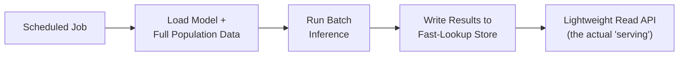
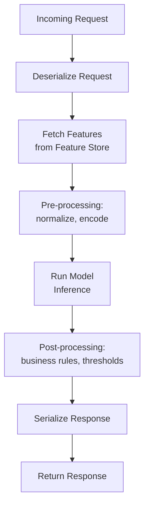
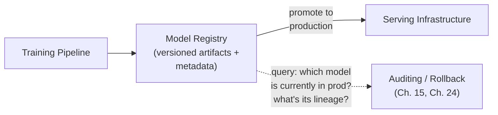

## Introduction

Parts 1-5 covered everything up to and including "we have a trained, evaluated, fair model we trust." Part 6 answers the next question: how does that model actually reach a real user or downstream system in production? This chapter surveys the core serving architectures, revisiting and deepening the batch/online/streaming distinction from Chapter 5 — now from the specific angle of *serving infrastructure* rather than the general inference-timing decision — and introduces the concept of a model server as a distinct piece of infrastructure.

## Revisiting Batch, Online, and Streaming — Now as Serving Architectures

Chapter 5 established *when* to compute predictions. This chapter focuses on the concrete infrastructure patterns that implement each choice at the serving layer specifically.

### Batch Serving

A scheduled job (Chapter 8's batch pipelines) loads a trained model, scores an entire population of entities, and writes results to a fast-lookup store. The "serving" component here is often just a lightweight read API in front of that pre-computed store — the actual model inference already happened offline.

### Online Serving

A dedicated **model server** process holds the model loaded in memory, ready to respond to individual prediction requests on demand, within a strict latency budget. This is the architecture most people mean by "model serving" by default, and the focus of most of this chapter and the next several.

### Streaming Serving

A stream processor (Chapter 8) continuously applies a model to each event as it arrives on a stream, emitting predictions as part of the stream processing pipeline itself, rather than in response to a discrete request/response cycle.

## Anatomy of an Online Model Server

Whatever specific technology is used, an online model server has a consistent set of responsibilities:

- **Request handling**: deserializing the incoming request (Chapter 27 covers the REST vs. gRPC choice for this).
- **Feature retrieval**: calling the online feature store (Chapter 13) to fetch the current feature vector for the entity in the request.
- **Pre-processing**: applying the exact same normalization/encoding logic used during training (Chapter 12) — reinforcing the training-serving consistency theme from Chapter 15 one more time, now specifically at the serving layer.
- **Inference**: running the actual forward pass of the model.
- **Post-processing**: applying business logic on top of the raw model output — e.g., converting a raw probability into a binary decision using a specifically-chosen threshold (Chapter 21), or applying business rules/overrides.
- **Response serialization and return**: packaging and returning the result within the latency budget.

## Model Servers vs. Rolling Your Own

You could, in principle, write a custom web server (e.g., a Flask app) that loads a model and exposes a prediction endpoint — and for simple cases, this is a completely reasonable starting point (again, the "start simple" principle from earlier Parts). But purpose-built **model serving frameworks** — TorchServe, TensorFlow Serving, NVIDIA Triton Inference Server (covered in full technical depth in Chapter 38) — provide substantial, non-trivial capability out of the box that a custom server would otherwise need to reimplement:

- **Multi-model serving**: hosting multiple model versions or entirely different models within a single serving process, with request routing between them.
- **Dynamic batching**: automatically grouping multiple incoming requests together into a single batched inference call to the underlying hardware, dramatically improving GPU utilization (Chapter 16) without requiring the client to construct batches itself.
- **Built-in versioning and hot-swapping**: loading a new model version into a running server without downtime, and supporting gradual traffic shifting between versions.
- **Standardized metrics and health-check endpoints**: out-of-the-box observability (Chapter 48) consistent across every model served, rather than each team building bespoke monitoring.

The decision of when to use a purpose-built model server versus a simple custom application mirrors the recurring "justify the complexity" theme throughout this series — a small, low-traffic internal tool may be well-served by a simple custom API, while a high-traffic, multi-model production system benefits substantially from the capabilities a dedicated model serving framework provides.

## The Model Registry: The Bridge Between Training and Serving

A **model registry** is the piece of infrastructure that formally connects the training pipeline (Parts 4-5) to the serving layer (this Part) — a versioned catalog of trained model artifacts, each tagged with metadata: which training run produced it, what data it was trained on, its offline evaluation metrics, and its current deployment stage (e.g., "staging," "production," "archived").

A model registry is what makes the staged rollout process from Chapter 2 (and the shadow deployment/canary/A-B testing sequence from Chapter 23) operationally manageable — instead of manually copying model files between environments, a model's stage transition (staging → canary → production) is a tracked, auditable, and reversible metadata update. We cover model registries in full depth in Chapter 43, once we've built up the serving vocabulary this chapter and the next few establish.

## Latency Budget Decomposition

Recall Chapter 5's latency budget table. In a real online serving system, that end-to-end budget must be decomposed across every step in the request pipeline above:

| Stage | Typical Latency Contribution |
|---|---|
| Network round-trip (client to server) | 1-20ms (depends on geography, connection) |
| Feature retrieval (online feature store) | 1-10ms |
| Pre-processing | <1ms |
| Model inference | 1-50ms (depends heavily on model complexity/hardware) |
| Post-processing | <1ms |
| Serialization + network return | 1-20ms |

If a system's overall latency SLA is, say, 100ms, this decomposition immediately reveals where optimization effort should focus — a common mistake is optimizing model inference speed (a genuinely hard, expensive problem) when the actual bottleneck is a slow feature store lookup (a comparatively cheap infrastructure fix, per Chapter 13's online store design).

## Stateless vs. Stateful Serving

Most classical ML model servers are **stateless**: each request is handled independently, with no memory of previous requests, which makes horizontal scaling (Chapter 29) straightforward — any server instance can handle any request. Some systems require **stateful** serving — e.g., a conversational system that must maintain context across multiple turns of a conversation (foreshadowing Part 8's LLM chat systems) — which requires either sticky session routing (ensuring a user's requests consistently reach the same server instance) or, more robustly, externalizing the state itself (into a fast store like Redis) so any server instance can retrieve it, keeping the servers themselves stateless while the conversation state lives elsewhere.

## Key Takeaways

- Batch, online, and streaming serving architectures implement the timing decision from Chapter 5 at the infrastructure level, each with a distinct request/response pattern.
- An online model server's core responsibilities are request handling, feature retrieval, pre/post-processing, and inference — and purpose-built serving frameworks provide substantial capability (multi-model serving, dynamic batching, hot-swapping) beyond what a custom-built server typically offers.
- A model registry bridges training and serving, making the staged rollout process (shadow → canary → A/B test → full rollout) an auditable, metadata-driven operation rather than manual file management.
- Decomposing the end-to-end latency budget across each serving stage reveals where optimization effort actually matters, which is often not where intuition first points.

---

## Interview Questions

**1. What are the three core serving architectures, and how does each map to the batch/online/streaming inference timing decision from Chapter 5?**
Batch serving pre-computes predictions on a schedule for a full population, storing results for fast lookup at request time (the actual model inference happens offline, ahead of any request); online serving runs the model on-demand, computing a fresh prediction for each individual incoming request within a strict latency budget; streaming serving continuously applies the model to events as they arrive on a stream, emitting predictions as part of the stream processing pipeline itself rather than in response to a discrete client request. Each is the serving-layer implementation of the corresponding timing decision made in Chapter 5, translating that conceptual choice into concrete infrastructure.
*Follow-up: Could a single production system use all three serving architectures simultaneously? Give an example.*
Yes — a recommendation system might use batch serving to pre-compute a broad candidate item pool overnight, online serving to re-rank that candidate pool in real time based on the current session's context when a user opens the app, and streaming serving to continuously update short-term behavioral features (like "items viewed in the last few minutes") that feed into the online re-ranking step — directly mirroring the hybrid inference architecture example given in Chapter 5, now viewed specifically through the lens of what serving infrastructure each component requires.

**2. What are the core responsibilities of an online model server, from request arrival to response return?**
Deserializing the incoming request, fetching the current feature vector for the relevant entity from the online feature store, applying pre-processing (normalization/encoding identical to what was used during training), running the actual model inference, applying post-processing (business rules, threshold-based decisions), and serializing and returning the response — all within the system's overall latency budget.
*Follow-up: Which of these steps is most directly connected to the training-serving skew risk discussed in Chapter 15, and why?*
The pre-processing step is most directly connected — if the normalization, encoding, or any other transformation applied to raw feature values at serving time doesn't exactly match the logic used during training (Chapter 12), the model receives inputs in a different form than it learned to expect, reproducing the classic implementation-divergence root cause of training-serving skew, just located specifically within the serving pipeline's pre-processing stage rather than the feature computation stage covered in earlier chapters.

**3. Why might a team choose a purpose-built model serving framework (like TorchServe or Triton) over a simple custom-built API server, and what capabilities would they gain?**
Purpose-built frameworks provide substantial out-of-the-box capability that a custom server would need to reimplement — multi-model serving (hosting several model versions or different models within one process, with routing between them), dynamic batching (automatically grouping concurrent requests into efficient batched inference calls to improve hardware utilization), built-in model versioning and hot-swapping (loading new model versions without downtime), and standardized metrics/health-check endpoints for observability — all of which represent significant engineering effort to build correctly and reliably from scratch in a custom server.
*Follow-up: In what scenario would a simple, custom-built API server still be the more appropriate choice, despite these missing capabilities?*
For a small-scale, low-traffic internal tool or an early-stage prototype serving a single model version with no immediate need for dynamic batching, multi-model hosting, or zero-downtime version swapping, the operational overhead and learning curve of adopting and correctly configuring a purpose-built serving framework may not be justified — a simple custom server (e.g., a lightweight Flask or FastAPI application) can be built and understood quickly, and the missing capabilities can be added later if and when the system's actual scale and requirements genuinely demand them, consistent with this series' recurring "start simple, escalate when justified" principle.

**4. What is dynamic batching, and why does it improve GPU utilization specifically, tying back to the hardware concepts from Chapter 16?**
Dynamic batching automatically accumulates multiple individual incoming inference requests that arrive within a short time window into a single, combined batch, which is then processed together in one inference call to the underlying model — GPUs are architecturally optimized for parallel computation across large batches (as established in Chapter 16), so running many small, individual single-example inference calls sequentially leaves most of the GPU's parallel compute capacity idle and underutilized, while combining them into a larger batch lets the GPU process many examples simultaneously, achieving dramatically higher throughput per unit of hardware cost.
*Follow-up: What's the trade-off dynamic batching introduces, and how would a serving framework typically let you tune it?*
Dynamic batching introduces a latency trade-off — waiting to accumulate a batch of requests before processing them adds some delay to any individual request compared to processing it immediately upon arrival, so most serving frameworks let you configure a maximum batch size and a maximum wait time (e.g., "wait up to 10ms to accumulate a batch, or process immediately with however many requests have arrived by then, whichever comes first"), letting a team explicitly tune the trade-off between throughput/hardware efficiency (favoring larger batches and longer wait times) and individual request latency (favoring smaller batches and shorter wait times) based on their specific system's latency budget and traffic volume.

**5. What is a model registry, and why is it described as "the bridge" between the training pipeline and the serving layer?**
A model registry is a versioned catalog of trained model artifacts, each tagged with metadata about its provenance (which training run and data produced it), its offline evaluation results, and its current deployment stage (e.g., staging, canary, production, archived) — it's described as "the bridge" because it's the specific piece of infrastructure that formally connects the offline training/evaluation work (Parts 4-5) to the actual serving infrastructure (this Part), turning the decision to promote a specific model version to production from an ad-hoc, manual file-copying operation into a tracked, auditable, metadata-driven action.
*Follow-up: How does a model registry make the staged rollout process from Chapter 2 more operationally manageable than it would be without one?*
Without a registry, promoting a model through the staged rollout stages (shadow → canary → A/B test → full production) would require manually tracking which specific model artifact is deployed where, with significant risk of confusion or error (e.g., accidentally deploying the wrong version, or losing track of which version was used for a specific historical decision, undermining the reproducibility discussion from Chapter 24); a model registry makes each stage transition an explicit, tracked, and reversible metadata update (e.g., changing a model version's tagged stage from "canary" to "production"), providing a clear, auditable record of exactly which model version was serving traffic at any point in time, and enabling fast, reliable rollback to a previous version if an issue is discovered.

**6. Why is it valuable to decompose an end-to-end serving latency budget across each individual stage of the request pipeline, rather than only measuring total end-to-end latency?**
Measuring only total end-to-end latency tells you *whether* you're meeting your SLA, but not *where* to focus optimization effort if you're not — decomposing the budget across stages (network, feature retrieval, pre-processing, inference, post-processing, response) reveals which specific stage is actually consuming the largest share of the latency budget, directing optimization effort to where it will actually matter, and avoiding the common mistake of investing significant effort optimizing model inference speed (an often difficult and expensive problem) when the real bottleneck is actually a slow feature store lookup or an inefficient serialization step (comparatively cheap and straightforward fixes).
*Follow-up: How would you instrument a production serving system to actually collect this stage-by-stage latency breakdown, rather than just guessing at where the bottleneck likely is?*
Add explicit timing instrumentation (timestamps or duration measurements) around each individual stage in the request-handling code — feature retrieval, pre-processing, inference, post-processing — and log or export these as separate, distinguishable metrics (e.g., using distributed tracing tooling, covered in Chapter 48's observability discussion) that can be aggregated and visualized (e.g., as percentile latency breakdowns per stage) in a monitoring dashboard, rather than relying on intuition or guesswork about which stage is likely the bottleneck without actual empirical measurement.

**7. What's the difference between stateless and stateful model serving, and why does statelessness make horizontal scaling easier?**
Stateless serving means each request is handled entirely independently, with the server retaining no memory of previous requests — any server instance in a pool can handle any incoming request, since no request depends on prior context held only by a specific instance; stateful serving requires the server to maintain some context or history across multiple related requests (e.g., a multi-turn conversation), meaning a request may need to be routed to the specific instance that holds the relevant prior context, or that context must be made available in some other way. Statelessness makes horizontal scaling easier because you can simply add more identical server instances and route requests to any of them (typically via a straightforward load balancer) without needing to worry about which specific instance a given request must reach — a stateful system either requires more complex "sticky" routing logic or an architecture change to externalize the state.
*Follow-up: How would you design a horizontally-scalable serving architecture for a system that genuinely needs to maintain conversational state across multiple requests, without sacrificing the scaling benefits of statelessness?*
Externalize the conversational state into a separate, fast, shared data store (like Redis) that any server instance can read from and write to, rather than holding the state in the memory of a specific server process — each incoming request includes an identifier (e.g., a session or conversation ID) that the handling server instance uses to fetch the relevant state from this shared store, process the request, and write back any updated state, keeping the server instances themselves stateless and horizontally scalable in the usual way, while still supporting genuinely stateful, multi-turn interactions through this externalized state layer — a pattern we'll see applied directly to conversational memory in Part 12's discussion of AI agent memory systems.

**8. Why might a batch-serving system's "read API" be described as a comparatively simple piece of infrastructure, even though the overall system (including the offline batch inference job) is complex?**
Because the actual, computationally expensive model inference work has already been completed offline, ahead of time, by the scheduled batch job — the "serving" component in a batch architecture only needs to perform a fast lookup of an already-computed result from a pre-populated store (e.g., a key-value store or database table), which is a comparatively simple, low-latency operation that doesn't require loading or running the model itself at request time at all, in contrast to an online serving system where the model inference itself must happen live, as part of handling each individual request.
*Follow-up: What's a risk of this architectural simplicity, specific to the batch serving pattern, that an online serving pattern doesn't share?*
The read API's simplicity means it will happily and quickly return a result even if that pre-computed result is significantly stale (e.g., if the scheduled batch job failed to run or completed with an error, but a previous, older result remains available in the lookup store) — this is precisely the "silent failure" and freshness-monitoring concern discussed in Chapters 4 and 13, and is a risk specific to the batch pattern, since an online serving system, needing to compute a fresh prediction on every request, would be more likely to visibly fail or error out if something upstream (like feature retrieval) were genuinely broken, rather than silently continuing to serve an old, undetected-as-stale result.

**9. How would you decide, for a new ML feature at a startup, whether to invest in a purpose-built model serving framework from the very start, versus starting with a simple custom server?**
I'd apply the same "start simple, escalate when justified" principle used throughout this series — starting with a simple custom server (e.g., FastAPI serving a single model) is usually the right initial choice for a startup validating a new feature's value, since it minimizes upfront engineering investment and learning curve while the actual business value and traffic patterns are still being established; I'd plan to revisit this decision and migrate to a purpose-built serving framework once concrete signals justify the additional investment — for example, a genuine need for multi-model serving as the product grows to support several models, a measured GPU utilization problem that dynamic batching would directly address, or operational pain from manually managing model version deployments that a framework's built-in versioning would solve.
*Follow-up: What specific technical debt or migration risk should the team be aware of if they defer this decision, and how would you mitigate it?*
Building serving logic tightly coupled to a specific custom implementation (rather than following reasonably clean, framework-agnostic separation between the model inference logic and the request-handling/API layer) can make a later migration to a purpose-built framework more costly and disruptive than necessary; mitigating this involves maintaining a clean architectural separation from the start — keeping model loading, pre/post-processing, and inference logic as clearly isolated, testable components independent of the specific web framework or serving mechanism currently wrapping them — so that migrating to a purpose-built serving framework later primarily involves swapping out the outer request-handling layer, rather than requiring a substantial rewrite of the core inference logic itself.

**10. Why is "which model is currently serving production traffic" a question that should be answerable through metadata (a model registry) rather than requiring a code or file-system investigation?**
Requiring a manual code or file-system investigation to determine which model version is currently live is slow, error-prone, and doesn't scale as the number of models, versions, and deployment environments grows — it also critically undermines incident response and debugging (if a production issue is suspected to stem from a recent model update, you need to be able to quickly and confidently confirm exactly which model version was actually serving traffic at the time of the issue) and undermines the reproducibility needs discussed in Chapter 24 (explaining a historical decision requires knowing exactly which model version made it); a model registry answers this question directly and reliably through structured, queryable metadata, rather than requiring ad-hoc investigation each time the question arises.
*Follow-up: How does this connect to the auditing and compliance concerns discussed in earlier chapters, like Chapter 11's privacy/governance discussion or Chapter 24's explainability discussion?*
Both of those chapters' concerns depend on being able to precisely and reliably identify which specific model version (and, by extension, which specific training data and code) produced a particular historical decision — Chapter 11's data governance and Chapter 24's explainability/reproducibility needs are only fully addressable if the organization can confidently answer "exactly which model was live at this point in time," which is precisely the structured, auditable record a model registry is designed to provide; without it, both governance and explainability efforts would be working from an unreliable or incomplete picture of the system's actual historical behavior.

**11. In a system design interview, how would you use the latency budget decomposition table from this chapter to guide a discussion about serving architecture for a real-time fraud detection system with a 50ms SLA?**
I'd walk through each stage of the request pipeline — network round-trip, feature retrieval, pre/post-processing, inference, response serialization — and allocate a rough latency budget to each based on the 50ms total constraint, explicitly identifying which stages are likely to be the tightest constraints (e.g., feature retrieval from an online store needs to be very fast, likely single-digit milliseconds, leaving room for a somewhat more complex model's inference time) — using this decomposition to justify specific architectural choices, such as needing a well-optimized online feature store (Chapter 13) and potentially a lighter-weight model architecture or model compression technique (Chapter 28) if a more complex model's inference time alone would consume too much of the available 50ms budget.
*Follow-up: How would this latency budget discussion change if the interviewer told you the fraud system needed to also incorporate a call to an external, third-party data provider as part of its feature computation?*
I'd flag this as a significant latency risk immediately, since a call to an external, third-party service is generally much less predictable and controllable in latency than an internal feature store lookup, and could easily consume a large, uncertain portion of the 50ms budget on its own, or even occasionally exceed it entirely (a tail-latency risk); I'd propose mitigations such as aggressively caching the third-party data (if its value doesn't need to be perfectly real-time), setting a strict timeout on the external call with a sensible fallback behavior (e.g., proceeding with a slightly less confident prediction if the external data isn't available in time, rather than blocking indefinitely or failing the entire request) — treating this external dependency as a specific, first-class risk to the overall latency SLA that needs deliberate architectural handling, not just folding it into the budget as if it behaved as predictably as an internal component.

**12. Why might a model server need to support "hot-swapping" a model version (loading a new version without downtime), rather than simply restarting the server with the new model loaded?**
Restarting a server process to load a new model version would cause at least a brief service interruption for any requests arriving during the restart window, and at production scale with continuous traffic, this kind of interruption — however brief — represents a real reliability and user-experience cost, especially if model updates happen frequently (e.g., as part of a fast-iterating retraining cadence, per Chapter 20); hot-swapping allows a new model version to be loaded into a running server process (or a new server instance to be brought up and integrated into the serving pool) and traffic to be gradually or immediately shifted to it, without any window of complete unavailability, supporting frequent, low-risk model updates as a routine, non-disruptive operation rather than a rare, carefully-scheduled maintenance event.
*Follow-up: How does hot-swapping capability connect to the gradual rollout/canary release concepts from Chapter 23?*
Hot-swapping is the underlying technical mechanism that makes gradual, canary-style traffic shifting between model versions operationally feasible within a live serving system — rather than an all-or-nothing cutover, a serving framework with hot-swapping support can maintain multiple model versions loaded simultaneously and dynamically route a configurable percentage of traffic to each, directly enabling the staged canary release and gradual ramp-up process described in Chapter 23 to be implemented as a live, in-place traffic-routing configuration change, rather than requiring separate server deployments or downtime-inducing cutovers for each stage of the rollout.

**13. How would you handle a situation where post-processing business logic (e.g., an override rule) needs to change frequently, independent of the underlying model's retraining cadence?**
I'd design the post-processing logic to be cleanly separated and independently configurable/deployable from the model inference step itself — for example, implementing business rules as an externally configurable rules engine or a separate, lightweight service/module that reads its configuration from a source that can be updated without requiring a full model redeployment — ensuring that a business stakeholder's request to adjust a specific decision threshold or add a new override rule doesn't require going through the full model training/evaluation/rollout pipeline (Chapters 20-23) each time, since these are genuinely different kinds of changes with very different risk profiles and appropriate update cadences.
*Follow-up: Why is it important to still apply some rigor (testing, versioning, monitoring) to these business-rule changes, even though they don't require the full model retraining pipeline?*
Even a seemingly simple business rule or threshold change can have significant real-world consequences (e.g., inadvertently and dramatically changing the fraud model's effective false-positive rate through an override rule change, echoing the cost-asymmetry discussion from Chapter 3) — treating these changes as entirely separate from "real" ML system changes and skipping appropriate testing, versioning, and monitoring risks introducing exactly the kind of unmonitored, unreviewed production change that the more rigorous model rollout process (Chapters 20-23) was specifically designed to prevent, just through a different, less-scrutinized code path; the specific *process* for post-processing rule changes can reasonably be lighter-weight and faster than full model retraining, but it shouldn't be entirely without rigor, testing, or monitoring.

**14. Why does "which stage of the request pipeline should own retry logic for a failed feature store lookup" matter as a system design decision?**
Where retry logic lives affects both latency behavior and failure handling clarity — if the model server itself implements ad-hoc retry logic around every external call (feature store, third-party data), this logic can be inconsistently implemented across different parts of the codebase and can silently consume a significant, unpredictable portion of the latency budget (each retry adds delay) without a clear, centralized policy on how many retries are attempted or how long to wait; a more robust design centralizes this policy (e.g., in a shared client library used consistently for all feature store calls, or in the feature store's own client SDK) with an explicit, bounded retry/timeout policy and clear fallback behavior, ensuring consistent, predictable latency behavior and failure handling across the entire serving system rather than ad-hoc, inconsistent handling scattered throughout different parts of the code.
*Follow-up: What fallback behavior would you recommend if a feature store lookup ultimately fails even after retries, within a real-time serving path?*
The appropriate fallback depends on the specific feature's importance and the system's risk tolerance — options include falling back to a reasonable default or previously-cached value for that specific feature (allowing the request to proceed, possibly with somewhat reduced prediction confidence/accuracy), or, for a feature critical enough that proceeding without a valid value would be worse than not responding at all, failing the request gracefully with a clear error and appropriate logging/alerting — the key system design principle is that this decision should be made deliberately and explicitly for each critical feature/dependency, rather than left as an unexamined, ad-hoc consequence of however the retry/error-handling code happens to be written.

**15. How would you explain, in an interview, the relationship between this chapter's serving architecture concepts and the earlier chapters on feature stores (Chapter 13) and offline/online evaluation (Chapters 21-23)?**
I'd frame it as three complementary layers of the same overall system: the feature store (Chapter 13) ensures the serving layer receives consistent, correctly-computed feature values matching what the model was trained on; the serving architecture (this chapter) is the actual infrastructure that receives requests, orchestrates feature retrieval and inference, and returns predictions within the required latency budget; and the evaluation techniques (Chapters 21-23) are what validate, at each stage of a staged rollout, that a specific model version deployed on this serving infrastructure is actually performing well, both statistically and operationally — together these three layers form the complete picture of how a trained model, once ready, is safely and reliably delivered to real users and kept validated over time.
*Follow-up: Why is it valuable to be able to draw these connections explicitly in an interview, rather than discussing each topic as an isolated, self-contained concept?*
Explicitly connecting these concepts demonstrates a genuinely integrated, systems-level understanding of how an entire production ML system fits together end to end, rather than a collection of disconnected facts about individual components — this is precisely the kind of holistic reasoning the 7-step interview framework from Chapter 2 is designed to elicit, and interviewers specifically value candidates who can naturally trace how a design decision in one area (e.g., choosing an online feature store's latency characteristics) directly constrains or enables a decision in another area (e.g., the achievable end-to-end serving latency budget), rather than treating each part of the system as an independent, unrelated topic to be discussed in isolation.
