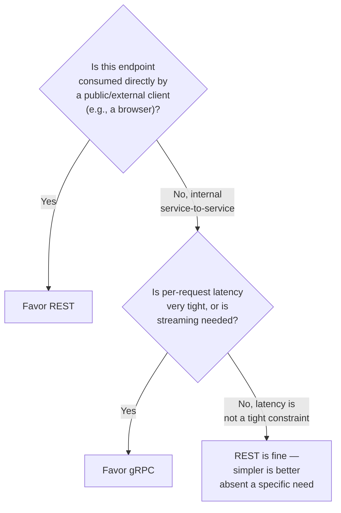

## Introduction

Chapter 26 established the "request handling" step as the entry point of an online model server, without specifying the protocol. This short but interview-relevant chapter covers the choice most teams face at that entry point: REST or gRPC. It's a smaller-scoped decision than most chapters in this series, but it's asked about frequently enough — and has genuine, non-obvious performance implications for ML serving specifically — to deserve its own dedicated treatment.

## REST: The Familiar Default

**REST (Representational State Transfer)** over HTTP, typically with JSON payloads, is the most common API style across the software industry generally, and it remains a completely reasonable default choice for ML model serving.

```python
# A minimal REST model-serving endpoint using FastAPI.
from fastapi import FastAPI
from pydantic import BaseModel

app = FastAPI()

class PredictionRequest(BaseModel):
    user_id: str
    transaction_amount: float
    merchant_category: str

class PredictionResponse(BaseModel):
    fraud_probability: float
    decision: str

@app.post("/predict", response_model=PredictionResponse)
def predict(request: PredictionRequest) -> PredictionResponse:
    features = build_features(request)
    probability = model.predict_proba(features)[0][1]
    decision = "block" if probability > 0.8 else "allow"
    return PredictionResponse(fraud_probability=probability, decision=decision)
```

**Strengths**: human-readable JSON payloads (easy to debug with a browser or `curl`), broad tooling and client library support in every language and platform, simple to document (OpenAPI/Swagger), and a low barrier to entry for teams and consumers already familiar with typical web API conventions.

**Weaknesses**: JSON serialization/deserialization has real, measurable CPU overhead compared to binary formats, especially for large payloads (e.g., a request containing a sizable feature vector, or a response containing a full ranked list of items); REST/HTTP 1.1 doesn't natively support efficient bidirectional streaming, which matters for certain serving patterns (discussed below); and JSON's text-based, loosely-typed nature means schema validation happens at the application layer rather than being enforced at the protocol level.

## gRPC: The Performance-Oriented Alternative

**gRPC**, built on HTTP/2 and Google's **Protocol Buffers (protobuf)** for serialization, is increasingly the preferred choice for internal, latency-sensitive service-to-service communication — and model serving, particularly for internal systems calling a model server from another backend service, is a common use case where this preference shows up.

```protobuf
// A gRPC service definition (.proto file) for the same fraud
// prediction endpoint shown above in REST/FastAPI form.

syntax = "proto3";

service FraudDetectionService {
  rpc Predict (PredictionRequest) returns (PredictionResponse);
  rpc PredictStream (stream PredictionRequest) returns (stream PredictionResponse);
}

message PredictionRequest {
  string user_id = 1;
  float transaction_amount = 2;
  string merchant_category = 3;
}

message PredictionResponse {
  float fraud_probability = 1;
  string decision = 2;
}
```

```python
# The corresponding Python gRPC server implementation.
import grpc
from concurrent import futures
import fraud_detection_pb2
import fraud_detection_pb2_grpc

class FraudDetectionServicer(fraud_detection_pb2_grpc.FraudDetectionServiceServicer):
    def Predict(self, request, context):
        features = build_features(request)
        probability = model.predict_proba(features)[0][1]
        decision = "block" if probability > 0.8 else "allow"
        return fraud_detection_pb2.PredictionResponse(
            fraud_probability=probability, decision=decision
        )

server = grpc.server(futures.ThreadPoolExecutor(max_workers=10))
fraud_detection_pb2_grpc.add_FraudDetectionServiceServicer_to_server(
    FraudDetectionServicer(), server
)
server.add_insecure_port("[::]:50051")
server.start()
```

**Strengths**: protobuf's compact binary serialization is significantly faster to encode/decode and produces smaller payloads than JSON — a meaningful latency and bandwidth advantage at high request volume; HTTP/2's multiplexing allows many concurrent requests over a single connection efficiently; **native bidirectional streaming support**, which matters directly for LLM token-streaming (a pattern we'll return to explicitly in Part 10) and other genuinely streaming serving patterns; and the `.proto` schema definition provides strong, enforced typing and automatic client/server code generation across many languages.

**Weaknesses**: binary payloads aren't human-readable, making ad-hoc debugging (e.g., with `curl`) harder without additional tooling; browser support historically required a proxy layer (gRPC-Web) since browsers can't directly speak raw gRPC/HTTP2 in the way a backend service can; and the `.proto` schema-first workflow adds a layer of tooling and process (schema compilation, versioning discipline) that's simply unnecessary overhead for a small, simple service.

## Head-to-Head Comparison

| Dimension | REST (JSON/HTTP) | gRPC (Protobuf/HTTP2) |
|---|---|---|
| Serialization overhead | Higher (text-based JSON) | Lower (compact binary protobuf) |
| Human readability / debuggability | High | Low (needs tooling) |
| Streaming support | Limited (needs WebSockets/SSE workarounds) | Native, bidirectional |
| Browser-native client support | Yes | Requires gRPC-Web proxy |
| Schema enforcement | Application-layer (e.g., Pydantic) | Protocol-layer (.proto contract) |
| Typical best fit | Public-facing APIs, external consumers | Internal service-to-service, latency-critical, streaming |

## A Practical Decision Framework



A common and sensible production pattern: expose a **public-facing REST API** (for external consumers, dashboards, or third-party integrations) that internally calls a **gRPC-based internal model server** (for the actual latency-sensitive inference call between backend services) — getting REST's accessibility and debuggability at the system's edge, and gRPC's performance advantage on the latency-critical internal hop where it matters most.

## Why This Choice Matters More for ML Serving Specifically

Two considerations make this decision more consequential for ML serving than for a typical CRUD API:

1. **Payload size**: ML serving requests/responses often carry larger payloads than typical CRUD operations — a feature vector with dozens or hundreds of values, or a response containing a ranked list of dozens of items with associated scores — making JSON's serialization overhead proportionally more impactful than it would be for a simple, small CRUD payload.
2. **Latency sensitivity**: as established in Chapter 5's latency budget discussion, many ML serving use cases (fraud detection, real-time ranking) operate under tight latency SLAs where every millisecond of serialization overhead directly competes with the budget available for the actual model inference itself — making gRPC's serialization performance advantage a genuinely consequential factor rather than a marginal one.

## Key Takeaways

- REST/JSON is the accessible, debuggable, broadly-compatible default — well-suited to public-facing APIs and situations where simplicity and tooling familiarity outweigh raw performance.
- gRPC/Protobuf offers meaningfully lower serialization overhead, native bidirectional streaming, and enforced schema typing — well-suited to internal, latency-critical service-to-service model serving calls.
- ML serving payloads (feature vectors, ranked lists) tend to be larger, and ML serving latency budgets tend to be tighter, than typical CRUD APIs — making this protocol choice more consequential for ML systems than it might be elsewhere.
- A common, effective pattern combines both: a public REST API at the system's edge, calling an internal gRPC-based model server for the actual latency-sensitive inference.

---

## Interview Questions

**1. What are the core technical differences between REST and gRPC that make gRPC generally faster for high-throughput, low-latency use cases?**
REST typically uses JSON over HTTP/1.1, where JSON is a verbose, text-based serialization format requiring more CPU time to encode and decode and producing larger payloads over the wire; gRPC uses Protocol Buffers, a compact binary serialization format that's significantly faster to serialize/deserialize and produces smaller payloads, combined with HTTP/2's support for multiplexing many concurrent requests efficiently over a single connection (versus HTTP/1.1's more limited connection reuse) — together, the lighter-weight serialization and more efficient underlying transport protocol give gRPC a measurable latency and throughput advantage, particularly noticeable at high request volume or with larger payloads.
*Follow-up: Would this performance difference be noticeable for a service handling only a few requests per second with small payloads? Why or why not?*
Likely not meaningfully noticeable — at low request volume and small payload sizes, the absolute difference in serialization time and network overhead between JSON and protobuf is small in absolute terms (likely sub-millisecond), and this difference would be dwarfed by other factors like network round-trip time or the actual model inference time itself; gRPC's performance advantage becomes proportionally more significant and worth prioritizing specifically at high request volume and/or with larger payloads, which is exactly why the decision should be grounded in the system's actual expected scale and payload characteristics rather than defaulting to gRPC purely because it's theoretically faster in general.

**2. Why is native bidirectional streaming support in gRPC particularly relevant for certain ML serving patterns, and give a concrete example.**
Some ML serving patterns require sending or receiving a continuous sequence of data rather than a single discrete request/response pair — a prominent example (previewed here, covered fully in Part 10) is LLM token streaming, where a client wants to receive generated tokens one at a time as they're produced, rather than waiting for the entire response to be generated before receiving anything; gRPC's native, built-in support for bidirectional streaming handles this pattern cleanly and efficiently as a first-class protocol feature, whereas REST/HTTP 1.1 requires workarounds like Server-Sent Events (SSE) or WebSockets layered on top of the base protocol to achieve similar streaming behavior, which is comparatively less native and can introduce additional complexity.
*Follow-up: Does this mean REST is fundamentally incapable of supporting a streaming response pattern like token-by-token LLM output?*
No — REST-based systems commonly use Server-Sent Events (SSE) specifically to support this kind of one-directional streaming response pattern (the server progressively pushing tokens to the client as they're generated), and this is in fact a very common, widely-used pattern for LLM APIs served over standard HTTP; the distinction is that SSE is a workaround/extension layered on top of the base REST/HTTP model specifically for one-directional server-to-client streaming, whereas gRPC's streaming support is a native, first-class capability of the protocol itself that also more naturally supports bidirectional (client-to-server and server-to-client simultaneously) streaming, which SSE alone doesn't provide.

**3. Why might a team choose to expose a public-facing REST API while using gRPC internally for the actual model inference call, rather than using the same protocol end-to-end?**
This hybrid pattern captures the strengths of each protocol where they matter most: REST's broad compatibility, browser-native support, and ease of debugging make it the more practical, accessible choice at the system's public-facing edge, where external clients, third-party integrators, and browsers need straightforward, well-documented access without requiring specialized gRPC client tooling; gRPC's lower serialization overhead and native streaming support are then applied specifically to the latency-critical internal hop between backend services, where the actual performance-sensitive inference call happens and where all communicating parties are internal services under the team's own control, free of the external-client compatibility constraints that motivated REST at the edge.
*Follow-up: What additional infrastructure component would this hybrid pattern typically require, and what's its role?*
It would typically require an API gateway or a translation/proxy layer at the boundary between the public REST-facing API and the internal gRPC-based services, responsible for receiving the external REST/JSON request, translating it into the appropriate internal gRPC/protobuf call format, invoking the internal gRPC service, and translating the gRPC response back into a REST/JSON response for the external client — this gateway layer is what actually implements the protocol translation, allowing external clients to interact with a familiar REST interface while internal service-to-service communication benefits from gRPC's performance characteristics without either side needing to be aware of or directly interact with the other protocol.

**4. What does it mean that gRPC's schema is "enforced at the protocol level" via .proto files, and why is this considered an advantage over REST's typical approach to schema validation?**
A gRPC service's request and response message structures are formally defined in a `.proto` file, and both the client and server code are generated directly from this shared schema definition — meaning the exact structure, field types, and required/optional fields are enforced automatically by the generated code itself, and any mismatch between what a client sends and what the schema expects is caught at the protocol/serialization level, often at compile time for statically-typed languages; REST APIs typically rely on the application layer (e.g., a library like Pydantic in the earlier FastAPI example) to perform this validation after the JSON payload has already been received and deserialized, meaning schema mismatches are caught later, at runtime, within application code rather than being structurally prevented by the protocol and its generated client/server code from the start.
*Follow-up: What's a practical downside of this stricter, protocol-level schema enforcement, compared to REST/JSON's more flexible approach?*
The stricter, protocol-level schema enforcement in gRPC requires more upfront process and coordination — any change to the request/response schema requires updating the shared `.proto` file, regenerating client and server code, and carefully managing versioning/compatibility (e.g., ensuring new fields are added in a backward-compatible way) across every service that depends on that schema; REST/JSON's more flexible, loosely-typed nature makes it easier to make ad-hoc, incremental changes to a payload structure (like adding a new optional field) without requiring this more formal, coordinated schema-update and code-regeneration process, which can be a genuine practical advantage for rapidly-evolving APIs or smaller teams without the process maturity to manage strict schema versioning discipline effectively.

**5. Why does payload size matter more for the REST-vs-gRPC decision in ML serving specifically, compared to a typical CRUD-style web API?**
ML serving requests and responses often carry meaningfully larger payloads than typical CRUD operations — a request might include a substantial feature vector with many numeric fields, and a response from a ranking system might include a list of dozens of items each with an associated relevance score — meaning the proportional overhead of JSON's more verbose text-based serialization (compared to protobuf's more compact binary format) is correspondingly larger and more consequential for ML serving payloads than it would be for a typical small CRUD payload (like a simple user profile update), making the serialization-format choice a more consequential performance factor specifically in the ML serving context.
*Follow-up: How would you quantify whether this serialization overhead actually matters for a specific ML system, rather than assuming it does based on general principles?*
I'd measure the actual serialization/deserialization time and payload size difference between REST/JSON and gRPC/protobuf using representative example payloads for the specific system in question (e.g., benchmarking with an actual feature vector or ranked list of realistic size), and compare this measured overhead against the system's overall latency budget (per Chapter 26's latency decomposition) — if the measured serialization overhead represents a small, negligible fraction of the total available latency budget, the protocol choice may not meaningfully matter for that specific system regardless of general principles; if it represents a significant fraction, that's concrete, system-specific evidence justifying gRPC's adoption for that use case.

**6. In an interview, if asked to justify choosing REST for a model-serving API despite gRPC's performance advantages, what factors would support that choice?**
I'd point to the specific context making REST the more appropriate choice: if the API's primary consumers are external third parties, browser-based dashboards, or a broad, heterogeneous ecosystem of client applications and integrators who need straightforward, well-documented access without specialized tooling, REST's broad compatibility and ease of integration outweighs gRPC's raw performance advantage, especially if the system's actual latency budget and payload size don't make the serialization overhead difference practically significant (per the previous question's reasoning); I'd also note that if the team lacks existing gRPC expertise or tooling investment, and the system's traffic volume and latency requirements are moderate rather than extreme, the added complexity and learning curve of adopting gRPC may not be justified by a performance gain that wouldn't be the actual bottleneck for this specific system anyway.
*Follow-up: What would change your recommendation if the interviewer specified that this same API needs to support real-time token streaming for an LLM-based feature?*
The need for real-time token streaming would shift my recommendation toward strongly considering gRPC (or, if REST/HTTP must be retained for broader compatibility reasons, at minimum Server-Sent Events layered on top of REST) specifically because streaming support is a functional requirement here, not just a performance nice-to-have — I'd weigh whether the broader compatibility benefits of REST+SSE are sufficient for this specific use case's actual client ecosystem, or whether the more native, robust bidirectional streaming support gRPC provides is worth the added complexity, but the introduction of a genuine streaming requirement meaningfully changes the calculus compared to a purely request/response-oriented use case.

**7. Why might a team building an internal, high-throughput feature retrieval service (called by many other internal services) lean strongly toward gRPC by default?**
An internal feature retrieval service, being called frequently by many other internal backend services (rather than external or browser-based clients), doesn't need REST's broad public compatibility advantages at all, while it likely does need to minimize latency overhead on every call given how frequently and how many other services depend on it — every millisecond of serialization overhead is multiplied across potentially very high call volume from many internal consumers, making gRPC's lower serialization overhead and more efficient connection handling (HTTP/2 multiplexing) a meaningful, compounding benefit precisely because of this internal, high-frequency service-to-service communication pattern, which is exactly the scenario gRPC was designed to optimize for.
*Follow-up: What organizational or tooling investment would a team need to make to adopt gRPC effectively for this kind of internal service?*
The team would need to establish a shared `.proto` schema definition and management process (likely a shared repository or schema registry that all internal services consuming this API can reference), invest in the tooling and build process to generate client/server code from these schemas across whatever languages their internal services are written in, and build team familiarity with gRPC-specific debugging and observability tooling (since standard REST debugging tools like `curl` and browser dev tools don't work as directly with gRPC's binary protocol) — this represents a genuine, non-trivial tooling and process investment that should be weighed against the internal service's actual scale and latency-sensitivity, rather than adopted reflexively for every internal service regardless of its specific traffic and latency profile.

**8. How would you handle debugging a production issue in a gRPC-based model serving system, given that its binary payloads aren't human-readable in the way REST/JSON payloads are?**
I'd rely on gRPC-specific tooling designed to address exactly this challenge — tools like `grpcurl` (a command-line tool analogous to `curl` but specifically designed to interact with and inspect gRPC services), gRPC reflection (allowing a client to query a gRPC server for its available services and message schemas at runtime), and proper structured logging within the service itself that logs the actual field values of interest in a human-readable form (rather than relying on inspecting the raw wire-format bytes directly) — combined with distributed tracing (Chapter 48) that captures request/response metadata in a readable form, ensuring that debugging capability isn't lost simply because the underlying wire protocol is binary, even though it does require different, gRPC-aware tooling than the more universally-applicable `curl`-and-browser-based debugging workflow REST/JSON supports out of the box.
*Follow-up: Why is it important to set up this tooling investment proactively, rather than only when a production issue actually arises?*
Discovering, during an active production incident, that the team lacks the necessary tooling or familiarity to effectively inspect and debug a gRPC service's actual request/response payloads would significantly slow down incident diagnosis and resolution at exactly the moment when fast, effective debugging matters most — proactively setting up this tooling and building team familiarity with it as part of the normal development and operational workflow (rather than treating it as an afterthought) ensures the team is prepared to debug effectively when an issue does arise, rather than needing to learn and set up unfamiliar tooling under the time pressure of an active incident.

**9. What's a risk of choosing gRPC for a service that will eventually need direct browser-based client access, without planning for this from the start?**
Browsers cannot natively speak the raw gRPC protocol (which relies on HTTP/2 features and framing not fully exposed by standard browser networking APIs), so a service built purely with a raw gRPC interface would require an additional gRPC-Web proxy layer to be introduced later to bridge browser clients to the underlying gRPC service — if this need wasn't anticipated and planned for from the start, retrofitting this proxy layer, and potentially reworking client-side integration code that was built assuming direct gRPC access, represents avoidable additional engineering effort and migration risk that could have been anticipated and designed for upfront if the eventual need for direct browser access had been considered as part of the initial protocol choice.
*Follow-up: How would you architect a system from the start to avoid this kind of costly retrofit, if you anticipated eventually needing both efficient internal service-to-service communication and direct browser client access?*
I'd adopt the hybrid pattern discussed earlier in this chapter from the very beginning — designing the internal service-to-service communication layer using gRPC for its performance benefits, while separately exposing a REST (or gRPC-Web, if closer protocol parity is desired) interface specifically for browser-based or other external client access from the start, via an explicit API gateway/translation layer — ensuring that if and when direct browser access is needed, the necessary translation layer and interface are already designed and in place, rather than needing to be retrofitted as an urgent, disruptive change once that browser-access requirement materializes.

**10. Why is it inaccurate to describe gRPC as "strictly better" than REST in every dimension, despite its performance and streaming advantages?**
"Strictly better" would imply gRPC dominates REST on every relevant dimension with no meaningful trade-offs, but this chapter's comparison shows genuine trade-offs in both directions — REST offers superior human-readability/debuggability without specialized tooling, broader native browser compatibility, and a lower barrier to entry/simpler tooling requirements for teams without existing gRPC investment, all of which are genuine, real advantages that gRPC doesn't match; describing gRPC as strictly better ignores these REST-specific strengths and risks leading a team to adopt gRPC's added complexity and tooling requirements even in contexts (public-facing APIs, low-traffic services, teams without gRPC expertise) where REST's specific advantages are actually more relevant and valuable for that particular situation.
*Follow-up: How would you push back, in a technical discussion, against a colleague who insists "we should just always use gRPC since it's faster"?*
I'd acknowledge gRPC's genuine performance advantages while redirecting the conversation toward the actual, specific requirements and constraints of the system being discussed — asking concretely whether the system's expected traffic volume and payload sizes would make the serialization overhead difference practically significant (per the earlier quantification discussion), whether the API needs direct external/browser client access (where gRPC's compatibility limitations would matter), and whether the team has the tooling and expertise investment to adopt gRPC effectively — grounding the discussion in the system's actual, specific needs rather than treating "faster" as the only relevant consideration, since a technically faster protocol that introduces unnecessary complexity or compatibility friction for a system that doesn't actually need that performance advantage isn't a clearly correct engineering trade-off just because it's faster in the abstract.

**11. How would the REST vs. gRPC decision interact with the dynamic batching capability discussed in Chapter 26, if at all?**
Dynamic batching is a capability of the model serving framework itself (e.g., Triton, TorchServe), operating on the requests it receives regardless of which protocol (REST or gRPC) was used to receive them — most modern serving frameworks support both REST and gRPC endpoints for the same underlying served model, with dynamic batching applied identically to requests arriving via either protocol; the REST-vs-gRPC choice affects the overhead of getting a request into and a response out of the serving framework, while dynamic batching affects how efficiently the framework then processes the batch of requests once received — these are largely independent, complementary optimizations rather than one depending on or conflicting with the other.
*Follow-up: Given that dynamic batching already introduces a queuing/waiting latency trade-off (from Chapter 26), does gRPC's lower serialization overhead become more or less important when dynamic batching is also in use?*
It could be argued either way depending on the specific system's bottleneck profile — if dynamic batching's queuing delay is already the dominant contributor to overall latency, the relatively smaller serialization overhead difference between REST and gRPC becomes proportionally less significant to the overall latency budget; however, if a system is optimized to minimize the dynamic batching wait time (e.g., using small batch sizes and short wait windows for a very latency-sensitive use case), then the serialization overhead becomes a proportionally larger share of the remaining, tighter latency budget, making gRPC's advantage more consequential — reinforcing the broader point from this chapter that the actual, specific latency budget decomposition (Chapter 26) should drive this kind of protocol decision, rather than a general rule of thumb divorced from the specific system's actual bottleneck profile.

**12. Why might a company migrate an existing REST-based model serving API to gRPC after the system has been in production for a while, rather than choosing gRPC from the very start?**
This reflects the same "start simple, escalate when justified" pattern seen throughout this series — a team might reasonably start with REST for its simplicity and lower initial tooling investment while a new ML feature's traffic volume and business value are still uncertain, and only migrate to gRPC once the feature has proven successful and grown to a scale where the measured serialization overhead and latency benefits of gRPC become a genuinely significant, quantifiable factor (e.g., discovered through the latency budget decomposition exercise from Chapter 26 revealing that JSON serialization is consuming a meaningful, optimization-worthy fraction of the overall latency budget) — justifying the migration cost and added complexity investment only once concrete, measured evidence supports it, rather than speculatively adopting the more complex protocol from day one based on anticipated future needs that may or may not materialize.
*Follow-up: What would make this kind of later migration more or less costly to execute, based on how the original REST-based system was architected?*
A system architected with clean separation between the core inference/business logic and the specific protocol-handling layer (the request deserialization, response serialization, and routing code) would make this kind of migration significantly less costly, since only the protocol-handling layer would need to be replaced or extended to support gRPC, while the core inference logic remains unchanged and reusable; a system where protocol-specific concerns (e.g., direct dependencies on REST-specific request/response objects) are tightly intermingled throughout the core business logic would make the same migration considerably more costly and risky, requiring more extensive rework — reinforcing the general software engineering principle of maintaining clean architectural boundaries between a system's core logic and its specific external interface/protocol choices, precisely to keep this kind of future migration option open and affordable.

**13. How would you explain to a non-technical stakeholder why the team is recommending gRPC for an internal service, when the stakeholder has only ever heard of REST APIs?**
I'd explain, without requiring deep technical detail, that gRPC and REST are both ways for different parts of our software to talk to each other, but gRPC is specifically optimized for fast, efficient communication between our own internal systems (as opposed to REST, which is more commonly used when external partners, third-party developers, or web browsers need to talk to us) — and that for this specific internal service, which needs to respond very quickly and will be called extremely frequently by other parts of our own system, gRPC's efficiency advantage translates into a faster, more responsive product experience and lower infrastructure cost at our scale, while our externally-facing APIs (that outside developers or partners actually interact with) will continue to use the more universally-compatible and familiar REST approach.
*Follow-up: Why is it important to frame this decision in terms of concrete business outcomes (speed, cost, user experience) rather than purely technical merits, when communicating with this audience?*
A non-technical stakeholder generally cares about and is equipped to evaluate business outcomes — will this make the product faster or better for users, will it save money, will it reduce risk — rather than technical implementation details for their own sake; framing the gRPC recommendation in terms of these concrete, relevant business outcomes (rather than technical concepts like "binary serialization" or "HTTP/2 multiplexing") makes the recommendation meaningful and evaluable to that specific audience, helping them understand and appropriately weigh in on the trade-off being made (e.g., accepting some added engineering complexity in exchange for genuine, quantifiable performance and cost benefits) rather than either blindly deferring to unexplained technical jargon or dismissing a legitimate technical recommendation they can't connect to any outcome they actually care about.

**14. If an interviewer asks "would you ever use both REST and gRPC for the exact same model-serving endpoint," how would you respond?**
Yes, this is a genuinely common and reasonable pattern — many production model serving frameworks (like Triton, covered in Chapter 38) natively expose the *same* underlying served model through both a REST endpoint and a gRPC endpoint simultaneously, allowing different types of clients to choose whichever protocol best fits their specific needs (an external dashboard or simple debugging script might use the REST endpoint, while a latency-sensitive internal service calls the same model via the gRPC endpoint) without requiring the serving infrastructure to maintain two separate, independently-managed model deployments — the underlying model and its core inference logic remain the same regardless of which protocol interface a specific client happens to use to reach it.
*Follow-up: What would be a reason NOT to expose both protocols simultaneously for a given model-serving endpoint, despite this being technically supported by many serving frameworks?*
Maintaining and supporting two different protocol interfaces for the same endpoint does introduce some additional operational surface area — two sets of API documentation to maintain, two potential sources of client-facing bugs or inconsistencies to monitor and support, and potentially two different sets of client libraries or SDKs to keep in sync — for a genuinely simple, low-stakes internal service with a small, well-understood, homogeneous set of consumers who all have a clear, single preferred protocol, exposing both might represent unnecessary operational overhead and complexity without a corresponding benefit, in which case committing to a single protocol that best serves that specific, known consumer base would be the simpler, more maintainable choice.

**15. How would you summarize the overall decision-making approach for REST vs. gRPC to a team just starting to think about this choice for a new ML serving system?**
I'd summarize it as: default to REST for its simplicity, broad compatibility, and ease of debugging unless you have a specific, concrete reason to expect gRPC's performance or streaming advantages will genuinely matter for your system — specifically, a demonstrated or well-justified expectation of high internal service-to-service call volume with tight latency budgets where serialization overhead would be a meaningful fraction of that budget (per the latency decomposition exercise from Chapter 26), a genuine need for native bidirectional or server-to-client streaming beyond what SSE can reasonably provide, or a primarily internal consumer base where REST's public/browser-compatibility advantages don't actually apply — and treat the choice as revisitable, following the "start simple, escalate when justified" principle that recurs throughout this series, rather than a permanent, unchangeable architectural commitment made once at the very start of a project based purely on anticipated rather than demonstrated need.
*Follow-up: Why is emphasizing that this decision is "revisitable" an important part of this guidance, rather than presenting it as a decision that must be gotten exactly right from the very first day?*
Presenting architectural decisions as permanent, must-get-right-immediately choices can create unnecessary analysis paralysis or over-engineering pressure early in a project, when the actual future scale, traffic patterns, and requirements are often still genuinely uncertain; emphasizing that the choice is revisitable — and, as discussed earlier in this chapter, can be made less costly to revisit through clean architectural separation between core logic and protocol-handling code — encourages teams to make a reasonable, well-justified initial choice based on current, known information and move forward productively, rather than over-investing time upfront trying to perfectly anticipate every possible future requirement before writing any code, which is a recurring, deliberate theme throughout this entire series' guidance on managing engineering complexity.
