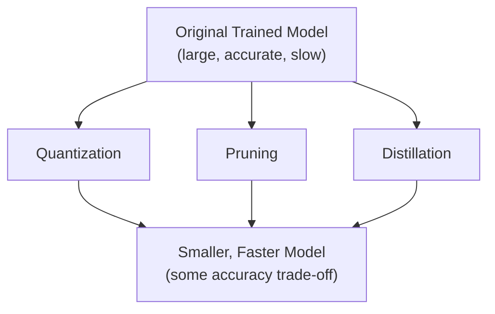
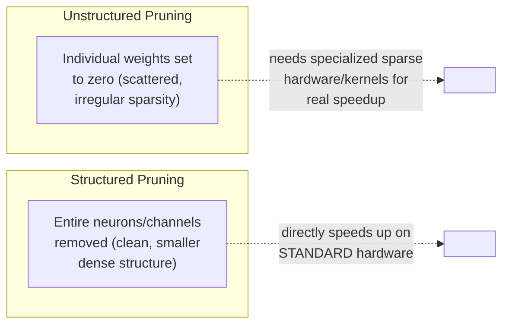
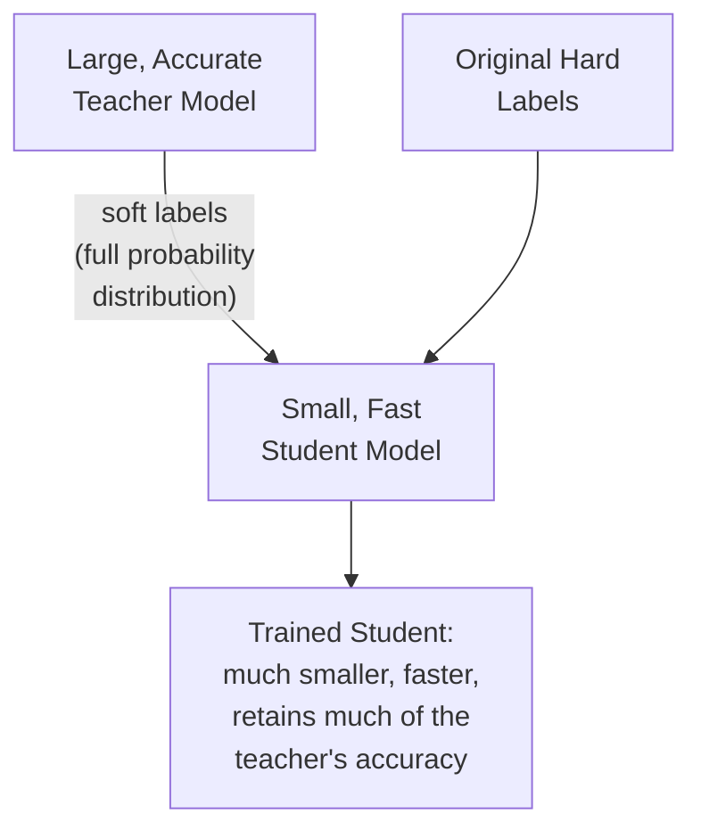

## Introduction

Chapter 27 optimized how a request reaches a model. This chapter optimizes the model itself — a genuinely different lever from architecture choice (Chapter 20) or hardware choice (Chapter 16), and one of the highest-leverage tools available once you've settled on a model that performs well but is too slow, too large, or too expensive to serve at the scale and latency your system requires. We cover the three foundational compression techniques: quantization, pruning, and knowledge distillation.

## Why Model Compression Matters for Serving

Recall the latency budget decomposition from Chapter 26: model inference time is frequently the single largest contributor to end-to-end serving latency, especially for larger, more complex models. Compression techniques directly attack this bottleneck, and unlike scaling up serving infrastructure (adding more GPUs, Chapter 29's auto-scaling), compression **reduces the fundamental cost of a single inference call** — a benefit that compounds across every single request a system serves, at every scale.



## Quantization

**Core idea**: reduce the numerical precision used to represent a model's weights (and often its activations) — for example, converting 32-bit floating-point weights (FP32) to 8-bit integers (INT8), or to 16-bit formats (FP16/BF16, previewed in Chapter 16's mixed-precision training discussion).

**Why it works**: neural networks are generally robust to a meaningful amount of numerical imprecision in their weights — the difference between a weight of 0.4531892 and its INT8-quantized approximation is rarely enough to change the model's overall behavior significantly, especially when quantization is applied carefully. The benefit is substantial: INT8 weights take 4x less memory than FP32, and integer arithmetic is significantly faster than floating-point arithmetic on most hardware, especially with specialized hardware support (many modern GPUs and specialized inference chips have accelerated INT8 execution paths).

**Post-training quantization (PTQ) vs. quantization-aware training (QAT)**:
- **PTQ**: quantize an already-trained model's weights directly, with no further training — fast and simple, but can cause a noticeable accuracy drop if applied naively.
- **QAT**: simulate the effect of quantization *during* training itself (inserting "fake quantization" operations into the forward pass so the model learns to be robust to the precision reduction it will eventually undergo), producing a quantized model with meaningfully better accuracy retention than PTQ, at the cost of requiring a full (or partial) retraining process rather than a quick post-hoc conversion.

```python
import torch

# Post-training dynamic quantization — the simplest form, converting
# weights to INT8 while keeping activations computed dynamically.
model_fp32 = MyTrainedModel()
model_fp32.eval()

model_int8 = torch.quantization.quantize_dynamic(
    model_fp32,
    {torch.nn.Linear},   # quantize only Linear layers
    dtype=torch.qint8,
)

# Compare model sizes
import os
def print_model_size(model, label):
    torch.save(model.state_dict(), "temp.p")
    print(f"{label}: {os.path.getsize('temp.p') / 1e6:.2f} MB")
    os.remove("temp.p")

print_model_size(model_fp32, "FP32 model")
print_model_size(model_int8, "INT8 quantized model")  # roughly 4x smaller
```

## Pruning

**Core idea**: remove weights (or entire neurons/channels/layers) that contribute little to the model's output, based on the observation that most trained neural networks are significantly **over-parameterized** — many weights end up close to zero or otherwise redundant, contributing negligibly to the final predictions.

- **Unstructured pruning**: remove individual weights (setting them to zero) based on a criterion like magnitude (smallest-magnitude weights are pruned first) — achieves high compression ratios in terms of *parameter count*, but the resulting sparse weight matrices don't automatically translate into faster inference on standard hardware unless specialized sparse computation support is available, since a "mostly zero" matrix is still stored and computed as a dense matrix by default on most hardware.
- **Structured pruning**: remove entire structural units — whole neurons, channels, or even layers — which *does* directly translate into a smaller, genuinely faster dense model, since you're removing entire, clean structural components rather than leaving scattered individual zero-valued entries within an otherwise-intact structure.



**Iterative pruning**: rather than pruning a large fraction of weights in one aggressive step (which can severely damage accuracy), a more robust approach prunes a small fraction, fine-tunes the model to recover accuracy, prunes another small fraction, fine-tunes again, and repeats — gradually reaching a high compression ratio while allowing the model to adapt at each step, generally achieving much better final accuracy than a single aggressive pruning pass.

## Knowledge Distillation

**Core idea**: train a smaller "student" model to mimic the behavior of a larger, more accurate "teacher" model — rather than training the student directly on the original hard labels alone, it's trained (at least in part) to match the teacher's output *probability distribution* (called "soft labels" or "soft targets"), which carries richer information than a hard 0/1 label (e.g., a teacher's output showing 70% confidence in "cat," 25% in "dog," 5% in "fox" conveys more nuanced information about the relationships between classes than a hard label of just "cat").



```python
import torch
import torch.nn.functional as F

def distillation_loss(student_logits: torch.Tensor, teacher_logits: torch.Tensor,
                        true_labels: torch.Tensor, temperature: float = 3.0,
                        alpha: float = 0.5) -> torch.Tensor:
    """
    Combines a standard hard-label loss with a soft-label distillation
    loss. Temperature > 1 "softens" the teacher's probability
    distribution, revealing more of the relative confidence between
    classes than a sharply peaked distribution would.
    """
    soft_teacher = F.softmax(teacher_logits / temperature, dim=-1)
    soft_student = F.log_softmax(student_logits / temperature, dim=-1)
    distillation = F.kl_div(soft_student, soft_teacher, reduction="batchmean") * (temperature ** 2)

    hard_label_loss = F.cross_entropy(student_logits, true_labels)

    return alpha * hard_label_loss + (1 - alpha) * distillation

# Training loop: student learns from BOTH the true labels AND the
# teacher's richer, more nuanced output distribution.
for inputs, labels in dataloader:
    with torch.no_grad():
        teacher_logits = teacher_model(inputs)  # teacher is frozen, not trained further
    student_logits = student_model(inputs)
    loss = distillation_loss(student_logits, teacher_logits, labels)
    loss.backward()
    optimizer.step()
```

**Why distillation is particularly powerful**: unlike quantization or pruning (which start from an existing trained model's weights and shrink them), distillation trains a genuinely different, independently-architected smaller model from scratch — giving you the freedom to choose a student architecture specifically optimized for fast inference (fewer layers, smaller hidden dimensions), while still benefiting from the accuracy the much larger, more expensive-to-train teacher model achieved. This is directly relevant to Part 8's discussion of smaller, distilled LLM variants that retain much of a larger model's capability at a fraction of the inference cost.

## Combining Techniques

These three techniques are **not mutually exclusive** — a common, highly effective production pipeline applies them in combination: first distill a large teacher model into a smaller student architecture, then prune the student model's remaining redundant weights, then quantize the pruned model's remaining weights to a lower precision — stacking the benefits of each technique, since they attack different sources of model size/cost (architecture size, parameter redundancy, and numerical precision, respectively) rather than competing for the same reduction.

## The Fundamental Trade-off

Every compression technique trades some amount of model accuracy for reduced size, latency, and cost — the central system design question is always **how much accuracy loss is acceptable given the resulting efficiency gain**, directly echoing the cost-benefit reasoning from Chapter 6 and Chapter 20. This should always be validated empirically: compress the model, re-run the full offline evaluation suite from Chapter 21, and only proceed to shadow deployment/A-B testing (Chapters 22-23) if the accuracy trade-off falls within an acceptable, pre-defined tolerance for the specific business context.

## Key Takeaways

- Quantization reduces numerical precision (e.g., FP32 → INT8), shrinking model size and speeding up inference — quantization-aware training generally preserves more accuracy than simple post-training quantization.
- Pruning removes redundant weights or structural units — structured pruning yields genuine inference speedup on standard hardware, while unstructured pruning requires specialized sparse-computation support to realize a real speed benefit.
- Knowledge distillation trains a smaller, independently-architected student model to mimic a larger teacher's soft output distribution, often preserving more accuracy per unit of size reduction than compressing an existing model's weights directly.
- These techniques compound rather than compete — a production pipeline often distills, then prunes, then quantizes — and every compression decision should be validated against the full offline evaluation suite before proceeding through the staged rollout process.

---

## Interview Questions

**1. Why are neural networks generally robust to the reduced numerical precision introduced by quantization, and what does this reveal about how trained models represent information?**
Trained neural networks typically learn representations that don't depend on extremely fine-grained numerical precision in every individual weight — the overall function the network computes is generally smooth and somewhat redundant across many parameters, meaning small perturbations to individual weight values (like the kind introduced by rounding to a lower-precision numerical format) rarely change the network's overall output significantly; this reveals that trained models tend to encode information in robust, somewhat redundant ways across many parameters working together, rather than depending critically on the exact precise value of any single weight, which is precisely the property that makes both quantization and pruning (removing/reducing individual weights) generally viable without catastrophic accuracy loss.
*Follow-up: Does this robustness mean you could quantize a model to arbitrarily low precision (e.g., 1-bit weights) without any meaningful accuracy loss?*
No — this robustness has limits, and pushing precision reduction too far (e.g., to 1-bit or 2-bit representations) generally does cause significant, sometimes severe accuracy degradation, since at some point the numerical representation becomes too coarse to meaningfully distinguish between genuinely different, functionally important weight values; extreme low-bit quantization (sometimes called "binary" or "ternary" quantization) is an active area of specialized research requiring careful, often quantization-aware training techniques specifically designed to preserve accuracy at these more extreme compression levels, and isn't something you'd expect to work well with simple post-training quantization applied naively at that extreme.

**2. What's the difference between post-training quantization (PTQ) and quantization-aware training (QAT), and when would you choose one over the other?**
PTQ quantizes an already-trained model's weights directly after training is complete, with no further training involved — fast and simple to apply, but can produce a more noticeable accuracy drop since the model was never given the opportunity to adapt to the precision reduction during its actual training process; QAT simulates the effect of quantization during the training process itself, letting the model's weights adjust and become more robust to the eventual precision reduction, generally preserving meaningfully better accuracy than PTQ, at the cost of requiring a (typically shorter, fine-tuning-style) additional training process rather than a quick, one-time post-hoc conversion. You'd choose PTQ when you need a fast, low-effort compression option and can tolerate some accuracy trade-off, or as a first quick check to see if the accuracy impact is even acceptable at all before investing further; you'd choose QAT when the accuracy drop from PTQ proves unacceptable for your specific use case and you have the resources and access to the original training pipeline needed to run the additional QAT training process.
*Follow-up: What would you need in place, organizationally and technically, to be able to use QAT, that you wouldn't necessarily need for PTQ?*
QAT requires access to the original training pipeline, code, and (at least a representative sample of) the training data, since it involves an actual additional training/fine-tuning process — this means QAT isn't feasible if you only have access to an already-trained model artifact without the ability to run further training on it (e.g., a third-party pre-trained model where you don't have the original training setup or sufficient data access); PTQ, by contrast, only requires the already-trained model itself and a representative calibration dataset (used to determine appropriate quantization scaling parameters), making it usable even in situations where you don't have access to the full original training infrastructure or data.

**3. Explain the difference between structured and unstructured pruning, and why unstructured pruning doesn't automatically translate into faster inference on standard hardware.**
Unstructured pruning removes individual weights throughout a model (setting them to zero) based on some criterion like magnitude, resulting in a sparse weight matrix where the zeroed-out weights are scattered irregularly throughout an otherwise still fully-sized matrix structure; structured pruning instead removes entire, clean structural units — whole neurons, channels, or layers — resulting in a genuinely smaller, dense matrix/model with fewer actual computational units. Standard hardware (CPUs, GPUs) and standard deep learning libraries are generally optimized for dense matrix operations, and don't automatically skip over the zeroed-out entries in an unstructured-sparse matrix during computation — the hardware still performs the full multiplication for every entry, including the now-zero ones, unless specialized sparse computation kernels or hardware support are specifically used, meaning unstructured pruning primarily reduces stored parameter count (and potentially storage/memory footprint) without a corresponding automatic inference speedup, unlike structured pruning's genuinely smaller dense computation.
*Follow-up: Given this limitation, why might a team still choose unstructured pruning over structured pruning in some scenarios?*
Unstructured pruning can generally achieve a much higher effective compression ratio (fraction of weights removed) for a given level of accuracy retention than structured pruning, since it has the flexibility to remove exactly the least-important individual weights wherever they happen to be located, rather than being constrained to remove entire structural units even if only some of the weights within that unit are actually unimportant; a team might choose unstructured pruning specifically when memory/storage footprint reduction (rather than inference speed) is the primary goal, or when they do have access to specialized sparse-computation hardware/software support (increasingly available, e.g., NVIDIA's sparse tensor core support) that can actually exploit unstructured sparsity for a real speed benefit, making the trade-off worthwhile in that specific context.

**4. Why is knowledge distillation described as fundamentally different from quantization and pruning, in terms of what it actually does to a model?**
Quantization and pruning both start from an already-trained model's existing weights and reduce them in some way (lower precision, or removing some weights) — the resulting compressed model retains the same fundamental architecture (or a lightly-modified version of it) and is a direct derivative of the original trained model. Knowledge distillation, by contrast, trains a genuinely separate, independently-architected "student" model from scratch, which can have an entirely different, purpose-built architecture optimized for fast inference (fewer layers, different structure) — the student model isn't a "shrunk version" of the teacher's specific weights at all, but rather a new model that has learned to approximate the teacher's overall input-output behavior through the distillation training process, giving distillation a fundamentally different and more flexible mechanism for achieving compression compared to directly modifying an existing model's own weights.
*Follow-up: What advantage does this architectural independence give distillation, compared to quantization or pruning, when the goal is maximizing inference speed specifically?*
Because the student model's architecture is chosen independently and specifically for the compression goal (rather than being constrained to remain structurally similar to the original teacher model, as quantization and pruning are), distillation allows much more aggressive and purpose-built architectural optimization for inference speed — for example, using a fundamentally simpler, shallower architecture with far fewer parameters than even an aggressively pruned or quantized version of the original teacher model could achieve while remaining recognizably the "same" model — giving distillation the potential to achieve larger overall speed/size improvements in situations where the teacher's fundamental architecture itself (independent of its specific learned weights) is a significant contributor to its inference cost.

**5. What is "soft label" distillation, and why does training a student model on a teacher's soft output distribution provide richer training signal than training on hard labels alone?**
Soft labels are the teacher model's full output probability distribution across all possible classes (e.g., 70% cat, 25% dog, 5% fox) rather than just the single, hard "correct" label (e.g., simply "cat"); this richer distribution conveys additional information about the *relationships* between classes as understood by the teacher model — for example, the fact that the teacher assigns meaningfully more probability to "dog" than to "fox" for this specific cat image reveals that the teacher considers this particular image somewhat more visually similar to a dog than to a fox, information entirely absent from a simple hard label that only says "cat." Training the student to match this fuller distribution (rather than only the hard label) transfers more of the teacher's learned, nuanced understanding of the relationships between classes, which can help the student learn a better, more generalizable representation than training on hard labels alone would provide, especially given the student's typically much smaller capacity.
*Follow-up: What role does the "temperature" parameter play in this soft-label distillation process, as shown in the code example?*
The temperature parameter, when used to divide the logits before applying softmax, "softens" the resulting probability distribution — a higher temperature makes the distribution flatter/less sharply peaked, revealing more of the smaller, secondary probabilities that would otherwise be nearly indistinguishable from zero in a very confident, sharply-peaked distribution (e.g., 99.9% cat, 0.05% dog, 0.05% fox becomes something like 70% cat, 20% dog, 10% fox at a higher temperature) — this "softening" is important because it's precisely these smaller, secondary probabilities that carry the richer relational information described above, and without softening, a very confident teacher's output would look almost like a hard label anyway, losing much of the additional signal distillation is specifically designed to transfer.

**6. Why might a team choose to combine quantization, pruning, and distillation in a single compression pipeline, rather than choosing just one technique?**
These three techniques address fundamentally different sources of model size and computational cost — distillation reduces the model's architectural size/complexity itself (fewer layers, smaller dimensions), pruning removes redundant individual weights or structural units within a given architecture, and quantization reduces the numerical precision used to represent whatever weights remain — since they operate on different, largely independent dimensions of model efficiency, applying them in sequence (typically distillation first to establish a smaller base architecture, then pruning to remove redundancy within that smaller architecture, then quantization to reduce the precision of the remaining weights) compounds their individual benefits rather than the techniques competing with or substituting for each other, achieving a much greater overall compression ratio than any single technique applied alone.
*Follow-up: Is there a risk of applying all three techniques too aggressively in combination, and how would you detect if this has happened?*
Yes — applying each technique at an aggressive compression level, even if each individually seems like a reasonable, moderate trade-off in isolation, can compound into an unacceptably large cumulative accuracy loss when applied together in sequence, since each subsequent technique is applied to an already-degraded (from the previous technique) version of the model rather than to the original, full-accuracy model; you'd detect this by running the full offline evaluation suite (Chapter 21) after each individual compression step in the pipeline, not just at the very end, tracking the cumulative accuracy impact at each stage — if the accuracy degradation crosses your predefined acceptable tolerance at any intermediate step, that's a signal to dial back the aggressiveness of that specific step (or an earlier one) before proceeding further down the compression pipeline.

**7. How would you validate that a compressed model is actually acceptable for production use, rather than assuming compression is "safe" as long as some accuracy metric looks reasonable?**
I'd run the full offline evaluation suite from Chapter 21 on the compressed model, including slice-based evaluation across relevant subgroups (not just an aggregate metric, which could hide a compression-induced accuracy regression concentrated in a specific subgroup or rare-but-important category), and specifically compare against the pre-compression model's performance on the exact same evaluation set to isolate the compression's specific impact; if the compressed model passes this offline bar, I'd proceed through the full staged rollout process (shadow deployment, then a properly-designed A/B test, per Chapters 22-23) before fully committing to it in production, treating the compressed model with the same rigor as any other new model candidate, rather than assuming compression is inherently lower-risk and therefore exempt from this standard validation process.
*Follow-up: Why might slice-based evaluation be particularly important specifically when validating a compressed model, compared to a newly-trained model from scratch?*
Compression techniques (especially pruning and quantization) can sometimes disproportionately affect a model's performance on rarer, harder, or edge-case examples specifically — since these examples may rely more heavily on the specific, finer-grained weight values or less common activation patterns that compression techniques are more likely to degrade or remove (as the "most important on average" criteria used by many compression techniques are often optimized against overall/aggregate performance, not necessarily preserving performance uniformly across all subgroups and edge cases) — meaning an aggregate accuracy metric could look nearly unchanged after compression while a specific, business-critical subgroup or rare category has actually suffered a disproportionate, concerning accuracy regression that only slice-based evaluation would reveal.

**8. Why is it important to establish a clear, pre-defined accuracy tolerance before applying compression techniques, rather than compressing first and deciding afterward whether the resulting accuracy is "good enough"?**
Establishing the acceptable accuracy tolerance upfront, grounded in the actual business context and cost-benefit trade-off (echoing Chapter 6's framing), ensures the compression effort is driven by a genuine, justified requirement rather than an after-the-fact rationalization of whatever accuracy happens to result from a specific compression configuration; without this upfront discipline, there's a risk of either being too permissive (accepting a larger accuracy loss than the business context actually justifies, simply because the resulting model is fast and the team is eager to ship it) or too conservative (rejecting a compression approach that would have been perfectly acceptable, due to an arbitrary, unexamined discomfort with any accuracy loss at all, even when the resulting efficiency gain would clearly be worth a small, well-justified accuracy trade-off).
*Follow-up: How would you determine an appropriate accuracy tolerance for a specific system, in concrete, actionable terms?*
I'd quantify the actual business impact of a given accuracy change using the online/business metric relationships established in Chapter 6 (e.g., "based on historical data, a 1% drop in this offline metric has historically corresponded to roughly a 0.3% drop in the online conversion metric") and weigh that against the concrete, quantified benefit of the compression (e.g., "this compression reduces serving cost by 40% and reduces P99 latency by 30ms, which historical data shows correlates with a meaningful reduction in latency-related user drop-off") — using this kind of quantified, business-grounded cost-benefit comparison to set a specific, defensible accuracy tolerance threshold, rather than picking an arbitrary round number (like "we'll tolerate up to 1% accuracy loss") without this kind of underlying business justification.

**9. In an interview, if asked to reduce a model's inference latency by 50% while keeping accuracy loss to a minimum, how would you approach choosing between quantization, pruning, and distillation?**
I'd first clarify what's actually driving the current latency (is the bottleneck genuinely the model's compute cost, or something else in the serving pipeline per Chapter 26's latency decomposition, since compression only helps if the model's compute is actually the bottleneck) and what compute/hardware the model runs on (since quantization's benefit depends heavily on hardware support for accelerated low-precision arithmetic); I'd likely start with quantization as a first, relatively low-effort and low-risk step (particularly INT8 post-training quantization as a quick initial test) since it often provides a substantial speedup with comparatively modest engineering effort and accuracy risk, and only escalate to the more involved pruning or distillation approaches (which require more significant engineering investment — iterative fine-tuning for pruning, or training an entirely new student model for distillation) if quantization alone doesn't achieve the required 50% latency reduction within the acceptable accuracy tolerance.
*Follow-up: What would you do if quantization alone got you to a 25% latency reduction, but you still need to close the remaining gap to reach 50%?*
I'd next consider structured pruning as a complementary technique (since it directly reduces the dense computation the model performs, compounding with quantization's precision reduction rather than competing with it), using an iterative pruning-and-fine-tuning process to carefully remove additional redundant capacity while monitoring accuracy at each step, potentially combined with re-quantizing the pruned model afterward — reserving the more involved investment in knowledge distillation (training a genuinely new, smaller student architecture) as a further escalation if the combination of quantization and pruning still doesn't reach the target 50% reduction within acceptable accuracy loss, following the same "escalate complexity only as far as demonstrably necessary" principle used throughout this series.

**10. How does model compression relate to the transfer learning and fine-tuning strategies discussed in Chapter 20 — are they solving the same or different problems?**
They solve different, complementary problems: transfer learning and fine-tuning (Chapter 20) are about *adapting* a pre-trained model's capability to a new, specific task efficiently, primarily addressing the training-cost and data-requirement side of building a capable model; model compression (this chapter) is about *reducing the inference cost* of an already-capable, already-trained (whether from scratch or via fine-tuning) model, primarily addressing the serving-cost and latency side once you already have a model whose accuracy you're satisfied with. A real production pipeline often applies both in sequence — fine-tune a pre-trained model to your specific task (Chapter 20), then compress the resulting fine-tuned model for efficient serving (this chapter) — addressing training efficiency and serving efficiency as two distinct, sequential concerns.
*Follow-up: Could compression techniques ever be applied during the fine-tuning process itself, rather than strictly afterward as a separate step?*
Yes — quantization-aware training and pruning can both be incorporated directly into a fine-tuning process rather than being applied as a strictly separate step afterward, for example by fine-tuning with simulated quantization operations already inserted (a form of QAT applied specifically during fine-tuning rather than from-scratch training), or by applying iterative pruning-and-fine-tuning cycles where the "fine-tuning" step in each iteration is simultaneously adapting the model to both the new task and the increasing sparsity introduced by pruning — this kind of integrated approach can sometimes achieve better final accuracy than treating fine-tuning and compression as two entirely separate, sequential processes, since the model has the opportunity to adapt to both the new task and the compression constraint simultaneously rather than adapting to the task first and then separately, potentially sub-optimally, adapting to compression afterward.

**11. Why might a company choose to invest in knowledge distillation specifically for an LLM-based product, previewing Part 8-9's material?**
Large language models can be extremely expensive to run at inference time (Part 10 covers this in depth), and for many specific, narrower production use cases, a full-sized, general-purpose LLM's broad capability may be significant overkill relative to what the specific task actually requires — distilling a large, capable "teacher" LLM's behavior on a specific task or narrow domain into a much smaller "student" model can retain much of the teacher's task-specific capability while dramatically reducing the inference cost and latency, which is especially valuable given how directly LLM inference cost scales with model size (a relationship we'll explore in detail in Chapter 54's cost/latency trade-off discussion) — making distillation a particularly high-leverage compression technique specifically in the LLM context, where the base models are often dramatically larger (and more expensive to serve) than the classical ML models this chapter's examples have focused on.
*Follow-up: What's a risk specific to LLM distillation that might be less pronounced when distilling a smaller, narrower classical ML model (like the image classifiers used in this chapter's examples)?*
A large LLM's value often comes significantly from its broad, general-purpose capability and flexibility across a very wide range of possible tasks and inputs — distilling it into a much smaller student model specifically optimized for a narrow task risks losing much of this broader generality and flexibility (the student may perform well on the specific narrow task it was distilled for, but poorly on tasks or inputs outside that narrow scope, unlike the original teacher), which is a less pronounced concern for a classical ML model (like an image classifier) that was already narrowly scoped to a single, specific task from the very start, with no broader general-purpose capability to potentially lose in the first place — this trade-off between narrow-task efficiency and broad general capability is a recurring theme we'll return to when discussing LLM fine-tuning and adaptation strategies more fully in Part 9.

**12. How would you handle a situation where a stakeholder wants a model compressed for cost savings, but is unwilling to accept any measurable accuracy loss at all?**
I'd explain that model compression, by its nature, generally involves some trade-off between efficiency and accuracy — while some compression (especially conservative quantization or light pruning) may produce accuracy loss too small to be practically or statistically meaningful for the specific business context, the premise of "zero accuracy loss whatsoever" isn't a realistic expectation for any compression technique that meaningfully reduces model size or computation; I'd reframe the conversation around finding the specific compression level that keeps accuracy loss below whatever threshold is genuinely, practically insignificant for the business (which might be a very small but non-zero number) rather than insisting on a literal zero, and would present the actual measured trade-off curve (accuracy loss vs. cost/latency savings at different compression levels) to help the stakeholder make an informed decision about where on that curve to land, rather than pursuing an unrealistic zero-loss requirement that would likely mean forgoing any compression benefit at all.
*Follow-up: How would you communicate the concept of "practically insignificant" accuracy loss to a stakeholder who's philosophically opposed to any accuracy trade-off?*
I'd use the online/business metric framework from Chapter 6 to translate a very small offline accuracy change into its expected real-world business impact — for example, showing that a 0.1% offline accuracy change, based on historically observed proxy-chain relationships, corresponds to an expected business metric impact so small it would be statistically indistinguishable from normal day-to-day variation, or would take an impractically long time and large sample size to even reliably measure — helping the stakeholder understand that the relevant question isn't "is there any accuracy change at all" (which will basically always be technically true for any change to a model, at essentially any level of precision) but rather "is the resulting business impact meaningfully different from zero in any practical sense," reframing the conversation around a more realistic and actionable standard.

**13. Why is it important to re-run the full staged rollout process (shadow deployment, A/B testing) for a compressed model, rather than assuming that "it's the same model, just faster" and deploying it directly to full production?**
Even though a compressed model is derived from an already-validated original model, the compression process itself introduces genuine changes to the model's actual behavior (some degree of accuracy trade-off, and potentially subtly different behavior on specific edge cases or subgroups, as discussed earlier) — it is not, strictly speaking, "the same model," and skipping the staged rollout process specifically because it feels like a minor, safe change would bypass exactly the safety mechanisms (Chapters 22-23) designed to catch unexpected behavior differences before they affect real users at full scale; treating a compressed model with the same validation rigor as any other new model candidate protects against the specific, demonstrated risk that compression's accuracy trade-off could manifest in unexpected, concerning ways only visible at real production scale.
*Follow-up: Could a team reasonably choose to abbreviate (though not skip entirely) some part of this staged rollout process specifically for a compressed model, compared to a completely new model architecture? What would justify that abbreviation?*
Yes, reasonably — if the compressed model's offline evaluation (including slice-based analysis) shows only a very small, well-characterized accuracy difference from the original, already-proven model, a team might justify a shorter shadow deployment period or a faster A/B test ramp-up schedule than they would use for a genuinely novel model architecture with more uncertain behavior, since there's a stronger prior expectation (grounded in the compression technique's well-understood mechanism and the offline evaluation results) that the compressed model will behave similarly to the original — but this justification should be based on concrete offline evidence of a small, well-understood difference, not simply an assumption that compression is inherently always safe regardless of the specific compression technique and aggressiveness applied.

**14. How would you explain to a junior engineer why "the model got smaller" doesn't automatically mean "the model got faster," specifically in the context of unstructured pruning?**
I'd explain that inference speed depends on how much actual computation the hardware needs to perform, not just on how many total parameters are stored — unstructured pruning reduces the number of non-zero parameters (and can reduce storage footprint), but if the underlying hardware and software still perform the full, dense matrix computation regardless of how many of the individual values happen to be zero (which is the default behavior on most standard hardware, absent specialized sparse computation support), the actual computational work — and therefore the inference time — doesn't decrease correspondingly, even though the model is technically "smaller" in terms of its number of non-zero parameters; genuinely realizing a speed benefit from pruning generally requires either structured pruning (which produces an actually smaller dense computation) or specialized hardware/software specifically capable of exploiting unstructured sparsity, which isn't a given or automatic capability of standard deep learning infrastructure.
*Follow-up: How would you verify, in practice, whether a specific pruned model is actually running faster on your team's specific production hardware, rather than assuming it is based on the pruning ratio alone?*
I'd directly benchmark the actual inference latency of the pruned model on the exact target production hardware and software stack (rather than relying on the pruning ratio, parameter count reduction, or theoretical FLOPs reduction as a proxy for real-world speed), since the actual realized speedup depends entirely on whether that specific hardware/software combination can exploit the specific type of sparsity (structured vs. unstructured) the pruning approach produced — this kind of direct, empirical benchmarking on the actual target deployment environment is the only reliable way to confirm a genuine inference speedup has been achieved, rather than assuming a theoretical reduction in parameter count automatically translates into a proportional real-world latency improvement.

**15. In a system design interview, how would you use the concepts from this chapter to respond to a request to "make this model serve twice as many requests per second on the same hardware"?**
I'd first determine, using the latency budget decomposition approach from Chapter 26, how much of the current per-request time is actually spent on model inference versus other pipeline stages (feature retrieval, serialization, etc.), since compression only helps with the inference-time portion of the budget; assuming inference time is indeed a significant contributor, I'd propose starting with quantization as a relatively low-risk, high-leverage first step (particularly valuable if the target hardware has accelerated low-precision execution support), evaluating the resulting throughput improvement and accuracy impact through the full offline evaluation and staged rollout process discussed earlier, and escalating to structured pruning and/or distillation if quantization alone doesn't achieve the target 2x throughput improvement within acceptable accuracy loss — explicitly connecting this compression strategy to the dynamic batching capability from Chapter 26 as well, since a faster individual inference time also allows more requests to be effectively batched together within the same latency budget, compounding the throughput benefit from compression with the throughput benefit from more effective batching.
*Follow-up: Why is it valuable to explicitly connect the compression strategy to dynamic batching in this answer, rather than presenting them as entirely separate optimization levers?*
Explicitly connecting these two concepts demonstrates an integrated, systems-level understanding of how different optimization techniques interact and compound with each other, rather than treating each chapter's concepts as isolated tools to be applied independently — showing that a faster individual model (from compression) doesn't just directly reduce that one request's latency, but also indirectly increases the effective batch size achievable within a fixed latency budget (since more requests can be accumulated and processed together in the same amount of time), which further amplifies the overall throughput improvement beyond what compression alone would suggest — this kind of cross-chapter synthesis is exactly the depth of understanding that distinguishes a strong, senior-level system design answer from one that only applies concepts in isolation without recognizing how they interact within the broader system.
