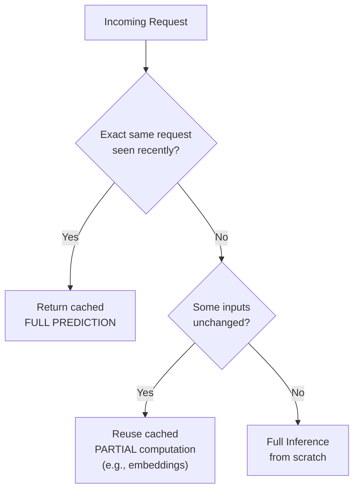
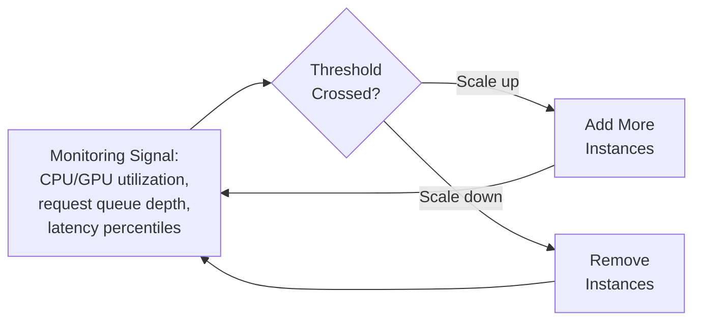

## Introduction

Chapter 28 reduced the cost of a single inference call. This chapter addresses the two complementary system-level techniques for handling *many* inference calls efficiently and reliably under real, variable production load: caching (avoiding redundant computation entirely) and auto-scaling (matching serving capacity to actual demand). Together with dynamic batching (Chapter 26) and compression (Chapter 28), these form the complete toolkit for a cost-efficient, resilient serving system.

## Caching for ML Inference

**Core idea**: if the same (or a sufficiently similar) prediction request is likely to recur, storing and reusing a previously-computed result avoids the cost of recomputing it — a classic, general software engineering technique that applies directly, with some ML-specific nuance, to model serving.

### What Can Be Cached



- **Full prediction caching**: cache the entire final prediction, keyed by the exact input — most effective when the same exact input recurs frequently (e.g., a popular product's recommendation score, or a frequently-searched query).
- **Partial/intermediate result caching**: cache an expensive intermediate computation that's shared across many different requests — for example, caching a user's or item's embedding (Chapter 14) so it doesn't need to be recomputed on every request, even if the final prediction (which might combine that embedding with other, request-specific context) differs each time.
- **Feature caching**: cache feature values themselves (this is essentially what the online feature store's role already is, from Chapter 13) rather than model outputs — reducing the cost of the feature retrieval stage specifically, independent of the model inference stage.

### Cache Invalidation: The Hard Part

The famous engineering aphorism — "there are only two hard problems in computer science: cache invalidation and naming things" — applies directly here. A cached prediction is only valid as long as the underlying model and features it was computed from remain the current, correct source of truth:

- **Time-based expiration (TTL)**: cache entries automatically expire after a fixed duration — simple, but a poor fit if the underlying data changes unpredictably (a TTL too long risks serving stale predictions; too short defeats the purpose of caching).
- **Event-based invalidation**: explicitly invalidate a cache entry when the underlying data actually changes (e.g., invalidate a user's cached recommendation the moment their behavior significantly changes) — more precise, but requires the system that changes the underlying data to also know about and trigger the cache invalidation, adding coupling between components.
- **Model-version-based invalidation**: whenever a new model version is deployed (Chapter 26's model registry tracks this), the entire cache (or the relevant portion of it) must be invalidated, since predictions computed by the old model are no longer valid outputs of the current model — a common and easy-to-overlook source of subtle bugs if not handled explicitly.

```python
import hashlib
import json
import redis

cache = redis.Redis(host="localhost", port=6379, db=0)

def get_cache_key(model_version: str, features: dict) -> str:
    # Including model_version in the key ensures a new model
    # deployment automatically produces cache misses for its
    # predictions, rather than serving stale, wrong-model results.
    feature_str = json.dumps(features, sort_keys=True)
    digest = hashlib.sha256(feature_str.encode()).hexdigest()
    return f"prediction:{model_version}:{digest}"

def predict_with_cache(model, model_version: str, features: dict, ttl_seconds: int = 300):
    cache_key = get_cache_key(model_version, features)

    cached = cache.get(cache_key)
    if cached is not None:
        return json.loads(cached)  # cache hit — no inference needed

    prediction = model.predict(features)
    cache.setex(cache_key, ttl_seconds, json.dumps(prediction))
    return prediction
```

### When Caching Doesn't Help

Caching is only valuable when there's genuine, meaningful **repetition** in requests. A highly personalized, real-time system (e.g., a fraud model scoring unique transactions, each with a distinct amount, timestamp, and context) has essentially no cache-hit opportunity for full predictions, since every request is effectively unique — in this case, caching effort should focus on the *feature* level (shared, reusable feature values like a user's account age) rather than the final prediction level, and compression (Chapter 28) or better hardware utilization becomes the more relevant lever for cost/latency reduction.

## Auto-Scaling for Inference

**Core idea**: automatically adjust the number of serving instances (or the compute resources allocated to them) in response to real-time traffic demand, rather than statically provisioning for either peak load (wasteful most of the time) or average load (unable to handle traffic spikes).

### Horizontal vs. Vertical Scaling

- **Horizontal scaling**: add or remove entire serving instances (e.g., more pods/containers, each running a full copy of the model server) — the more common and more flexible approach for stateless serving (Chapter 26), since it can scale smoothly across a wide range and provides natural redundancy.
- **Vertical scaling**: increase or decrease the resources (CPU, memory, GPU) allocated to a single existing instance — more limited in range (bounded by the largest available hardware configuration) and typically requires a restart, making it less suited to rapid, dynamic response to changing load compared to horizontal scaling.

### Scaling Triggers



- **Resource-based triggers**: scale based on CPU/GPU utilization crossing a threshold — simple and widely supported, but can lag behind actual user-facing impact (utilization might look fine even as request queues build up and latency degrades).
- **Latency-based triggers**: scale based on observed request latency (e.g., P95 latency exceeding a target) — more directly tied to actual user experience, but requires reliable, low-noise latency measurement to avoid reacting to transient spikes.
- **Queue-depth-based triggers**: scale based on the number of requests waiting to be processed — particularly relevant for GPU-based inference serving, where a growing request queue is often the earliest, clearest signal that current capacity is insufficient, before it fully manifests as degraded latency.

### The Cold-Start Problem for Auto-Scaling (Distinct from Chapter 7's Cold-Start)

A new serving instance, when it's spun up in response to a scale-up trigger, often takes meaningful time to become ready — loading a large model into memory (particularly slow for large deep learning models, potentially many seconds or longer), warming up any caches, and establishing connections to dependencies (feature store, etc.). During this "cold start" window, the new instance provides no relief to the already-overloaded existing instances, meaning a naive auto-scaling system can be too slow to actually help during a sudden traffic spike.

**Mitigations**:
- **Predictive/scheduled scaling**: if traffic patterns are reasonably predictable (e.g., known daily or weekly peaks), pre-emptively scale up *ahead* of the expected demand increase, rather than reacting only after load has already increased.
- **Maintaining a warm buffer**: keep a small number of extra instances already running and ready (beyond the current strict minimum needed), providing immediate headroom to absorb a sudden spike while new instances are still cold-starting.
- **Faster model loading**: techniques like lazy-loading only the specific model weights actually needed for a request, or using a more efficient serialized model format, can reduce the cold-start window itself.

## Caching and Auto-Scaling Working Together

These two techniques are complementary, not redundant: caching reduces the *volume* of requests that actually require full inference computation in the first place (reducing the load auto-scaling needs to handle at all), while auto-scaling ensures sufficient capacity for whatever load remains after caching's benefit — a well-designed system uses caching aggressively wherever genuine repetition exists, and relies on auto-scaling specifically to handle the residual, genuinely-unique-per-request load efficiently and cost-effectively across variable traffic patterns.

## Key Takeaways

- Caching (full predictions, partial computations, or features) avoids redundant computation when genuine request repetition exists — but provides little value for genuinely unique, highly personalized requests, where feature-level rather than prediction-level caching is more appropriate.
- Cache invalidation (time-based, event-based, or model-version-based) is the hard part of caching — a new model deployment must invalidate stale cached predictions from the previous model version, a commonly overlooked failure mode.
- Auto-scaling matches serving capacity to real-time demand, using horizontal scaling (preferred for stateless serving) triggered by resource utilization, latency, or queue depth signals.
- The auto-scaling cold-start problem (new instances taking time to become ready) can undermine responsiveness to sudden spikes — mitigated by predictive scaling, warm buffers, or faster model loading.

---

## Interview Questions

**1. What are the three levels at which caching can be applied in an ML serving system, and how would you decide which is most appropriate for a given system?**
Full prediction caching (caching the entire final output, keyed by the exact input), partial/intermediate result caching (caching an expensive shared computation like an embedding that's reused across different final predictions), and feature caching (caching input feature values themselves, independent of the model's output). The right choice depends on where genuine repetition exists in your specific system — if the exact same request recurs frequently (e.g., a popular item's score), full prediction caching is most effective; if final predictions are unique but share expensive sub-computations (e.g., a shared user embedding combined with varying real-time context), partial/intermediate caching captures the reusable value; if predictions are highly personalized and rarely repeat but the underlying input features are shared or slow to compute, feature-level caching (essentially the online feature store's role) is the most relevant lever.
*Follow-up: Could you use all three levels of caching simultaneously in a single system? Give an example.*
Yes — a recommendation system might cache a user's learned embedding (partial/intermediate caching, since it's expensive to compute and reused across many requests for that user), cache raw feature values like "user's account age" in the online feature store (feature caching), and also cache the full final recommendation list for a specific, high-traffic, non-personalized "trending items" fallback scenario (full prediction caching) — each layer addressing a different specific source of redundant computation within the same overall system, rather than being mutually exclusive alternatives.

**2. Why is cache invalidation described as "the hard part" of caching, and what specific ML-serving risk does this create if handled poorly?**
Determining exactly when a cached value has become stale and needs to be refreshed or removed is inherently difficult, because it requires the caching system (or something coordinating with it) to correctly know about every possible way the underlying "truth" the cache represents could have changed — miss one such trigger, and the cache will confidently serve an outdated, incorrect value with no obvious error or signal that anything is wrong; in ML serving specifically, the most consequential and easy-to-overlook invalidation trigger is a new model deployment — if a cache isn't explicitly tied to and invalidated by model version, it will continue serving predictions computed by the *previous* model version even after a new, presumably better model has been deployed, silently undermining the entire point of the model update and creating exactly the kind of "silent failure" (Chapter 4) this series has repeatedly warned about.
*Follow-up: How does including the model version in the cache key (as shown in the code example) solve this specific problem?*
By incorporating the model version identifier directly into the cache key used to store and retrieve predictions, any new model version automatically generates entirely new, distinct cache keys — meaning the new model version will naturally experience cache misses for every request until its own predictions have been freshly computed and cached under its own version-specific keys, ensuring stale predictions from a previous model version are never accidentally served under the new model's identity, without requiring any separate, explicit cache-flushing step to be remembered and correctly executed as part of the model deployment process.

**3. Why does caching provide little to no benefit for a highly personalized, real-time fraud detection system, and what alternative optimization approach would be more appropriate there?**
A fraud detection system typically evaluates each transaction based on highly specific, largely unique details (exact amount, exact timestamp, specific merchant, and combined with a rapidly-changing real-time behavioral context) — meaning the exact same full prediction request essentially never recurs, leaving no meaningful opportunity for full-prediction-level caching to provide any benefit; the more appropriate optimization approaches for this kind of genuinely unique-per-request system are feature-level caching (reusing feature values, like account age, that don't need to be recomputed even though the overall prediction is unique) combined with model compression (Chapter 28) and efficient batching (Chapter 26) to reduce the actual per-request inference cost itself, since caching the final, always-unique prediction output simply isn't a viable lever here.
*Follow-up: How would you determine, for a new system you're designing, whether caching is likely to provide meaningful value before investing engineering effort in building a caching layer?*
I'd analyze the expected distribution of request patterns — specifically, estimating what fraction of requests are likely to be exact or near-exact duplicates of previously-seen requests within a reasonable time window (e.g., by examining historical request logs from a similar existing system, or reasoning about the nature of the specific use case, like a "trending/popular items" feature where high overlap is expected versus a real-time fraud score where it isn't) — only investing in building a full-prediction caching layer if this analysis suggests a meaningfully high cache-hit rate is achievable, rather than assuming caching is broadly beneficial without first validating that genuine repetition actually exists in the specific system's real traffic pattern.

**4. What's the difference between horizontal and vertical scaling, and why is horizontal scaling generally preferred for stateless model serving?**
Horizontal scaling adds or removes entire, independent serving instances (each capable of handling requests on its own) in response to changing demand; vertical scaling instead increases or decreases the compute resources (CPU, memory, GPU) allocated to a single existing instance. Horizontal scaling is generally preferred for stateless serving (Chapter 26) because it can scale smoothly and incrementally across a very wide range simply by adding more identical instances, provides natural redundancy (if one instance fails, others continue serving traffic), and doesn't require restarting an existing instance to change its capacity — whereas vertical scaling is bounded by the largest available single-machine hardware configuration and typically requires a restart to take effect, making it a less flexible, less responsive mechanism for handling the kind of continuous, dynamic demand fluctuation a production serving system typically experiences.
*Follow-up: Is there a scenario in ML serving where vertical scaling might still be a necessary or reasonable choice, despite horizontal scaling's general advantages?*
Vertical scaling becomes necessary when a single request fundamentally requires more resources than a single instance's current configuration can provide at all — for example, if a model is too large to fit in a single GPU's memory (echoing the model-parallelism memory constraint from Chapter 17), no amount of horizontal scaling (adding more identical, individually-too-small instances) can solve this, and the instance's own resource allocation (e.g., using a GPU with more memory, or a multi-GPU instance) must be increased instead — meaning vertical scaling addresses a fundamentally different question (can a single instance handle a single request at all) than horizontal scaling (how many concurrent requests can the overall system handle), and both may be genuinely necessary together for very large-model serving scenarios.

**5. Describe the auto-scaling "cold-start problem" and explain why it's a distinct concept from the ML cold-start problem introduced in Chapter 7.**
The auto-scaling cold-start problem refers to the delay between when a scale-up trigger fires (in response to increased demand) and when a newly-provisioned serving instance actually becomes ready to handle traffic — during this window (which can be significant for large models that take time to load into memory), the new instance provides zero relief to the already-overloaded existing capacity, meaning a purely reactive auto-scaling system can be too slow to actually help during a sudden traffic spike. This is a distinct, unrelated concept from Chapter 7's ML cold-start problem, which concerns a *model* having insufficient training data for a brand-new entity (user, product) — the auto-scaling cold-start problem is purely an infrastructure/operational concern about instance readiness time, having nothing to do with data availability or model training at all; the shared terminology ("cold start") reflects a loosely similar underlying pattern (something new that isn't yet ready/warmed-up) but the two concepts operate in entirely different parts of the system and require entirely different mitigation strategies.
*Follow-up: What specific factor makes the auto-scaling cold-start problem more pronounced for large deep learning models compared to smaller, simpler classical ML models?*
Loading a large deep learning model's weights into memory (and onto a GPU, if applicable) can take a non-trivial amount of time proportional to the model's size — for a very large model, this loading process alone (before the instance can even begin serving its first request) can take many seconds or longer, whereas a small, simple classical ML model (like a small logistic regression or a lightweight gradient boosted tree) can typically be loaded into memory almost instantaneously — meaning the auto-scaling cold-start problem is a proportionally much more significant concern for systems serving large deep learning models than for systems serving small, lightweight classical models, directly motivating techniques like model compression (Chapter 28, which also produces smaller, faster-to-load models as a side benefit) or the warm-buffer mitigation discussed in this chapter specifically for large-model serving scenarios.

**6. Why might resource-utilization-based auto-scaling triggers (like CPU/GPU utilization) sometimes fail to accurately reflect actual user-facing performance degradation?**
Resource utilization metrics measure how busy the underlying hardware is, but this doesn't always directly and immediately correlate with user-facing latency — for example, if incoming requests are being queued (waiting for their turn) rather than actively being processed by a busy resource, utilization might appear moderate or even low (since the resource itself isn't necessarily the bottleneck) while actual end-to-end request latency is degrading significantly due to this queuing delay, meaning a purely utilization-based trigger could fail to detect and respond to this real, user-impacting problem until it manifests as a utilization spike, by which point meaningful user-facing latency degradation may have already been occurring for some time.
*Follow-up: What alternative or complementary trigger would you recommend to more directly and immediately capture this specific queuing-related degradation?*
Queue-depth-based triggers (monitoring the number of requests waiting to be processed, rather than the utilization of the resource processing them) or direct latency-based triggers (monitoring actual observed request latency, e.g., P95 or P99 percentiles) would more directly and immediately capture this specific failure mode, since a growing request queue or degrading latency is a more direct, leading indicator of genuine user-facing performance problems than resource utilization alone — many production auto-scaling systems use a combination of these signals together (rather than relying on any single trigger type exclusively) specifically to catch different failure modes that any one signal alone might miss.

**7. How would you design an auto-scaling strategy for a system with a known, highly predictable daily traffic pattern (e.g., consistently peaking every day at 9 AM as users start their workday)?**
I'd implement predictive/scheduled scaling specifically calibrated to this known pattern — proactively increasing serving capacity shortly before the predictable 9 AM peak begins (rather than waiting for a reactive trigger to fire only after the traffic increase has already started), ensuring sufficient capacity is already warmed up and ready by the time the actual demand surge hits, directly avoiding the cold-start problem's impact for this specific, well-understood and predictable scenario — while still maintaining reactive auto-scaling as a complementary safety net to handle any unexpected deviations from this predictable pattern (e.g., an unusually large or early spike) that scheduled scaling alone wouldn't anticipate.
*Follow-up: What would be a risk of relying purely on predictive/scheduled scaling without any reactive component, even for a system with a historically very consistent traffic pattern?*
A purely predictive/scheduled approach assumes the future will continue to closely match historical patterns, but real-world traffic can and does occasionally deviate from historical norms — a viral event, a marketing campaign, an unexpected external event driving unusual traffic, or simply gradual organic growth changing the pattern's actual timing or magnitude over time — without a reactive component to detect and respond to these deviations, a purely predictive system would fail to adequately scale for any traffic pattern it didn't specifically anticipate in its schedule, potentially leading to a significant capacity shortfall and degraded user experience during exactly these kinds of unusual, high-impact events that a well-designed system should ideally be more, not less, resilient to.

**8. Why is maintaining a "warm buffer" of extra ready instances a reasonable mitigation for the auto-scaling cold-start problem, and what's the cost trade-off involved?**
A warm buffer keeps some number of extra serving instances already running and ready beyond the current minimum strictly needed for present traffic, providing immediate, already-warmed-up capacity that can absorb a sudden traffic spike instantly, without needing to wait for the cold-start delay of provisioning and warming up entirely new instances in response to the spike — this directly trades off some amount of ongoing, "wasted" infrastructure cost (paying for capacity that isn't being actively used most of the time) for improved responsiveness and resilience against sudden, unpredicted traffic increases that scheduled/predictive scaling wouldn't anticipate and pure reactive scaling would respond to too slowly.
*Follow-up: How would you determine the appropriately-sized warm buffer for a specific system, balancing this cost-versus-resilience trade-off?*
I'd analyze the system's historical traffic volatility (how large and how sudden past unexpected traffic spikes have actually been) and the actual measured cold-start delay for a new instance to become ready, sizing the warm buffer to be large enough to absorb a reasonably-sized, realistic unexpected spike for the duration of that cold-start delay, without being so large that the ongoing cost of maintaining that excess, mostly-idle capacity becomes disproportionate to the actual risk being mitigated — this is fundamentally the same kind of cost-benefit, empirically-grounded reasoning applied throughout this series (e.g., Chapter 6's metric trade-offs, Chapter 28's compression accuracy tolerance) rather than an arbitrary buffer size chosen without reference to the system's actual observed traffic behavior and cost constraints.

**9. How does caching interact with the auto-scaling needs of a system — does effective caching reduce or eliminate the need for auto-scaling?**
Effective caching reduces the *volume* of requests that require full, expensive model inference computation (since cache hits are served quickly and cheaply without invoking the underlying model at all), which correspondingly reduces the total compute capacity needed to handle a given level of incoming request traffic — but it doesn't eliminate the need for auto-scaling entirely, since there will typically still be a residual volume of cache misses (genuinely new or unique requests) that still require full inference capacity, and this residual volume can still vary significantly with overall traffic patterns, still requiring auto-scaling to efficiently and cost-effectively match serving capacity to that remaining, variable demand.
*Follow-up: Could a sudden change in cache-hit rate itself (rather than a change in raw request volume) trigger a need for auto-scaling, even if total incoming request volume stays constant?*
Yes — if the underlying cache-hit rate suddenly drops (for example, due to a new model deployment invalidating the entire cache as discussed earlier in this chapter, or a sudden shift in the nature of incoming requests toward more unique, less-cacheable patterns), the volume of requests actually requiring full inference computation would increase correspondingly even with constant total incoming request volume, potentially necessitating an auto-scaling response despite no change in the raw, top-level traffic numbers — this is a subtle but important interaction to monitor, since a naive auto-scaling system watching only raw request volume (rather than the actual computational load reaching the underlying model servers, post-cache) could fail to correctly anticipate and respond to this kind of cache-driven capacity need.

**10. Why might a team choose event-based cache invalidation over simple time-based (TTL) expiration for a specific feature, despite the added implementation complexity?**
Time-based expiration is simple to implement but represents a blunt, generic trade-off — a TTL long enough to provide meaningful caching benefit risks serving stale data for a potentially problematic duration if the underlying data changes unpredictably or urgently, while a TTL short enough to minimize staleness risk may be too short to provide meaningful caching benefit at all; event-based invalidation, by contrast, precisely invalidates a cache entry exactly when the underlying data genuinely changes (rather than on a fixed, generic schedule unrelated to actual data change events), allowing a cache to be both maximally effective (kept valid for as long as the underlying data is genuinely unchanged, however long or short that happens to be) and maximally accurate (invalidated immediately when a genuine change occurs, rather than continuing to serve a now-stale value until an arbitrary TTL expires) — a team would accept the added implementation complexity of building this event-triggered invalidation mechanism specifically when the cost of serving stale data for even a short, unpredictable window is high enough to justify the additional engineering investment.
*Follow-up: What's a concrete scenario where the cost of serving even briefly stale cached data would be high enough to justify this additional complexity?*
A cached fraud risk score for a specific user that fails to reflect a just-occurred, highly significant behavioral change (e.g., the user's account was just reported as compromised) — continuing to serve a stale, pre-compromise low-risk cached score for even a short TTL-based expiration window could allow fraudulent transactions to proceed unchecked during exactly the critical window when the risk assessment most urgently needed to be updated; in this kind of high-stakes, time-sensitive scenario, event-based invalidation (immediately invalidating the cached score the moment the compromise is reported, rather than waiting for a generic TTL to expire) would be clearly justified despite its added implementation complexity, given the significant real-world cost of even briefly serving an outdated, dangerously-stale cached value.

**11. How would you design a monitoring and alerting strategy specifically for a caching layer in a production ML serving system, beyond simply monitoring the overall serving system's latency and error rate?**
I'd specifically track the cache hit rate over time (a sudden, unexpected drop could indicate a problem like an overly aggressive or incorrectly-triggered invalidation, a bug in cache key generation, or a genuine shift in traffic patterns reducing natural repetition) and cache staleness metrics where feasible (e.g., periodically sampling cached values and comparing them against a freshly-computed equivalent to detect if invalidation is failing to occur as expected) — treating the caching layer's own specific health and correctness as a distinct, monitored concern separate from (though related to) the overall serving system's general latency and error rate, since a caching bug (like stale predictions being served due to a missed invalidation trigger) might not manifest as an obvious latency or error rate problem at all, potentially remaining a silent, undetected correctness issue (echoing Chapter 4's "silent failure" theme) without this kind of dedicated, cache-specific monitoring.
*Follow-up: Why might a cache hit rate that's "too high" also be worth investigating, rather than assuming higher is always simply better?*
An unexpectedly very high cache hit rate could indicate that the cache is failing to properly differentiate between genuinely distinct requests that should produce different results — for example, a bug in the cache key generation logic (perhaps accidentally omitting a field that should have been part of the key, similar to the model-version-inclusion example discussed earlier) could cause genuinely different requests to incorrectly collide on the same cache key, resulting in an artificially inflated hit rate while actually serving incorrect, mismatched cached results for some fraction of those "hits" — this is a subtle but real risk worth specifically investigating whenever a cache hit rate looks surprisingly, suspiciously high relative to what the system's actual expected request repetition pattern would reasonably predict.

**12. In a system design interview, how would you respond if an interviewer asked you to design caching and auto-scaling for a system without first telling you anything about its expected traffic pattern or request characteristics?**
I'd explicitly ask clarifying questions before proposing a specific design — specifically, what fraction of requests are likely to be repeated or similar to previous requests (informing whether and what kind of caching would be valuable, per this chapter's earlier discussion), and what the traffic pattern looks like over time (is it fairly steady, does it have predictable daily/weekly peaks, or is it highly volatile and unpredictable — informing whether predictive scheduled scaling, a warm buffer, or purely reactive scaling would be most appropriate) — since, as established throughout this chapter, the right caching and auto-scaling strategy depends heavily on these specific characteristics, and proposing a generic strategy without first understanding them risks recommending an approach genuinely mismatched to the actual system's needs.
*Follow-up: If the interviewer says "assume traffic is highly volatile and unpredictable, with no reliable pattern," how would this specifically shape your auto-scaling recommendation?*
Given genuinely unpredictable traffic with no reliable pattern to exploit, I'd de-emphasize predictive/scheduled scaling (since there's no reliable pattern to schedule against) and instead invest more heavily in fast, responsive reactive auto-scaling combined with a meaningfully-sized warm buffer specifically to help absorb sudden, unanticipated spikes during the unavoidable cold-start delay of provisioning genuinely new capacity — and I'd favor auto-scaling triggers most directly and quickly reflective of actual user-facing impact (queue depth and latency-based triggers, per the earlier discussion) over slower-to-manifest resource-utilization-based triggers, since with unpredictable traffic, minimizing detection and response time to an actual emerging problem becomes even more critical than it would be in a more predictable traffic environment where scheduled scaling could otherwise absorb much of the burden.

**13. Why might a model server intentionally serve a cached, slightly stale prediction rather than always computing a fresh one, even when computing a fresh prediction is entirely technically feasible within the latency budget?**
Even when computing a fresh prediction is technically feasible latency-wise, doing so for every single request still consumes real compute resources and cost — if the underlying value changes slowly enough that a slightly stale cached value provides essentially the same practical utility as a perfectly fresh one (e.g., a product's general popularity-based recommendation score that only meaningfully changes over hours or days, not seconds), intentionally serving a reasonably fresh cached value rather than always recomputing from scratch can achieve substantial cost savings and reduce overall system load, freeing up capacity for other requests, with a practically negligible impact on actual prediction quality or user experience — this is a deliberate, informed engineering trade-off (accepting a small, bounded staleness in exchange for meaningful efficiency gains) rather than a compromise forced by a latency constraint that couldn't otherwise be met.
*Follow-up: How would you determine an appropriate TTL for this kind of "intentional staleness for efficiency" caching strategy?*
I'd analyze how quickly the underlying value being cached actually changes in practice (e.g., through historical analysis of how much a specific feature or prediction typically shifts over different time windows) and choose a TTL that keeps the resulting staleness within a range that's practically indistinguishable, in terms of real-world impact on the online/business metrics from Chapter 6, from always using a perfectly fresh value — validating this choice, similar to the compression accuracy-tolerance discussion in Chapter 28, through actual A/B testing (Chapter 22) comparing the cached, TTL-based approach against always-fresh computation, to empirically confirm the chosen staleness tolerance doesn't measurably harm the actual business outcomes the system cares about, rather than choosing a TTL based on intuition alone.

**14. How would you handle a situation where auto-scaling is working correctly (adding instances in response to increased load) but the newly-added instances are unable to connect to the online feature store fast enough, becoming a new bottleneck?**
This reveals that the feature store itself (or the network path to it) may not be scaling proportionally with the serving layer — I'd investigate whether the feature store's own capacity (its own auto-scaling configuration, connection pool limits, or underlying infrastructure capacity) is keeping pace with the increased number of serving instances now querying it concurrently, since a bottleneck anywhere in the request path (as emphasized by the latency budget decomposition principle from Chapter 26) undermines the benefit of scaling any other individual component in isolation; the fix likely involves ensuring the feature store's own scaling strategy and capacity planning account for the maximum expected number of concurrent serving instances that might query it, rather than treating serving-layer auto-scaling and feature-store capacity as independent, unrelated concerns that happen to interact only accidentally.
*Follow-up: Why is this scenario a good illustration of why system design requires thinking about the entire pipeline holistically, rather than optimizing individual components in isolation?*
This scenario directly demonstrates that optimizing or scaling any single component of a multi-stage pipeline in isolation, without considering its downstream and upstream dependencies, can simply shift the actual bottleneck elsewhere in the system rather than genuinely resolving the underlying capacity problem — successfully auto-scaling the model serving layer accomplishes nothing if the feature store it depends on becomes the new limiting factor, reinforcing the recurring theme throughout this series (echoed in Chapter 26's latency decomposition and Chapter 29's own caching-and-scaling interaction discussion) that genuinely effective system design requires reasoning about the complete, end-to-end pipeline and its various interacting bottlenecks together, rather than treating each individual component's scaling or optimization as a fully independent, self-contained problem.

**15. How would you summarize, for someone new to ML system design, the relationship between compression (Chapter 28), caching, and auto-scaling (this chapter) as three distinct levers for managing serving cost and latency?**
I'd frame them as addressing three fundamentally different aspects of the same overall cost/latency challenge: compression (Chapter 28) reduces the fundamental cost of a *single* inference computation itself, benefiting every request regardless of whether it's repeated or unique; caching avoids paying that (now-reduced, if compression is also applied) inference cost altogether for requests that are genuinely repeated or share reusable sub-computations; and auto-scaling ensures the system has exactly the right amount of serving capacity, dynamically, to efficiently and cost-effectively handle whatever volume of requests remains after caching's benefit, without over- or under-provisioning relative to actual real-time demand — together, these three levers address, respectively, the cost of an individual computation, the avoidance of unnecessary repeated computation, and the efficient matching of total capacity to variable aggregate demand, forming a complete, complementary toolkit rather than three competing or redundant approaches to the same problem.
*Follow-up: If you had to prioritize investing engineering effort in just one of these three levers first, for a brand-new ML serving system with no existing optimization in place, which would you choose, and why?*
I'd generally prioritize establishing solid auto-scaling first, since it's the most fundamental safety net against both wasted cost (over-provisioning for load that doesn't materialize) and poor reliability/user-experience (under-provisioning and failing to handle actual real demand) — compression and caching are valuable, high-leverage optimizations, but they're refinements that improve efficiency *within* whatever capacity auto-scaling has provisioned; without reasonable auto-scaling in place first, a system risks either significant, ongoing wasted infrastructure spend or genuine reliability problems under variable real-world traffic, which are more fundamental, higher-priority risks to address before investing further effort in the comparatively more incremental efficiency gains that compression and caching provide on top of an already-reasonably-provisioned serving foundation.
