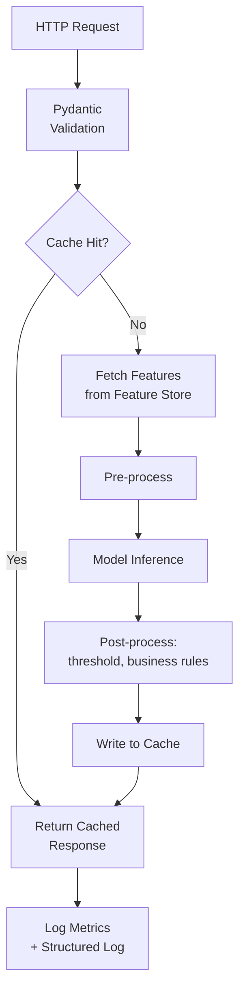

## Introduction

Part 6 has covered serving architectures (Chapter 26), protocols (Chapter 27), compression (Chapter 28), and caching/auto-scaling (Chapter 29) as separate concepts. This closing chapter of the Part builds a single, cohesive, hands-on example that ties them together: a production-shaped model-serving gateway in Python using **FastAPI**, a modern, high-performance web framework well-suited to ML serving thanks to its native async support and built-in request/response validation via Pydantic.

This isn't meant to be a drop-in production system — real production serving typically layers a purpose-built framework like Triton or TorchServe underneath a gateway like this (Chapter 26) — but building one from the ground up is the clearest way to see exactly how the pieces from this entire Part fit together in actual code.

## The Full Request Pipeline

We'll implement every stage from Chapter 26's serving pipeline diagram: request validation → feature retrieval (with caching) → pre-processing → inference → post-processing → response, with observability hooks and graceful error handling throughout.



## Step 1: Request and Response Schemas

```python
# schemas.py
from pydantic import BaseModel, Field

class FraudPredictionRequest(BaseModel):
    transaction_id: str = Field(..., description="Unique ID for idempotency and logging")
    user_id: str
    amount: float = Field(..., ge=0, le=1_000_000)
    merchant_category: str

class FraudPredictionResponse(BaseModel):
    transaction_id: str
    fraud_probability: float
    decision: str
    model_version: str
    cached: bool
```

Pydantic's validation here directly implements Chapter 10's schema-validation discipline at the serving layer — a malformed request (e.g., a negative amount) is rejected automatically, before it ever reaches feature retrieval or the model.

## Step 2: The Feature Store Client (with Caching, per Chapters 13 & 29)

```python
# feature_client.py
import json
import redis.asyncio as redis

class FeatureStoreClient:
    """
    A thin async client wrapping the online feature store from
    Chapter 13. Includes feature-level caching (Chapter 29) since
    some features (e.g., account_age_days) change infrequently.
    """
    def __init__(self, redis_client: redis.Redis, ttl_seconds: int = 60):
        self.cache = redis_client
        self.ttl_seconds = ttl_seconds

    async def get_features(self, user_id: str) -> dict:
        cache_key = f"features:{user_id}"
        cached = await self.cache.get(cache_key)
        if cached:
            return json.loads(cached)

        # In production this would call the actual feature store's
        # low-latency API (e.g., Feast's online store, Chapter 13).
        features = await self._fetch_from_feature_store(user_id)
        await self.cache.setex(cache_key, self.ttl_seconds, json.dumps(features))
        return features

    async def _fetch_from_feature_store(self, user_id: str) -> dict:
        # Placeholder for the real feature store call.
        return {
            "account_age_days": 452,
            "txn_count_last_30d": 17,
            "avg_txn_amount_30d": 84.20,
        }
```

## Step 3: The Model Wrapper (Pre/Post-processing, per Chapters 12, 15, 21)

```python
# model_wrapper.py
import numpy as np

class FraudModel:
    """
    Wraps the trained model with the EXACT pre-processing logic used
    during training (Chapter 12) — the single most important place
    to prevent training-serving skew (Chapter 15).
    """
    def __init__(self, model, scaler, version: str, decision_threshold: float = 0.8):
        self.model = model
        self.scaler = scaler  # the SAME fitted StandardScaler from training
        self.version = version
        self.decision_threshold = decision_threshold  # chosen per Chapter 21's cost-asymmetry analysis

    def predict(self, request_features: dict, store_features: dict) -> dict:
        raw_vector = np.array([[
            request_features["amount"],
            store_features["account_age_days"],
            store_features["txn_count_last_30d"],
            store_features["avg_txn_amount_30d"],
        ]])

        # Identical scaling logic to training (Chapter 12) — loaded,
        # not re-fit, at serving time.
        scaled_vector = self.scaler.transform(raw_vector)

        probability = float(self.model.predict_proba(scaled_vector)[0][1])
        decision = "block" if probability > self.decision_threshold else "allow"

        return {"fraud_probability": probability, "decision": decision}
```

## Step 4: The FastAPI Application, Assembling Everything

```python
# main.py
import time
import logging
import joblib
from fastapi import FastAPI, HTTPException
import redis.asyncio as redis

from schemas import FraudPredictionRequest, FraudPredictionResponse
from feature_client import FeatureStoreClient
from model_wrapper import FraudModel

logger = logging.getLogger("fraud_serving")
app = FastAPI(title="Fraud Detection Serving Gateway")

MODEL_VERSION = "v2024_09_14"

@app.on_event("startup")
async def startup():
    # Load model artifacts ONCE at startup, not per-request — a
    # classic and easy-to-miss latency mistake (loading is slow;
    # inference should be the only per-request cost, per Ch. 26).
    app.state.redis = redis.Redis(host="localhost", port=6379)
    app.state.feature_client = FeatureStoreClient(app.state.redis)

    model = joblib.load(f"models/{MODEL_VERSION}/model.pkl")
    scaler = joblib.load(f"models/{MODEL_VERSION}/scaler.pkl")
    app.state.fraud_model = FraudModel(model, scaler, version=MODEL_VERSION)

@app.on_event("shutdown")
async def shutdown():
    await app.state.redis.close()

@app.post("/predict", response_model=FraudPredictionResponse)
async def predict(request: FraudPredictionRequest):
    start = time.monotonic()

    # Cache key includes model version (Chapter 29) so a new
    # deployment can never accidentally serve a stale prediction.
    cache_key = f"prediction:{MODEL_VERSION}:{request.transaction_id}"
    cached = await app.state.redis.get(cache_key)
    if cached:
        import json
        result = json.loads(cached)
        return FraudPredictionResponse(
            transaction_id=request.transaction_id,
            fraud_probability=result["fraud_probability"],
            decision=result["decision"],
            model_version=MODEL_VERSION,
            cached=True,
        )

    try:
        store_features = await app.state.feature_client.get_features(request.user_id)
    except Exception as e:
        # A feature store failure must NOT crash the request outright
        # if a reasonable fallback exists (Chapter 26's dependency
        # failure-handling discussion). Here we choose to fail fast
        # instead, since fraud features are safety-critical — a
        # deliberate, documented decision, not an oversight.
        logger.error(f"Feature store failure for user {request.user_id}: {e}")
        raise HTTPException(status_code=503, detail="Feature store unavailable")

    result = app.state.fraud_model.predict(
        request_features=request.model_dump(),
        store_features=store_features,
    )

    import json
    await app.state.redis.setex(cache_key, 300, json.dumps(result))

    latency_ms = (time.monotonic() - start) * 1000
    logger.info({
        "transaction_id": request.transaction_id,
        "model_version": MODEL_VERSION,
        "latency_ms": latency_ms,
        "decision": result["decision"],
        "cached": False,
    })  # structured logging feeds directly into Chapter 48's observability stack

    return FraudPredictionResponse(
        transaction_id=request.transaction_id,
        fraud_probability=result["fraud_probability"],
        decision=result["decision"],
        model_version=MODEL_VERSION,
        cached=False,
    )

@app.get("/health")
async def health():
    # A standard health-check endpoint, essential for auto-scaling
    # (Chapter 29) and orchestration (Kubernetes readiness probes) to
    # know when an instance is genuinely ready to receive traffic.
    return {"status": "ok", "model_version": MODEL_VERSION}
```

## What This Example Deliberately Demonstrates

- **Model loading at startup, not per-request** — the single most common beginner mistake in hand-rolled model servers, and a direct, severe latency bug if missed.
- **Cache keys including the model version** — directly applying Chapter 29's cache-invalidation lesson.
- **Pydantic validation as the first line of defense** — Chapter 10's data validation discipline, applied at the serving boundary.
- **An explicit, documented decision about feature-store failure handling** — rather than an accidental, unexamined behavior, reflecting Chapter 26's point that dependency failure handling should be a deliberate design choice.
- **Structured logging of every prediction**, including latency and cache status — the raw material that both Chapter 15's skew detection and Chapter 48's production monitoring depend on.

## What This Example Deliberately Omits (and Why)

A real production system would add: authentication/authorization, request rate limiting (Chapter 55), distributed tracing spans around each pipeline stage (for the latency decomposition from Chapter 26), a circuit breaker around the feature store call (Chapter 75), and integration with a purpose-built model server (Triton/TorchServe, Chapter 38) for dynamic batching if GPU inference were involved rather than the lightweight scikit-learn model implied here. This chapter's example is intentionally scoped to make Part 6's core concepts concrete and traceable in real code, not to be a complete production checklist — that checklist is exactly what Part 7 (MLOps & Production Systems) builds out next.

## Key Takeaways

- A model-serving gateway is where every concept from Part 6 becomes concrete: request validation (Chapter 10's discipline applied at the API boundary), feature retrieval with caching (Chapters 13, 29), pre/post-processing matched exactly to training (Chapters 12, 15), and structured logging feeding observability (a preview of Chapter 48).
- Loading models and initializing clients at application startup — never per-request — is a foundational, easy-to-get-wrong latency requirement for any hand-built server.
- Every external dependency call (feature store, cache) needs an explicit, deliberate failure-handling decision, not an accidental default behavior.
- This hand-built example clarifies the underlying mechanics; real production systems typically layer a purpose-built serving framework (Chapter 38) underneath a gateway like this rather than replacing it entirely.

---

## Interview Questions

**1. Why is loading the model at application startup, rather than on each incoming request, considered such a fundamental requirement for a model-serving application?**
Loading a trained model (deserializing its weights/parameters from disk, and for larger models, transferring them onto a GPU) is a relatively slow operation that can take anywhere from milliseconds to many seconds depending on model size, whereas actual inference on an already-loaded model is comparatively fast; if a naive implementation loaded the model fresh on every incoming request, every single request would incur this full model-loading cost on top of the actual inference cost, making per-request latency dramatically and unnecessarily worse (potentially by orders of magnitude) than a correctly-implemented server that loads the model exactly once and reuses the already-loaded, in-memory model object across all subsequent requests.
*Follow-up: How does the FastAPI `startup` event handler used in this chapter's example specifically address this requirement?*
FastAPI's `startup` event handler runs exactly once, when the application process first starts (before it begins accepting any incoming requests), making it the correct place to perform one-time initialization work like loading the model and scaler artifacts and storing them in `app.state` — this ensures the potentially slow model-loading operation happens only once per server process lifetime, and every subsequent request handler can simply access the already-loaded model object from `app.state` rather than needing to reload it, directly implementing the "load once, reuse many times" pattern this question describes.

**2. Why does the example's cache key include the model version, and what specific bug would occur if it didn't?**
Including the model version in the cache key ensures that predictions computed by different model versions are stored under entirely distinct cache keys, so a newly-deployed model version will naturally experience cache misses (forcing fresh computation using the new model) rather than potentially retrieving a stale cached prediction that was actually computed by a previous, different model version; without this, deploying a new model version wouldn't automatically invalidate previously-cached predictions from the old model, meaning the system could silently continue serving old-model predictions from the cache even after the new model has been deployed and is believed to be actively serving traffic — a direct instance of the cache-invalidation risk discussed in Chapter 29, and a particularly insidious bug because it would produce no errors or obvious symptoms, just silently incorrect (stale-model) predictions for cached transaction IDs.
*Follow-up: If a specific transaction_id could theoretically be submitted more than once by a legitimate client (not just a retry), would caching by transaction_id alone (even with model version included) still be appropriate?*
It depends on the intended semantics — if a transaction_id is meant to be a genuinely unique, one-time identifier for a specific transaction (as its name and the `Field(..., description="...idempotency...")` annotation suggest), then caching by transaction_id is appropriate and even beneficial, since it provides natural idempotency (a retried request for the same transaction correctly returns the same cached result rather than potentially re-evaluating and returning a different result the second time, which is important for consistency in a fraud-decision context); if transaction_id could legitimately be reused for genuinely different transactions, however, caching by transaction_id alone would be incorrect regardless of model versioning, and the cache key would need to incorporate additional fields (like the specific amount and timestamp) to properly distinguish genuinely different transactions.

**3. Why does the example explicitly choose to "fail fast" (raise an HTTPException) when the feature store call fails, rather than falling back to some default feature values and proceeding with a prediction anyway?**
This reflects a deliberate, safety-conscious design decision specific to fraud detection's cost-asymmetry profile (Chapter 3) — proceeding with a prediction based on missing or default (rather than genuinely current) feature values could produce a meaningfully less accurate fraud assessment, and in a high-stakes context like fraud detection, silently returning a potentially unreliable prediction (rather than clearly failing and signaling that a reliable prediction couldn't be made) could be more dangerous than simply failing the request outright and allowing the calling system to handle this failure explicitly (e.g., by falling back to a simpler rules-based check, or by holding the transaction for manual review) — this is presented as an explicit, documented choice specifically because a different system with a different risk profile might reasonably make the opposite choice.
*Follow-up: Describe a different, plausible ML serving scenario where falling back to default feature values and proceeding with a degraded prediction would be the more appropriate choice instead.*
A content recommendation system experiencing a feature store failure for a specific, lower-stakes personalization feature (e.g., a user's detailed browsing history embedding) might reasonably fall back to a simpler, non-personalized "trending content" default or a cached previous recommendation, proceeding with a degraded but still reasonably useful response rather than failing the request entirely and showing the user nothing at all — since the cost of a suboptimal, less-personalized recommendation is generally much lower than the cost of a broken user experience (an empty or error page), unlike fraud detection where a degraded, potentially unreliable risk assessment carries a meaningfully higher and more asymmetric real-world cost.

**4. How does this chapter's example implement Chapter 10's data validation discipline, and at what specific point in the request pipeline does this validation occur?**
The example uses Pydantic models (`FraudPredictionRequest`) with explicit field constraints (e.g., `Field(..., ge=0, le=1_000_000)` on the `amount` field) to define the expected schema and valid value ranges for incoming requests — FastAPI automatically validates every incoming request against this schema before the request handler function's own code even begins executing, meaning malformed or out-of-range requests (like a negative transaction amount) are automatically rejected with a clear validation error at the very first stage of the pipeline, before any feature retrieval, caching lookup, or model inference is attempted on invalid data.
*Follow-up: Why is it valuable for this validation to happen as early as possible in the pipeline, rather than, say, within the model wrapper's predict method?*
Validating as early as possible (at the API boundary, before any other processing) avoids wasting compute and time on feature retrieval, cache lookups, and other pipeline stages for a request that's going to be rejected anyway due to an invalid schema — it also provides a clearer, more immediately actionable error message to the calling client (identifying exactly which field failed validation and why) right at the point of request submission, rather than potentially surfacing a more confusing, less specific error later in the pipeline (e.g., a cryptic numerical error deep inside the model's prediction logic if an invalid value somehow made it that far) — this "fail fast and clearly" principle, of catching problems as early and as specifically as possible, is a recurring good engineering practice reinforced throughout this series.

**5. Why might a real production version of this gateway need to add a circuit breaker around the feature store call, beyond the simple try/except error handling shown in this chapter's example?**
The simple try/except shown here handles a single failed call gracefully, but doesn't protect against a sustained, ongoing feature store outage — if the feature store is genuinely down for an extended period, every single incoming request would still attempt to call it, wait for it to fail or time out, and then handle that failure individually, which wastes time and resources on repeated, doomed-to-fail calls and could itself contribute to further overloading an already-struggling feature store or the calling service's own resources; a circuit breaker (previewed here, covered fully in Chapter 75) would detect this pattern of repeated failures and temporarily stop attempting calls to the feature store entirely for a period, immediately failing fast (or invoking a fallback) for new requests without even attempting the doomed call, giving the feature store time to recover without being bombarded by continued failed request attempts, and reducing wasted latency/resources on the calling side.
*Follow-up: How would adding a circuit breaker change the observed behavior of the `/predict` endpoint during a feature store outage, compared to the current implementation?*
Without a circuit breaker, each individual request during the outage would incur the full latency of attempting the feature store call, waiting for it to time out or fail, before finally raising the `HTTPException` — with a circuit breaker in place and "open" (tripped) after detecting a pattern of failures, subsequent requests would fail (or invoke a fallback) nearly immediately, without even attempting the slow, doomed feature store call, meaningfully reducing the latency experienced by callers during the outage and reducing unnecessary load on both the calling service and the struggling feature store, compared to every individual request independently attempting and waiting to fail on the same underlying broken dependency.

**6. Why does the health check endpoint in this example return the model version, rather than just a simple "ok" status?**
Returning the model version alongside the basic health status provides additional, immediately useful operational visibility — during a rolling deployment or canary release (Chapter 23), being able to query a specific serving instance's health endpoint and confirm exactly which model version it's currently running is valuable for verifying that a deployment has actually propagated correctly to that instance, or for diagnosing a situation where different instances in a serving pool might unexpectedly be running different model versions (e.g., during an incomplete or stuck rolling deployment) — this kind of extra diagnostic detail in a health check, beyond a minimal boolean up/down signal, is a small but genuinely useful addition for operational debugging and deployment verification.
*Follow-up: What's a risk of including too much detailed information in a health check endpoint, and how would you balance this against the value of diagnostic detail?*
A health check endpoint that performs extensive checks or returns a large amount of detailed information can itself become slow or resource-intensive to compute, which is counterproductive since health checks are typically called very frequently (e.g., by a load balancer or orchestrator like Kubernetes checking readiness) and need to be fast and lightweight themselves; the balance is to include only genuinely useful, cheap-to-compute diagnostic information (like the already-in-memory model version, which requires no additional computation to report) while avoiding more expensive checks (like actually querying the feature store or running a full test inference) within the main health check itself — potentially exposing a separate, more detailed diagnostic endpoint for deeper troubleshooting that isn't called as frequently as the lightweight primary health check used for routine load balancer/orchestrator decisions.

**7. How would you modify this example to support the shadow deployment pattern described in Chapter 23?**
I'd add a second, "shadow" model instance loaded alongside the primary production model at startup, and within the `/predict` handler, after computing the primary model's prediction (which is what's actually returned to the caller), I'd also invoke the shadow model's prediction using the same feature vector — logging both the primary and shadow predictions together (along with their respective latencies) for later offline comparison, while ensuring (per Chapter 23's isolation requirement) that any exception or excessive latency from the shadow model's prediction is caught and logged without ever affecting or delaying the actual response returned to the real caller, likely by running the shadow prediction asynchronously in a way that doesn't block the primary response path.
*Follow-up: Why would it be important to run the shadow model's inference asynchronously, in the specific context of this FastAPI-based example, rather than simply calling it synchronously right after the primary model's prediction?*
Since FastAPI is built on Python's async/await model, synchronously calling the shadow model's (potentially non-trivial-latency) inference directly within the main request-handling coroutine, before returning the response, would add that shadow inference's latency directly onto the response time experienced by the real caller — defeating the entire purpose of shadow deployment's zero-user-impact guarantee (Chapter 23); instead, the shadow inference call should be scheduled as a separate, non-blocking background task (e.g., using FastAPI's `BackgroundTasks` feature, or dispatching it to a separate async task that isn't awaited before returning the response) so it executes independently, after the primary response has already been sent back to the caller, ensuring the shadow model's latency and behavior have zero effect on the real user-facing response time.

**8. Why is structured logging (logging a dictionary of named fields, as shown in the example) generally preferable to simple, unstructured string logging for a production ML serving system?**
Structured logs (logging discrete, named fields like `transaction_id`, `latency_ms`, `decision`, rather than a single free-form string message) can be automatically parsed, indexed, filtered, and aggregated by log analysis and monitoring tools (feeding directly into the observability practices covered in Chapter 48) — allowing an engineer to easily query "show me all predictions with latency over 100ms" or "show me the decision distribution over the last hour" directly from the logs, which would be far more difficult and error-prone to extract reliably from unstructured, free-text log messages that would require fragile string-parsing or regex-based extraction to analyze at scale.
*Follow-up: What specific fields, beyond the ones shown in this chapter's example, would you add to the structured log for a production fraud detection system, and why?*
I'd add fields supporting the skew-detection and monitoring practices from earlier chapters — the actual feature values used for this specific prediction (supporting the offline/online feature-value comparison from Chapter 15), the specific fraud_probability score (not just the final binary decision, supporting more granular monitoring of the model's underlying confidence distribution over time per Chapter 32's drift monitoring), and a request-tracing/correlation ID (supporting distributed tracing across the full request pipeline, tying into Chapter 48's observability discussion) — each addition directly supporting a specific, concrete downstream monitoring or debugging use case established elsewhere in this series, rather than logging additional fields speculatively without a clear purpose.

**9. In an interview, if asked to identify weaknesses in this chapter's example code as currently written, what would you point out?**
I'd note several gaps intentionally left for Part 7's MLOps discussion: there's no authentication or authorization on the `/predict` endpoint (anyone with network access could call it); there's no rate limiting to protect against abuse or accidental traffic spikes (Chapter 55); the feature store failure handling, while deliberate, has no circuit breaker to handle a sustained outage efficiently (as discussed earlier in this chapter); there's no distributed tracing to break down latency by pipeline stage at the individual-request level (only an aggregate latency_ms logged per request, not a per-stage breakdown); and the model loading in the startup handler has no error handling of its own (if the model files are missing or corrupted, the application would likely crash on startup with a potentially unclear error, rather than failing gracefully with a clear diagnostic message).
*Follow-up: Which of these gaps would you prioritize fixing first if this were about to be deployed to handle real production traffic, and why?*
I'd prioritize adding authentication/authorization first, since an unauthenticated, publicly-accessible fraud-decision endpoint represents an immediate and severe security risk (allowing anyone to query the model's behavior, potentially enabling adversarial probing to reverse-engineer its decision boundary, or simply allowing unauthorized use of the service) — this is a fundamentally different category of risk (security) compared to the other gaps (which are primarily about resilience, observability, and operational robustness), and addressing a genuine security exposure should generally take priority over these other important but comparatively lower-immediate-risk gaps before any real production traffic is allowed to reach this endpoint.

**10. Why does the model wrapper class (`FraudModel`) store and use the exact same fitted `scaler` object from training, rather than creating a new `StandardScaler` and fitting it fresh at serving time?**
This directly implements the point-in-time and training-serving consistency principle from Chapters 12 and 15 — a `StandardScaler`'s transformation is defined by the mean and standard deviation it learned from the *training* data; fitting a *new* scaler at serving time (even using the same nominal feature) would compute different mean/standard-deviation parameters based on whatever data happened to be available at that moment, producing a different, inconsistent scaling transformation than what the model was actually trained to expect — loading and reusing the exact same fitted scaler object (typically saved/serialized alongside the model itself) ensures the serving-time feature scaling is bit-for-bit identical to what the model saw during training, directly preventing this specific, classic training-serving skew failure mode.
*Follow-up: How would you ensure, as an engineering practice, that the model and its corresponding scaler are always kept and deployed together as a matched pair, rather than risking a mismatch (e.g., accidentally loading a newer model with an older scaler)?*
I'd store the model and its corresponding scaler (and any other necessary pre-processing artifacts) together as a single, versioned bundle in the model registry (Chapter 26/43) — for example, saving them both under the same versioned directory path (as this chapter's example does, loading both from `models/{MODEL_VERSION}/`) — ensuring that loading a specific model version always retrieves its correctly-matched scaler as an atomic unit, rather than treating the model and scaler as independently-versioned artifacts that could accidentally be mismatched if updated or deployed separately from each other.

**11. Why might using `async def` for the `/predict` endpoint (rather than a regular synchronous `def`) matter for this specific gateway's performance, given that it makes an I/O-bound call to Redis?**
FastAPI's async support allows the web server to handle other incoming requests concurrently while one request is waiting on an I/O-bound operation (like the `await app.state.redis.get(...)` call to the feature cache) — during this waiting period, the underlying event loop can switch to processing a different request rather than the entire server process sitting idle, blocked, waiting for that one I/O operation to complete; if the endpoint were instead a regular synchronous function making a blocking Redis call, the entire worker process would be blocked and unable to handle any other incoming request until that specific blocking call completed, significantly limiting the server's overall concurrent request-handling capacity compared to the async version, especially under real production load with many concurrent requests.
*Follow-up: Would this async advantage still matter if the model inference step itself (a CPU-bound operation, not I/O-bound) took a very long time?*
No — async/await specifically helps with I/O-bound waiting (network calls, disk reads, database queries) by allowing the event loop to do other useful work during that waiting period, but a long-running, CPU-bound computation (like a slow model inference call) would still block the single-threaded event loop for its entire duration regardless of whether the surrounding function is declared `async` or not, since there's no I/O wait for the event loop to fill with other work during a pure CPU computation; for a genuinely CPU-bound, slow inference step, the appropriate mitigation would instead be running that specific computation in a separate thread or process pool (so it doesn't block the main async event loop), or relying on horizontal scaling (Chapter 29) with multiple server processes/workers, rather than expecting async/await alone to solve a fundamentally CPU-bound (rather than I/O-bound) bottleneck.

**12. How would you extend this example to support the online evaluation and A/B testing infrastructure discussed in Chapter 22, allowing two different model versions to be compared on live traffic?**
I'd introduce a traffic-splitting mechanism at the request-handling level — for example, using a deterministic hash of the request's `user_id` (ensuring a given user consistently receives the same treatment/control assignment across multiple requests, avoiding inconsistent experience) to route a configured percentage of traffic to a "treatment" model version loaded alongside the current "control" model, logging which variant (and which resulting prediction) was actually used for each request as part of the structured logging already in place — this logged variant assignment, combined with subsequently-observed outcomes, would then feed into the statistical significance testing methodology from Chapter 22 to properly evaluate the A/B test's results, entirely separate from and in addition to the shadow deployment extension discussed in an earlier question (since A/B testing, unlike shadow deployment, requires actually using and returning the treatment model's predictions to a real subset of users, not merely logging them for comparison).
*Follow-up: Why is using a deterministic hash of user_id for traffic splitting preferable to simple random assignment on every single request?*
Simple random assignment on every request would mean the same user could be inconsistently assigned to treatment on one request and control on the next, creating a confusing, inconsistent experience (e.g., a user's fraud decisions being made by different model versions from one transaction to the next) and complicating the statistical analysis, since the standard A/B testing framework (Chapter 22) generally assumes a consistent per-user (or per-unit) treatment assignment throughout the experiment's duration; a deterministic hash of a stable identifier like user_id ensures the same user is consistently assigned to the same treatment or control group across all of their requests throughout the experiment, providing the clean, consistent unit-level randomization that valid statistical inference for the A/B test requires.

**13. Why does this chapter's introduction emphasize that a purpose-built serving framework (like Triton) would typically sit "underneath" a gateway like this one in a real production system, rather than being a replacement for it?**
A purpose-built serving framework like Triton (Chapter 38) specializes specifically in efficiently executing model inference itself — providing capabilities like dynamic batching, multi-model hosting, and hardware-optimized execution (Chapter 26) — but it doesn't typically handle broader application-level concerns like custom business logic, authentication, request-specific caching strategies, or orchestrating calls to external services like a feature store; a gateway like the one built in this chapter would sit in front of (or alongside) such a framework, handling these broader application-level responsibilities and delegating just the core "run the model on this input" step to the specialized serving framework, combining the specialized framework's inference-execution efficiency with the flexibility of custom application code for everything else the full serving pipeline needs to do.
*Follow-up: What would need to change in this chapter's example code if the actual model inference call was delegated to an external Triton server, rather than calling `self.model.predict_proba()` directly within the same process?*
The `FraudModel.predict()` method's inference step would change from a direct, in-process function call on a locally-loaded model object to instead making a network call (likely gRPC, per Chapter 27's discussion of gRPC's suitability for internal, latency-sensitive service calls) to the separately-running Triton inference server, sending the pre-processed feature vector and receiving back the raw model output — meaning the gateway would no longer need to load the actual model weights into its own process memory at all (removing that responsibility from the `startup` event handler), while still retaining all of its other responsibilities (request validation, feature retrieval and caching, pre/post-processing, and business logic) exactly as before, now orchestrating a call to an external specialized inference service rather than performing inference directly in-process.

**14. Why might it be a mistake for a candidate, when asked to "design a model serving system" in an interview, to only describe conceptual architecture (à la Chapter 26) without being able to sketch out concrete implementation details like this chapter's example?**
While high-level architectural understanding (Chapter 26's conceptual pipeline) is necessary, being unable to translate that understanding into concrete, plausible implementation details — how would you actually structure the code, where exactly would model loading happen, how would you handle a specific failure mode in practice — can signal a gap between theoretical knowledge and genuine, hands-on engineering experience actually building and operating these systems; interviewers, particularly for senior or hands-on engineering roles, often probe for this concrete implementation fluency specifically to distinguish candidates who have only studied these concepts abstractly from those who have genuinely built and debugged real systems facing these exact practical challenges (like the model-loading-at-startup mistake, or the cache-key-versioning issue) firsthand.
*Follow-up: How would you prepare to be able to discuss concrete implementation details like this, even for aspects of a system you haven't personally built with the exact specific technology an interviewer asks about?*
I'd focus on understanding the underlying *principles* driving each implementation decision (e.g., "model loading must happen once, outside the request-handling hot path, because loading is slow and inference should be the only per-request cost") deeply enough that I could reason through and sketch a plausible, principled implementation approach even for an unfamiliar specific technology or framework, rather than memorizing framework-specific syntax for its own sake — since interviewers are generally more interested in evaluating whether a candidate understands *why* a particular implementation pattern matters and can reason through the trade-offs of a novel or unfamiliar scenario, rather than testing rote memorization of a specific framework's exact API syntax.

**15. How would you use this chapter's complete example to reflect on and summarize the key lessons from the entirety of Part 6 (Chapters 26-30)?**
This example makes concrete: Chapter 26's serving pipeline stages (validation → feature retrieval → pre/post-processing → inference → response) as actual sequential code; Chapter 27's protocol choice (using REST/FastAPI here, with a note on how a gRPC-based internal call to Triton would differ); Chapter 28's model compression consideration (implicitly, since a smaller, compressed model would directly reduce this gateway's `model.predict_proba()` inference latency, though this specific example uses an already-lightweight scikit-learn model); and Chapter 29's caching and cache-invalidation practices (the Redis-based feature and prediction caching, with model-version-aware cache keys) — demonstrating that these five chapters, despite covering seemingly separate topics, describe deeply interconnected concerns that all show up together, concretely, in the code of any single real production model-serving system.
*Follow-up: Why is it valuable, as a learning strategy, to end a conceptual sequence of chapters (26-29) with a single, unifying hands-on implementation chapter (this one), rather than treating each chapter's concepts as permanently separate?*
Concluding a sequence of related conceptual chapters with a single, concrete implementation exercise that weaves all of them together reinforces that these concepts aren't independent, isolated topics to be learned and recalled separately, but rather interdependent aspects of one single, cohesive real-world system that must all be reasoned about and implemented together — this mirrors how these concepts actually manifest in real production engineering work (where a single serving gateway's code simultaneously embodies decisions about protocol, caching, validation, and pipeline architecture all at once) and helps solidify a more integrated, systems-level mental model, which is precisely the kind of holistic understanding this entire series has aimed to build from Chapter 1 onward.
