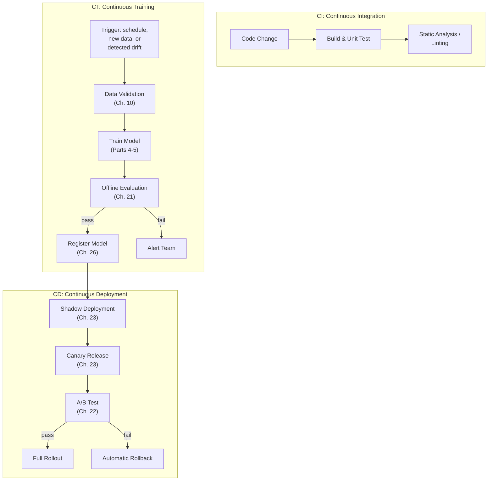
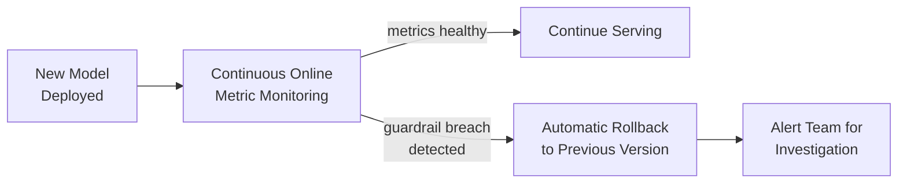

## Introduction

Part 6 built the serving layer. Part 7 turns to the operational discipline that keeps that serving layer — and the models flowing into it — healthy over time: **MLOps**. This chapter opens with the practice that automates and de-risks the entire staged rollout process from Chapters 2, 22, and 23: CI/CD/CT, an extension of familiar software CI/CD with a third, ML-specific pillar — Continuous Training.

## CI/CD, Briefly Revisited

Traditional software CI/CD automates two things: **Continuous Integration** (automatically building and testing every code change, catching bugs before they merge) and **Continuous Deployment** (automatically deploying validated changes to production, often through progressive stages). ML systems need both of these exactly as much as traditional software does — but they also have an entirely separate artifact that needs its own automated pipeline: the model itself, which changes independently of the serving code that hosts it.

## The Third Pillar: Continuous Training (CT)

**Continuous Training** automates the process from Chapter 4's lifecycle loop: data validation → feature computation → training → offline evaluation → registration, running on a schedule or triggered by specific events (new data availability, detected drift from Chapter 32), without requiring a human to manually kick off and babysit each step.



## Why Automating the Full Pipeline Matters

Every stage in this pipeline has already been covered individually across this series — the value of CI/CD/CT is specifically in **connecting them into one automated, repeatable, auditable sequence**, rather than leaving each transition to manual, error-prone human coordination:

- **Consistency**: every model version goes through the exact same validation and rollout gates, eliminating the risk of a rushed or informal deployment skipping a critical safety check (like shadow deployment, Chapter 23).
- **Speed**: automating what would otherwise be days of manual coordination between data scientists, ML engineers, and platform teams into a pipeline that can complete in hours, directly enabling the frequent retraining cadence that fast-moving domains require (Chapter 7, Chapter 20).
- **Auditability**: every pipeline run produces a complete, logged record of what data, code, and configuration produced a specific model version and what validation results it achieved — directly supporting the reproducibility needs from Chapter 24 and the governance needs from Chapter 11.

## Automated Gating: Where Human Judgment Still Belongs

A CI/CD/CT pipeline should have automated **gates** at each transition — objective, pre-defined criteria that a candidate model or deployment must pass before proceeding to the next stage:

```python
# A simplified illustration of an automated gating function that
# would run as part of a CT pipeline's offline evaluation stage,
# deciding whether a newly-trained model proceeds to registration.

def evaluate_gate(new_model_metrics: dict, current_prod_metrics: dict,
                    guardrail_thresholds: dict) -> tuple[bool, list[str]]:
    """
    Returns (passed, list_of_failure_reasons).
    Encodes the offline evaluation criteria from Chapter 21 and the
    guardrail metric concept from Chapter 6 as explicit, automated,
    version-controlled logic rather than ad-hoc human judgment calls.
    """
    failures = []

    # Primary metric must not regress beyond an acceptable tolerance
    primary_metric_delta = new_model_metrics["auc_pr"] - current_prod_metrics["auc_pr"]
    if primary_metric_delta < -0.01:
        failures.append(f"AUC-PR regressed by {-primary_metric_delta:.4f}, exceeds tolerance")

    # Guardrail: fairness metric (Chapter 25) must not degrade
    for group, rate in new_model_metrics["true_positive_rate_by_group"].items():
        baseline_rate = current_prod_metrics["true_positive_rate_by_group"][group]
        if rate < baseline_rate - guardrail_thresholds["max_tpr_drop"]:
            failures.append(f"TPR for group '{group}' dropped below guardrail threshold")

    # Guardrail: inference latency must stay within budget (Ch. 5, 26)
    if new_model_metrics["p99_latency_ms"] > guardrail_thresholds["max_p99_latency_ms"]:
        failures.append("P99 latency exceeds serving budget")

    return len(failures) == 0, failures
```

But not every decision should be automated. **High-stakes, ambiguous, or novel changes** — a fundamentally new model architecture, a significant shift in the fairness-metric trade-off (Chapter 25), or any change flagged by an automated gate as borderline — should route to human review rather than being pushed through automatically, echoing this series' recurring theme that fairness and certain risk decisions are value judgments, not purely technical ones (Chapter 25). A mature CI/CD/CT pipeline explicitly defines **which specific gates can auto-approve** and **which require human sign-off**, rather than either fully automating everything (removing necessary human judgment from high-stakes decisions) or fully manual gating everything (sacrificing the speed and consistency benefits that motivated automation in the first place).

## Automated Rollback

The natural complement to automated gating: if a deployed model's online metrics (Chapter 22) or guardrail metrics degrade beyond a pre-defined threshold *after* deployment, the pipeline should be able to automatically roll back to the previous known-good model version — without waiting for a human to notice the problem and manually intervene. This requires the model registry (Chapter 26) to make "what was the previous production version" a fast, reliable lookup, and the serving infrastructure to support fast, safe version switching (the hot-swapping capability from Chapter 26).



## CI/CD/CT and the Rest of This Series

This chapter is, in a real sense, an integration exercise: every pipeline stage shown in the diagram above was built, piece by piece, across Parts 4-6 of this series. CI/CD/CT's contribution isn't a new technical capability — it's the **orchestration discipline** that turns a collection of individually-sound practices (good data validation, good offline evaluation, good staged rollout) into a single, cohesive, automated system that a team can trust to run repeatedly, safely, and quickly, without needing to re-derive the correct sequence of steps by hand each time.

## Key Takeaways

- CI/CD/CT extends traditional software CI/CD with Continuous Training — automating the data validation → training → offline evaluation → registration pipeline from Chapter 4's lifecycle loop.
- The value of CI/CD/CT lies in connecting individually well-understood stages (data validation, offline evaluation, staged rollout) into one automated, consistent, auditable sequence, not in introducing new individual techniques.
- Automated gates should encode objective, pre-defined criteria (primary metric thresholds, guardrail metrics, latency budgets) as version-controlled logic — but high-stakes or ambiguous changes should still route to human review rather than being fully automated.
- Automated rollback, enabled by a model registry and hot-swappable serving infrastructure, closes the loop by reverting to a known-good model version the moment a deployed model's metrics degrade beyond an acceptable threshold.

---

## Interview Questions

**1. What is Continuous Training (CT), and how does it extend the traditional CI/CD concept from software engineering?**
Continuous Training automates the ML-specific pipeline of data validation, feature computation, model training, offline evaluation, and registration — running on a schedule or triggered by events like new data availability or detected drift — in the same spirit that Continuous Integration automates code building and testing, and Continuous Deployment automates releasing validated code to production. It extends traditional CI/CD because ML systems have an entirely separate artifact (the trained model) that changes independently of the application code hosting it, and this model artifact needs its own dedicated automated pipeline — one that doesn't exist at all in typical non-ML software CI/CD, which only needs to handle code changes.
*Follow-up: Why can't Continuous Training simply be treated as "just another code change" flowing through a standard CI/CD pipeline?*
A code change and a newly-trained model differ fundamentally in what needs to be validated before deployment — code changes are validated through unit/integration tests checking for deterministic, functional correctness (Chapter 1's discussion of statistical vs. binary correctness), while a newly-trained model must be validated through statistical offline evaluation (Chapter 21), fairness auditing (Chapter 25), and guardrail metric checks that have no equivalent in typical code-change validation; additionally, a new model version can result purely from new data becoming available, with zero code changes at all (e.g., a scheduled weekly retraining on the same, unchanged training pipeline code) — a scenario that wouldn't trigger a standard CI/CD pipeline at all, since no code changed, but absolutely should trigger the CT pipeline given the new data.

**2. Why is automated gating in a CI/CD/CT pipeline preferable to relying on a human reviewer to manually check each new model's metrics before approving deployment?**
Automated gating ensures every single model version is checked against the exact same, objective, pre-defined criteria every time, without the risk of human inconsistency (a reviewer being more lenient on a Friday afternoon, or missing a specific guardrail metric check due to oversight or time pressure) — and it dramatically increases the speed at which validated models can move through the pipeline, since an automated check can run in seconds while a manual review might take hours or days to schedule and complete, directly enabling the fast, frequent retraining cadence that many production systems (especially in fast-moving domains, per Chapter 7) require to stay effective.
*Follow-up: What's a risk of over-relying on automated gating without any human oversight at all, and how would you mitigate it?*
Automated gates can only check for the specific failure modes they were explicitly designed and configured to detect — a genuinely novel problem, an unanticipated edge case, or a subtle issue that doesn't manifest in any of the pre-defined metrics being checked could pass through fully automated gating undetected, since the gate simply wasn't built to look for that particular kind of problem; mitigating this requires deliberately routing certain categories of change (significant architecture changes, borderline gate results, or changes affecting fairness-sensitive metrics per Chapter 25) to mandatory human review regardless of whether they technically pass the automated numerical gates, ensuring human judgment remains in the loop specifically for the kinds of decisions automated criteria alone aren't well-suited to fully capture.

**3. How would you decide which specific gates in a CI/CD/CT pipeline should be fully automated versus which should require mandatory human sign-off?**
I'd automate gates that check well-understood, objective, and previously-validated criteria — primary metric regression thresholds, latency/resource guardrails, and known fairness metric baselines (Chapter 25) that the team has already deliberately decided on and validated as appropriate automated criteria — while requiring mandatory human review for changes that are novel, ambiguous, or touch on genuinely value-based trade-offs that don't have a pre-agreed objective threshold, such as a first-time significant architecture change, a modification specifically targeting the fairness-accuracy trade-off itself (rather than just checking against an already-agreed fairness baseline), or any borderline result where an automated gate's criteria are close to their threshold rather than clearly passing or failing.
*Follow-up: How would this gating policy need to evolve over time, as a team gains more experience and confidence with a specific type of model change?*
As a team accumulates more historical evidence and confidence that a specific, previously-novel type of change consistently behaves safely and predictably (e.g., after several successful, carefully human-reviewed rollouts of a particular kind of model update), it may become reasonable to gradually shift that category of change from mandatory human review toward increasingly automated gating, with the specific, now-well-understood criteria that previously required human judgment codified into explicit, automated thresholds — this represents a deliberate, evidence-based evolution of the gating policy over time, rather than a fixed, static division between automated and human-reviewed gates decided once and never revisited.

**4. Why is a model registry (introduced in Chapter 26) a necessary prerequisite for implementing automated rollback in a CI/CD/CT pipeline?**
Automated rollback requires the pipeline to reliably and quickly answer "what was the previous known-good production model version" the moment a problem is detected — without a model registry providing this exact, structured, queryable information, an automated rollback mechanism would have no reliable way to determine what to roll back *to*, potentially requiring manual investigation (defeating the speed benefit of automation) or risking rolling back to an incorrect, outdated, or otherwise inappropriate previous version; the model registry's versioned, metadata-tracked history of exactly which model version was in production at each point in time is the specific infrastructure capability that makes a fast, reliable, fully-automated rollback decision possible at all.
*Follow-up: Beyond knowing which version to roll back to, what serving infrastructure capability from Chapter 26 is also required to actually execute an automated rollback quickly?*
Hot-swapping capability — the ability to load and switch to a different model version within a running serving system without requiring downtime or a full server restart — is also required, since a rollback that required manually redeploying and restarting serving instances (rather than simply switching which already-available model version is actively receiving traffic) would introduce meaningful delay and potential service disruption exactly at the moment when fast, safe recovery from a detected problem matters most.

**5. What's the relationship between the automated gating criteria in a CI/CD/CT pipeline and the guardrail metrics concept introduced in Chapter 6?**
Guardrail metrics (Chapter 6) are metrics you deliberately monitor, but don't directly optimize, specifically to catch unintended collateral damage from a primary metric's improvement; in a CI/CD/CT pipeline, these same guardrail metrics become concrete, automated gating criteria — explicit, codified thresholds that a new model must not violate to proceed through the pipeline, translating the conceptual guardrail-metric practice from Chapter 6 into enforced, automated pipeline logic rather than something a human has to remember to manually check for every model update.
*Follow-up: Why is codifying guardrail metrics as automated pipeline gates a more robust practice than relying on a human reviewer to remember to check them each time?*
Codifying guardrail checks as automated, version-controlled pipeline logic ensures they're checked consistently and reliably for every single model update, immune to human factors like a reviewer forgetting to check a specific guardrail metric, being unaware that a particular guardrail applies to this specific model, or simply being under time pressure and skipping a check that feels like a formality — this mirrors the general software engineering principle that important, repeatable checks should be automated and enforced by the system itself wherever possible, rather than relying on human memory and diligence alone, which is inherently less reliable at scale and over time as team composition and context inevitably change.

**6. Why might a CT pipeline be triggered by "detected drift" (from monitoring, covered fully in Chapter 32) in addition to a fixed schedule, and what does this reveal about the relationship between monitoring and retraining?**
A fixed retraining schedule (e.g., weekly) addresses the gradual, expected accumulation of new data and slow concept drift, but doesn't respond to sudden, unexpected shifts that could occur between scheduled retraining runs (e.g., a rapid change in fraud patterns, or a sudden shift in user behavior following an external event) — triggering the CT pipeline directly from a monitoring system's drift detection allows the system to react promptly to these unexpected shifts rather than waiting for the next scheduled retraining cycle, which could leave a degraded model in production for an unnecessarily long time; this reveals that effective MLOps requires monitoring (Chapter 32) and the training pipeline (this chapter) to be tightly integrated, closed-loop systems — directly implementing the "loop, not pipeline" principle from Chapter 4, where production monitoring feeds back into triggering a fresh iteration of the training pipeline.
*Follow-up: What risk arises if a drift-triggered CT pipeline is allowed to run and deploy a new model fully automatically, without any additional safeguard beyond the standard automated gates?*
A drift event itself might indicate a genuinely anomalous, potentially temporary or erroneous situation (e.g., a data quality issue mimicking drift, as discussed in Chapter 10) rather than a legitimate, lasting shift requiring a new model — automatically retraining and deploying a new model in direct response to an unvalidated drift signal risks training on and deploying a model based on potentially corrupted or anomalous data, so a more robust design would have the drift-detection trigger initiate the retraining pipeline but still require it to pass through the same rigorous automated gates (and any relevant human review triggers) as any other CT-produced model, rather than assuming a drift-triggered retraining automatically warrants an expedited or less-scrutinized path to production.

**7. How would you explain, to a stakeholder concerned about "too much automation" in ML deployment, why CI/CD/CT actually reduces risk rather than increasing it?**
I'd explain that CI/CD/CT doesn't remove human judgment from the process — it removes human *inconsistency and delay* from the parts of the process that benefit from being applied identically and quickly every single time (checking a fixed set of well-understood metrics against established thresholds), while deliberately preserving human review specifically for the genuinely novel or ambiguous decisions that actually benefit from human judgment (as discussed earlier in this chapter); the alternative — a fully manual process — doesn't actually provide more safety, it provides *less* consistent and *slower* safety, since a manual process is more prone to a rushed reviewer missing a critical check, an informal deployment skipping a necessary validation step under time pressure, or simply taking so long that a team is tempted to skip steps to move faster, none of which is actually safer than a well-designed automated pipeline with appropriate human-review checkpoints built in at the right places.
*Follow-up: What evidence would you want to gather to actually validate the claim that a specific CI/CD/CT pipeline is reducing risk, rather than just assuming it based on this general argument?*
I'd track and compare incident rates and severity before and after implementing the automated pipeline (or compare a team/system using the automated pipeline against a similar one still using a manual process, if such a comparison is available), and I'd track the pipeline's own gate-failure and rollback rates over time — a healthy pattern would show the automated gates and rollback mechanism actually catching and preventing problems that would otherwise have reached full production (validating the pipeline is doing real, valuable work, not just rubber-stamping everything through) — using this kind of concrete, measured evidence to support the general argument rather than relying purely on the theoretical reasoning alone.

**8. Why is "auditability" listed as a distinct benefit of CI/CD/CT, separate from consistency and speed?**
Auditability specifically refers to the ability to look back, potentially long after the fact, and reliably answer questions like "exactly what data, code, and configuration produced this specific production model version, and what validation results did it achieve at each pipeline stage" — this is a different concern from consistency (every model going through the same checks) and speed (the pipeline running quickly), since a pipeline could in principle be both consistent and fast while still failing to retain a complete, reliable historical record of its own past decisions and their justifications; auditability specifically supports the reproducibility needs from Chapter 24 (explaining a historical decision) and the governance/compliance needs from Chapter 11, which require this kind of durable, after-the-fact traceability regardless of how consistent or fast the pipeline was at the time.
*Follow-up: What specific technical practice ensures a CI/CD/CT pipeline is genuinely auditable, rather than just fast and consistent?*
Comprehensive, structured logging of every pipeline run's inputs (the specific data snapshot and version, the exact code/configuration version used) and outputs (the resulting model artifact's identity, its full offline evaluation results, and the specific gate decisions made at each stage), persisted durably and linked together through the model registry (Chapter 26) — ensuring that months or years later, an engineer or auditor can reconstruct the complete provenance and decision history of any specific historical model version, rather than the pipeline's execution history being ephemeral or only available for a limited retention window that might not cover a later audit or investigation need.

**9. In an interview, how would you respond if asked to design the CI/CD/CT pipeline for a system with a very high-stakes, tightly-regulated use case (e.g., credit decisioning)?**
I'd propose a pipeline where the CI (code testing) and CT (training and offline evaluation) stages are fully automated as usual, since these represent well-understood, objective validation that doesn't inherently require case-by-case human judgment — but I'd make the CD (deployment) stage require mandatory human sign-off at multiple points given the regulatory stakes involved, specifically requiring a compliance/legal review of the model's fairness audit results (Chapter 25) and explainability characteristics (Chapter 24) before any human-reviewed approval to proceed even to the shadow deployment stage, and I'd similarly keep the transition from a small A/B test to a full production rollout as a human decision point rather than fully automated, given the high real-world stakes and legal exposure a mistaken automated rollout could carry in this specific regulated context — essentially dialing the balance from this chapter's general framework much further toward mandatory human review at the deployment stages specifically, while still retaining automation's consistency and speed benefits at the earlier, lower-stakes validation stages.
*Follow-up: Why would it still make sense to automate the CI and CT stages fully, even in this high-stakes regulatory context, rather than requiring human review at every single stage of the pipeline?*
The CI stage (code testing) and much of the CT stage (data validation, offline evaluation against well-established metrics) represent objective, well-understood technical correctness checks that don't inherently benefit from human judgment any more in a regulated context than in an unregulated one — the actual regulatory and ethical stakes specifically concern the *decision to deploy a model that will make real credit decisions affecting real people*, which is precisely the deployment/rollout stage where human judgment adds genuine, differentiated value; requiring human review of every unit test result or every routine data validation check would add significant delay and cost without any corresponding improvement in actually managing the specific regulatory risk this use case presents, since those earlier stages aren't where the regulatory-sensitive decision actually resides.

**10. How would you handle a situation where an automated gate in a CI/CD/CT pipeline consistently fails for a new model, but the team believes the model is actually an improvement and the gate's threshold is now outdated?**
I'd treat this the same way Chapter 10 recommended handling an outdated data validation rule — investigate whether the gate's threshold genuinely reflects an outdated assumption (e.g., a guardrail metric threshold set based on old business requirements that have since legitimately changed) versus whether the team's belief that the model is an improvement is itself mistaken or based on incomplete evidence; if investigation genuinely supports that the threshold is outdated, I'd propose a deliberate, reviewed update to the gate's configuration (treating this configuration change with the same code-review rigor as any other important pipeline change, given how consequential gate thresholds are) rather than simply bypassing or disabling the gate for this one specific model to get it through, which would undermine the gate's consistent, reliable enforcement for future model versions as well.
*Follow-up: Why is it specifically important to update the gate's configuration through a reviewed process, rather than simply having an engineer manually override or bypass the gate for this one model?*
A one-off manual bypass sets a precedent and creates a slippery-slope risk where future models might also be manually bypassed based on an individual engineer's informal judgment that "this one's probably fine too," gradually eroding the entire purpose and reliability of having automated, consistent gating in the first place; explicitly updating the gate's actual configured threshold through a reviewed process, by contrast, ensures the change is deliberate, documented, and applies consistently to all future models going forward (not just this one instance), preserving the pipeline's core value of consistent, reliable, and auditable enforcement rather than allowing it to be undermined by ad-hoc individual exceptions.

**11. Why might a team choose to implement CI/CD/CT incrementally — automating some pipeline stages before others — rather than building the complete, fully-automated pipeline all at once?**
Building a complete, fully end-to-end automated CI/CD/CT pipeline from scratch is a significant engineering investment, and attempting to build and validate every stage simultaneously increases both the complexity of the initial build and the risk that a flaw in one stage's automation goes undetected amid the complexity of everything else being built and changed at the same time; an incremental approach — for example, first automating offline evaluation and gating (Chapter 21, this chapter's gating discussion) while keeping deployment manual, then later automating shadow deployment (Chapter 23), then eventually automating the full staged rollout and rollback — allows the team to validate and build confidence in each automated stage independently before adding the next layer of automation on top, reducing the risk of a compounding, hard-to-diagnose failure across an entirely new, fully-automated system built and deployed all at once.
*Follow-up: What would be a reasonable "first" stage to automate when building toward a full CI/CD/CT pipeline, and why?*
Automating the offline evaluation and gating stage (running the pipeline from data validation through offline evaluation against a fixed, well-understood set of metrics and thresholds) is a reasonable and common first step, since this stage operates entirely within the offline environment (Chapter 4's terminology) with no real user-facing risk — even if the automation has a bug or produces an incorrect gating decision, the consequence is, at worst, an incorrectly approved or rejected candidate model that a human can still review and catch before any actual deployment occurs, making this comparatively low-risk stage a good place to build initial confidence in the automation before extending it to the genuinely higher-stakes deployment and rollback stages that directly affect real production traffic.

**12. How does the concept of CI/CD/CT specifically change (if at all) when applied to fine-tuning or adapting a pre-trained foundation model (Chapter 20), compared to training a classical ML model from scratch?**
The overall pipeline structure remains conceptually the same (data validation → training/fine-tuning → offline evaluation → registration → staged rollout), but the "training" step itself becomes a fine-tuning or adaptation step (potentially using parameter-efficient techniques from Chapter 20) rather than training a model fully from scratch, and the offline evaluation stage may need to additionally check for the catastrophic forgetting concern discussed in Chapter 20 (evaluating against a general-capability benchmark, not just the specific fine-tuning task's metrics) as part of its automated gating criteria — the underlying CI/CD/CT discipline and its benefits (consistency, speed, auditability) apply just as much to this fine-tuning-centric pipeline as to a from-scratch training pipeline, since it's still the same fundamental process of turning new data/objectives into a validated, deployed model artifact.
*Follow-up: Why might the CT (continuous training) stage specifically be triggered more frequently for a fine-tuning-based system than for a from-scratch training system, in many real-world scenarios?*
Fine-tuning is typically much cheaper and faster to execute than training a model fully from scratch (a key point from Chapter 20), meaning the cost-benefit trade-off of running the CT pipeline more frequently shifts favorably — a team might reasonably retrain (re-fine-tune) a foundation-model-based system daily or even more frequently given fine-tuning's lower cost, where the same frequent retraining cadence might be prohibitively expensive for a system requiring full from-scratch training each time, directly connecting this chapter's automation discussion back to the cost and efficiency considerations established in Part 4 and Part 8-9's LLM-specific material.

**13. Why is it important for a CI/CD/CT pipeline's automated tests (the "CI" component) to include tests for the data validation and feature computation code specifically, not just the model training code itself?**
As established throughout Parts 2-3 of this series (particularly Chapters 10 and 15), the majority of real-world ML system failures stem from data quality issues and training-serving skew rather than flaws in the model training algorithm itself — a CI pipeline that thoroughly tests the model training code but neglects to test the data validation logic and feature computation code (for correctness, for consistency with the serving-side feature computation, and for proper handling of edge cases like missing data) would be testing the comparatively lower-risk part of the system while leaving the higher-risk, more failure-prone parts of the pipeline inadequately covered by automated testing.
*Follow-up: What specific kind of automated test would you add to a CI pipeline specifically to catch a training-serving skew issue (Chapter 15) before it ever reaches production?*
A contract test (as discussed in Chapter 15) that runs the exact same feature computation logic against a shared, version-controlled test dataset through both the offline (training) code path and the online (serving) code path, and asserts that the resulting feature values match within an acceptable tolerance — integrating this specific test into the CI pipeline ensures that any future code change to either the training or serving feature computation logic that introduces a divergence between the two paths is caught automatically and immediately, before that divergence has any opportunity to propagate into a deployed model or cause a production skew incident.

**14. How would you measure whether a team's CI/CD/CT pipeline is actually providing value, beyond simply having built and deployed it?**
I'd track metrics like deployment frequency (has the pipeline actually enabled the team to ship validated model updates more frequently than before, which is one of its core intended benefits), the rate and nature of issues caught by automated gates before reaching production (evidence the gates are doing genuinely useful work, not just passing everything through), the rate of automated rollbacks actually triggered and their outcomes (were they justified, appropriate responses to genuine problems, and did they prevent more significant harm), and, ultimately, whether the overall rate and severity of production ML incidents has measurably decreased since the pipeline's introduction — using this combination of process metrics (frequency, gate catches) and outcome metrics (incident rates) to build a genuine, evidence-based picture of the pipeline's actual value, rather than assuming value based solely on having successfully built and deployed the automation itself.
*Follow-up: What would it mean if a team's CI/CD/CT pipeline showed high deployment frequency and low gate-failure rates, but production incidents hadn't actually decreased at all?*
This pattern would suggest the pipeline might be optimizing for and validating the wrong things — deploying frequently and passing its own gates smoothly doesn't necessarily mean it's catching the actual failure modes that matter most for this specific system, which could indicate the automated gates' specific criteria and thresholds need to be revisited and potentially expanded to address whatever root causes are actually driving the persistent incidents (perhaps a category of issue, like a specific kind of skew or drift, that the current gates simply weren't designed to detect) — this is a useful diagnostic signal precisely because it reveals a gap between "the pipeline is running smoothly" and "the pipeline is actually preventing the problems it was built to prevent," which are genuinely different things worth measuring and distinguishing between.

**15. How would you summarize, for someone new to MLOps, why CI/CD/CT represents the natural culmination of everything covered in Parts 1-6 of this series, rather than an entirely new, separate topic?**
I'd explain that Parts 1-6 built, piece by piece, every individual capability a mature ML system needs — understanding the problem and lifecycle (Part 1), getting good, validated data (Part 2), computing consistent features (Part 3), training models efficiently (Part 4), rigorously evaluating them including for fairness (Part 5), and serving them efficiently and reliably (Part 6) — and CI/CD/CT is specifically the discipline of wiring all of these individually-sound capabilities together into a single, automated, repeatable, and trustworthy end-to-end system, rather than leaving each of these capabilities as a collection of separate, manually-coordinated tools and practices; in this sense, CI/CD/CT isn't a new set of technical skills so much as it's the orchestration and automation layer that makes everything learned in the previous six Parts operate together reliably, consistently, and at the speed real production systems require.
*Follow-up: Why does this framing — CI/CD/CT as orchestration rather than a new technical domain — matter for how a team should approach building their own CI/CD/CT pipeline?*
It suggests that a team shouldn't approach building a CI/CD/CT pipeline as a separate, standalone project requiring entirely new technical expertise disconnected from everything else they've already built — instead, they should approach it as the natural, incremental next step of connecting and automating the individual data validation, training, evaluation, and deployment practices they (hopefully) already have in place from working through the earlier parts of the ML lifecycle, meaning a team that has already built solid, well-tested individual components (good data validation, reliable offline evaluation, a working staged rollout process) is much better positioned to build a valuable CI/CD/CT pipeline quickly than a team trying to build both the individual components and their automated orchestration simultaneously from a standing start.
