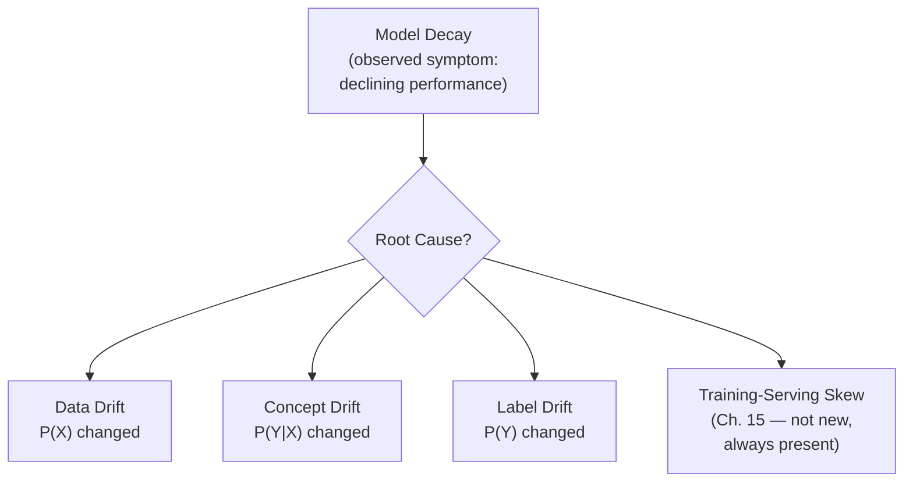
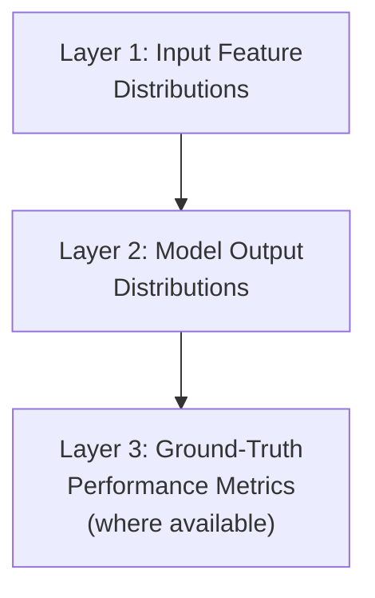
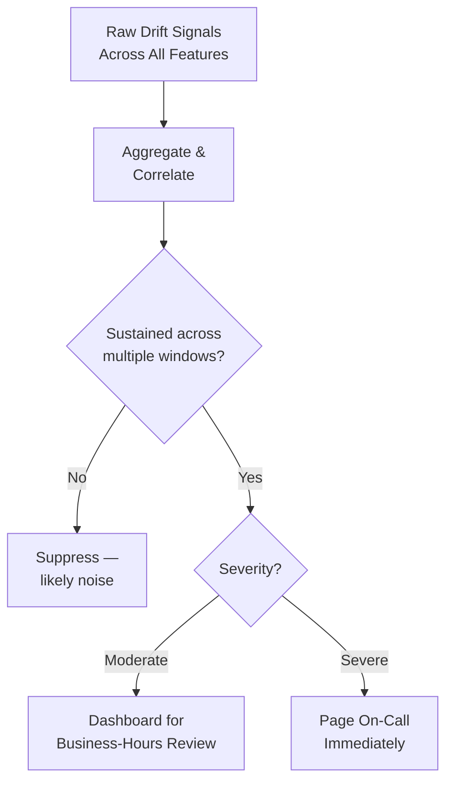
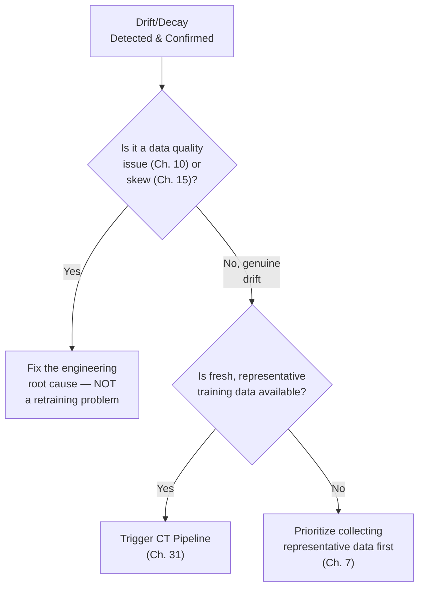

## Introduction

Chapter 10 introduced data drift and concept drift as concepts, previewing that full production monitoring depth belonged here, once serving (Part 6) and the automated pipeline (Chapter 31) were in place. This chapter delivers on that promise: how to architect a monitoring system that continuously watches a deployed model for degradation, distinguishes between its different root causes, and triggers the appropriate response — including, when warranted, the CT pipeline's retraining trigger from Chapter 31.

## A Recap and Sharpening of the Core Concepts

- **Data drift (covariate shift)**: `P(X)` changes — the distribution of input features shifts — while the relationship between features and the true label, `P(Y|X)`, stays the same.
- **Concept drift**: `P(Y|X)` itself changes — the relationship between features and the true label shifts, regardless of whether the input distribution has changed.
- **Label drift**: `P(Y)` changes — the distribution of the target variable itself shifts (e.g., the overall fraud rate increases), which can occur independently of, or alongside, either of the above.
- **Model decay**: the general, observable *symptom* — declining model performance over time — that any of the above (or a training-serving skew issue from Chapter 15 that was always present, not newly emerging) can produce.



Distinguishing between these matters because the appropriate response differs: data drift might be addressed by ensuring training data better represents the new input distribution; concept drift requires genuinely new labels reflecting the new relationship; label drift might simply require recalibrating a decision threshold (Chapter 21) rather than full retraining; and skew requires an engineering fix (Chapter 15), not a data or retraining response at all.

## What to Monitor: Three Layers



### Layer 1: Input Feature Distribution Monitoring

Compare the live, production distribution of each input feature against a reference distribution (typically the training-time distribution) — this is a direct, ongoing application of the statistical techniques from Chapter 10:

```python
import numpy as np

def population_stability_index(reference: np.ndarray, current: np.ndarray, buckets: int = 10) -> float:
    """Reprised from Chapter 10 — the standard PSI calculation."""
    breakpoints = np.quantile(reference, np.linspace(0, 1, buckets + 1))
    breakpoints[0], breakpoints[-1] = -np.inf, np.inf
    ref_counts, _ = np.histogram(reference, bins=breakpoints)
    cur_counts, _ = np.histogram(current, bins=breakpoints)
    ref_pct = np.clip(ref_counts / len(reference), 1e-6, None)
    cur_pct = np.clip(cur_counts / len(current), 1e-6, None)
    return np.sum((cur_pct - ref_pct) * np.log(cur_pct / ref_pct))

def monitor_feature_drift(reference_data: dict, production_window: dict,
                            psi_alert_threshold: float = 0.25) -> list[dict]:
    """
    Run PSI across every monitored feature, on a scheduled cadence
    (e.g., hourly), comparing a rolling production window against
    the fixed training-time reference distribution.
    """
    alerts = []
    for feature_name in reference_data:
        psi = population_stability_index(
            reference_data[feature_name], production_window[feature_name]
        )
        if psi > psi_alert_threshold:
            alerts.append({"feature": feature_name, "psi": psi, "severity": "high"})
        elif psi > 0.1:
            alerts.append({"feature": feature_name, "psi": psi, "severity": "moderate"})
    return alerts
```

This layer catches drift *before* it necessarily shows up in downstream performance — valuable because it can provide an early warning even when ground-truth labels (Layer 3) are delayed or expensive to obtain.

### Layer 2: Model Output Distribution Monitoring

Monitor the distribution of the model's *predictions* over time — even without any ground truth, a meaningful shift in the model's output distribution (e.g., a fraud model that historically flagged 2% of transactions suddenly flagging 8%, or a ranking model's score distribution shifting significantly) is a strong signal something has changed upstream, whether in the input data, the feature computation pipeline (a skew-style bug), or the underlying real-world relationship the model is trying to capture.

### Layer 3: Ground-Truth Performance Monitoring

Where genuine ground-truth labels eventually become available (a transaction is confirmed as fraud or not; a loan defaults or doesn't), directly recompute the model's real, actual performance metrics (Chapter 21) on this labeled production data on an ongoing basis, comparing against both the model's original offline evaluation results and its performance trend over time. This is the most direct, unambiguous signal of true model decay — but it's often delayed (ground truth can take days, weeks, or months to materialize) and sometimes only available for a biased subset of predictions (e.g., only reviewing cases a human flagged for review), requiring careful interpretation alongside the faster, less direct signals from Layers 1-2.

## Alerting Design: Avoiding Both Silence and Noise

A monitoring system is only useful if its alerts are trustworthy — this echoes the alert-fatigue concern from Chapter 10, now specifically applied to drift monitoring at production scale across potentially hundreds of features and multiple models:

- **Severity tiers**: not every PSI threshold breach warrants paging an on-call engineer at 3 AM — a moderate, slowly-developing drift signal might route to a dashboard for review during business hours, while a severe, rapid shift (especially combined with Layer 3 ground-truth evidence) warrants immediate alerting.
- **Trend-based rather than single-point alerting**: alerting on a single anomalous data point risks reacting to normal, expected statistical noise; requiring a sustained deviation across multiple consecutive monitoring windows before alerting reduces false alarms while still catching genuine, persistent drift.
- **Correlated alerting**: if many features simultaneously show moderate drift, this combined signal is often more meaningful and actionable than any single feature's individual reading — a monitoring system that can surface this kind of correlated pattern (rather than firing dozens of independent, seemingly-unrelated individual alerts) is significantly more useful to an on-call engineer trying to diagnose the actual root cause.



## The Response Decision Framework

Once drift or decay is detected and confirmed (not just a noisy false alarm), the response should follow a deliberate decision process, not an automatic reflex to "just retrain":



This decision framework directly closes the loop introduced in Chapter 4: monitoring (this chapter) feeds into either an engineering fix or the CT pipeline (Chapter 31), which produces a new model that flows back through offline evaluation and staged rollout (Chapters 21-23), which is itself then monitored again — the complete lifecycle loop, now with every stage's supporting infrastructure fully built out across this series.

## Key Takeaways

- Data drift (`P(X)` changes), concept drift (`P(Y|X)` changes), and label drift (`P(Y)` changes) are distinct root causes of the observable symptom of model decay, and distinguishing between them determines the correct response.
- Effective monitoring operates across three layers: input feature distributions (earliest signal, no ground truth needed), model output distributions (a useful proxy signal), and ground-truth performance (the most direct but often delayed signal).
- Alerting design must balance catching genuine, sustained drift against generating excessive false alarms — using severity tiers, trend-based rather than single-point triggers, and correlated multi-feature analysis.
- Detected drift should trigger a deliberate decision process — distinguishing a genuine drift response (triggering CT) from an engineering root cause (data quality or skew) that retraining alone would not fix.

---

## Interview Questions

**1. What's the precise statistical distinction between data drift and concept drift, and why does getting this distinction right matter for choosing a response?**
Data drift is a change in the distribution of input features, `P(X)`, while the underlying relationship between those features and the true outcome, `P(Y|X)`, remains unchanged; concept drift is a change in that underlying relationship itself, `P(Y|X)`, regardless of whether the input distribution has changed. This distinction matters because data drift can sometimes be addressed by ensuring the model has seen a sufficiently representative range of the new input distribution (potentially via re-sampling or targeted additional data collection), while concept drift requires genuinely new, correctly-labeled data reflecting the new relationship — retraining on old labels wouldn't help with concept drift at all, since the old labels no longer correctly reflect the current, shifted relationship.
*Follow-up: Could a system experience concept drift without any accompanying data drift? Explain with an example.*
Yes — the fraud example from Chapter 10 illustrates this precisely: the same input feature distribution (the same range and pattern of transaction amounts, times, and behaviors) can persist unchanged, while what those same input patterns actually indicate about fraud likelihood shifts due to fraudsters deliberately adapting their tactics to mimic previously-legitimate-looking behavior — the inputs themselves haven't become statistically different from before, but their true relationship to the fraud/not-fraud outcome has fundamentally changed, which is concept drift occurring with no accompanying data drift.

**2. Why is monitoring the model's output distribution (Layer 2) valuable even when ground-truth labels aren't yet available?**
Ground-truth labels (Layer 3) are often delayed (sometimes by days, weeks, or longer) or expensive to obtain, meaning relying solely on ground-truth-based performance monitoring would leave a significant, potentially costly blind spot during that delay window; monitoring the model's own output/prediction distribution provides an immediate, always-available signal that requires no ground truth at all — a significant, unexpected shift in what the model is predicting (e.g., a sudden jump in the fraction of transactions flagged as fraud) is a strong, fast-arriving proxy signal that something has changed upstream, even before you can directly confirm via ground truth whether that "something" represents a genuine problem or a legitimate, expected shift.
*Follow-up: What's a scenario where the model's output distribution could shift significantly for a completely benign, expected reason, and how would you avoid a false alarm in that case?*
A retail recommendation model's output distribution might shift significantly and predictably during a major seasonal shopping event (e.g., a holiday sale), as user behavior and the item catalog itself genuinely and expectedly change during that period — to avoid a false alarm in this case, the monitoring system's reference distribution and alerting thresholds should ideally account for known, expected seasonal patterns (e.g., comparing against the same period in a previous year, or using a reference distribution specific to "holiday season" rather than a single, static, year-round reference baseline), distinguishing genuinely anomalous, unexpected shifts from known, benign, and predictable seasonal variation.

**3. Why is ground-truth performance monitoring (Layer 3) described as "the most direct but often delayed" signal, and what trade-off does this delay create for a monitoring system's design?**
It's the most direct signal because it measures the model's actual, real-world correctness against true outcomes — the thing you ultimately care about — rather than a proxy like input or output distribution shift; but it's often delayed because the true outcome for a given prediction frequently isn't known immediately (e.g., whether a loan actually defaults may take months to determine, whether a flagged transaction is genuinely confirmed as fraud may take days of investigation) — this delay creates a trade-off where relying solely on this most-direct signal means the monitoring system would only detect a problem well after it began, potentially after significant real-world harm has already accumulated, which is precisely why Layers 1 and 2 (faster, if less direct) are valuable complements rather than the ground-truth layer being sufficient on its own.
*Follow-up: How would you design a monitoring system to make the best use of ground-truth data despite this inherent delay?*
I'd implement a rolling, delayed evaluation window specifically calibrated to the typical ground-truth arrival lag for the specific use case (e.g., continuously evaluating "predictions made 30 days ago" once their true outcomes have had time to materialize, rather than trying to evaluate today's predictions against not-yet-available ground truth), combined with using the faster Layers 1-2 signals as an early-warning system that can trigger heightened scrutiny or a faster, more targeted ground-truth investigation for a specific flagged period, rather than waiting for the full, natural ground-truth delay to elapse uniformly across all monitoring before any investigation begins.

**4. Why is it important for a drift-monitoring alerting system to require "sustained deviation across multiple consecutive monitoring windows" rather than alerting on any single anomalous reading?**
Any statistical measure computed on a sample of real-world data will show some natural variance from one measurement window to the next, purely due to random sampling noise, even when there's no genuine, underlying shift occurring at all — alerting on any single anomalous reading (a one-off PSI spike, for example) would generate a significant number of false alarms purely from this expected statistical noise, rather than reflecting genuine, persistent drift; requiring the deviation to persist across multiple consecutive monitoring windows filters out this transient noise, since genuine drift (a real, lasting shift in the underlying data-generating process) would be expected to show up consistently across successive measurement windows, while pure random noise would not.
*Follow-up: What's the trade-off in choosing how many consecutive windows to require before triggering an alert?*
Requiring more consecutive windows before alerting reduces the false-positive rate (fewer alerts triggered by transient noise) but increases the detection delay (a genuine, real drift event takes longer to be confirmed and alerted on, since the system is waiting to observe it persist across more windows) — this is directly analogous to the Type I/Type II error trade-off from Chapter 22's A/B testing discussion, and the right balance depends on how costly a false alarm is (wasted investigation time) versus how costly a delayed detection is (longer exposure to a genuine, undetected problem) for the specific system and use case in question.

**5. How would you distinguish, in practice, whether an observed drop in a deployed model's ground-truth performance is due to genuine concept drift versus an undetected training-serving skew issue that was actually present all along?**
I'd check whether the performance degradation is a new, recent phenomenon (performance was good initially and has degraded gradually or suddenly over time, consistent with drift emerging after deployment) versus whether the degraded performance has actually been present since the model was first deployed but simply wasn't caught immediately (which would point toward a skew issue that was always there, rather than something that newly emerged) — reviewing historical performance monitoring data from as close to the initial deployment as possible is the key diagnostic step here; if performance has genuinely changed over time relative to its own initial deployment baseline, that points toward drift, while a consistently poor performance level from the very start (that just wasn't caught by initial offline evaluation or shadow deployment, per Chapters 21-23) points toward an unaddressed skew issue rather than newly-emerging drift.
*Follow-up: What role would the feature-value comparison technique from Chapter 15 play in helping make this distinction more conclusively?*
Directly comparing the actual feature values used in production against what the offline training pipeline would compute for equivalent inputs (Chapter 15's skew-detection diffing technique) can conclusively rule in or rule out an implementation-divergence-based skew issue as the root cause — if this comparison reveals a genuine, ongoing discrepancy between training-time and serving-time feature computation, that's direct evidence of a persistent skew issue independent of any drift; if the comparison shows the feature computation is and has been consistent, but the *distribution* of feature values (or their relationship to the true outcome) has genuinely shifted over time compared to the original training data, that points more clearly toward genuine drift rather than an underlying, uncaught skew problem.

**6. Why does this chapter argue that "just retrain the model" is not always the correct or sufficient response to detected model decay?**
Model decay's underlying root cause could be a data quality issue (Chapter 10) or a training-serving skew problem (Chapter 15) rather than genuine drift — in these cases, simply retraining the model (without first fixing the actual engineering root cause) would likely reproduce the same problem in the newly retrained model as well, since the new training run would still be subject to the same underlying data quality bug or skew-inducing implementation divergence that caused the original problem; retraining is the correct response specifically for genuine drift where the real-world data-generating process has legitimately changed and fresh, representative, correctly-computed data can capture that new reality — applying it reflexively to every instance of detected decay, without first diagnosing the actual root cause, risks wasting effort on an ineffective fix while the true underlying problem persists unaddressed.
*Follow-up: What would be a concrete symptom that would help you recognize, in practice, that "just retraining" had failed to actually fix the underlying problem?*
If a newly retrained model, freshly deployed through the full staged rollout process (Chapters 22-23), continues to show the same or a very similar pattern of ground-truth performance degradation or drift signal shortly after deployment (rather than the retraining genuinely resolving the issue as expected for a true drift-driven problem), that's a strong signal the actual root cause was something retraining alone couldn't fix — like an underlying, still-unaddressed skew issue or a persistent, uncorrected data quality bug that continues to affect every successive training run in the same way, regardless of how many times the model is retrained on top of that same underlying flawed process.

**7. How would you design a monitoring system to specifically catch a data quality issue (Chapter 10) versus genuine data drift, given that both can manifest as a shift in input feature distributions?**
I'd combine the statistical distribution monitoring (PSI, from this chapter and Chapter 10) with the schema and structural validation checks from Chapter 10 running continuously in production — a data quality issue often manifests as a sudden, sharp, and often structurally anomalous change (e.g., a spike in null values, a value falling clearly outside a previously valid range, or a sudden change tightly correlated with a specific known upstream deployment or pipeline change), while genuine drift tends to manifest as a more gradual, sustained shift in the statistical distribution of otherwise still valid, well-formed values over a longer period, without an obvious, sudden discontinuity tied to a specific known system change — examining both the *shape* of the anomaly (sudden and sharp vs. gradual and sustained) and any correlation with known recent system changes helps distinguish between the two possible root causes.
*Follow-up: Why might it still sometimes be genuinely ambiguous, even with this combined monitoring approach, whether a specific observed shift is drift or a data quality issue?*
Some genuine, legitimate real-world changes can themselves be sudden and dramatic (e.g., a rapid, real shift in user behavior following a major, unexpected external event) in a way that superficially resembles the "sudden, sharp" pattern typically associated with a data quality bug, while some data quality issues can also be gradual and subtle (e.g., a slowly-degrading sensor, or a slowly-worsening upstream data provider's quality) in a way that resembles genuine drift's typical gradual pattern — this genuine ambiguity is exactly why root-cause investigation (checking recent deployments, cross-referencing with the actual real-world context and any external events, and directly validating a sample of the actual affected data) remains necessary in practice, rather than relying purely on the shape of the statistical anomaly alone to definitively distinguish between the two possibilities in every case.

**8. Why is "correlated alerting" across multiple features described as more valuable to an on-call engineer than many independent single-feature alerts?**
When many features simultaneously show even moderate drift, this pattern often reflects a single, shared underlying root cause (e.g., an upstream data pipeline change affecting many downstream features at once, or a broad, genuine shift in the overall user population) — presenting this as one clear, correlated signal ("these 12 related features all shifted together, likely from a common cause") gives an on-call engineer immediately actionable context to investigate the shared root cause efficiently; presenting the same underlying situation as 12 separate, seemingly-unrelated individual feature alerts instead forces the engineer to manually piece together the pattern themselves under time pressure, which is slower, more error-prone, and contributes to the alert-fatigue problem discussed earlier in this chapter and in Chapter 10.
*Follow-up: What technical approach would you use to actually detect and surface this kind of correlated, multi-feature drift pattern, rather than just running independent PSI checks per feature?*
I'd look for statistical techniques that can jointly consider the correlation structure across features — for example, monitoring a summary statistic derived from a dimensionality-reduction technique (like tracking drift in the principal components of the joint feature distribution, rather than each raw feature independently) or explicitly clustering/grouping features that historically tend to drift together (e.g., due to a shared upstream data source) and presenting alerts at the level of these logical groups rather than purely per-individual-feature — the specific technique matters less than the underlying goal of aggregating and correlating related signals into a single, more informative and actionable alert rather than a flood of disconnected individual ones.

**9. In an interview, if asked to design a monitoring system for a system with no readily available ground-truth labels at all (e.g., a generative content recommendation system where "correctness" isn't easily labeled), how would you approach it?**
I'd rely much more heavily on Layers 1 and 2 (input feature and model output distribution monitoring) as the primary ongoing signals, since Layer 3's ground-truth performance monitoring simply isn't available in this scenario; I'd also look for indirect proxy signals that correlate with quality even without direct ground-truth labels — for example, monitoring downstream engagement metrics (Chapter 6's online metrics) as an indirect signal, or periodically running a smaller-scale, deliberately-labeled human evaluation sample (even if too expensive to run continuously at full scale) specifically to spot-check and validate that the faster, always-available Layers 1-2 signals are still meaningfully correlating with actual quality, rather than assuming that correlation holds indefinitely without any periodic validation.
*Follow-up: Why is this periodic, smaller-scale human evaluation spot-check still valuable, even if it can't provide continuous, real-time ground-truth monitoring the way Layer 3 ideally would?*
Even an infrequent, smaller-scale periodic check provides genuine validation that your faster proxy signals (Layers 1-2) are still tracking real, meaningful quality and haven't silently drifted apart from what actually matters (echoing the proxy-chain validation concept from Chapter 6) — without any ground-truth validation at all, even infrequent, you'd have no way to confirm your continuous monitoring signals remain a trustworthy proxy for genuine quality over time, risking a scenario where your fast, continuous monitoring looks perfectly healthy while the system's actual real-world quality has quietly degraded in a way none of your available proxy signals happened to capture.

**10. How would you determine appropriate PSI (or similar distributional distance metric) alert thresholds for a new feature being monitored for the first time, given no prior history of that specific feature's normal variation?**
Similar to the burn-in period discussed in Chapter 10 for setting statistical data quality thresholds, I'd initially run the monitoring in an observational, non-alerting mode for a meaningful period (long enough to capture the feature's natural variation across relevant time cycles — daily, weekly, or seasonal, depending on the feature and business context), establishing an empirical baseline of what "normal" variation actually looks like for this specific feature, before setting alert thresholds calibrated to that observed baseline variation rather than applying a generic, one-size-fits-all threshold (like the general rule-of-thumb PSI thresholds of 0.1/0.25) without first validating that those generic thresholds are actually well-calibrated to this specific feature's own particular behavior.
*Follow-up: Why might a single, universal PSI threshold (like "always alert above 0.25") be inappropriate to apply uniformly across every feature in a large production system?*
Different features can have very different natural levels of variability even under entirely normal, healthy conditions — a feature that's inherently volatile and naturally fluctuates significantly from day to day (e.g., a feature tied to unpredictable external market conditions) would generate frequent, unhelpful false-positive alerts if held to the same strict threshold as a feature that's naturally very stable and rarely varies much at all under normal circumstances; using a single, universal threshold across all features fails to account for this natural, feature-specific variability, whereas empirically-calibrated, feature-specific thresholds (informed by that feature's own observed normal variation, as established through the burn-in process) provide a much more accurate, appropriately-sensitive standard for detecting genuinely anomalous behavior specific to each individual feature.

**11. Why does the response decision framework in this chapter explicitly include "prioritize collecting representative data first" as a possible outcome, rather than assuming retraining can always proceed immediately once drift is detected?**
Detecting genuine drift confirms that the model's training data no longer adequately represents the current real-world distribution or relationship — but confirming this doesn't automatically mean sufficient, representative *new* data reflecting the current reality is already available to retrain on; if the new, drifted pattern is genuinely novel and insufficiently represented in whatever data has been collected so far (e.g., a rare, newly-emerging fraud pattern that's only been observed a handful of times, insufficient for reliable retraining), attempting to retrain immediately on this still-insufficient data could produce an unreliable or poorly-generalizing model, meaning the appropriate immediate response is actually to prioritize collecting more of this specific, newly-important data (potentially through some of the targeted collection or labeling strategies from Chapter 7) before a genuinely useful retraining can occur.
*Follow-up: What interim mitigation might a team apply while waiting to collect sufficient new data, rather than simply continuing to serve a known-to-be-degraded model in the meantime?*
Depending on the specific situation, a team might apply a temporary, more conservative decision threshold (Chapter 21) to reduce the model's confidence-based autonomy on the specific pattern known to be affected by the drift (e.g., routing borderline or affected-pattern cases to human review rather than fully automated decisioning until a properly retrained model is available), or supplement the existing model with a targeted, rules-based heuristic specifically addressing the known, newly-emerging pattern in the interim — treating this as a deliberate, temporary risk-mitigation measure while the more durable, data-driven retraining solution is being properly prepared, rather than either ignoring the known degradation entirely or rushing an inadequately-supported retraining that might not actually solve the problem.

**12. How would you explain, to a data scientist who wants to retrain a model every time any drift signal appears at all, why this could actually be counterproductive?**
I'd explain that not every detected drift signal represents a genuine, actionable, or even real problem — some signals may reflect normal, expected variation (that alerting thresholds should already be calibrated to filter out, per this chapter's discussion), some may reflect benign, temporary fluctuations that don't warrant a full retraining response, and retraining unnecessarily and too frequently carries real costs (Chapter 6's training cost considerations, and the operational overhead of running the full staged rollout process, Chapters 22-23, for each retrained version) without a corresponding benefit if the underlying "drift" wasn't actually a genuine, sustained, business-relevant shift — reflexively retraining on every signal, rather than following a deliberate decision framework like the one in this chapter, risks both wasting resources and, more subtly, potentially introducing genuine instability or regressions from unnecessarily frequent model churn that a more measured, evidence-based retraining cadence would avoid.
*Follow-up: What's a concrete way to quantify whether a specific retraining decision was actually worthwhile, after the fact?*
Compare the newly retrained model's actual measured performance (both offline, per Chapter 21, and eventually online/ground-truth, per this chapter's Layer 3) against the previous model's performance on the same, current evaluation data — if the retrained model shows a clear, meaningful improvement that justifies the retraining cost and the operational overhead of the rollout process, that's concrete evidence the retraining decision was worthwhile; if the retrained model shows negligible or no meaningful improvement over the previous model, that's a signal the underlying drift trigger may not have actually warranted a full retraining response, informing a more calibrated, evidence-based approach to similar future drift signals rather than continuing to retrain reflexively regardless of whether it's demonstrably producing real value.

**13. Why might monitoring thresholds and strategies need to differ significantly between a system with a fast retraining cadence (e.g., daily) versus one with a much slower cadence (e.g., quarterly)?**
A system with a fast, frequent retraining cadence naturally and continuously incorporates recent data, meaning smaller, more gradual drift is likely to be absorbed relatively quickly by the next scheduled retraining cycle regardless of whether it's specifically detected and flagged by monitoring — monitoring in this context can focus more on catching sudden, severe anomalies that need immediate attention *between* the already-frequent scheduled retrainings, rather than needing to catch every small, gradual drift signal, since the fast cadence itself provides a natural, ongoing corrective mechanism; a system with a much slower, quarterly retraining cadence has a much longer window during which even gradual, moderate drift can accumulate and compound significantly before the next scheduled retraining opportunity arrives, making more sensitive, proactive drift monitoring (and potentially triggering off-cycle retraining, per Chapter 31's drift-triggered CT discussion) considerably more valuable and important to catch gradual degradation earlier than the long, fixed retraining schedule alone would otherwise allow.
*Follow-up: How would you decide, for a new system, what retraining cadence to pair with what level of monitoring sensitivity, rather than treating them as independent decisions?*
I'd treat retraining cadence and monitoring sensitivity as jointly-determined decisions based on the same underlying factor — how quickly the specific domain's underlying data and relationships genuinely tend to change (echoing Chapter 7's recency discussion) — a fast-changing domain justifies both a fast retraining cadence and correspondingly sensitive, proactive monitoring (since even the fast cadence might not be fast enough without monitoring to catch and trigger off-cycle updates for particularly rapid shifts), while a slow-changing, stable domain can reasonably pair a slower retraining cadence with less sensitive, more relaxed monitoring, since the underlying stability of the domain itself provides a natural buffer against rapid, consequential drift accumulating between the less-frequent scheduled retraining cycles.

**14. How does the monitoring architecture described in this chapter connect to and depend on the feature store discussed in Chapter 13?**
The online feature store (Chapter 13) is typically the actual source of the live, production feature values that Layer 1's input feature distribution monitoring compares against the training-time reference distribution — without a feature store providing a consistent, well-defined, and observable point at which feature values are actually computed and served, a monitoring system would need to independently instrument and capture feature values from wherever they happen to be computed in the serving pipeline, which is both more fragile and more likely to miss or double-count values compared to monitoring directly at the feature store's well-defined interface; the feature store's centralized, structured nature makes it a natural, reliable integration point for this kind of systematic, ongoing input distribution monitoring.
*Follow-up: Why might a team without a mature feature store (relying instead on ad-hoc feature computation, as discussed in Chapter 13's "when is a feature store worth it" section) find it meaningfully harder to implement robust Layer 1 monitoring?*
Without a feature store's centralized, well-defined feature computation and serving point, a team would need to instrument monitoring separately within each individual service or code path where features happen to be computed (potentially multiple different, independently-maintained implementations, echoing the implementation-divergence risk from Chapter 15), making it significantly more effort to build and maintain comprehensive, consistent Layer 1 monitoring across the full set of features a model depends on — this is a concrete example of how the infrastructure investments discussed earlier in this series (like a feature store) compound in value by making later infrastructure (like this chapter's monitoring system) meaningfully easier and more robust to build on top of, rather than each piece of infrastructure being an entirely independent, unrelated investment decision.

**15. How would you summarize, for a stakeholder unfamiliar with ML systems, why "monitoring" for an ML system requires fundamentally different thinking than monitoring for a traditional software application?**
I'd explain that traditional software monitoring primarily watches for clear, binary signals of malfunction — is the service up or down, are requests erroring out, is latency within acceptable bounds — all of which reflect whether the *code* is functioning as written; ML system monitoring needs all of that too, but additionally needs to continuously watch for a much subtler, harder-to-detect kind of problem — the system can be running perfectly correctly, with zero errors and normal latency, while silently making increasingly wrong or poorly-calibrated decisions because the real world it was trained to understand has changed, a failure mode traditional software monitoring has no equivalent concept for at all, and this is precisely why ML monitoring requires this chapter's specific statistical techniques (comparing distributions, tracking ground-truth performance over time) rather than the simpler up/down, error-rate-based monitoring traditional software systems typically rely on.
*Follow-up: Why is it important for this stakeholder to understand this distinction, beyond just appreciating an interesting technical nuance?*
Understanding this distinction directly affects how the stakeholder should think about resourcing and prioritizing ongoing investment in the ML system after its initial launch — a stakeholder who only understands traditional software monitoring might reasonably (but incorrectly) assume that a "green," error-free monitoring dashboard means the ML system is working well, potentially leading them to deprioritize or resist continued investment in the specific ML monitoring infrastructure and practices this chapter describes; helping them understand that an ML system can look perfectly healthy by traditional metrics while silently degrading in ways only ML-specific monitoring would catch is essential for them to make informed, appropriate decisions about the ongoing investment and vigilance a production ML system genuinely requires, directly connecting back to the very first chapter's core theme that "launch" is never the finish line for an ML system.
