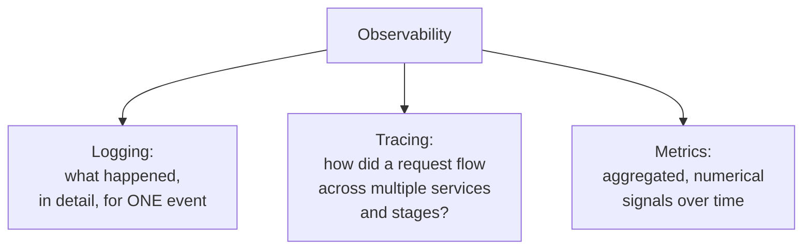
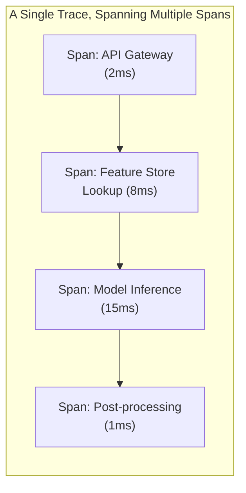
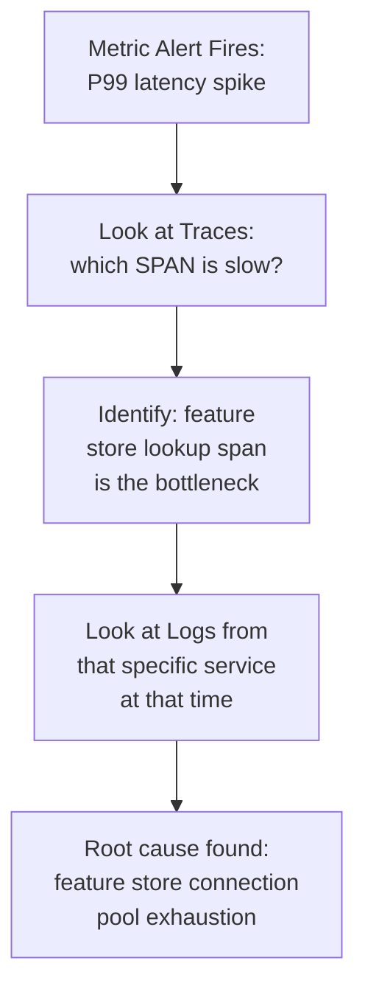

## Introduction

Chapter 32 covered *what* to monitor for ML-specific degradation (drift, decay). This chapter covers the broader *observability* infrastructure that supports monitoring, debugging, and incident response for the entire ML system — logging, tracing, and metrics, the traditional "three pillars" of observability, examined specifically through an ML lens. Where Chapter 32 answered "is the model still good?", this chapter answers "when something goes wrong anywhere in the system, how do I quickly find out why?"

## The Three Pillars, Applied to ML Systems



### Logging

Detailed, timestamped records of discrete events — in an ML serving context, this means the structured logs introduced in Chapter 30's example: every prediction request, its inputs, its output, its latency, and (critically for ML-specific debugging) which model version produced it. Chapter 30 already demonstrated this pattern directly; this chapter formalizes *why* it matters at the observability-architecture level.

**ML-specific logging considerations**:
- **Feature values, not just final predictions**: logging only the final output makes debugging a surprising prediction far harder — Chapter 24's explainability techniques and Chapter 15's skew-detection diffing both depend on having the actual input feature values available in logs, not just the output.
- **Model version and configuration**: every logged prediction should be traceable to the exact model version, feature store version, and any relevant configuration (like the decision threshold from Chapter 21) that produced it — directly supporting the reproducibility requirements from Chapter 24.
- **Sampling strategy**: as discussed in Chapter 23, logging every single feature vector for every request at high production volume carries real storage cost and potential privacy implications (Chapter 11) — a deliberate, documented sampling strategy (e.g., log 100% of flagged/high-risk predictions, but only a 1% sample of routine ones) balances debugging capability against these costs.

### Tracing

While logging captures what happened at a single point, **distributed tracing** captures how a single request flows across multiple services and stages — essential for the multi-stage pipelines this series has built throughout Part 6 (request validation → feature retrieval → pre-processing → inference → post-processing), especially once a system spans multiple independently-deployed services (a separate feature store service, a separate model serving container, etc.).



A **trace** represents one complete request's journey; each **span** within it represents time spent in one specific stage or service. This is the concrete implementation mechanism for the latency budget decomposition exercise from Chapter 26 — rather than manually instrumenting ad-hoc timers at each stage (as Chapter 30's simplified example did), a proper distributed tracing system (built on standards like OpenTelemetry) automatically captures and visualizes this breakdown across every request, making it possible to answer "which specific stage is actually consuming our latency budget" empirically and continuously, rather than through one-off manual investigation.

```python
# Illustrative use of OpenTelemetry to instrument the FastAPI
# gateway from Chapter 30 with proper distributed tracing spans.

from opentelemetry import trace

tracer = trace.get_tracer("fraud_serving_gateway")

async def predict_with_tracing(request):
    with tracer.start_as_current_span("predict_request") as parent_span:
        parent_span.set_attribute("transaction_id", request.transaction_id)

        with tracer.start_as_current_span("feature_retrieval"):
            store_features = await feature_client.get_features(request.user_id)

        with tracer.start_as_current_span("model_inference") as inference_span:
            result = fraud_model.predict(request.model_dump(), store_features)
            inference_span.set_attribute("fraud_probability", result["fraud_probability"])

        with tracer.start_as_current_span("post_processing"):
            response = build_response(result)

    return response
```

### Metrics

Aggregated, numerical measurements collected over time — the foundation of dashboards and automated alerting. ML systems need metrics at every layer this series has established:

- **Infrastructure metrics**: CPU/GPU utilization, memory usage, request throughput, error rates — standard software observability, unchanged in kind from any other production service.
- **Model-specific metrics**: prediction latency (per Chapter 26), cache hit rate (per Chapter 29), and the drift/decay signals from Chapter 32 (PSI values, ground-truth performance trends).
- **Business metrics**: the online metrics from Chapter 6 — conversion rate, engagement, fraud losses prevented — ideally visible on the same dashboards as the technical metrics, so an engineer investigating a technical anomaly can immediately see whether it's correlating with real business impact.

## Correlating the Three Pillars: The Real Value

The genuine power of observability comes from **correlating across all three pillars** during an actual incident investigation:



A metric alert tells you *that* something is wrong and roughly *where* (which service or dashboard panel). A trace tells you *which specific stage* of a specific request's journey was the actual bottleneck or failure point. A log tells you the *specific details* of what happened in that stage at that moment. Without all three working together, incident diagnosis becomes slow, manual guesswork — with them, it becomes a structured, fast, evidence-based investigation.

## Observability for ML-Specific Failure Modes

It's worth being explicit about how this chapter's general observability infrastructure supports the ML-specific concerns from earlier chapters:

| ML-Specific Concern | Observability Pillar That Helps |
|---|---|
| Training-serving skew (Ch. 15) | Logging (feature values) + a dedicated skew-comparison job reading those logs |
| Drift/decay (Ch. 32) | Metrics (PSI trends, ground-truth performance over time) |
| Latency budget bottleneck (Ch. 26) | Tracing (per-stage span breakdown) |
| Explainability audit trail (Ch. 24) | Logging (model version + feature values, enabling later reconstruction) |
| Fairness monitoring (Ch. 25) | Metrics (group-level performance metrics tracked over time) |

This table makes explicit what has been implicit throughout Part 5 and Part 7 so far: observability isn't a separate concern bolted onto an ML system — it's the concrete infrastructure that makes nearly every other practice covered in this series *actually operable* in production, rather than a one-time offline exercise.

## Observability as a Cost Center: A Genuine Trade-off

Comprehensive observability has real costs — storage for logs and traces, compute for metric aggregation, and engineering time to instrument and maintain it all. As with every other infrastructure investment in this series, the right level of observability investment should be justified by the actual risk and complexity of the system, not maximized by default: a low-stakes, simple system may reasonably operate with lighter-weight logging and metrics alone, while a high-stakes, complex, multi-service system (like the fraud detection examples used throughout this series) justifies fuller investment in distributed tracing and comprehensive, long-retention logging.

## Key Takeaways

- The three observability pillars — logging (detailed single-event records), tracing (multi-stage request flow), and metrics (aggregated numerical trends) — each answer a different question, and their combination is what makes fast, evidence-based incident investigation possible.
- ML-specific logging must capture feature values and model versions, not just final predictions, to support skew detection and explainability; sampling strategies balance this against storage and privacy costs.
- Distributed tracing is the concrete, continuous implementation of the latency budget decomposition exercise introduced in Chapter 26, replacing one-off manual instrumentation with systematic, per-request visibility.
- Nearly every ML-specific concern covered earlier in this series (skew, drift, fairness, explainability, latency) depends on the observability infrastructure built out in this chapter to actually be operable and detectable in a real production system.

---

## Interview Questions

**1. What are the three pillars of observability, and what distinct question does each one answer?**
Logging answers "what exactly happened during this one specific event" — providing detailed, timestamped records of discrete occurrences; tracing answers "how did this one specific request flow across multiple services and stages, and where did time get spent" — providing an end-to-end, multi-stage view of a single request's journey; metrics answer "what does the aggregate, numerical trend look like over time across many events" — providing the summarized signal that powers dashboards and automated alerting. Together, they let an engineer move from noticing a problem exists (via metrics) to identifying where in a complex, multi-stage system it's occurring (via tracing) to understanding exactly what happened in fine-grained detail (via logging).
*Follow-up: Could you diagnose a production incident using only one of these three pillars? What would be the limitation?*
You could technically investigate using just one pillar, but with significant limitations — using only metrics, you'd know something is wrong (e.g., latency has spiked) but have no way to pinpoint which specific stage or service is responsible without further investigation; using only logs without tracing, you'd have detailed information about individual events but no structured way to see how they connect across a multi-stage request, making it hard to reconstruct the full picture of a specific problematic request's journey; using only traces without logs, you'd see which stage was slow or failed but lack the detailed contextual information (like specific input values or error messages) needed to understand exactly why — the three pillars are complementary specifically because each compensates for what the others lack.

**2. Why must ML-specific logging capture feature values and model version information, beyond what a typical non-ML web service's logging would include?**
A typical web service's logging (request path, status code, latency) is generally sufficient to debug typical application-level issues, but ML-specific problems — training-serving skew (Chapter 15), a surprising individual prediction needing explanation (Chapter 24), or diagnosing which specific model version produced a specific historical decision (Chapter 26's registry, Chapter 24's reproducibility) — all require access to the actual feature values that went into a prediction and the specific model version that computed it, information a generic web service logging setup wouldn't capture by default since it has no equivalent concept of "feature values" or "model version" driving its typical, non-ML request handling.
*Follow-up: What's a risk of NOT logging feature values, specifically in the context of diagnosing a training-serving skew incident?*
Without logged feature values, diagnosing a suspected skew incident (Chapter 15) would require reconstructing what feature values a specific historical request actually received, which may be impossible after the fact if those values weren't captured in logs at the time — the entire skew-detection diffing technique from Chapter 15 (directly comparing training-time versus serving-time computed feature values for the same underlying event) depends fundamentally on having actually logged those serving-time feature values somewhere, so omitting this from your logging strategy would render this specific, important diagnostic technique unusable after the fact, forcing a much slower, less certain investigation relying on indirect evidence instead.

**3. Explain the relationship between a "trace" and a "span" in distributed tracing, using an example from this chapter's fraud-serving pipeline.**
A trace represents the complete, end-to-end journey of a single request through the entire system, while a span represents the time spent within one specific stage or service along that journey — in the fraud-serving example, a single trace for one prediction request would consist of multiple spans: one span for the feature store lookup, one span for the model inference, and one span for post-processing, each with its own start time, duration, and any relevant attributes (like the specific transaction ID or fraud probability) — the trace as a whole is the aggregation of all these child spans, providing a complete, hierarchical picture of exactly where time was spent across the full request.
*Follow-up: Why is it valuable for spans to be nested (e.g., a "predict_request" parent span containing "feature_retrieval," "model_inference," and "post_processing" child spans), rather than being a flat, unstructured list?*
Nesting spans hierarchically directly mirrors the actual logical structure of how the request is processed — a parent span representing the overall request naturally contains the child spans representing its constituent processing stages, making it immediately clear which spans belong to which overall request and in what sequence/relationship they occurred; a flat, unstructured list of spans without this hierarchical relationship would make it much harder to reconstruct which specific spans belonged together as part of the same single request's processing, especially in a system handling many concurrent requests simultaneously, where spans from different, unrelated requests could otherwise become difficult to disentangle from each other without this explicit parent-child structural relationship.

**4. Why is distributed tracing described as "the concrete, continuous implementation" of the latency budget decomposition exercise from Chapter 26, rather than a separate, unrelated technique?**
Chapter 26 introduced latency budget decomposition as a conceptual and largely manual exercise — reasoning about how much time each pipeline stage is expected to consume, and potentially adding one-off manual timing instrumentation (as Chapter 30's simplified example did with basic `time.monotonic()` calls) to check this against reality for a specific investigation; distributed tracing systematizes and automates this exact same underlying question — "how much time did each stage actually take" — capturing this breakdown continuously, for every single request, across the entire production system, rather than requiring an engineer to manually add and later remove ad-hoc timing code each time they want to investigate a specific latency question, making the same fundamental insight (per-stage latency breakdown) available on an ongoing, systematic basis rather than only during periodic, manual investigation efforts.
*Follow-up: What would be lost if a team relied only on Chapter 30's simple manual timing approach, rather than adopting a proper distributed tracing system, as their production system grew to include multiple independently-deployed services?*
The manual timing approach shown in Chapter 30's example only captures latency within a single process/service's own code — once a system grows to include multiple independently-deployed services (e.g., a separate feature store service, a separate model serving container communicating over gRPC per Chapter 27), manually correlating timing information collected independently across these different services and their separate logs becomes increasingly difficult and error-prone, especially under concurrent load with many simultaneous requests; a proper distributed tracing system specifically solves this cross-service correlation problem by propagating a shared trace identifier across service boundaries, automatically stitching together spans from different services into one coherent, correctly-correlated trace per request, which manual, per-service timing code has no built-in mechanism to achieve on its own.

**5. Why should business metrics (like conversion rate or fraud losses prevented) ideally be visible on the same dashboards as technical/infrastructure metrics, rather than being tracked in entirely separate systems?**
Having both categories of metrics visible together allows an engineer investigating a technical anomaly (e.g., an elevated error rate or latency spike) to immediately assess whether it's correlating with an actual, meaningful business impact, helping prioritize the urgency and severity of the response appropriately — a technical anomaly with no corresponding business metric impact might be a lower-priority issue to investigate calmly, while the same technical anomaly clearly correlating with a real drop in the business metric warrants immediate, high-priority attention; separating these into entirely disconnected systems makes this kind of fast, correlated assessment much harder, potentially causing either wasted urgency on a technically-concerning-but-business-irrelevant issue, or insufficient urgency on a technically-subtle issue that's actually causing significant real business harm.
*Follow-up: What organizational or technical challenge might make it difficult to actually achieve this kind of unified technical-and-business-metric dashboard in practice?*
Business metrics are often owned, defined, and tracked by different teams (product, data analytics, or business intelligence) using different tooling and data pipelines (often the data warehouse/lakehouse infrastructure from Chapter 9) than the infrastructure and technical metrics typically tracked by engineering teams using specialized observability platforms (like Prometheus/Grafana or a commercial APM tool) — unifying these into a single, coherent dashboard requires either integrating data from these genuinely different systems and teams (a real technical and organizational coordination challenge) or establishing shared tooling and processes across what might otherwise be organizationally siloed teams, which is a meaningful, non-trivial investment beyond simply choosing to display both categories of metrics together.

**6. How would you design a logging sampling strategy for a very high-traffic ML serving system, balancing debugging capability against storage cost and privacy concerns?**
I'd propose a tiered sampling strategy — logging 100% of predictions that are flagged as high-risk, unusual, or that trigger a specific decision threshold boundary (Chapter 21) that's most likely to need future investigation or explanation, while logging only a smaller statistical sample (e.g., 1-5%) of routine, "normal" predictions sufficient to support ongoing statistical monitoring (Chapter 32's drift detection) without needing to retain every single routine prediction's full detail — and applying appropriate data minimization and pseudonymization (Chapter 11) to whatever is logged, ensuring the sampling strategy itself is documented and periodically reviewed as a deliberate trade-off decision, rather than either logging everything (excessive cost/privacy risk) or logging too little to support necessary debugging and monitoring (insufficient diagnostic capability).
*Follow-up: Why might logging 100% of "high-risk" or "flagged" predictions specifically be a particularly important exception to a general sampling-down strategy?*
These are precisely the predictions most likely to be scrutinized later — for a regulatory explainability requirement (Chapter 24), a customer dispute or appeal, a fairness audit investigation (Chapter 25), or a detailed post-incident root-cause analysis — meaning the cost of *not* having detailed logs available for one of these specific, higher-stakes predictions when they're later needed is disproportionately high compared to the storage savings from sampling them down like routine predictions; prioritizing full logging specifically for this smaller, higher-stakes subset while sampling down the much larger volume of routine predictions achieves most of the storage/cost savings from sampling while preserving detailed diagnostic capability exactly where it's most likely to actually be needed later.

**7. Why is it valuable for a trace's spans to include relevant business-specific attributes (like `transaction_id` or `fraud_probability`, as shown in this chapter's code example), rather than just generic timing information?**
Generic timing information alone tells you how long each stage took, but attaching relevant business-specific attributes directly to the spans allows an engineer investigating a specific trace to immediately understand the business context of that specific request without needing to separately cross-reference logs or other systems — for example, seeing that a specific slow trace's inference span shows an unusually high `fraud_probability` might immediately suggest a hypothesis (e.g., "is complex, borderline-case reasoning taking longer to compute?") that pure timing data alone wouldn't reveal, directly connecting the tracing pillar's structural/timing information with meaningful business context in a single, unified view rather than requiring a separate correlation step across different observability tools.
*Follow-up: What's a risk of adding too many or overly sensitive attributes to spans, given that tracing data is often retained and accessed by a broader set of engineers than more tightly-access-controlled logs?*
Attaching overly sensitive information (like detailed personal or financial data, echoing the privacy concerns from Chapter 11) directly as span attributes risks exposing that sensitive information more broadly than intended, since tracing systems and their stored data are often accessed by a wide range of engineers for general debugging purposes, potentially with less strict access control than a more carefully-governed logging system might have; span attributes should generally be limited to information genuinely useful for debugging and understanding system behavior (like a probability score or a non-sensitive identifier) rather than including raw sensitive personal data, applying the same data minimization principle discussed in Chapter 11 specifically to what's included in tracing span attributes, not just to primary data storage and logging systems.

**8. How would you use the observability infrastructure from this chapter to investigate a suspected fairness issue (Chapter 25) in a production model?**
I'd use the metrics pillar to track group-level fairness metrics (positive prediction rate, true positive rate by demographic group, per Chapter 25's audit framework) continuously over time on a dashboard, watching for any emerging disparity trend; if a concerning disparity is detected, I'd use logging (assuming feature values and, where appropriate and permitted per Chapter 11's constraints, relevant group membership information were captured) to pull a sample of specific predictions for the affected group, and potentially use tracing to confirm that the affected group's predictions aren't being processed through some unexpected, different code path or pipeline stage that might itself be contributing to the disparity — combining all three pillars to move from "we're seeing a concerning fairness metric trend" to "here's the specific pattern of decisions and processing that's producing this trend," which is a necessary foundation for the deeper root-cause investigation described in Chapter 25.
*Follow-up: Why is it important that this fairness-metric monitoring happens continuously via the metrics pillar, rather than only being checked during the one-time pre-launch audit described in Chapter 25?*
As Chapter 25 itself emphasized, a model's fairness properties can drift over time just as its general accuracy can (via the same underlying drift mechanisms covered in Chapter 32) — a model that passed a rigorous one-time pre-launch fairness audit could develop a meaningful disparity months later due to a shift in the underlying population or feature-label relationships, and without continuous monitoring of these specific metrics via the observability infrastructure covered in this chapter, this kind of emerging, post-launch fairness drift would go completely undetected until it potentially became a significant, harder-to-address problem — directly reinforcing why this chapter's general observability infrastructure needs to specifically incorporate the fairness metrics from Chapter 25 as an ongoing, continuously-tracked signal, not just a one-time historical check.

**9. In an interview, if asked "how would you debug a production ML system where you're told 'predictions seem wrong sometimes, but we're not sure when or why,'" how would you use this chapter's concepts to structure your investigation?**
I'd start with metrics — checking whether there's a detectable pattern in when "wrong" predictions seem to correlate with any other observable signal, such as a specific time period, a specific drift signal from Chapter 32, or a specific latency anomaly (which might suggest a timeout or resource contention issue affecting prediction quality) — narrowing down from "sometimes wrong" to a more specific, correlated pattern; from there, I'd use tracing to examine specific traces from the time periods identified as problematic, checking whether any particular pipeline stage shows anomalous behavior (unusually high latency, an unexpected code path) during those specific windows; and finally, I'd use the detailed logs (including feature values and model version, per this chapter's ML-specific logging discussion) for the specific problematic requests identified through this narrowing process to understand the precise details of what actually happened for those specific "wrong" predictions, potentially combined with the explainability techniques from Chapter 24 to understand why the model produced that specific, seemingly wrong output given its specific inputs.
*Follow-up: Why is this progressive, three-pillar narrowing approach (metrics → traces → logs) generally more efficient than starting directly with detailed log analysis across the entire system?*
Starting directly with detailed log analysis across an entire production system's full volume of logs, without first narrowing down to a specific, suspected time period or pattern via metrics, would require sifting through an enormous, largely irrelevant volume of data to find the comparatively rare "wrong" predictions buried within it — using metrics first to identify a specific, narrower pattern or time window, and tracing next to identify a specific problematic pipeline stage or request pattern within that window, dramatically reduces the volume of detailed log data that actually needs to be examined in the final step, making the overall investigation significantly faster and more targeted than an undirected, brute-force search through the complete, unfiltered log volume from the very start.

**10. Why might a team choose to build custom, ML-specific observability tooling on top of a general-purpose observability platform (like Prometheus/Grafana or Datadog), rather than relying entirely on the general-purpose platform's out-of-the-box capabilities?**
General-purpose observability platforms excel at the infrastructure and general-metric side of observability (CPU/GPU utilization, request latency, error rates) but typically have no built-in, ML-specific understanding of concepts like model versions, feature distributions, PSI calculations, or fairness metrics by group — a team needs to build this ML-specific logic and instrumentation themselves (as this chapter's code examples demonstrate), even while still relying on the underlying general-purpose platform for the actual storage, querying, and visualization infrastructure that hosts and displays these custom ML-specific metrics and computations, rather than expecting the general-purpose platform to natively understand and compute these ML-specific concerns out of the box.
*Follow-up: What's an example of a specialized, ML-specific observability platform (as opposed to a general-purpose one) that a team might consider instead of building this custom tooling entirely from scratch?*
Platforms like Arize, WhyLabs, or Evidently AI are specifically built for ML observability, providing built-in support for exactly the kind of ML-specific concepts (feature distribution drift monitoring, model performance tracking over time, fairness metric monitoring) discussed throughout Chapter 32 and this chapter, without requiring a team to build all of this custom logic themselves on top of a purely general-purpose observability platform — a team might choose to adopt one of these specialized platforms (weighing the cost and integration effort against the value of not needing to build and maintain this specialized functionality in-house) as an alternative or complement to building custom tooling on top of a general-purpose platform, following the same build-vs-buy trade-off reasoning that applies to many other infrastructure decisions throughout this series (echoing, for instance, the feature store platform choice discussion in Chapter 13).

**11. Why does effective observability require deliberate investment and design (as this chapter argues), rather than something that naturally emerges just from having logging statements and metric counters scattered throughout the codebase?**
Scattered, ad-hoc logging and metrics added incrementally by different engineers, without a deliberate, coordinated observability strategy, tends to produce inconsistent formats (making automated analysis and correlation difficult), gaps in coverage (important events or stages left uninstrumented, simply because no one happened to add logging there), and a lack of the kind of structured correlation (shared trace IDs linking related spans and logs together, as discussed in this chapter) that makes the three pillars genuinely work together effectively — achieving the kind of fast, structured, evidence-based incident investigation described throughout this chapter requires deliberately designing for consistent structured logging formats, comprehensive and consistent tracing instrumentation across all relevant pipeline stages, and metrics that are specifically designed to support the ML-specific monitoring needs from Chapter 32, rather than simply hoping that ad-hoc, uncoordinated instrumentation added incrementally over time will happen to provide this same level of coherent, useful coverage.
*Follow-up: What organizational practice would help ensure new features or pipeline stages consistently receive appropriate observability instrumentation, rather than this being left to each individual engineer's inconsistent judgment?*
Establishing a shared observability standard or checklist as part of the team's code review and deployment process — requiring, for example, that any new service or pipeline stage include appropriate structured logging, tracing instrumentation, and relevant metrics before it can be considered ready for production deployment — treating observability instrumentation as a required, reviewed part of the development process itself (similar to how testing is often a required part of code review) rather than an optional, individually-judged addition that different engineers might handle inconsistently or skip entirely under time pressure, ensuring a consistent baseline level of observability coverage across the entire system regardless of which specific engineer built which specific component.

**12. How would you balance the cost of comprehensive observability (storage, compute, engineering time) against its benefits, for a small startup building their first production ML system?**
Following this series' recurring "start simple, escalate when justified" principle, I'd recommend a startup begin with solid, well-structured logging (capturing feature values, model version, and key prediction details, per this chapter's ML-specific logging discussion) and basic metrics (latency, error rate, and at least the most critical drift/decay signals from Chapter 32) as the foundational minimum, while deferring the more involved investment in full distributed tracing infrastructure until the system has grown complex enough (multiple independently-deployed services, genuinely difficult-to-diagnose cross-service latency issues) that tracing's specific benefit — correlating timing across multiple services — becomes clearly necessary rather than a nice-to-have for a system that might still be simple enough for basic per-service logging and manual timing to adequately diagnose most issues.
*Follow-up: What specific signal would indicate to this startup that it's time to invest in full distributed tracing, rather than continuing with just logging and metrics?*
A recurring pattern of production incidents or performance investigations that are difficult and slow to diagnose specifically *because* they require correlating information across multiple independently-deployed services (e.g., "we know overall latency is high, but we can't easily tell whether the bottleneck is in our feature store service, our model serving service, or the network between them") would be a clear, concrete signal that the specific problem distributed tracing is designed to solve (multi-service request correlation) has become a genuine, recurring pain point — at that point, the investment in setting up proper distributed tracing becomes justified by this demonstrated, specific need, rather than being adopted speculatively before the system has actually grown complex enough to require it.

**13. Why is it important for observability data (logs, traces, metrics) to have a well-defined retention policy, rather than being kept indefinitely by default?**
Retaining all observability data indefinitely incurs an ever-growing, unbounded storage cost that provides diminishing returns over time — most debugging and monitoring use cases genuinely only require access to relatively recent data (recent enough to investigate a current incident or recent trend), while very old observability data is rarely accessed in practice; additionally, retaining detailed logs (potentially including feature values that could be considered personal data, per Chapter 11) indefinitely can itself become a privacy and compliance liability, running counter to the data minimization principle discussed in that chapter — a well-defined, deliberately-chosen retention policy (e.g., detailed logs retained for 90 days, aggregated metrics retained much longer since they're smaller and less sensitive) balances the genuine debugging/monitoring value of retained data against its ongoing storage cost and privacy/compliance risk.
*Follow-up: Why might a team choose to retain metrics data for a much longer period than detailed logs, even though metrics are less granular?*
Aggregated metrics are typically much smaller in total data volume than the detailed, per-event logs they're derived from (since metrics summarize many individual events into a much smaller number of aggregate numbers), making longer retention of metrics comparatively cheap; metrics are also generally the most valuable data for long-term trend analysis (e.g., understanding how a model's performance or a specific drift signal has evolved over the past year, which is directly relevant to Chapter 32's long-term drift monitoring) and typically carry much lower privacy/sensitivity risk than detailed logs (since they're already aggregated and don't contain individual, potentially personally-identifiable feature values) — this combination of lower cost, higher long-term analytical value, and lower privacy risk makes longer retention of metrics a reasonable choice even while detailed logs are retained for a comparatively shorter period.

**14. How would you handle a situation where adding comprehensive tracing instrumentation to an existing, already-complex production ML system is estimated to take significant engineering time, and a stakeholder questions whether this investment is worthwhile?**
I'd frame the investment in terms of the specific, concrete pain points it would address — pointing to recent or historical incidents that took longer than necessary to diagnose specifically due to the lack of cross-service correlation that tracing would provide (echoing the earlier discussion about when tracing investment becomes justified), and quantifying, where possible, the engineering time and potential business impact (extended outages or degraded performance) that resulted from these slower, tracing-free diagnostic efforts — comparing this concrete, historical cost against the estimated one-time engineering investment required to add tracing, to make an evidence-based case for the investment rather than arguing for it purely on the basis of general best-practice principles disconnected from the team's own actual, demonstrated pain points.
*Follow-up: What would you propose if the stakeholder acknowledges the value but insists the team genuinely cannot afford the full engineering time investment right now?*
I'd propose an incremental, prioritized approach — rather than instrumenting the entire system comprehensively all at once, identifying and instrumenting first the specific handful of services or pipeline stages most frequently implicated in past difficult-to-diagnose incidents (the highest-value, most pain-point-relevant subset), delivering meaningful diagnostic improvement for the most common and costly failure patterns with a much smaller initial engineering investment, and treating the remaining, lower-priority instrumentation as a lower-priority backlog item to be addressed incrementally over time as engineering capacity allows — this mirrors the same incremental-investment principle discussed for building out a full CI/CD/CT pipeline in Chapter 31, applied here specifically to observability infrastructure investment.

**15. How would you summarize, for someone new to production ML engineering, why "observability" deserves to be treated as seriously as model accuracy itself, rather than as a secondary, purely operational concern?**
I'd explain that a highly accurate model that the team cannot effectively monitor, debug, or investigate when something eventually goes wrong (and something eventually always does, given the drift and skew risks covered throughout this series) provides false confidence rather than real, durable value — accuracy achieved in offline evaluation (Chapter 21) is only the starting point, and the actual, sustained, real-world value of an ML system depends entirely on the team's ongoing ability to detect when something has changed, quickly understand why, and respond appropriately — capabilities that are entirely dependent on the observability infrastructure covered in this chapter; a system with mediocre offline accuracy but excellent observability (allowing fast detection and correction of any issues) will very likely deliver more real, sustained business value over time than a system with excellent offline accuracy but poor observability, where problems go undetected and uncorrected for far longer once they inevitably occur.
*Follow-up: How does this framing connect back to the very first chapter's discussion of why most real-world ML project failures are engineering failures rather than modeling failures?*
This is a direct, concrete instantiation of Chapter 1's foundational argument — observability isn't a nice-to-have operational afterthought layered on top of "the real work" of building an accurate model, it's one of the specific, essential engineering practices (alongside data validation, proper evaluation, and staged rollout, all covered throughout this series) whose absence is what actually causes most real-world ML project failures; a team that invests heavily in model architecture and accuracy while under-investing in observability is, in effect, optimizing for exactly the wrong thing relative to what actually determines whether an ML system succeeds or fails sustainably in production, reinforcing why this entire series has consistently emphasized these surrounding engineering practices as being at least as consequential as the model itself, from its very first chapter onward.
