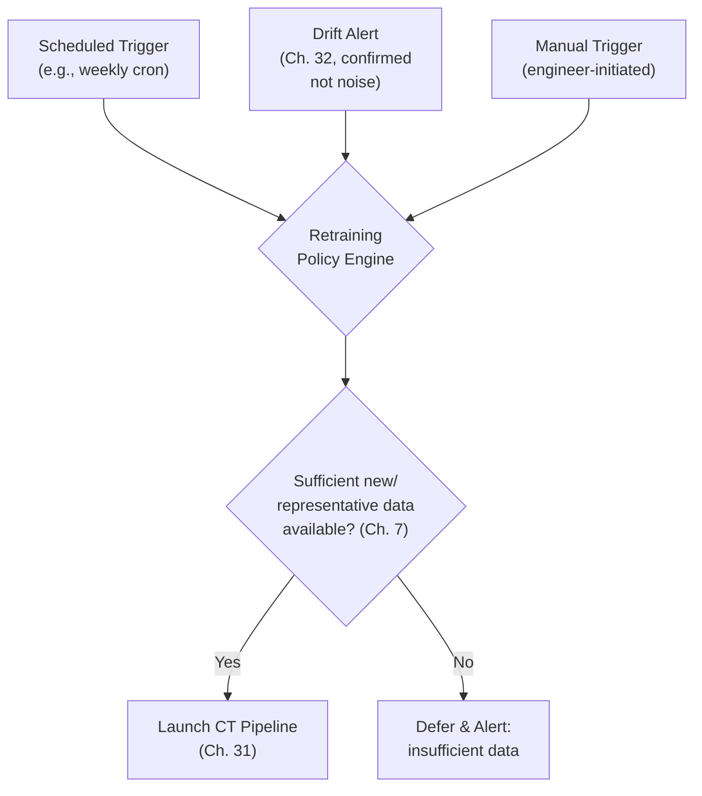
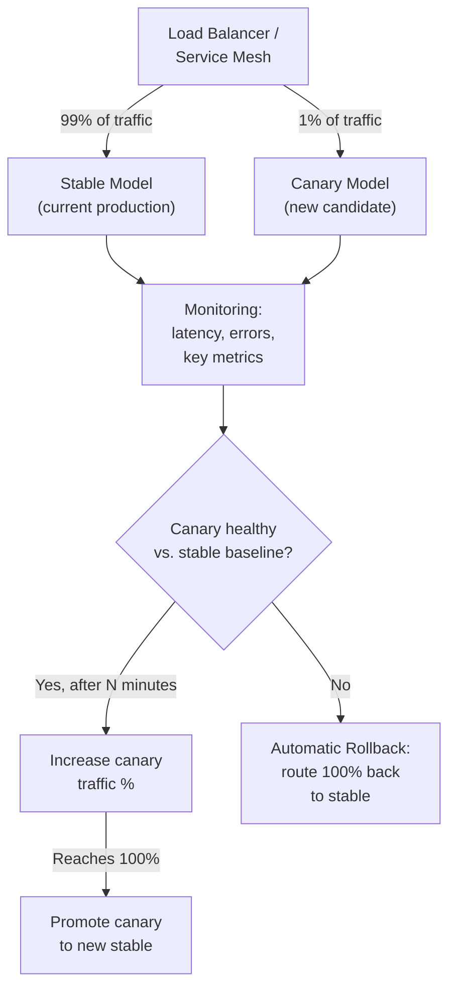

## Introduction

Chapters 31-33 built the pieces: CI/CD/CT automation, drift/decay monitoring, and observability. This chapter is the operational glue that connects them into a single, coherent, running system — specifically addressing two questions that every mature ML platform must answer concretely: **when exactly should retraining trigger**, and **how exactly does a canary deployment mechanically work** as automated infrastructure, not just a conceptual rollout stage. Where Chapter 23 covered canary releases as an *evaluation technique*, this chapter covers them as *deployment infrastructure* — the actual traffic-routing, monitoring-integration, and rollback automation that makes canary deployments a routine, low-toil operation rather than a manually-orchestrated event.

## Designing a Retraining Trigger Policy

Chapter 32 established that drift signals shouldn't reflexively trigger retraining. This section builds the concrete decision policy that formalizes when they should.



A production-grade retraining policy typically combines multiple trigger types rather than relying on just one:

- **Scheduled triggers**: the baseline cadence (Chapter 20's discussion of retraining frequency) — e.g., weekly or monthly, ensuring the model never goes indefinitely without incorporating new data even absent any detected problem.
- **Event-driven triggers**: a confirmed, sustained drift signal from Chapter 32's monitoring system, or a significant data volume milestone (e.g., "50,000 new labeled examples have accumulated since the last training run").
- **Manual triggers**: an engineer or data scientist explicitly requesting a retraining run, e.g., after a deliberate change to feature engineering logic or a hypothesis they want to test.

```python
# A simplified retraining policy engine, encoding the decision
# framework from Chapter 32 as executable logic that decides
# whether to actually launch the CT pipeline.

from dataclasses import dataclass
from datetime import datetime, timedelta

@dataclass
class RetrainingDecision:
    should_retrain: bool
    reason: str

def evaluate_retraining_policy(
    last_trained_at: datetime,
    max_staleness_days: int,
    confirmed_drift_detected: bool,
    new_labeled_examples_count: int,
    min_examples_for_retraining: int,
) -> RetrainingDecision:
    staleness = datetime.utcnow() - last_trained_at

    if confirmed_drift_detected and new_labeled_examples_count >= min_examples_for_retraining:
        return RetrainingDecision(True, "Confirmed drift with sufficient new data")

    if confirmed_drift_detected and new_labeled_examples_count < min_examples_for_retraining:
        return RetrainingDecision(
            False, "Drift confirmed but insufficient representative data — prioritize collection (Ch. 7)"
        )

    if staleness > timedelta(days=max_staleness_days):
        return RetrainingDecision(True, f"Scheduled retraining — model is {staleness.days} days stale")

    return RetrainingDecision(False, "No trigger condition met")
```

## Canary Deployment as Automated Infrastructure

Chapter 23 established *why* a canary release matters (validating operational health at small real scale). This section builds *how* it actually works as running infrastructure, typically implemented at the load balancer or service mesh layer.



**Key infrastructure components**:
- **Traffic splitting**: a load balancer or service mesh (e.g., Istio, or a cloud provider's native traffic-management layer) capable of routing a precise percentage of traffic to each model version — this is the direct successor to Chapter 26's hot-swapping capability, now automated as a configurable, incremental process rather than a single all-or-nothing switch.
- **Automated comparison**: the monitoring system (Chapter 33) continuously compares the canary's key metrics (error rate, latency, and where fast enough to measure, relevant online metrics from Chapter 6) against the stable version's concurrent baseline — critically, concurrent, not historical, since comparing against a historical baseline risks confounding the comparison with any time-varying external factors (echoing Chapter 22's emphasis on randomized, concurrent control groups).
- **Progressive ramp-up**: rather than jumping straight from 1% to 100%, a mature canary system increases the percentage in stages (1% → 5% → 25% → 50% → 100%), pausing at each stage to confirm continued health before proceeding — directly implementing the "staged rollout" principle from Chapter 2 as literal, automated infrastructure.
- **Automatic rollback**: if the canary's metrics breach a pre-defined threshold relative to the stable baseline at any stage, traffic is automatically routed back to 100% stable, without waiting for human intervention — this is the same automated rollback concept from Chapter 31, now specifically integrated into the canary traffic-routing mechanism itself.

```python
# A simplified canary controller loop, illustrating the automated
# progressive ramp-up and rollback decision logic.

import time

CANARY_STAGES = [1, 5, 25, 50, 100]  # percentage of traffic at each stage
STAGE_DURATION_SECONDS = 600          # observe each stage for 10 minutes

def run_canary_rollout(traffic_router, metrics_client, stable_version, canary_version):
    for stage_pct in CANARY_STAGES:
        traffic_router.set_split(stable_version, 100 - stage_pct, canary_version, stage_pct)
        print(f"Canary at {stage_pct}% traffic — observing for {STAGE_DURATION_SECONDS}s")
        time.sleep(STAGE_DURATION_SECONDS)

        canary_metrics = metrics_client.get_metrics(canary_version, window_seconds=STAGE_DURATION_SECONDS)
        stable_metrics = metrics_client.get_metrics(stable_version, window_seconds=STAGE_DURATION_SECONDS)

        if not is_canary_healthy(canary_metrics, stable_metrics):
            traffic_router.set_split(stable_version, 100, canary_version, 0)
            raise CanaryFailedException(f"Canary failed health check at {stage_pct}% — rolled back")

    traffic_router.promote(canary_version)  # canary becomes the new stable
    print(f"Canary {canary_version} fully promoted to stable")

def is_canary_healthy(canary_metrics: dict, stable_metrics: dict) -> bool:
    error_rate_regression = canary_metrics["error_rate"] > stable_metrics["error_rate"] * 1.5
    latency_regression = canary_metrics["p99_latency_ms"] > stable_metrics["p99_latency_ms"] * 1.3
    return not (error_rate_regression or latency_regression)
```

## Why "Concurrent" Comparison Matters

A subtle but consequential detail in the code above: `is_canary_healthy` compares the canary against the *stable version's metrics from the same time window*, not against a historical baseline recorded earlier. This directly applies Chapter 22's randomization principle to an automated system — if overall traffic conditions shift for any reason during the rollout window (a traffic spike, an unrelated infrastructure issue, a seasonal pattern), comparing the canary only against a stale historical baseline would risk misattributing that shift to the canary itself, either unfairly failing a healthy canary or, worse, failing to catch a genuine problem masked by favorable concurrent conditions.

## Closing the Full Loop

This chapter completes a picture that has been under construction since Chapter 4: monitoring (Chapter 32-33) feeds a retraining policy (this chapter) that triggers CI/CD/CT (Chapter 31), which produces a new model that flows through automated canary deployment (this chapter) with built-in rollback, which is itself then monitored (Chapter 32-33) — a fully closed, largely self-operating loop, with human review deliberately preserved (per Chapter 31's discussion) exactly where judgment calls remain necessary, and automation handling everything else consistently and quickly.

## Key Takeaways

- A production retraining policy combines scheduled, event-driven (confirmed drift), and manual triggers — and must check for sufficient representative data before launching retraining, not retrain reflexively on every signal.
- Canary deployment as infrastructure requires traffic splitting, automated concurrent comparison against the stable baseline, progressive stage-based ramp-up, and automatic rollback — turning Chapter 23's conceptual rollout stages into literal, running automation.
- Comparing a canary against a *concurrent* stable baseline (not a historical one) is essential to avoid misattributing external, time-varying factors to the canary itself.
- This chapter closes the full MLOps loop first previewed in Chapter 4: monitoring triggers retraining, retraining triggers automated canary deployment with rollback, and deployment is itself continuously monitored again.

---

## Interview Questions

**1. Why should a production retraining policy combine scheduled, event-driven, and manual triggers, rather than relying on just one type?**
Each trigger type addresses a different gap the others leave open: a scheduled trigger ensures the model never goes indefinitely stale even absent any detected problem (guarding against slow, hard-to-detect gradual drift that might not cross an alerting threshold quickly); an event-driven trigger (confirmed drift from Chapter 32) allows the system to react promptly to sudden, significant shifts that shouldn't wait for the next scheduled cycle; and a manual trigger preserves the ability for an engineer to initiate retraining for reasons the automated system has no way to anticipate, like testing a deliberate feature engineering change — relying on only one of these would leave the system unable to respond appropriately to the specific category of situation the other two are designed to address.
*Follow-up: What risk arises from relying purely on a scheduled trigger, without any event-driven component, for a fast-moving domain like fraud detection?*
A purely scheduled trigger (e.g., weekly) leaves the model exposed to any sudden, significant shift in fraud patterns for the entire remaining duration until the next scheduled retraining, potentially days, during which the model could be actively missing new fraud patterns or generating unnecessary false positives — for a fast-moving, adversarial domain like fraud (Chapter 7's recency discussion), this gap can represent a meaningful real-world cost, which is precisely why an event-driven trigger, capable of reacting off-cycle to a confirmed, significant drift signal, is particularly valuable specifically for this kind of fast-changing use case, rather than relying on a fixed schedule alone.

**2. Why does the retraining policy example in this chapter explicitly check for "sufficient representative data" before triggering retraining, even when drift has been confirmed?**
This directly implements the decision framework from Chapter 32 — confirming that drift is real and requires a response doesn't automatically mean there's yet enough fresh, representative data reflecting the new pattern to actually train a reliable, well-generalizing model on; launching a retraining run prematurely, before sufficient representative data has accumulated, risks producing a poorly-generalizing model that might perform worse (not better) than the current production model on the very pattern the retraining was meant to address, since the training data still wouldn't adequately represent that pattern in sufficient volume for the model to learn it reliably.
*Follow-up: What would you do if this check indicated insufficient data was available, but the confirmed drift was causing significant, ongoing real-world harm in the meantime?*
I'd apply the interim mitigation strategies discussed in Chapter 32 — such as a more conservative decision threshold or a targeted rules-based heuristic addressing the specific known pattern — as a temporary measure to reduce harm while data collection is prioritized and accelerated (potentially using the targeted collection or active learning strategies from Chapter 7), rather than either accepting the ongoing harm indefinitely while waiting for organic data accumulation, or prematurely retraining on genuinely insufficient data and risking an unreliable model replacing an at-least-partially-functioning one.

**3. Why is a service mesh or load balancer's traffic-splitting capability described as "the direct successor" to the hot-swapping capability discussed in Chapter 26?**
Chapter 26 introduced hot-swapping as the capability to load a new model version into a running server without downtime, framing it primarily as an all-or-nothing (or manually-staged) switch between versions; this chapter's traffic-splitting infrastructure builds directly on top of that same underlying hot-swapping capability but adds a precise, configurable, and automatable percentage-based control layer on top of it — rather than a binary "switch to the new version" operation, the system can maintain both versions simultaneously, each hot-swapped into different serving instances or the same instance pool, and precisely control what fraction of incoming traffic reaches each, enabling the gradual, staged rollout process this chapter automates rather than requiring hot-swapping to always mean an immediate, complete cutover.
*Follow-up: Why would attempting to implement fine-grained, percentage-based canary traffic splitting be difficult or impossible without an underlying hot-swapping-capable serving infrastructure?*
Without the ability to have multiple model versions simultaneously loaded and ready to serve traffic within the same serving infrastructure (which is precisely what hot-swapping enables), achieving genuine, fine-grained percentage-based traffic splitting between versions would require running entirely separate, fully-provisioned serving deployments for each version and manually or crudely routing traffic between them at the infrastructure level — a much less efficient, more operationally complex approach than a properly hot-swap-capable serving framework that can maintain multiple versions within a shared, already-running infrastructure pool and dynamically adjust the traffic split between them through configuration alone, without needing to provision or manage entirely separate deployments for each version being compared.

**4. Why is it critical for canary health comparisons to use the stable version's *concurrent* metrics, rather than a historical baseline recorded before the canary rollout began?**
This directly applies the randomization principle from Chapter 22's A/B testing discussion — if the canary is compared only against a historical baseline, any external, time-varying factor that changes between when that historical baseline was recorded and when the canary is actually running (a traffic pattern shift, a seasonal effect, an unrelated infrastructure change, or general system load variation) would be conflated with the canary's own actual performance, since the historical baseline wouldn't reflect these same concurrent conditions; comparing against the stable version's metrics measured during the exact same time window as the canary ensures both are being evaluated under identical concurrent conditions, isolating the canary's own specific behavior as the only meaningful variable in the comparison, exactly as random concurrent assignment does in a proper A/B test.
*Follow-up: Give a concrete example of how using a historical (rather than concurrent) baseline could cause a canary rollout automation to make an incorrect decision.*
If a canary rollout happens to run during an unexpected, system-wide traffic spike (perhaps due to an unrelated marketing campaign or viral event) that increases latency across the *entire* serving system, including both the stable and canary versions equally, comparing the canary's latency only against a historical baseline recorded during normal, lower-traffic conditions would make the canary appear to have a significant latency regression, potentially triggering an unnecessary automatic rollback of a canary model that's actually functioning perfectly normally relative to the stable version under the same concurrent, unusually high-traffic conditions — a concurrent comparison against the stable version's simultaneously-measured metrics would correctly reveal that both versions are experiencing similar, traffic-spike-driven latency increases, avoiding this false-positive rollback.

**5. Why does the canary rollout process use progressive stages (1% → 5% → 25% → 50% → 100%) rather than jumping directly from a small canary percentage to full rollout?**
Progressive, staged ramp-up limits the "blast radius" of a problem at each successive stage — if an issue only becomes apparent at a higher traffic volume or after a longer exposure duration than the initial small canary percentage provided (e.g., a rare edge case that only manifests once enough real, diverse traffic has been processed, or a resource contention issue that only appears under higher load), the staged approach catches this at a still-limited exposure level (say, 25% of traffic) rather than only discovering it after already jumping to 100% of production traffic; each stage acts as an additional checkpoint, providing multiple, increasingly-confident opportunities to catch a problem before it can affect the entire user base.
*Follow-up: What's the trade-off in choosing how long to observe each stage before proceeding to the next (the STAGE_DURATION_SECONDS in the code example), and how would you determine an appropriate duration?*
A shorter observation duration at each stage allows the overall rollout to complete faster, getting the benefit of a genuinely improved model to more users sooner, but risks proceeding to the next stage before a genuine, slower-to-manifest problem has had sufficient time to become statistically detectable (echoing the sample-size and statistical-power considerations from Chapter 22); a longer observation duration provides more confidence at each stage but delays the overall rollout and the resulting benefit — an appropriate duration should be informed by the same kind of statistical reasoning from Chapter 22 (how much traffic/time is needed to reliably detect a meaningful regression at this specific traffic percentage) balanced against the specific system's risk tolerance and how quickly the team wants to realize the new model's benefits, rather than an arbitrary, fixed duration chosen without this underlying justification.

**6. How would you decide the specific health-check thresholds (like the 1.5x error rate multiplier and 1.3x latency multiplier in this chapter's code example) for a canary deployment automation system?**
I'd calibrate these thresholds empirically based on the system's historically observed normal variation between concurrent, equivalent traffic slices even when running the *same* model version (establishing what "acceptable normal noise" looks like between two randomly-split but functionally identical groups), rather than choosing arbitrary multiplier values — thresholds set too tight (e.g., requiring near-perfect equality) would risk frequent, unnecessary automatic rollbacks triggered by normal, expected statistical noise between the canary and stable traffic slices, echoing the alert-fatigue and false-positive concerns from Chapters 10 and 32, while thresholds set too loose would fail to catch genuine, meaningful regressions before they've affected too much traffic, undermining the entire purpose of the staged canary process.
*Follow-up: How would you validate that your chosen thresholds are well-calibrated, beyond an initial empirical estimate?*
I'd track the canary automation's own historical track record over time — how often it correctly caught genuine problems (successful early detections that prevented a bad model from reaching full production) versus how often it triggered an unnecessary rollback for what turned out, upon investigation, to be a healthy canary experiencing normal statistical variation — using this ongoing track record to iteratively refine and re-calibrate the thresholds over time, similar to the general practice of periodically reviewing and tuning alerting thresholds discussed in Chapter 32, rather than treating the initial threshold choice as a permanent, unrevisited configuration.

**7. Why is it valuable for the retraining policy engine and the canary deployment controller to be implemented as explicit, version-controlled, testable code (as shown in this chapter's examples), rather than embedded as implicit knowledge or informal process followed by an on-call engineer?**
Explicit, version-controlled code makes the exact decision logic transparent, auditable, and consistently applied every single time, regardless of which specific engineer happens to be on call or how much time pressure they're under — it can be code-reviewed, tested against known scenarios (unit tests verifying the policy correctly triggers or defers retraining under specific input conditions), and its behavior can be reliably reproduced and explained after the fact (directly supporting the auditability theme from Chapter 31), none of which is reliably achievable if the same logic instead exists only as informal tribal knowledge or an unwritten process that different engineers might interpret or execute slightly differently from each other over time.
*Follow-up: What kind of test would you write to validate the retraining policy engine's correctness before deploying it to actually control production retraining decisions?*
I'd write unit tests covering each distinct decision branch and their boundary conditions — for example, confirming the policy correctly triggers retraining when drift is confirmed and sufficient data is available, correctly defers (with the appropriate reason) when drift is confirmed but data is insufficient, correctly triggers on schedule when the staleness threshold is exceeded even without any drift signal, and correctly does nothing when no trigger condition is met — testing each of these scenarios independently with clearly-defined input values ensures the policy's logic behaves exactly as intended across the full range of realistic situations it will need to handle, before trusting it to make real, consequential decisions autonomously in production.

**8. How would you handle a situation where the automated canary rollout process repeatedly fails and rolls back for a specific new model version, but the offline evaluation (Chapter 21) and shadow deployment (Chapter 23) stages both showed no issues?**
This pattern suggests the problem is specifically something that only manifests under genuine, live production conditions with real user traffic and real-world variability — something neither offline evaluation (using historical, static data) nor shadow deployment (which, per Chapter 23, validates operational correctness but doesn't expose the model's predictions to genuinely affect real outcomes) would necessarily catch; I'd investigate whether the canary's specific failure pattern correlates with a particular subset of real traffic or a specific real-world condition (e.g., a particular time of day, a specific user segment, or an interaction with some other live system component) that wasn't adequately represented in the offline evaluation or shadow deployment's test conditions, using this as a diagnostic clue pointing toward what specifically differs between the "looks fine" earlier stages and the "actually fails" canary stage.
*Follow-up: What would this repeated pattern suggest about potential gaps in the offline evaluation or shadow deployment process itself, beyond just this one specific model version's issue?*
A repeated pattern of canary-stage-only failures might reveal a systemic gap in what the offline evaluation and shadow deployment stages are actually validating — perhaps the offline evaluation dataset isn't sufficiently representative of certain real-world edge cases or traffic patterns that only genuinely show up in live production, or shadow deployment's specific health checks aren't comprehensive enough to catch the particular class of issue that keeps causing canary failures — this would be valuable feedback to strengthen the earlier validation stages themselves (adding new offline evaluation slices or shadow deployment checks specifically targeting whatever pattern the canary keeps catching), so that future model versions can ideally have this same class of issue caught earlier and more cheaply, rather than only being caught (even if still safely, thanks to the canary process) at this later, comparatively more expensive-to-diagnose stage.

**9. In an interview, if asked to design the automated retraining and deployment pipeline for a system with a very expensive-to-train model (e.g., a large model requiring the distributed training infrastructure from Part 4), how would this change your retraining trigger policy compared to a cheap-to-train classical model?**
Given the significant compute cost of each training run (Chapters 16-19), I'd weight the retraining trigger policy more conservatively — requiring stronger, more confidently-confirmed evidence of genuine drift (perhaps requiring the drift signal to persist across more consecutive monitoring windows than would be required for a cheap model, per Chapter 32's alerting design discussion) before triggering an expensive retraining run, and I'd favor a less frequent scheduled baseline cadence, relying more heavily on the event-driven trigger to catch genuinely significant shifts rather than retraining on a fast, cheap, fixed schedule regardless of whether meaningful drift has actually occurred — directly reflecting the cost-benefit trade-off consideration that a much higher per-retraining cost justifies a correspondingly higher bar of evidence before committing to that cost.
*Follow-up: How would this same cost consideration affect your canary deployment strategy for this expensive-to-train large model, compared to a cheaper classical model?*
For an expensive-to-train large model, once a new version has actually been produced (representing a significant, already-sunk training cost), I'd likely still apply the same rigorous, staged canary rollout process described in this chapter — since the canary process's cost is primarily about careful, gradual traffic exposure and monitoring rather than repeated training cost, and skipping or abbreviating this rollout safety process to "save time" after having already invested significant compute cost in training wouldn't be a sound trade-off, especially since a bad rollout could waste that entire expensive training investment if the resulting model has to be discarded due to an issue that a more careful staged rollout would have caught earlier and more cheaply, before it caused significant real-world harm at full production scale.

**10. Why might an organization choose to implement automated rollback for canary deployments before fully automating the retraining trigger decision, or vice versa — is there a natural order of priority between these two automation investments?**
Automated rollback for canary deployments primarily addresses safety and risk mitigation for changes that are already being deployed (regardless of how those changes were originally triggered or decided upon), making it a foundational safety mechanism that benefits from being in place early, even before the upstream retraining trigger decision itself is fully automated (an organization could still be manually deciding when to retrain, while already benefiting from automated, safe canary rollout and rollback once a new model is ready); automating the retraining trigger decision itself primarily addresses operational efficiency and responsiveness (freeing up engineer time and enabling faster response to drift), which is valuable but arguably a lower-priority safety concern than ensuring that whatever models do get deployed — triggered manually or automatically — are rolled out and monitored safely; many organizations would reasonably prioritize building robust, automated canary/rollback infrastructure first, since it provides an essential safety net regardless of how the upstream retraining decision is made, before or alongside automating the retraining trigger decision itself.
*Follow-up: Could an organization safely automate retraining triggers without first having robust automated canary/rollback infrastructure in place? What would be the risk?*
This would be a genuinely risky sequencing choice — automating the decision to retrain and produce new model candidates more frequently, without a correspondingly robust, automated safety mechanism (canary deployment with rollback) for actually deploying those candidates safely, would mean a larger volume of model updates flowing toward production without the safety net specifically designed to catch and limit the impact of a bad update; this sequencing mismatch could increase the organization's overall risk exposure (more frequent model changes, without a proportionally robust deployment safety mechanism to manage the increased associated risk) rather than reducing it, which is a strong argument for prioritizing the canary/rollback safety infrastructure at least concurrently with, if not somewhat ahead of, fully automating the upstream retraining trigger decision.

**11. How would you modify the canary deployment approach described in this chapter for a system with the SUTVA/interference concerns discussed in Chapter 22 (e.g., a two-sided marketplace)?**
Just as Chapter 22 recommended cluster-based (e.g., geographic) randomization for A/B testing in a marketplace with interference concerns, I'd apply the same principle to canary traffic splitting — rather than randomly assigning individual requests or users to the canary versus stable model (which could allow interference between the two groups sharing the same local marketplace dynamics, as discussed in Chapter 22), I'd split traffic at the level of entire, sufficiently isolated clusters (e.g., routing 1% of *cities* entirely to the canary model, rather than 1% of individual *requests* across all cities), ensuring the canary rollout's health comparison isn't confounded by the same kind of cross-group interference that would invalidate a naive individual-level A/B test in this specific context.
*Follow-up: What practical challenge does this cluster-based canary approach introduce, compared to the simpler per-request traffic-splitting approach shown in this chapter's code example?*
Cluster-based canary splitting has a much smaller number of independently-assignable units (a limited number of cities or regions, rather than potentially millions of individual requests), which means reaching the statistical confidence needed to detect a meaningful regression (echoing the reduced effective sample size discussion for cluster-randomized experiments in Chapter 22) requires either a longer observation duration at each stage or accepting a coarser-grained progression through fewer, larger canary stages (e.g., "1 city" → "5 cities" → "20 cities" rather than the smooth percentage-based progression shown in this chapter's simpler example), making the overall staged rollout process potentially slower and requiring more careful statistical consideration than the simpler, higher-granularity per-request splitting approach that works well for systems without this kind of marketplace interference concern.

**12. Why might a team choose to keep the "promote canary to new stable" step (the final stage in this chapter's rollout process) as a manual confirmation step, even if every preceding stage is fully automated?**
This reflects the same automated-gates-versus-human-judgment balance discussed in Chapter 31 — even if every individual automated health check at each canary stage has passed, the final decision to fully commit to the new model version as the ongoing production standard (making it the new baseline that all future comparisons and canary rollouts will be measured against) can be treated as a deliberately higher-stakes checkpoint warranting a final human confirmation, particularly for organizations still building confidence in their automated canary/rollback infrastructure, or for particularly high-stakes systems where a final human sign-off provides an additional, valuable layer of assurance beyond what the automated checks alone have validated.
*Follow-up: What would need to be true for an organization to reasonably remove even this final manual confirmation step and fully automate the entire rollout process end to end?*
The organization would need a strong, demonstrated track record of the automated health checks at each preceding stage reliably and consistently catching genuine problems (with a low false-negative rate, meaning genuinely problematic canaries are reliably caught and rolled back before reaching this final stage) combined with well-calibrated thresholds (a low false-positive rate too, meaning healthy canaries aren't unnecessarily blocked) — essentially, enough accumulated evidence and confidence in the automated system's reliability (similar to the evidence-based progression toward automating previously-manual-review gate categories discussed in Chapter 31) to justify extending full trust to the automation for this final step as well, rather than removing this manual checkpoint prematurely, before that level of demonstrated reliability has actually been established.

**13. How does this chapter's closed-loop system (monitoring → retraining policy → CT pipeline → canary deployment → monitoring again) relate to the "AI system lifecycle" diagram first introduced in Chapter 4?**
This chapter's closed loop is the fully-automated, concrete realization of exactly the abstract lifecycle loop first sketched in Chapter 4 — where Chapter 4 showed a conceptual diagram of monitoring feeding back into data collection and eventually retraining, this chapter has built the actual, specific, running automation (a retraining policy engine, a CT pipeline trigger, an automated canary controller with rollback) that makes that conceptual loop a genuine, continuously operating production system rather than a description of a manual process a team would need to remember and execute by hand at every iteration; every other chapter in Parts 2 through 7 has, in effect, been building one specific piece of infrastructure needed to make this Chapter 4 lifecycle loop actually work reliably and automatically at production scale.
*Follow-up: Why is it pedagogically significant that this chapter — covering automated retraining and canary deployment — comes near the end of Part 7, rather than immediately after Chapter 4 introduced the lifecycle concept?*
Building this chapter's automated, closed-loop system requires every one of the underlying capabilities covered in the intervening chapters — reliable data validation and feature computation (Parts 2-3), efficient training infrastructure (Part 4), rigorous offline evaluation including fairness auditing (Part 5), robust serving infrastructure (Part 6), and the CI/CD/CT automation and monitoring/observability infrastructure from this Part's own earlier chapters (31-33) — attempting to present this chapter's full automation immediately after Chapter 4 would have required either presenting it at a purely abstract, hand-wavy level (without the concrete underlying infrastructure this chapter's code examples actually depend on) or requiring the reader to already understand concepts not yet introduced; placing it here, after all of these prerequisite capabilities have been individually built up, allows this chapter to genuinely and concretely demonstrate how they all combine into one real, cohesive, operating system, rather than describing an automation that couldn't actually be built without everything covered in between.

**14. How would you explain to a skeptical engineering leader why investing in this chapter's level of automation (retraining policy engines, automated canary controllers) is worthwhile, compared to a team that manually reviews and approves each model deployment?**
I'd point to the specific, quantifiable costs of the manual alternative — the engineer time spent manually monitoring for drift signals, manually deciding when to retrain, manually orchestrating and monitoring each stage of a rollout, and the inherent risk of human inconsistency or delay in each of these steps (a manual reviewer being slower to notice a problem than an automated system checking metrics every few minutes, or a manual rollout process being more prone to skipping a stage under time pressure) — and compare this against the concrete benefits this chapter's automation provides: faster response to genuine problems (via automated rollback, rather than waiting for a human to notice and manually intervene), freed-up engineer time for higher-value work, and more consistent, reliable application of the same safety checks to every single deployment regardless of team workload or time pressure, framing the investment in automation as directly addressing measurable operational costs and risks rather than as automation for its own sake.
*Follow-up: What would be a reasonable way to validate, after implementing this automation, that it's actually delivering these claimed benefits rather than just adding complexity?*
I'd track concrete before-and-after metrics — the average time to detect and respond to a genuine model degradation issue (comparing the automated system's detection-to-rollback time against the previous manual process's typical response time), the frequency and severity of production incidents related to model deployments, and the engineer time spent on manual model-deployment-related tasks — using this kind of measured, comparative evidence (echoing the general principle of validating infrastructure investments with concrete evidence, discussed in Chapter 31's own "how would you measure pipeline value" question) to confirm the automation is actually delivering the claimed benefits, rather than simply assuming it must be beneficial because it represents more sophisticated engineering.

**15. How would you summarize, for someone studying for an AI System Design interview, the single most important lesson from this chapter and the broader Part 7 it concludes?**
I'd say the single most important lesson is that a genuinely mature, production-grade ML system treats the *entire* lifecycle — from monitoring through retraining through deployment and back to monitoring again — as one continuously-operating, largely automated feedback loop, rather than a sequence of discrete, manually-triggered, one-off events; the specific techniques covered throughout Part 7 (CI/CD/CT automation, drift monitoring, observability, and this chapter's retraining policies and canary automation) are all, at their core, in service of this single, unifying goal — building a system that keeps itself healthy, accurate, and safe over time with minimal ongoing manual toil, closing the loop that Chapter 1 first identified as the fundamental, defining difference between AI systems and traditional software.
*Follow-up: How would you use this summarized lesson to structure your closing remarks in an interview answer about designing any production ML system, regardless of the specific use case?*
I'd make a point of explicitly closing my answer by describing this full feedback loop for whatever specific system I'd just designed — even if the interviewer's original question focused primarily on the model or the initial architecture — explicitly stating how the system would be monitored, what would trigger retraining, and how a new model version would be safely rolled out and could be automatically rolled back if needed; doing this consistently, as a deliberate closing habit for every system design answer regardless of the specific prompt, ensures I'm always demonstrating this complete, lifecycle-level thinking rather than only ever describing a system's initial, one-time build — which is exactly the kind of consistently-applied, senior-level systems thinking this entire series, and this chapter specifically, has been building toward.
