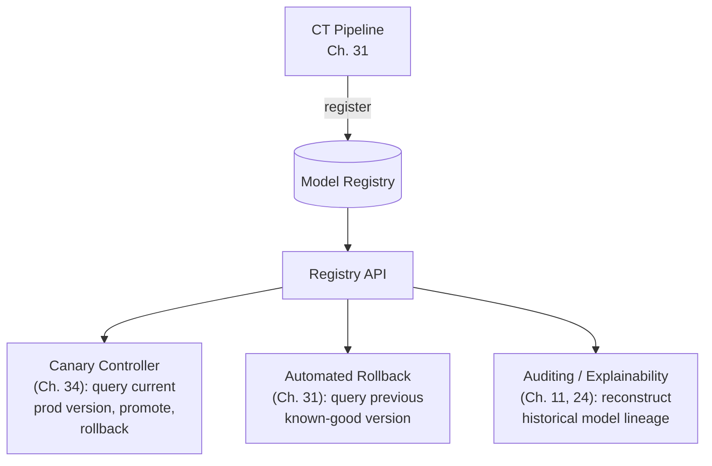

## Introduction

Part 7 closes the way Part 6 did — with a hands-on code chapter that makes every preceding concept concrete. The model registry was introduced conceptually in Chapter 26 and referenced throughout Chapters 31, 32, and 34 as the piece of infrastructure that makes automated CI/CD/CT, monitoring-driven retraining, and canary deployment all actually *work together*. This chapter builds one, end to end, in Python — a real, if simplified, implementation of the registry that has been a load-bearing concept across this entire Part.

## What the Registry Needs to Do

Distilling everything referenced across Chapters 26, 31, 32, and 34, a model registry needs to:
1. **Store versioned model artifacts** with associated metadata (training data version, code version, offline evaluation metrics — Chapter 21).
2. **Track deployment stage** for each version (`staging`, `canary`, `production`, `archived`) — the exact mechanism Chapter 34's canary controller depends on.
3. **Answer "what's currently in production"** instantly and reliably — the exact capability Chapter 31's automated rollback requires.
4. **Provide a full audit trail** of every stage transition — directly supporting the reproducibility and governance needs from Chapters 11 and 24.



## Step 1: The Data Model

```python
# models.py
from datetime import datetime
from enum import Enum
from pydantic import BaseModel, Field

class DeploymentStage(str, Enum):
    STAGING = "staging"
    CANARY = "canary"
    PRODUCTION = "production"
    ARCHIVED = "archived"

class ModelMetrics(BaseModel):
    # Directly captures Chapter 21's offline evaluation output and
    # Chapter 25's fairness audit results as first-class metadata,
    # not an afterthought bolted on separately.
    primary_metric_name: str
    primary_metric_value: float
    guardrail_metrics: dict[str, float] = Field(default_factory=dict)
    fairness_metrics: dict[str, dict[str, float]] = Field(default_factory=dict)

class ModelVersion(BaseModel):
    model_name: str
    version: str  # e.g., "v2024_09_14_a1b2c3"
    artifact_uri: str  # e.g., "s3://model-artifacts/fraud_model/v2024_09_14/"
    training_data_version: str  # ties to the lakehouse time-travel concept, Ch. 9
    code_commit_hash: str
    metrics: ModelMetrics
    stage: DeploymentStage = DeploymentStage.STAGING
    created_at: datetime = Field(default_factory=datetime.utcnow)

class StageTransition(BaseModel):
    # The audit trail record — every transition is logged, never
    # overwritten, directly supporting Chapter 11/24's governance needs.
    model_name: str
    version: str
    from_stage: DeploymentStage
    to_stage: DeploymentStage
    transitioned_at: datetime = Field(default_factory=datetime.utcnow)
    transitioned_by: str  # "ci_pipeline" or a specific engineer's identity
    reason: str
```

## Step 2: The Registry Storage Layer

```python
# storage.py
from models import ModelVersion, StageTransition, DeploymentStage

class ModelRegistryStorage:
    """
    A simplified, in-memory illustration of the registry's storage
    layer. A real production registry would back this with a proper
    database (for metadata) plus object storage (for artifacts) —
    the same lakehouse/object-storage split introduced in Chapter 9.
    """
    def __init__(self):
        self._versions: dict[tuple[str, str], ModelVersion] = {}
        self._transitions: list[StageTransition] = []

    def register(self, version: ModelVersion) -> None:
        key = (version.model_name, version.version)
        if key in self._versions:
            raise ValueError(f"Version {version.version} of {version.model_name} already registered")
        self._versions[key] = version

    def get(self, model_name: str, version: str) -> ModelVersion:
        return self._versions[(model_name, version)]

    def get_current_production(self, model_name: str) -> ModelVersion | None:
        # This is the exact lookup Chapter 31's automated rollback
        # and Chapter 34's canary controller both depend on.
        candidates = [
            v for (name, _), v in self._versions.items()
            if name == model_name and v.stage == DeploymentStage.PRODUCTION
        ]
        return candidates[0] if candidates else None

    def get_previous_production(self, model_name: str) -> ModelVersion | None:
        # Reconstructed from the audit trail — "what was production
        # right before the CURRENT production version was promoted."
        promotions = [
            t for t in self._transitions
            if t.model_name == model_name and t.to_stage == DeploymentStage.PRODUCTION
        ]
        promotions.sort(key=lambda t: t.transitioned_at)
        if len(promotions) < 2:
            return None
        previous_version_id = promotions[-2].version
        return self.get(model_name, previous_version_id)

    def transition_stage(self, model_name: str, version: str,
                           to_stage: DeploymentStage, transitioned_by: str, reason: str) -> None:
        current = self.get(model_name, version)
        transition = StageTransition(
            model_name=model_name, version=version,
            from_stage=current.stage, to_stage=to_stage,
            transitioned_by=transitioned_by, reason=reason,
        )
        self._transitions.append(transition)  # audit log entry, never deleted
        current.stage = to_stage

    def get_lineage(self, model_name: str, version: str) -> list[StageTransition]:
        # Full audit trail for a specific version — directly answers
        # "how did this model get to production, and when."
        return [
            t for t in self._transitions
            if t.model_name == model_name and t.version == version
        ]
```

## Step 3: The FastAPI Registry Service

```python
# main.py
from fastapi import FastAPI, HTTPException
from models import ModelVersion, DeploymentStage
from storage import ModelRegistryStorage

app = FastAPI(title="Model Registry Service")
registry = ModelRegistryStorage()

@app.post("/models/{model_name}/versions")
def register_version(model_name: str, version: ModelVersion):
    if version.model_name != model_name:
        raise HTTPException(400, "model_name mismatch")
    try:
        registry.register(version)
    except ValueError as e:
        raise HTTPException(409, str(e))
    return {"status": "registered", "version": version.version}

@app.get("/models/{model_name}/production")
def get_production_version(model_name: str):
    # The single most-called endpoint in the entire system — every
    # serving instance's startup (Ch. 30) and every canary controller
    # decision (Ch. 34) depends on this exact lookup being fast and reliable.
    version = registry.get_current_production(model_name)
    if version is None:
        raise HTTPException(404, f"No production version found for {model_name}")
    return version

@app.post("/models/{model_name}/versions/{version}/transition")
def transition_stage(model_name: str, version: str, to_stage: DeploymentStage,
                       transitioned_by: str, reason: str):
    try:
        registry.transition_stage(model_name, version, to_stage, transitioned_by, reason)
    except KeyError:
        raise HTTPException(404, "Version not found")
    return {"status": "transitioned", "to_stage": to_stage}

@app.post("/models/{model_name}/versions/{version}/rollback")
def rollback(model_name: str, version: str, reason: str):
    # The exact endpoint Chapter 31's and Chapter 34's automated
    # rollback mechanisms would call the instant a guardrail breach
    # is detected.
    previous = registry.get_previous_production(model_name)
    if previous is None:
        raise HTTPException(409, "No previous production version to roll back to")

    registry.transition_stage(model_name, version, DeploymentStage.ARCHIVED,
                                transitioned_by="automated_rollback", reason=reason)
    registry.transition_stage(model_name, previous.version, DeploymentStage.PRODUCTION,
                                transitioned_by="automated_rollback",
                                reason=f"Automatic rollback from {version}: {reason}")
    return {"status": "rolled_back", "restored_version": previous.version}

@app.get("/models/{model_name}/versions/{version}/lineage")
def get_lineage(model_name: str, version: str):
    # Powers the reproducibility/explainability use case from
    # Chapter 24 — "exactly which model made this historical decision,
    # and how did it get there."
    return registry.get_lineage(model_name, version)
```

## How This Connects to Every Preceding Chapter in Part 7

- **Chapter 31's CI/CD/CT pipeline** calls `POST /models/{model_name}/versions` at the end of a successful training run, and the automated gates from that chapter decide whether to subsequently call `/transition` to move the version toward `canary`.
- **Chapter 32's monitoring system** reads `GET /models/{model_name}/production` to know which version's predictions it should be comparing against ground truth and drift baselines.
- **Chapter 33's observability logging** (Chapter 30's structured logs) includes the `version` field precisely so it can be cross-referenced against this registry's lineage data during an incident investigation.
- **Chapter 34's canary controller** calls `/transition` at each stage of its progressive rollout, and calls `/rollback` — which, notice, is implemented here as itself just another audited stage transition, not a special, unaudited escape hatch — the moment a health check fails.

## What a Real Production Registry Adds

This chapter's implementation is intentionally minimal to keep the core concepts visible. A production system (or an existing platform like MLflow's Model Registry, or a cloud provider's managed equivalent) would add: persistent, transactional database storage instead of an in-memory dictionary; authentication and role-based access control on stage-transition endpoints (not every engineer should be able to promote directly to production); concurrency handling for simultaneous transition requests; and integration hooks that automatically notify the serving infrastructure (Chapter 26's hot-swapping) the moment a production transition occurs, rather than requiring the serving layer to separately poll for changes.

## Key Takeaways

- A model registry's core data model centers on versioned artifacts with attached evaluation metadata, a deployment stage, and a complete, append-only audit trail of every stage transition.
- The single most consequential API operation is "get current production version" — every serving instance, monitoring system, and automated rollback mechanism in Part 7 depends on this lookup being fast, reliable, and always accurate.
- Implementing rollback as just another audited stage transition (rather than a separate, special-cased operation) keeps the full deployment history consistent and fully auditable, with no gaps.
- This registry is the concrete infrastructure that makes every automation concept from Chapters 31, 32, and 34 actually implementable — without it, each of those chapters' automated decisions would have no reliable way to know what's currently deployed or what to roll back to.

---

## Interview Questions

**1. Why is "get the current production version" described as the single most consequential API operation in the entire model registry?**
Nearly every other piece of automation covered in Part 7 depends on this exact lookup: a serving instance needs it at startup to know which model artifact to load (Chapter 26/30), a monitoring system needs it to know which version's predictions to evaluate against ground truth (Chapter 32), and a canary controller needs it to know what the "stable" baseline is that a new canary is being compared against (Chapter 34) — if this single lookup were slow, unreliable, or ever returned incorrect or ambiguous results, it would undermine the correctness of every downstream automated system that depends on it, making its speed and reliability a uniquely high-leverage requirement compared to the registry's other, less frequently-depended-upon operations.
*Follow-up: What would be the consequence of this endpoint occasionally returning stale or incorrect results, even briefly, during a period of high deployment activity?*
A serving instance starting up during this window could load the wrong model version entirely (e.g., loading a version that's actually still in "canary" stage as if it were the confirmed production version), a monitoring system could compare live ground-truth outcomes against the wrong model's expected behavior (producing a confusing, incorrect drift or performance signal), or an automated rollback mechanism could misidentify which version to roll back to — each of these represents a potentially serious, hard-to-diagnose production issue, directly motivating why this specific lookup deserves particular engineering attention (e.g., strong consistency guarantees in the underlying storage, rather than an eventually-consistent read that might occasionally return stale data) beyond what a typical, lower-stakes registry endpoint might require.

**2. Why does this chapter's implementation record a rollback as "just another audited stage transition," rather than a special, separately-tracked operation?**
Treating rollback as a regular stage transition (moving the failed version to `ARCHIVED` and the previous version back to `PRODUCTION`, both logged through the exact same `StageTransition` audit mechanism used for every other stage change) ensures the complete deployment history remains fully consistent and gap-free — an auditor or engineer reconstructing "what was in production at any given point in time" (directly supporting Chapter 24's reproducibility needs) can rely on a single, uniform data structure and query pattern covering every kind of stage change, rather than needing to separately check both the regular transition log and a distinct, special-cased "rollback events" log to get the complete picture, which would be more error-prone and easier to accidentally miss data from.
*Follow-up: What's a risk of implementing rollback as a special, separately-tracked operation instead, as this question's premise suggests some systems might do?*
If rollback events were tracked in a separate system or data structure from regular stage transitions, there's a real risk that some tooling or later analysis (e.g., a reproducibility investigation, or the `get_previous_production` lookup shown in this chapter's code) might only query the regular transition log and inadvertently miss or misinterpret rollback events, producing an incomplete or incorrect picture of the model's actual deployment history — unifying all stage changes, regardless of their triggering cause, into one single, consistent audit trail structure eliminates this specific class of "forgot to check the other log" risk entirely.

**3. How does the `ModelMetrics` data model in this chapter directly reflect the offline evaluation and fairness auditing concepts from Chapters 21 and 25?**
The `ModelMetrics` class captures a `primary_metric_name` and `primary_metric_value` (directly corresponding to Chapter 21's primary offline evaluation metric, chosen based on the problem type and cost-asymmetry analysis covered there), `guardrail_metrics` as a flexible dictionary (corresponding to Chapter 6/31's guardrail metric concept, allowing an arbitrary set of monitored-but-not-directly-optimized metrics to be attached to each model version), and `fairness_metrics` structured as group-level breakdowns (directly corresponding to Chapter 25's multi-metric, per-group fairness audit results) — by making these first-class fields on every registered model version rather than an afterthought, the registry ensures this critical evaluation context is permanently, reliably attached to the specific model artifact it describes, rather than living in a separate system that could become disconnected or lost over time.
*Follow-up: Why is it important for this evaluation metadata to be immutably attached to a specific model version at registration time, rather than being editable or updatable after the fact?*
A model version's registered metrics represent the actual offline evaluation results that informed the original decision to promote that specific version through the staged rollout process — allowing this data to be edited or updated after the fact would undermine the entire audit trail's trustworthiness, since anyone reviewing the historical record later (for reproducibility, compliance, or incident investigation purposes) needs confidence that the recorded metrics genuinely reflect what was actually known and evaluated at the time the deployment decisions were made, not a potentially-altered, after-the-fact revision that could obscure what the original decision-making process actually looked like.

**4. Why might a real production model registry need to add authentication and role-based access control specifically on the stage-transition endpoints, more so than on the read-only endpoints?**
Stage transitions (particularly promoting a version to `PRODUCTION`) are consequential, high-stakes actions that directly affect what model is actually making real decisions for real users — allowing any caller, without restriction, to trigger this kind of transition would create a significant risk of an unauthorized, accidental, or malicious change to production (e.g., an engineer accidentally promoting an untested staging version directly to production, or, in a worse scenario, unauthorized access being used to deliberately deploy a compromised model); read-only endpoints (like fetching the current production version or viewing lineage/audit history) carry much lower risk from unrestricted access, since they don't themselves change any system state, making authentication and access control comparatively more critical to prioritize specifically for the mutating, stage-transition endpoints.
*Follow-up: How would you design role-based access control specifically for the "promote to production" transition, given the automated CI/CD/CT pipeline from Chapter 31 also needs to be able to trigger this transition?*
I'd define distinct roles/permissions for at least two categories of caller — an automated service identity (representing the CI/CD/CT pipeline itself) granted permission to perform transitions that fall within its pre-defined, automated gating criteria (e.g., promoting to `staging` or `canary` automatically upon passing offline evaluation gates), and human engineer identities granted permission for the specific transitions that Chapter 31 established should require mandatory human review (e.g., the final promotion from a successful canary to full `production` status for certain categories of high-stakes changes) — ensuring the access control model directly reflects and enforces the same automated-versus-human-review boundary that Chapter 31 established conceptually, rather than either granting the automated pipeline unrestricted access to every transition or requiring human approval for every single transition regardless of its actual risk level.

**5. Why does the `register_version` endpoint explicitly check that `version.model_name` matches the `model_name` in the URL path, and raise an error if they don't match?**
This is a data-integrity safeguard against a category of client-side bug or misconfiguration where the URL path and the request body's payload could become inconsistent — for example, a CI/CD/CT pipeline (Chapter 31) with a bug that constructs the URL for one model but accidentally includes a different model's metadata in the request body would, without this check, silently register a version under a confusing, mismatched identity; explicitly validating this consistency and rejecting the request with a clear error if it fails catches this class of bug immediately and loudly, rather than allowing corrupted or confusingly-mismatched data to be silently registered and potentially cause confusion or errors much later when someone tries to query or use that registered version.
*Follow-up: What other data-integrity checks would you add to the registration endpoint, beyond this name-matching check, before considering it production-ready?*
I'd add validation that the `artifact_uri` actually points to a real, accessible model artifact (rather than trusting the caller's claim without verification, which could otherwise allow registering a "phantom" version pointing to a non-existent or inaccessible file), validation that required metric fields are present and within plausible ranges (e.g., a probability-based metric should fall between 0 and 1, catching an obvious data-entry or serialization error), and idempotency handling for the case where a CI/CD/CT pipeline might retry a registration request after a network timeout, ensuring a retried request doesn't either fail with a confusing duplicate error or, worse, create a genuinely duplicate, conflicting registration entry for what should be treated as the same underlying registration attempt.

**6. How would you extend this chapter's registry implementation to support the model-compression scenarios discussed in Chapter 28, where a compressed model is derived from an original, already-registered model?**
I'd add an optional `derived_from` field to the `ModelVersion` data model, referencing the specific model_name and version of the original, pre-compression model that a given compressed version was derived from — this would let the registry's lineage tracking (already supporting the audit trail of stage transitions) extend to also capture this "derivation" relationship between model artifacts themselves, allowing someone investigating a compressed model's behavior to trace back not just its own stage-transition history, but also to the original, uncompressed model it was derived from and that original model's own evaluation metrics and lineage, supporting exactly the kind of "was this compression's accuracy trade-off actually validated against the right baseline" investigation discussed in Chapter 28.
*Follow-up: Why is capturing this "derived_from" relationship specifically important for the compression accuracy-tolerance validation discussed in Chapter 28, beyond just having good general recordkeeping?*
Chapter 28 emphasized that a compressed model's accuracy trade-off should be validated by comparing it directly against the specific original, uncompressed model it was derived from — without an explicit, structured "derived_from" link in the registry, reconstructing exactly which original model a specific compressed version should be compared against could require relying on informal conventions (like naming patterns) or tribal knowledge, which is more error-prone and harder to enforce consistently than having this relationship as an explicit, structured, and queryable field directly within the registry's own data model, ensuring this important compression-validation comparison can always be made correctly and unambiguously, even long after the original compression decision was made.

**7. Why might the `get_previous_production` method's approach — reconstructing the "previous" version from the transition audit log's history, rather than storing a simple `previous_version` pointer directly on the current production version — be a more robust design choice?**
Reconstructing the previous production version from the complete, ordered audit trail of promotion transitions is more robust because it derives this information from the single, authoritative source of truth (the append-only transition log) rather than requiring a separate, denormalized pointer field that could potentially fall out of sync with the actual transition history if updated incorrectly or inconsistently by different code paths; this design also naturally and correctly handles more complex scenarios — like a rollback itself needing to determine what to roll back to, or wanting to trace back further than just one step to see the full history of production versions over time — all of which are directly and correctly derivable from the complete transition log, whereas a simple single "previous_version" pointer would only support looking back exactly one step and would need additional, separate logic to support any deeper historical queries.
*Follow-up: What's a potential performance trade-off of this audit-log-reconstruction approach, compared to a simple stored pointer, and how would you address it at larger scale?*
Reconstructing the previous production version by filtering and sorting the entire transition history (as the simplified in-memory implementation in this chapter does) becomes progressively slower as the total volume of historical transitions grows over the lifetime of a long-running model, especially if this lookup needs to happen frequently (e.g., as part of every automated rollback check); at larger scale, this would be addressed by using a proper database with appropriate indexing on the transition log (e.g., an index on `model_name` and `to_stage`, sorted by `transitioned_at`), allowing the database to efficiently retrieve just the small number of most-recent relevant transitions needed to answer this specific query, rather than needing to scan and sort the entire historical transition log from scratch on every single lookup, which is exactly the kind of scaling concern a production database replacing this chapter's simplified in-memory dictionary would need to address.

**8. Why does this chapter emphasize that a real production registry would add "integration hooks that automatically notify the serving infrastructure" of a production transition, rather than relying on the serving layer to periodically poll for changes?**
Polling introduces an inherent delay between when a transition actually occurs and when the serving infrastructure discovers and reacts to it, bounded by however frequently the polling occurs — for a time-sensitive operation like an automated rollback (Chapter 31, Chapter 34), where the entire point is to react to a detected problem as quickly as possible, this polling-induced delay directly undermines the goal of fast, automated incident response; a push-based notification mechanism (e.g., the registry publishing an event to a message queue, per Chapter 8's streaming pipeline concepts, that the serving infrastructure subscribes to) allows the serving layer to react to a transition essentially immediately, rather than waiting for its next scheduled poll interval to happen to occur.
*Follow-up: What would be a reasonable middle-ground approach if implementing a full push-based notification system was more infrastructure investment than a team could currently justify?*
A team could implement a relatively short, frequent polling interval (e.g., every few seconds) as an interim, lower-investment approach that still provides reasonably fast reaction time without the additional infrastructure complexity of a full push-based messaging system — explicitly treating this as a deliberate, documented trade-off (accepting some bounded delay, sized to the polling interval, in exchange for simpler implementation) and revisiting the decision to invest in a full push-based system later if and when the polling-induced delay is shown to be a genuine, demonstrated problem for the team's actual incident response needs, following the same evidence-based "escalate complexity only when justified" principle applied consistently throughout this series.

**9. In an interview, if asked to explain how this model registry specifically enables the "auditability" benefit claimed for CI/CD/CT in Chapter 31, how would you answer using this chapter's concrete implementation?**
I'd point directly to the `StageTransition` audit log and the `get_lineage` endpoint as the concrete mechanism — every single change to a model version's deployment stage, regardless of whether it was triggered by an automated CI/CD/CT pipeline or a human engineer, is permanently recorded with a timestamp, the identity of who/what triggered it, and an explicit reason, and this complete history is retrievable at any time via the lineage endpoint; this transforms Chapter 31's abstract claim that "CI/CD/CT produces an auditable record" into a concrete, queryable capability — anyone needing to answer "how and when did this specific model version reach production, and what was the reasoning behind each step" can get a complete, reliable answer directly from this registry's data, rather than needing to piece together the answer from scattered logs, informal communication records, or human memory.
*Follow-up: What specific field in the `StageTransition` model is most directly responsible for supporting a compliance or legal investigation into a historical model deployment decision, and why?*
The `reason` field is particularly important for this purpose, since it captures the actual justification behind each specific stage transition — not just the bare fact that a transition occurred, but the documented rationale for it (e.g., "passed automated gate: AUC-PR improved by 2%, no guardrail regressions" or "automatic rollback: P99 latency guardrail breached") — this documented reasoning is exactly the kind of evidence a compliance or legal investigation would need to understand not just what happened, but why it was considered an appropriate, justified decision at the time, directly supporting the kind of governance and accountability discussion introduced in Chapter 11.

**10. Why is it important that the `ModelVersion` includes both `training_data_version` and `code_commit_hash`, rather than just the resulting `artifact_uri`?**
While the `artifact_uri` points to the actual, already-trained model file, fully reproducing or investigating how that specific model came to exist (directly supporting Chapter 24's reproducibility discussion) requires knowing exactly which version of the training data (tying to Chapter 9's lakehouse time-travel concept, allowing the exact historical data snapshot to be reconstructed) and exactly which version of the training code (capturing the specific feature engineering logic, model architecture, and hyperparameters used) actually produced that artifact — without capturing both of these alongside the resulting artifact, a later investigation into "why does this model behave this way" or "can we exactly reproduce this training run" would be missing essential context that can't be recovered from the trained artifact file alone, since the artifact itself doesn't retain a record of exactly what data and code produced it.
*Follow-up: How would you handle a scenario where the exact training data version referenced by an old model's registry entry is no longer available (e.g., due to a data retention policy from Chapter 11 that has since deleted that historical data)?*
This is a genuine and important tension between the data minimization/retention principles from Chapter 11 and the reproducibility needs from Chapter 24 — I'd document this limitation clearly and explicitly in the registry entry itself (e.g., noting that the referenced training data version is no longer available due to the organization's data retention policy) rather than silently having a reference that appears valid but actually points to nothing, and I'd advocate for the organization's data retention policy to explicitly account for and potentially make an exception for the specific training data snapshots underlying currently-in-production or recently-in-production model versions, treating "training data needed to reproduce or audit a still-relevant, currently or recently deployed model" as a distinct retention category from generic raw data that data minimization principles would otherwise suggest deleting on a standard schedule.

**11. How would you modify this chapter's registry implementation to support the A/B testing scenario from Chapter 22, where two model versions need to be simultaneously active and compared, rather than a single, exclusive "production" version?**
I'd need to relax the implicit assumption in the current `get_current_production` method that there's exactly one production version at a time — introducing either an additional stage (like `EXPERIMENT` or `TREATMENT`) that can coexist alongside a single `PRODUCTION`-staged control version, or more generally, supporting the association of an explicit traffic-percentage or experiment-group label with a given version's stage, rather than treating "production" as a single, exclusive designation — this would require both the data model and the `get_current_production`-style lookup logic to be extended to support returning multiple simultaneously-active versions along with their respective roles (control vs. treatment) and traffic allocations, rather than the current implementation's assumption of exactly one canonical production version at any given time.
*Follow-up: Why might this extension reveal a deeper design tension between the registry's "one production version" simplifying assumption and the more general staged-rollout and A/B testing concepts covered elsewhere in this series?*
This chapter's simplified implementation, for clarity, models "production" as a single, exclusive stage — but Chapters 22-23 and 34 all describe scenarios (canary releases, A/B tests, gradual traffic ramp-ups) where multiple model versions are genuinely, legitimately active simultaneously, each serving some fraction of traffic — a more complete, production-grade registry design would need to more explicitly model this reality from the start (e.g., representing "current serving configuration" as a set of {version, traffic_percentage} pairs rather than a single canonical "production" version), which is a good illustration of how a simplified teaching example (this chapter's implementation) necessarily makes some clarifying simplifications that a genuinely complete, real-world system would need to relax and generalize further.

**12. Why might a team choose to adopt an existing, established model registry platform (like MLflow's Model Registry) rather than building a custom one like this chapter's example, for a real production system?**
Established platforms like MLflow already provide much of the production-hardening this chapter's "what a real production registry adds" section describes — persistent, transactional storage, authentication and access control, concurrency handling, and often built-in integrations with common serving frameworks and CI/CD tooling — representing significant, already-solved engineering investment that a team building a custom registry from scratch would need to duplicate; adopting an established platform lets a team benefit from this existing investment and its broader community's accumulated bug fixes and feature development, generally making it the more pragmatic default choice unless the team has a specific, well-justified reason (highly unusual requirements not well-supported by existing platforms, or a strategic reason to avoid a specific dependency) to build and maintain a custom solution instead.
*Follow-up: Under what circumstance might a team still reasonably choose to build a custom registry, despite mature existing platforms being available?*
A team with genuinely unusual, highly specific requirements not well-supported by existing platforms' data models or workflows (for example, a need to track domain-specific metadata or approval workflows deeply integrated with other proprietary internal systems in a way existing platforms don't readily accommodate), or an organization with a strategic reason to minimize external dependencies for a particularly sensitive or critical system, might reasonably choose to build a custom solution — though this decision should be made deliberately, with a clear-eyed assessment of the ongoing maintenance burden this choice creates, rather than defaulting to a custom build simply because it seems more interesting or because the team hasn't seriously evaluated whether an existing platform could actually meet their needs with reasonable configuration or extension.

**13. How would you test the `rollback` endpoint in this chapter's implementation to ensure it behaves correctly, beyond just confirming it doesn't raise an exception on a simple, successful case?**
I'd write tests covering: the successful case (confirming that after a rollback, `get_current_production` correctly returns the previously-production version, and the previously-current version is correctly moved to `ARCHIVED`); the edge case where no previous production version exists (confirming the endpoint correctly raises the expected 409 error rather than failing in some other, less clear way); a test confirming the rollback correctly creates the expected audit trail entries (verifying both transitions — the failed version to archived, and the previous version back to production — are correctly logged with the appropriate `transitioned_by` and `reason` values); and a test simulating a rollback occurring shortly after a previous rollback (confirming `get_previous_production`'s logic correctly identifies the right version to restore to, even after the transition history has already been made more complex by a prior rollback event), ensuring the endpoint's behavior is correct not just in the simplest, most obvious scenario but also across these less common but realistic edge cases.
*Follow-up: Why is the "rollback occurring shortly after a previous rollback" test case specifically important to include, rather than assuming the simpler successful case adequately covers the rollback logic's correctness?*
This scenario tests whether `get_previous_production`'s logic (which relies on finding the second-to-last promotion-to-production transition in the audit log) continues to behave correctly once the transition history includes not just simple, sequential promotions but also a more complex pattern involving a previous rollback — if the logic doesn't correctly account for this more complex history pattern, a second rollback shortly after a first one could incorrectly identify the wrong version to restore to (for example, potentially trying to roll back to the version that was just rolled back *from* in the first rollback, rather than the genuinely earlier, actually-known-good version), which would be a subtle but serious bug that a test covering only the simplest single-rollback scenario would never catch.

**14. Why does this chapter argue that building a simplified model registry from scratch, even though production systems would typically use an established platform, is still a valuable learning exercise?**
Building this simplified version forces an explicit, hands-on engagement with the exact data model and API operations that a model registry needs to support — the versioned artifact and metadata structure, the stage-transition and audit-trail mechanics, and the critical "get current production" and "get previous production for rollback" query patterns — providing a concrete, mechanistic understanding of *why* a registry needs to work this way and *how* it actually enables the automation described in Chapters 31, 32, and 34, rather than treating "model registry" as an abstract, black-box concept whose internal workings and design rationale remain opaque; this kind of concrete, implementation-level understanding, even for a simplified version, generally produces much deeper and more transferable comprehension than only ever interacting with an established platform's already-built abstraction without understanding what's happening underneath it.
*Follow-up: How would this kind of hands-on implementation understanding specifically help someone in an interview setting, compared to only having used an established platform like MLflow without understanding its internals?*
Understanding the underlying data model and mechanics (rather than just knowing "MLflow has a Model Registry feature") equips a candidate to reason clearly and confidently about model registry design even when an interviewer asks a novel question that goes beyond how a specific existing platform's UI or API happens to work — for example, being asked to design a registry for an unusual requirement, or to explain exactly why a specific design choice (like implementing rollback as just another audited transition, per this chapter's discussion) matters, requires genuine understanding of the underlying principles and trade-offs, not just familiarity with operating a specific tool's existing, pre-built interface, which is precisely the kind of deeper, more transferable understanding this chapter's from-scratch implementation exercise is designed to build.

**15. How would you use this chapter's complete example to summarize, for someone finishing Part 7, how all five of its chapters (31-35) fit together as one coherent system?**
I'd walk through the full loop this registry makes concrete: Chapter 31's CI/CD/CT pipeline trains a new model and calls this chapter's `register_version` endpoint, then progresses it through `transition_stage` calls as it passes automated gates; Chapter 32's monitoring system continuously calls `get_current_production` to know which version's live performance to track for drift and decay; Chapter 33's observability logging includes the model version in every structured log entry, directly cross-referenceable against this registry's lineage data during an incident investigation; and Chapter 34's canary controller drives the entire progressive rollout by repeatedly calling `transition_stage` to advance through canary percentages, with its automated rollback logic calling this chapter's `rollback` endpoint the instant a health check fails — this registry isn't a sixth, separate concept, but rather the shared, central piece of state and API that every other chapter in this Part actually reads from and writes to in order to function as a coordinated, coherent whole.
*Follow-up: Why is it pedagogically effective to end Part 7 with this specific integration exercise, rather than, say, a seventh chapter covering yet another new MLOps concept?*
Parts 6 and 7 have each now ended with a hands-on chapter that deliberately doesn't introduce new conceptual material, but instead demonstrates how the preceding conceptual chapters combine into one working, concrete system — this reinforces, at the end of each major Part, that the value of these MLOps and serving practices lies specifically in how they integrate and depend on each other, not in understanding each one as an isolated, standalone technique; ending with integration rather than a new concept also provides a natural, satisfying sense of closure and synthesis for the reader before moving on to Part 8's shift toward LLM and GenAI-specific system design, where a comparable set of foundational serving and operational concepts will need to be revisited and adapted for that substantially different technical context.
