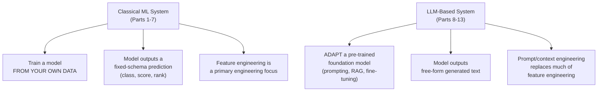

## Introduction

Parts 1-7 built a complete, from-scratch mental model of classical ML systems — the discipline that has underpinned production AI for the last decade. Starting with this chapter, the series turns to the technology that has reshaped the field over the last few years: **large language models (LLMs)** and the broader generative AI (GenAI) systems built around them. This chapter is a bridge — it doesn't teach new deep technical material yet (that begins in Chapter 37), but it establishes what genuinely changes about system design when the core "model" is an LLM, and, just as importantly, what *doesn't* change at all.

## What Carries Over Completely, Unchanged

It's worth being explicit about this, because it's easy to over-index on novelty: the vast majority of this series' foundational material applies to LLM-based systems exactly as written.

- **The interview framework (Chapter 2)**: clarify → metrics → data → model → architecture → evaluation/rollout → monitoring still structures every LLM system design answer.
- **The metric tiers (Chapter 6)**: offline, online, and business metrics, and the proxy-chain/Goodhart's Law risks, apply identically — an LLM chatbot still needs a business metric (resolved tickets, user satisfaction) that its online metrics (engagement, thumbs-up rate) and offline metrics (a benchmark score) are proxies for.
- **Data engineering (Part 2)**: data quality, validation, and privacy considerations apply just as much to a corpus of documents feeding a RAG system (Part 11) as to a labeled training set.
- **Serving fundamentals (Part 6)**: latency budgets, caching, auto-scaling, and REST/gRPC choices all still apply — LLM serving (Part 10) is a specialization of these ideas, not a replacement for them.
- **MLOps (Part 7)**: CI/CD/CT, monitoring for drift and decay, and observability remain necessary — an LLM-based feature can and does degrade in production just as a classical model can, for many of the same underlying reasons (Chapter 32's drift concepts) plus some new ones this Part will introduce.

## What Genuinely Changes

### From Training to Adaptation

Chapter 20 previewed this directly: classical ML system design (Part 4) centers on training a model on your own labeled data. LLM system design centers on **adapting an already-trained, general-purpose foundation model** — via prompting, retrieval-augmented generation (Part 11), or fine-tuning (Part 9) — to your specific task. The from-scratch training infrastructure of Part 4 (distributed training, hyperparameter search at scale) becomes largely irrelevant to most teams building LLM applications; the new center of gravity is choosing, adapting, and orchestrating a model someone else already trained.

### From Fixed-Schema Outputs to Free-Form Generation

A classical classifier outputs a probability; a ranker outputs an ordered list. An LLM outputs free-form text, generated token by token — the fifth fundamental problem type from Chapter 3, **generation**, now becomes the central case rather than one of five. This has cascading consequences: evaluation gets harder (Chapter 3's "no single correct answer" problem, addressed in depth in Chapter 61), and new failure modes emerge that have no classical-ML equivalent — most notably **hallucination**, an LLM generating fluent, confident, but factually incorrect or unsupported content, which we address throughout Part 8 and in depth in Chapter 62.

### From Feature Engineering to Context Engineering

Where classical ML systems invest heavily in feature engineering (Part 3), LLM systems invest heavily in **prompt and context engineering** — constructing the text input (instructions, examples, retrieved documents) that shapes the model's output. This is a genuinely new skill this series hasn't yet covered, introduced in Chapter 43 and developed throughout Part 11's RAG chapters.

### New Cost and Latency Dynamics

Chapter 5 established general latency budgets; LLM inference introduces a fundamentally different profile — **autoregressive generation**, where each output token depends on every previously generated token, making generation inherently sequential and often taking hundreds of milliseconds to several seconds for a full response, compared to the tens-of-milliseconds budgets typical of classical ML inference. Cost scales differently too — with tokens processed, not just requests handled — a dynamic covered fully in Part 10.

## A Preview of the New Vocabulary

This Part introduces several concepts with no classical-ML analog, each covered in its own subsequent chapter:

| New Concept | Chapter | Rough Classical-ML Analog (if any) |
|---|---|---|
| Transformer architecture | 37 | Model architecture (Chapter 20), but a specific, dominant one |
| Tokenization | 38 | Categorical encoding (Chapter 12), but for text specifically |
| Decoding strategies | 39 | None — a genuinely new concept for generation-time output construction |
| Scaling laws | 40 | None — a specific, LLM-era empirical research finding |
| Open vs. closed-source model choice | 41 | Build vs. buy (a classic software decision, newly relevant here) |
| LLM pricing | 42 | Cost/latency trade-offs (Chapter 6), now token-denominated |
| Prompt engineering | 43 | Feature engineering (Chapter 12), for a fundamentally different kind of input |

## Why This Reframing Matters for Interviews

AI System Design interviews have shifted rapidly in the last few years to include LLM-specific scenarios — designing a RAG-based support bot, an AI coding assistant, or a multi-agent research tool. A candidate who treats these as entirely foreign, requiring a completely different mental toolkit, will struggle unnecessarily. A candidate who recognizes that the same 7-step framework, the same metric discipline, and the same staged-rollout thinking from Parts 1-7 still apply — layered with the new vocabulary this Part introduces — will navigate these questions with far more confidence and structure. This is exactly the reframing this chapter is designed to establish before the deeper technical material begins.

## Key Takeaways

- Most of this series' foundational material — the interview framework, metric discipline, data engineering, serving fundamentals, and MLOps — applies to LLM-based systems without modification.
- The genuine shifts are: training becomes adaptation (prompting, RAG, fine-tuning) of a pre-trained foundation model; fixed-schema outputs become free-form generation; feature engineering becomes prompt/context engineering; and cost/latency dynamics change fundamentally due to autoregressive, token-based generation.
- New failure modes (hallucination) and new evaluation challenges (no single correct answer) emerge specifically from the shift to generation as the primary problem type.
- This Part introduces a genuinely new vocabulary (transformers, tokenization, decoding strategies, scaling laws) that has no direct classical-ML analog, building the foundation for Parts 9-13's deeper LLM/GenAI system design material.

---

## Interview Questions

**1. What are the main things that carry over unchanged from classical ML system design (Parts 1-7) to LLM-based system design?**
The 7-step interview framework (clarify, metrics, data, model, architecture, evaluation/rollout, monitoring), the three-tier metric discipline (offline/online/business) and its associated proxy-chain risks, data quality and governance principles, general serving fundamentals (latency budgets, caching, auto-scaling), and MLOps practices (CI/CD/CT, drift monitoring, observability) all apply to LLM-based systems largely as-is — these represent general systems-engineering discipline for building and operating any AI-driven system, independent of whether the specific model at the center is a classical classifier or a large language model.
*Follow-up: Why is it valuable to explicitly recognize this continuity, rather than treating LLM system design as an entirely separate discipline requiring a completely new mental framework?*
Recognizing this continuity means a candidate or engineer doesn't need to learn an entirely new problem-solving approach from scratch for LLM-based systems — they can apply the same structured thinking already built through Parts 1-7, simply adapting the specific technical content within each step (e.g., "model" now means choosing and adapting a foundation model rather than training from scratch) — this is both more efficient to learn and produces more consistent, well-structured answers than treating LLM system design as requiring an entirely separate, disconnected framework.

**2. How does the shift from "training" to "adaptation" change what a typical ML engineer spends most of their time doing when building an LLM-based feature, compared to a classical ML feature?**
For a classical ML feature, significant time is spent on data collection and labeling (Part 2), feature engineering (Part 3), and the training/hyperparameter tuning process itself (Part 4); for an LLM-based feature, a pre-trained foundation model already embeds substantial general capability, so time shifts toward selecting an appropriate base model, designing effective prompts and retrieval strategies (Part 11) to adapt that general capability to the specific task, and, only when prompting/RAG prove insufficient, applying more involved fine-tuning techniques (Part 9) — the actual "from-scratch training infrastructure" work from Part 4 becomes largely irrelevant to most teams, replaced by this adaptation-focused work instead.
*Follow-up: Does this mean the skills built in Part 4 (distributed training, hyperparameter tuning) are no longer valuable for someone working primarily on LLM-based systems?*
Not entirely irrelevant — organizations that do pre-train foundation models from scratch, or that perform substantial full fine-tuning of very large models, still directly need these skills (and Part 4's distributed training concepts specifically underpin the frameworks like DeepSpeed used for LLM fine-tuning at scale, as previewed in Chapter 18); but for the majority of engineers building LLM-based *applications* rather than training foundation models themselves, these skills become less directly, day-to-day relevant, while still providing valuable underlying intuition (e.g., understanding why fine-tuning is so much cheaper than pre-training, per Chapter 20) that informs better adaptation-strategy decisions even without hands-on distributed training work.

**3. Why does generation, as a problem type (Chapter 3), introduce evaluation challenges that classification and ranking don't have, and why does this matter more once generation becomes the central use case rather than one of several problem types?**
Generation problems typically have many valid correct answers with different phrasings, rather than a single ground-truth label or a well-defined ranking order to compare against — this was already noted as a general limitation in Chapter 3, but it mattered less when generation was just one of five problem types a system might use; once generation becomes the *primary* interaction mode for an entire class of systems (LLM-based chat, summarization, content creation), this evaluation difficulty becomes the central, unavoidable challenge for the whole system's quality assurance, rather than a secondary concern affecting only one component — motivating the extensive treatment of LLM-specific evaluation techniques (LLM-as-judge, human evaluation, faithfulness metrics) that Part 13 will cover in depth.
*Follow-up: What evaluation approach from earlier in this series comes closest to addressing this challenge, even though it wasn't originally designed with LLMs in mind?*
Human evaluation, discussed in Chapter 7 as one labeling strategy among several and referenced again in Chapter 21 for generation metrics, comes closest — since a human reviewer can assess whether a generated response is genuinely good, coherent, and helpful even without a single predefined "correct" answer to mechanically compare against, in a way that automated string-overlap metrics like BLEU/ROUGE cannot; the LLM-as-judge approach (Part 13) essentially tries to approximate and scale this human judgment capability using another LLM, precisely because pure automated, reference-based metrics prove insufficient for evaluating free-form generation at the scale and speed production systems require.

**4. What is hallucination, and why is it described as having "no classical-ML equivalent" failure mode?**
Hallucination is when an LLM generates fluent, confident-sounding, but factually incorrect or unsupported content — presenting something false as if it were true, without any inherent signal (like a low confidence score) necessarily indicating the output is unreliable. This has no direct classical-ML equivalent because a classical classifier or regressor's output is always constrained to a well-defined space (a class label, a numeric range) where "wrong" simply means an incorrect prediction within that space — there's no equivalent concept of a classifier "hallucinating" a class that doesn't exist, or a regression model inventing a plausible-sounding but fabricated numeric justification for its prediction, since these models don't generate open-ended, free-form content that could contain fabricated claims presented with unwarranted confidence.
*Follow-up: Why might a classical ML system's equivalent failure mode (e.g., a confidently wrong classification) actually be easier to detect and manage than an LLM's hallucination?*
A classical model's confidently wrong prediction is still a single, well-defined, and typically verifiable data point — you can compare it against ground truth (once available) and compute standard, well-understood metrics (Chapter 21) to detect and quantify how often and how severely this happens; an LLM's hallucination is embedded within a larger, free-form generated text, potentially mixed together with substantial genuinely correct and useful content, making it structurally harder to detect (you can't simply compare the whole generated text against a single ground-truth string) and requiring specialized techniques (faithfulness checking against source documents, LLM-as-judge evaluation) specifically developed to address this qualitatively different, harder-to-pin-down kind of error.

**5. How does the concept of "context engineering" relate to feature engineering (Chapter 12), and what's the key structural difference between them?**
Both serve a conceptually similar purpose — carefully constructing the input a model receives to maximize its ability to produce a good output — but feature engineering (Chapter 12) constructs a fixed-schema numeric vector (normalized values, encoded categories, engineered aggregates) for a classical ML model, while context engineering constructs free-form natural language text (instructions, examples, retrieved documents) for an LLM; the key structural difference is that feature engineering operates within a rigid, predefined schema that must be consistently computed the same way every time (directly connecting to Chapter 15's training-serving skew concerns), while context/prompt engineering operates in the much more flexible, unstructured space of natural language, where the "schema" is really just whatever structure and content the prompt designer chooses to include, without the same rigid, machine-enforced consistency requirements.
*Follow-up: Does the flexibility of context engineering mean the training-serving consistency concerns from Chapter 15 simply don't apply to LLM-based systems?*
Not entirely — a related consistency concern does still apply, just in a different form: if the prompt template or retrieval logic used during offline evaluation/testing of an LLM-based system differs from what's actually used in the live production serving path (e.g., a different number of retrieved documents, or a different instruction phrasing), the model effectively receives a different "effective input" in production than what was validated, which is conceptually analogous to training-serving skew even though the underlying mechanism (natural language prompt construction, not numeric feature computation) is quite different — this exact analogy was previewed in Chapter 13's discussion and will be developed further in Part 11's RAG evaluation chapters.

**6. Why does LLM inference's cost model (introduced briefly here, covered fully in Part 10) fundamentally differ from a classical ML model's inference cost model?**
A classical ML model's inference cost is typically dominated by a single, relatively fixed forward pass per request, largely independent of the specific content of that request (beyond feature vector size); an LLM's inference cost scales with the number of tokens processed — both the input tokens (the length of the prompt, including any retrieved context) and the output tokens (the length of the generated response), and because generation is autoregressive (each output token requires its own forward pass, dependent on all previous tokens), a longer generated response is proportionally more expensive and slower to produce, not just from a larger single computation but from a larger *number* of sequential computations — this token-based, generation-length-dependent cost structure has no direct equivalent in classical ML inference cost, where the computation is essentially a single, fixed-size operation regardless of the specific input or output content.
*Follow-up: How might this token-based cost model change how a team thinks about prompt design, compared to classical feature engineering where "more features" doesn't typically have this same direct, linear cost implication?*
Since every additional token in the prompt (including lengthy instructions, many few-shot examples, or a large amount of retrieved context) directly and proportionally increases the cost and latency of every single request using that prompt, prompt design for LLM systems requires an explicit, ongoing cost-consciousness that has a more direct, linear relationship to the design choice than classical feature engineering typically has (where adding another numeric feature to a fixed-size feature vector usually has a comparatively negligible marginal cost impact) — this motivates the kind of careful context/prompt length optimization and cost-benefit thinking that Part 10 and Part 11 will develop in much greater technical depth.

**7. In an interview, if asked to design "a customer support chatbot," how would you use this chapter's reframing to structure your initial approach, before diving into any LLM-specific technical details?**
I'd start exactly as Chapter 2's framework prescribes for any system — clarifying the business goal (reducing support costs, improving resolution time, or both), defining metrics across all three tiers (an offline benchmark for response quality, an online metric like ticket deflection rate or user satisfaction, and a business metric like overall support cost reduction), and understanding the data/knowledge available (what support documentation or historical tickets exist) — only then would I move into the LLM-specific "model" step, discussing whether prompting an existing foundation model, building a RAG system over the company's support documentation (Part 11), or fine-tuning (Part 9) is the appropriate adaptation strategy, explicitly applying this chapter's reframing that the overall structure of the answer remains the same as any other system design question, with the LLM-specific considerations entering as the specific content within that same, familiar structure.
*Follow-up: Why might explicitly stating this structural continuity out loud, at the start of your interview answer, be a good practice rather than simply demonstrating it implicitly through your answer's structure?*
Explicitly naming the approach ("I'll use the same structured framework I'd use for any AI system design question, since the fundamentals of scoping, metrics, and evaluation apply here just as much as to a classical ML system") signals to the interviewer, right from the start, that you understand LLM system design as an extension of general AI system design principles rather than a completely separate, disconnected skill set — this can help frame the rest of your answer favorably and proactively address a potential concern (that a candidate might treat LLM questions as requiring an entirely different, less rigorous approach) before the interviewer even needs to probe for it.

**8. How does the "model type" decomposition from Chapter 3 (classification, regression, ranking, retrieval, generation) map onto a typical modern LLM-based product, and why might a single product actually involve several of these simultaneously?**
Chapter 3 already previewed this directly using the customer support ticket example — a modern LLM-based product frequently combines several of these fundamental types: classification might route a user's query to the right handling path, retrieval fetches relevant supporting documents (Part 11's RAG systems), ranking might order multiple retrieved documents or multiple candidate generated responses by quality, and generation produces the final natural-language response itself — recognizing that "the LLM" isn't doing all the work alone, but rather sits within a larger system that likely also relies on classical ML components (classification, ranking) working alongside it, is an important corrective to the common oversimplification that an LLM-based system is "just the LLM."
*Follow-up: Why might a candidate who treats an LLM-based system design question as "just describe how the LLM would answer" be missing an opportunity to demonstrate broader system design skill?*
Focusing only on the LLM's generation capability skips over the surrounding system design work — how queries get routed, how relevant context gets retrieved and ranked, how the final output gets validated or post-processed — that this series has spent its first seven Parts establishing is usually where the majority of real engineering effort and risk actually resides (echoing Chapter 1's point that model work is typically a small fraction of total system engineering effort); an interviewer is likely to specifically probe for this broader system awareness, and a candidate who immediately and narrowly focuses only on "prompting the LLM well" without addressing the surrounding classification, retrieval, and ranking components that a real production system would need is likely to receive a less favorable evaluation than one who recognizes and addresses this fuller picture.

**9. Why might monitoring an LLM-based system in production (foreshadowing Part 13) require both the classical drift/decay concepts from Chapter 32 and genuinely new, LLM-specific monitoring concerns?**
The classical concepts still apply in modified form — the distribution of user queries (an analog of input feature drift) can shift over time, and the "correctness" of generated responses can decay if the underlying knowledge base (for a RAG system) becomes outdated relative to the real world; but LLM-specific concerns also emerge with no classical equivalent — monitoring for increasing hallucination rates, tracking token usage and cost trends (Part 10), monitoring for potential misuse like prompt injection attempts (Part 13), and tracking user satisfaction signals specific to conversational interactions (like conversation abandonment or repeated clarification requests) — meaning a complete LLM monitoring strategy needs to extend, not replace, the classical monitoring foundation from Chapter 32 with these additional, generation-specific concerns.
*Follow-up: Which of these new, LLM-specific monitoring concerns would you expect to be hardest to operationalize as an automated, continuous production monitoring signal, and why?*
Hallucination rate monitoring is likely the hardest to operationalize continuously and automatically, precisely because detecting hallucination reliably typically requires either expensive human review or a sophisticated LLM-as-judge evaluation process (Part 13) that itself has real computational cost and its own potential unreliability — unlike the classical drift metrics from Chapter 32 (PSI, ground-truth performance comparison), which can be computed cheaply and automatically at scale using well-established statistical techniques, hallucination detection doesn't yet have an equally cheap, reliable, fully-automated equivalent, making it a genuinely harder monitoring problem to operationalize continuously in production compared to the classical concepts this series has already covered.

**10. How would you explain to a colleague who's only ever worked on classical ML systems why they shouldn't expect their existing "feature store" infrastructure (Chapter 13) to directly apply to a new RAG-based LLM project?**
I'd explain that a feature store is specifically designed around structured, typically numeric or categorical feature vectors computed from tabular data sources with well-defined schemas — a RAG system's equivalent need is fundamentally different in kind, requiring a vector database (Part 11) to store and retrieve semantically-relevant text chunks based on embedding similarity search, rather than looking up a fixed-schema numeric feature vector for a specific entity ID; while some underlying infrastructure concerns are conceptually similar (both need to be fast, reliable, and consistent between however content is prepared for evaluation and how it's actually retrieved in production, echoing the training-serving consistency theme), the actual technology and data model involved are different enough that the existing feature store infrastructure wouldn't directly serve this new need without significant, fundamentally different additions.
*Follow-up: What existing infrastructure or concept from this series, if any, does transfer more directly to supporting a RAG system's retrieval needs?*
The embeddings concept from Chapter 14 transfers directly and is foundational to how RAG's retrieval mechanism actually works — RAG is, at its core, an application of the same similarity-search-over-learned-vector-representations idea introduced in Chapter 14, just applied to retrieving relevant text chunks for an LLM's context rather than finding similar users or products for a recommendation system; understanding Chapter 14's embedding and similarity-search concepts provides a much more direct conceptual foundation for understanding RAG's retrieval mechanism (Part 11) than the feature store's structured-data-focused infrastructure does, even though both are broadly "data infrastructure supporting a model."

**11. Why does this chapter argue that a strong grounding in Parts 1-7 makes learning LLM system design easier, rather than LLM system design being best approached as an entirely separate learning track?**
Because the genuinely new material in LLM system design (transformer architecture, tokenization, decoding strategies, RAG, prompt engineering) sits on top of, and depends on, exactly the surrounding system design disciplines already built in Parts 1-7 (metric design, data quality, serving architecture, MLOps) — someone learning LLM system design without this foundation would need to simultaneously learn both the LLM-specific technical concepts and the general AI system design discipline they depend on, whereas someone who has already internalized the general discipline can focus their learning effort specifically on the genuinely new LLM-specific material, applying already-familiar patterns (the interview framework, the metric tiers, the staged rollout process) to this new context rather than needing to learn everything from scratch simultaneously.
*Follow-up: What would be a risk of a candidate who has only studied LLM-specific material (prompt engineering, RAG architectures) without this broader foundation, when facing a comprehensive AI system design interview?*
Such a candidate might be able to discuss the LLM-specific mechanics fluently (how to construct a good prompt, how RAG retrieval works) but could struggle when the interview probes the surrounding system design concerns this series has spent its first seven parts building — how to properly evaluate the system's real-world business impact (Chapter 6), how to safely roll out a change to the system (Chapters 22-23), how to monitor for degradation over time (Chapter 32), or how to reason about the data quality and governance implications of the system's knowledge sources (Chapters 10-11) — potentially giving an incomplete, narrowly technical answer that misses the broader systems thinking that distinguishes a strong, senior-level system design response from a purely technically-fluent but narrower one.

**12. How would you respond if an interviewer asked you to "just skip the classical ML stuff and go straight to how you'd build this with an LLM," given a system that could reasonably be built either way?**
I'd briefly acknowledge the classical ML alternative and note the specific reason an LLM-based approach might be preferred for this particular case (e.g., "given the need for flexible, natural-language understanding of highly varied user input, an LLM-based approach is likely more suitable than training a narrow classifier from scratch, though I'd still want to validate that assumption against the specific accuracy, cost, and latency requirements") before proceeding into the LLM-specific design — this brief acknowledgment demonstrates that the choice to use an LLM is a deliberate, justified decision rather than a default, unreasoned assumption, directly applying the same "start with a baseline, justify escalation" principle from Chapter 2, just now applied to the LLM-versus-classical-ML choice itself rather than to model complexity within a single paradigm.
*Follow-up: Why might jumping straight to an LLM-based solution without this brief justification be seen as a weaker answer, even if the interviewer explicitly said to skip the classical ML discussion?*
Even when explicitly told to focus on the LLM-based approach, briefly and efficiently justifying *why* that approach fits the problem (rather than skipping straight to implementation details) demonstrates the same evidence-based, justified-complexity thinking this series has emphasized throughout — an interviewer's instruction to "skip ahead" is usually meant to save time on a well-understood alternative, not to signal that justification and reasoning should be abandoned altogether, and a candidate who takes the instruction as license to skip all reasoning and jump straight to unjustified technical specifics risks appearing to lack the underlying judgment the interviewer is actually trying to evaluate, even while technically complying with the literal instruction given.

**13. Why might scaling laws (previewed in this chapter's vocabulary table, covered fully in Chapter 40) represent a genuinely new kind of empirical finding that didn't have a strong parallel earlier in this series?**
Scaling laws are specific, empirically-derived relationships describing how LLM performance improves as a predictable, roughly power-law function of model size, dataset size, and compute budget — this kind of large-scale, systematic empirical study of "how does performance scale with these specific resources" is a distinctly LLM-era research contribution that doesn't have a direct equivalent discussed earlier in this series; while Part 4 discussed training infrastructure and hyperparameter tuning at scale, it didn't establish anything like a predictable, quantified mathematical relationship for how much performance improvement to expect from a given increase in model or data scale — this kind of predictive scaling relationship is specific to the LLM research context and directly informs decisions (covered in Chapter 40) about model size selection and training investment that have no comparably well-established quantitative analog for classical ML models.
*Follow-up: Why might understanding scaling laws be practically useful for an ML engineer who will never personally train a large foundation model from scratch?*
Even without training a foundation model directly, understanding scaling laws helps an engineer reason about and anticipate the general trend of how larger, more capable models tend to become progressively available over time (informing build-vs-buy and model-selection decisions, Chapter 41), understand roughly why a much larger model command a correspondingly higher cost and latency (Chapter 42), and have realistic expectations about the marginal returns of choosing an even larger, more expensive model for a specific application rather than a smaller, cheaper one that might already capture most of the practically relevant capability — providing useful intuition for real-world model-selection and cost-benefit decisions, even without ever personally needing to run the large-scale training experiments that originally established these scaling relationships.

**14. How would you use this chapter's carries-over/genuinely-changes framing to help a junior engineer avoid two opposite mistakes when first working on an LLM-based project?**
I'd caution against two opposite failure modes: first, assuming everything about LLM systems is completely novel and abandoning the disciplined system design practices (proper metric definition, staged rollout, ongoing monitoring) already established for classical ML systems, since these remain just as necessary and valuable for LLM-based systems; and second, assuming LLM systems can simply be treated identically to classical ML systems without any adaptation, missing the genuinely new considerations (evaluation difficulty for free-form generation, hallucination risk, token-based cost dynamics, prompt/context engineering) that this chapter has specifically highlighted as requiring new thinking — the productive path is explicitly this chapter's synthesis: carry over the general discipline, while deliberately learning and applying the genuinely new LLM-specific concepts this Part introduces on top of that existing foundation.
*Follow-up: Which of these two mistakes do you think is more common among engineers newer to the field, and why?*
The "everything is completely novel" mistake is likely more common among engineers newer to the field specifically because LLMs have received such prominent, novelty-emphasizing media and industry attention, which can create an impression that LLM system design requires entirely reinventing one's approach to AI systems from scratch — engineers with a more classical ML background risk the opposite mistake, potentially under-appreciating the genuinely new challenges LLMs introduce because their existing mental model, while generally sound, wasn't built with generation-specific evaluation difficulty or hallucination risk in mind — which is precisely why this chapter frames the material as an explicit "here's what carries over, here's what's genuinely new" synthesis rather than assuming either extreme framing is correct on its own.

**15. How would you summarize, in one or two sentences, the single most important mindset shift this chapter wants a reader to carry into the rest of Part 8?**
LLM system design is not a replacement for the AI system design discipline built across Parts 1-7, but rather an extension of it into a new technical domain — the same rigor around metrics, evaluation, staged rollout, and monitoring still applies, layered with new, LLM-specific concepts (adaptation instead of training, generation instead of fixed-schema prediction, context engineering instead of feature engineering, and token-based cost dynamics) that this Part will build out chapter by chapter, starting with the transformer architecture in Chapter 37.
*Follow-up: Why does establishing this mindset explicitly, in its own dedicated chapter, matter more for a series like this than simply beginning directly with the transformer architecture in Chapter 37?*
Starting directly with transformer architecture details without first establishing this framing risks readers absorbing the new technical material as a disconnected, separate body of knowledge rather than as an extension of the systems-thinking foundation already built — explicitly establishing the continuity and the specific points of genuine change upfront, in this dedicated chapter, primes the reader to actively connect each new concept in the coming chapters back to the relevant earlier material in this series (as this chapter's own examples have modeled throughout), producing a more integrated, retained understanding than presenting the new technical material in isolation and hoping the reader independently notices and makes these connections on their own.
