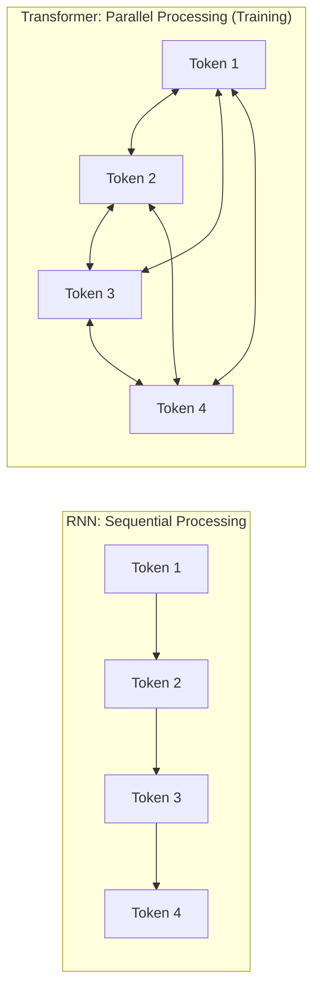
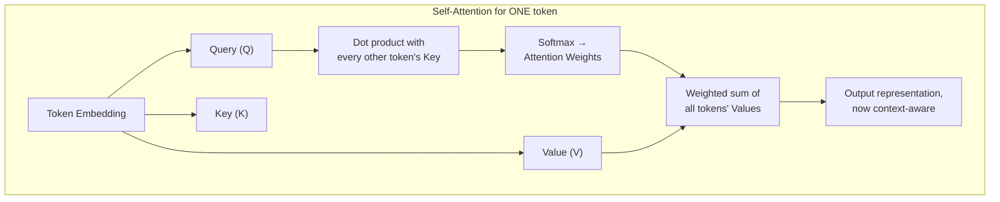
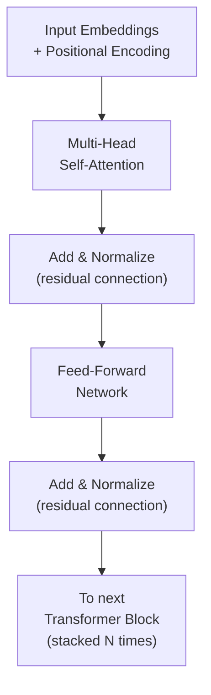
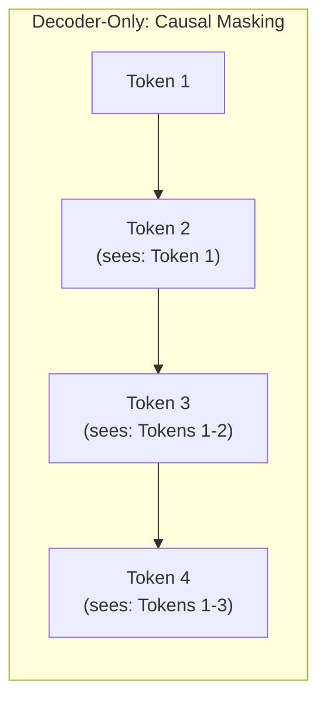

## Introduction

This chapter is deliberately scoped: it's not a deep-learning-research treatment of the transformer architecture, but a **system designer's refresher** — enough mechanical understanding of how a transformer actually works to explain, in later chapters, *why* tokenization works the way it does (Chapter 38), *why* decoding is inherently sequential (Chapter 39), *why* scaling laws take the shape they do (Chapter 40), and *why* LLM inference has the specific cost and latency structure covered in Part 10. If you can explain self-attention and why it replaced recurrence, you have exactly the depth this series needs going forward.

## Why Transformers Replaced Recurrent Architectures

Before transformers, sequence modeling (translation, language modeling) relied on **recurrent neural networks (RNNs)**, which process a sequence one token at a time, each step depending on the previous step's hidden state. This sequential dependency made RNNs slow to train (Chapter 16-18's parallelism techniques don't help much when each step of a sequence must wait for the previous one to finish) and made it hard for the model to retain information from far earlier in a long sequence.

The transformer architecture (from the 2017 paper "Attention Is All You Need") replaced this sequential recurrence with **self-attention**, which lets every position in a sequence directly attend to every other position **in parallel**, during training — a fundamental architectural shift enabling the massive parallelization that made training today's large-scale LLMs feasible in the first place, directly connecting to the data-parallel training infrastructure from Chapter 17.



## Self-Attention: The Core Mechanism

**The intuition**: for each token in a sequence, self-attention computes a weighted combination of *every other token's* representation, where the weights reflect how relevant each other token is to understanding the current one. In the sentence "the animal didn't cross the street because *it* was too tired," self-attention lets the model learn that "it" should attend strongly to "animal" — resolving the reference without needing sequential, step-by-step processing.

**The mechanics, at the level a system designer needs**: each token's embedding (Chapter 14) is projected into three vectors — **Query (Q)**, **Key (K)**, and **Value (V)**. The attention score between two tokens is computed as the dot product of one token's Query and another's Key; these scores are normalized (via softmax) into attention weights, which are then used to compute a weighted sum of all tokens' Value vectors.

```python
import numpy as np

def softmax(x: np.ndarray) -> np.ndarray:
    exp_x = np.exp(x - np.max(x, axis=-1, keepdims=True))
    return exp_x / np.sum(exp_x, axis=-1, keepdims=True)

def self_attention(X: np.ndarray, W_q: np.ndarray, W_k: np.ndarray, W_v: np.ndarray) -> np.ndarray:
    """
    X: (seq_len, embed_dim) — the input sequence of token embeddings.
    W_q, W_k, W_v: learned projection matrices (embed_dim, head_dim).

    This computes attention for ALL positions in the sequence
    SIMULTANEOUSLY — the key structural property that enables
    the parallel training discussed above.
    """
    Q = X @ W_q  # (seq_len, head_dim)
    K = X @ W_k  # (seq_len, head_dim)
    V = X @ W_v  # (seq_len, head_dim)

    head_dim = Q.shape[-1]
    scores = (Q @ K.T) / np.sqrt(head_dim)  # (seq_len, seq_len) — scaled dot-product
    attention_weights = softmax(scores)       # each row sums to 1

    output = attention_weights @ V            # (seq_len, head_dim)
    return output, attention_weights

# Example: a tiny 4-token sequence, embed_dim=8, head_dim=4
np.random.seed(42)
X = np.random.randn(4, 8)
W_q, W_k, W_v = (np.random.randn(8, 4) for _ in range(3))
output, weights = self_attention(X, W_q, W_k, W_v)

print("Attention weights (each row shows how much each token\n"
      "attends to every other token, including itself):")
print(np.round(weights, 2))
```



## Multi-Head Attention

Rather than computing a single attention pattern, transformers compute **several attention "heads" in parallel**, each with its own learned Q/K/V projections, allowing different heads to specialize in capturing different types of relationships (one head might learn syntactic relationships, another might learn coreference like the "it"/"animal" example above). The outputs of all heads are concatenated and projected back to the original dimension. This is purely an expressiveness technique — it doesn't change the fundamental parallelization story above, but it's worth knowing the term since it appears constantly in model architecture descriptions (e.g., "32 attention heads") that determine a model's parameter count and, by extension, its cost (Chapter 42).

## The Full Transformer Block



A full transformer stacks many identical blocks (this is where "number of layers" in a model's specification comes from — e.g., GPT-3-scale models have on the order of dozens to around a hundred layers), each containing a self-attention sub-layer and a feed-forward sub-layer, connected by residual connections and normalization (techniques that help gradients flow through very deep networks during training, directly relevant to the training stability discussed in Part 4).

**Why does layer count matter for a system designer?** More layers generally mean more capability, but also more parameters (Chapter 42's pricing driver) and — critically for Chapter 39's decoding discussion — more sequential computation per generated token, since data must pass through every layer for every single token generated.

## Positional Encoding: Solving Attention's Blind Spot

Self-attention, as described above, treats the input as an unordered *set* of tokens — the dot-product computation between Query and Key has no inherent notion of word order. Since word order obviously matters for language, transformers add **positional encodings** — a signal (often based on sine/cosine functions of different frequencies, or in modern models, more sophisticated techniques like rotary position embeddings) added to each token's embedding, giving the model information about each token's position in the sequence.

**Why this matters for Chapter 38's context window discussion**: positional encoding schemes have historically imposed practical or architectural limits on how long a sequence a model can meaningfully process — a major driver of the "context window" limitations covered in the next chapter, and an active area of research (techniques enabling longer effective context windows) directly relevant to RAG system design in Part 11.

## Encoder-Only, Decoder-Only, and Encoder-Decoder Architectures

- **Encoder-only** (e.g., BERT): processes an entire input sequence bidirectionally (every token can attend to every other token, including ones that come after it) — well-suited to understanding tasks like classification or embedding generation (Chapter 14), not text generation.
- **Decoder-only** (e.g., the GPT family, and most modern general-purpose LLMs): uses **masked** self-attention, where each token can only attend to itself and earlier tokens, never later ones — this causal masking is precisely what makes autoregressive, left-to-right text generation possible, and is the architecture underlying essentially all the LLM chat systems this series will discuss from here forward.
- **Encoder-decoder** (e.g., the original Transformer, T5): uses a separate encoder for the input and a decoder for the output, historically common for translation-style tasks with a distinct input and output sequence.



This causal masking property is the direct architectural reason generation must proceed token by token, sequentially — a fact we'll return to explicitly in Chapter 39's discussion of why decoding is inherently slower than a single forward pass, and in Part 10's inference optimization chapters.

## What a System Designer Needs vs. Doesn't Need to Know

For AI System Design purposes, you need: the parallel-training intuition (why transformers scale better than RNNs), the causal-masking intuition (why generation is sequential), and the parameter-count intuition (why more layers/heads/dimensions mean more cost). You generally don't need: the exact mathematical derivation of backpropagation through attention, the specific formula for every positional encoding variant, or implementation-level optimization details of attention computation — those belong to ML research and specialized inference-engineering roles, not general AI system design.

## Key Takeaways

- Transformers replaced recurrent architectures because self-attention allows all positions in a sequence to be processed in parallel during training, enabling the massive scale that makes modern LLMs feasible.
- Self-attention computes, for each token, a weighted combination of every other token's representation, using learned Query/Key/Value projections and a softmax-normalized dot-product score.
- Decoder-only architectures with causal masking (each token only attends to itself and earlier tokens) are the dominant architecture for modern LLMs, and this masking is the direct architectural reason text generation must proceed sequentially, token by token.
- Positional encoding, layer count, and attention head count are the architectural details most relevant to a system designer, since they directly explain context window limitations (Chapter 38) and cost/parameter-count relationships (Chapter 42).

---

## Interview Questions

**1. Why did the transformer architecture largely replace recurrent neural networks (RNNs) for language modeling, and what specific property of self-attention enabled this?**
RNNs process a sequence one step at a time, with each step depending on the completion of the previous step's computation, making them inherently sequential and difficult to parallelize during training; self-attention computes relationships between all positions in a sequence simultaneously, in parallel, removing this sequential dependency during training and enabling the kind of massive, parallelized training (across many GPUs, using the data parallelism techniques from Chapter 17) that made training today's very large language models computationally feasible within a practical timeframe, which would have been far more difficult with an inherently sequential RNN architecture.
*Follow-up: Given that self-attention enables parallel processing during training, why does Chapter 39 argue that text generation with a transformer is still fundamentally sequential?*
The parallelization advantage applies specifically to *training*, where the entire target sequence is already known and available, allowing the model to compute attention across the whole sequence at once; during *generation* (inference), the model doesn't yet know what token comes next — it must generate one token, then use that generated token as input to determine the next one, and so on — this fundamentally sequential, one-token-at-a-time generation process (dictated by the causal masking discussed in this chapter) is unrelated to and unaffected by the parallelizability of the training process, which is why generation remains inherently sequential even though training benefits from massive parallelization.

**2. Explain, at a conceptual level, what the Query, Key, and Value vectors represent in self-attention, using an analogy if helpful.**
A useful analogy: think of the Query as "what information am I looking for from this specific token's perspective," the Key as "what information do I have to offer, from every other token's perspective," and the Value as "the actual content I'd contribute if selected as relevant" — the attention mechanism computes a compatibility score between one token's Query and every other token's Key (essentially, "how relevant is this other token to what I'm looking for"), and uses these scores to compute a weighted average of all the Values, effectively letting each token "gather" a customized, relevance-weighted summary of information from the rest of the sequence.
*Follow-up: Why are Query, Key, and Value computed as three SEPARATE learned projections of the same input embedding, rather than using the same vector for all three roles?*
Using three separate, independently-learned projection matrices gives the model the flexibility to learn different, specialized representations for each of these three distinct roles — what a token is "looking for" (Query), what a token "offers" to others as a potential match (Key), and what actual content a token "contributes" if selected as relevant (Value) can genuinely benefit from being different vector representations optimized for their specific role in this computation, rather than being forced to use a single, undifferentiated representation for all three purposes, which would limit the model's ability to learn these functionally distinct relationships as effectively.

**3. Why is causal masking essential specifically for decoder-only architectures used in text generation, and what would go wrong without it?**
Causal masking ensures that when computing the representation for a given token position during training, the model can only attend to that position and earlier ones, never later ones — this exactly mirrors the real constraint during actual generation, where the model genuinely cannot see future tokens it hasn't generated yet; without causal masking, a model trained to predict the next token would have "cheated" during training by directly attending to and seeing the very token it was supposed to be predicting (since, during training, the full target sequence is available to attend over), learning a task that doesn't match the real generation-time constraint at all, and would then perform very differently (and far worse) at actual inference time when that future information genuinely isn't available.
*Follow-up: How does this relate to the training-serving skew concept from Chapter 15, even though it's a fundamentally different kind of mechanism?*
There's a loose but instructive conceptual parallel — training-serving skew (Chapter 15) is about a model being trained on data or features that don't accurately reflect what's genuinely available at real serving/prediction time, causing a mismatch between training-time and serving-time conditions; training a decoder without causal masking would create an analogous mismatch — the model would be trained under an artificially easier condition (seeing future tokens) than the real generation-time condition (only seeing past tokens), producing a model poorly calibrated to the task it will actually need to perform — both cases share the underlying lesson that a model must be trained under conditions that faithfully match its real deployment-time constraints, even though the specific mechanisms (feature computation consistency vs. attention masking) are entirely different.

**4. What is multi-head attention, and why might a transformer use several attention heads rather than one larger, single attention mechanism?**
Multi-head attention computes several independent attention computations in parallel, each with its own learned Query/Key/Value projections (typically each operating on a smaller sub-dimension than the full embedding), with the results concatenated and projected back to the model's full dimension — using several smaller, independent heads rather than one larger attention mechanism gives the model the capacity to learn multiple, different types of relationships simultaneously (for example, one head might specialize in capturing short-range syntactic relationships, while another captures longer-range semantic or coreference relationships), providing more overall representational flexibility and expressiveness than forcing all of this relational information to be captured through a single, undifferentiated attention pattern.
*Follow-up: Why does increasing the number of attention heads (holding total model dimension constant) directly relate to the model's parameter count and, by extension, its cost, as discussed in Chapter 42?*
More attention heads, and more layers stacking these attention mechanisms, directly means more learned parameters (the Q/K/V projection matrices for each head, and the additional feed-forward network parameters within each transformer block) — since a model's total parameter count is one of the primary drivers of both its training cost (Part 4's distributed training discussion) and its inference cost and latency (Part 10, and previewed in Chapter 42's pricing discussion), the architectural choices of how many heads and layers to use are directly, quantifiably connected to the model's ultimate cost profile, making these architecture decisions a genuine cost-engineering lever, not just a pure modeling-quality consideration.

**5. Why do transformers need explicit positional encoding, when a mechanism like an RNN inherently processes tokens in order without needing this extra step?**
Self-attention, as a mechanism, computes relationships based purely on the content of Query/Key/Value vectors derived from each token's embedding — mathematically, if you shuffled the order of the input tokens, the raw self-attention computation (absent any positional information) would produce the same set of pairwise relationships, just reordered, since the dot-product computation itself has no inherent sense of sequence position; an RNN, by contrast, inherently processes tokens one at a time in a fixed sequential order, so positional information is implicitly built into its very architecture through the order of processing itself — since transformers deliberately gave up this inherent sequential processing (specifically to enable the parallelization benefits discussed earlier), they need to explicitly reintroduce positional information through a separate mechanism (positional encoding) added to each token's embedding, compensating for what was lost by moving away from inherently-ordered, sequential processing.
*Follow-up: How does the specific positional encoding scheme a model uses relate to the context window limitations discussed in Chapter 38?*
Certain positional encoding schemes (particularly some earlier, simpler approaches) were designed and effectively validated only for sequences up to a certain length seen during training, and could behave unpredictably or degrade in quality when applied to much longer sequences than the model was trained on — this historically imposed a practical ceiling on usable context window length tied directly to the specific positional encoding approach used; more recent positional encoding techniques (like rotary position embeddings, used in many modern LLMs) are specifically designed to generalize better to longer sequences than seen during training, which is one of several technical factors (alongside computational and memory costs, covered in Part 10) that have enabled the progressively longer context windows seen in more recent LLM generations, directly connecting this chapter's architectural detail to Chapter 38's practical context-window discussion.

**6. What's the difference between an encoder-only, decoder-only, and encoder-decoder transformer architecture, and why has the decoder-only architecture become dominant for general-purpose LLMs?**
Encoder-only architectures (like BERT) process the full input bidirectionally, with every token able to attend to every other token including later ones, making them well-suited to understanding/representation tasks (classification, embeddings) but not natively suited to generating new text; decoder-only architectures (like the GPT family) use causal masking, restricting each token to only attend to itself and earlier tokens, which directly enables the token-by-token, left-to-right generation process central to modern chat and completion-style LLMs; encoder-decoder architectures use a separate encoder to process the input and a separate decoder to generate the output, historically well-suited to tasks with a clearly distinct input and output sequence (like machine translation). Decoder-only architectures have become dominant for general-purpose LLMs specifically because a huge range of real-world tasks (question-answering, summarization, chat, code generation) can all be reasonably framed as "given some input text as a prompt, generate an appropriate continuation," which decoder-only, causally-masked generation is naturally and flexibly suited to handle within one unified architecture, rather than needing task-specific encoder-decoder setups.
*Follow-up: Why might an encoder-only model still be the better architectural choice for a specific sub-task within a larger LLM-based system, even in an era dominated by decoder-only general-purpose LLMs?*
For a sub-task that's purely about understanding or representing text — rather than generating new text — such as producing embeddings for a RAG system's retrieval component (Part 11), an encoder-only model (or an encoder-style embedding model specifically trained for this purpose) can be more computationally efficient and often more accurate for the specific representation-learning task at hand, since it's purpose-built for bidirectional understanding rather than carrying the additional architectural machinery (and cost) needed to support causal, autoregressive generation that isn't actually needed for a pure embedding/retrieval use case — this is precisely why RAG systems typically use a separate, specialized embedding model (often encoder-based) for the retrieval step, distinct from the decoder-only LLM used for the final generation step, a distinction we'll examine closely in Part 11.

**7. Why does the number of transformer layers in a model directly affect both its capability and its generation latency, and how are these two effects related?**
More layers generally allow a model to learn more complex, hierarchical representations and relationships within the data (similar in spirit to how deeper neural networks in general can capture more complex functions, echoing general deep learning principles), which tends to improve the model's overall capability and quality of output; however, since data must pass sequentially through every single layer for every single token that's generated (and, per the causal masking discussion, generation itself proceeds one token at a time), more layers directly and proportionally increase the computational work required to generate each individual token, meaning a model with more layers is generally both more capable and slower/more expensive per generated token — these two effects are directly related because they stem from the same underlying architectural choice (layer count), representing a genuine capability-versus-latency/cost trade-off rather than being independent design levers.
*Follow-up: How does this trade-off connect to the model compression techniques (quantization, pruning, distillation) covered in Chapter 28?*
This exact capability-versus-cost trade-off is precisely what motivates applying Chapter 28's compression techniques to LLMs specifically — since a larger, more-layered model's improved capability comes at a direct, quantifiable cost in generation latency and serving expense, techniques like distillation (training a smaller, fewer-layer "student" model to mimic a larger "teacher" model's behavior) or quantization (reducing the numerical precision of each layer's computations without necessarily reducing the layer count itself) become directly relevant tools for finding a better point on this same fundamental trade-off curve — using fewer layers or lower-precision computation per layer to reduce the "cost per token generated" side of the trade-off while trying to preserve as much of the larger model's capability as the specific compression technique allows, exactly the same underlying motivation discussed in Chapter 28, just now applied specifically in the context of a decoder-only LLM's specific architecture.

**8. Why is it argued that a system designer doesn't need to know the exact mathematical derivation of backpropagation through attention, but does need to understand the causal-masking intuition?**
The exact mathematical derivation of backpropagation is a matter of how the model's parameters are actually updated during training — an important concern for ML researchers and framework developers building and debugging training infrastructure (Part 4), but it doesn't change any system-design-relevant decision about how to build, serve, evaluate, or operate a system using an already-trained model; the causal-masking intuition, by contrast, directly explains a system-design-relevant fact with real, practical consequences — specifically, why generation must proceed sequentially, token by token, which directly shapes latency expectations (Chapter 5, Part 10), streaming response design (previewed in Chapter 5, developed further in Part 10), and cost structure (Chapter 42) — making it directly actionable, decision-relevant knowledge for a system designer in a way that the backpropagation mathematics simply isn't.
*Follow-up: How would you decide, in general, which technical details of an underlying technology are "system-design-relevant" versus purely of research/implementation interest, when learning a new area?*
I'd ask whether a specific technical detail directly and materially changes a decision a system designer would actually need to make — does understanding it change how I'd estimate latency or cost, how I'd design an evaluation strategy, how I'd reason about a specific failure mode, or how I'd communicate a trade-off to a stakeholder — if a detail's only relevance is to how the underlying technology is itself built, trained, or mathematically optimized (rather than how it's used, deployed, and operated as a component within a larger system), it generally falls outside the system-design-relevant scope, even if it's a genuinely important and interesting detail for someone in a more research-or-implementation-focused role; this same "does it change a system design decision" filter is a useful general heuristic for scoping how deep to go into any new underlying technology's technical details when specifically preparing for AI system design contexts.

**9. In an interview, if asked "why can't you just make the context window infinitely long by using a more powerful model," how would you use this chapter's concepts to answer?**
I'd explain that context window length isn't purely a matter of "more powerful" model capability in the sense of more parameters or layers — it's constrained by the computational cost of self-attention itself, which (as computed via the Query-Key dot product across every pair of tokens in the sequence) scales quadratically with sequence length, meaning doubling the context length roughly quadruples the computational cost of the attention mechanism specifically; additionally, positional encoding schemes have historically had practical limits on how well they generalize to sequence lengths much longer than what the model was trained on, as discussed in this chapter — together, these mean that arbitrarily extending context length isn't simply a matter of using a "bigger" model, but runs into genuine computational cost scaling and architectural generalization challenges that require specific research and engineering solutions (some of which we'll touch on in Chapter 38) to address, rather than being solved automatically by general increases in model scale.
*Follow-up: Why is understanding this quadratic scaling specifically useful for reasoning about the cost trade-offs of RAG system design (Part 11), which often involves stuffing large amounts of retrieved context into a prompt?*
Since a RAG system's core mechanism involves retrieving and including potentially large amounts of external document content directly into the LLM's context window (Part 11), understanding that attention computation cost scales quadratically with total context length (input prompt plus retrieved content) directly informs a crucial design trade-off — retrieving and including more context to potentially improve answer quality directly and disproportionately (quadratically, not just linearly) increases the computational cost and latency of processing that context, motivating techniques covered in Part 11 (like careful chunking and re-ranking to include only the most relevant context, rather than naively maximizing the amount of retrieved content) specifically to manage this quadratic cost relationship rather than assuming "more context is simply better" without this underlying cost consideration.

**10. How would you explain, to someone with a classical ML background but no transformer experience, why "attention" is a meaningfully different mechanism than the feature engineering and model architectures covered in Parts 3-4 of this series?**
I'd explain that classical ML feature engineering (Chapter 12) involves a human explicitly designing and computing specific numeric summaries (aggregates, encodings, interactions) that the engineer believes will be predictive, with the model then learning weights over this human-designed feature set; self-attention, by contrast, is a *learned* mechanism for the model to itself decide, dynamically and automatically for each specific input, which parts of the input are relevant to understanding which other parts — rather than a human pre-specifying which relationships or interactions matter (as in Chapter 12's manual feature-crossing example), the attention mechanism learns this relevance-weighting directly from data during training, representing a shift from human-engineered relational structure to model-learned relational structure, which is part of why transformers have proven so effective at capturing complex, hard-to-manually-specify relationships in language (and other sequential/relational data) compared to more manually feature-engineered classical approaches.
*Follow-up: Does this mean attention makes feature engineering entirely obsolete, even for LLM-based systems?*
Not entirely — as discussed in Chapter 36, feature engineering's LLM-era analog, prompt/context engineering, still involves meaningful human design decisions (what instructions to include, what examples to provide, what context to retrieve and how to format it) that shape what information the model has available to reason over and attend to in the first place; attention itself automates the *relational reasoning* over whatever input is provided, but doesn't automate the decision of *what input to provide* in the first place — meaning thoughtful context construction (Chapter 43 and Part 11) remains a genuinely important human-engineering task, even though the specific mechanism of relating different pieces of that input to each other is now handled by the model's learned attention mechanism rather than manual feature crosses.

**11. Why might understanding the transformer architecture help you reason about why fine-tuning (Chapter 20, and Part 9's deeper treatment) a large pre-trained LLM is generally more efficient than training one from scratch?**
A pre-trained transformer has already learned, through its self-attention weights and feed-forward layers across many layers, a rich set of general-purpose relational and linguistic patterns from a massive amount of training data — fine-tuning doesn't need to relearn these general patterns from scratch, it only needs to adjust the existing learned weights (or, with parameter-efficient techniques like LoRA previewed in Chapter 20, add a small number of new parameters) to specialize this already-substantial general capability toward a specific task or domain, which is a much smaller adjustment than learning the entire architecture's parameters from random initialization — this is the same general transfer-learning principle from Chapter 20, but understanding specifically *what* is being reused (the learned attention patterns and representations across all those transformer layers) makes the efficiency argument more concrete and mechanistically grounded rather than purely abstract.
*Follow-up: How does the catastrophic forgetting concern from Chapter 20 relate specifically to which parts of a transformer's learned attention patterns might be most at risk during aggressive full fine-tuning?*
Aggressive full fine-tuning updates every layer's weights, including the earlier layers that likely encode more general, broadly-reusable linguistic and relational patterns (analogous to how earlier layers in a vision model tend to encode more general, reusable features like edges and textures, as discussed in Chapter 20's partial fine-tuning section) — if fine-tuning on a narrow task pulls these earlier, more general attention patterns too strongly toward the narrow task's specific patterns, the model risks losing some of the broader relational understanding that gave the original pre-trained model much of its general capability, which is exactly the mechanistic, transformer-specific version of the catastrophic forgetting risk discussed more generally in Chapter 20, and directly motivates the strong preference for parameter-efficient fine-tuning techniques (which leave the original attention weights entirely untouched) in the LLM context specifically, a topic developed fully in Chapter 45.

**12. How would you use the "encoder-only vs. decoder-only" distinction from this chapter to explain, at a system design level, why a RAG system typically uses two different models rather than one?**
A RAG system (Part 11) needs two functionally distinct capabilities: first, converting a query and candidate documents into embeddings for similarity-based retrieval (a representation/understanding task, well-suited to an encoder-style model optimized for producing high-quality bidirectional representations), and second, generating a final, coherent natural-language answer given the retrieved context (a generation task, requiring a decoder-only model with causal masking) — since these are architecturally and functionally distinct tasks best served by architecturally distinct model types (as this chapter established), it's natural and typically more efficient for a RAG system to use a specialized embedding model (often encoder-based) for the retrieval step and a separate, general-purpose decoder-only LLM for the final generation step, rather than trying to force a single model architecture to optimally handle both fundamentally different tasks.
*Follow-up: Would it be architecturally possible, even if not typically optimal, to use a single decoder-only LLM for both the embedding/retrieval step and the generation step in a RAG system?*
Yes, it's technically possible — a decoder-only LLM can produce usable embeddings (for example, by taking some internal representation of the input text, like the final hidden state), and some systems do use a single, unified LLM this way for simplicity — but this is often not the *optimal* choice specifically for the retrieval step, since encoder-style models trained specifically for bidirectional representation and similarity tasks (via contrastive learning objectives, as discussed in Chapter 14) frequently produce higher-quality embeddings for retrieval purposes than repurposing a decoder-only model's internal representations, which weren't specifically optimized for this embedding/similarity-search use case — illustrating a common system design trade-off between architectural simplicity (one model doing everything) and specialized performance (purpose-built models for each distinct sub-task), a trade-off we'll examine more concretely in Part 11's RAG architecture chapters.

**13. Why might understanding self-attention's quadratic computational scaling with sequence length be relevant to a discussion of LLM inference cost optimization techniques covered in Part 10?**
Since self-attention's computational cost scales quadratically with the total sequence length being processed (both the initial prompt and, for each newly generated token, the growing sequence of already-generated tokens that must be attended over), naive implementations become increasingly expensive as either the prompt or the generated response grows longer — this directly motivates several of the inference optimization techniques covered in Part 10, such as KV (key-value) caching, which avoids recomputing the Key and Value vectors for already-processed tokens on every single new token generation step, specifically addressing the computational cost implications of this chapter's quadratic-scaling self-attention mechanism rather than being an arbitrary, unrelated optimization technique.
*Follow-up: Without going into KV caching's full technical detail (reserved for Part 10), why does understanding the Key/Value concept from this chapter's self-attention explanation make KV caching's basic intuition easier to grasp later?*
Since this chapter established that self-attention computes Key and Value vectors for every token in the sequence, and that these Key/Value vectors for already-processed, earlier tokens don't change as new tokens are subsequently generated (a token's own Key/Value representation is a function of itself and doesn't depend on what comes after it, given causal masking), it becomes intuitive that these Key/Value vectors can be computed once and reused ("cached") for each already-processed token, rather than wastefully recomputing them from scratch at every single subsequent generation step — having already built this Query/Key/Value mental model in this chapter makes grasping the specific optimization technique of caching these already-computed Key/Value vectors (KV caching) a much smaller, more intuitive conceptual leap when it's covered in full technical detail in Part 10, rather than requiring the reader to learn the Query/Key/Value concept and the caching optimization simultaneously from scratch at that later point.

**14. How would you respond if an interviewer asked you to explain transformers "without using the words attention, query, key, or value" — what would this reveal about your understanding versus rote memorization?**
I'd describe the core idea in plain terms: for each word in a sentence, the model looks at every other word in that same sentence and learns how much "weight" or "relevance" to give each of those other words when building an updated, context-aware understanding of the word in question — rather than processing the sentence strictly left-to-right one word at a time, the model can consider relationships between any two words directly and simultaneously, regardless of how far apart they are in the sentence, which is what allows it to resolve things like a pronoun correctly referring back to a noun mentioned much earlier, and this "look at everything at once and weigh relevance" computation can be done for the entire sentence in parallel, rather than needing to wait for each word to be processed in sequence one after another — being able to reformulate the mechanism in plain language like this, without leaning on the standard jargon, demonstrates genuine conceptual understanding rather than memorized terminology that might not reflect real comprehension of the underlying mechanism.
*Follow-up: Why might an interviewer specifically ask a candidate to explain a technical concept without using its standard jargon terms?*
This is a common and effective technique interviewers use to distinguish candidates who have genuinely internalized a concept's underlying mechanism and intuition from those who have memorized the standard vocabulary and explanations (perhaps from a course or article) without fully internalizing what those terms actually mean or how the pieces genuinely fit together — a candidate with only surface-level, memorized familiarity typically struggles significantly when forced to explain the same idea using different words, since they lack the flexible, deeply-understood mental model needed to reformulate the explanation on the spot, while a candidate with genuine understanding can usually explain the same underlying concept in several different ways without much difficulty, since their understanding isn't tied to one specific, memorized phrasing or set of terms.

**15. How would you summarize, for someone about to move on to Chapter 38's tokenization discussion, why this chapter's transformer architecture material is a necessary prerequisite rather than an optional deep-dive?**
Chapter 38's discussion of tokenization and context windows depends directly on concepts established here — understanding *why* context windows have practical length limits requires understanding self-attention's quadratic computational scaling and positional encoding's generalization limits (both covered in this chapter), and understanding how tokens actually flow through and get processed by the model requires the basic mental model of embeddings feeding into attention layers established here; without this chapter's foundation, Chapter 38's discussion of context window trade-offs would feel like an arbitrary, unexplained technical limitation rather than a direct, well-motivated consequence of the architecture covered here, which is exactly why this chapter deliberately precedes it in this Part's chapter sequence.
*Follow-up: What specific concept from this chapter would you tell a reader to make sure they've genuinely internalized before proceeding to Chapter 38, if they only had time to focus on one?*
I'd emphasize genuinely internalizing the causal-masking and sequential-generation concept above all else — understanding that a decoder-only LLM generates text one token at a time, with each new token's generation requiring a full pass through the model's attention layers over the entire sequence generated so far, is the single most consequential piece of mechanical understanding for reasoning correctly about nearly everything covered in the rest of Part 8 and Part 10 (tokenization's role in this sequential process, decoding strategies' operation on this token-by-token process, and the cost/latency implications of this sequential process) — if a reader only deeply internalizes one concept from this chapter before moving on, this is the one with the broadest, most direct downstream relevance to the rest of the material.
