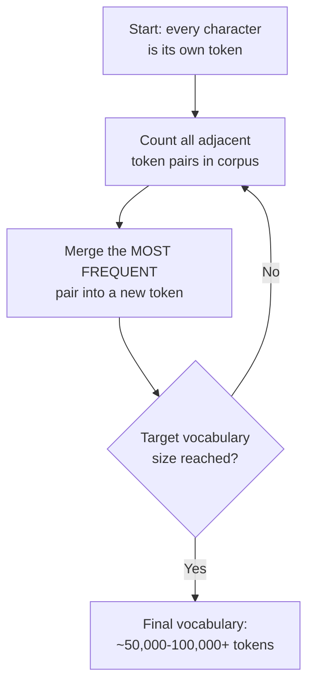
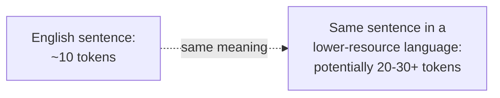
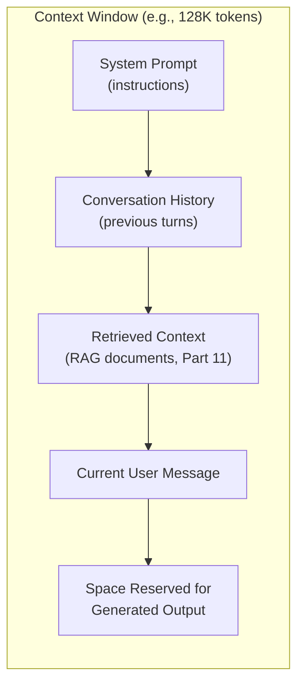

## Introduction

Every LLM system design decision this series will cover from here forward — cost (Chapter 42), RAG chunking (Part 11), agent memory (Part 12) — is denominated in a single unit: the **token**. This chapter covers what a token actually is, how tokenization works, and why the resulting context window limit is one of the most consequential, constantly-revisited constraints in LLM system design.

## What Is a Token?

A token is the atomic unit an LLM actually processes — but, importantly, **it is not the same as a word**. Modern LLMs use **subword tokenization**, splitting text into a vocabulary of common word pieces, whole words, and characters, chosen to balance vocabulary size against sequence length.

```python
# Illustrative use of tiktoken (OpenAI's tokenizer library) to show
# how subword tokenization actually splits real text.

import tiktoken

encoding = tiktoken.get_encoding("cl100k_base")  # used by GPT-4-class models

text = "Tokenization isn't the same as splitting on whitespace."
tokens = encoding.encode(text)

print(f"Character count: {len(text)}")
print(f"Token count: {len(tokens)}")
print(f"Tokens: {[encoding.decode([t]) for t in tokens]}")

# Output (approximate — exact token boundaries depend on the specific
# tokenizer/vocabulary):
# Character count: 57
# Token count: ~13
# Tokens: ['Token', 'ization', " isn't", ' the', ' same', ' as', ' splitting',
#          ' on', ' white', 'space', '.']
```

Notice "Tokenization" splits into `Token` + `ization`, and "whitespace" splits into `white` + `space` — the tokenizer has learned that these sub-pieces are common enough across its training corpus to warrant their own vocabulary entries, while the full words themselves aren't common enough to merit a single dedicated token.

## Byte-Pair Encoding (BPE): How the Vocabulary Is Built

Most modern LLM tokenizers use **Byte-Pair Encoding** or a close variant — an algorithm that starts with individual characters and iteratively merges the most frequently co-occurring pairs into new, single vocabulary tokens, repeating until a target vocabulary size is reached.



```python
# A simplified illustration of the BPE merging process on a tiny
# toy corpus — real tokenizer training operates on billions of
# characters, but the core algorithm is exactly this.

from collections import Counter

def get_pair_counts(corpus: list[list[str]]) -> Counter:
    pairs = Counter()
    for word in corpus:
        for i in range(len(word) - 1):
            pairs[(word[i], word[i + 1])] += 1
    return pairs

def merge_pair(corpus: list[list[str]], pair: tuple[str, str]) -> list[list[str]]:
    merged_token = pair[0] + pair[1]
    new_corpus = []
    for word in corpus:
        new_word, i = [], 0
        while i < len(word):
            if i < len(word) - 1 and (word[i], word[i + 1]) == pair:
                new_word.append(merged_token)
                i += 2
            else:
                new_word.append(word[i])
                i += 1
        new_corpus.append(new_word)
    return new_corpus

# Toy corpus: character-level start
corpus = [list("low"), list("lower"), list("lowest"), list("newer")]
for step in range(3):
    pairs = get_pair_counts(corpus)
    best_pair = pairs.most_common(1)[0][0]
    print(f"Step {step + 1}: merging {best_pair}")
    corpus = merge_pair(corpus, best_pair)
print("Final tokenized corpus:", corpus)
```

Why does this matter for a system designer? The vocabulary a model was trained with is **fixed at training time** — this is why swapping tokenizers between different model families isn't possible, and why token counts (and therefore costs, per Chapter 42) can differ meaningfully between models even for the exact same input text.

## The Multilingual Fairness Problem

BPE vocabularies are built from a training corpus, and most large-scale LLM training corpora are disproportionately English-dominant. This has a direct, measurable consequence: **the same sentence, expressed in a lower-resource language, often requires significantly more tokens than its English equivalent**, because the tokenizer's vocabulary contains far fewer efficient, common subword units for that language.



**Why this is a genuine system design and equity concern, not just a curiosity**: since LLM API pricing (Chapter 42) is per-token, and context windows are token-limited, users writing in lower-resource languages can face both **higher costs** and **less effective context window capacity** for functionally equivalent content — a real fairness dimension (echoing Chapter 25's broader fairness discussion, now manifesting through a purely infrastructural mechanism rather than a biased training label) that a system serving a global user base should account for when estimating costs and context budgets.

## The Context Window: Definition and Consequence

The **context window** is the maximum number of tokens (input plus output combined, for most model APIs) a model can process in a single request — directly bounded, per Chapter 37, by the computational cost of self-attention (which scales quadratically with sequence length) and the positional encoding scheme's practical generalization limits.



Every one of these five components competes for the **same fixed budget**. This single fact drives a huge share of practical LLM system design decisions this series will return to repeatedly:

- **Conversation history management** (Part 12): a long-running chat conversation will eventually exceed the context window, forcing a decision about what to truncate, summarize, or discard.
- **RAG chunk selection** (Part 11): retrieving "more context" isn't free — it directly displaces budget available for conversation history and output length, and (per Chapter 37) increases cost and latency.
- **System prompt length** (Chapter 43): a long, detailed system prompt with many instructions and few-shot examples consumes budget on *every single request*, even before the user's actual message is considered.

## Estimating Token Counts: A Practical Skill

Because system design decisions (cost estimates, context budget planning) depend on token counts, a working rule of thumb is essential, even before reaching for an exact tokenizer library:

```python
def estimate_tokens(text: str) -> int:
    """
    A widely-used rough heuristic for English text: approximately
    4 characters per token, or approximately 0.75 tokens per word.
    Useful for back-of-envelope system design estimates; always
    verify with the actual tokenizer (e.g., tiktoken) before making
    a precise cost or capacity commitment.
    """
    return len(text) // 4

sample_document = "..." * 2000  # a hypothetical long support document
print(f"Rough token estimate: {estimate_tokens(sample_document)}")
```

This "~4 characters per token" heuristic is specific to English and to BPE-style tokenizers broadly similar to those used by GPT-class models — as the multilingual discussion above establishes, this ratio can be dramatically worse for other languages, and a system serving multilingual traffic should validate this assumption with the actual target tokenizer rather than assuming the English heuristic transfers.

## Handling Context Window Overflow: A Preview

When content genuinely exceeds the available context window, a system has several strategies, each covered in depth in later Parts:

- **Truncation**: simply drop the oldest or least relevant content — simple, but risks losing important information (Part 12's agent memory chapters cover smarter approaches).
- **Summarization**: compress older conversation history into a shorter summary before it's dropped from the raw window — preserves gist at the cost of detail and an additional LLM call's cost/latency.
- **Retrieval-based selection** (Part 11's core mechanism): rather than trying to fit everything into context, retrieve only the most relevant subset of a much larger corpus for the current specific query.

## Key Takeaways

- A token is a subword unit, not a word — modern LLMs use Byte-Pair Encoding to build a fixed vocabulary balancing vocabulary size against sequence length, learned once at training time and unchangeable afterward.
- Tokenization efficiency varies significantly by language, since BPE vocabularies are built from a training corpus that's typically English-dominant — creating real cost and context-budget disparities for non-English users.
- The context window is a single, fixed token budget shared by the system prompt, conversation history, retrieved context, the current message, and the output — nearly every LLM system design decision involves allocating this shared, scarce resource.
- Context window limits stem directly from the quadratic cost of self-attention and positional encoding constraints established in Chapter 37, not an arbitrary business decision — informing realistic expectations about how these limits evolve over time.

---

## Interview Questions

**1. Why do LLMs use subword tokenization rather than simply splitting text into whole words?**
Whole-word tokenization would require a vocabulary large enough to cover every possible word form in every language the model needs to handle, including rare words, technical terms, misspellings, and words never seen during training — this would either require an impractically massive vocabulary or force the model to treat any unseen word as a single "unknown" token, losing all information about it; subword tokenization solves this by breaking words into common, reusable pieces, so even a word never seen during training can typically be represented as a combination of familiar subword pieces (or, in the worst case, individual characters), giving the tokenizer robust coverage of arbitrary text with a much smaller, more manageable vocabulary size than whole-word tokenization would require.
*Follow-up: What's the trade-off of using a larger subword vocabulary (more distinct tokens, each representing longer, more specific pieces of text) versus a smaller one?*
A larger vocabulary allows more common words and phrases to be represented as a single token (producing shorter token sequences for a given piece of text, which reduces cost and makes more efficient use of the context window), but requires more parameters in the model's embedding and output layers to represent this larger vocabulary, and can be less robust to rare or unseen word forms not well-covered by the vocabulary; a smaller vocabulary requires fewer such parameters and can more flexibly decompose unusual words into smaller, common pieces, but produces longer token sequences for typical text (since more tokens are needed to represent the same content), directly increasing cost and consuming more of the context window budget for the same underlying text.

**2. Why can't a tokenizer trained for one model family be swapped for a different model's tokenizer, or updated after training?**
A model's embedding layer and output (next-token prediction) layer are directly tied to the specific, fixed vocabulary the tokenizer produces — each vocabulary entry corresponds to a specific learned embedding vector and a specific position in the model's output probability distribution, both learned jointly with the rest of the model's parameters during training; swapping in a different tokenizer with a different vocabulary (different tokens, different vocabulary size, different token IDs) would produce token sequences and IDs that have no meaningful correspondence to what the model actually learned, making the model's existing weights essentially meaningless for interpreting this differently-tokenized input — the tokenizer and the model are trained together as a matched, inseparable pair, not independently interchangeable components.
*Follow-up: What practical implication does this have for a team building a system that might need to switch between different LLM providers or model families?*
Switching model providers or families means the system needs to account for potentially different token counts for the exact same input text (since different tokenizers segment text differently), which directly affects cost estimates (Chapter 42) and context window budget calculations (this chapter) that were calibrated for the previous model's specific tokenizer — a team building a system with this kind of provider flexibility in mind should design their cost-estimation and context-budget-management logic to dynamically query or account for the actual, currently-in-use model's specific tokenizer behavior, rather than hardcoding assumptions (like a fixed character-to-token ratio) calibrated only for one specific model family's tokenizer.

**3. Explain the "multilingual fairness problem" in tokenization, and why it represents a genuine equity concern rather than just a technical curiosity.**
Because BPE vocabularies are built by finding the most frequent subword patterns in a training corpus, and most large-scale LLM training corpora are disproportionately dominated by English text, the resulting vocabulary contains many efficient, common subword units for English but comparatively fewer efficient units for lower-resource languages — meaning the same semantic content, expressed in a lower-resource language, typically requires significantly more tokens to represent than its English equivalent. This is a genuine equity concern because token count directly determines both cost (per-token API pricing, Chapter 42) and context window consumption (this chapter) — meaning users communicating in these lower-resource languages systematically pay more and get less effective context capacity for functionally equivalent content, a disparity rooted entirely in tokenizer training data composition rather than any difference in the actual value or complexity of their content.
*Follow-up: How would you factor this consideration into the cost-estimation and system design process for a genuinely global product serving many languages?*
I'd avoid using a single, English-calibrated token-estimation heuristic (like the "~4 characters per token" rule from this chapter) uniformly across all supported languages, instead empirically measuring actual token counts for representative content in each major supported language using the actual target tokenizer, and building cost projections and context-budget planning around these language-specific, empirically-measured ratios rather than a single global assumption — this ensures cost estimates and capacity planning for a multilingual product are grounded in language-specific reality rather than silently under-provisioning (or over-charging estimates) for non-English-dominant user segments.

**4. Why is the context window described as a single, shared, fixed budget across the system prompt, conversation history, retrieved context, and output, rather than each having its own separate allocation?**
Most LLM APIs define a single maximum total token count encompassing the entire input plus, in many cases, the output as well — there's no separate, independently-sized budget for each of these components; a longer system prompt directly and proportionally reduces the tokens available for conversation history, retrieved context, and the generated output, since they're all drawing from the exact same fixed total, meaning every design decision that adds tokens to one component (a more detailed system prompt, more few-shot examples, more retrieved documents) has a direct, zero-sum trade-off cost against every other component competing for that same shared budget.
*Follow-up: How would you communicate this trade-off to a product stakeholder who wants both a very detailed, comprehensive system prompt AND the ability to retrieve extensive supporting context for every query?*
I'd explain, using this chapter's shared-budget framing directly, that these two requests are in direct tension given a fixed context window — every token spent on a more detailed, comprehensive system prompt is a token that's not available for retrieved context (or vice versa), and I'd propose making this trade-off explicit and quantified (e.g., "our system prompt currently uses 500 tokens; a more comprehensive version you're requesting would use 2,000 tokens, leaving 1,500 fewer tokens available for retrieved context on every single query") — helping the stakeholder understand this isn't an arbitrary engineering constraint being imposed, but a fundamental, quantifiable resource-allocation trade-off inherent to how the underlying technology works, that they should weigh in on explicitly rather than assuming both goals can be maximized simultaneously without cost.

**5. Why does retrieving "more context" in a RAG system have a cost beyond simply the additional tokens themselves, connecting back to Chapter 37's self-attention discussion?**
Because self-attention's computational cost scales quadratically with total sequence length (as established in Chapter 37), adding more retrieved context doesn't just linearly increase the token count (and therefore the per-token cost, Chapter 42) — it also increases the actual computational cost and latency of processing that longer context at a rate faster than linear, meaning doubling the amount of retrieved context more than doubles the added computational burden the model must process, a cost dynamic beyond what a naive "more tokens = proportionally more cost" mental model would suggest.
*Follow-up: How would this quadratic scaling consideration change your approach to designing a RAG system's retrieval strategy, compared to simply "retrieve as many potentially relevant documents as the context window allows"?*
I'd favor a more selective, quality-over-quantity retrieval strategy — using techniques like re-ranking (covered in Part 11) to identify and include only the most genuinely relevant retrieved chunks, rather than maximizing the sheer volume of retrieved content up to the context window's limit — since the quadratic cost scaling means the marginal cost of each additional included chunk grows as the total context grows, making it increasingly expensive (in both compute cost and latency) to include a chunk of only modest additional relevance value once a reasonably substantial amount of context has already been included, directly motivating the more careful, curated retrieval approach Part 11 will develop rather than a "more is always better" default.

**6. How would you use the "~4 characters per token" heuristic in a system design interview, and what caveat would you attach when using it?**
I'd use it for quick, back-of-envelope estimates during an interview — for example, "this support document is roughly 2,000 characters, so approximately 500 tokens" — to keep the discussion moving without needing to run an actual tokenizer, but I'd explicitly caveat that this heuristic is specific to English text and BPE-style tokenizers broadly similar to GPT-class models, noting that a real system design would validate actual token counts using the specific target model's tokenizer (e.g., via a library like tiktoken) before making any firm cost or capacity commitments, especially for a system serving non-English content where this heuristic can be significantly inaccurate, per the multilingual fairness discussion earlier in this chapter.
*Follow-up: Why is explicitly stating this caveat, rather than silently using the heuristic as if it were universally accurate, a good practice in an interview setting?*
Explicitly naming the heuristic's limitation demonstrates that you understand it as a convenient approximation rather than a precise, universal fact — showing awareness of when and why a simplifying assumption might break down (in this case, for non-English content) is a mark of genuine technical understanding and good engineering judgment, and signals to the interviewer that you wouldn't actually rely on this rough heuristic uncritically in a real system design without validation, even though it's a reasonable and efficient tool for quick estimation during a time-constrained interview conversation.

**7. Why might a system need a strategy for handling context window overflow even for a task that doesn't obviously seem to require a very long context, like a simple customer support chatbot?**
Even a seemingly simple conversational interaction accumulates conversation history turn by turn (each user message and each assistant response consumes tokens), a system prompt with instructions and possibly few-shot examples is included on every single request, and if the system also incorporates any retrieved context (Part 11), all of these together can accumulate and eventually approach or exceed even a fairly generous context window limit over the course of a sufficiently long conversation — a system without an explicit strategy for this eventuality would either fail outright once the limit is exceeded, or silently truncate content in an unplanned, potentially harmful way (e.g., losing the system prompt's instructions entirely, or losing the beginning of the conversation that contained important context), making deliberate context management a necessary design consideration even for applications that don't initially seem to involve especially long individual inputs.
*Follow-up: What would be a reasonable, simple first strategy for a team building an early-stage version of this chatbot to handle this eventuality, before investing in more sophisticated summarization approaches?*
A reasonable, simple first strategy would be a sliding window approach — retaining only the most recent N conversation turns (dropping the oldest turns first) once the total token count approaches a safe threshold below the actual context window limit, always preserving the system prompt (since it typically contains essential, non-negotiable instructions) — this is a straightforward, low-engineering-effort strategy that prevents outright failures and avoids losing the most recent, likely most relevant conversational context, even though it does lose older conversational context entirely rather than preserving it in summarized form, which more sophisticated approaches (covered in Part 12) would address.

**8. Why is it important for a system design candidate to know that context window limits stem from quadratic attention cost and positional encoding constraints (Chapter 37), rather than simply memorizing "model X has a 128K token context window" as an isolated fact?**
Understanding the underlying architectural reason for context window limits allows a candidate to reason correctly about how these limits are likely to evolve over time (informed research and engineering progress specifically targeting these underlying constraints, like more efficient attention mechanisms or improved positional encoding schemes, tends to produce longer context windows in newer model generations) and to reason about the genuine trade-offs involved in using a very long context window (the quadratic cost implications discussed earlier) — a candidate who has only memorized a specific number for a specific model risks giving an answer that becomes quickly outdated as models evolve, or that fails to reason correctly about the cost implications of using the full available context window, whereas understanding the underlying mechanism produces more durable, transferable, and cost-aware reasoning.
*Follow-up: How would you answer an interviewer who asks "what's the context window size of [a specific, possibly unfamiliar model]" if you don't know the exact number?*
I'd be honest that I don't have the exact current figure memorized (since these numbers change frequently as new model versions are released), but I'd demonstrate the more durable, useful understanding by explaining what context window size generally represents and its practical implications for the system being designed, and I'd suggest that in a real project I'd verify the specific, current figure from the model provider's documentation before finalizing any design decisions that depend on it — this response demonstrates genuine understanding of the underlying concept and appropriate engineering practice (verifying current, specific facts rather than relying on potentially outdated memorized numbers) rather than either guessing at a specific number or being unable to engage with the underlying question at all.

**9. How would you design a monitoring strategy (connecting back to Chapter 33's observability discussion) specifically for context window utilization in a production LLM system?**
I'd track, as a structured logged metric on every request (per Chapter 30's structured logging pattern), the actual token count consumed by each component of the context window (system prompt, conversation history, retrieved context, and the final output), aggregating these into dashboards showing the distribution of total context utilization across real production traffic — specifically watching for requests approaching or hitting the context window limit (a leading indicator that the overflow-handling strategy from this chapter is being actively exercised, and possibly a signal that the current strategy needs improvement) and tracking how these various components' token consumption trends change over time (e.g., is retrieved context creeping longer over time as the underlying document corpus grows, gradually squeezing the budget available for conversation history).
*Follow-up: Why would tracking the token consumption of EACH individual component separately be more valuable than just tracking the total context utilization as a single aggregate number?*
Tracking only the aggregate total tells you *that* context utilization is high or growing, but not *which specific component* is responsible for that growth, making it much harder to diagnose the actual root cause or decide on an appropriate intervention — tracking each component separately (system prompt, conversation history, retrieved context, output) lets you immediately see, for example, that retrieved context's average size has grown significantly over the past month (perhaps due to a growing underlying document corpus in a RAG system, Part 11) while conversation history and system prompt sizes have remained stable, pinpointing exactly where to focus optimization or capacity-planning effort, rather than needing to separately investigate each possible component after only observing a concerning aggregate trend.

**10. Why might a team choose to use a smaller, cheaper embedding model (Chapter 37's encoder-only discussion) for a RAG system's retrieval step, rather than using the same large, expensive LLM used for final generation, specifically in the context of this chapter's tokenization discussion?**
Tokenizing and encoding a potentially very large corpus of documents (to build the retrieval index) and every incoming query happens far more frequently and at a much larger volume than the final generation step (which happens once per user query, while the underlying document corpus might be indexed once and reused across many thousands of queries) — using a smaller, more computationally efficient model specifically optimized for the embedding/retrieval task (rather than the large, more expensive generation-focused LLM) for this higher-volume, more frequently-repeated tokenization and encoding workload can meaningfully reduce the overall computational cost of the system, reserving the more expensive, larger model's capacity specifically for the lower-volume, higher-value final generation step where its larger capacity is actually needed and used.
*Follow-up: How does this connect to the general cost-optimization principle of "matching model size/capability to the specific sub-task's actual requirements," discussed elsewhere in this series?*
This is a direct application of the same right-sizing principle discussed in Chapter 16 (hardware right-sizing) and Chapter 20 (choosing appropriately-sized models for fine-tuning) — rather than using the single largest, most capable (and most expensive) model available for every sub-task within a larger system regardless of that sub-task's actual complexity requirements, a well-designed system matches each specific sub-task (embedding/retrieval versus final generation, in this RAG example) to a model appropriately sized and specialized for that specific sub-task's actual needs, avoiding the cost of applying maximal capability (and maximal cost) to tasks that don't genuinely require it — a recurring theme across training infrastructure, fine-tuning strategy, and now LLM system architecture design as well.

**11. Why might token counting become a genuinely difficult engineering problem for a system that needs to precisely predict costs BEFORE making an actual LLM API call, rather than simply measuring costs after the fact?**
Precisely predicting the exact token count for a piece of text requires actually running the specific target model's tokenizer against that text (as this chapter's tiktoken example demonstrates) — for a system that needs to make real-time decisions based on predicted cost (e.g., deciding whether a user's request would exceed a cost budget, or estimating cost for a batch of upcoming requests before submitting them), this means either running the tokenizer locally (requiring the tokenizer's specific vocabulary/logic to be available and kept in sync with whatever the actual serving model uses) or making an additional round-trip call to a tokenization-only API endpoint (if the provider offers one) before the actual generation call — both approaches add engineering complexity and, in the API round-trip case, additional latency, compared to simply measuring actual token usage from the API response after a call has already completed.
*Follow-up: Why might relying purely on the "~4 characters per token" heuristic be an inadequate solution for a system that needs genuinely precise, pre-call cost prediction (e.g., for a strict per-user budget enforcement feature)?*
As established earlier in this chapter, this heuristic is only a rough approximation calibrated for typical English text with BPE-style tokenizers, and can be meaningfully inaccurate for non-English content, unusual text (like code, which often tokenizes differently than natural language), or text containing many rare words/technical terms — for a use case requiring genuinely precise, reliable cost prediction (like strictly enforcing a hard per-user budget where even modest prediction errors could cause a user to be incorrectly blocked or allowed to exceed their budget), relying on this rough heuristic risks meaningful prediction errors that a more precise approach (actually running the target tokenizer, even at some added engineering cost) would avoid, making the heuristic suitable for rough estimation and system design discussions but potentially inadequate for a genuinely budget-critical production feature.

**12. How would you explain to a non-technical product manager why a customer's support ticket, when translated into a different supported language, might cost more to process through the company's LLM-based support system?**
I'd explain, in accessible terms, that the AI model processes text in small chunks called "tokens," and the way text gets broken into these chunks depends on patterns the model learned from the (mostly English-heavy) data it was trained on — meaning the same message, when written in a language the model saw less of during its training, often ends up broken into more of these small chunks than the equivalent English message would be, and since the cost of using the AI model is based on how many of these chunks are processed, this can make processing content in certain languages somewhat more expensive per message, even though the actual meaning and complexity of the message is equivalent — framing this as a real, measurable technical constraint of how current AI language models work, not a deliberate design or pricing choice by the company itself.
*Follow-up: How might this understanding change a product decision the company makes about how they price or design their support system for different language markets?*
This understanding might lead the company to avoid a flat, per-message pricing model that doesn't account for this underlying cost disparity (which would effectively make certain language markets more profitable and others potentially unprofitable per message, purely due to this technical tokenization difference), or to specifically monitor and account for this disparity in their internal cost projections and margin calculations when planning to expand support for additional languages — treating language-specific tokenization efficiency as a genuine, quantifiable business planning input rather than an invisible technical detail with no real business consequence, directly connecting this chapter's technical discussion to concrete business and product strategy decisions.

**13. In an interview, if asked to design a system that needs to summarize very long documents (e.g., 500-page legal contracts) that far exceed any single model's context window, how would you use this chapter's concepts to structure your approach?**
I'd explain that since the full document can't fit within a single context window regardless of which model is chosen (a fundamental constraint established in this chapter, not simply a matter of picking a "bigger" model, per the earlier discussion of why context windows aren't infinitely extensible), I'd propose a hierarchical or "map-reduce" style summarization strategy — splitting the document into chunks that each individually fit comfortably within the context window (using a chunking strategy that respects natural document boundaries like sections or paragraphs, a topic developed further in Part 11), summarizing each chunk independently, and then recursively summarizing the resulting collection of chunk-summaries (which should be significantly smaller in total token count than the original document) until the content fits within a single final summarization pass — explicitly grounding this proposed architecture in the fixed-context-window constraint this chapter established, rather than assuming a model with a sufficiently large context window to handle the full document in one pass will simply always be available.
*Follow-up: What trade-off does this hierarchical summarization approach introduce, compared to a hypothetical single-pass summarization if a sufficiently large context window were available?*
Hierarchical summarization risks losing or diluting some cross-chunk context and relationships that a single-pass approach over the full document could have captured directly (for example, a detail mentioned in an early chunk that's only fully meaningful in light of information appearing in a much later chunk might not be properly connected across the chunk boundary), and it requires multiple sequential LLM calls (one per chunk, plus the recursive summarization passes), directly increasing both the total cost and the total latency compared to a hypothetical single-pass approach — this trade-off (some potential loss of cross-document coherence and increased cost/latency, in exchange for being able to handle content of effectively unbounded length regardless of any single context window's fixed size) is a genuine, inherent limitation of this chunking-based strategy that should be explicitly acknowledged, not presented as a costless workaround.

**14. Why might a system designer need to reason about "tokens" as a unit of measurement in ways that are unfamiliar coming from a classical ML background focused on rows, features, or requests as the typical units of measurement?**
Classical ML systems (Parts 1-7) typically measure scale and cost in terms of number of requests (Chapter 5's latency budgets), number of rows/examples in a dataset (Chapter 7), or number of features (Chapter 12) — all of which are relatively intuitive, discrete, and don't vary based on the specific content of any individual request; tokens, by contrast, are a variable-length unit whose count depends on the specific text content of each individual request (and, per this chapter's multilingual discussion, even on which language that content is in), introducing a new kind of variable, content-dependent cost and capacity unit that a system designer accustomed to classical ML's more uniform request/row-based cost model needs to explicitly learn to reason about and estimate — most classical ML capacity planning doesn't require estimating "how many tokens will this specific piece of content require," a genuinely new estimation skill this chapter has specifically aimed to build.
*Follow-up: How would this difference affect the way you'd design a rate-limiting or quota system for an LLM-based API, compared to a classical ML API's typical requests-per-second rate limiting?*
A classical ML API's rate limiting (requests per second, Chapter 55's later discussion) can reasonably treat every request as roughly equivalent in cost, making a simple per-request quota reasonably fair and effective; an LLM-based API's rate limiting needs to account for the fact that different requests can have vastly different token counts (and therefore vastly different actual costs and computational burden) even at the same request rate — motivating a token-based rate-limiting or quota system (limiting total tokens processed per unit time, rather than just total requests) as a more accurate and fair way to manage and price API usage, directly reflecting the actual underlying cost driver (tokens processed) rather than a proxy (request count) that could allow a small number of very large, token-heavy requests to consume disproportionate resources while still nominally complying with a simple per-request rate limit.

**15. How would you summarize, for someone moving on to Chapter 39's decoding strategies discussion, why understanding tokenization is a necessary prerequisite?**
Chapter 39's decoding strategies operate specifically on the model's probability distribution over its *next token* at each generation step — understanding what a token actually is, and that the model's fundamental unit of generation is a subword piece (not a whole word), is essential context for correctly understanding concepts like sampling temperature or beam search, which are described and operate specifically in terms of token-level probabilities; without this chapter's foundation, a reader might incorrectly assume decoding strategies operate at the word level, misunderstanding both the mechanics of how generation actually proceeds and the reasons behind certain generation artifacts (like a model generating a nonsensical partial word) that only make sense once you understand generation is happening one subword token at a time.
*Follow-up: What specific token-level concept from this chapter would be most directly useful to keep in mind while reading Chapter 39?*
The fact that a single word can correspond to multiple tokens (as this chapter's "Tokenization" → "Token" + "ization" example demonstrated) is the most directly relevant concept — this means that when Chapter 39 discusses the model choosing its "next token" via various decoding strategies, that next token might represent only a fragment of a word rather than a complete word, and generating a complete, coherent word or phrase may require several consecutive, correctly-chosen token generation steps — keeping this token-versus-word distinction actively in mind while reading Chapter 39 will make its discussion of per-token probability distributions and generation-time decisions significantly more intuitive and mechanically grounded than if the reader were still implicitly thinking of generation as proceeding one whole word at a time.
