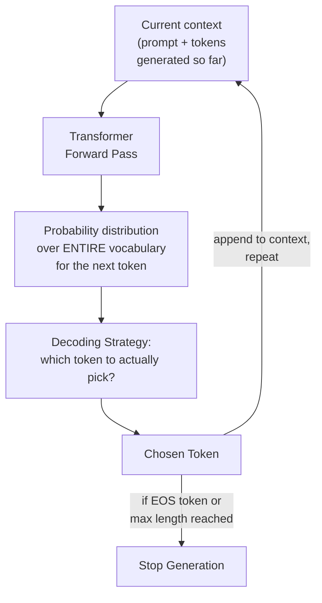
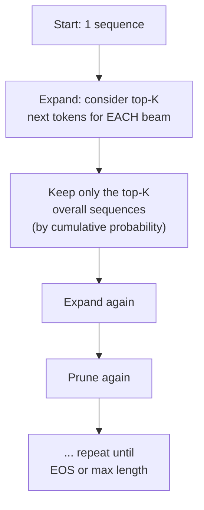
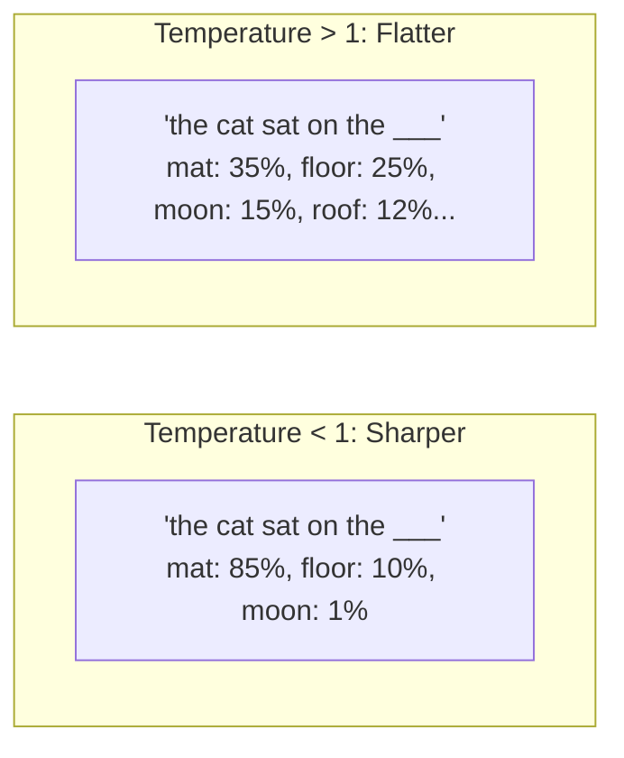

## Introduction

Chapter 37 established that a decoder-only transformer generates text one token at a time, and Chapter 38 established what a token actually is. This chapter closes the loop: at each generation step, the model produces a **probability distribution over its entire vocabulary** for what the next token should be — but a probability distribution isn't text. **Decoding strategy** is the algorithm that turns that distribution into an actual, chosen next token, repeated until generation stops. This is a genuinely new concept with no classical-ML analog (Chapter 36's vocabulary table flagged this explicitly), and the choice of strategy has real, visible effects on an LLM system's output quality, consistency, and cost.

## The Basic Loop



Every decoding strategy covered in this chapter operates on exactly this loop — the difference between them is entirely in the "which token to actually pick" step.

## Greedy Decoding

**The simplest possible strategy**: at every step, pick the single token with the highest probability.

```python
import numpy as np

def greedy_decode(get_next_token_probs, initial_context: list[int],
                    max_tokens: int, eos_token_id: int) -> list[int]:
    context = initial_context.copy()
    for _ in range(max_tokens):
        probs = get_next_token_probs(context)  # returns probability over vocabulary
        next_token = int(np.argmax(probs))
        context.append(next_token)
        if next_token == eos_token_id:
            break
    return context
```

**Strengths**: deterministic (same input always produces the same output — valuable for reproducibility and testing), fast (no need to explore multiple candidate paths).

**Weaknesses**: greedy decoding can lead to repetitive, generic text, and — critically — it's **not globally optimal**. Picking the single best token at each step doesn't guarantee the best overall sequence, since a slightly lower-probability token now might open up a much higher-probability continuation later (a classic local-vs-global optimization problem).

## Beam Search

**The idea**: instead of committing to a single best token at each step, maintain the top-*k* most probable **partial sequences** ("beams") simultaneously, expanding each one at every step and keeping only the overall top-*k* resulting sequences — a search strategy that explores more of the possibility space than greedy decoding while remaining far more tractable than exhaustively considering every possible sequence.



```python
def beam_search_decode(get_next_token_probs, initial_context: list[int],
                         beam_width: int, max_tokens: int, eos_token_id: int) -> list[int]:
    # Each beam: (sequence, cumulative_log_probability)
    beams = [(initial_context.copy(), 0.0)]

    for _ in range(max_tokens):
        candidates = []
        for sequence, cum_log_prob in beams:
            if sequence[-1] == eos_token_id:
                candidates.append((sequence, cum_log_prob))  # keep finished beams as-is
                continue
            probs = get_next_token_probs(sequence)
            top_k_indices = np.argsort(probs)[-beam_width:]
            for token_id in top_k_indices:
                new_sequence = sequence + [int(token_id)]
                new_log_prob = cum_log_prob + np.log(probs[token_id] + 1e-10)
                candidates.append((new_sequence, new_log_prob))

        # Keep only the overall top-K sequences by cumulative log-probability
        candidates.sort(key=lambda x: x[1], reverse=True)
        beams = candidates[:beam_width]

        if all(seq[-1] == eos_token_id for seq, _ in beams):
            break

    return max(beams, key=lambda x: x[1])[0]  # return the single best beam
```

**Strengths**: generally produces higher-quality, more globally coherent sequences than pure greedy decoding, particularly for tasks with a well-defined "correct" answer (like translation).

**Weaknesses**: computationally more expensive than greedy decoding (proportional to beam width — a beam width of 5 means roughly 5x the computation), and, somewhat counter-intuitively, beam search can produce *less* natural, more generic-sounding text for open-ended generation tasks (like conversational chat) — it optimizes for the single highest-probability sequence, which for open-ended text tends toward bland, safe, repetitive phrasing rather than the more varied, natural-sounding text that human writing (and human preference) actually favors.

## Sampling-Based Decoding

For open-ended generation (chat, creative writing), most modern LLM systems don't use greedy or beam search at all — they **sample** from the probability distribution, introducing controlled randomness that produces more natural, varied text.

### Temperature

**Temperature** rescales the probability distribution before sampling — a value less than 1 makes the distribution "sharper" (more concentrated on already-high-probability tokens, closer to greedy/deterministic behavior), while a value greater than 1 makes it "flatter" (more uniform, more randomness, more surprising/creative token choices).

```python
def apply_temperature(logits: np.ndarray, temperature: float) -> np.ndarray:
    """
    logits: raw, unnormalized model output scores (before softmax).
    temperature < 1.0: sharper distribution (more deterministic)
    temperature = 1.0: unchanged
    temperature > 1.0: flatter distribution (more random/creative)
    """
    scaled_logits = logits / temperature
    exp_logits = np.exp(scaled_logits - np.max(scaled_logits))
    return exp_logits / np.sum(exp_logits)
```



### Top-k Sampling

Rather than sampling from the *entire* vocabulary (which risks occasionally selecting a very low-probability, nonsensical token purely by chance), **top-k sampling** restricts sampling to only the *k* most probable tokens at each step, renormalizing their probabilities before sampling.

### Top-p (Nucleus) Sampling

A refinement of top-k: rather than a fixed number of candidate tokens, **top-p sampling** includes the smallest set of tokens whose cumulative probability exceeds a threshold *p* (e.g., 0.9) — this adapts dynamically to the shape of the distribution at each step: when the model is very confident (one token dominates), the candidate set is small; when the model is uncertain (probability spread across many tokens), the candidate set is correspondingly larger.

```python
def top_p_sample(probs: np.ndarray, p: float = 0.9) -> int:
    sorted_indices = np.argsort(probs)[::-1]
    sorted_probs = probs[sorted_indices]
    cumulative_probs = np.cumsum(sorted_probs)

    # Find the smallest set of tokens whose cumulative probability exceeds p
    cutoff_index = np.searchsorted(cumulative_probs, p) + 1
    nucleus_indices = sorted_indices[:cutoff_index]
    nucleus_probs = probs[nucleus_indices]
    nucleus_probs = nucleus_probs / nucleus_probs.sum()  # renormalize

    return int(np.random.choice(nucleus_indices, p=nucleus_probs))
```

In practice, **temperature and top-p (or top-k) are typically combined**: temperature reshapes the overall distribution's sharpness, and top-p then restricts sampling to a sensible, dynamically-sized subset of that reshaped distribution — this combination is the default decoding configuration behind most production chat-oriented LLM APIs.

## Choosing a Decoding Strategy: A System Design Decision

| Strategy | Determinism | Best Fit |
|---|---|---|
| Greedy | Fully deterministic | Tasks needing reproducibility, or where a single "best" answer genuinely exists (some classification-style prompting, extraction tasks) |
| Beam Search | Deterministic (given fixed beam width) | Translation, summarization — tasks with a well-defined target output, where global coherence matters more than variety |
| Temperature + Top-p Sampling | Stochastic | Open-ended chat, creative writing, brainstorming — where natural variety and avoiding repetitive blandness matters |

**This is a genuine system design decision, not a fixed model property** — the same underlying model can be configured with different decoding strategies for different use cases within the same product (e.g., a low-temperature, near-deterministic setting for a factual Q&A feature, and a higher-temperature setting for a creative writing assistant feature), directly connecting to the reproducibility and evaluation concerns from earlier in this series: a stochastic decoding strategy makes offline evaluation (Chapter 21) and reproducibility (Chapter 24) harder, since re-running the same prompt can legitimately produce different outputs — a genuinely new complication classical ML systems, with their deterministic inference, never had to consider.

## Decoding Strategy and Latency

Beam search's higher computational cost (proportional to beam width) directly affects latency — connecting to Part 10's inference optimization chapters. Greedy and sampling-based decoding both generate one token per forward pass, making them the default choice for latency-sensitive, real-time chat applications, while beam search's extra cost is more often justified for offline, batch-style generation tasks (like batch-translating a large document corpus) where per-request latency matters less than final output quality.

## Key Takeaways

- Decoding strategy is the algorithm that turns a model's per-step probability distribution into an actual chosen token — greedy decoding, beam search, and sampling-based approaches each represent different points on a determinism-vs-variety trade-off.
- Greedy decoding is fast and reproducible but can produce repetitive text and isn't globally optimal; beam search explores more of the possibility space at proportionally higher computational cost, but can paradoxically produce blander text for open-ended generation.
- Temperature and top-p (nucleus) sampling, typically combined, are the standard choice for open-ended chat and creative applications, introducing controlled randomness for more natural, varied output.
- Decoding strategy is a genuine system design decision made per use case, not a fixed model property — and stochastic decoding introduces a reproducibility challenge for evaluation and debugging that classical ML's deterministic inference never presented.

---

## Interview Questions

**1. What is a decoding strategy, and why is it a necessary concept beyond the model itself producing a probability distribution?**
A decoding strategy is the algorithm that converts the model's raw probability distribution over its vocabulary, produced at each generation step, into an actual, single chosen token to append to the output — the model itself only produces this distribution; it doesn't inherently decide which specific token to output, so a separate, explicit decision procedure (greedy selection, beam search, or sampling) is necessary to actually produce concrete generated text from this distribution, and different such procedures can produce meaningfully different final outputs even when applied to the exact same underlying model and probability distributions.
*Follow-up: Why is it useful to think of decoding strategy as separate and independent from the model's own trained parameters?*
Because the same trained model, with the exact same learned weights and the exact same probability distributions it produces, can be paired with different decoding strategies to produce very different final generated outputs and behavior — this means decoding strategy is a post-training, inference-time configuration choice rather than something baked into the model's weights, giving system designers a genuine, flexible lever to tune generation behavior (more deterministic versus more creative, for example) for different use cases without needing to retrain or fine-tune the underlying model at all, directly enabling the "same model, different strategies for different use cases" flexibility discussed later in this chapter.

**2. Why isn't greedy decoding globally optimal, despite choosing the highest-probability token at every single step?**
Greedy decoding is a locally-optimal, myopic strategy — it only considers the immediate next token's probability at each step, with no consideration for how that choice affects the probabilities and quality of subsequent tokens later in the sequence; it's entirely possible that choosing a slightly lower-probability token now could lead to a much higher-probability, more coherent continuation later in the sequence, producing a higher overall sequence probability (or genuinely better-quality output) than the sequence greedy decoding would produce by always committing to the single best token at each individual step without any lookahead.
*Follow-up: How does beam search's approach specifically address this limitation, and why doesn't it fully solve it either?*
Beam search addresses this by maintaining several candidate partial sequences simultaneously (rather than committing to a single choice at each step), allowing it to explore multiple plausible continuations in parallel and ultimately select the overall best-scoring complete sequence among these several candidates, capturing some of the "a currently-suboptimal choice might lead to a better overall sequence" insight that pure greedy decoding misses entirely; it doesn't fully solve the problem because it's still a limited, pruned search (only keeping the top-k candidates at each step, discarding all others) rather than an exhaustive search over every possible sequence — a genuinely globally optimal solution would require considering every possible complete sequence, which is computationally infeasible given the vocabulary size and typical sequence lengths involved, making beam search a practical, improved-but-still-approximate compromise rather than a fully solved optimization.

**3. Why might beam search, despite generally improving over greedy decoding for tasks like translation, actually produce worse results for open-ended conversational chat?**
Beam search is specifically optimized to find the single highest-probability (or highest-scoring) overall sequence, and for open-ended generation tasks without one single "correct" target output, the highest-probability sequence often turns out to be a generic, safe, somewhat bland continuation — since more unusual, creative, or surprising word choices are inherently lower-probability individually, even if a human would judge the resulting overall response as more natural, interesting, or genuinely appropriate — beam search's relentless optimization toward the single highest-scoring sequence systematically steers away from exactly this kind of natural variety that makes conversational text feel human-like and engaging, favoring repetitive, predictable phrasing instead.
*Follow-up: Why does this same tension not apply as strongly to a task like machine translation, where beam search remains a reasonable, common choice?*
Machine translation has a much more well-defined "correct" or "close-to-correct" target output for any given input — a good translation is one that faithfully and accurately conveys the source text's meaning, and there's less inherent value in "creative variety" for its own sake in this context, unlike open-ended chat where natural-sounding variety is itself a desirable, valued property of the output; since beam search's tendency toward the single highest-probability sequence aligns well with translation's goal of finding an accurate, high-quality rendering of a specific source meaning (rather than penalizing beam search's bias away from creative variety, which isn't actually a desired property for this specific task), beam search remains a reasonable and effective choice for translation in a way it typically isn't for open-ended conversational generation.

**4. Explain how temperature affects the probability distribution used for sampling, and describe a concrete scenario where you'd want a very low temperature versus a high temperature.**
Temperature rescales the model's raw output logits before applying softmax — dividing by a temperature less than 1 sharpens the resulting distribution (making already-likely tokens even more dominant, pushing behavior toward more deterministic, greedy-like selection), while dividing by a temperature greater than 1 flattens the distribution (giving lower-probability tokens a relatively larger chance of being selected, increasing randomness and variety). A very low temperature would be appropriate for a factual question-answering or data-extraction task, where you want the model to consistently produce its single most confident, best-supported answer rather than introducing unnecessary randomness that could reduce accuracy or consistency; a high temperature would be appropriate for a creative writing or brainstorming assistant, where generating varied, surprising, less predictable content is explicitly the desired, valuable behavior.
*Follow-up: What would happen, in practice, if you set an extremely high temperature (e.g., far above the typical 0.7-1.0 range commonly used) for a factual Q&A system?*
An extremely high temperature would flatten the probability distribution so much that even very low-probability, essentially nonsensical or factually incorrect tokens would have a meaningfully increased chance of being selected during sampling, likely producing increasingly incoherent, factually unreliable, or outright nonsensical output as the temperature increases further — this would directly and severely undermine a factual Q&A system's core purpose (providing accurate, reliable answers), illustrating why temperature must be deliberately, thoughtfully chosen based on the specific use case's actual requirements rather than left at an arbitrary or excessively high default value.

**5. What is the difference between top-k and top-p (nucleus) sampling, and why might top-p be considered a more adaptive, generally preferable approach?**
Top-k sampling restricts the candidate pool for sampling to a fixed number (k) of the most probable tokens at every generation step, regardless of how the probability mass is actually distributed among them; top-p sampling instead includes however many of the most probable tokens are needed for their cumulative probability to reach a threshold p, meaning the actual number of candidate tokens varies dynamically at each step based on the shape of that specific step's distribution — when the model is very confident (probability concentrated on very few tokens), top-p naturally results in a small candidate set (similar to a small k), and when the model is more uncertain (probability spread more evenly across many tokens), top-p naturally expands to include more candidates, adapting to the actual shape of each specific distribution rather than using a fixed, one-size-fits-all cutoff count that top-k applies uniformly regardless of how concentrated or spread out any particular step's distribution happens to be.
*Follow-up: Can you think of a scenario where a fixed top-k value would produce a poor result specifically because it doesn't adapt to the distribution's shape in the way top-p does?*
If the model is extremely confident at a particular generation step (e.g., 95% probability mass concentrated on a single, clearly correct token, with the remaining 5% spread thinly across the rest of the vocabulary), a fixed top-k of, say, 40 would still force the sampling process to consider 40 candidate tokens, including many extremely low-probability, essentially irrelevant tokens that shouldn't realistically be considered at all in this highly-confident scenario — potentially introducing unwanted randomness or occasionally selecting a genuinely poor token purely due to this artificially inflated candidate pool, whereas top-p, adapting to the distribution's actual shape, would naturally and correctly restrict the candidate pool to just the single dominant token (or a very small handful) in this specific high-confidence scenario, avoiding this unnecessary risk.

**6. Why does this chapter argue that decoding strategy introduces a "genuinely new complication" for reproducibility and evaluation, compared to classical ML systems?**
Classical ML inference (Parts 1-7) is deterministic given the same input and model — running the same input through the same trained model always produces the exact same output, making evaluation (Chapter 21) and reproducibility (Chapter 24) straightforward, since a given input reliably maps to a given output every time; a stochastic decoding strategy (temperature-based sampling, top-p sampling) means the exact same prompt, run through the exact same model, can legitimately produce genuinely different outputs on different runs, purely due to the randomness deliberately introduced by the sampling process — this means offline evaluation (running a fixed test set and expecting consistent, comparable results) and reproducibility (exactly recreating a specific historical output for debugging or compliance purposes, per Chapter 24) both become genuinely more complicated, since "the same input produced a different output this time" is now an expected, normal outcome rather than a sign of a bug.
*Follow-up: How would you adapt the offline evaluation practices from Chapter 21 to account for this new source of legitimate output variability?*
Rather than evaluating a single generated output per test prompt (which might not be representative given the legitimate run-to-run variability), I'd generate and evaluate multiple samples per test prompt (using the same stochastic decoding settings intended for production) and report an aggregate statistic (like the average or distribution of quality scores across these multiple samples) rather than treating a single sample's score as fully representative — additionally, for reproducibility purposes specifically (like Chapter 24's need to reconstruct a specific historical decision), I'd ensure the system logs the specific random seed used for that particular generation, since fixing the random seed (in addition to the model version, prompt, and decoding parameters) allows a specific stochastic generation to be exactly reproduced later, despite the underlying process being non-deterministic in general.

**7. How would you decide, for a new LLM-based feature, whether to use greedy decoding, beam search, or temperature-based sampling as the default decoding strategy?**
I'd start by asking whether the task has a well-defined, relatively narrow "correct" or "best" output (like factual extraction, structured data generation, or a classification-style prompt) or whether it's genuinely open-ended with many valid, varied good answers (conversational chat, creative writing, brainstorming) — for the former, I'd favor greedy decoding (simple, fast, reproducible, and appropriate since there isn't much value in introducing variety for tasks with one clearly correct answer) or beam search if the task specifically benefits from exploring several candidate sequences before committing (like translation); for the latter, open-ended category, I'd favor temperature-based sampling combined with top-p, tuning the specific temperature and top-p values based on how much creative variety versus predictable coherence the specific use case calls for.
*Follow-up: How would you validate that your chosen decoding strategy and its specific parameters (like temperature value) are actually well-calibrated for your specific use case, rather than relying on a generic default?*
I'd run a controlled comparison (following the A/B testing and offline evaluation practices from Chapters 21-22) across a few different decoding configurations, evaluating them against the specific metrics that matter for the use case (e.g., human-rated naturalness and helpfulness for a chat feature, or exact-match accuracy for an extraction task) — using this empirical, use-case-specific evidence to select and tune the decoding strategy and its parameters, rather than assuming a commonly-cited generic default (like "temperature 0.7") is automatically well-suited to this particular application's specific requirements without validating it against the application's own actual evaluation criteria.

**8. Why might a production chat application choose to log the specific decoding parameters (temperature, top-p value) used for each generated response, connecting to Chapter 33's observability discussion?**
Since decoding parameters directly and meaningfully affect the character and quality of generated output (as this chapter has established), logging them alongside each generated response (similar to how Chapter 30's example logged the model version for every prediction) is essential for debugging a specific problematic or surprising generated response — an engineer investigating a complaint about an oddly generic or oddly erratic response needs to know what decoding configuration actually produced it, since the same underlying model could produce very different quality characteristics depending on these parameters, and without this logged information, diagnosing whether a specific bad output stemmed from the model itself, the prompt, or the decoding configuration would be much harder.
*Follow-up: How would you extend this logging practice to support a systematic investigation into whether a recent change to the default temperature setting has actually improved or harmed overall response quality in production?*
I'd ensure the logged decoding parameters are captured as a structured, queryable field (following Chapter 33's structured logging discussion) so that responses generated before and after the temperature change can be cleanly segmented and compared against relevant online metrics (Chapter 6) like user satisfaction ratings, conversation length, or explicit thumbs-up/down feedback — ideally structuring this as a proper A/B test (Chapter 22) with randomized assignment between the old and new temperature settings, using this logged decoding-parameter data as the basis for correctly attributing any observed metric differences to the specific temperature change being investigated, rather than to some other confounding factor.

**9. In an interview, if asked "why does this chatbot sometimes give a different answer to the exact same question," how would you use this chapter's concepts to explain the likely cause?**
I'd explain that unless the system is specifically configured to use greedy (fully deterministic) decoding, most conversational LLM systems use a stochastic decoding strategy (temperature-based sampling, often combined with top-p sampling) specifically to produce more natural-sounding, varied responses rather than always mechanically repeating the exact same phrasing — this means it's actually expected, normal behavior for the same question to receive somewhat differently-worded (though hopefully still similarly accurate and helpful) responses across different conversations, rather than necessarily indicating a bug or inconsistency in the underlying model or system itself.
*Follow-up: How would you distinguish, for a user reporting this behavior as a complaint, between this expected stochastic variation and a genuine, concerning inconsistency (e.g., giving factually contradictory answers) that would warrant further investigation?*
I'd look at whether the variation is primarily in surface-level phrasing and style (different wording, but conveying the same underlying facts and recommendations — expected, benign stochastic variation) versus variation in the actual substantive content or factual claims being made (genuinely different, potentially contradictory facts or recommendations across different runs, which would be a more concerning signal, possibly indicating the model's confidence or knowledge on that specific topic is genuinely uncertain, or pointing to an underlying issue like retrieval inconsistency in a RAG system, Part 11, or even hallucination, Chapter 62) — this distinction between benign stylistic variation and concerning substantive inconsistency is the key diagnostic question that determines whether the reported behavior is expected and acceptable, or warrants deeper investigation.

**10. How does the choice of decoding strategy interact with the latency and cost considerations established in Chapter 38, specifically regarding beam search's computational cost?**
Beam search's computational cost scales roughly proportionally with the beam width (the number of candidate sequences maintained simultaneously) — using a beam width of 5, for example, means the model effectively performs on the order of 5 times the computation at each generation step compared to greedy decoding's single candidate sequence, directly and proportionally increasing both the computational cost (more forward passes' worth of work per generated token) and the latency of generating a complete response — this is a genuine, quantifiable trade-off that must be weighed against beam search's potential quality improvement for tasks where it's beneficial (like translation), following the same kind of cost-benefit reasoning about accuracy-versus-latency trade-offs established throughout this series (e.g., Chapter 6, Chapter 28).
*Follow-up: Why does greedy decoding and sampling-based decoding NOT carry this same multiplicative computational cost, despite both also being decoding strategies applied at each generation step?*
Both greedy decoding and sampling-based decoding (with or without temperature/top-p) only require computing and considering a single forward pass's probability distribution at each generation step, ultimately selecting just one single token to proceed with (either the single highest-probability token for greedy, or one token sampled from the distribution for sampling-based approaches) — unlike beam search, which must maintain and expand multiple parallel candidate sequences simultaneously at each step, greedy and sampling-based decoding never need to compute or maintain more than one active sequence at a time, meaning their computational cost per generated token remains essentially the same as a single, standard forward pass, without beam search's multiplicative cost overhead from maintaining multiple parallel candidates.

**11. Why might a system need to support switching between different decoding strategies dynamically, within the same product, based on the specific type of request being handled?**
Different features or request types within the same overall product can have genuinely different requirements along the determinism-versus-variety trade-off spectrum this chapter has established — for example, a single AI assistant product might use near-deterministic, low-temperature (or even greedy) decoding for a structured data-extraction sub-feature (where consistency and accuracy matter most) while using a higher-temperature, sampling-based decoding for a creative brainstorming sub-feature within that same overall product (where natural variety is the actual goal) — building the system with the flexibility to apply different decoding configurations based on the specific request type or detected user intent, rather than committing to a single, one-size-fits-all decoding configuration for the entire product, better serves these genuinely different underlying needs.
*Follow-up: What system design consideration would this flexibility requirement introduce, connecting back to the prompt/request routing concepts previewed in Chapter 36?*
This would require the system to first determine, likely through some form of intent classification or explicit user-selected mode (echoing Chapter 3's classification problem type, potentially implemented as an actual classical ML classifier or an initial LLM call itself, working alongside the main generation LLM as previewed in Chapter 36's discussion of LLM systems combining multiple fundamental problem types), which specific decoding configuration is appropriate for a given incoming request before actually invoking the main generation call with that determined configuration — adding a routing/classification step to the overall system architecture specifically to support this decoding-strategy flexibility, rather than assuming every request within the product should be handled with an identical, fixed decoding configuration regardless of its specific nature or purpose.

**12. How would you explain the trade-off between top-k and top-p sampling to a colleague who's deciding which to implement first for a new LLM-based product, given limited initial engineering time?**
I'd explain that top-p (nucleus) sampling is generally considered the more robust, broadly-preferable default choice for most modern applications, since its dynamic adaptation to the actual shape of each step's probability distribution (as discussed earlier in this chapter) avoids the specific pitfall of a fixed top-k value being poorly calibrated for steps where the model is either very confident (where a fixed k might unnecessarily include irrelevant low-probability tokens) or very uncertain (where a fixed k might be too restrictive, excluding tokens that should reasonably be considered) — given limited initial engineering time, I'd recommend implementing top-p first as the more generally reliable default, treating top-k as a secondary, alternative option to potentially experiment with later if top-p's behavior doesn't prove satisfactory for the specific product's particular needs.
*Follow-up: Is there ever a scenario where top-k might actually be preferable to implement, despite top-p's generally more adaptive behavior?*
Top-k can be simpler and more predictable to reason about and tune in certain constrained scenarios — for example, if a team wants an easily-explainable, fixed guarantee on the maximum number of candidate tokens ever considered at each step (useful for certain latency or memory-budget-constrained inference optimizations, or for simplicity in initial debugging and understanding of the system's behavior), a fixed top-k value provides this simple, predictable guarantee directly, whereas top-p's dynamically-varying candidate set size, while generally more adaptive to distribution shape, is inherently less predictable in terms of exactly how many candidates will be considered at any given step — for a team specifically prioritizing this kind of simple, bounded predictability over top-p's generally better quality adaptation, top-k might be a reasonable, deliberate choice despite top-p's generally preferable behavior in most other contexts.

**13. Why is it important for a system designer to understand that decoding strategy operates at the token level (per Chapter 38's token-versus-word distinction), rather than at the word or sentence level?**
Since generation proceeds one token at a time (Chapter 37's causal, sequential generation process) and a single word can correspond to multiple tokens (Chapter 38's tokenization discussion), a decoding strategy's random or deterministic choice at each step is being made about which *token* (potentially just a fragment of a word) comes next, not which whole word or complete phrase comes next — understanding this correctly explains certain generation artifacts (like an unusual or seemingly nonsensical partial-word fragment occasionally appearing, particularly at higher temperature settings) as a natural consequence of token-level sampling occasionally selecting an unlikely token mid-word, rather than being a mysterious or unexplainable bug, and it clarifies that concepts like "beam width" or "top-k" are operating on the vocabulary of tokens (which can number in the tens of thousands), not on a much smaller, more intuitive vocabulary of whole words.
*Follow-up: How might this token-level operation specifically explain why certain decoding artifacts are more common in languages or content types with less efficient tokenization (connecting back to Chapter 38's multilingual fairness discussion)?*
Content that tokenizes less efficiently (requiring more, smaller token fragments to represent the same content, as discussed in Chapter 38 for lower-resource languages) requires more individual token-level decoding decisions to generate the same amount of actual content compared to more efficiently-tokenized content (like typical English text) — since each individual token-level decoding decision carries some risk of an unlikely or suboptimal choice (especially with sampling-based decoding), content requiring more total token-level decisions to generate has proportionally more opportunities for this kind of small, per-token decoding artifact to occur somewhere within the generated output, potentially making certain decoding-related quality issues somewhat more likely to manifest, on average, for less efficiently-tokenized languages or content types — an additional, subtle way in which the tokenization efficiency disparity from Chapter 38 can compound into a real, measurable quality disparity as well as the previously-discussed cost disparity.

**14. How would you use A/B testing (Chapter 22) to validate a proposed change to a production LLM system's decoding temperature, and what metric would you prioritize?**
I'd design a proper randomized experiment comparing the current production temperature setting (control) against the proposed new temperature setting (treatment), following Chapter 22's full experimental design discipline (proper sample size calculation, avoiding peeking, watching for novelty effects given users might initially react differently to a noticeably different response style) — for the primary metric, I'd prioritize a genuine user satisfaction or engagement signal (like an explicit thumbs-up/down rate, conversation continuation rate, or a proxy for task completion success) rather than a purely internal, model-centric metric, since the actual goal of tuning temperature is to improve genuine user-perceived quality and usefulness, which these kinds of online, user-facing metrics directly measure, while also monitoring guardrail metrics (Chapter 6) like factual accuracy or hallucination rate (Chapter 62) to catch any unintended quality regression from a temperature change that might not show up in a pure engagement metric alone.
*Follow-up: Why might factual accuracy or hallucination rate specifically be an important guardrail metric to monitor for this particular kind of experiment, given what this chapter established about temperature's effects?*
As this chapter established, higher temperature settings increase randomness and the likelihood of selecting lower-probability (potentially less well-supported or accurate) tokens — for factual or knowledge-intensive use cases, an increased temperature setting genuinely carries a real risk of increasing hallucination or factual error rates even if it happens to improve a general engagement or naturalness metric, making this guardrail specifically relevant and important to monitor for this particular kind of experiment, directly connecting this chapter's technical mechanism (temperature increasing randomness in token selection) to a concrete, measurable quality risk that a well-designed experiment should be specifically watching for, rather than only optimizing for a general engagement metric that might not capture this specific risk on its own.

**15. How would you summarize, for someone moving into Part 9's fine-tuning discussion, why understanding decoding strategy (this chapter) remains relevant even after a model has been fine-tuned?**
Fine-tuning (Part 9) changes a model's underlying learned weights and, therefore, the probability distributions it produces at each generation step — but decoding strategy remains a separate, independent, inference-time configuration choice applied on top of whatever probability distributions the (now fine-tuned) model produces, meaning the concepts from this chapter (greedy vs. beam search vs. sampling, temperature, top-p) apply identically to a fine-tuned model as they did to the original base model; understanding this separation is important so a reader doesn't mistakenly conclude that fine-tuning alone determines a model's generation behavior — the decoding strategy chosen at inference time remains an equally important, independently-tunable lever for shaping a fine-tuned model's actual output behavior in production.
*Follow-up: Could a poorly-chosen decoding strategy undermine the benefits of an otherwise well-executed fine-tuning effort? Give a concrete example.*
Yes — imagine a team carefully fine-tunes a model specifically to produce more precise, factually careful responses for a medical information use case, but then deploys it with an unnecessarily high temperature setting inherited from a different, more creative-writing-oriented use case's default configuration — the high temperature would introduce exactly the kind of increased randomness and hallucination risk this chapter warned against, potentially undermining much of the precision and factual carefulness the fine-tuning effort specifically aimed to instill, illustrating concretely why decoding strategy must be deliberately and independently reconsidered and configured appropriately for each specific use case and model, rather than assuming a good fine-tuning result alone guarantees good production behavior regardless of the inference-time decoding configuration applied on top of it.
