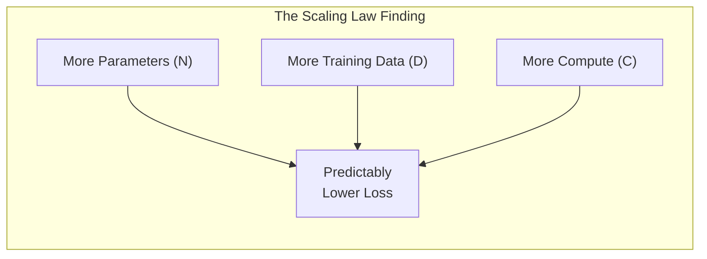
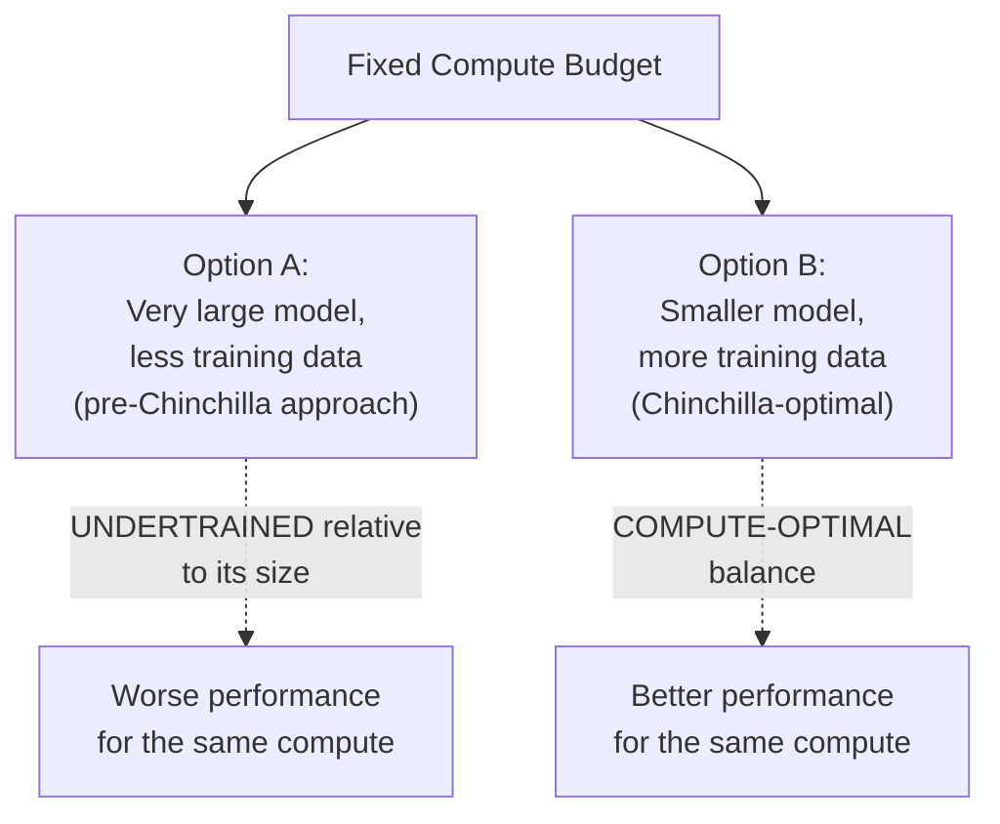
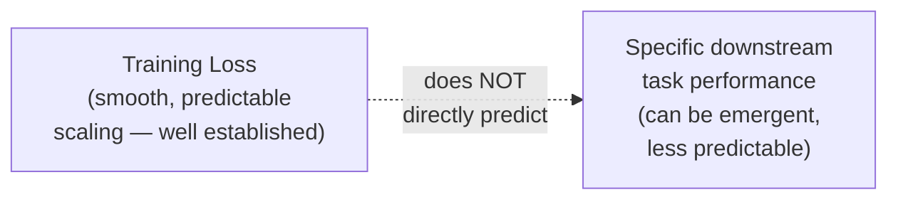

## Introduction

Chapter 36's vocabulary table flagged scaling laws as a concept with no classical-ML equivalent — a specific, empirically-derived body of research findings from the LLM era. This chapter covers what scaling laws actually say, at exactly the depth a system designer needs: not to derive them, but to use their conclusions to reason intelligently about model size, training investment, and the "bigger model vs. smaller model" trade-off that recurs constantly in LLM system design.

## What a Scaling Law Actually Is

A **scaling law** is an empirically-observed, remarkably consistent relationship: as you increase a language model's **parameter count (N)**, **training dataset size (D)**, or **training compute (C)**, its performance (typically measured as loss on held-out data — how well it predicts the next token) improves in a smooth, predictable way — following an approximate **power-law** relationship across many orders of magnitude, rather than an unpredictable or erratic one.



**Why this was a genuinely significant research finding**: before this was well-established, it wasn't obvious that simply "making the model bigger and training it on more data" would continue to reliably improve performance rather than quickly hitting diminishing returns or an unpredictable plateau. Scaling laws showed the relationship holds remarkably smoothly across many orders of magnitude, giving researchers and labs a genuine, quantified basis for planning enormous training investments with a reasonable expectation of the resulting performance — directly explaining the rapid, sustained scale-up of model sizes across the LLM era.

## The Chinchilla Insight: Compute-Optimal Training

An early wave of scaling research (leading to models like GPT-3) tended to scale parameter count aggressively while holding training data relatively fixed. A pivotal 2022 paper (the "Chinchilla" paper from DeepMind) revisited this relationship and found that **for a fixed compute budget, most earlier large models were significantly undertrained relative to their size** — a smaller model, trained on proportionally more data, achieved better performance than a larger model trained on less data, for the *same total compute budget*.



**The practical, roughly-stated finding**: model size and training data size should scale together, roughly in proportion — for a given compute budget, there's a specific, calculable "compute-optimal" balance between how large to make the model versus how much data to train it on, and deviating too far in either direction (too large a model with too little data, or vice versa) wastes compute relative to what that optimal balance would achieve.

**Why this matters for a system designer, not just a researcher**: this finding fundamentally reshaped how labs approach training investment decisions, directly explaining why some more recent models are smaller in parameter count than their predecessors while still matching or exceeding their performance — a smaller-but-better-trained model is not a contradiction once you understand the Chinchilla finding, and recognizing this helps you avoid the common misconception that "parameter count" alone is a reliable proxy for model capability when comparing different models.

## What Scaling Laws Do and Don't Predict

It's important to be precise about the scope of these findings, since this is a common source of interview confusion:

- **They predict**: how a model's *training loss* (next-token prediction accuracy on held-out data) improves as you scale N, D, and C — a well-defined, measurable, and remarkably smooth quantitative relationship.
- **They do NOT directly predict**: how a model performs on any *specific downstream task* (like a particular reasoning benchmark, a specific coding task, or your specific business application), how "aligned" or "safe" a model's behavior will be, or how much a specific real-world capability (like multi-step reasoning) will improve — these downstream capabilities have often shown **emergent** behavior (appearing somewhat abruptly at certain scale thresholds, rather than smoothly and predictably) that the smooth training-loss scaling laws don't directly forecast.



This distinction directly informs a practical system design lesson: don't assume that because a much larger model exists, it will automatically and proportionally outperform a smaller model on *your specific task* by an amount predictable from the scaling laws' loss curves alone — this must be validated empirically against your actual use case's evaluation criteria (Chapter 21), exactly as this series has emphasized for every other model-selection decision.

## Applying Scaling Law Intuition to System Design Decisions

You will very likely never personally run a scaling-law study — but the *intuitions* this research established directly inform several practical decisions:

1. **Bigger is not always proportionally better for your specific task.** A model's general capability, as measured by scaling laws' smooth loss curves, doesn't guarantee proportionally better performance on your narrow, specific use case — always validate empirically (Chapter 21), rather than assuming the largest available model is automatically the best choice.
2. **Diminishing returns are real and should inform cost-benefit decisions.** Since the scaling relationship is a power law (not linear), each additional increment of scale delivers progressively smaller absolute improvements in loss — directly informing the cost-benefit reasoning from Chapter 6 and Chapter 42 when deciding whether a more expensive, larger model's marginal capability improvement justifies its marginal cost increase for your specific application.
3. **A well-trained smaller model can beat a poorly-trained larger one.** The Chinchilla insight is a direct caution against assuming parameter count alone is a reliable proxy for capability — always evaluate actual, measured performance (Chapter 21) rather than inferring quality from parameter count as a shortcut.

## A Simplified Illustration

```python
import numpy as np
import matplotlib.pyplot as plt

def scaling_law_loss(compute: np.ndarray, alpha: float = 0.05, floor: float = 1.5) -> np.ndarray:
    """
    A simplified illustration of the general SHAPE of an empirical
    scaling law: loss decreases as a power law of compute, approaching
    an irreducible floor (not the actual published formula/constants —
    for illustrating the qualitative shape and diminishing returns only).
    """
    return floor + (compute ** -alpha)

compute_budgets = np.logspace(1, 8, 100)  # spanning many orders of magnitude
losses = scaling_law_loss(compute_budgets)

plt.figure(figsize=(8, 5))
plt.plot(compute_budgets, losses)
plt.xscale("log")
plt.xlabel("Training Compute (log scale)")
plt.ylabel("Model Loss (lower is better)")
plt.title("Illustrative Scaling Law Shape: Diminishing Returns at Scale")
plt.axhline(y=1.5, color="gray", linestyle="--", label="Approaching irreducible floor")
plt.legend()
# In a real analysis, this smooth power-law relationship — and the
# diminishing marginal improvement per unit of ADDITIONAL compute
# as you move right — is exactly the empirical finding that informs
# training investment decisions at the frontier lab level.
```

The key visual intuition worth internalizing, even without running this code: the curve is smooth and predictable, but it flattens — each additional order of magnitude of compute buys progressively less improvement, which is precisely the diminishing-returns dynamic that should inform any cost-benefit reasoning about pursuing ever-larger models.

## Key Takeaways

- Scaling laws are empirically-derived, remarkably smooth power-law relationships between model size, training data size, training compute, and resulting training loss — a foundational LLM-era research finding with no classical-ML equivalent.
- The Chinchilla insight showed that many early large models were undertrained relative to their size — for a fixed compute budget, model size and training data size should scale together, and a smaller, better-trained model can outperform a larger, undertrained one.
- Scaling laws predict smooth training-loss improvements, not specific downstream task performance — some real-world capabilities emerge somewhat abruptly at certain scale thresholds rather than improving smoothly and predictably, meaning a larger model's benefit for your specific task must still be empirically validated.
- For a system designer, the practical takeaway is: don't treat parameter count as a reliable proxy for real-world capability, expect diminishing returns from ever-larger models, and always validate model choice against your specific use case's actual evaluation criteria rather than inferring it from scale alone.

---

## Interview Questions

**1. What is a scaling law, in the specific LLM research sense, and why was this finding considered significant when it was established?**
A scaling law is an empirically-observed, smooth power-law relationship describing how a language model's training loss (its accuracy at predicting the next token on held-out data) improves as model size (parameter count), training data size, or training compute increases — the finding was significant because it demonstrated this relationship holds predictably and smoothly across many orders of magnitude, rather than plateauing unpredictably or behaving erratically at larger scales, giving researchers and labs a genuine, quantified, and reliable basis for planning very large, expensive training investments with confidence that the resulting performance improvement would materialize roughly as the scaling curve predicted.
*Follow-up: Why might this predictability have been surprising or non-obvious before it was empirically established?*
Before this was systematically studied and confirmed, there was no strong a priori reason to assume that simply making models larger and training them on more data would continue to yield reliable, smooth improvements rather than hitting an early performance ceiling, requiring fundamentally different architectural breakthroughs to progress further, or behaving unpredictably at scales far beyond what had been previously tested — many complex systems in nature and engineering exhibit non-smooth, threshold-based, or plateauing behavior as they scale, so the finding that language model performance scales so smoothly and predictably across such a wide range was a genuinely non-trivial, empirically-discovered property of this specific class of models, not something that could have been safely assumed in advance.

**2. Explain the Chinchilla insight in your own words, and why it represented a meaningful shift in how labs approached training investment.**
The Chinchilla insight showed that, for a given fixed compute budget, many earlier large language models had been trained with too many parameters relative to how much training data they'd actually seen — they were "undertrained" for their size — and that a smaller model trained on proportionally more data would achieve better performance for that same total compute budget; this represented a meaningful shift because it moved the field away from a simple "bigger model is always better, for the same budget" mental model toward a more nuanced understanding that model size and training data size need to be scaled together in a specific, compute-optimal ratio, and that simply maximizing parameter count while under-investing in proportional training data actually wastes compute relative to what a more balanced allocation would achieve.
*Follow-up: What practical, observable consequence did this insight have on subsequent model releases from major AI labs?*
Following this insight, several subsequent models were released with notably smaller parameter counts than some of their predecessors, while still matching or exceeding those larger predecessors' performance on standard benchmarks — directly reflecting labs applying the Chinchilla-informed, more compute-optimal training approach (more data, proportionally smaller model, for the same or even less total compute) rather than continuing to primarily scale up parameter count while under-investing in proportional training data, which is a concrete, observable real-world outcome of this research finding actually changing industry practice, not just a theoretical or academic result.

**3. Why do scaling laws predict training loss improvements but NOT necessarily predict a model's performance on a specific downstream task or benchmark?**
Training loss (next-token prediction accuracy on held-out general text) is a broad, general measure of the model's overall language modeling capability, and scaling laws describe how this specific, general measure improves smoothly with scale; a specific downstream task or benchmark (like multi-step mathematical reasoning, or a specific coding challenge) requires the model to apply its general capability in a particular, often more specialized way, and research has observed that some of these specific capabilities can emerge somewhat abruptly at certain scale thresholds (a phenomenon called "emergent capability") rather than improving smoothly and proportionally alongside the smooth training loss curve — meaning the smooth, predictable scaling law for general training loss doesn't automatically or directly translate into an equally smooth, predictable scaling curve for any specific downstream capability you might care about.
*Follow-up: What system design implication follows from this distinction, specifically regarding how you'd evaluate whether a larger, more expensive model is worth adopting for your specific use case?*
Since a larger model's improved general training loss doesn't guarantee a proportional, predictable improvement on your specific downstream task, you can't simply infer from a model's advertised parameter count or general benchmark scores that it will perform proportionally better on your particular use case — you need to directly and empirically evaluate the specific larger model against your specific task's actual evaluation criteria (following Chapter 21's offline evaluation discipline) before committing to the additional cost of using it, rather than assuming a larger, more capable-in-general model will automatically deliver a correspondingly better result for your specific, possibly narrower or more specialized application.

**4. Why might a smaller, well-trained model sometimes outperform a larger, undertrained model, even though intuition might suggest "more parameters should always mean more capability"?**
A model's ultimate capability depends on both its architecture/parameter count AND how effectively it has actually learned to use that capacity, which depends heavily on how much and how well it was trained — a model with a large parameter count but insufficient training data (or insufficient training compute applied to that data) hasn't had the opportunity to fully develop and refine the representations that its larger capacity theoretically allows, leaving much of its potential capacity underutilized; a smaller model that has been trained more thoroughly and proportionally (per the Chinchilla-optimal ratio) can more fully realize its own, smaller capacity, potentially outperforming a larger but relatively undertrained model whose larger theoretical capacity was never actually well-utilized during its training process.
*Follow-up: Why is this insight particularly important for a system designer evaluating multiple LLM options based on publicly available information?*
Publicly available information about a model often prominently features its parameter count as a headline specification, which can create a natural but potentially misleading assumption that parameter count alone is a reliable indicator of relative capability across different models — understanding the Chinchilla insight helps a system designer resist this oversimplified inference, recognizing that a model's actual, empirically-measured performance on relevant benchmarks or your own specific evaluation criteria is a far more reliable signal of real capability than parameter count alone, since two models with very different parameter counts could have very different training data volumes and training efficiency, potentially reversing the "bigger parameter count implies better" assumption entirely.

**5. How would you use scaling law intuition to explain, to a stakeholder, why doubling a model's size doesn't necessarily double its usefulness for the stakeholder's application?**
I'd explain that scaling laws show model performance improves following a power-law relationship with scale, which specifically means the *rate* of improvement diminishes as scale increases — each additional doubling of model size (and the associated compute and cost) tends to yield a progressively smaller absolute improvement in the model's underlying capability than the previous doubling did, rather than each doubling delivering an equally large, proportional jump in usefulness; additionally, even the specific, smaller improvement in general capability that a larger model does provide may or may not translate into a meaningfully better result for the stakeholder's own specific, narrower application, which needs to be validated directly against the actual task rather than assumed from the general scaling relationship alone.
*Follow-up: How would you help the stakeholder decide whether a specific, more expensive, larger model IS worth adopting for their specific application, despite this general diminishing-returns caution?*
I'd propose directly and empirically measuring the specific larger model's performance against the stakeholder's own actual evaluation criteria and business metrics (following Chapters 6 and 21's evaluation discipline), comparing this measured improvement against the larger model's additional cost and latency (Chapter 42) — if the measured, task-specific improvement justifies the additional cost for this particular application's specific requirements and stakes, adopting the larger model would be a well-justified, evidence-based decision; if the measured improvement is small or doesn't translate into a meaningful business outcome improvement, the diminishing-returns caution would be validated for this specific case, and staying with the smaller, cheaper model would be the better-justified choice — grounding the final decision in this specific, measured evidence rather than either blindly following the general scaling-law caution or blindly assuming bigger is always better.

**6. Why might understanding scaling laws help you reason about likely future trends in LLM cost and capability, even without personally training any models?**
Understanding that model capability improves smoothly and predictably with scale, but with diminishing returns, and that training efficiency (per the Chinchilla insight) can itself continue to improve independently of raw scale, helps you form realistic expectations about how the LLM landscape is likely to evolve — you can reasonably anticipate that future models will likely continue to become more capable at a given cost/size point (as training efficiency techniques improve, following the Chinchilla-style insight of getting more capability out of the same compute budget) rather than assuming either an indefinite continuation of ever-larger models being the only path to improvement, or assuming progress will simply plateau — this kind of grounded, research-informed expectation is more useful for long-term system design and technology-choice planning than either naive extrapolation or unfounded skepticism about continued progress.
*Follow-up: How would this kind of grounded expectation affect a long-term build-vs-buy decision (previewed in Chapter 36, covered fully in Chapter 41) for a company considering training their own foundation model versus relying on existing providers?*
Understanding that continued improvements in training efficiency (not just raw scale) are a real, ongoing research trend suggests that a model trained in-house today could become relatively less competitive over time as external providers continue to benefit from these efficiency improvements at a pace an individual company might struggle to match without dedicated, large-scale research investment — this reinforces a cautious, well-justified default toward relying on existing, continuously-improving foundation models (Chapter 41's "buy" option) for most organizations, rather than assuming an in-house-trained model, even if competitive today, would remain so without an ongoing, very substantial and sustained research and engineering investment to keep pace with the broader field's continued efficiency and scaling improvements.

**7. Why is it important for an AI System Design candidate to be able to explain scaling laws WITHOUT needing to derive or precisely state the actual mathematical formulas involved?**
As established in Chapter 37's discussion of what a system designer needs versus doesn't need to know, the practical, decision-relevant value of scaling laws for system design purposes lies in the qualitative, intuitive understanding (smooth power-law relationship, diminishing returns, the Chinchilla compute-optimal balance insight) rather than in the ability to precisely derive or state the specific mathematical constants and formulas from the original research papers — a system designer needs this understanding to reason correctly about model selection, cost-benefit trade-offs, and realistic expectations for model improvement, none of which requires the precise mathematical formulation, which is instead the domain of ML researchers actually conducting or extending this specific line of scaling-law research.
*Follow-up: How would you respond if an interviewer specifically pressed you for the precise mathematical form of a scaling law, beyond the qualitative understanding this chapter has emphasized?*
I'd be honest that I don't have the precise mathematical formulation memorized, since my focus has been on the qualitative, system-design-relevant implications of this research rather than the specific research paper's exact mathematical derivation, and I'd offer to describe the general shape and qualitative behavior of the relationship (a power law, with diminishing returns, as illustrated by this chapter's simplified example) — this honest response, paired with a clear demonstration of the practical, decision-relevant understanding that actually matters for system design purposes, is a stronger answer than either fabricating a plausible-sounding but likely incorrect formula, or being unable to engage with the underlying concept at all.

**8. How would you use the distinction between "smooth scaling of training loss" and "emergent, less predictable downstream capabilities" to caution against a specific kind of flawed reasoning in an interview?**
I'd caution against the flawed reasoning of assuming that because scaling laws show smooth, predictable improvement in a model's general training loss with increased scale, a specific desired capability (like reliable multi-step reasoning, or accurate handling of a specific narrow domain) will improve in an equally smooth, predictable, and easily-extrapolated way as model scale increases — since some real-world capabilities have been observed to emerge somewhat abruptly at certain scale thresholds rather than improving gradually and predictably, you cannot safely assume that a moderate increase in model scale will produce a correspondingly moderate, predictable improvement in a specific capability you care about; this specific capability might show no meaningful improvement until a much larger scale threshold is crossed, or might already be present even in a smaller model, in ways the smooth aggregate training-loss curve alone wouldn't reveal or predict.
*Follow-up: How would this caution specifically apply to a scenario where a candidate proposes "let's just use a somewhat larger model to fix this specific reasoning failure we're seeing"?*
I'd point out that this proposal implicitly assumes the specific reasoning capability in question scales smoothly and predictably with model size in the same way training loss does, which isn't necessarily true given the emergent-capability phenomenon discussed in this chapter — a "somewhat larger" model might show no meaningful improvement on this specific reasoning failure at all if the relevant capability threshold requires a much larger jump in scale than what's being proposed, or, conversely, the same reasoning failure might be addressable through a completely different intervention (better prompting, few-shot examples, or a different problem-solving approach like the multi-step reasoning patterns previewed for later coverage in this series) that doesn't require scaling up the model at all — recommending empirical validation of any specific proposed fix (whether it's a model-size change or an alternative approach) against the specific reasoning failure in question, rather than assuming a moderate scale increase will predictably and reliably resolve it.

**9. Why might a research finding like scaling laws, originally aimed at guiding foundation-model pre-training decisions, still be relevant to an engineer who will only ever fine-tune or use existing pre-trained models?**
Even though the engineer won't personally make pre-training scale decisions, understanding scaling laws provides a grounded framework for interpreting and comparing the ever-growing landscape of available pre-trained models — helping the engineer understand why certain smaller models can be surprisingly competitive with larger ones (Chinchilla-style training efficiency), why an even larger available model might offer only modest additional benefit for a specific narrow use case (diminishing returns), and generally providing a more sophisticated, less naive mental model for evaluating and selecting among available foundation models than simply defaulting to "the largest available model must be the best choice," which is a genuinely common and problematic oversimplification this research-informed understanding directly helps correct.
*Follow-up: How does this connect to the broader theme, established throughout this series, that understanding underlying mechanisms produces more durable and transferable system design judgment than memorizing specific facts or following simple heuristics?*
This is a direct continuation of the same principle applied throughout the series (e.g., Chapter 15's emphasis on understanding training-serving skew's underlying mechanism rather than memorizing symptoms, or Chapter 28's emphasis on understanding why compression techniques work rather than just knowing their names) — understanding scaling laws' underlying mechanism and implications (rather than just knowing "scaling laws exist" as an isolated fact) equips an engineer to reason correctly and flexibly about novel model-selection scenarios they haven't specifically encountered before, adapting the underlying principle (diminishing returns, training efficiency mattering as much as raw scale, downstream capability not being perfectly predictable from scale alone) to whatever specific new models or situations they encounter in their actual work, rather than relying on a specific, potentially soon-outdated heuristic or fact that might not generalize well to new situations.

**10. How would you explain to a colleague why "this new model has 10x more parameters than the old one" is an incomplete basis for concluding it will be a meaningfully better choice for their specific application?**
I'd walk through this chapter's key cautions directly: first, whether that larger parameter count was matched with a proportionally appropriate increase in training data (per the Chinchilla insight) significantly affects whether that larger size actually translates into meaningfully better realized capability, rather than being an undertrained, underutilized larger capacity; second, even if the larger model does show genuinely improved general capability (smooth training-loss scaling), this doesn't guarantee a proportional, or even any, improvement on their colleague's own specific, possibly narrow use case, given the emergent and sometimes unpredictable nature of specific downstream capabilities discussed in this chapter; and third, even a genuine capability improvement needs to be weighed against the corresponding increase in cost and latency (Chapter 42) to determine if it's actually a net-positive choice for their specific application's requirements and constraints, rather than assuming "more parameters" is self-evidently and unconditionally better.
*Follow-up: What single piece of evidence would most efficiently resolve this uncertainty for the colleague, rather than continuing this more theoretical discussion?*
Running a direct, empirical comparison of both models against their colleague's own specific evaluation criteria and representative test cases (following Chapter 21's offline evaluation practices) would most efficiently and conclusively resolve the uncertainty — a concrete, measured comparison of actual task performance for their specific use case, weighed against the measured cost and latency difference between the two models, provides far more decisive, directly actionable evidence than any amount of further theoretical discussion about scaling laws and parameter counts in the abstract, which is exactly the kind of "validate empirically rather than reasoning from proxies alone" discipline this series has consistently emphasized as the appropriate final arbiter of any model-selection decision.

**11. In an interview, if asked to justify why you'd choose a specific, moderately-sized model over the largest available model for a proposed system, how would you frame your answer using this chapter's concepts?**
I'd frame the justification around the diminishing-returns and cost-benefit reasoning this chapter establishes — explaining that while the largest available model likely offers somewhat better general capability (per the smooth scaling relationship), the marginal improvement it would provide is likely to be proportionally smaller than the marginal increase in cost and latency it would introduce (Chapter 42), and that for the specific, likely narrower task this proposed system needs to accomplish, a moderately-sized model may already capture most of the practically relevant capability needed — while explicitly noting that this is a reasoned default assumption I'd want to validate through actual empirical evaluation (per Chapter 21) against the specific task before finalizing the decision, rather than presenting the choice of a smaller model as an unvalidated, purely theoretical conclusion.
*Follow-up: How would you respond if the interviewer specifically challenged this reasoning by saying "but couldn't the larger model's capability be exactly what's needed for some edge cases your smaller model would get wrong"?*
I'd acknowledge this is a genuinely valid concern and exactly the kind of question that empirical, slice-based evaluation (echoing Chapter 6 and Chapter 21's discussion of aggregate metrics hiding subgroup failures) should specifically investigate — proposing to evaluate both models specifically against a curated set of known or anticipated harder edge cases, not just average-case performance, to see whether the larger model's additional capability specifically and meaningfully helps on exactly these harder cases in a way that would justify its additional cost for at least that subset of traffic (potentially even suggesting a hybrid approach, using the smaller model for the majority of traffic and routing specifically-identified harder edge cases to the larger model, echoing the tiered/hybrid architecture patterns discussed elsewhere in this series) — rather than assuming either that the larger model's benefit is negligible everywhere, or that its benefit justifies using it uniformly for all traffic regardless of this edge-case-specific consideration.

**12. Why might scaling laws research be considered a good example of the kind of "system-design-relevant new vocabulary" this Part is building, as previewed in Chapter 36, rather than purely academic ML research trivia?**
As Chapter 36 previewed, scaling laws directly and practically inform real system design decisions — model selection (is a larger model worth its additional cost for this specific task), cost forecasting (understanding the shape of diminishing returns helps set realistic expectations for what future, larger models might offer), and critical thinking about vendor claims (resisting the oversimplified "bigger parameter count equals better model" assumption) — this is squarely different from purely academic research trivia that has no bearing on actual engineering or business decisions, which is exactly the practical, decision-relevant bar this series has consistently applied (as articulated in Chapter 37's "what a system designer needs to know" discussion) when deciding which technical concepts deserve inclusion and depth in this series.
*Follow-up: How would you distinguish, in general, between an LLM-related research finding that's genuinely system-design-relevant versus one that's more purely of academic or research interest, for your own ongoing learning as this field continues to evolve rapidly?*
I'd apply the same practical filter established in Chapter 37 — does understanding this specific research finding change a decision I'd actually need to make as a system designer (model selection, cost estimation, evaluation strategy, risk assessment), or does it only affect how the underlying technology is researched, trained, or mathematically optimized without changing any actual system-design decision; findings that pass this "does it change a decision" test (like scaling laws' cost-benefit and model-selection implications) are worth actively tracking and understanding as this field evolves, while findings that are more purely about improving research methodology or theoretical understanding without a direct, practical system-design implication can reasonably be deprioritized for a system-design-focused learning path, even if they remain genuinely interesting and important within the ML research community itself.

**13. How would you use scaling law concepts to explain why smaller, specialized models (potentially created via distillation, Chapter 28) might make more business sense for a company than always using the largest, most general-purpose frontier model?**
I'd connect the diminishing-returns insight from scaling laws directly to Chapter 28's distillation discussion — since a frontier model's very large scale is specifically optimized to provide broad, general-purpose capability across an enormous range of possible tasks, but any specific business application typically only needs a narrow slice of that broad capability, the marginal value of the frontier model's "extra" general capability beyond what a specific narrow task actually requires is often not fully utilized or monetized by that narrow application — a distilled, smaller model specifically specialized for that narrower task can potentially capture most of the practically relevant capability for that specific use case (echoing Chapter 28's distillation discussion) at a small fraction of the frontier model's ongoing serving cost, representing a more cost-efficient point on the same underlying capability-versus-cost trade-off curve that scaling laws describe, specifically tailored to the narrower needs of that particular business application rather than paying for broad, general-purpose capability that goes largely unused.
*Follow-up: Why might a company still choose to use a frontier, general-purpose model for some parts of their product even after adopting this cost-efficient distillation strategy for others?*
Different parts of a product likely have genuinely different requirements along this same capability-versus-cost trade-off — a narrow, well-defined, high-volume task (like classifying support ticket categories) is well-suited to a smaller, distilled, cost-efficient model, while a more open-ended, lower-volume, higher-stakes task (like handling a complex, novel customer inquiry that genuinely benefits from broad general reasoning capability) may still justify the frontier model's higher cost for that specific, more demanding use case — this is the same right-sizing principle discussed throughout this series (Chapter 16's hardware right-sizing, Chapter 20's model-size-for-fine-tuning right-sizing) applied once again, now specifically to the choice between frontier and distilled/specialized models across the different components of a single, larger product, rather than assuming a single, uniform model choice is appropriate for every sub-task within that product.

**14. How would you handle a stakeholder who insists on always using the newest, largest available model for every feature, citing scaling laws as justification ("bigger is scientifically proven to be better")?**
I'd clarify that scaling laws do establish that larger models tend to have better *general* capability on average, but this chapter's key cautions directly complicate the stakeholder's oversimplified conclusion — diminishing returns mean the *marginal* improvement from an even larger model is often smaller than its marginal cost increase, and the smooth scaling relationship applies to general training loss, not necessarily to the stakeholder's own specific, narrower application's actual requirements, which need direct empirical validation rather than being inferred from the general scaling relationship alone — I'd propose using scaling laws' more nuanced, correct implications (validate empirically, expect diminishing returns, factor in the Chinchilla efficiency insight) to inform a more genuinely evidence-based model-selection process for each specific feature, rather than treating "always use the largest available model" as a blanket, scientifically-justified rule that the actual research findings don't really support in that oversimplified form.
*Follow-up: What would be an effective way to demonstrate this nuance concretely to the stakeholder, rather than relying purely on this conceptual explanation?*
I'd propose a concrete, small-scale empirical demonstration — running a side-by-side comparison of a smaller/cheaper model and the largest available model against a representative sample of the stakeholder's actual use cases, showing both the actual measured quality difference (which may well be smaller than the stakeholder expects) and the actual cost/latency difference (which is likely substantial) — this concrete, evidence-based demonstration, specific to their own actual product and use cases rather than abstract scaling-law theory, is typically far more persuasive and actionable for a stakeholder than continuing a purely conceptual, theoretical discussion about the correct interpretation of scaling law research, directly following this series' broader theme that concrete, empirical evidence specific to the actual system and use case at hand is the strongest form of argument for any model-selection or system design decision.

**15. How would you summarize, for someone moving on to Chapter 41's build-vs-buy discussion, why this chapter's scaling law material is directly relevant preparation for that decision?**
Chapter 41 will address whether an organization should train/host their own model versus using an existing commercial or open-source foundation model — this decision fundamentally depends on understanding the true cost and effort required to train a genuinely competitive model from scratch (informed by this chapter's understanding of the compute, data, and Chinchilla-optimal training investment required to reach a given capability level) versus the diminishing-returns and specialization insights that inform whether a smaller, more specialized, or existing pre-trained model might already meet the actual business need at a fraction of that cost — without this chapter's grounding in what scaling laws actually imply about the investment required for genuine frontier-level capability, an organization might either drastically underestimate what it would take to build a truly competitive in-house model, or fail to recognize when an existing, smaller model already provides sufficient capability for their specific needs without requiring that kind of investment at all.
*Follow-up: What's the single most important scaling-law-derived caution you'd want a reader to carry forward specifically into that build-vs-buy discussion?*
The Chinchilla insight specifically — that achieving a given level of capability requires a carefully-balanced, compute-optimal combination of model size AND proportional training data, not simply a large parameter count alone — is the single most important caution to carry forward, since an organization considering building their own foundation model needs to understand that genuinely competitive performance requires this full, carefully-balanced training investment (which, at frontier scale, requires enormous compute and data resources far beyond what most organizations can realistically provide), rather than assuming that simply matching a large model's parameter count with a smaller, more feasible amount of proprietary training data would produce a comparably capable model — a critical, cost-and-feasibility-defining insight for the build-vs-buy decision Chapter 41 will address in full.
