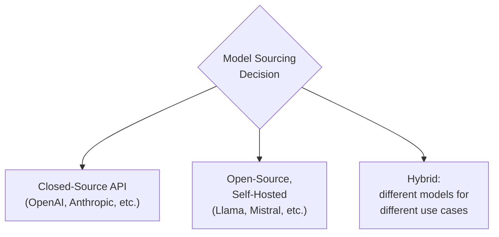
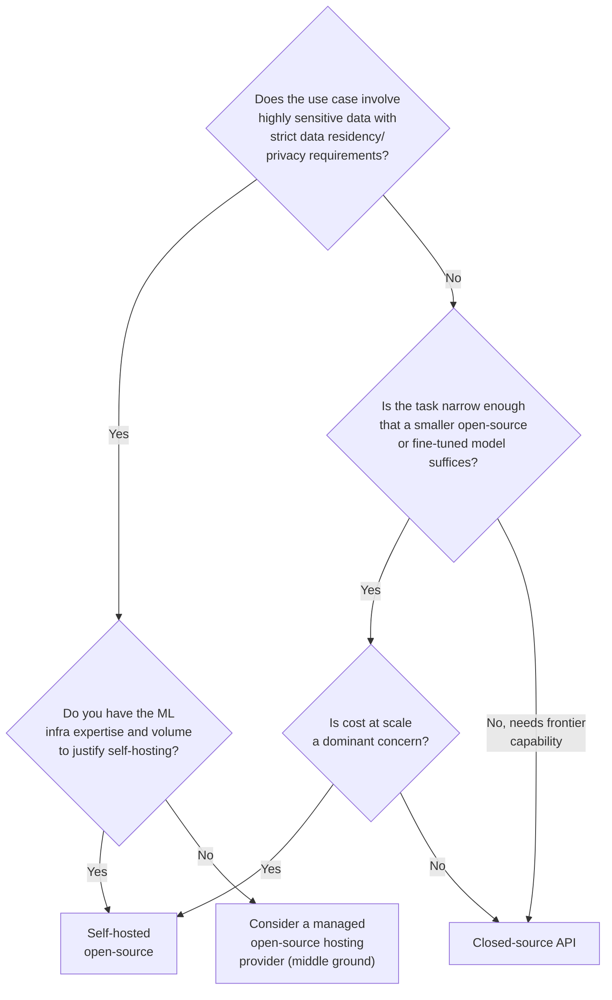

## Introduction

Chapter 36 flagged this as a classic software engineering decision — build vs. buy — newly relevant in the LLM context. This chapter builds a structured framework for the decision every LLM system design ultimately confronts: use a **closed-source model via API** (OpenAI, Anthropic, Google), self-host an **open-source model** (Llama, Mistral, and others), or some **hybrid** of both. This is rarely a purely technical decision — it involves cost, control, compliance, and organizational capability trade-offs that a strong system design answer must address explicitly.

## The Three Options

### Closed-Source API

Call a commercial provider's API (e.g., OpenAI's GPT models, Anthropic's Claude, Google's Gemini) — the model itself runs on the provider's infrastructure; you send a request and receive a response.

**Strengths**: zero infrastructure to build or maintain (no GPU provisioning, no serving framework setup — Part 10's entire inference-optimization discussion becomes the provider's problem, not yours); typically the most capable models available, since frontier labs invest the enormous compute (Chapter 40's scaling law discussion) that few organizations can match; rapid time-to-market, since integration is simply an API call away.

**Weaknesses**: ongoing, usage-based cost that scales with volume (Chapter 42's pricing discussion) and can become substantial at scale, with less direct control over that cost structure than owning your own infrastructure; **data leaves your infrastructure** — sending user data (potentially sensitive, per Chapter 11) to a third party raises genuine privacy and compliance questions that must be addressed contractually and architecturally, not assumed away; dependency on the provider's uptime, pricing changes, and model deprecation schedule — a real vendor lock-in risk.

### Open-Source, Self-Hosted

Download an open-source (or "open-weights," to be precise — most "open-source" LLMs release the trained weights, not necessarily the training code or data) model and run it on your own infrastructure, using the serving techniques from Part 6 and Part 10.

**Strengths**: full data control — nothing leaves your infrastructure, directly addressing the privacy/compliance concern above; potentially lower cost at sufficient scale, since you're paying for compute infrastructure directly rather than a provider's margin on top of it; full control over fine-tuning, customization, and versioning — no dependency on a provider's decision to deprecate a model version.

**Weaknesses**: you now own the entire operational burden this series has spent Parts 6-7 building — serving infrastructure, scaling, monitoring, and the specialized expertise needed to operate LLM inference efficiently (Part 10); open-source models, while closing the gap rapidly, have historically lagged frontier closed-source models in raw capability, especially for the most demanding reasoning tasks; the upfront infrastructure investment (GPUs, engineering time) is a real, often underestimated cost that only pays off at sufficient sustained volume.

### Hybrid

Use different models for different parts of a system, based on each specific sub-task's requirements — directly echoing this series' recurring right-sizing theme (Chapters 16, 20, 40).

## A Decision Framework

Walking through the key questions:

1. **Data sensitivity and compliance**: does the use case involve data (health, financial, legal) subject to strict residency or third-party-sharing restrictions (Chapter 11)? This can make self-hosting a hard requirement rather than a preference, regardless of the other trade-offs.
2. **Required capability level**: does the task genuinely require frontier-level reasoning, or is it narrow and well-defined enough that a smaller, open-source, or fine-tuned model (Part 9) already meets the bar? Chapter 40's diminishing-returns lesson applies directly here.
3. **Volume and cost trajectory**: at low volume, a closed-source API's usage-based pricing is almost always cheaper than the fixed infrastructure investment of self-hosting; at sufficiently high, sustained volume, the economics can flip — this crossover point is a genuine, calculable break-even analysis (developed further in Chapter 42).
4. **Organizational capability**: does the team have (or is it willing to build) the ML infrastructure expertise from Parts 6-7 and Part 10 needed to operate self-hosted inference reliably? Self-hosting without this capability trades a vendor dependency for an operational risk that may be worse.

## A Middle Ground: Managed Open-Source Hosting

It's worth explicitly naming a middle option this framework's two-way split can obscure: **managed hosting providers** for open-source models (e.g., cloud-provider-hosted endpoints, or specialized inference platforms) let you use an open-source model's weights and data-control benefits while offloading the infrastructure operation burden to a third party — a genuine hybrid point on the build-vs-buy spectrum, trading some of self-hosting's cost savings and control for reduced operational burden, without fully committing to a closed-source provider's proprietary model and complete data-handling terms.

## Cost Modeling: A Preview of Chapter 42

The full quantitative cost comparison — API pricing per token vs. amortized infrastructure cost per token generated — belongs to Chapter 42, but the framework here is worth previewing: self-hosting has a **high fixed cost, low marginal cost** profile (GPUs must be provisioned and paid for regardless of utilization, but each additional request costs relatively little once that infrastructure exists), while API usage has a **near-zero fixed cost, higher marginal cost** profile (no upfront investment, but every single request has a direct, proportional cost). This is the exact same fixed-vs-variable cost structure that governs many other build-vs-buy decisions in software engineering generally — the LLM context doesn't change the underlying economic logic, just the specific numbers involved.

## Vendor Lock-In and Portability

A genuine risk specific to closed-source APIs: prompts, fine-tuning data, and integration code can become subtly tailored to a specific provider's model behavior, tokenizer (Chapter 38), and API conventions, making a later switch to a different provider more costly than it might first appear — directly connecting to Chapter 27's protocol-choice discussion, where a well-architected system maintains clean separation between core business logic and the specific external service it calls, precisely to keep this kind of future migration option open and affordable, exactly as recommended there for REST/gRPC choices.

## Key Takeaways

- The build-vs-buy decision for LLMs resolves into closed-source API, self-hosted open-source, or a hybrid — each with genuine trade-offs in cost structure, data control, capability, and operational burden.
- Data sensitivity and compliance requirements can make self-hosting a hard requirement rather than a preference; required capability level and volume/cost trajectory otherwise drive the decision.
- Self-hosting has a high-fixed-cost, low-marginal-cost profile; API usage has a near-zero-fixed-cost, higher-marginal-cost profile — the same fixed-vs-variable cost logic governing many other build-vs-buy decisions in software engineering.
- Vendor lock-in is a genuine, underappreciated risk with closed-source APIs — clean architectural separation between core logic and the specific provider's API keeps future migration options open, mirroring the same discipline recommended for protocol choices in Chapter 27.

---

## Interview Questions

**1. What are the three main options for sourcing an LLM for a production system, and what's the fundamental trade-off between the first two?**
The three main options are using a closed-source model via a commercial API, self-hosting an open-source model on your own infrastructure, and a hybrid approach using different models for different use cases; the fundamental trade-off between closed-source API and self-hosted open-source is between operational simplicity and typically superior raw capability (closed-source API) versus full data control and potentially lower cost at sufficient scale, at the cost of taking on the full operational burden of serving infrastructure yourself (self-hosted open-source) — essentially the classic build-vs-buy trade-off between convenience/capability and control/cost, now applied specifically to LLM model sourcing.
*Follow-up: Why might this decision NOT be purely a technical one, even though it's framed as an "AI system design" question?*
The decision involves genuine business and compliance considerations beyond pure technical merit — data privacy and regulatory compliance requirements (Chapter 11) can make one option a hard legal requirement regardless of technical preference, cost structure trade-offs involve genuine financial planning and risk tolerance decisions that go beyond engineering judgment alone, and vendor lock-in risk involves a strategic business consideration about dependency on a third party — meaning a complete answer to this question needs to incorporate these non-purely-technical dimensions explicitly, rather than treating it as a decision that can be resolved on technical merit (like raw model capability) alone.

**2. Why can data privacy and compliance requirements sometimes make self-hosting a "hard requirement" rather than merely a preference, connecting back to Chapter 11?**
For data subject to strict regulatory requirements around data residency (data must remain within specific geographic or organizational boundaries) or restrictions on sharing with third parties (as can apply to health data under HIPAA, or certain financial or government data), sending that data to a third-party API provider — even one with strong security practices and contractual data-handling commitments — may simply not be legally permissible at all, regardless of how strong the provider's privacy commitments are, making self-hosting (keeping all data processing entirely within the organization's own controlled infrastructure) not just the more cautious choice but a genuine legal and compliance necessity that overrides other considerations like cost or convenience.
*Follow-up: How would you determine, for a specific new project, whether this kind of hard data-residency requirement actually applies, rather than assuming it does or doesn't?*
I'd involve the organization's legal and compliance team early in the project's scoping phase (echoing Chapter 11's DPIA discussion) to definitively determine what data-handling requirements actually apply to the specific data this project would process, rather than an engineering team independently guessing or assuming based on general impressions of the data's sensitivity — this determination genuinely requires legal expertise specific to the applicable regulations and the organization's own contractual obligations, and getting this wrong (either being overly restrictive when not actually required, or insufficiently restrictive when a genuine requirement does apply) carries real cost or genuine legal risk respectively, making this exactly the kind of decision that shouldn't be made by engineering judgment alone.

**3. Explain the "high fixed cost, low marginal cost" versus "near-zero fixed cost, higher marginal cost" distinction between self-hosting and API usage, and why this determines a volume-dependent break-even point.**
Self-hosting requires provisioning and paying for GPU infrastructure (Chapter 16) regardless of how much it's actually utilized — this is a largely fixed cost that must be paid whether you process 100 requests or 100,000 requests in a given period, but once that infrastructure exists, each additional request processed costs relatively little in marginal terms (mostly just the electricity and wear on already-paid-for hardware); API usage has essentially no upfront fixed cost (you can start making API calls immediately with no infrastructure investment), but each individual request has a direct, proportional per-token cost that scales linearly with usage — at low volume, the API's low fixed cost makes it cheaper overall (self-hosting's fixed cost isn't justified by so few requests), but at sufficiently high, sustained volume, the API's accumulating per-request costs can exceed what the self-hosted infrastructure's fixed cost, spread across that much larger volume, would have cost instead — creating a genuine, calculable break-even point where the more economical choice flips from one option to the other.
*Follow-up: What additional factors, beyond this pure cost calculation, would you need to consider before deciding to switch from an API-based approach to self-hosting once you've crossed this theoretical break-even volume?*
I'd need to factor in the organizational capability question discussed in this chapter — does the team have or is it willing to build the ML infrastructure expertise (Parts 6-7, Part 10) needed to reliably operate self-hosted LLM inference, since a purely cost-based break-even calculation doesn't account for the real risk and effort of building and maintaining this operational capability; I'd also consider whether the specific capability gap between the available open-source model and the currently-used closed-source model (Chapter 40's capability considerations) would meaningfully affect product quality if switched, and whether the migration itself (given the vendor lock-in and prompt-portability concerns discussed in this chapter) would require significant additional one-time engineering effort beyond the ongoing infrastructure cost alone — a purely financial break-even calculation is a necessary but not sufficient basis for this kind of switching decision.

**4. What is vendor lock-in in the context of closed-source LLM APIs, and what specific engineering practice would you recommend to mitigate this risk?**
Vendor lock-in refers to the growing difficulty and cost of switching away from a specific provider over time, as a system's prompts, fine-tuning data, and integration code become increasingly tailored to that specific provider's particular model behavior, tokenizer (Chapter 38), and API conventions — even though switching providers might seem straightforward in principle (just call a different API), in practice a system deeply optimized around one specific model's particular quirks and behaviors can require substantial rework to achieve comparable quality with a different provider's model; the recommended mitigation, directly echoing Chapter 27's protocol-choice discussion, is maintaining clean architectural separation between the system's core business logic and the specific LLM provider integration — abstracting the LLM call behind a well-defined internal interface, so that switching providers primarily requires updating that isolated integration layer rather than requiring changes throughout the broader system's business logic.
*Follow-up: Why might this kind of clean architectural separation be harder to fully achieve for LLM integrations specifically, compared to the REST/gRPC protocol abstraction discussed in Chapter 27?*
Unlike REST/gRPC, where the underlying functional behavior (the actual prediction or business logic) is expected to be identical regardless of which protocol carries the request, different LLM providers' models can have genuinely different behavioral characteristics, response styles, and capabilities even when given functionally identical prompts and instructions — meaning true behavioral portability isn't just an interface abstraction problem, since achieving comparable actual output quality after switching providers may require re-tuning prompts, few-shot examples, or even fine-tuning approaches specific to the new model's particular behavior, which is a deeper, more content-level form of lock-in that a clean code-level API abstraction alone doesn't fully solve, even though it does help substantially with the more mechanical aspects of the switch.

**5. How would you approach the "hybrid" option — using different models for different use cases within the same product — as a concrete system design proposal, rather than a vague compromise?**
I'd propose a concrete decomposition of the product's different LLM-dependent features or components, evaluating each one independently against this chapter's decision framework (data sensitivity, required capability level, volume, and cost) — for example, a customer-facing chat feature handling potentially sensitive personal data and requiring nuanced conversational capability might use a closed-source frontier API (given data can be appropriately handled per compliant provider agreements, or is otherwise not sensitive enough to require self-hosting), while a high-volume, narrow, internal classification task (like routing support tickets) might use a smaller, self-hosted, potentially fine-tuned open-source model given its much higher volume and narrower, well-defined task requirements — treating the hybrid decision not as a vague middle ground but as several independent, specifically-justified build-vs-buy decisions applied at the level of individual product components.
*Follow-up: What additional engineering complexity does this hybrid approach introduce, compared to a single, uniform sourcing decision for the entire product?*
A hybrid approach requires maintaining and operating multiple, genuinely different integration paths and potentially different serving infrastructures simultaneously (an API-calling code path for the closed-source component, plus actual self-hosted serving infrastructure — Parts 6-7, Part 10 — for the open-source component), increasing the overall system's operational surface area and requiring the team to maintain expertise and monitoring across both approaches rather than a single, unified one; this added complexity should be weighed against the hybrid approach's cost and capability benefits, following the same "justify the added complexity" principle applied throughout this series, rather than defaulting to a hybrid approach without confirming its component-level justifications actually outweigh this genuine, additional operational overhead.

**6. Why might a "managed open-source hosting" option represent a genuinely distinct middle ground, rather than just being equivalent to either pure self-hosting or pure closed-source API usage?**
Managed open-source hosting (using a cloud provider's or specialized platform's managed endpoint for an open-source model's weights) combines specific benefits from both ends of the spectrum in a way neither pure option alone provides — you retain the open-source model's inherent characteristics (the specific model's known, inspectable behavior, and potentially the ability to fine-tune or customize it, unlike a fully closed-source model) while offloading the operational burden of provisioning and managing the underlying serving infrastructure (unlike pure self-hosting, which requires building this operational capability in-house) — this represents a genuinely distinct point on the trade-off spectrum, trading some of self-hosting's cost savings and full control for reduced operational burden, without fully committing to a closed-source provider's proprietary model and complete data-handling terms, making it a meaningfully different option worth explicitly naming and considering rather than being subsumed entirely into either the "build" or "buy" category.
*Follow-up: What data-privacy trade-off does this managed hosting option typically still involve, compared to fully self-hosting the model on infrastructure entirely within the organization's own control?*
Even with a managed hosting provider running an open-source model on the organization's behalf, the actual data processing (running the model on incoming requests) still occurs on infrastructure controlled by that third-party hosting provider, not entirely within the organization's own infrastructure — meaning some of the same data-residency and third-party-data-handling considerations relevant to closed-source APIs (though potentially with more favorable or customizable contractual terms, given the more specialized, often more enterprise-focused nature of these hosting relationships) still apply to managed hosting, distinguishing it from true, fully in-house self-hosting where data genuinely never leaves infrastructure the organization itself directly controls and operates.

**7. In an interview, how would you respond if an interviewer asked you to justify choosing a closed-source API for a system handling moderately sensitive user data, where self-hosting isn't a strict legal requirement?**
I'd walk through the trade-off explicitly: acknowledging that self-hosting would provide stronger data control, but noting that many closed-source API providers offer specific enterprise agreements with contractual data-handling commitments (e.g., not using submitted data for further model training, data retention limits, specific compliance certifications) that can adequately address moderate sensitivity requirements without the full operational burden and cost of self-hosting; I'd propose validating this specific provider's actual contractual terms and compliance certifications against the specific data sensitivity and regulatory requirements at hand (rather than assuming they're automatically sufficient), and weigh this against the significant operational and capability advantages of the closed-source option (per this chapter's earlier discussion) for a system where self-hosting isn't a hard legal requirement — framing the choice as a reasoned, evidence-based trade-off decision specific to the actual sensitivity level and available contractual protections, rather than a default assumption in either direction.
*Follow-up: What would change your recommendation if the interviewer specified that the data was subject to strict regulatory data-residency requirements after all?*
If strict data-residency requirements genuinely apply, this would override the cost/convenience trade-off discussion entirely, per this chapter's earlier point that such requirements can make self-hosting (or, at minimum, a provider offering specific, verified in-region or dedicated-infrastructure hosting options that satisfy the specific residency requirement) a hard, non-negotiable requirement rather than one factor among several to be weighed against convenience or cost — I'd pivot my recommendation to prioritize whichever specific option genuinely and verifiably satisfies the stated regulatory requirement first, treating this as a threshold, gating constraint that must be satisfied before any other cost-benefit trade-off consideration becomes relevant at all.

**8. How does the "required capability level" question in this chapter's decision framework connect directly to Chapter 40's scaling law discussion?**
Chapter 40 established that a model's general capability (informed by its scale and training) doesn't automatically translate into proportional benefit for any specific, possibly narrower task, and that diminishing returns mean an even more capable (typically closed-source, frontier) model's marginal benefit over a smaller, open-source alternative may be smaller than expected for a specific use case — this directly informs the build-vs-buy decision, since if a narrower, well-defined task doesn't actually require frontier-level general capability (which Chapter 40 cautions shouldn't be assumed without direct validation), a smaller, open-source model (potentially fine-tuned for the specific task, per Chapter 20 and Part 9) may already meet the bar, removing what might otherwise seem like a strong argument for defaulting to an expensive, closed-source frontier API purely on the assumption that "more capability is always better."
*Follow-up: How would you concretely validate, for a specific proposed system, whether an open-source model's capability is actually sufficient, rather than assuming it either is or isn't?*
I'd run the same kind of direct, empirical offline evaluation (Chapter 21) comparing the candidate open-source model's performance against the closed-source alternative's performance, specifically on representative examples of the actual task at hand, rather than relying on general benchmark comparisons or assumptions about relative capability — this concrete, task-specific empirical comparison, following this series' consistent "validate empirically, don't assume from proxies" principle, is the only reliable way to confirm whether the open-source model's capability genuinely suffices for this specific use case, or whether the closed-source model's additional general capability actually translates into a meaningful, measurable improvement for this particular task that would justify its additional cost and reduced data control.

**9. Why might a startup with limited engineering resources generally default toward a closed-source API, even when a cost-based break-even analysis might eventually favor self-hosting at higher volume?**
A startup's limited engineering resources are often better allocated toward building and validating their core product and business model rather than investing significant upfront effort in building and operating LLM serving infrastructure (Parts 6-7, Part 10) — even if a theoretical break-even analysis suggests self-hosting would become more cost-effective at some future volume, a startup may not yet know with confidence whether it will actually reach and sustain that volume, and prematurely investing in self-hosting infrastructure before validating product-market fit and achieving that volume risks wasting scarce engineering resources on infrastructure that may turn out to be unnecessary if the product doesn't scale as hoped — this reflects the same "start simple, escalate when justified by demonstrated need" principle applied throughout this series (e.g., Chapter 13's feature store adoption timing, Chapter 34's automation investment sequencing), now applied to the build-vs-buy LLM sourcing decision specifically.
*Follow-up: What specific, concrete signal would indicate to this startup that it's time to seriously revisit this initial default toward a closed-source API?*
Sustained, validated product-market fit combined with LLM API costs becoming a significant and rapidly growing line item in the company's overall operating expenses (crossing or clearly approaching the theoretical break-even volume discussed earlier in this chapter) would be the concrete signal — at this point, the company has both the demonstrated, sustained volume that justifies the fixed infrastructure investment, and genuine, measurable financial pressure motivating the switch, making the self-hosting investment a well-justified, evidence-based decision rather than a premature, speculative one made before the company had genuine confidence in its sustained scale and product direction.

**10. How would you handle a situation where a stakeholder wants to switch from a closed-source API to a self-hosted open-source model purely to reduce cost, without considering the capability trade-off?**
I'd present a direct, empirical comparison (per this series' consistent evaluation discipline) showing the actual measured capability difference between the currently-used closed-source model and the proposed open-source alternative on the system's actual production tasks and evaluation criteria, alongside the actual cost savings the switch would provide — helping the stakeholder see this as an explicit, quantified trade-off (some specific cost savings, in exchange for some specific, measured capability difference and the added operational burden of self-hosting) rather than a purely cost-driven decision with no other consequence, ensuring the stakeholder makes this decision with full visibility into what's actually being traded off, rather than assuming a "free" cost reduction with no other meaningful downside.
*Follow-up: What would you do if this comparison revealed a capability gap that meaningfully hurt a key business metric (Chapter 6), but the stakeholder still wanted to proceed with the switch purely for cost reasons?*
I'd ensure this trade-off and its quantified business impact are clearly documented and explicitly acknowledged as a deliberate decision (similar to the documentation practice recommended in Chapter 25 for fairness trade-off decisions made against my professional recommendation) — while ultimately respecting that a legitimate business trade-off decision between cost savings and product quality is within the stakeholder's appropriate authority to make once given full, clear visibility into the actual consequences, I'd recommend implementing appropriate ongoing monitoring (Chapter 32/33) specifically tracking the affected business metric post-switch, so the actual real-world impact of this decision can be validated and revisited if the impact proves larger or more damaging than initially anticipated in the pre-switch comparison.

**11. Why might the "open-weights, not open-source" distinction mentioned in this chapter matter for a system designer evaluating an "open-source" LLM option?**
Most models labeled "open-source" in the LLM context release the trained model weights (allowing you to download and run the model yourself) but often do not release the full training code, the specific training data used, or complete details of the training process itself — this distinction matters because it means you generally cannot fully reproduce or deeply audit exactly how the model was trained (limiting some of the reproducibility and auditability benefits Chapter 24 discussed for models you train yourself), and you're still somewhat dependent on the original releasing organization's choices about what data and methodology went into producing those weights, even though you have full control over how you subsequently use, fine-tune, and serve those weights yourself — a meaningfully different and more limited kind of "openness" than what "open-source" might imply in a traditional software context, where source code transparency typically allows full reproducibility and audit of the software's actual construction.
*Follow-up: How might this distinction specifically matter for a fairness auditing (Chapter 25) or explainability (Chapter 24) investigation into an "open-weights" model's behavior?*
Without access to the actual training data and full training methodology, investigating whether a specific behavior or potential bias originates from the training data itself (Chapter 25's data-bias sources discussion) becomes more difficult — you can still audit the model's actual output behavior directly (running the fairness metrics and explainability techniques from Chapters 24-25 against the model's observable predictions, which doesn't require training data access), but you have less ability to trace a specific observed behavior back to its root cause in the original training data or process, compared to a scenario where you had trained the model yourself (or had full access to a genuinely fully-open training pipeline) and could directly inspect and analyze the actual training data and methodology that produced the behavior in question.

**12. How would you use this chapter's decision framework to structure your answer if an interviewer asked you to design a system with the explicit constraint "assume unlimited budget, but data must never leave our own infrastructure"?**
Given the explicit, hard data-residency constraint, I'd immediately eliminate the closed-source API option (and managed open-source hosting, since that also involves a third party's infrastructure) as viable choices regardless of budget, per this chapter's discussion of data sensitivity as a potential hard requirement overriding other trade-offs, and focus the design specifically on self-hosting an open-source model — with "unlimited budget" specifically removing the cost-related hesitations that might otherwise favor a smaller, less capable model, allowing me to focus the model-selection discussion on choosing the most capable available open-source model that meets the task's actual requirements (validated per Chapter 21, not assumed from scale alone per Chapter 40), and then focus the bulk of my system design answer on the serving infrastructure (Parts 6-7, Part 10) needed to operate this self-hosted model reliably at whatever scale the system requires.
*Follow-up: Why does explicitly noting that "unlimited budget" specifically removes only ONE dimension of the decision (cost), while leaving the data-residency constraint fully in force, demonstrate careful reading of the interview prompt?*
This shows the candidate is parsing the prompt's specific, precise constraints rather than treating "unlimited budget" as a blanket removal of all decision-making considerations — recognizing that a budget constraint and a data-residency constraint are two entirely independent dimensions of this chapter's decision framework, and that removing one (budget) doesn't imply the other (data residency) is also removed or somehow less important, demonstrates the kind of careful, precise problem-scoping and requirements-parsing skill (echoing Chapter 2's "clarify requirements" step) that distinguishes a strong, attentive system design answer from one that overgeneralizes or misapplies a given constraint beyond its actual, specific scope.

**13. How would you explain to a colleague why "just try both and see which is cheaper" isn't a fully sufficient approach to the build-vs-buy decision, even though cost is a genuinely important factor?**
I'd explain that a pure cost comparison misses the other genuinely important dimensions this chapter's framework addresses — data privacy and compliance requirements (which can be a hard constraint regardless of relative cost), the actual capability difference between the options (which could meaningfully affect product quality and business metrics even if one option is cheaper), and organizational capability considerations (whether the team can actually reliably operate a self-hosted solution, independent of its theoretical cost advantage) — a decision based purely on cost comparison, without considering these other dimensions, risks either violating a hard compliance requirement, degrading product quality in a way that costs more in lost business value than it saves in infrastructure cost, or committing to an operational burden the team isn't actually equipped to reliably handle, none of which a pure cost comparison would reveal or account for.
*Follow-up: How would you propose structuring a more complete evaluation process that DOES include cost as one input among several, rather than dismissing cost considerations entirely?*
I'd propose evaluating each viable option (having first filtered out any options that fail a hard requirement like data residency) along all of this chapter's key dimensions simultaneously — measured capability difference on the actual task (Chapter 21), quantified cost difference (including this chapter's fixed-vs-marginal cost structure and Chapter 42's more detailed cost modeling), and a realistic assessment of the team's actual capability and willingness to take on additional operational burden if self-hosting is being considered — presenting this as a structured, multi-dimensional comparison (rather than either a pure cost comparison or ignoring cost in favor of purely qualitative considerations) to whatever decision-maker or stakeholder group needs to make the final call, ensuring cost is properly weighed as one significant factor among several rather than either being the sole deciding factor or being dismissed entirely.

**14. Why might the build-vs-buy decision for LLMs need to be revisited periodically, rather than being made once and considered permanently settled?**
The underlying factors driving this decision are all genuinely dynamic over time — open-source model capability continues to improve (potentially closing or even reversing a previous capability gap with closed-source options, per the ongoing scaling and training-efficiency research trends discussed in Chapter 40), closed-source API pricing can change (potentially shifting the cost break-even point discussed earlier in this chapter), an organization's own volume and engineering capability can grow (potentially crossing the break-even threshold that favors self-hosting, or building the operational expertise that previously made self-hosting infeasible), and regulatory requirements can themselves evolve — any of these shifts could reasonably change which option is the best-justified choice for a given system, meaning a decision made and correctly justified at one point in time shouldn't be assumed to remain the correct choice indefinitely without periodic reassessment.
*Follow-up: How would you build a practice of periodically revisiting this decision into a team's normal workflow, rather than relying on someone remembering to proactively reconsider it?*
I'd recommend establishing a periodic (e.g., annual, or tied to a significant volume or cost milestone) review checkpoint specifically for major LLM sourcing decisions, similar in spirit to the periodic review practices recommended elsewhere in this series for data validation rules (Chapter 10) or design system choices — explicitly scheduling this review rather than leaving it to informal, ad-hoc reconsideration, and tracking the key metrics (actual usage volume and cost trend, any newly available open-source models' benchmarked capability relative to the current solution, any changes to the organization's compliance requirements) that would inform whether this periodic review should actually trigger a reconsideration of the current sourcing decision, treating this as a standing, scheduled practice rather than something dependent on any individual team member happening to notice and raise the question.

**15. How would you summarize, for someone moving on to Chapter 42's LLM pricing chapter, why this chapter's build-vs-buy framework is a necessary precursor to that more detailed cost discussion?**
This chapter established the qualitative decision framework — the key dimensions (data sensitivity, capability requirements, volume, organizational capability) that determine whether closed-source API, self-hosted open-source, or a hybrid approach is the right starting point for a given system — while Chapter 42 will provide the detailed, quantitative cost modeling needed to actually calculate the specific break-even volume and make a precise, numbers-based version of the volume-and-cost dimension of this decision; without this chapter's broader framework first, Chapter 42's cost calculations would lack the necessary context for when cost should even be the deciding factor at all (as opposed to being overridden by a hard data-residency requirement, for example), making this chapter's qualitative framework a necessary foundation for correctly interpreting and applying Chapter 42's more detailed quantitative cost analysis.
*Follow-up: What single question from this chapter's decision framework would you recommend a reader keep in mind as the most important filter to apply BEFORE diving into Chapter 42's detailed cost calculations?*
The data sensitivity and compliance question should be applied first and treated as a potential gating constraint — since, as this chapter established, a genuine hard data-residency or compliance requirement can eliminate the closed-source API option entirely regardless of what a subsequent cost analysis might otherwise suggest, applying Chapter 42's detailed cost modeling to compare options that include a closed-source API when that option is actually legally or contractually foreclosed by a genuine compliance requirement would be a wasted analytical effort — checking this gating question first ensures Chapter 42's more detailed cost analysis is applied only to the set of options that are actually legitimately available for the specific system being designed.
