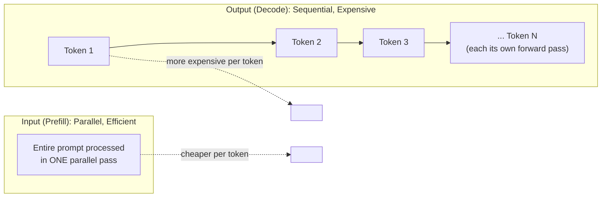

## Introduction

Chapter 41 established the build-vs-buy decision framework and previewed that a full cost comparison belonged here. This chapter delivers the quantitative cost modeling — how LLM API pricing actually works, why input and output tokens are priced differently, how to build a genuine cost forecast for a proposed system, and how to compute the self-hosting break-even point referenced in Chapter 41. This is one of the most directly interview-testable topics in this Part, since "estimate the cost of this system" is a common, concrete follow-up to almost any LLM system design question.

## Token-Based Pricing, Concretely

As established in Chapter 38, LLM cost is denominated in tokens, not requests. Commercial API pricing is typically expressed as a cost **per million tokens**, with separate rates for **input tokens** (the prompt you send) and **output tokens** (the text the model generates).

```python
def estimate_request_cost(input_tokens: int, output_tokens: int,
                            input_price_per_million: float,
                            output_price_per_million: float) -> float:
    input_cost = (input_tokens / 1_000_000) * input_price_per_million
    output_cost = (output_tokens / 1_000_000) * output_price_per_million
    return input_cost + output_cost

# Illustrative pricing (actual rates vary by provider and model tier,
# and change frequently — always verify current rates before using
# real numbers in a production cost forecast).
cost = estimate_request_cost(
    input_tokens=2000,   # e.g., a system prompt + retrieved RAG context
    output_tokens=300,    # a moderate-length generated response
    input_price_per_million=3.00,
    output_price_per_million=15.00,
)
print(f"Estimated cost for this single request: ${cost:.5f}")
```

## Why Output Tokens Cost More Than Input Tokens

This asymmetry — output tokens typically priced several times higher than input tokens — is not arbitrary; it follows directly from Chapter 37's architectural discussion. Processing input tokens (the "prefill" phase) can be done in a single, efficient, parallelized forward pass across the entire prompt at once. Generating output tokens (the "decode" phase) is **inherently sequential** — Chapter 37 and Chapter 39 both established that each output token requires its own full forward pass through the model, dependent on every token generated before it. This sequential, one-token-at-a-time computation is fundamentally less hardware-efficient than the parallel prefill pass, directly justifying the higher per-token price for output — a cost structure that is a direct, traceable consequence of the transformer architecture, not a pricing choice made independent of the underlying technology.



**System design implication**: since output tokens are the more expensive resource, a system design that can reduce *generated* output length — a concise system prompt instruction, a well-scoped task that doesn't require lengthy explanation, or structured output formats (Chapter 79 will cover this) that avoid verbose natural-language padding — has an outsized cost impact compared to an equivalent reduction in input/prompt length.

## Building a Full System Cost Forecast

A realistic cost forecast for an LLM-based feature requires estimating several factors together, not just a single per-request cost:

```python
def forecast_monthly_cost(
    requests_per_day: int,
    avg_input_tokens_per_request: int,
    avg_output_tokens_per_request: int,
    input_price_per_million: float,
    output_price_per_million: float,
    cache_hit_rate: float = 0.0,  # Ch. 29's caching discussion applies directly
) -> dict:
    effective_requests_per_day = requests_per_day * (1 - cache_hit_rate)

    daily_input_tokens = effective_requests_per_day * avg_input_tokens_per_request
    daily_output_tokens = effective_requests_per_day * avg_output_tokens_per_request

    daily_cost = (
        (daily_input_tokens / 1_000_000) * input_price_per_million
        + (daily_output_tokens / 1_000_000) * output_price_per_million
    )

    return {
        "daily_cost": daily_cost,
        "monthly_cost": daily_cost * 30,
        "effective_requests_per_day": effective_requests_per_day,
    }

forecast = forecast_monthly_cost(
    requests_per_day=50_000,
    avg_input_tokens_per_request=2_500,   # system prompt + RAG context (Part 11)
    avg_output_tokens_per_request=350,
    input_price_per_million=3.00,
    output_price_per_million=15.00,
    cache_hit_rate=0.15,  # some fraction of queries repeat, per Ch. 29
)
print(forecast)
```

**Every input to this forecast is itself a system design decision this series has already covered**: `avg_input_tokens_per_request` depends on system prompt length (Chapter 43) and RAG retrieval strategy (Part 11); `avg_output_tokens_per_request` depends on decoding/prompting choices (Chapter 39, Chapter 43); `cache_hit_rate` depends on the caching strategy from Chapter 29, now applied to LLM responses specifically. Cost modeling isn't a separate exercise bolted onto system design — it's a direct, quantified consequence of the design choices made throughout the rest of the system.

## Self-Hosting Cost Modeling and the Break-Even Point

Chapter 41 introduced the fixed-vs-marginal cost structure conceptually; here's the quantitative version.

```python
def self_hosting_break_even(
    gpu_hourly_cost: float,
    gpu_hours_per_month: int,  # e.g., 730 for continuous, always-on serving
    tokens_per_second_per_gpu: float,
    api_input_price_per_million: float,
    api_output_price_per_million: float,
    avg_input_tokens_per_request: int,
    avg_output_tokens_per_request: int,
) -> dict:
    monthly_infra_cost = gpu_hourly_cost * gpu_hours_per_month

    seconds_per_month = gpu_hours_per_month * 3600
    total_tokens_capacity = tokens_per_second_per_gpu * seconds_per_month

    # Rough blended API cost per token, weighted by typical request shape
    total_tokens_per_request = avg_input_tokens_per_request + avg_output_tokens_per_request
    blended_price_per_million = (
        (avg_input_tokens_per_request * api_input_price_per_million
         + avg_output_tokens_per_request * api_output_price_per_million)
        / total_tokens_per_request
    )

    break_even_tokens = monthly_infra_cost / (blended_price_per_million / 1_000_000)
    break_even_requests = break_even_tokens / total_tokens_per_request

    return {
        "monthly_infra_cost": monthly_infra_cost,
        "max_token_capacity": total_tokens_capacity,
        "break_even_requests_per_month": break_even_requests,
    }

result = self_hosting_break_even(
    gpu_hourly_cost=2.50,
    gpu_hours_per_month=730,
    tokens_per_second_per_gpu=50,
    api_input_price_per_million=3.00,
    api_output_price_per_million=15.00,
    avg_input_tokens_per_request=2_500,
    avg_output_tokens_per_request=350,
)
print(result)
```

This is precisely the calculation that answers Chapter 41's "at what volume does self-hosting become cheaper" question with actual numbers — below the computed break-even request volume, the API remains cheaper (the fixed GPU cost isn't yet justified); above it, self-hosting's amortized fixed cost per request drops below the API's flat per-token pricing.

## Cost Optimization Levers: A Summary Connecting the Whole Series

| Lever | Chapter | Effect on Cost |
|---|---|---|
| Reduce output length | 39, 43 | Directly reduces the more expensive output-token cost |
| Prompt caching | 29 | Avoids reprocessing identical/near-identical input repeatedly |
| Model compression / smaller model | 28, 40 | Reduces per-token compute cost directly |
| Efficient RAG retrieval (fewer, better chunks) | 37, Part 11 | Reduces input token count without sacrificing answer quality |
| Right-sized model per sub-task | 40, 41 | Avoids paying frontier-model prices for narrow tasks that don't need it |

## A Word on Volatility

LLM API pricing changes frequently — often dropping significantly as providers compete and as underlying serving efficiency improves (echoing Chapter 40's training-efficiency trend, now applied to inference). A cost forecast built today should be treated as a snapshot, not a permanent fact — the same way Chapter 32 treated a monitoring baseline as something to periodically revisit, a cost model should be re-validated against current pricing on a regular cadence, particularly before any major budget commitment or build-vs-buy decision.

## Key Takeaways

- LLM API pricing is per-token, with input and output tokens priced separately — output tokens cost more, a direct consequence of generation's inherently sequential computation (Chapter 37, Chapter 39), not an arbitrary pricing decision.
- A full cost forecast requires estimating request volume, average input and output token counts per request, and cache hit rate — each of these inputs is itself a consequence of design decisions covered elsewhere in this series (system prompt design, RAG retrieval strategy, caching).
- Self-hosting's break-even point against API pricing can be computed directly by comparing fixed monthly infrastructure cost against the blended per-token API price and expected request volume.
- Cost optimization levers span the whole series — output length reduction, caching, compression, efficient retrieval, and right-sized model selection all compound to reduce total system cost, and pricing itself should be treated as a volatile, frequently-changing input to revisit regularly.

---

## Interview Questions

**1. Why are LLM API output tokens typically priced several times higher than input tokens, and how does this trace back to the transformer architecture covered in Chapter 37?**
Input tokens are processed in a single, efficient, parallelized forward pass across the entire prompt at once (the "prefill" phase), while output tokens must be generated one at a time, sequentially, with each token requiring its own full forward pass dependent on every previously generated token (the "decode" phase) — this sequential generation process is fundamentally less hardware-efficient than the parallel prefill computation, directly justifying providers charging more per output token, since generating each output token genuinely consumes proportionally more computational resources per token than processing an input token does, making this pricing asymmetry a direct, traceable consequence of the underlying architecture's computational characteristics rather than an arbitrary business decision.
*Follow-up: What system design implication follows from understanding that this pricing asymmetry stems from a genuine, architecture-driven computational cost difference, rather than an arbitrary pricing choice?*
Understanding the genuine computational basis for this asymmetry reinforces that optimizing to reduce *output* token length specifically (rather than only focusing on reducing input/prompt length) has an outsized cost-saving impact per token saved, and that this isn't merely a pricing quirk that might change arbitrarily — it's tied to a fundamental, architecture-level computational reality that's likely to persist in some form even as specific pricing numbers change over time (per this chapter's volatility discussion), giving more durable confidence that output-length optimization efforts (concise prompting instructions, structured output formats) represent a genuinely sound, lasting cost-optimization strategy rather than one based on a potentially temporary pricing artifact.

**2. Walk through how you would build a monthly cost forecast for a proposed LLM-based customer support chatbot, identifying each required input and where it comes from.**
I'd need: expected request volume (informed by the business context and expected user base, similar to the traffic estimation discussed in Chapter 5), average input tokens per request (determined by the system prompt length from Chapter 43, plus any retrieved RAG context from Part 11, plus the conversation history accumulated so far per Chapter 38's context window discussion), average output tokens per request (determined by the expected response length, itself influenced by prompting instructions and decoding configuration from Chapters 39 and 43), the specific model's per-token input and output pricing (verified against current provider rates, per this chapter's volatility caution), and an estimated cache hit rate if caching (Chapter 29) is implemented for repeated or similar queries — combining these into the forecast formula this chapter demonstrated to produce a daily and monthly cost estimate.
*Follow-up: Which of these inputs would you expect to be hardest to estimate accurately before the system has actually launched, and how would you handle that uncertainty?*
Average output tokens per request and the eventual cache hit rate are typically hardest to estimate accurately before launch, since they depend on actual user behavior and query patterns that aren't fully knowable until the system is live and being used by real users; I'd handle this uncertainty by building the cost forecast with a range of plausible values (a conservative/pessimistic case and an optimistic case) rather than a single point estimate, clearly communicating this uncertainty range to stakeholders rather than presenting a potentially false sense of precision, and planning to closely monitor actual token usage (per Chapter 33's observability discussion) immediately after launch to quickly validate or correct the initial forecast's assumptions with real, measured data.

**3. Why does prompt caching (Chapter 29) have a particularly significant cost impact for LLM systems specifically, compared to its impact on classical ML serving costs?**
Since LLM cost scales directly and substantially with the number of input tokens processed (unlike a classical ML model, where the computational cost of a single inference is typically much less sensitive to input size within a reasonable range), avoiding the reprocessing of a large, expensive input (like a lengthy system prompt or substantial retrieved RAG context, per Chapter 38's discussion) through caching provides a direct, proportionally larger cost savings for LLM systems than the equivalent caching optimization would typically provide for a classical ML system, where the marginal cost of processing a given input was already comparatively small and less sensitive to input length in the first place.
*Follow-up: What specific type of content in an LLM system's input would benefit most from caching, given this chapter's cost structure discussion?*
The system prompt (Chapter 43) and, where applicable, static or slowly-changing retrieved context (certain RAG use cases, Part 11) are prime caching candidates, since they're often identical or very similar across many different requests — some LLM providers even offer specific "prompt caching" features that recognize and specifically discount a repeated prefix (like an unchanged system prompt) across multiple requests, directly reducing the cost of the input-token portion that doesn't actually vary between calls, which is a direct, provider-supported implementation of exactly this chapter's caching cost-optimization principle applied specifically to the LLM pricing structure.

**4. How would you calculate the self-hosting break-even point for a proposed system, and what does crossing this threshold actually mean in practical terms?**
I'd calculate the total fixed monthly cost of the necessary self-hosting infrastructure (GPU cost, typically expressed as an hourly rate multiplied by the hours of operation needed per month), determine the infrastructure's total token-processing capacity over that same period (based on the hardware's tokens-per-second throughput, per Part 10's inference optimization concepts), and compare the resulting cost-per-token of self-hosting that capacity against the blended per-token cost of using a commercial API for an equivalent volume and mix of input/output tokens — the break-even point is the specific request volume at which these two costs become equal; crossing this threshold in practical terms means that, at request volumes above this point, self-hosting's fixed infrastructure cost, spread across that larger volume, produces a lower effective cost per request than continuing to pay the API's flat per-token rate for that same, larger volume would cost.
*Follow-up: Why might the ACTUAL, realized break-even point in practice differ meaningfully from this theoretical calculation?*
The theoretical calculation typically assumes the self-hosted infrastructure operates at or near its full token-processing capacity continuously, but real production traffic is rarely perfectly steady — it fluctuates throughout the day and week (echoing Chapter 29's auto-scaling discussion), meaning self-hosted infrastructure provisioned for peak capacity will often sit underutilized during lower-traffic periods, effectively raising the real-world cost-per-token above the theoretical, full-utilization calculation; additionally, the theoretical calculation typically doesn't account for the added engineering and operational cost (staff time, tooling, potential reliability incidents) of actually running the self-hosted infrastructure, both of which mean the theoretical break-even point calculated from pure infrastructure cost alone likely understates the true request volume needed before self-hosting becomes genuinely, practically more cost-effective than the API alternative, once these additional real-world factors are properly accounted for.

**5. Why is it important to treat an LLM cost forecast as a "snapshot, not a permanent fact," given the volatility discussion in this chapter?**
LLM API pricing has historically changed frequently and often substantially, as providers compete with each other and as underlying serving efficiency (inference optimization techniques, hardware improvements) continues to improve — a cost forecast built using today's specific pricing numbers could become significantly inaccurate within months as pricing shifts, meaning a team that treats an initial cost forecast as a fixed, permanent fact rather than a snapshot subject to regular revalidation risks making budget commitments, build-vs-buy decisions (Chapter 41), or pricing decisions for their own product based on assumptions that no longer reflect current reality.
*Follow-up: How would you build a practice into a team's workflow to keep cost forecasts and break-even analyses reasonably current, rather than relying on a single, one-time calculation?*
I'd recommend establishing a periodic (e.g., quarterly) review specifically re-validating key cost model inputs — current API pricing rates, actual observed token usage patterns from production monitoring (Chapter 33), and any changes in the available self-hosting infrastructure cost or efficiency — treating this as a standing, scheduled practice similar to the periodic review practices recommended elsewhere in this series (Chapter 10's data validation rule review, Chapter 41's build-vs-buy periodic reconsideration), rather than a one-time exercise performed only during initial system design and never revisited, ensuring cost-related decisions remain grounded in current, accurate information rather than potentially stale assumptions.

**6. In an interview, if asked to estimate the monthly cost of a proposed LLM-based feature with only rough, order-of-magnitude information available, how would you structure your estimation approach?**
I'd explicitly state my assumptions for each required input (following Chapter 2's "state assumptions and proceed" principle when precise information isn't available) — a reasonable estimate for expected daily request volume based on the stated business context, a reasonable estimate for average input and output token counts based on the nature of the described task (using this chapter's tokenization heuristics from Chapter 38 as a starting point), and current, approximate publicly-known API pricing for a reasonable candidate model — then walk through the calculation transparently, arriving at an order-of-magnitude cost estimate while explicitly noting that this is a rough approximation that would need refinement with more precise information (like actual expected traffic patterns and realistic prompt/response lengths) before being used for an actual budget commitment.
*Follow-up: Why is showing your calculation methodology explicitly, rather than just stating a final number, particularly valuable in this kind of interview scenario?*
Showing the explicit calculation methodology (which specific assumptions were made, and how they combine into the final estimate) allows the interviewer to evaluate your underlying reasoning process and identify exactly which assumption they might want to challenge or refine (e.g., "what if actual traffic is 10x higher than you assumed") — demonstrating the ability to reason through this kind of estimation problem systematically is generally more valuable to an interviewer than simply producing a plausible-sounding final number, since it reveals whether you actually understand the underlying cost drivers (as covered throughout this chapter) or are just guessing at a number without genuine understanding of what specifically determines it.

**7. Why might reducing RAG-retrieved context length (Part 11 preview) be a more cost-effective optimization lever than reducing conversation history length, for a system where both consume significant input tokens?**
This depends on the specific system's actual usage pattern, but the more direct connection to this chapter's principles is: any reduction in the total input token count (regardless of which specific component — retrieved context or conversation history — is reduced) proportionally reduces the input-token cost, but retrieved context is often more directly and immediately controllable through the retrieval strategy itself (e.g., retrieving fewer, more carefully re-ranked and selected chunks — a topic developed fully in Part 11) without necessarily degrading the user's actual experience, whereas aggressively reducing conversation history could more directly and noticeably degrade the user's experience by causing the model to "forget" relevant earlier context in the ongoing conversation — meaning the retrieved-context reduction lever often has a more favorable cost-reduction-to-quality-impact ratio than the conversation-history reduction lever for many typical use cases, though this should still be validated empirically (per Chapter 21) for the specific system rather than assumed universally.
*Follow-up: How would you validate, empirically, which of these two levers provides a better cost-to-quality trade-off for a specific system, rather than assuming one is universally preferable?*
I'd run a controlled comparison (following Chapter 22's A/B testing discipline) testing different configurations of retrieved-context length and conversation-history length independently, measuring both the resulting cost impact (directly calculable per this chapter's cost model) and the resulting quality/user-satisfaction impact (via the online metrics from Chapter 6) for each configuration — using this specific, empirical evidence for the system in question to determine which lever, or what combination of both, provides the best actual cost-to-quality trade-off for that particular system's specific use case and user base, rather than assuming a general principle (like "reduce retrieved context before conversation history") applies universally without validation.

**8. How would you explain to a stakeholder why a system's LLM costs might be dominated by a small fraction of unusually long user interactions, rather than being evenly distributed across all requests?**
I'd explain that because cost scales directly with the number of tokens processed (both input and, more expensively, output, per this chapter's pricing asymmetry discussion), a small number of unusually long conversations (many back-and-forth turns accumulating substantial conversation history, per Chapter 38) or requests involving unusually large amounts of retrieved context or requesting unusually long, detailed generated responses can consume a disproportionately large share of total tokens processed, and therefore total cost, compared to the much larger number of shorter, more typical interactions — this kind of skewed, long-tail cost distribution is a natural consequence of the token-based pricing model applied to naturally variable-length user interactions, rather than an anomaly or a sign of a problem with the system itself.
*Follow-up: How would you use this insight to design a more targeted cost-optimization strategy, rather than applying a uniform optimization approach across all traffic?*
I'd specifically identify and analyze this small subset of unusually long or expensive interactions (using the token-count-per-request logging discussed in this chapter and Chapter 38's monitoring recommendation) to understand what's driving their unusually high cost — is it genuinely necessary, valuable long-form engagement, or is it a symptom of an inefficiency (e.g., unnecessarily long conversation history being retained past the point of genuine relevance, or an overly generous retrieval strategy pulling in more context than actually needed) — and target cost-optimization efforts specifically at this high-cost subset (e.g., implementing more aggressive conversation summarization specifically once a conversation crosses a certain length threshold, per Chapter 38's context-overflow strategies) rather than applying a uniform, potentially quality-degrading optimization (like a blanket reduction in context length) across the much larger population of shorter, already-efficient typical interactions that don't actually need this optimization.

**9. Why might a company choose to absorb higher LLM costs for a specific feature rather than aggressively optimizing for cost reduction, even when cost-optimization techniques are technically available?**
Following the general cost-benefit reasoning established throughout this series (Chapter 6, Chapter 28), if a specific feature's current cost, while notable, still represents a small fraction of the business value or revenue that feature generates, and if the available cost-optimization techniques would meaningfully degrade the user experience or output quality (e.g., aggressively truncating context or reducing response length in a way that noticeably hurts user satisfaction), the company might reasonably conclude that the current cost level, while worth monitoring, doesn't yet justify accepting the quality trade-off that further optimization would require — treating cost optimization as a lever to be applied when justified by the actual cost-to-value ratio, not as an end goal to be maximized regardless of its impact on the actual product experience and business outcomes.
*Follow-up: What specific business or usage signal would indicate that this calculus has shifted, making cost optimization a higher priority than it was previously?*
A significant increase in usage volume that proportionally increases total costs without a corresponding increase in revenue or business value generated by that feature (eroding the previously-acceptable cost-to-value ratio), or increasing competitive pressure making cost efficiency a more important factor in the product's overall unit economics and pricing strategy, would both be concrete signals indicating that cost optimization should be reprioritized — tracking the cost-to-value ratio explicitly over time (rather than monitoring absolute cost alone) provides a more meaningful signal for when this reprioritization decision should actually be triggered, directly connecting this chapter's cost modeling to the broader business-metric awareness this series has emphasized since Chapter 6.

**10. How would you handle a situation where your cost forecast for a new LLM feature, built before launch, turns out to significantly underestimate the actual costs observed after launch?**
I'd first investigate which specific input to the cost model was most responsible for the discrepancy (using the same kind of decomposition approach recommended in Chapter 26 for latency debugging) — was actual request volume higher than forecasted, were actual average input or output token counts significantly larger than assumed (perhaps due to longer real conversations or larger retrieved context than anticipated), or was the achieved cache hit rate lower than assumed — pinpointing the specific driver of the discrepancy rather than treating the entire forecast as simply "wrong" without further diagnosis, and using this specific finding to both correct the immediate cost projection going forward and to improve the accuracy of future cost forecasting methodology for similar features by incorporating whatever lesson this specific discrepancy reveals.
*Follow-up: Why is this kind of specific, decomposed root-cause investigation more valuable than simply revising the overall forecast upward by whatever percentage the actual costs exceeded the original estimate?*
Simply scaling the forecast upward by an observed error percentage treats the discrepancy as an unexplained, generic forecasting error, providing no actionable insight into what specifically should be done differently — a specific, decomposed investigation (was it volume, token counts, or cache rate that was underestimated) reveals a genuine, actionable finding that can inform both immediate corrective action (e.g., if actual output length is much longer than expected, this might motivate a prompting or decoding-strategy adjustment to reduce it, per Chapter 39 and Chapter 43) and improved future forecasting practice (e.g., learning that this type of feature tends to generate longer conversations than initially assumed, informing more accurate assumptions for future, similar cost forecasts), providing genuine forward-looking value beyond simply adjusting a single number after the fact.

**11. Why does this chapter emphasize that "every input to the cost forecast is itself a system design decision covered elsewhere in this series," rather than treating cost forecasting as an isolated, separate skill?**
This reinforces a theme established throughout this entire series — that seemingly separate topics (prompt design, RAG retrieval strategy, caching, decoding configuration) are actually deeply interconnected, with each one directly and quantifiably affecting the system's ultimate cost; treating cost forecasting as an isolated skill, disconnected from these underlying design decisions, would miss the crucial insight that cost isn't simply something to calculate after a system is designed — it's a direct, predictable consequence of the specific design choices made throughout the system, meaning cost considerations should actively inform those design decisions from the start (e.g., choosing a more concise system prompt specifically because of its cost impact, per Chapter 43) rather than being calculated only as an afterthought once the design is already finalized.
*Follow-up: How would you use this integrated understanding to change how you approach a system design interview question, compared to treating cost estimation as a separate, final step tacked onto the end of your answer?*
Rather than designing the full system first and only calculating its cost as a final, separate step at the end, I'd weave cost-consciousness into the design process itself as I go — for example, when discussing the system prompt design (Chapter 43) or RAG retrieval strategy (Part 11), I'd proactively note the cost implications of specific choices at that point in the discussion (e.g., "I'd keep the system prompt concise specifically to minimize the per-request input token cost, given this system's expected high query volume"), demonstrating that cost-awareness is integrated throughout my design thinking rather than being a separate, bolted-on calculation performed only after the "real" design work is already complete — this integrated approach better reflects how cost considerations should genuinely inform real system design decisions in practice, and likely signals stronger, more holistic system design judgment to an interviewer than treating cost estimation as an isolated final checkbox.

**12. How would you use this chapter's break-even calculation methodology to advise a company currently using a closed-source API and considering whether to invest in self-hosting infrastructure?**
I'd first gather the company's actual current usage data (average daily/monthly request volume, actual observed average input and output token counts from their production monitoring, per Chapter 33) rather than relying on rough estimates, and combine this with current, verified API pricing and realistic self-hosting infrastructure cost and throughput estimates (informed by Part 10's inference optimization considerations, since achievable tokens-per-second-per-GPU depends significantly on the specific serving optimizations in place) to calculate the actual, current break-even point using this chapter's methodology — comparing this calculated break-even volume against the company's actual current and projected future volume to give a concrete, evidence-based recommendation, while also factoring in the non-purely-financial considerations from Chapter 41 (organizational capability to operate self-hosted infrastructure, data sensitivity requirements) that a pure break-even calculation alone doesn't capture.
*Follow-up: Why would you specifically recommend using ACTUAL observed production data, rather than the company's original pre-launch estimates, for this break-even calculation?*
Actual observed production data reflects real, validated usage patterns (actual request volume, actual average token counts per request) rather than the necessarily uncertain, potentially inaccurate pre-launch estimates discussed earlier in this chapter — since a break-even analysis is only as reliable as the accuracy of its inputs, using real, measured data (now available since the system has actually launched and been monitored, per Chapter 33) produces a substantially more reliable, trustworthy break-even calculation than continuing to rely on the original, necessarily more speculative pre-launch assumptions, which is exactly why this series has consistently emphasized validating assumptions with real production data wherever possible rather than treating initial estimates as permanently authoritative.

**13. Why might a candidate who proposes "let's just self-host to save money" without any accompanying cost calculation be giving an incomplete answer, even if self-hosting genuinely would save money at the system's actual scale?**
Even if self-hosting would genuinely be the more cost-effective choice at the system's actual scale, asserting this without showing the underlying reasoning or calculation (the fixed infrastructure cost, the expected volume, the resulting break-even comparison, per this chapter's methodology) doesn't demonstrate the quantitative reasoning skill that distinguishes a strong system design answer from a plausible-sounding but unsubstantiated claim — an interviewer generally wants to see the candidate's ability to actually work through this kind of cost-benefit calculation explicitly, not just arrive at a conclusion that happens to be correct without demonstrating the underlying analytical process that would allow them to correctly re-derive the appropriate answer if the specific scale or cost assumptions in the scenario were different.
*Follow-up: How would you structure a complete answer to this same "should we self-host" question that DOES demonstrate this underlying quantitative reasoning, even under interview time constraints?*
I'd briefly state the key inputs needed for the calculation (expected volume, rough self-hosting infrastructure cost, current API pricing), walk through a simplified version of the break-even calculation using reasonable, explicitly-stated assumptions (following this chapter's methodology, even if using round, approximate numbers rather than precise ones given interview time constraints), and arrive at a conclusion explicitly grounded in this calculation — even a rough, quickly-sketched version of this reasoning process, done transparently and explicitly, demonstrates the underlying analytical capability far more convincingly than either a bare, unsubstantiated assertion or spending disproportionate interview time trying to achieve unrealistic numerical precision, striking an appropriate balance between demonstrating genuine reasoning and respecting the interview's time constraints.

**14. How would you factor the multilingual tokenization efficiency disparity from Chapter 38 into a cost forecast for a genuinely global product?**
I'd avoid using a single, blended average token-count assumption across all languages and instead build separate cost estimates (or at least separate token-count assumptions) for major language segments of the user base, using actual measured tokenization ratios for representative content in each major language (per Chapter 38's recommendation to empirically measure rather than assume a single heuristic applies universally) — this produces a more accurate overall cost forecast that properly accounts for the reality that serving certain language markets may be inherently more expensive per equivalent unit of user value, which is important both for accurate overall budget forecasting and for potentially informing language-specific pricing or resource-allocation decisions (echoing the equity and business-strategy considerations raised in Chapter 38's discussion of this same disparity).
*Follow-up: Why might treating this language-specific cost variation as purely a forecasting-accuracy issue, without considering its equity implications (as Chapter 38 raised), be an incomplete response to this consideration in an interview?*
Chapter 38 specifically framed this tokenization disparity as a genuine equity concern, not merely a technical curiosity affecting forecast accuracy — a complete interview answer addressing this consideration would ideally acknowledge both dimensions: the practical cost-forecasting accuracy benefit of language-specific modeling (this chapter's focus), and the broader equity implication that this disparity means users communicating in lower-resource languages may be facing a structurally higher cost or reduced effective context capacity for equivalent value, which is worth explicitly naming as a consideration a thoughtful, complete system design answer would raise, rather than treating the language-specific cost variation as purely a neutral technical detail to be modeled accurately without any acknowledgment of its broader fairness implications, directly connecting this chapter's cost modeling back to Chapter 25's fairness framework and Chapter 38's original equity framing.

**15. How would you summarize, for someone finishing Part 8's foundational chapters (36-42) and moving on to Chapter 43's prompt engineering discussion, why understanding cost modeling is a necessary prerequisite for genuinely effective prompt engineering?**
Chapter 43 will cover how to construct effective prompts — instructions, examples, formatting — but every design choice in that process (how long the system prompt is, how many few-shot examples to include, how much context to provide) has a direct, quantifiable cost consequence established in this chapter; a prompt engineer without this chapter's cost-modeling understanding might optimize purely for output quality without any awareness of the corresponding cost trade-off being made, potentially arriving at an prompt design that's marginally better in quality but disproportionately more expensive than a more concise alternative that achieves nearly the same quality — understanding this chapter's cost mechanics equips a reader to approach Chapter 43's prompt engineering discussion with the full picture: not just "how do I make this prompt produce better output," but "how do I make this prompt produce sufficiently good output at an appropriate, justified cost," which is the more complete, system-design-appropriate framing this series has consistently emphasized throughout.
*Follow-up: What's a concrete question a cost-aware prompt engineer would ask themselves, informed by this chapter, that a cost-unaware prompt engineer might never think to ask?*
A cost-aware prompt engineer would ask "does this additional few-shot example, or this additional paragraph of instruction, or this request for a more detailed/longer response, provide enough marginal quality improvement to justify its marginal token cost, given that this exact same prompt will be sent on every single one of potentially millions of future requests" — this kind of per-token, per-request cost-consciousness, informed directly by this chapter's understanding of how prompt length translates into recurring, compounding cost at scale, is exactly the kind of question a prompt engineer without this chapter's cost-modeling background might never think to explicitly ask, potentially leading to a prompt design that's locally optimized for quality alone without appropriate consideration of its full, scaled cost implications across the system's actual production volume.
