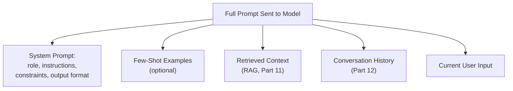
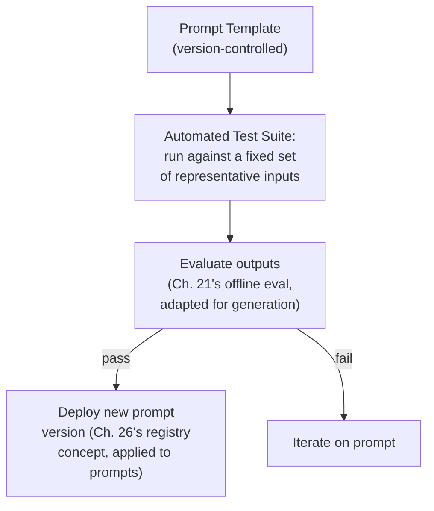

## Introduction

Part 8 closes where Chapter 36 said it would: prompt engineering, the LLM-era analog of feature engineering (Chapter 12), now developed in full. Every chapter in this Part has referenced prompt design as a lever — for cost (Chapter 42), for output length (Chapter 39), for context budget allocation (Chapter 38). This chapter treats prompt engineering as what it actually is in a production system: not a "soft skill" of clever wording, but an engineering discipline with structure, testable components, versioning needs, and failure modes — deserving the same rigor this series has applied to every other system component.

## Anatomy of a Production Prompt



A production prompt is rarely a single block of hand-written text — it's an assembled artifact with distinct, separately-maintained components, each with its own design considerations:

- **System prompt**: sets the model's role, behavioral constraints, and expected output format — persists across every request in a given feature, directly consuming context budget (Chapter 38) and cost (Chapter 42) on every single call.
- **Few-shot examples**: concrete input-output demonstrations that guide the model's behavior through pattern-matching rather than explicit instruction — often more effective than lengthy prose instructions for shaping output format or style, at the cost of additional tokens (echoing Chapter 42's per-example cost calculus).
- **Retrieved context and conversation history**: dynamically assembled per-request (Part 11 and Part 12 respectively) — the system prompt and few-shot examples are the parts of the prompt an engineer directly authors and controls; these are the parts constructed programmatically at request time.

## Core Prompt Engineering Techniques

### Zero-Shot, Few-Shot, and Chain-of-Thought Prompting

- **Zero-shot**: instructing the model to perform a task with no examples, relying entirely on its pre-trained general capability and the clarity of the instruction itself.
- **Few-shot**: providing several concrete examples of the desired input-output behavior — often dramatically improves consistency and format-adherence compared to zero-shot, since the model can pattern-match against concrete demonstrations rather than interpreting abstract instructions.
- **Chain-of-thought (CoT) prompting**: explicitly instructing the model to reason step-by-step before producing a final answer (e.g., "think through this step by step before giving your final answer") — has been shown to meaningfully improve performance on tasks requiring multi-step reasoning, at the direct cost of generating more output tokens (Chapter 42's cost implication) and higher latency (Chapter 39's sequential generation cost).

```python
# Illustrating the same task with three different prompting techniques

zero_shot_prompt = """
Classify the sentiment of this review as positive, negative, or neutral.
Review: "The product arrived on time but broke after two days."
"""

few_shot_prompt = """
Classify the sentiment of each review as positive, negative, or neutral.

Review: "Absolutely love this, works perfectly!"
Sentiment: positive

Review: "Terrible quality, waste of money."
Sentiment: negative

Review: "The product arrived on time but broke after two days."
Sentiment:
"""

chain_of_thought_prompt = """
Classify the sentiment of this review as positive, negative, or neutral.
Think through the reasoning step by step, considering both positive and
negative aspects mentioned, before giving your final classification.

Review: "The product arrived on time but broke after two days."
"""
```

### Structured Output Prompting

For any system where the generated output feeds into further programmatic processing (rather than being displayed directly to a human), instructing the model to produce output in a specific structured format (JSON, a specific schema) is essential — many modern LLM APIs offer explicit "JSON mode" or schema-constrained generation features specifically to make this reliable, rather than relying purely on prompted instructions that the model might not follow perfectly every time.

```python
structured_output_prompt = """
Extract the following fields from the customer message below and
return ONLY valid JSON matching this exact schema, with no additional text:

{
  "issue_category": "billing" | "technical" | "shipping" | "other",
  "urgency": "low" | "medium" | "high",
  "summary": "<one sentence summary>"
}

Customer message: "My package was supposed to arrive three days ago and
I still don't have it, I need this resolved today."
"""
```

This directly matters for system design because a downstream component (a routing system, a database write) needs reliably parseable output — an unstructured, free-text response would require fragile, error-prone parsing logic, directly echoing this series' data-validation discipline (Chapter 10) now applied to the LLM's own output as an upstream "data source" for the rest of the system.

## Prompt Injection: A Preview of a Security Concern

Because a prompt is assembled from multiple sources — some trusted (the system prompt an engineer wrote) and some untrusted (user input, and, in a RAG system, retrieved document content) — a malicious actor can craft input specifically designed to override or subvert the system prompt's original instructions, a vulnerability class called **prompt injection**. This is a genuine security concern this series will address in full depth in Chapter 74, but it's worth flagging here as a direct consequence of how prompts are structurally assembled from mixed-trust sources — precisely the same kind of injection vulnerability class familiar from classical software security (SQL injection, XSS), now manifesting in a new form specific to how LLMs process natural-language input without a hard boundary between "instructions" and "data."

## Prompts as Production Artifacts: Versioning and Testing

This is the chapter's central system design argument: **a prompt is production code and should be managed like it.**



- **Version control**: prompt templates should live in version control, just like application code, with changes reviewed before deployment — a prompt change is a behavior change to the system, exactly as consequential as a code change, and should go through comparable review.
- **Prompt regression testing**: maintain a fixed set of representative test inputs and expected output characteristics (not necessarily exact-match, given generation's inherent variability per Chapter 39, but checkable properties — does it produce valid JSON, does it stay within a length bound, does it avoid a list of prohibited phrases) and run this test suite automatically whenever a prompt changes, catching regressions before they reach production — directly analogous to the CI testing discipline from Chapter 31, now applied to prompt templates instead of model training code.
- **A/B testing prompt changes**: exactly as Chapter 22 established for model changes, a prompt change's real impact on business metrics should be validated through proper randomized experimentation before full rollout, not assumed from offline testing or intuition alone.

```python
# A simplified prompt regression test — checking structural properties
# rather than exact text match, appropriate given generation's
# inherent output variability (Chapter 39).

def test_structured_extraction_prompt(llm_call, prompt_template: str):
    test_cases = [
        "My package was supposed to arrive three days ago...",
        "I was charged twice for my subscription this month.",
        "How do I reset my password?",
    ]

    for case in test_cases:
        response = llm_call(prompt_template.format(customer_message=case))
        try:
            parsed = json.loads(response)
        except json.JSONDecodeError:
            raise AssertionError(f"Prompt regression: output is not valid JSON for input: {case}")

        assert parsed["issue_category"] in ["billing", "technical", "shipping", "other"], \
            f"Invalid category returned: {parsed['issue_category']}"
        assert parsed["urgency"] in ["low", "medium", "high"], \
            f"Invalid urgency returned: {parsed['urgency']}"

    print("All prompt regression tests passed.")
```

## Prompt Engineering and Every Preceding Chapter in This Part

This closing chapter of Part 8 is deliberately an integration point, just as Chapters 30 and 35 were for Parts 6 and 7: a well-engineered prompt is shaped by tokenization awareness (Chapter 38, budgeting context carefully), decoding strategy alignment (Chapter 39, matching temperature/sampling to the task the prompt is designed for), cost-consciousness (Chapter 42, favoring concise instructions and structured output to minimize token usage), and model-capability awareness (Chapter 40, not assuming a smaller model will follow complex chain-of-thought instructions as reliably as a frontier model might). Prompt engineering isn't a separate skill learned in isolation — it's where every concept in Part 8 becomes actionable.

## Key Takeaways

- A production prompt is an assembled artifact with distinct components (system prompt, few-shot examples, retrieved context, conversation history) — not a single hand-written block of text.
- Zero-shot, few-shot, and chain-of-thought prompting represent different points on a cost-versus-reliability trade-off; structured output prompting is essential whenever generated text feeds into further programmatic processing.
- Prompt injection is a genuine security vulnerability class arising directly from how prompts mix trusted (system-authored) and untrusted (user/retrieved) content — covered fully in Chapter 74.
- Prompts should be treated as production code: version-controlled, regression-tested against representative inputs, and validated through proper A/B testing before full rollout — the same rigor this series has applied to every other system component, now applied to the prompt itself.

---

## Interview Questions

**1. Why should a production prompt be thought of as an "assembled artifact with distinct components" rather than a single block of text an engineer writes once?**
A real production prompt combines a static, engineer-authored system prompt and few-shot examples with dynamically-assembled content — retrieved context (Part 11) and conversation history (Part 12) that vary per request — meaning the actual, complete prompt sent to the model on any given request is constructed programmatically at request time from these several distinct sources, not simply written once as a fixed, unchanging string; understanding this decomposition is important because each component has different design considerations, different failure modes, and different levels of trust (as the prompt injection discussion in this chapter highlights), and treating the entire prompt as an undifferentiated single block obscures these important distinctions.
*Follow-up: Why does this decomposition matter specifically for debugging a surprising or incorrect model output in production?*
When investigating a surprising output, decomposing the actual prompt that was sent (as would be captured in the structured logging discussed in Chapter 33) into its constituent parts — was the system prompt correct and unchanged, was the retrieved context actually relevant to the query, was the conversation history appropriately truncated or summarized (Chapter 38) — allows an engineer to isolate which specific component likely caused the problem, rather than needing to inspect one large, undifferentiated block of text and manually figure out which part was actually responsible for the unexpected behavior, directly paralleling this series' general emphasis (e.g., Chapter 26's latency decomposition) on breaking a complex system into its component parts for effective debugging.

**2. Explain chain-of-thought prompting, and describe the specific cost and latency trade-off it introduces, connecting to Chapters 39 and 42.**
Chain-of-thought prompting instructs the model to explicitly reason through a problem step by step before producing its final answer, rather than jumping directly to a conclusion — this has been shown to meaningfully improve accuracy on tasks requiring multi-step reasoning, since it gives the model's own generated reasoning steps a chance to inform and support the final answer, similar to how a human might work through a problem on paper rather than immediately blurting out a guess; the direct cost and latency trade-off is that generating this explicit reasoning text produces substantially more output tokens than a direct answer would, and since output tokens are both more expensive (Chapter 42) and take proportionally longer to generate due to generation's inherently sequential nature (Chapter 39), chain-of-thought prompting directly and measurably increases both the cost and the latency of each request compared to prompting for a direct answer alone.
*Follow-up: How would you decide, for a specific task, whether chain-of-thought prompting's accuracy benefit justifies its cost and latency cost?*
I'd run a direct, empirical comparison (following Chapter 21's offline evaluation discipline) measuring the actual accuracy improvement chain-of-thought prompting provides for the specific task in question against a direct-answer baseline, and weigh this measured improvement against the corresponding measured increase in cost and latency (using Chapter 42's cost modeling and Chapter 5's latency budget framework) — for tasks with a tight latency SLA or high volume (making the added cost significant at scale), a smaller accuracy improvement might not justify chain-of-thought's overhead, while for a lower-volume, higher-stakes task where accuracy matters more than speed or per-request cost, the trade-off may clearly favor using chain-of-thought prompting, following the same empirical, use-case-specific cost-benefit reasoning this series has consistently applied to every other similar trade-off.

**3. Why is structured output prompting (e.g., requesting JSON) described as "essential" specifically when generated text feeds into further programmatic processing, rather than being displayed to a human?**
When a human reads a generated response directly, minor variations in formatting, phrasing, or structure are easily tolerated and understood by the human reader; when a generated response instead feeds into further automated processing (a database write, a routing decision, a downstream API call), that downstream code needs to reliably parse the response into a well-defined, predictable structure — free-form natural language text is inherently variable and unpredictable in its exact structure (echoing the general challenge of evaluating and processing generation, Chapter 3), meaning a downstream parser expecting a specific format could easily fail or misinterpret unstructured output that varies even slightly from call to call, whereas explicitly prompting for (and ideally using a provider's schema-enforcement feature for) a specific structured format like JSON gives the downstream code a much more reliable, predictable contract to parse against.
*Follow-up: Why might relying purely on prompted instructions for structured output (asking nicely for JSON) still be insufficiently reliable for a production system, motivating the mention of "JSON mode" or schema-constrained generation features?*
Even a well-crafted prompt instruction asking for JSON output doesn't provide a hard guarantee that the model will always comply perfectly — the model could occasionally include extraneous explanatory text before or after the JSON, produce slightly malformed JSON, or deviate from the requested schema in some other way, since it's still fundamentally generating free-form text token by token (Chapter 37, Chapter 39) rather than being mechanically constrained to only produce valid JSON; provider-offered schema-constrained generation features directly enforce the output's structural validity at the generation mechanism level itself (constraining which tokens can even be considered at each step to ensure the final output conforms to the specified schema), providing a much stronger, more reliable guarantee than a prompted instruction alone, which is exactly why relying solely on prompted instructions is described as less reliable for production use cases with strict downstream parsing requirements.

**4. Why does this chapter argue that "a prompt is production code and should be managed like it," and what specific practices follow from taking this argument seriously?**
A prompt directly and substantially determines the system's actual behavior — just as consequentially as application code does — meaning an uncontrolled, unreviewed, untested change to a prompt carries the same kind of risk as an uncontrolled, unreviewed, untested change to application code (potentially breaking downstream parsing, degrading quality, increasing cost, or introducing a security vulnerability like prompt injection), and treating prompts as somehow less important or less deserving of engineering rigor than code, simply because they're natural language text rather than a programming language, is a category error; taking this seriously means version-controlling prompt templates, code-reviewing prompt changes, maintaining automated regression tests specifically for prompts (checking structural properties given generation's inherent variability), and validating prompt changes' real business impact through proper A/B testing before full rollout — the same discipline this series has applied to every other production system component.
*Follow-up: What's a concrete, realistic scenario illustrating the real-world cost of NOT following this discipline for prompt management?*
An engineer makes an informal, untested tweak to a system prompt intended to slightly improve response tone, but the change inadvertently causes the model to occasionally include extraneous conversational text before the requested JSON output — since this change wasn't caught by any automated regression test (because none existed) and wasn't validated through a proper staged rollout, it goes directly to full production, where it silently breaks the downstream parsing logic that depends on receiving clean JSON, causing a spike in processing errors that isn't immediately connected back to the seemingly-unrelated, seemingly-minor prompt tweak — a concrete illustration of exactly the kind of preventable production incident that prompt version control, automated regression testing, and staged rollout (this chapter's recommended practices) are specifically designed to catch before they reach production.

**5. How would you design an automated regression test suite for a prompt, given that generation's inherent output variability (Chapter 39) means you generally can't check for an exact-match output?**
I'd design tests that check structural and semantic *properties* of the output rather than exact text matches — for example, confirming the output is valid, parseable JSON matching an expected schema (as this chapter's code example demonstrates), confirming the output falls within an expected length range, confirming it doesn't contain a list of specifically prohibited phrases or patterns, or, for less strictly-structured outputs, using an LLM-as-judge approach (previewed here, covered fully in Part 13) to assess whether the output meets certain qualitative criteria (like staying on-topic or maintaining an appropriate tone) — running this suite of property-based checks against a fixed, representative set of test inputs every time the prompt template changes, catching structural regressions and significant quality deviations even without requiring the output to exactly match a single, fixed expected string.
*Follow-up: Why might it be important to include test cases specifically designed to probe edge cases and adversarial inputs, not just typical, "happy path" inputs, in this regression test suite?*
Typical, happy-path test inputs validate that the prompt behaves correctly under normal, expected conditions, but production systems inevitably encounter unusual, ambiguous, or even adversarial inputs (echoing the prompt injection concern raised in this chapter) that a happy-path-only test suite would never exercise — including specific edge-case tests (unusually long inputs, ambiguous or incomplete customer messages, or deliberately adversarial inputs attempting to manipulate the model's behavior) helps catch prompt regressions or vulnerabilities that would only manifest under these less common but realistically-occurring conditions, providing meaningfully more robust test coverage than a test suite that only validates behavior under ideal, typical conditions.

**6. Why is prompt injection described as "the same kind of injection vulnerability class familiar from classical software security," and what specifically makes it a new, LLM-specific manifestation of this familiar pattern?**
Classical injection vulnerabilities (SQL injection, XSS) arise when untrusted user input is mixed with trusted, developer-authored instructions or code in a way that allows the untrusted input to be interpreted as instructions rather than as inert data, allowing an attacker to manipulate the system's behavior in unintended ways; prompt injection follows exactly this same underlying pattern — untrusted content (user input, or retrieved document content in a RAG system) is combined with trusted, developer-authored instructions (the system prompt) within the same natural-language prompt sent to the model, and because LLMs don't have a hard, mechanically-enforced boundary distinguishing "instructions to follow" from "data to process" the way a properly-parameterized SQL query does, a maliciously-crafted piece of untrusted input can potentially override or subvert the system prompt's original instructions — the specific mechanism (manipulating natural language interpretation rather than exploiting a query parser) is new and specific to LLMs, but the underlying vulnerability pattern (mixing trusted instructions with untrusted data without a hard enforced boundary) is a direct, recognizable descendant of this familiar security vulnerability class.
*Follow-up: Why might this vulnerability be harder to fully and reliably prevent than classical SQL injection, given the mitigation techniques available for SQL injection (like parameterized queries)?*
SQL injection has a well-established, highly effective, and mechanically enforceable mitigation — parameterized queries structurally separate the query's fixed instruction logic from the user-supplied data values at the database driver level, making it essentially impossible for user data to be misinterpreted as query instructions regardless of its content; LLMs, by contrast, process everything as natural language text, and there currently isn't an equally robust, universally effective mechanical technique to structurally guarantee that untrusted content within a prompt can never influence the model's interpretation of the trusted system instructions — while mitigation techniques do exist (some of which Chapter 74 will cover in depth), the fundamental architecture of how LLMs process natural-language prompts makes achieving the same kind of airtight, structurally-guaranteed protection that parameterized queries provide for SQL injection considerably more difficult, an important and sobering distinction for a system designer to understand rather than assuming prompt injection can be as cleanly and completely solved as SQL injection has been.

**7. How would you decide, for a specific task, whether to use few-shot examples versus relying on zero-shot prompting with detailed instructions?**
I'd consider the task's need for consistent formatting or a specific stylistic pattern that might be easier for the model to infer from concrete demonstrations than from abstract written instructions (favoring few-shot), weighed against the additional token cost (Chapter 42) that including several examples adds to every single request — for a task where zero-shot prompting with clear, well-written instructions already achieves acceptable consistency and quality (validated empirically, per Chapter 21), the added cost of few-shot examples may not be justified; for a task where zero-shot prompting produces inconsistent formatting or frequently misses subtle stylistic or structural requirements that are hard to fully specify in prose but easy to demonstrate with a concrete example, few-shot examples often provide a meaningfully better cost-to-quality trade-off despite their added token cost.
*Follow-up: How many few-shot examples would you start with, and how would you decide whether to add more?*
I'd typically start with a small number (2-4) of carefully chosen, representative examples covering the main variations in expected input/output patterns, and empirically evaluate whether this achieves sufficient consistency and quality for the task (per Chapter 21's evaluation discipline) — if quality remains insufficient, I'd consider adding a few more examples specifically covering the failure patterns observed in the initial evaluation, but I'd also weigh each additional example's marginal quality benefit against its marginal token cost (Chapter 42), generally favoring a smaller number of especially well-chosen, diverse examples over a larger number of examples with diminishing marginal value, rather than assuming "more examples is always better" without this kind of empirical, cost-aware validation at each step.

**8. Why might a smaller, less capable model require more careful, more detailed prompt engineering than a larger, more capable frontier model to achieve comparable task performance, connecting back to Chapter 40's scaling discussion?**
As Chapter 40 discussed, a model's general capability (informed by its scale and training) affects how well it can interpret and follow complex, nuanced, or implicit instructions — a smaller, less capable model may need more explicit, detailed instructions, more few-shot examples, or more structured guidance (like explicit chain-of-thought prompting) to reliably achieve a given level of task performance that a larger, more capable model might achieve more easily with a simpler, more concise prompt, since the larger model's greater general capability allows it to correctly infer more from less explicit guidance; this means prompt engineering effort and technique often need to be specifically calibrated to the particular model being used, rather than assuming a single prompt design will transfer equally well across models of very different capability levels.
*Follow-up: What system design implication does this have for a team considering switching from a frontier closed-source model to a smaller, self-hosted open-source model (per Chapter 41's build-vs-buy discussion) purely for cost savings?*
This implies that simply swapping the model while keeping the exact same prompt unchanged may not produce comparable quality results, since the smaller model may need more carefully engineered prompts (more explicit instructions, more few-shot examples, or explicit chain-of-thought guidance) to achieve similar performance to what the frontier model achieved with its original, possibly simpler prompt — a team making this switch should budget for genuine prompt re-engineering and re-validation effort (following Chapter 21's evaluation discipline) as part of the migration cost, rather than assuming the switch is a simple, drop-in model replacement with an unchanged prompt, directly connecting this chapter's prompt engineering discussion to the practical migration costs the vendor-lock-in discussion in Chapter 41 already flagged as a genuine, underappreciated consideration.

**9. In an interview, if asked to design a prompt for extracting structured data from customer support messages, how would you use this chapter's concepts to structure your proposed solution?**
I'd propose a system prompt with an explicit role and clear instructions defining exactly what fields to extract and their expected format, paired with a small number of few-shot examples demonstrating the desired input-output pattern (since consistent structured extraction often benefits meaningfully from concrete examples, per this chapter's few-shot discussion), explicitly requesting output in a well-defined JSON schema (using the provider's schema-constrained generation feature if available, rather than relying purely on prompted instructions, per this chapter's structured-output discussion) — and I'd note that I'd validate this prompt design through the regression testing and staged rollout process this chapter recommends (automated structural checks, then proper A/B testing per Chapter 22) before considering it production-ready, rather than treating the initial prompt draft as a finished, one-time deliverable.
*Follow-up: How would you handle a customer message that doesn't clearly fit into any of the predefined extraction categories?*
I'd explicitly account for this in the schema design (e.g., including an "other" category as this chapter's earlier code example did) and specifically test this edge case in the regression test suite (following this chapter's recommendation to test edge cases, not just happy-path inputs), ensuring the model has an explicit, valid way to represent genuine ambiguity or a poor category fit rather than being forced into an inappropriate misclassification — this kind of deliberate, explicit handling of the "doesn't fit cleanly" case is a good example of designing the prompt and schema with realistic, messy real-world input in mind from the start, rather than only designing for the cleaner, more clearly-categorizable examples that might dominate an initial, less rigorous design and testing process.

**10. How would you explain to a data scientist skeptical of "prompt engineering" as a real discipline (viewing it as unscientific trial-and-error) why this chapter treats it as a genuine engineering practice?**
I'd acknowledge that early, informal approaches to prompt design have sometimes resembled unstructured trial-and-error, but argue that this chapter's framing — treating prompts as version-controlled, testable production artifacts subject to the same rigor as any other code (automated regression testing, staged rollout, proper A/B validation) — transforms prompt engineering from ad-hoc guesswork into a genuine, disciplined engineering practice with the same kind of structured, evidence-based methodology this entire series has applied to every other system component; the "engineering" in "prompt engineering" is earned precisely through this kind of rigor, not through the inherent nature of natural-language instructions being somehow less legitimate as an engineering artifact than a programming language's syntax.
*Follow-up: What specific evidence would you point to, in a real system, to demonstrate that this rigor has actually been applied, rather than just asserting it should be?*
I'd point to concrete artifacts — a version control history showing reviewed, incremental prompt changes over time (rather than an unversioned prompt embedded directly and untracked within application code), an automated test suite that runs and reports pass/fail results for prompt regression tests as part of the CI pipeline (echoing Chapter 31's CI/CD/CT discipline, now applied to prompts), and A/B test results documenting the measured business impact of specific past prompt changes before they were fully rolled out — the existence and active use of these concrete artifacts, rather than prompts existing as informal, untracked, and unvalidated strings scattered throughout application code, is the observable evidence that would distinguish a system genuinely applying this chapter's recommended engineering discipline from one merely claiming to.

**11. Why might a system need different prompt engineering approaches — and potentially entirely different prompts — for the same underlying task when using different decoding strategies (Chapter 39)?**
A prompt designed and validated assuming near-deterministic, greedy decoding (perhaps for a structured extraction task) might not need to explicitly guard against overly creative or varied phrasing, since greedy decoding's inherent determinism already constrains this; the same prompt, if the decoding strategy were switched to a higher-temperature, more stochastic sampling approach (perhaps inadvertently, due to a shared default configuration across different features within the same product, echoing a concern raised in Chapter 39), might start producing more variable, less consistently-formatted output than the original prompt design and testing accounted for — meaning the prompt's design and its validation (per this chapter's regression testing discussion) should explicitly account for and be tested against the actual decoding strategy that will be used in production, rather than assuming a prompt validated under one decoding configuration will behave identically under a different one.
*Follow-up: How would you incorporate this consideration into the prompt regression testing practice discussed earlier in this chapter?*
I'd ensure the regression test suite runs using the exact same decoding configuration (temperature, top-p, or greedy/beam search settings) that will actually be used in production for this specific prompt and feature, rather than testing with a different, possibly more deterministic default configuration that might mask output variability issues that would only actually manifest under the real, production decoding settings — this ensures the regression tests genuinely validate the prompt's behavior under the real conditions it will actually operate under, rather than providing a false sense of security based on testing under different, non-representative decoding conditions.

**12. How would you handle a situation where a prompt that performs well in offline evaluation (Chapter 21) shows a concerning increase in hallucination rate once deployed to real production traffic?**
I'd apply the same staged-rollout and shadow-deployment discipline established in Chapters 22-23 for model changes — investigating whether real production queries include a pattern or distribution of inputs not well-represented in the offline evaluation test set (echoing the training-serving skew and data-distribution-mismatch concepts from Chapters 15 and Chapter 6, now applied to prompt evaluation rather than model training data) — and I'd specifically examine whether the prompt's instructions adequately address these real-world query patterns, potentially revising the prompt (and its regression test suite, to include these newly-identified patterns) to more robustly handle the actual distribution of production queries, rather than assuming the offline evaluation's apparent success should have been sufficient without this kind of real-world validation and iteration.
*Follow-up: How does this scenario illustrate that offline evaluation for prompts has the same limitations as offline evaluation for classical ML models, discussed in Chapter 21?*
Just as Chapter 21 established that offline evaluation for classical models operates on a necessarily limited, potentially non-fully-representative test set and can't capture every real-world production scenario, offline evaluation for a prompt similarly depends on the representativeness of whatever test inputs were used to validate it — if the offline test set doesn't adequately cover the actual diversity and edge cases of real production queries, a prompt (like a model) can appear to perform well offline while revealing new failure modes only once exposed to the full diversity of genuine production traffic, reinforcing that the same staged rollout discipline (shadow deployment, canary release, proper A/B testing) this series has consistently recommended for models applies with equal force to prompts, since both are subject to this same fundamental limitation of offline evaluation's inherent incompleteness.

**13. Why might a team choose to maintain multiple versions of a system prompt simultaneously (e.g., for an A/B test), and what infrastructure would this require, connecting back to earlier chapters?**
A team validating whether a proposed prompt change genuinely improves real business outcomes (rather than assuming it does based on offline testing alone) needs to run a proper randomized experiment (Chapter 22) comparing the current, proven prompt version against the proposed new version on live production traffic — this requires infrastructure capable of routing a controlled percentage of traffic to each prompt version (conceptually similar to the model-version traffic-splitting infrastructure discussed in Chapter 34, just applied to prompt versions rather than model versions) and tracking outcomes separately for each version to properly compare their actual, measured impact on relevant online and business metrics (Chapter 6).
*Follow-up: Why might it make sense to extend the model registry concept from Chapter 35 to also track and version prompt templates, rather than treating prompt versioning as an entirely separate system?*
Since a prompt template and a specific model version together fully determine the system's behavior for a given feature, and since both need the same kind of versioning, staged rollout, and rollback capability discussed throughout Chapters 26-35, extending the model registry's data model (or building an analogous "prompt registry" following the same architectural pattern established in Chapter 35's hands-on implementation) to also track prompt template versions, their evaluation results, and their deployment stage provides a unified, consistent way to manage and audit both types of changes together — recognizing that a "deployed configuration" for an LLM-based feature genuinely consists of both a specific model version AND a specific prompt template version, and both deserve the same rigorous, registry-backed version management and audit trail this series has established for models alone in Chapters 26 and 35.

**14. How would you use this chapter's concepts to push back on a request from a product manager to "just add more instructions to the prompt" every time a new edge case or desired behavior is identified?**
I'd explain that every additional instruction added to the system prompt directly and permanently increases the token cost of every single future request using that prompt (Chapter 42), and that an increasingly long, complex system prompt with many accumulated, potentially overlapping or even conflicting instructions can become harder for the model to reliably follow in its entirety, potentially degrading overall prompt adherence rather than reliably improving it — I'd propose instead periodically reviewing and consolidating the system prompt's instructions (similar to a code refactoring practice) to ensure it remains as concise and internally consistent as possible while still addressing the genuinely important, validated edge cases, rather than allowing it to grow indefinitely through an unreviewed, purely additive process each time a new edge case is identified.
*Follow-up: How would you determine which accumulated instructions in an already-long, organically-grown system prompt are still genuinely necessary, versus which might be safely removed or consolidated?*
I'd use the regression test suite discussed earlier in this chapter as the empirical basis for this determination — systematically testing whether removing or consolidating a specific instruction causes any of the existing regression tests (which should ideally cover the specific edge cases each instruction was originally added to address) to start failing; if removing a specific instruction doesn't cause any test regression, that's reasonably strong evidence that instruction may no longer be necessary (perhaps because a later, more general instruction now sufficiently covers the same case, or because the underlying model's capability has improved enough to no longer need that specific, narrow guidance) — using this kind of systematic, test-driven approach to prompt maintenance, rather than either resisting all prompt simplification for fear of breaking something, or removing instructions based on guesswork without empirical validation.

**15. How would you summarize, for someone completing Part 8 and moving on to Part 9's fine-tuning material, why this chapter's prompt engineering discussion is the natural closing point for Part 8, and how it sets up Part 9?**
Prompt engineering represents the most accessible, lowest-cost form of adapting a pre-trained foundation model's behavior to a specific task (as previewed in Chapter 36's adaptation-spectrum discussion) — requiring no training data, no gradient updates, and no specialized ML infrastructure, just careful, disciplined engineering of the input text itself; this makes it the natural first adaptation strategy to fully understand and exhaust before considering the more involved, more expensive adaptation techniques Part 9 will cover (fine-tuning, parameter-efficient fine-tuning, instruction tuning) — closing Part 8 with prompt engineering directly sets up Part 9's central question: once you've pushed prompt engineering as far as it can reasonably go for a given task, when and how do you escalate to actually modifying the model's weights through fine-tuning, following the same "start simple, escalate when justified by demonstrated need" discipline this series has applied consistently to every other similar adaptation-complexity decision.
*Follow-up: What specific signal, established across this Part's chapters, would tell a team it's time to move beyond prompt engineering alone and consider fine-tuning as covered in Part 9?*
A team that has iteratively and rigorously applied this chapter's prompt engineering practices (careful instruction design, few-shot examples, chain-of-thought where appropriate, structured output prompting) and validated the results through proper offline evaluation and A/B testing (per Chapters 21-22), but still finds the resulting quality, consistency, or cost profile insufficient for the task's actual requirements even after this genuine, disciplined effort — combined with having sufficient task-specific data available to support fine-tuning without excessive overfitting risk (echoing Chapter 20's data-volume consideration) — would have concrete, evidence-based grounds to consider escalating to fine-tuning, rather than assuming fine-tuning is necessary from the start without first genuinely exhausting the simpler, cheaper prompt engineering approach this chapter has developed in full.
