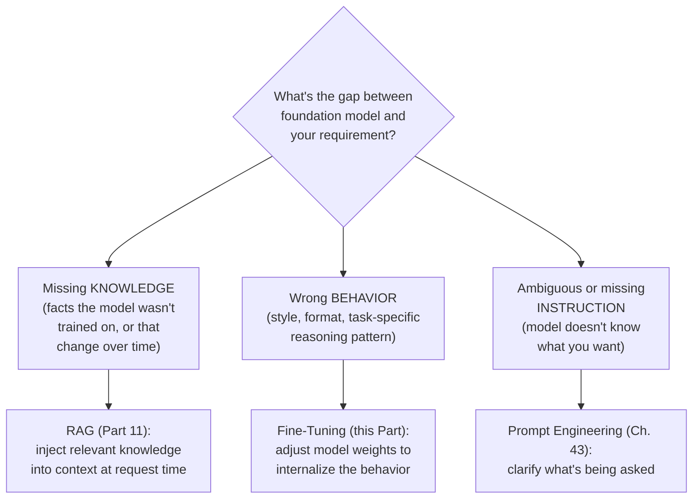
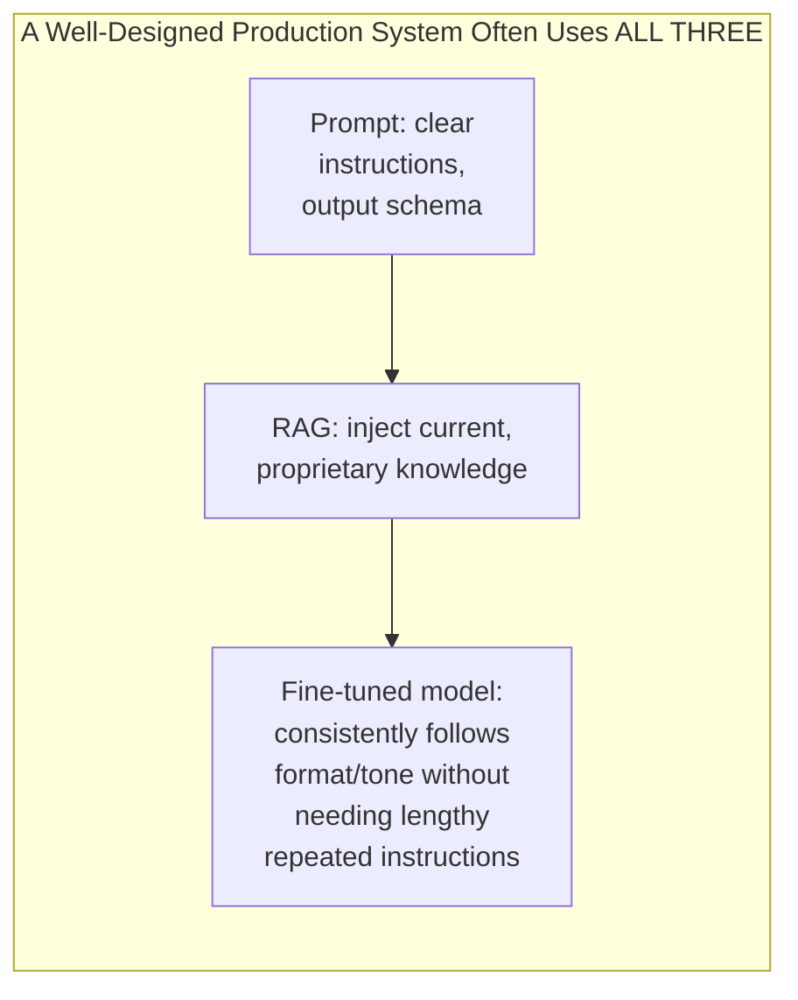

## Introduction

Chapter 43 closed Part 8 by noting that prompt engineering is the cheapest adaptation strategy, and that Part 9 would address when to escalate beyond it. This chapter is the decision framework that governs that escalation — and, just as importantly, corrects a common misconception: **fine-tuning, RAG, and prompt engineering are not mutually exclusive alternatives on a single ladder.** They address different kinds of gaps between a foundation model's default behavior and what a specific application needs, and most production LLM systems combine more than one.

## What Each Technique Actually Adapts

**Prompt engineering** addresses ambiguity — the model has the capability, but the instruction wasn't clear or well-structured enough to elicit it. **RAG** addresses missing or changing knowledge — the model's parametric knowledge (what it learned during pre-training) is necessarily frozen at training time and limited to what was in its training corpus; RAG injects fresh, specific, or proprietary knowledge at inference time. **Fine-tuning** addresses behavior that needs to be internalized rather than instructed anew on every call — a consistent output format, a specialized reasoning pattern, or domain-specific style that would otherwise require repeating lengthy instructions (and their token cost, Chapter 42) on every single request.

## Why This Isn't a Simple Escalation Ladder

It's tempting to present this as "try prompting, then try RAG, then try fine-tuning" — and while that's a reasonable *cost-ordering* heuristic (prompting is cheapest to iterate on, fine-tuning is the most expensive and slowest to iterate), it obscures that these techniques solve **different problems**. No amount of fine-tuning teaches a model facts about your company's product catalog that changes weekly — that's fundamentally a knowledge-freshness problem RAG is built for. No amount of RAG fixes a model's tendency to respond in the wrong tone or ignore your desired output schema — that's a behavioral pattern fine-tuning (or, more cheaply, better prompting) addresses.

## A Decision Framework

| Question | If Yes, Favor |
|---|---|
| Does the required knowledge change frequently, or is it proprietary/private (never in the model's training data)? | RAG |
| Is the required behavior a consistent, repeatable output pattern that would otherwise need lengthy, repeated prompt instructions? | Fine-tuning |
| Is the gap primarily about the model not understanding what's being asked, fixable by clearer instructions or examples? | Prompt engineering |
| Do you have limited labeled/example data (hundreds, not thousands+) for the specific behavior you want? | Prompt engineering (few-shot) over fine-tuning |
| Is cost-per-request or latency at very high volume the dominant constraint? | Fine-tuning (can shrink required prompt length, Chapter 42) or a smaller, specialized model |
| Does the requirement change quickly and iteratively (still exploring what "good" looks like)? | Prompt engineering (fastest iteration loop) |

## Why Fine-Tuning Is the Most Expensive, Slowest-to-Iterate Option

This directly follows from Part 4's training infrastructure discussion, now applied to a pre-trained LLM: fine-tuning requires labeled or curated training examples (Chapter 7's data collection challenges, now specific to demonstrating the desired behavior), compute infrastructure (Chapter 45 will cover why parameter-efficient techniques make this dramatically cheaper than it initially sounds), and a full retrain-evaluate-deploy cycle (Chapters 21-23's evaluation and staged rollout discipline) before a single behavioral change reaches production — compared to a prompt change, which can be iterated on and evaluated (via the regression testing from Chapter 43) in minutes. This cost and iteration-speed asymmetry is precisely why prompt engineering and RAG should generally be exhausted first for any given gap, reserving fine-tuning for gaps that are demonstrably not addressable by the cheaper techniques.

## A Common Anti-Pattern: Reaching for Fine-Tuning to Fix a Knowledge Gap

A frequent, costly mistake: a team notices the model doesn't know about their proprietary product details, and concludes "we need to fine-tune the model on our product data." This conflates a **knowledge** gap with a **behavior** gap. Fine-tuning a model to memorize a specific, evolving set of facts is generally a poor fit — the facts will go stale the moment the underlying product data changes again (requiring a full retraining cycle to update, per the retraining cadence discussion from Chapter 34, now vastly more expensive per cycle than the classical ML retraining this series covered earlier), and fine-tuning for pure factual recall is also less reliable than direct retrieval for precise facts (the model can still hallucinate details even after fine-tuning on them). RAG (Part 11) is almost always the better-fit tool for this specific kind of gap — precisely because it separates the frequently-changing knowledge (stored and retrieved externally) from the comparatively stable behavior (handled by the model itself, whether the base model or a fine-tuned one).

## When Fine-Tuning Is Genuinely the Right Call

- **Consistent, complex output formatting** that few-shot prompting struggles to enforce reliably at scale (though structured output features, Chapter 43, address much of this need more cheaply first).
- **Domain-specific reasoning patterns** — e.g., a legal-document-analysis task requiring a specific analytical approach that's more effectively demonstrated through many training examples than described in a prompt.
- **Reducing prompt length and cost at very high volume** — if a lengthy, repeated set of instructions and few-shot examples is achieving the desired behavior but at meaningful per-request cost (Chapter 42), fine-tuning that behavior into the model's weights can eliminate the need to repeat those instructions on every call, trading an upfront fine-tuning investment for a lower marginal cost per request — a genuine, calculable break-even analysis structurally similar to Chapter 42's self-hosting break-even calculation.
- **Adapting to a narrow domain's vocabulary and style** that a general-purpose model handles adequately but not ideally (Chapter 47 will cover domain adaptation in depth).

## Key Takeaways

- Prompt engineering, RAG, and fine-tuning address different kinds of gaps — instruction ambiguity, missing/changing knowledge, and behavior that needs to be internalized, respectively — not a single linear escalation ladder, and most production systems combine more than one.
- A common, costly anti-pattern is reaching for fine-tuning to fix a knowledge gap; RAG is almost always the better fit for frequently-changing or proprietary factual knowledge.
- Fine-tuning is legitimately the right choice for internalizing consistent behavioral patterns, reducing prompt length/cost at high volume, or adapting to a narrow domain — but it's the most expensive and slowest-to-iterate of the three, and should generally be reserved for gaps the cheaper techniques have genuinely failed to close.
- The decision should be driven by diagnosing the specific *type* of gap (knowledge vs. behavior vs. instruction clarity), not by defaulting to whichever technique is most familiar or most impressive-sounding.

---

## Interview Questions

**1. Why is it a mistake to think of fine-tuning, RAG, and prompt engineering as a simple linear escalation ladder, rather than three tools addressing different kinds of gaps?**
Each technique is specifically well-suited to a different category of problem — prompt engineering addresses instruction ambiguity (the model has the needed capability but wasn't asked clearly), RAG addresses missing or frequently-changing knowledge (the model's frozen parametric knowledge doesn't include or has become stale relative to some fact), and fine-tuning addresses behavior that needs to be durably internalized (a consistent format or reasoning pattern) — treating them as a simple ladder where you escalate to the "next" one when the current one "isn't enough" risks misapplying an expensive technique (fine-tuning) to a problem it's poorly suited for (a knowledge gap), when the actual right tool (RAG) was available all along and would have been both cheaper and more effective.
*Follow-up: What diagnostic question would you ask first, before choosing among these three techniques for a specific observed problem?*
I'd ask: "if I gave the model perfect knowledge of the exact information/facts needed for this specific case, right now, in its context window, would it produce the correct output?" — if yes, the gap is a knowledge problem, pointing toward RAG; if the model still wouldn't produce the correct output even with perfect knowledge available (because it doesn't understand the task, or doesn't format its response correctly, or doesn't apply the right reasoning approach), the gap is a behavior or instruction problem, pointing toward prompt engineering or fine-tuning — this single diagnostic question efficiently separates the knowledge-gap case (RAG's specific strength) from the behavior/instruction-gap case (prompt engineering or fine-tuning's domain) before committing to a specific remediation approach.

**2. Why is fine-tuning a poor fit for a knowledge gap involving frequently-changing information, like a company's current product catalog or pricing?**
Fine-tuning bakes information into the model's weights at training time — if that information changes (a product's price updates, a new item is added, an old one is discontinued), the fine-tuned model's internalized knowledge immediately becomes stale and would require a full, expensive retraining cycle to update, following the same costly retrain-evaluate-deploy loop discussed in this chapter and Chapter 34's retraining cadence discussion, now applied to a much more expensive fine-tuning cycle rather than a classical ML retraining cycle; RAG, by contrast, retrieves current information from an external, independently-updatable knowledge source (Part 11) at the time of each request, meaning the underlying knowledge source can be updated instantly and cheaply (a database write) without requiring any model retraining at all, making it structurally far better suited to knowledge that changes with any meaningful frequency.
*Follow-up: Beyond staleness, what's a second, independent reason fine-tuning is a poor fit for precise factual recall specifically?*
Even a model fine-tuned specifically on a set of facts doesn't have a reliable, guaranteed mechanism for perfectly and consistently recalling those facts precisely and without distortion at generation time — the model's fine-tuned weights represent a statistically-learned approximation of the training data's patterns, not a precise, guaranteed lookup mechanism, meaning the model can still hallucinate (Chapter 36's discussion) or subtly misstate details even after being fine-tuned specifically on the correct facts, whereas RAG's direct retrieval and inclusion of the actual source content in the context window provides a much more direct, reliable, and verifiable path to accurate factual recall, since the model is being shown the actual correct information directly rather than being asked to reproduce it from a statistically-learned internal representation.

**3. Explain why reducing prompt length/cost at high volume can be a legitimate, purely economic justification for fine-tuning, and how you would validate this justification quantitatively.**
If a lengthy, detailed system prompt with extensive instructions and several few-shot examples is required on every single request to achieve a desired behavior through prompting alone, that lengthy prompt directly and repeatedly adds to the input-token cost of every request (Chapter 42) — fine-tuning the model to internalize that same behavior directly into its weights can eliminate the need to repeat those lengthy instructions on every call, replacing a large, recurring per-request input-token cost with a one-time (or periodically-refreshed) fine-tuning cost; to validate this justification quantitatively, I'd calculate the token cost savings per request from a shorter, fine-tuned-model-appropriate prompt versus the original lengthy prompt, multiply this per-request savings by the expected total request volume over a relevant time period, and compare this total projected savings against the fine-tuning process's total cost (compute, data preparation, and evaluation effort) — directly analogous to Chapter 42's self-hosting break-even calculation, just applied to the cost of fine-tuning investment versus prompt-length savings rather than infrastructure investment versus API cost.
*Follow-up: What quality risk would you need to validate wasn't introduced by this cost-motivated fine-tuning, before considering the switch a success?*
I'd need to validate, through the same offline evaluation discipline from Chapter 21 (comparing the fine-tuned model with its shorter prompt against the original base model with its longer, more detailed prompt on a representative test set), that the fine-tuned model's behavior genuinely matches or exceeds the quality of the original longer-prompt approach — since the entire point of this exercise is achieving the same desired behavior more cheaply, not a degraded version of that behavior at a lower cost, and there's a genuine risk that fine-tuning might imperfectly capture everything the detailed original prompt was communicating, potentially trading cost savings for a real quality regression that wouldn't actually represent a net-positive outcome once the quality cost is properly weighed against the token cost savings.

**4. Why might a candidate who immediately proposes fine-tuning in response to any LLM system design question be signaling weaker judgment than one who first considers prompt engineering and RAG?**
As this chapter has established, fine-tuning is the most expensive, slowest-to-iterate, and most operationally complex of the three adaptation techniques, and it's specifically well-suited to a narrower category of problems (durable behavioral patterns) than the broader range of problems prompt engineering and RAG can often address more cheaply and quickly — a candidate who defaults to proposing fine-tuning without first considering or ruling out the cheaper, faster-to-validate alternatives may be signaling that they're drawn to the most technically sophisticated-sounding solution rather than the most appropriately-justified one for the actual problem at hand, which runs directly counter to the "start simple, escalate only when justified by demonstrated need" discipline this series has consistently emphasized as a hallmark of strong system design judgment.
*Follow-up: How would you structure your own interview answer to explicitly demonstrate this "consider the cheaper options first" discipline, rather than just having good judgment implicitly?*
I'd explicitly walk through this chapter's diagnostic framework out loud — first identifying whether the described gap is a knowledge problem, a behavior problem, or an instruction-clarity problem, then explicitly stating why prompt engineering or RAG would or wouldn't adequately address that specific gap before concluding that fine-tuning is or isn't warranted — narrating this reasoning process explicitly, rather than silently arriving at a conclusion, demonstrates the underlying judgment and diagnostic process to the interviewer directly, rather than requiring them to infer that this consideration happened based only on the final recommendation.

**5. How would you diagnose whether a model's incorrect or unhelpful response to a user query stems from a knowledge gap versus a behavior gap, in a live production debugging scenario?**
I'd take the specific failing query and manually construct a test prompt that includes the correct, relevant information directly in the context (simulating what a well-functioning RAG system would have retrieved and provided) and see whether the model, given this correct information directly, now produces the correct response — if it does, this confirms the original failure was a knowledge gap (the model didn't have access to the necessary information, not that it couldn't use it correctly if given it), pointing toward improving retrieval quality or coverage (Part 11) rather than fine-tuning; if the model still fails to produce a correct or appropriately-formatted response even with the correct information directly provided, this indicates a behavior or instruction gap instead, pointing toward prompt refinement or, if the pattern is pervasive and well-demonstrated by training examples, fine-tuning.
*Follow-up: How would you scale this diagnostic approach from a single manually-investigated failing query to a systematic process for diagnosing a pattern of failures across many production queries?*
I'd apply this same diagnostic test systematically across a representative sample of failing queries (identified through the production monitoring and evaluation practices from Chapters 32-33, now applied to an LLM system) — categorizing each failure as knowledge-gap or behavior-gap based on whether providing the correct information directly resolves it — and aggregate these categorizations to understand the overall failure pattern's composition (e.g., "70% of our observed failures are knowledge gaps, pointing toward a retrieval quality investment; 30% are behavior gaps, suggesting some prompt refinement or fine-tuning investment is also warranted"), using this aggregate, evidence-based breakdown to prioritize and justify the most appropriate improvement investment rather than guessing at the dominant failure mode from a small number of anecdotal examples.

**6. Why does this chapter argue that "most production LLM systems combine more than one" of these three techniques, rather than a single system typically relying on just one?**
A realistic production system typically needs all three kinds of adaptation simultaneously — it needs clear, well-engineered instructions and output format specifications (prompt engineering) so the model understands exactly what's being asked of it; it likely needs access to current, proprietary, or frequently-changing information relevant to the specific business domain (RAG) that the base model's frozen pre-training knowledge simply doesn't include; and it may benefit from a model that has internalized certain durable behavioral patterns specific to the task (fine-tuning) to reduce reliance on lengthy, repeated instructions — since these three techniques address genuinely different, often simultaneously-present gaps rather than competing solutions to the identical problem, a well-designed system naturally ends up combining whichever subset of these three techniques is actually needed to close each of its specific gaps, rather than being artificially restricted to using only one.
*Follow-up: Describe a concrete example of a system that would benefit from using all three techniques simultaneously.*
An enterprise legal-document review assistant might use prompt engineering to clearly specify the exact analytical framework and output structure the assistant should follow when reviewing a document (instruction clarity); RAG to retrieve the specific, current, and proprietary legal precedents, internal policy documents, or client-specific contract history relevant to the document being reviewed (knowledge, since this information is both proprietary and potentially frequently updated); and a fine-tuned model specifically trained on many examples of expert legal analysis to reliably apply the specific, nuanced analytical reasoning pattern and tone expected in this specialized legal domain, more reliably than prompting alone could achieve for this specific, sophisticated behavioral requirement (behavior) — together, these three techniques address three genuinely distinct gaps that a single technique alone wouldn't fully close for this demanding, multi-faceted use case.

**7. How would you respond to a stakeholder who wants to skip prompt engineering entirely and go straight to fine-tuning because "we want the best possible quality, not just a quick fix"?**
I'd explain that this framing incorrectly implies prompt engineering is inherently a lesser, "quick fix" quality tier compared to fine-tuning — in reality, for many kinds of gaps (particularly knowledge gaps and instruction-clarity gaps), well-executed prompt engineering (and RAG, where relevant) can achieve equal or even better results than fine-tuning, since fine-tuning specifically addresses behavioral internalization, not instruction clarity or knowledge access; I'd propose first properly diagnosing which specific kind of gap is actually driving the current quality shortfall (using this chapter's diagnostic framework) before committing to fine-tuning's significantly higher cost and slower iteration cycle, since committing to fine-tuning without this diagnosis risks investing significant resources into a technique that may not even be well-suited to the actual underlying problem, regardless of how much overall "quality" investment the stakeholder is willing to make.
*Follow-up: What would you propose if, after this diagnostic process, it becomes clear that fine-tuning genuinely IS the right tool for the specific quality gap identified?*
I'd fully support proceeding with fine-tuning at that point, having properly validated that it's genuinely the appropriate tool for the specific, diagnosed gap (a durable behavioral pattern that prompt engineering and RAG have been shown, through this diagnostic process, not to adequately address) — the point of this chapter's framework isn't to discourage fine-tuning categorically, but to ensure it's pursued as a well-justified, evidence-based decision for the specific kind of gap it's actually suited to address, rather than as a default "more investment must mean better quality" assumption applied without this kind of diagnostic rigor.

**8. Why might a team with only a few hundred examples of desired behavior generally favor few-shot prompting over fine-tuning, connecting to the data volume consideration flagged in this chapter?**
Fine-tuning, even with the more data-efficient parameter-efficient techniques Chapter 45 will cover, generally benefits from a reasonably substantial number of representative training examples to reliably learn a generalizable pattern without overfitting to the specific quirks of a small dataset (echoing the general overfitting risk with limited data discussed in Chapter 20's fine-tuning data-volume considerations) — with only a few hundred examples, few-shot prompting (including a representative handful of these examples directly in the prompt itself, per Chapter 43) can often achieve comparable or better results without requiring the training infrastructure, evaluation cycle, and risk of overfitting that a formal fine-tuning process with such a limited dataset would introduce, making it the more appropriate, lower-risk choice given this specific data constraint.
*Follow-up: At what point would you reconsider this default toward few-shot prompting and start seriously evaluating fine-tuning instead, as more examples become available over time?*
As the available example set grows into the thousands (a rough, task-dependent threshold, but a meaningfully larger scale than "a few hundred"), and particularly once the desired behavior is well-understood and stable (not still rapidly evolving through ongoing experimentation, which favors prompting's faster iteration loop per this chapter's earlier discussion), I'd start seriously evaluating fine-tuning — at this larger data scale, fine-tuning's benefits (a more deeply and reliably internalized behavior, potentially reduced ongoing prompt length and cost, per this chapter's earlier discussion) become more achievable without the same overfitting risk that a much smaller dataset would carry, making the fine-tuning investment more likely to be justified and successful at this point than it would have been with the original, much smaller example set.

**9. In an interview, if given a vague prompt like "our chatbot gives bad answers," how would you use this chapter's framework to structure your clarifying questions before proposing a solution?**
Rather than immediately proposing a specific fix, I'd ask clarifying questions specifically designed to diagnose which category of gap is actually responsible — "are the bad answers due to the chatbot lacking specific, correct information it would need (a knowledge gap), or is it that the chatbot has the right information but presents it poorly, in the wrong format, or with an inappropriate tone (a behavior gap), or is it that the chatbot seems to misunderstand what users are actually asking (an instruction/prompt-clarity gap)?" — directly applying this chapter's diagnostic categories as the structuring principle for my clarifying questions, ensuring I gather the specific information needed to correctly diagnose the actual root cause before proposing prompt engineering, RAG, or fine-tuning as the appropriate remediation, rather than guessing at a solution based on the vague, underspecified initial problem statement alone.
*Follow-up: Why is this diagnostic-question-first approach a stronger interview strategy than immediately proposing a comprehensive solution combining all three techniques "to be safe"?*
Immediately proposing all three techniques without first diagnosing the actual problem risks appearing to pad the answer with technically-correct-sounding but insufficiently targeted content, rather than demonstrating the specific, evidence-based diagnostic reasoning that distinguishes a genuinely strong system design answer — an interviewer is typically looking for the candidate's ability to correctly diagnose a problem and propose an appropriately-scoped, well-justified solution, not simply to demonstrate awareness that these three techniques exist; asking targeted diagnostic questions first (following Chapter 2's "clarify before diving in" framework, now applied specifically through this chapter's diagnostic lens) demonstrates the more valuable, more senior-level skill of correctly scoping a problem before proposing a solution, rather than defaulting to a broad, imprecisely-targeted "throw everything at it" response.

**10. How does the concept of "parametric knowledge" (a model's knowledge learned during pre-training, frozen at that point) explain why even a very large, very capable frontier model still needs RAG for many real-world applications?**
A model's parametric knowledge is fixed at the point its pre-training data was collected and processed — meaning it has no inherent, built-in awareness of anything that happened after that training cutoff, and no awareness at all of private, proprietary, or otherwise non-publicly-available information (a specific company's internal documents, a specific user's personal data) that was never part of any public training corpus in the first place, regardless of how large or generally capable the model is; RAG directly addresses this structural limitation by retrieving and injecting exactly this kind of current, private, or proprietary information into the model's context at the time of each specific request, meaning even the most capable available frontier model still fundamentally needs this kind of external augmentation for any application requiring knowledge the model's training process simply never had access to.
*Follow-up: Why doesn't a model's general "reasoning capability" improving with scale (per Chapter 40's scaling laws discussion) help address this specific parametric-knowledge limitation?*
Scaling laws describe how a model's ability to learn and generalize patterns from its training data improves with scale — but this doesn't change the fundamental fact that the model can only learn from whatever data it was actually trained on; a larger, more capable model can reason more effectively and fluently about whatever knowledge it does have, but this improved reasoning capability doesn't somehow grant it access to knowledge that was never present in its training data at all (post-training-cutoff events, private company documents) — capability and knowledge are two genuinely distinct properties, and no amount of scaling-driven capability improvement can substitute for RAG's role in providing access to information the model was never trained on in the first place, reinforcing that RAG addresses a structural limitation independent of a model's general capability level.

**11. Why might a team choose to fine-tune a model specifically to improve its RAG-based answer generation, rather than assuming fine-tuning and RAG are entirely separate, non-interacting techniques?**
While RAG and fine-tuning address different fundamental gaps (knowledge versus behavior, per this chapter's framework), they can be combined synergistically — a model can be specifically fine-tuned to more effectively use retrieved context when generating its final answer (for example, learning to more reliably ground its response specifically in the provided retrieved documents rather than relying on its own parametric knowledge when the two might conflict, or learning to more consistently cite which specific retrieved document supports each claim), directly improving the quality and reliability of the overall RAG system's output even though the retrieval mechanism itself remains unchanged — this represents fine-tuning being applied specifically to improve a *behavioral* aspect of how the model handles RAG-provided context, which is a distinct, valid use case from either fine-tuning for pure knowledge injection (a poor fit, per this chapter) or RAG operating with an entirely unmodified base model.
*Follow-up: Why would validating this kind of RAG-specific fine-tuning benefit require a different evaluation approach than validating a general-purpose behavioral fine-tuning effort?*
Evaluating whether this specific fine-tuning genuinely improves the model's ability to appropriately ground its answers in retrieved context requires test scenarios that specifically include retrieved context as part of the evaluation setup (mirroring the actual RAG system's real operating conditions), and success metrics specifically focused on faithfulness to the provided context (a concept Part 11 and Part 13 will develop in depth) rather than generic quality metrics alone — this is a more specialized, RAG-specific evaluation setup than a general-purpose behavioral fine-tuning effort (like improving general output formatting) would require, since the specific behavior being validated (appropriate use of and grounding in retrieved context) only meaningfully manifests when that retrieved context is actually present as part of the evaluation scenario.

**12. How would you use this chapter's framework to push back on an assumption that "fine-tuning always produces better results than prompting, given enough training data"?**
I'd clarify that "better results" depends entirely on what specific gap is being addressed — for a knowledge gap, no amount of fine-tuning data can substitute for RAG's ability to provide current, verifiable information directly, and a fine-tuned model attempting to memorize facts through training data will generally be less reliable and less maintainable than a RAG-based approach for that same purpose, regardless of how much fine-tuning data is used; even for genuine behavior gaps, well-designed prompting (clear instructions, good few-shot examples, appropriate use of structured output features, per Chapter 43) can sometimes match fine-tuning's quality for that behavior without requiring the training data collection, infrastructure investment, and slower iteration cycle fine-tuning demands — meaning the claim "fine-tuning always produces better results, given enough data" is true at best only for the subset of behavioral gaps genuinely best-suited to fine-tuning, and even then only after prompting-based approaches have been properly attempted and found insufficient, not as a universal, unconditional truth applicable regardless of what problem is actually being solved.
*Follow-up: What would be a fair, accurate way to state the relationship between fine-tuning and prompting that avoids both this overstatement and an equally inaccurate understatement of fine-tuning's genuine value?*
A fair statement would be: for the specific category of problems fine-tuning is well-suited to (durable behavioral patterns that are difficult to fully specify through instructions alone, or where reducing recurring prompt length/cost at high volume is a genuine priority), fine-tuning with sufficient high-quality training data can generally achieve more consistent and reliable results than prompting alone can achieve for that same specific behavioral goal — but this advantage is scoped specifically to behavioral gaps within fine-tuning's genuine area of applicability, not a universal claim about superiority across all types of gaps (like knowledge gaps, where RAG remains the better-suited tool regardless of fine-tuning data volume) or an unconditional claim that holds even before prompting-based approaches have been genuinely attempted and found insufficient for that specific behavioral gap.

**13. Why is it important for a system designer to be able to articulate this framework using the vocabulary and concepts established across Chapters 36-43, rather than treating fine-tuning-vs-RAG-vs-prompting as an isolated topic?**
This chapter's framework directly depends on concepts established throughout Part 8 — understanding that fine-tuning is fundamentally about adjusting model weights (Chapter 37's architecture discussion) explains why it's well-suited to durable behavior but not to easily-updatable knowledge; understanding token-based cost (Chapter 42) explains the economic logic behind using fine-tuning to reduce prompt length at scale; understanding prompt engineering's techniques and limitations (Chapter 43) explains what "exhausting the cheaper options first" concretely means in practice — presenting this framework in isolation, without this grounding, would make its conclusions feel like arbitrary rules of thumb rather than logically-derived consequences of the underlying technology's actual characteristics, which is exactly the kind of mechanistic, principled understanding this series has consistently aimed to build rather than memorized heuristics disconnected from their underlying justification.
*Follow-up: How would you demonstrate this integrated understanding specifically, if an interviewer asked you to justify why RAG is generally preferred over fine-tuning for knowledge-intensive applications?*
I'd explicitly connect the justification back to the underlying mechanism rather than simply stating the conclusion as a rule — explaining that a model's knowledge is encoded implicitly and statistically within its trained weights (Chapter 37's architecture), which makes updating specific facts within that knowledge both technically difficult (requiring a full retraining or fine-tuning cycle, Chapter 34's costly retraining cadence concept now applied to fine-tuning) and inherently less reliable for precise recall (the model reconstructs an approximation from its learned weights rather than directly retrieving a verified, exact source) compared to RAG's approach of directly retrieving and including verifiable source content in context at request time — grounding the conclusion in this underlying mechanistic reasoning, rather than presenting it as a memorized best practice without this deeper, connected justification, demonstrates the kind of integrated understanding this series has aimed to build throughout Part 8 and into Part 9.

**14. How would you use this chapter's framework to design an experiment that determines, empirically, whether a specific observed quality issue in a production LLM system would be better addressed by RAG improvements or by fine-tuning?**
I'd design a controlled comparison using this chapter's diagnostic test as the core methodology — taking a representative sample of currently-failing queries, and for each, testing two interventions independently: (1) manually providing the ideal, correct retrieved context directly (simulating a hypothetically perfect RAG retrieval) and measuring whether this resolves the failure, and (2) testing a candidate fine-tuned model (perhaps an initial, small-scale fine-tuning experiment) on the same failing queries with the current, imperfect retrieval unchanged, measuring whether the fine-tuned model's改进 behavior resolves the failure even without improved retrieval — comparing the resolution rate from each intervention across this representative failing-query sample provides empirical, quantified evidence for which category of gap (retrieval/knowledge versus model behavior) is actually the dominant driver of the observed quality issue, directly informing which improvement investment (better retrieval infrastructure, Part 11, versus fine-tuning investment, this Part) is likely to yield the larger, more justified return.
*Follow-up: Why might this experiment reveal that BOTH interventions provide meaningful, complementary improvement, rather than cleanly pointing to just one as the dominant cause?*
Real production failures are often multi-causal rather than attributable to a single, clean root cause — some portion of the failing queries might genuinely be primarily knowledge-gap-driven (where improved retrieval alone would resolve them) while a different portion might be primarily behavior-gap-driven (where the fine-tuned model's improved behavior alone would resolve them), and there could even be some overlap where both improvements are needed together for certain particularly difficult queries — this kind of mixed, complementary result is a realistic and common outcome that would appropriately inform a combined investment strategy (improving both retrieval and pursuing fine-tuning, per this chapter's "most systems combine more than one technique" framing) rather than requiring an artificially clean, single-cause conclusion before any improvement investment can be justified at all.

**15. How would you summarize, for someone moving into Chapter 45's deep dive on fine-tuning techniques, why having fully internalized this chapter's decision framework first is important?**
Chapter 45 will cover the specific technical mechanics of fine-tuning (full fine-tuning versus parameter-efficient techniques like LoRA and QLoRA) — but diving into these technical details without first having this chapter's framework firmly in mind risks a reader concluding that understanding *how* to fine-tune efficiently is equivalent to knowing *when* fine-tuning is the right choice in the first place, which are two entirely different, independently important skills; a reader equipped with this chapter's diagnostic framework will approach Chapter 45's technical material with the appropriate context — understanding that these efficient fine-tuning techniques matter specifically because they lower the cost threshold at which fine-tuning becomes justified for behavior-gap problems, not because fine-tuning has somehow become the universally preferred solution for every kind of gap covered in this chapter.
*Follow-up: How might Chapter 45's specific technical content (e.g., LoRA making fine-tuning dramatically cheaper) actually shift where the decision boundary in this chapter's framework falls?*
As Chapter 45 will show, parameter-efficient fine-tuning techniques dramatically reduce the compute cost and infrastructure complexity of fine-tuning compared to full fine-tuning of an entire large model's weights — this directly shifts this chapter's decision framework by lowering the bar for when fine-tuning's cost is justified relative to prompt engineering's cheaper iteration cycle, meaning some behavior-gap scenarios that might not have justified fine-tuning's cost and complexity under a full-fine-tuning assumption could become well-justified once the dramatically lower cost of parameter-efficient fine-tuning is factored into the same cost-benefit calculation this chapter has established — illustrating that this chapter's framework isn't a fixed, static rule but a cost-benefit calculation whose specific threshold shifts as the underlying techniques (which Chapter 45 will cover) continue to evolve and become more efficient over time.
