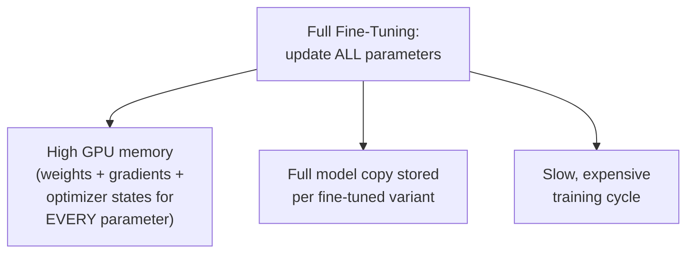
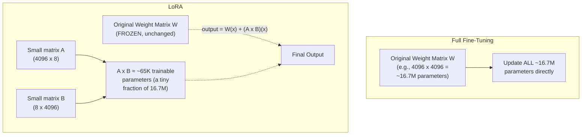
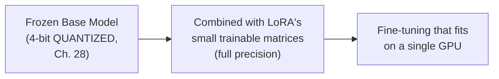
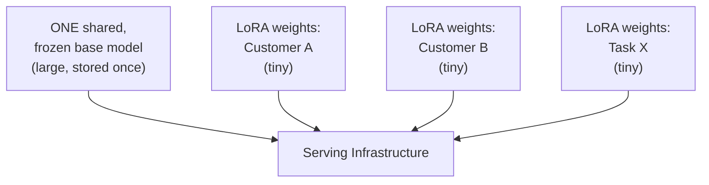

## Introduction

Chapter 44 established when fine-tuning is the right adaptation strategy. This chapter covers how it's actually done at LLM scale — and why the "full fine-tuning" approach from Chapter 20 (updating every parameter in the model) becomes impractical once model sizes reach the scale of modern LLMs, motivating the **parameter-efficient fine-tuning (PEFT)** techniques — LoRA, QLoRA, and adapters — that have become the default approach in practice.

## Why Full Fine-Tuning Doesn't Scale to LLMs

Chapter 20 covered full fine-tuning as a reasonable option for classical transfer learning. For an LLM with billions of parameters, full fine-tuning requires:

- **Storing gradients and optimizer states for every parameter** — Chapter 16's memory hierarchy discussion applies directly: a full fine-tuning run needs GPU memory not just for the model's weights, but for gradients and optimizer states (Adam-style optimizers typically store two additional values per parameter) — for a model with tens of billions of parameters, this can require far more GPU memory than even the largest single accelerators provide, immediately forcing the multi-GPU distributed training infrastructure from Chapter 17-18, with all its associated complexity and cost, just to fine-tune, not to pre-train from scratch.
- **Storing a full, separate copy of the model for every fine-tuned variant** — if an organization wants five different fine-tuned versions of the same base model for five different use cases, full fine-tuning means storing five complete, full-size copies of that model — a substantial storage and deployment cost multiplied by however many specialized variants are needed.
- **A slow, expensive training cycle** — echoing Chapter 44's cost-and-iteration-speed argument for why fine-tuning should be reserved for genuinely justified cases in the first place.



## The PEFT Insight: You Don't Need to Update Every Parameter

Parameter-efficient fine-tuning techniques share a common insight, directly building on Chapter 20's partial fine-tuning discussion (freezing earlier layers, updating only later ones) but taking it much further: **you can adapt a model's behavior meaningfully by updating a very small number of additional or modified parameters, while leaving the vast majority of the original pre-trained weights completely frozen and untouched.**

### LoRA (Low-Rank Adaptation)

**The core idea**: instead of directly updating a large weight matrix during fine-tuning, LoRA freezes the original weight matrix entirely and injects a much smaller pair of trainable matrices alongside it, whose product approximates the "update" that would have been applied to the original matrix — using far fewer trainable parameters than the original matrix itself.



```python
import numpy as np

class LoRALayer:
    """
    A simplified illustration of a LoRA-adapted linear layer.
    The original weight matrix W is FROZEN; only A and B are trained.
    """
    def __init__(self, original_weight: np.ndarray, rank: int = 8, alpha: float = 16):
        self.W = original_weight  # frozen — never updated during fine-tuning
        d_out, d_in = original_weight.shape

        # A and B are the ONLY trainable parameters
        self.A = np.random.randn(rank, d_in) * 0.01
        self.B = np.zeros((d_out, rank))  # initialized to zero so training starts
                                            # with LoRA contributing nothing, per
                                            # the original paper's initialization scheme
        self.scaling = alpha / rank

    def forward(self, x: np.ndarray) -> np.ndarray:
        original_output = self.W @ x
        lora_output = (self.B @ self.A) @ x * self.scaling
        return original_output + lora_output  # combine frozen path + trainable adaptation

    def count_parameters(self):
        original_params = self.W.size
        trainable_params = self.A.size + self.B.size
        return {
            "original_frozen_params": original_params,
            "lora_trainable_params": trainable_params,
            "reduction_factor": original_params / trainable_params,
        }

# Example: a 4096x4096 weight matrix, LoRA rank 8
layer = LoRALayer(original_weight=np.random.randn(4096, 4096), rank=8)
print(layer.count_parameters())
# original_frozen_params: ~16.7M
# lora_trainable_params: ~65K
# reduction_factor: roughly 256x fewer trainable parameters
```

**Why the low-rank assumption is reasonable**: the underlying hypothesis (validated empirically in the original LoRA research) is that the *change* needed to adapt a pre-trained model to a new, specific task has a much lower "intrinsic rank" than the full weight matrix's dimensions — meaning the actual adaptation being learned doesn't require the full expressiveness of a complete weight-matrix-sized update, an important, non-obvious empirical finding rather than an assumption that could be taken for granted in advance.

### QLoRA: Quantization + LoRA

**QLoRA** combines LoRA with the quantization techniques from Chapter 28 — the frozen base model's weights are stored and used in a compressed, lower-precision format (e.g., 4-bit instead of 16-bit), dramatically reducing the GPU memory required to even hold the frozen base model in memory during fine-tuning, while the small, trainable LoRA matrices are kept in higher precision (since they're being actively trained and are much smaller anyway, this doesn't meaningfully increase memory usage). This combination is precisely why fine-tuning a large model has become achievable on a single, consumer-grade or modestly-sized GPU, rather than requiring the extensive multi-GPU infrastructure full fine-tuning would demand.



### Adapters

A related, earlier family of techniques: **adapter layers** insert small, new trainable neural network modules directly between a pre-trained model's existing layers, again keeping the original layers entirely frozen and training only these newly-inserted, small modules. Conceptually similar to LoRA in spirit (train a small number of new parameters, freeze the rest), but structurally different (new layers inserted into the computation graph, rather than a low-rank decomposition applied alongside existing weight matrices) — LoRA has become more widely adopted in practice partly because it introduces no additional inference latency (the LoRA matrices can be mathematically merged back into the original weight matrix after training, producing a model architecturally identical to the original, unlike adapters which add extra computation at inference time unless similarly merged).

## The System Design Payoff: Storage and Serving Efficiency

This is where PEFT's benefits become directly relevant to Chapter 26's serving infrastructure discussion: since LoRA only trains a small, separate set of additional matrices while the base model remains unchanged, an organization needing many different fine-tuned variants of the same base model (one per customer, one per specific task) can store just **one copy of the large base model**, plus many small, cheap-to-store LoRA weight sets — and, at serving time, dynamically load the appropriate small LoRA weights alongside the shared base model for a given request, rather than needing to load and serve an entirely separate full-size model copy per variant.



This directly and dramatically changes the economics of Chapter 44's "many specialized fine-tuned variants" scenario — rather than the storage and serving cost scaling with the number of variants times the full model size, it scales with the (much smaller) size of the LoRA weights alone, with the large base model's cost paid only once regardless of how many variants are served alongside it.

## Key Takeaways

- Full fine-tuning of an LLM requires storing gradients and optimizer states for every parameter, plus a full model copy per fine-tuned variant — both quickly become impractical at LLM scale.
- LoRA freezes the original weight matrices and trains a much smaller pair of low-rank matrices whose product approximates the needed adaptation, exploiting an empirically-validated "low intrinsic rank" property of task-specific adaptations.
- QLoRA combines LoRA with quantization (Chapter 28), storing the frozen base model in low precision to dramatically reduce memory requirements, making LLM fine-tuning achievable on a single GPU.
- PEFT's system design payoff is storage and serving efficiency: one shared base model can support many cheap, small, dynamically-loadable LoRA variants, rather than requiring a full model copy per fine-tuned use case.

---

## Interview Questions

**1. Why does full fine-tuning of a large language model require significantly more GPU memory than the model's own weight storage alone would suggest?**
Full fine-tuning requires the training process to compute and store gradients for every single trainable parameter (needed to know how to update each weight), and modern optimizers (like Adam, commonly used for training) typically maintain additional optimizer state (such as running averages of past gradients and their squares) for every parameter as well — meaning the total memory footprint during training is a multiple of the model's raw weight storage size (often 3-4x or more, once gradients and optimizer states are included alongside the weights themselves), directly explaining why full fine-tuning of a billion-plus-parameter model can require dramatically more GPU memory than simply loading that same model for inference alone would require.
*Follow-up: Why doesn't inference (using an already-trained model to generate output, without any training) require this same additional memory overhead?*
Inference only requires a forward pass through the model — computing the model's output given an input — which needs only the model's weights themselves (plus some working memory for intermediate activations during that forward pass, and, for generation specifically, the KV cache discussed in Chapter 37/39's context), with no need to compute or store gradients (which are only needed to know how to update weights during training) or maintain optimizer state (which is only relevant to the training process's weight-update mechanism) — this fundamental difference between the memory requirements of forward-pass-only inference versus full training-with-backpropagation is exactly why a model that fits comfortably in memory for inference can require dramatically more memory when that same model needs to be fully fine-tuned instead.

**2. Explain LoRA's core mechanism in your own words, and why the "low intrinsic rank" hypothesis it relies on is an empirical finding rather than something that could be assumed in advance.**
LoRA freezes a pre-trained model's original weight matrices entirely, and instead of directly updating them during fine-tuning, injects a pair of much smaller matrices (whose product has the same dimensions as the original weight matrix, but is computed as the product of two much smaller matrices) that are trained to approximate whatever adjustment would be needed to adapt the model's behavior for the new task — this works because the actual behavioral change needed to adapt a large, general-purpose pre-trained model to a new, specific task turns out, empirically, to require far fewer independent degrees of freedom than the full weight matrix's dimensionality would suggest, meaning this much smaller, low-rank approximation can capture most of the useful adaptation despite using dramatically fewer trainable parameters than a full update would use. This is an empirical, not an a priori, finding because there was no strong theoretical guarantee in advance that task-specific adaptations would happen to have this convenient, low-rank structure — it could have turned out that useful task adaptations genuinely require the full expressiveness of a complete weight-matrix-sized update, in which case LoRA's low-rank approximation would have significantly underperformed full fine-tuning; the fact that LoRA achieves comparable performance to full fine-tuning in many practical settings is itself the empirical validation of this specific "low intrinsic rank" hypothesis about how these particular adaptations are actually structured.
*Follow-up: What would you expect to observe if you tried applying LoRA to a task where this low-rank hypothesis turned out NOT to hold?*
If a specific task's needed adaptation genuinely required more expressive, higher-dimensional changes than a low-rank approximation could capture, you would expect to see a meaningful performance gap between LoRA fine-tuning and full fine-tuning on that specific task — LoRA achieving noticeably worse task performance than full fine-tuning would be the observable signal that the low-rank hypothesis doesn't hold well for that particular adaptation, and in such a case, one practical response would be increasing LoRA's rank parameter (allowing the low-rank matrices somewhat more expressiveness, at the cost of more trainable parameters, though still typically far fewer than full fine-tuning) to see whether this narrows the observed performance gap, directly testing where along this expressiveness-versus-efficiency trade-off the specific task's actual requirements fall.

**3. Why does QLoRA specifically combine quantization (Chapter 28) with LoRA, rather than using either technique alone, and what does each contribute to the combination?**
Quantization alone (Chapter 28) reduces the memory footprint of a model's weights by storing them in lower numerical precision, which helps with the base model's memory footprint but doesn't by itself address the memory required for gradients and optimizer states during any subsequent fine-tuning process; LoRA alone reduces the number of trainable parameters (and therefore the gradient/optimizer-state memory needed for those trainable parameters) but still requires the full, frozen base model to be loaded in its original, typically higher precision, which can itself be a substantial memory requirement for a very large model — combining both techniques addresses both sources of memory demand simultaneously: quantization shrinks the memory needed to hold the large, frozen base model, while LoRA shrinks the memory needed for the comparatively small number of actively-trained parameters, together enabling fine-tuning of models that would be infeasible to fine-tune using either technique in isolation, on hardware that couldn't otherwise accommodate the combined memory demands of a full-precision base model plus even LoRA's small trainable component.
*Follow-up: Why does the trainable LoRA component typically remain in higher precision even in QLoRA, rather than also being quantized to the same low precision as the frozen base model?*
Since the LoRA matrices are the parameters actually being actively trained through gradient-based optimization, keeping them in higher precision helps preserve the numerical accuracy and stability needed for this training process to converge well (low-precision representations can introduce more quantization error and instability specifically during the gradient computation and weight-update process, echoing the general training-stability concerns from Part 4's discussion of training infrastructure) — and because the LoRA matrices are, by design, dramatically smaller than the frozen base model's full weight matrices, keeping just this small component in higher precision adds only a small, easily-affordable amount of additional memory overhead, making this a favorable trade-off: accepting a small memory cost for the actively-trained component in exchange for training stability, while still achieving the vast majority of the overall memory savings from quantizing the much larger, frozen base model component.

**4. Why do LoRA-fine-tuned models typically introduce no additional inference latency compared to the original base model, unlike adapter-based approaches (before merging)?**
LoRA's trained low-rank matrices can be mathematically combined with (added directly into) the original frozen weight matrix after training is complete, producing a single, updated weight matrix that is structurally and computationally identical to the original model's architecture — meaning that at inference time, the model can be used exactly as if it were a normally, fully fine-tuned model, with no extra computational steps beyond what the original, unmodified architecture would require; adapter-based approaches, by contrast, insert genuinely new, additional layers or modules into the model's computation graph, meaning a forward pass through an adapter-fine-tuned model literally must execute additional computation (passing through these inserted adapter modules) beyond what the original base model's architecture required, directly and measurably adding some inference latency compared to the unmodified original architecture, unless these adapter modules are similarly merged back into the surrounding layers where mathematically possible.
*Follow-up: If merging LoRA's trained matrices back into the original weight matrix eliminates any distinction between a LoRA-fine-tuned model and a fully fine-tuned model at inference time, what's the ongoing practical benefit of keeping the LoRA weights separate rather than always merging immediately after training?*
Keeping LoRA weights separate (rather than immediately and permanently merging them into the base model) preserves the serving-efficiency benefit described later in this chapter — a single, shared frozen base model can be paired with many different, small, separately-stored LoRA weight sets, and swapped in and out dynamically at serving time depending on which specific fine-tuned variant a given request needs, without needing to store or serve a fully separate, complete model copy for each variant; if you always immediately merged the LoRA weights into a new, standalone model copy after training, you'd lose this crucial storage and serving flexibility, reverting to the same "one full model copy per variant" storage cost problem that motivated moving to LoRA in the first place — the choice to merge (for maximum inference speed of a single, fixed variant) versus keep separate (for flexible, multi-variant serving efficiency) is itself a genuine system design trade-off decision, not a strictly one-directional improvement.

**5. How does PEFT's storage and serving efficiency benefit directly change the economics of Chapter 44's "fine-tuning for many specialized variants" scenario?**
Without PEFT, supporting many different fine-tuned variants (one per customer, one per specific narrow task) using full fine-tuning would require storing and potentially serving a complete, full-size copy of the large base model for each individual variant — a storage and (if all variants need to be simultaneously servable) potentially serving cost that scales linearly with the number of variants times the full model's size, which can become prohibitively expensive as the number of needed variants grows; with LoRA-based PEFT, the large base model is stored and loaded only once, shared across all variants, while each individual variant requires storing only its own small, cheap LoRA weight set — meaning the total storage cost scales with the number of variants times the much smaller LoRA weight size, plus the base model's cost paid just once, dramatically changing the economics in favor of supporting many specialized variants that would have been cost-prohibitive under a full-fine-tuning-per-variant approach.
*Follow-up: What serving infrastructure capability would be needed to actually realize this benefit in a live production system serving many different customers, each potentially needing a different LoRA variant?*
The serving infrastructure would need the capability to dynamically load the appropriate customer- or task-specific LoRA weights alongside the single, already-loaded shared base model at request time (based on which specific customer or task the incoming request is associated with), rather than requiring a separate, fully-loaded model instance dedicated to each individual customer or task — this requires a serving architecture specifically designed to support this kind of dynamic, per-request LoRA weight swapping efficiently (a capability increasingly supported by specialized LLM serving frameworks, a topic Part 10 will develop further), rather than the simpler, single-fixed-model serving architecture that Chapter 26's earlier serving discussion assumed as a starting baseline before this more specialized, multi-variant serving requirement was introduced.

**6. In an interview, if asked why an organization would choose LoRA/QLoRA over full fine-tuning even if they had unlimited compute budget available, how would you answer?**
Even with unlimited compute budget for the fine-tuning process itself, LoRA/QLoRA still provide meaningful, independent benefits beyond just reducing training cost — the dramatically smaller storage footprint for each fine-tuned variant (this chapter's storage/serving efficiency discussion) remains valuable regardless of training budget, since it directly affects ongoing storage and serving costs that persist long after the one-time training cost has been paid; additionally, the faster training time that PEFT typically enables (due to needing to compute and update far fewer gradients) allows for faster iteration and experimentation even when compute cost itself isn't the binding constraint, since wall-clock training time still matters for how quickly a team can experiment with and validate different fine-tuning approaches — meaning "unlimited compute budget" addresses only one of several genuine benefits PEFT provides, leaving strong reasons to prefer it even in that specific, budget-unconstrained scenario.
*Follow-up: Would there be any scenario where full fine-tuning might still be preferable even with PEFT techniques readily available and well-understood?*
If empirical validation (following Chapter 21's evaluation discipline, and echoing this chapter's earlier discussion of testing whether the low-rank hypothesis holds for a specific task) reveals that a specific, particularly demanding or unusual adaptation genuinely requires more expressiveness than even a reasonably-sized LoRA rank can provide — meaning full fine-tuning achieves meaningfully and consistently better task performance than any practically-sized LoRA configuration can match — an organization with sufficient resources might reasonably choose full fine-tuning specifically for that demanding use case despite PEFT's other general advantages, treating this as a case-by-case, evidence-based decision (validated per Chapter 21) rather than assuming PEFT techniques are unconditionally sufficient for literally every possible fine-tuning scenario without this kind of task-specific validation.

**7. Why might a team choose a higher LoRA rank for one fine-tuning task and a lower rank for another, rather than using a single, fixed rank value universally?**
The appropriate LoRA rank represents a trade-off between the number of trainable parameters (and the corresponding training cost and memory usage) and the adaptation's expressiveness (its ability to capture more complex, higher-dimensional behavioral changes) — a task requiring a relatively simple, narrow behavioral adjustment (e.g., adjusting output formatting to a specific structure) might be adequately captured by a lower-rank LoRA configuration, achieving good task performance with minimal trainable parameters and training cost, while a more complex task requiring a more substantial shift in the model's reasoning or knowledge application (e.g., adapting to a genuinely novel domain with substantially different vocabulary and reasoning patterns) might benefit from a higher rank, providing more expressiveness at the cost of somewhat more trainable parameters and training compute — choosing the rank appropriately for each specific task's actual complexity, rather than using a single fixed value for every task regardless of its actual needs, follows the same right-sizing principle this series has applied to model size, hardware provisioning, and many other similar trade-off decisions throughout.
*Follow-up: How would you empirically determine the appropriate LoRA rank for a new fine-tuning task, rather than guessing at an appropriate value?*
I'd run a small hyperparameter search (echoing Chapter 19's hyperparameter tuning discipline, now applied specifically to LoRA's rank parameter) — training and evaluating several candidate models at different rank values (e.g., 4, 8, 16, 32) on the specific task's validation set, and observing the point at which increasing the rank further stops providing a meaningful improvement in task performance (a diminishing-returns pattern directly analogous to Chapter 40's scaling law discussion, just applied to LoRA rank rather than overall model scale) — selecting the smallest rank that achieves acceptable task performance for this specific task, rather than defaulting to either an arbitrarily high rank (wasting training resources on unneeded expressiveness) or an arbitrarily low rank (potentially under-fitting the task's actual behavioral complexity) without this kind of empirical validation.

**8. How would you explain the relationship between LoRA and the "partial fine-tuning" concept from Chapter 20 (freezing earlier layers, updating only later ones)?**
Both techniques share the same underlying strategy of reducing the number of trainable parameters by keeping some portion of the pre-trained model frozen rather than updating everything — Chapter 20's partial fine-tuning achieves this by freezing entire early layers wholesale and only updating later layers in full, a relatively coarse-grained way of reducing trainable parameters (an entire layer is either fully trainable or fully frozen); LoRA achieves a similar overall goal through a much more fine-grained mechanism — rather than choosing which whole layers to freeze or unfreeze, it keeps every layer's original weights frozen but adds a small, low-rank trainable adaptation alongside each targeted layer, achieving an even more dramatic reduction in trainable parameters than layer-wise freezing typically achieves, while still allowing every layer to be influenced by the fine-tuning process (through its small LoRA adaptation) rather than some layers being completely unaffected as in the coarser layer-freezing approach.
*Follow-up: Why might LoRA's more fine-grained approach generally be preferable to Chapter 20's coarser layer-freezing approach for LLM-scale fine-tuning specifically?*
LoRA's approach achieves a much more dramatic reduction in trainable parameters (often orders of magnitude fewer than even an aggressively layer-frozen full fine-tuning approach would achieve) while still allowing every layer in the model to be adapted to some degree, rather than requiring an all-or-nothing choice about which specific layers to freeze entirely — for LLM-scale models specifically, where even a single layer's weight matrices can be very large, layer-wise freezing alone often doesn't reduce trainable parameters dramatically enough to make fine-tuning tractable on modest hardware, whereas LoRA's finer-grained, universal low-rank adaptation approach achieves the memory and compute savings genuinely needed to make LLM fine-tuning practical on more limited hardware, which is precisely why LoRA (and QLoRA specifically) have become the dominant practical approach for LLM fine-tuning rather than the coarser layer-freezing strategy that was more commonly sufficient for the smaller-scale models common when Chapter 20's partial fine-tuning discussion was originally most relevant.

**9. Why is it important for a system designer to understand that LoRA is initialized so that it "contributes nothing" at the start of training (the B matrix initialized to zero in this chapter's code example)?**
Initializing the B matrix to zero (while A is initialized with small random values) ensures that at the very start of fine-tuning, before any training has occurred, the combined LoRA adaptation term (`B @ A`) evaluates to exactly zero, meaning the model's initial behavior before any fine-tuning updates have been applied is identical to the original, unmodified pre-trained base model's behavior — this is an important, deliberate design choice because it ensures fine-tuning starts from the base model's already-good, pre-trained starting point rather than from some arbitrary, randomly-initialized adaptation that could initially degrade the model's behavior before training has had a chance to improve it, directly supporting stable, effective fine-tuning that builds incrementally on the base model's existing capability rather than risking an unstable or regressive starting point.
*Follow-up: What would likely go wrong, in practice, if BOTH the A and B matrices were initialized with random, non-zero values instead of this zero-initialization scheme?*
If both matrices were initialized with random, non-zero values, the LoRA adaptation term would immediately introduce some random, untrained perturbation to the model's behavior from the very first training step, meaning the model's initial behavior (before any meaningful training has occurred) would already deviate somewhat unpredictably from the original, well-functioning pre-trained base model — this could make the early stages of training less stable (since the model needs to first "undo" this random initial perturbation before it can begin making genuinely useful, task-specific adaptations) and could, in some cases, meaningfully slow down convergence or produce less predictable training dynamics compared to the deliberate zero-initialization scheme, which ensures training begins from the base model's known-good starting behavior and only gradually introduces the actual, useful task-specific adaptation as training genuinely progresses.

**10. How would you use this chapter's concepts to estimate, roughly, the total GPU memory required to fine-tune a 7-billion-parameter model using QLoRA, compared to full fine-tuning?**
For full fine-tuning, I'd estimate roughly 4x the model's raw weight memory footprint (accounting for the weights themselves, gradients, and Adam-style optimizer states, per this chapter's earlier discussion) — for a 7-billion-parameter model at typical 16-bit precision, this might mean roughly 14GB for the weights alone, scaling to something on the order of 50-60GB total once gradients and optimizer states are included, likely requiring multiple high-memory GPUs or specialized techniques just to fit; for QLoRA, the frozen base model stored at 4-bit precision would require roughly a quarter of the full-precision weight memory (around 3.5GB for this same 7-billion-parameter model), and since only the small LoRA matrices require gradient and optimizer state memory (a tiny fraction of the model's total parameter count, per this chapter's earlier code example), the total memory requirement drops to potentially fitting within a single, more modestly-sized GPU (commonly cited examples show 7-billion-parameter QLoRA fine-tuning fitting within roughly 6-10GB of GPU memory, dramatically less than the full fine-tuning estimate) — illustrating concretely the order-of-magnitude memory reduction QLoRA provides.
*Follow-up: Why is it important to note that these are rough, illustrative estimates rather than precise, universally-applicable numbers?*
The precise memory requirements depend on several specific implementation details not fully specified in this rough estimate — the exact quantization scheme and its overhead, the specific LoRA rank and how many of the model's layers it's applied to, the batch size and sequence length used during training (which affect activation memory, a factor this simplified estimate didn't even account for), and the specific deep learning framework's memory management efficiency — providing this kind of rough, order-of-magnitude estimate is valuable for system design reasoning and initial capacity planning (understanding that QLoRA reduces memory requirements by roughly an order of magnitude compared to full fine-tuning, a genuinely useful and durable insight), but a precise, production-ready memory budget would require actually running a specific, concrete fine-tuning configuration and directly measuring its actual memory usage, rather than relying solely on this kind of rough theoretical estimate for a final infrastructure provisioning decision.

**11. How would you decide, for a new fine-tuning project, between using standard LoRA (with the base model at full precision) versus QLoRA (with the base model quantized), given that QLoRA's more aggressive memory savings might come with some quality trade-off?**
I'd first check whether the available hardware can accommodate the base model at full precision alongside LoRA's small trainable overhead — if it comfortably can, using standard LoRA (avoiding quantization's potential, even if generally modest per Chapter 28's discussion, quality impact on the frozen base model) would be the more conservative default choice, since there's no need to accept any additional quality risk from quantization when the memory budget doesn't actually require it; if the available hardware cannot accommodate the full-precision base model at all (a common scenario for larger models on more limited, single-GPU setups), QLoRA's memory savings become a genuine necessity rather than merely an optional optimization, making it the clearly appropriate choice despite the small, generally well-tolerated quality trade-off that quantization can introduce (Chapter 28's compression-accuracy trade-off discussion applies directly here) — in both cases, validating the final fine-tuned model's actual task performance (per Chapter 21) before deploying it, regardless of which specific approach was used to fit within the available hardware constraints.
*Follow-up: Why might a team choose QLoRA even when they DO have hardware that could accommodate full-precision LoRA, purely for reasons beyond the immediate memory constraint?*
A team might choose QLoRA even with sufficient hardware for full-precision LoRA specifically to keep their fine-tuning infrastructure and workflow flexible and portable across different hardware configurations they might need to use in the future (e.g., wanting the same fine-tuning pipeline to also work on smaller, less capable GPUs for other projects or for cost-optimization reasons, per Chapter 16's hardware right-sizing discussion), or to reduce the overall infrastructure cost of the fine-tuning process itself (since QLoRA's reduced memory requirements might allow using smaller, cheaper GPU instances even when larger ones are technically available, directly reducing training cost per Part 4's cost-efficiency discussions) — treating this as a deliberate cost-and-flexibility optimization decision, rather than a decision purely and exclusively driven by an immediate, hard memory constraint.

**12. Why might understanding LoRA's mechanism help explain a specific behavior you might observe: a LoRA-fine-tuned model performing very well on the specific task it was fine-tuned for, but showing little to no improvement (or even slight degradation) on loosely related but distinct tasks?**
Since LoRA's trainable low-rank matrices are specifically optimized to capture the particular, narrow behavioral adaptation needed for the specific fine-tuning task's training data, and since the vast majority of the model's original, general-purpose pre-trained weights remain completely frozen and untouched, the resulting adaptation is inherently narrow and specifically targeted at the fine-tuning task's particular patterns — this narrow targeting is actually one of PEFT's advantages (reduced risk of the kind of broad catastrophic forgetting discussed in Chapter 20 and Chapter 48, since the vast majority of general capability is preserved by the frozen base weights), but it also means the specific, narrow adaptation learned for one task generally doesn't transfer meaningfully to a different, even loosely related task, since the low-rank matrices were never trained to capture whatever different adaptation that other task might specifically require.
*Follow-up: How does this specific characteristic of LoRA connect to and support the storage/serving efficiency discussion later in this chapter, where many small, task-specific LoRA variants are paired with a single shared base model?*
This narrow, task-specific targeting is precisely what makes the "many small LoRA variants sharing one base model" serving architecture sensible and effective in the first place — since each LoRA variant captures a narrow, task-specific adaptation without significantly altering the model's broader general capability (which remains preserved in the frozen, shared base model), it's coherent and appropriate to dynamically swap in whichever specific LoRA variant matches the current request's specific task, confident that each variant will provide its own specifically-targeted benefit for its own specific task without those different variants interfering with or degrading each other's specialized behavior, precisely because each one operates as a small, targeted, non-overlapping addition to the same shared, stable, general-purpose foundation.

**13. How would you handle a stakeholder's concern that "using LoRA instead of full fine-tuning means we're getting an inferior, compromised model," given PEFT's widespread practical adoption?**
I'd explain that PEFT techniques like LoRA and QLoRA have become the dominant, default choice in practice specifically because empirical research and widespread practical experience have shown they achieve task performance comparable to full fine-tuning for the vast majority of real-world fine-tuning use cases (echoing this chapter's earlier discussion of the empirically-validated low-rank hypothesis), while providing dramatically better efficiency in training cost, memory requirements, and storage/serving costs for multiple variants — rather than being an inferior compromise accepted only due to resource constraints, PEFT represents current best practice precisely because it achieves comparable quality at dramatically lower cost, which is a strictly better outcome along both dimensions for the great majority of practical use cases, not a quality-for-cost trade-off that sacrifices meaningful quality.
*Follow-up: Under what specific circumstance would this stakeholder's underlying concern actually be legitimate, based on this chapter's earlier discussion?*
The concern would be legitimately validated specifically in the case this chapter discussed earlier — where empirical evaluation (per Chapter 21) reveals a genuine, meaningful performance gap between LoRA fine-tuning and full fine-tuning for a particular task, suggesting that specific task's needed adaptation doesn't fit well within LoRA's low-rank assumption even after trying reasonably larger rank values — in this specific, evidence-based scenario, the stakeholder's concern about LoRA being an "inferior" choice for this particular task would be legitimately supported by actual evidence, and full fine-tuning (if resources allow) might genuinely be the better-justified choice for this specific case, even though this represents a real but comparatively uncommon exception to PEFT's generally excellent quality-versus-efficiency trade-off across most typical fine-tuning use cases.

**14. How does the choice between LoRA/QLoRA and full fine-tuning affect the CI/CD/CT automation pipeline design discussed in Chapter 31, now applied to LLM fine-tuning rather than classical ML retraining?**
The dramatically reduced training time and compute cost that PEFT techniques provide makes automated, more frequent retraining/re-fine-tuning cycles (echoing Chapter 31's CT automation and Chapter 34's retraining trigger policy discussion) considerably more feasible and cost-justified for LLM fine-tuning than full fine-tuning would allow — a CI/CD/CT pipeline that would need to trigger a full, expensive, multi-GPU full-fine-tuning run in response to a detected need (new training data, a detected quality regression) might reasonably do so only infrequently, given the cost and time involved, whereas a pipeline triggering a much cheaper, faster LoRA/QLoRA-based re-fine-tuning run can reasonably do so more frequently and with a lower evidentiary bar for triggering, since the cost of each individual triggered run is dramatically lower — directly connecting this chapter's efficiency gains to a more practical, more automatable operational cadence for keeping an LLM-based system's fine-tuned components current.
*Follow-up: Would the model registry concept from Chapter 35 need any modification to properly support versioning and managing many small LoRA weight sets alongside a single shared base model, rather than one full model per version?*
Yes — the registry's data model (Chapter 35) would need to explicitly distinguish between versioning the shared base model (a comparatively rare event, since the base model itself changes infrequently) and versioning the much more frequently-updated, smaller LoRA weight sets associated with specific tasks or customers, likely requiring the registry to track LoRA variants as their own distinct, lighter-weight artifact type with an explicit reference to which specific base model version each LoRA variant is intended to be paired with at serving time — this is a natural, well-justified extension of Chapter 35's registry design (similar in spirit to the "derived_from" field extension discussed there for model-compression scenarios) to properly accommodate PEFT's distinct base-model-plus-lightweight-variant architecture, rather than assuming the registry's original "one complete model artifact per version" data model transfers unchanged to this meaningfully different serving architecture.

**15. How would you summarize, for someone moving on to Chapter 46's instruction tuning and RLHF discussion, why understanding LoRA/QLoRA as the practical fine-tuning MECHANISM is a necessary but separate prerequisite from understanding instruction tuning and RLHF as fine-tuning OBJECTIVES?**
This chapter covered *how* fine-tuning is practically and efficiently accomplished at LLM scale — the specific technique (LoRA, QLoRA, or full fine-tuning) used to actually update a model's parameters; Chapter 46 will cover *what specific behavior or capability* a fine-tuning process is trying to instill — instruction-following (making a model reliably respond helpfully to natural-language instructions) and RLHF (aligning a model's outputs with human preferences) are specific fine-tuning *objectives and training methodologies*, which can, in principle, be implemented using either full fine-tuning or the parameter-efficient techniques covered in this chapter as the underlying mechanism — keeping this distinction clear (mechanism versus objective) prevents a reader from conflating "how efficiently can I update a model's parameters" with "what specific behavior am I trying to achieve through that update," which are related but genuinely separate questions that this Part addresses in sequence for exactly this reason.
*Follow-up: Why might understanding this chapter's LoRA/QLoRA material actually make Chapter 46's discussion of RLHF's computational demands easier to appreciate?*
RLHF (which Chapter 46 will cover in more depth) is known to be a particularly computationally demanding and complex fine-tuning methodology, often involving training or maintaining multiple separate models simultaneously (a policy model being trained, plus a separate reward model, and often a reference model for comparison) — having this chapter's grounding in just how memory- and compute-intensive full fine-tuning of even a single large model can be (motivating LoRA/QLoRA in the first place) provides a concrete, mechanistic appreciation for why RLHF's requirement to train or maintain multiple such models simultaneously represents an even more substantial computational undertaking, and correspondingly why parameter-efficient techniques from this chapter are frequently applied specifically within RLHF pipelines as well, to make this already-demanding methodology more tractable — a connection that would be much harder to appreciate without first understanding this chapter's foundational memory and compute cost concepts.
