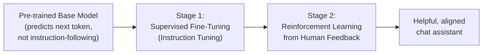
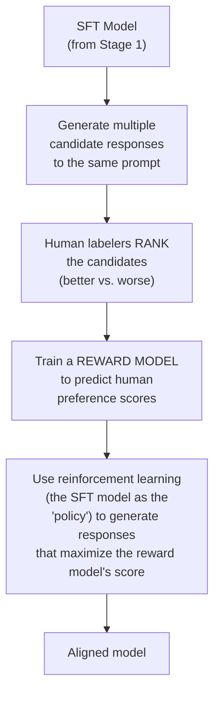

## Introduction

Chapter 45 covered *how* fine-tuning is mechanically accomplished efficiently. This chapter covers a specific, foundational *application* of fine-tuning that most system designers interact with indirectly every day without necessarily understanding it: the pipeline that transforms a raw, pre-trained base model — one that simply predicts likely next tokens — into the helpful, instruction-following chat assistant behind products like ChatGPT and Claude. Understanding this pipeline, at a system-designer's depth, explains behavior you'll observe constantly when building on top of these models: why they follow instructions at all, why they refuse certain requests, and why their behavior can sometimes seem to prioritize "sounding good" over being strictly correct.

## The Problem: A Base Model Isn't an Assistant

A raw, pre-trained base model (the output of the pre-training process discussed conceptually in Chapter 37, at the scale discussed in Chapter 40) is trained on a single, simple objective: predict the next token in vast quantities of internet-scale text. This produces a model with broad general knowledge and language capability, but with no inherent tendency to be **helpful, honest, or safe** in a conversational, instruction-following sense — asked a question, a raw base model is just as likely to continue the text with another question, a tangential continuation, or a plausible-sounding but unhelpful ramble, because that's simply what's statistically likely to follow similar text in its training corpus. Getting from "predicts plausible next tokens" to "follows instructions helpfully" requires additional, deliberate training stages.



## Stage 1: Instruction Tuning (Supervised Fine-Tuning)

**Instruction tuning** (also called supervised fine-tuning, or SFT) is exactly what Chapter 45's fine-tuning mechanics describe, applied to a specific kind of training data: pairs of (instruction, ideal response) written or curated by humans, demonstrating the desired instruction-following behavior directly.

```python
# Illustrative instruction-tuning training examples — the model is
# fine-tuned (via full fine-tuning or, more commonly today, PEFT
# techniques from Chapter 45) to predict responses matching this pattern.

instruction_tuning_examples = [
    {
        "instruction": "Explain photosynthesis in one sentence.",
        "response": "Photosynthesis is the process by which plants use "
                     "sunlight, water, and carbon dioxide to produce "
                     "glucose and oxygen.",
    },
    {
        "instruction": "Write a polite decline to a meeting invitation.",
        "response": "Thank you for the invitation. Unfortunately, I have "
                     "a scheduling conflict and won't be able to attend. "
                     "Could we find an alternative time?",
    },
    # A real instruction-tuning dataset contains many thousands to
    # hundreds of thousands of such examples, spanning a wide range
    # of task types, to teach general instruction-following behavior
    # rather than narrow, task-specific behavior.
]
```

After this stage, the model has learned the general *pattern* of "respond helpfully to an instruction" — this is a direct, practical application of the fine-tuning mechanics from Chapter 45, just with a specific, deliberately broad and diverse training dataset designed to teach general instruction-following rather than one narrow task.

**Why this alone isn't sufficient**: SFT teaches the model to imitate the specific responses in its training data, but it can't cover every possible instruction, and it provides no mechanism for the model to learn *degrees* of quality — it doesn't inherently learn that one helpful response might be meaningfully better than another, only-adequate one. This limitation motivates the second stage.

## Stage 2: Reinforcement Learning from Human Feedback (RLHF)

**RLHF** is a more sophisticated training methodology designed to align a model's behavior with nuanced human preferences that are easier to *judge* (which of two responses is better) than to *specify in advance* (write the single ideal response) — directly echoing the "generation has no single correct answer" theme from Chapter 3, now addressed through a training methodology built specifically around that reality.



**Step by step**:
1. The SFT model generates several different candidate responses to the same prompt.
2. Human labelers rank these candidates from best to worst — a task humans are generally much better and more consistent at than writing a single "ideal" response from scratch, since comparative judgment ("which is better") is often easier and more reliable than absolute judgment ("write the best possible response").
3. This ranking data trains a separate **reward model** — a model whose job is to predict a scalar score reflecting how much a human would prefer a given response, learned directly from this human ranking data.
4. The SFT model is then further trained using **reinforcement learning** (commonly Proximal Policy Optimization, PPO, though newer, simpler alternatives like Direct Preference Optimization, DPO, have become popular specifically because they can achieve a similar effect without needing a full, separate reinforcement learning loop) — treating the reward model's score as the signal to optimize, so the model learns to generate responses that score highly according to the reward model's learned representation of human preference.

## Why RLHF Is Notably More Complex Than SFT Alone

This directly builds on Chapter 45's closing discussion: RLHF's full PPO-based approach typically requires maintaining and coordinating **multiple models simultaneously** — the policy model being trained (an evolving copy of the SFT model), the reward model (trained separately and then held fixed during the RL phase), and often a **reference model** (a frozen copy of the original SFT model, used to penalize the policy model if it drifts too far from the original SFT model's behavior, preventing the RL process from over-optimizing against the reward model in ways that produce degenerate, "reward-hacking" behavior — a direct, LLM-specific instance of Goodhart's Law, the proxy-metric risk this series first introduced in Chapter 6). Coordinating training across these multiple models is precisely the kind of demanding computational and engineering undertaking Chapter 45 flagged as a reason parameter-efficient techniques are frequently applied within RLHF pipelines specifically.

## Direct Preference Optimization (DPO): A Simpler Alternative

**DPO** is a more recent technique that achieves a similar alignment effect to RLHF without requiring a separate reward model or the full reinforcement learning loop — it reformulates the preference-learning objective so the model can be trained to prefer better responses directly from the human-ranked preference data, using a modified supervised-learning-style loss function instead of RL. This is worth knowing at a system-designer's depth for the same reason PEFT mattered in Chapter 45: it represents the field's general trend toward finding cheaper, simpler ways to achieve results that were originally only achievable through more complex, expensive methods — informing realistic expectations about how alignment techniques (and their cost/complexity) will likely continue to evolve.

## System Design Implications for a Model Consumer

Most readers of this series will consume already-instruction-tuned and RLHF'd models (via closed-source APIs or open-source instruction-tuned model releases) rather than performing this training themselves — so why does this matter for system design?

- **Understanding refusals and "hedging" behavior**: a model's tendency to add caveats, decline certain requests, or hedge on uncertain claims is often a direct, deliberate product of its RLHF training (which typically incorporates safety and honesty-related human preferences alongside pure helpfulness) — understanding this explains behavior that might otherwise seem like an arbitrary limitation, and informs how to design prompts and system behavior around it (Chapter 43) rather than fighting against it.
- **Understanding "reward hacking" artifacts**: RLHF-trained models can sometimes exhibit behavior that scores well according to what human raters *tend to prefer on average* (e.g., longer, more elaborately-hedged answers) without this always correlating with genuinely better answers for a specific use case — recognizing this as a Goodhart's Law-style artifact of the training process (rather than a mysterious quirk) helps a system designer anticipate and specifically prompt-engineer around it (e.g., explicitly requesting conciseness when that's genuinely what the use case needs).
- **Choosing between an instruction-tuned base model and further fine-tuning it**: Chapter 44's framework applies directly — if an already-instruction-tuned model's general helpfulness and alignment training already produce acceptable behavior for your specific task, further fine-tuning may be unnecessary; if your task needs a specific behavioral pattern this general-purpose alignment training doesn't reliably produce, that's the legitimate case for the additional, task-specific fine-tuning covered in Chapter 44's framework and Chapter 45's mechanics.

## Key Takeaways

- A raw, pre-trained base model only predicts plausible next tokens — it has no inherent tendency toward helpful, instruction-following behavior, which must be deliberately trained through additional stages.
- Instruction tuning (SFT) fine-tunes a base model on curated (instruction, ideal response) pairs, directly applying Chapter 45's fine-tuning mechanics to teach the general pattern of helpful response.
- RLHF further aligns a model with nuanced human preferences by training a reward model from human-ranked response comparisons, then using reinforcement learning (or the simpler DPO alternative) to optimize the model against that learned reward signal.
- RLHF's reward-model-optimization structure makes it susceptible to Goodhart's Law-style reward hacking, directly echoing Chapter 6's proxy-metric risk — understanding this explains observable model behaviors (hedging, verbosity) that a system designer should account for rather than treat as unexplainable quirks.

---

## Interview Questions

**1. Why is a raw, pre-trained base model not inherently a helpful assistant, despite having broad general knowledge and language capability?**
A base model's sole training objective is predicting the statistically most likely next token given the preceding text, learned from vast quantities of general internet-scale text — this objective has no inherent connection to being helpful, following instructions, or providing complete and useful answers, since the model is simply learning to continue text in whatever way is most statistically probable given its training data's patterns, which could just as easily mean continuing a question with another related question, trailing off, or reproducing a common but unhelpful pattern from its training data, rather than reliably producing the kind of complete, helpful, instruction-following response a user would actually want — this gap between "predicts likely text continuations" and "behaves as a helpful assistant" is exactly what instruction tuning and RLHF are specifically designed to close.
*Follow-up: Why might a raw base model still be useful for certain specific tasks, despite lacking this instruction-following behavior?*
For tasks that are naturally framed as text continuation rather than instruction-following — such as completing a partially-written piece of creative writing in a consistent style, or few-shot prompted tasks where the desired behavior is demonstrated through examples rather than explicit instruction (echoing Chapter 43's few-shot prompting discussion) — a raw base model's core "predict the most statistically likely continuation" capability can still be directly useful and appropriately applied, without requiring the specific instruction-following behavior that instruction tuning and RLHF are specifically designed to add on top of this base capability.

**2. Explain instruction tuning (SFT), and why "diverse, broad instruction-response pairs" are specifically emphasized in its training data, rather than a narrow set of very similar examples.**
Instruction tuning fine-tunes a pre-trained base model on curated examples explicitly pairing an instruction with an ideal, human-written or human-curated response, directly teaching the model the desired instruction-following behavior pattern through the same fine-tuning mechanics covered in Chapter 45; using a broad, diverse range of instruction types (covering many different tasks, formats, and domains) rather than a narrow set of very similar examples is important because the goal of this stage is teaching the model a *general* instruction-following behavior pattern that generalizes to novel instructions the model has never specifically seen before, not memorizing responses to one narrow category of instruction — training on a genuinely diverse dataset gives the model a broader, more generalizable sense of "how to respond helpfully to an instruction" that transfers to new, previously unseen instruction types, rather than a narrow behavior that might only reliably work for instructions closely resembling the specific, limited training examples.
*Follow-up: How does this "broad generalization" goal for instruction tuning differ from the goal of the task-specific fine-tuning discussed in Chapter 44?*
Chapter 44's task-specific fine-tuning is specifically intended to narrow and specialize a model's behavior for one particular, well-defined task or domain (accepting reduced generality in exchange for improved performance on that specific task) — the exact opposite goal from instruction tuning's aim of broad, general instruction-following capability; this distinction explains why a model typically goes through general instruction tuning first (to become a broadly capable assistant) and only afterward, if needed, receives additional, narrower task-specific fine-tuning (per Chapter 44's framework) for a particular application — the two stages serve genuinely different, sequential purposes, with general instruction-following capability as the foundation that task-specific fine-tuning then further specializes only when a specific application's needs genuinely warrant it.

**3. Why is comparative human judgment ("which of these two responses is better") generally more reliable than absolute human judgment ("write the single best possible response") for training a model, motivating RLHF's design?**
Humans are often more consistent and reliable when making relative, comparative judgments between two or more concrete options than when generating an absolute, "ideal" response entirely from scratch — writing a genuinely optimal response requires the labeler to have simultaneously considered and rejected every possible alternative phrasing, level of detail, and approach, which is cognitively demanding and prone to significant inconsistency between different labelers (or even the same labeler at different times); comparing two already-generated candidate responses and simply judging which one is better is a narrower, more concrete, and empirically more consistent task for human judgment, which is precisely why RLHF's design specifically leverages this more reliable comparative-judgment capability (having the model generate candidates, then having humans rank them) rather than relying on the less consistent absolute-judgment task that SFT's training data (humans writing ideal responses from scratch) still requires.
*Follow-up: Does this mean RLHF's reward model can perfectly and objectively capture "true" human preference, given this more reliable comparative-judgment foundation?*
No — while comparative judgment is more consistent than absolute judgment, it's still subject to the same broader limitations discussed in Chapter 7's human labeling discussion (inter-labeler disagreement, potential systematic biases in who the labelers are and what they happen to prefer, and the inherent difficulty of capturing nuanced, context-dependent human preferences in a single scalar reward score) — RLHF's reward model represents a learned approximation of the specific labelers' aggregated comparative preferences, not a perfect, objective, universally-true measure of ideal response quality, and this approximation's limitations are precisely what create the reward-hacking vulnerability discussed later in this chapter, where the model can learn to exploit the reward model's specific, imperfect approximation rather than genuinely embodying the deeper, harder-to-fully-specify human preferences the reward model was only ever an approximation of.

**4. Why does full RLHF (using PPO) typically require maintaining multiple separate models simultaneously, and what role does each one play?**
Full PPO-based RLHF requires: the **policy model** (the model actually being trained/updated, starting as a copy of the SFT model, whose behavior is being optimized), the **reward model** (trained separately beforehand on human comparison data, then held fixed during the RL phase, providing the score the policy model is being optimized to maximize), and typically a **reference model** (a frozen, unchanging copy of the original SFT model, used to compute a penalty if the policy model's outputs drift too far from what the original SFT model would have produced, preventing the optimization process from straying into degenerate behavior purely to maximize the reward model's score) — coordinating and running inference/training across all of these simultaneously is precisely why this chapter describes full RLHF as notably more computationally and operationally demanding than the single-model training process SFT alone requires.
*Follow-up: Why is the reference model's "stay close to the original SFT model" penalty specifically important for preventing degenerate behavior, connecting to the reward-hacking discussion elsewhere in this chapter?*
Without this penalty, the reinforcement learning optimization process, purely and single-mindedly maximizing the reward model's score, could potentially discover and exploit an imperfection or blind spot in the reward model's learned approximation of human preference (an instance of Goodhart's Law from Chapter 6) — producing outputs that score very highly according to the reward model's specific, imperfect scoring function, but that a human would actually judge as strange, degenerate, or clearly not genuinely reflecting good, helpful behavior; the reference model's penalty acts as a regularizing constraint, keeping the optimization process anchored reasonably close to the original SFT model's already-reasonable, human-validated behavior, limiting how far the policy model can drift purely in pursuit of exploiting the reward model's specific imperfections, directly mitigating (though not entirely eliminating) this reward-hacking risk.

**5. How would you explain Direct Preference Optimization (DPO) as a simpler alternative to full RLHF, and why this kind of simplification matters for a system designer's understanding of the field's trajectory?**
DPO achieves a similar overall goal to RLHF — training a model to prefer responses humans rank more highly — but does so by directly incorporating the human preference-ranking data into a modified supervised-learning-style training objective, without requiring the separate reward model training step or the full reinforcement learning loop (with its associated policy/reward/reference model coordination) that full RLHF requires; this kind of simplification matters for a system designer's broader understanding because it illustrates the same general trend already established in Chapter 45 for LoRA/QLoRA — the field consistently finds ways to achieve similar or comparable results using dramatically simpler, cheaper, and more accessible techniques than the original, more complex approach required, meaning a system designer should generally expect the cost and complexity of achieving a given level of model alignment or capability to continue decreasing over time, informing more optimistic and realistic long-term planning assumptions.
*Follow-up: Why might understanding this general trend (toward cheaper, simpler techniques achieving similar results) be specifically useful when advising a stakeholder who's hesitant to invest in a fine-tuning or alignment project due to perceived high cost and complexity?*
Understanding this trend allows you to note that while the most complex or resource-intensive version of a technique might indeed be costly, the field frequently develops meaningfully cheaper and more accessible alternatives (like DPO relative to full RLHF, or LoRA/QLoRA relative to full fine-tuning, per Chapter 45) that can often achieve comparable results at a fraction of the original cost and complexity, meaning a stakeholder's cost concern, while reasonable if based on the most resource-intensive original approach, may be substantially overestimating the actual cost and complexity of achieving their desired outcome once these more efficient, more current alternative techniques are properly considered and evaluated instead.

**6. Why does this chapter connect RLHF's reward-hacking risk directly to Chapter 6's Goodhart's Law discussion, rather than treating it as an entirely new, RLHF-specific phenomenon?**
Chapter 6 established Goodhart's Law as a general principle — when a measure becomes a target, it ceases to be a good measure, because an optimization process will find ways to maximize the specific, measurable proxy even when this diverges from the true, underlying goal the proxy was only ever meant to approximate; RLHF's reward model is precisely this kind of measurable proxy for the true, underlying goal of "genuinely good, helpful, human-preferred behavior," and the RL optimization process explicitly and directly optimizes against this specific proxy — meaning RLHF's reward-hacking vulnerability isn't a novel, RLHF-specific phenomenon requiring an entirely new conceptual framework to understand, but rather a direct, recognizable instance of this same general, already-established principle, now manifesting in the specific context of aligning a language model's behavior with human preference through a learned reward signal.
*Follow-up: How does recognizing this connection to a general principle (rather than treating it as an isolated RLHF quirk) help you reason about OTHER, non-RLHF scenarios where a similar risk might arise?*
Recognizing Goodhart's Law as the underlying, general principle equips you to proactively anticipate similar proxy-optimization risks in any other scenario where an AI system (or even a human process) is being optimized against a measurable proxy for some harder-to-directly-measure true goal — for example, this same underlying concern would apply to a customer support AI system optimized purely against a "customer satisfaction rating" proxy (which could be gamed by simply agreeing with whatever the customer wants, rather than genuinely providing correct, helpful information), or a content-recommendation system optimized purely against a "click-through rate" proxy (which could favor sensationalized or misleading content over genuinely valuable content) — this same general Goodhart's Law-based skepticism toward any proxy-based optimization objective, first established in Chapter 6 and now reinforced through this chapter's RLHF-specific instance, transfers directly to recognizing and anticipating this same fundamental risk pattern across many different AI system design contexts, not just RLHF specifically.

**7. Why might a model's tendency to add hedges, caveats, or refuse certain requests be a deliberate, trained behavior rather than an inherent limitation of the model's underlying capability?**
This behavior is typically a direct, deliberate product of the instruction tuning and RLHF training process, which usually incorporates human preference data and specific training examples reflecting values like honesty (acknowledging genuine uncertainty rather than confidently stating something the model isn't actually confident about), safety (declining to help with clearly harmful requests), and appropriate caution (adding relevant caveats for advice in sensitive domains) — this means a model that hedges or declines a request is very often demonstrating behavior it was specifically and deliberately trained to exhibit through this alignment process, not revealing some separate, more fundamental limitation in its underlying language understanding or reasoning capability that happens to manifest as excessive caution.
*Follow-up: Why is this distinction important for a system designer trying to reduce a model's tendency toward unwanted hedging in a specific application context, like an internal tool used only by trained domain experts?*
Recognizing that this hedging behavior stems from deliberate training (rather than an inherent, unchangeable capability limitation) means a system designer can reasonably expect that appropriately-designed prompting (Chapter 43) — explicitly clarifying the context (e.g., "the user is a trained medical professional who needs direct, technical information without simplified caveats") — can often meaningfully reduce unwanted hedging, since the underlying model retains the capability to respond more directly when the prompt provides an appropriate, legitimate context for doing so; if the hedging were instead an inherent capability limitation, this kind of prompt-based contextualization wouldn't be expected to help, and a system designer would need to consider whether a different model or a fine-tuning intervention was necessary instead — understanding the actual root cause (trained behavior vs. inherent limitation) directly informs which remediation approach is likely to actually be effective.

**8. How would you use Chapter 44's decision framework to decide whether a specific application needs additional, task-specific fine-tuning on top of an already-instruction-tuned, RLHF'd model, versus relying on prompt engineering alone?**
I'd apply Chapter 44's diagnostic approach directly — first assessing whether the already-instruction-tuned and aligned model's general helpfulness and behavior, when given clear, well-engineered instructions and appropriate context (Chapter 43), already produces acceptable results for the specific application's requirements; if a specific, narrow behavioral pattern needed for this application (a highly specialized output format, a domain-specific reasoning approach, or overriding a general alignment-trained tendency like excessive hedging in a context where it's genuinely counterproductive) proves difficult to reliably achieve through prompting alone, even after genuine, disciplined prompt engineering effort, this constitutes the evidence-based justification (per Chapter 44's framework) for pursuing additional, task-specific fine-tuning on top of the already-aligned base model, rather than assuming either that the general alignment training alone is always sufficient, or that additional fine-tuning is needed by default without this diagnostic validation.
*Follow-up: Why might fine-tuning an ALREADY instruction-tuned and RLHF'd model for a specific task be preferable to fine-tuning directly from the raw, pre-alignment base model?*
Starting from an already instruction-tuned and RLHF'd model preserves the valuable, broad instruction-following and safety-aligned behavior that was already carefully trained into the model through this multi-stage process, meaning the subsequent task-specific fine-tuning only needs to further specialize this already-good general behavior for the specific task at hand, rather than needing to somehow relearn general instruction-following and safety behavior from scratch alongside the narrow task-specific behavior; fine-tuning directly from a raw, pre-alignment base model would risk losing the benefit of this already-completed, expensive, and carefully-validated alignment training, potentially requiring the task-specific fine-tuning process to also implicitly (and likely much less reliably) re-establish this general instruction-following and safety behavior on its own, which is both riskier and a poor use of the raw base model's training data and process compared to building on top of the already-aligned model instead.

**9. In an interview, if asked why a chatbot sometimes gives a long, hedge-heavy answer when a short, direct answer would have been more helpful, how would you use this chapter's concepts to explain this behavior?**
I'd explain that this behavior likely stems from patterns in the human preference data used during the model's RLHF training — if human labelers, on average, tended to rate more detailed, thorough, and appropriately-caveated responses more favorably than shorter, more direct ones (perhaps because thoroughness is often, on average, a genuinely good quality, or perhaps because longer responses can appear more comprehensive or effortful even when a shorter response would have been equally or more helpful for a specific context), the reward model learned from this data would have internalized a general preference for this kind of longer, more hedged response style, and the RL-optimized model would correspondingly tend to produce this style even in specific instances where the user or context would have actually preferred a more concise, direct answer — a plausible instance of the reward-hacking or reward-model-imperfection dynamic discussed earlier in this chapter, where a genuinely well-intentioned training signal (rewarding thoroughness) produces a systematic bias that doesn't perfectly match every individual user's actual, specific preference in every context.
*Follow-up: How would you use this understanding to design a system-level mitigation for this specific tendency, rather than treating it as an unavoidable model limitation?*
I'd apply this chapter's prompt engineering-based mitigation directly, per this chapter's earlier "understanding refusals and hedging" discussion — explicitly and clearly instructing the model, through the system prompt (Chapter 43), to prioritize conciseness and directness for this specific application's context (e.g., "Provide direct, concise answers. Avoid unnecessary hedging or caveats unless genuinely relevant to the specific question."), since the model's underlying capability to produce more direct answers is generally still present and can typically be elicited through this kind of explicit, deliberate prompt-level guidance, directly counteracting the more general, "on average" tendency the model's RLHF training instilled, without requiring a more expensive and involved fine-tuning intervention if this simpler, prompt-based mitigation proves empirically sufficient (per Chapter 21's evaluation discipline) for the specific application's needs.

**10. How would you explain to a non-technical stakeholder, in accessible terms, the difference between instruction tuning and RLHF, without using jargon like "reward model" or "reinforcement learning"?**
I'd explain that instruction tuning is like teaching the AI by showing it many, many examples of good questions paired with good answers, so it learns the general pattern of "here's what a helpful response to a question looks like"; RLHF is a further, more refined training step where, instead of just showing examples of good answers, we show the AI several different possible answers to the same question and have human reviewers say which one they liked better — repeating this comparison process many times across many different questions teaches the AI a more nuanced, human-calibrated sense of what makes one good answer even better than another slightly-less-good answer, going beyond just "imitate this example" to "learn what humans actually tend to prefer when comparing similar options directly."
*Follow-up: How would you explain, in similarly accessible terms, why this second, comparison-based training step (RLHF) is valuable in addition to the first step (instruction tuning) rather than being redundant with it?*
I'd explain that the first step (instruction tuning) is a bit like learning from a textbook of example answers — useful, but limited to whatever specific examples happened to be included; the second step (RLHF) is more like getting ongoing, specific feedback and coaching by having someone compare different attempts and tell you which one was better and why, which helps refine a more nuanced sense of quality that a fixed set of textbook examples alone couldn't fully capture — this comparison-based coaching approach helps the AI develop a more calibrated, generalized sense of quality that goes beyond simply imitating the specific examples it originally learned from, addressing situations and nuances the original textbook-style examples didn't happen to directly cover.

**11. Why might the specific composition and biases of the human labelers used for RLHF's preference-ranking data meaningfully affect the resulting model's behavior, connecting to Chapter 25's fairness discussion?**
Since the reward model is trained to predict and reproduce the specific preferences reflected in its human labelers' rankings, any systematic patterns, biases, or blind spots in that specific labeler population's preferences and judgments will be directly reflected in and amplified by the resulting reward model, and subsequently in the RL-optimized model's behavior — if the labeler population isn't sufficiently diverse or representative of the model's eventual, much broader and more diverse user base, the resulting model's learned notion of "good" or "preferred" behavior may not equally serve or reflect the preferences of users from different cultural backgrounds, communication styles, or values than those the specific labeler population happened to represent, directly echoing Chapter 25's broader discussion of how the specific composition of human-provided training data or feedback can introduce fairness concerns into a model's ultimately learned behavior.
*Follow-up: What system design or process practice would you recommend to help mitigate this specific fairness risk in an RLHF pipeline?*
I'd recommend deliberately recruiting a diverse, representative pool of human labelers spanning a genuinely broad range of relevant backgrounds, communication styles, and perspectives relevant to the model's intended, diverse user base (rather than a narrow, homogeneous labeler pool that happened to be convenient or readily available), and I'd recommend conducting the kind of fairness auditing discussed in Chapter 25 — specifically testing the resulting model's behavior across different demographic or cultural user segments to check for systematic quality or preference-alignment disparities — treating RLHF's labeler-composition decision with the same deliberate, fairness-conscious rigor Chapter 25 recommended for classical ML's labeled training data more broadly, since the underlying risk (human-provided training signal reflecting the specific, potentially non-representative population that provided it) is structurally the same concern, just manifesting in this new RLHF-specific training context.

**12. Why might a candidate who understands RLHF's mechanics be better equipped to reason about a model's likely limitations on a genuinely novel or unusual task, compared to a candidate who only knows RLHF exists as a general concept?**
Understanding RLHF's mechanics — that it optimizes a model's behavior against a reward model trained from human comparative preference data — helps a candidate reason that the model's alignment training is fundamentally shaped by whatever range of tasks and scenarios were actually represented in that human preference data; for a genuinely novel or unusual task that likely wasn't well-represented in the original alignment training's preference data (an unusual domain, an atypical format, a highly specialized technical area), a candidate with this mechanistic understanding can reasonably anticipate that the model's alignment-trained "sense of what a good response looks like" may not transfer as reliably to this novel scenario as it does to more typical, well-represented task types — informing a more cautious, validation-focused approach (testing the model's actual behavior on this specific novel task type directly, per Chapter 21, rather than assuming its general alignment training guarantees good behavior here too) than a candidate who only superficially knows "RLHF makes models more aligned and helpful" without this deeper, mechanism-based understanding of the specific, bounded nature of what that training actually covers.
*Follow-up: How would this same reasoning inform a recommendation about whether to trust a general-purpose, RLHF'd model's output for a highly specialized, unusual professional domain (e.g., a niche area of engineering) without additional validation?*
This reasoning would motivate a recommendation to treat the model's output for such a specialized, likely underrepresented domain with more caution and mandatory expert validation, rather than assuming the model's generally strong, broadly-aligned behavior automatically extends with equal reliability to this specific, likely much less well-represented niche area — recommending a validation process (perhaps the kind of expert human-in-the-loop review discussed in Chapter 7's labeling strategies, now applied to reviewing the model's actual outputs) specifically for this kind of underrepresented, specialized use case, rather than extending the same level of default trust that might be reasonable for more common, well-represented, general-purpose tasks where the model's alignment training was much more likely to have included substantial, relevant preference data.

**13. How would you decide, for an organization considering building their own RLHF pipeline versus using an already-RLHF'd open-source or closed-source model, whether this investment is justified — connecting to Chapter 41's build-vs-buy framework?**
I'd apply Chapter 41's build-vs-buy framework directly, now specifically informed by this chapter's understanding of RLHF's substantial complexity and cost (multiple coordinated models, extensive human preference-labeling effort, and specialized ML engineering expertise) — an organization would need a very strong, specific justification (e.g., a genuinely unique alignment requirement not well-served by any existing pre-aligned model, combined with substantial in-house ML research and engineering capability and resources) to justify building a full, from-scratch RLHF pipeline themselves, given that already-RLHF'd base models (both open-source and closed-source) provide a strong, broadly-capable starting point that, per this chapter's Chapter 44-informed discussion, can often be further adapted through much cheaper techniques (targeted fine-tuning, prompt engineering) rather than needing a full, independent RLHF effort from scratch.
*Follow-up: In what scenario might building a custom preference-alignment pipeline (even if not a full, from-scratch RLHF effort) still be justified for a specific organization?*
An organization with a genuinely distinctive, well-defined set of domain-specific or organization-specific preferences that differ meaningfully from the general, broad preferences reflected in publicly available RLHF'd models' training data — for example, an organization needing a model that reliably prioritizes a very specific, unusual balance of trade-offs particular to their specialized domain (a specific regulatory or professional context with unusual conventions) — might reasonably invest in a more targeted preference-alignment effort (potentially using the simpler DPO technique discussed in this chapter, applied to a smaller, more targeted set of domain-specific preference comparisons, rather than a full, general-purpose RLHF effort from scratch) as a middle ground between fully relying on an already-aligned general-purpose model and building an entire alignment pipeline independently from the ground up.

**14. Why is it important for a system designer to understand that instruction tuning and RLHF are TRAINING-TIME processes, distinct from the inference-time decoding strategies covered in Chapter 39?**
Instruction tuning and RLHF permanently and durably change the model's learned weights through a training process (following the same fine-tuning mechanics from Chapter 45), producing a model with a different, more helpful, more aligned default behavior baked into its parameters — this is fundamentally different from decoding strategy (Chapter 39), which is an inference-time configuration choice applied on top of whatever model is being used, without changing any of the model's underlying weights at all; understanding this distinction clarifies that a model's baseline helpfulness and alignment characteristics come from this chapter's training-time processes, while its specific output variety, determinism, or creativity for a given request comes from the separate, independently-configurable inference-time decoding strategy — these are two entirely different levers operating at different stages of the model's lifecycle, and conflating them would lead to incorrect reasoning about which lever to adjust for a given observed behavior or desired change.
*Follow-up: Give a concrete example of a situation where confusing these two distinct levers could lead to an incorrect diagnosis or fix for an observed model behavior problem.*
If a team observed a model producing overly hedge-heavy, cautious responses and incorrectly attributed this to the inference-time decoding strategy (perhaps assuming a specific temperature or sampling setting was somehow causing this behavior), they might waste effort adjusting decoding parameters that have no meaningful effect on this particular behavior, when the actual root cause is the model's RLHF training (a training-time process, per this chapter) having instilled this general hedging tendency into its default, learned behavior — correctly diagnosing this as a training-time-instilled behavioral tendency (per this chapter) rather than an inference-time decoding artifact (per Chapter 39) would correctly point the team toward the appropriate remediation (explicit prompt-level instruction to reduce hedging, or, if insufficient, targeted fine-tuning per Chapter 44) rather than the ineffective, misdiagnosed remediation (adjusting decoding parameters) that confusing these two distinct levers might otherwise lead to.

**15. How would you summarize, for someone moving on to Chapter 47's domain adaptation discussion, why understanding instruction tuning and RLHF as this Part's foundational alignment pipeline matters for that subsequent chapter?**
Chapter 47 will cover domain adaptation — further specializing a model's behavior and knowledge for a specific professional or technical domain — and this specialization work almost always builds on top of an already instruction-tuned and RLHF'd base model (per this chapter's earlier discussion of why starting from an already-aligned model is generally preferable to starting from a raw base model); understanding this chapter's alignment pipeline equips a reader to correctly reason about domain adaptation as a further, additional layer of specialization applied on top of this already-established general helpfulness and alignment foundation, rather than a domain adaptation process that would need to independently re-establish general instruction-following and safety behavior alongside its specific domain-focused goals — setting up Chapter 47's discussion to focus specifically on what's genuinely new and domain-specific about that adaptation process, rather than needing to re-derive or reconsider the general alignment foundation this chapter has already established as the typical, sensible starting point.
*Follow-up: What specific risk, established in this chapter's discussion of catastrophic forgetting concerns (previewed from Chapter 20), should a reader keep in mind when Chapter 47 (and later, Chapter 48) discusses further adapting an already-aligned model to a new domain?*
The reader should keep in mind the risk that further domain-specific fine-tuning, if not done carefully (e.g., using an inappropriately high learning rate, or full fine-tuning rather than the parameter-efficient techniques from Chapter 45 that better preserve the base model's existing capabilities), could inadvertently degrade or "forget" some of the valuable, already-established general instruction-following and safety-aligned behavior this chapter's pipeline worked to instill — a domain adaptation effort should be validated (per Chapter 21) not just for its success at the new, specific domain task, but also for whether it has preserved the model's general helpfulness, safety, and instruction-following behavior for cases outside the specific new domain, directly setting up the catastrophic forgetting discussion Chapter 48 will develop in full depth as a named, specific risk in this exact kind of sequential adaptation scenario.
