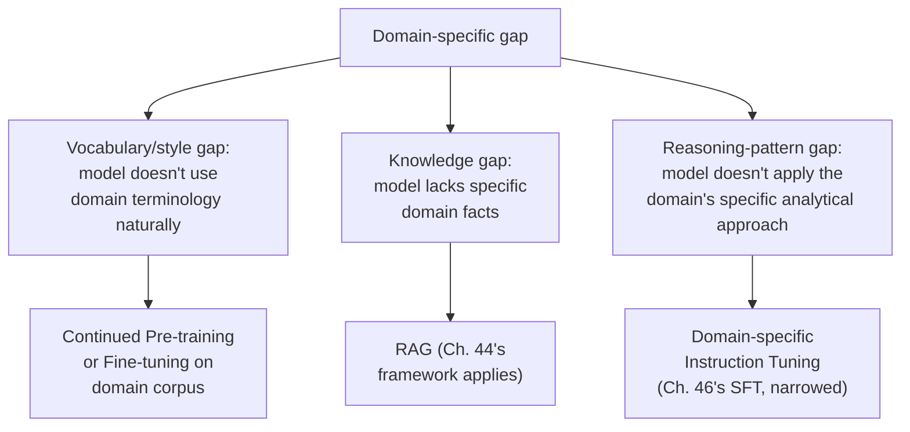

## Introduction

Chapter 46 closed by noting that domain adaptation typically builds on top of an already instruction-tuned, RLHF'd base model. This chapter covers that adaptation layer directly: how to specialize a general-purpose model for a specific professional or technical domain — legal, medical, financial, or a narrower internal enterprise context — where general-purpose alignment training alone doesn't reliably produce the specialized vocabulary, reasoning patterns, or knowledge depth the domain requires.

## What "Domain Adaptation" Actually Means Here

It's worth being precise, since this term can blur together several distinct techniques already covered separately in this series:



This is Chapter 44's diagnostic framework applied specifically to the domain-adaptation context: a genuine knowledge gap (the model doesn't know a specific company's internal policies) should generally be addressed with RAG, not domain adaptation training; domain adaptation is specifically the right tool for the vocabulary/style and reasoning-pattern gaps — teaching the model to naturally use domain terminology, understand domain-specific abbreviations and conventions, and apply domain-appropriate reasoning approaches.

## Technique 1: Continued Pre-training on Domain Text

**Continued pre-training** (sometimes called "domain-adaptive pre-training") takes an already-trained base model and continues training it — using the same self-supervised, next-token-prediction objective as the original pre-training — but on a large corpus of **domain-specific text** (medical literature, legal filings, financial reports) rather than general internet text.

```python
# Conceptually, continued pre-training uses the SAME training
# objective and mechanics as original pre-training (Ch. 37) and
# fine-tuning (Ch. 45) — only the DATA changes.

domain_corpus_examples = [
    "The plaintiff's motion for summary judgment was denied on the "
    "grounds that a genuine issue of material fact remained regarding...",
    "Differential diagnosis should consider both primary hyperaldosteronism "
    "and secondary causes of hypertension in this presentation...",
    # A real continued pre-training corpus contains millions to billions
    # of tokens of domain-specific text — this is a data-scale
    # undertaking, not a small fine-tuning dataset.
]
```

**Why this differs from the instruction tuning covered in Chapter 46**: continued pre-training uses raw domain text with no explicit instruction-response structure — its purpose is to shift the model's general language modeling toward domain-familiar vocabulary, phrasing, and implicit knowledge patterns, not to teach a specific instruction-following task. It's typically followed by a *second* round of instruction tuning (now using domain-relevant instruction-response pairs) to restore and re-target the instruction-following behavior established in Chapter 46's original pipeline, now expressed through the domain-adapted vocabulary and knowledge this continued pre-training stage instilled.

## Technique 2: Domain-Specific Instruction Tuning

Rather than (or in addition to) continued pre-training on raw domain text, a more targeted approach fine-tunes directly on **domain-specific instruction-response pairs** — following exactly Chapter 46's SFT mechanics, but with training data specifically curated by domain experts to reflect the desired domain-specific reasoning pattern.

```python
domain_specific_instruction_examples = [
    {
        "instruction": "Review this contract clause for potential "
                        "liability exposure: [clause text]",
        "response": "This clause presents moderate liability exposure "
                     "due to the absence of a limitation-of-liability "
                     "cap. Specifically, the indemnification language "
                     "in section 3 is unusually broad because...",
        # Written or reviewed by an actual domain expert (a lawyer,
        # in this case) — directly echoing Chapter 7's discussion of
        # when expert labeling is necessary versus general crowdsourcing.
    },
]
```

This directly connects to Chapter 7's data collection discussion: domain-specific instruction tuning data typically **requires expert labelers**, not general crowdworkers — a legal reasoning demonstration needs to be written or validated by someone with actual legal expertise, exactly the "when do you need domain experts, not just any human" consideration Chapter 7 raised for classical ML labeling, now equally applicable to curating fine-tuning data for LLMs.

## Which Technique — or Combination — Is Right?

| Situation | Recommended Approach |
|---|---|
| Domain has a genuinely distinct vocabulary/writing style, but general reasoning suffices | Continued pre-training on domain corpus |
| Domain requires a specific, expert-demonstrated reasoning or analysis pattern | Domain-specific instruction tuning |
| Both a distinct vocabulary AND a specific reasoning pattern are needed | Continued pre-training, followed by domain-specific instruction tuning |
| The gap is really about missing facts, not vocabulary or reasoning style | RAG (Chapter 44), not domain adaptation training |

## A Practical Complication: Tokenizer Mismatch

Chapter 38 established that a model's tokenizer is fixed at pre-training time and can't be swapped. A domain with heavy use of specialized vocabulary not well-represented in the base model's original tokenizer training corpus (e.g., extensive chemical nomenclature, or a specialized legal Latin phrase) will suffer the same **tokenization inefficiency** Chapter 38 described for lower-resource languages — domain-specific terms get broken into many small, inefficient subword tokens, directly increasing cost (Chapter 42) and consuming more of the context window (Chapter 38) for domain-heavy text, even after the model itself has been successfully adapted to understand and use that vocabulary well. This is a genuine, often underappreciated limitation: domain adaptation changes the model's *weights*, but it cannot change its *tokenizer* — a deeper architectural constraint that only training an entirely new base model with a domain-aware tokenizer from scratch could fully address, which is rarely justified for all but the largest, most specialized, best-resourced domain-specific model efforts.

## Evaluating Domain Adaptation

Chapter 21's evaluation discipline applies directly, with one important addition: **domain expert evaluation is essential, not optional**. A general-purpose evaluation approach (or worse, a general-purpose LLM-as-judge without domain expertise, a technique Part 13 will cover) may not reliably distinguish a genuinely good domain-specific response from a subtly incorrect one that merely *sounds* authoritative — exactly the kind of confidently-wrong hallucination risk Chapter 36 flagged, now compounded by an evaluator lacking the domain expertise to catch it. A rigorous domain adaptation evaluation plan should include a representative test set reviewed by actual domain experts, not solely automated or general-purpose evaluation.

## Key Takeaways

- Domain adaptation addresses vocabulary/style and reasoning-pattern gaps specifically — a genuine knowledge gap should still be addressed with RAG (Chapter 44's framework), not domain adaptation training.
- Continued pre-training on a domain corpus shifts a model's language modeling toward domain-familiar vocabulary and implicit knowledge, typically followed by a second round of domain-specific instruction tuning to restore and re-target instruction-following behavior.
- Domain-specific instruction tuning data generally requires expert labelers, directly echoing Chapter 7's discussion of when expert labeling (versus general crowdsourcing) is necessary.
- Tokenizer mismatch is a persistent, architecture-level limitation domain adaptation cannot fix — heavy domain vocabulary will still tokenize inefficiently (Chapter 38), and domain adaptation evaluation requires actual domain expert review, not general-purpose evaluation alone.

---

## Interview Questions

**1. Why does this chapter insist that a genuine knowledge gap should be addressed with RAG rather than domain adaptation training, even in a specialized professional domain?**
This directly applies Chapter 44's diagnostic framework — a knowledge gap (the model lacks specific facts, like a particular company's internal policy or a specific, frequently-updated regulation) is fundamentally about missing or changing information, which RAG addresses by retrieving and injecting that specific information at request time from an externally maintained, easily-updatable knowledge source; domain adaptation training instead addresses vocabulary, style, and reasoning-pattern gaps by adjusting the model's weights, which is both a more expensive, slower-to-update mechanism for handling frequently-changing factual content (requiring retraining to update, per Chapter 44's earlier discussion) and a less reliable mechanism for precise factual recall than direct retrieval — using domain adaptation training to address what's actually a knowledge gap would repeat exactly the anti-pattern Chapter 44 specifically warned against, just now in a specialized-domain context rather than a general business context.
*Follow-up: How would you diagnose, for a specific observed failure in a legal-domain assistant, whether the failure stems from a knowledge gap versus a vocabulary/reasoning-pattern gap?*
I'd apply the same diagnostic test from Chapter 44 — manually providing the relevant, correct information (the specific regulation, precedent, or policy) directly in the model's context and checking whether the model, given this information, now produces a correct, well-reasoned response in appropriately domain-fluent language; if it does, the original failure was a knowledge gap (pointing toward improving RAG retrieval, Part 11), and if it still fails to produce an appropriately-reasoned, domain-fluent response even with the correct information provided directly, that points toward a genuine vocabulary or reasoning-pattern gap that domain adaptation training (this chapter's actual focus) is specifically designed to address.

**2. Explain the difference between continued pre-training and domain-specific instruction tuning, and why a domain adaptation effort often uses both in sequence rather than just one.**
Continued pre-training uses the model's original self-supervised, next-token-prediction training objective, applied to a large corpus of raw domain-specific text, with the goal of shifting the model's general language modeling and implicit knowledge toward domain-familiar vocabulary, phrasing, and patterns — it doesn't teach any specific instruction-following task; domain-specific instruction tuning directly applies Chapter 46's SFT mechanics using curated (instruction, expert-validated response) pairs specific to the domain, teaching the model to actually apply domain-appropriate reasoning to domain-specific instructions in a helpful, structured way — a domain adaptation effort often uses both in sequence because continued pre-training alone would leave the model domain-fluent in vocabulary but without a specifically-targeted instruction-following capability for that domain, while domain-specific instruction tuning alone (skipping continued pre-training) might not give the model as deep or natural a familiarity with the domain's characteristic terminology and implicit patterns as a substantial continued pre-training phase on domain text would provide, making the sequential combination generally more effective than either technique used alone.
*Follow-up: Why might continued pre-training's raw domain text corpus need to be substantially larger in volume than the domain-specific instruction tuning dataset that typically follows it?*
Continued pre-training uses the same kind of large-scale, self-supervised training objective as original pre-training (Chapter 37, Chapter 40's scaling law context), which generally benefits from and requires substantial data volume to meaningfully shift the model's broad, general language modeling patterns toward domain familiarity — a comparatively small amount of domain text likely wouldn't provide enough signal to meaningfully reshape the model's deeply-ingrained general language patterns; domain-specific instruction tuning, by contrast, is a more targeted fine-tuning process (following Chapter 45's PEFT-style efficiency, and Chapter 46's SFT mechanics) that can achieve meaningful behavioral change with a comparatively much smaller, higher-quality, expert-curated dataset, since it's teaching a more specific, narrower instruction-following pattern rather than attempting to reshape the model's broad, general language modeling behavior — this data-volume asymmetry (large corpus for continued pre-training, smaller curated dataset for instruction tuning) directly parallels the general asymmetry between pre-training and fine-tuning data requirements established earlier in this series.

**3. Why does domain-specific instruction tuning data generally require expert labelers, connecting to Chapter 7's discussion of labeling strategies?**
Chapter 7 established that some labeling tasks require genuine subject-matter expertise to produce reliable, correct labels — a general crowdworker, however careful and well-intentioned, typically lacks the specialized training needed to correctly evaluate whether a proposed legal analysis, medical diagnosis reasoning, or financial risk assessment is actually correct and appropriately reasoned; domain-specific instruction tuning data (the (instruction, ideal expert response) pairs used to teach the model the domain's specific reasoning pattern, per this chapter's earlier discussion) directly requires this same kind of specialized expertise to write or validate, since an incorrect or subtly-flawed "ideal response" in the training data would directly teach the model that same incorrect or flawed reasoning pattern, potentially producing a model that reasons confidently but incorrectly within the specialized domain — a particularly costly failure mode given how confidently and fluently a well-trained language model can present even incorrect domain-specific reasoning.
*Follow-up: How would you structure a data collection process for domain-specific instruction tuning data to make efficient use of scarce, expensive domain expert time, connecting to the labeling efficiency strategies discussed in Chapter 7?*
I'd apply the same labeling-efficiency strategies Chapter 7 discussed for classical ML labeling, adapted to this specific context — using a general-purpose or already domain-adapted LLM to generate an initial draft response to a domain-specific instruction, then having the scarce, expensive domain expert review and correct this draft rather than writing every response entirely from scratch (a form of human-in-the-loop, AI-assisted labeling that can significantly reduce the expert time required per example, echoing Chapter 7's general "start with an imperfect automated system and have humans correct it" efficiency pattern), and potentially prioritizing expert review time toward the most challenging, edge-case, or highest-value instruction types first, following the same active-learning-style prioritization principle Chapter 7 recommended for allocating scarce labeling effort where it provides the most marginal value.

**4. Why does the tokenizer mismatch problem described in this chapter represent a limitation that domain adaptation training, no matter how well-executed, cannot fully solve?**
As established in Chapter 38, a model's tokenizer vocabulary is fixed at the original pre-training stage and cannot be changed or retrained independently of retraining the entire base model from scratch — domain adaptation techniques (continued pre-training, domain-specific instruction tuning) adjust the model's learned *weights*, teaching it to better understand and generate domain-appropriate content using its existing, fixed tokenizer vocabulary, but they cannot add new, more efficient tokens to that vocabulary for domain-specific terms that weren't well-represented in the original tokenizer's training corpus — meaning even a very well-executed, successful domain adaptation effort will still tokenize domain-heavy text somewhat inefficiently (breaking specialized terms into many small subword pieces) if that domain wasn't well-represented in the original tokenizer's training data, a structural limitation inherited directly from the base model's original pre-training choices rather than something the adaptation process itself has any ability to fix.
*Follow-up: What would be required to actually solve this tokenizer mismatch limitation, and why is this rarely a practical option for most domain adaptation efforts?*
Fully solving this would require training an entirely new base model from scratch, using a tokenizer whose vocabulary was specifically built to efficiently represent the target domain's specialized terminology from the very beginning (following the same BPE vocabulary-building process from Chapter 38, but on a training corpus specifically weighted to include substantial domain-specific text) — this is rarely a practical option for most domain adaptation efforts because it requires the full, enormous cost and complexity of training a foundation model from scratch (Chapter 40's scaling law context, and the general build-vs-buy considerations from Chapter 41), which is a vastly larger undertaking than the comparatively modest cost of continued pre-training or fine-tuning an already-existing base model — meaning most organizations reasonably accept this persistent tokenizer inefficiency as a known, understood limitation of the more practical and affordable domain adaptation approach, rather than pursuing the vastly more expensive full solution.

**5. Why is domain expert evaluation described as "essential, not optional" for domain adaptation, beyond the general evaluation discipline established in Chapter 21?**
General evaluation approaches (automated metrics, or even a general-purpose LLM-as-judge lacking specific domain expertise) may not reliably distinguish a genuinely correct, well-reasoned domain-specific response from a subtly incorrect one that merely uses domain-appropriate vocabulary and sounds superficially authoritative and confident — exactly the kind of confidently-wrong hallucination risk this chapter and Chapter 36 flagged, which becomes especially dangerous in specialized domains (legal, medical, financial) where a subtly incorrect but fluent-sounding response could cause genuine real-world harm if trusted and acted upon; only an actual domain expert reviewer has the specific subject-matter knowledge needed to reliably distinguish genuinely correct domain-specific reasoning from superficially plausible but actually flawed reasoning, making this kind of specialized review a genuinely necessary, non-substitutable component of a rigorous domain adaptation evaluation plan, rather than an optional enhancement to a more general evaluation approach.
*Follow-up: How would you design an evaluation process that makes efficient use of scarce domain expert reviewer time, rather than requiring experts to review every single test case?*
I'd use a general-purpose or automated evaluation approach as an efficient first-pass filter (identifying responses that clearly fail basic quality or formatting checks, which don't require domain expertise to catch) and reserve scarce, expensive domain expert review specifically for the more nuanced, harder-to-automatically-assess subset of responses that pass this initial filter — potentially also using a stratified or risk-based sampling approach, prioritizing expert review time toward the highest-stakes or most complex test cases where an undetected error would carry the greatest real-world risk, following the same kind of efficient, prioritized allocation of scarce expert resources discussed in this chapter's earlier data-collection efficiency question, now applied specifically to the evaluation phase rather than the training-data-curation phase.

**6. How would you decide, for a new domain adaptation project, whether the effort should include continued pre-training, or whether domain-specific instruction tuning alone would suffice?**
I'd assess how distinct and specialized the domain's vocabulary, phrasing, and implicit knowledge patterns are relative to the base model's general pre-training corpus — a domain with highly specialized terminology and conventions that differ substantially from general text (e.g., specialized legal or medical language) would likely benefit meaningfully from continued pre-training's broader vocabulary and pattern familiarization before instruction tuning is applied, while a domain that's more of a specialized *application* of generally-familiar language and concepts (e.g., a specific internal business process using largely ordinary vocabulary, just applied to a specific, narrow context) might achieve sufficient adaptation through domain-specific instruction tuning alone, without needing the additional cost and complexity of a full continued pre-training phase — validating this decision empirically (per Chapter 21) by comparing the resulting quality of instruction-tuning-only versus continued-pre-training-plus-instruction-tuning approaches on a representative domain evaluation set, rather than assuming either approach is universally sufficient without this kind of task-specific validation.
*Follow-up: What cost and complexity trade-off does adding a continued pre-training phase introduce, that would need to be weighed against its potential quality benefit?*
Continued pre-training requires assembling and processing a substantially larger domain-specific text corpus (echoing this chapter's earlier discussion of its larger data-volume requirements compared to instruction tuning) and running a more extensive, costly training process (closer in scale and cost to the pre-training-adjacent training discussed in Part 4, rather than the comparatively lighter, more efficient fine-tuning process alone) — this added cost and complexity should be weighed against the specific, measured quality improvement continued pre-training provides for the domain in question, following the same cost-benefit reasoning this series has consistently applied to every other similar "should we add this additional processing/training step" decision, rather than assuming continued pre-training is always worth its additional cost regardless of the specific domain's actual characteristics and needs.

**7. In an interview, if asked to design a system for a legal-document analysis assistant, how would you use this chapter's framework to structure your discussion of model adaptation?**
I'd explicitly walk through Chapter 44's diagnostic framework applied to this specific domain — identifying that the assistant likely needs: RAG for retrieving and referencing specific, current, and potentially client-specific legal documents, precedents, and internal policies (a knowledge gap, addressed per Chapter 44); and domain adaptation (this chapter) for reliably applying legal-specific reasoning patterns, terminology, and analytical conventions that a general-purpose model wouldn't naturally and reliably apply — I'd then discuss whether the required legal reasoning is distinct and specialized enough to justify continued pre-training on legal text corpora, or whether domain-specific instruction tuning alone (using expert-lawyer-curated training examples, per this chapter's data requirements) would likely suffice, explicitly flagging that this specific decision should be validated empirically rather than assumed, and I'd emphasize that any evaluation plan for this system must include actual legal expert review, not general-purpose evaluation alone, given the specialized, high-stakes nature of legal reasoning errors.
*Follow-up: How would you address the tokenizer mismatch concern specifically for this legal-document domain in your proposed design?*
I'd acknowledge this as a known, accepted limitation given the practical infeasibility of training an entirely new base model with a legal-specific tokenizer (per this chapter's earlier discussion of why this full solution is rarely justified) — noting that specialized legal terminology and Latin phrases will likely tokenize somewhat inefficiently regardless of how well the domain adaptation training itself succeeds, and that this should be factored into cost estimates (Chapter 42) for processing lengthy legal documents, potentially informing decisions about document chunking strategies (a topic Part 11 will develop) that account for this known tokenization inefficiency when working with legal-specific vocabulary and phrasing throughout the system's design.

**8. Why might a domain adaptation effort inadvertently degrade a model's general-purpose capabilities outside the target domain, connecting to the catastrophic forgetting concern flagged at the end of Chapter 46?**
As Chapter 46 flagged, further training on a narrow, specialized domain corpus or instruction set can risk shifting the model's learned weights away from the broader, more general patterns and capabilities established during its original pre-training and alignment training — if this domain adaptation training is aggressive (a high learning rate, extensive full fine-tuning rather than the more conservative parameter-efficient techniques from Chapter 45) or if the domain-specific training data is narrow and unrepresentative of the model's broader intended use cases, the model may become measurably worse at general-purpose tasks outside the target domain, even as it improves at the specific domain task the adaptation was intended to address — a direct instance of the catastrophic forgetting risk this series has discussed since Chapter 20, now specifically manifesting in the context of domain adaptation applied to an already-aligned LLM.
*Follow-up: How would you specifically test for this kind of unintended general-capability degradation, rather than only evaluating the domain adaptation's success on its intended, narrow domain task?*
I'd maintain and run a separate, general-purpose evaluation suite (covering the kind of broad instruction-following and general-knowledge tasks the original instruction-tuned, RLHF'd base model was designed to handle well, per Chapter 46) both before and after the domain adaptation training, specifically checking whether the domain-adapted model's performance on this general-purpose suite has meaningfully regressed compared to the original, pre-adaptation model — this kind of explicit, dedicated "did we break anything outside our target domain" regression testing directly parallels the general regression-testing discipline this series has recommended throughout (Chapter 31's CI/CD/CT, Chapter 43's prompt regression testing), now specifically applied to catching unintended, out-of-domain capability degradation as a direct consequence of domain-focused adaptation training.

**9. How would you use PEFT techniques (Chapter 45) specifically in the context of domain adaptation, and why might this be particularly well-suited to mitigating the catastrophic forgetting risk just discussed?**
I'd apply LoRA or QLoRA (Chapter 45) for both the continued pre-training and domain-specific instruction tuning stages of domain adaptation, keeping the vast majority of the base model's original, general-purpose weights entirely frozen and untouched while training only a small number of additional, domain-specific parameters — this is particularly well-suited to mitigating catastrophic forgetting because, as Chapter 45 discussed, PEFT's narrow, targeted adaptation (touching only a small subset of parameters) inherently preserves the vast majority of the base model's original general-purpose capability, since that capability is encoded in the frozen weights that domain adaptation via PEFT never touches at all — directly reducing the risk of the kind of broad, general-capability degradation that more aggressive, full-parameter domain adaptation training would risk.
*Follow-up: Does using PEFT for domain adaptation eliminate the catastrophic forgetting risk entirely, or does some risk remain?*
Some risk remains, though significantly reduced — while PEFT's narrow, targeted adaptation substantially reduces the risk of broad general-capability degradation compared to full fine-tuning, it doesn't provide an absolute, ironclad guarantee against any general-capability regression at all, since the small number of parameters that ARE being trained (or, in LoRA's case, the small adaptation being layered on top of the frozen base weights) could still, in principle, meaningfully shift the model's behavior in ways that interact poorly with certain general-purpose use cases, especially if the domain-specific training data or process isn't carefully designed and validated — this is precisely why the explicit, dedicated general-capability regression testing discussed in the previous question remains a necessary validation step even when using PEFT for domain adaptation, rather than assuming PEFT's inherent risk-reduction alone is sufficient without this kind of direct empirical validation.

**10. How would you explain to a stakeholder why "just fine-tune it on our internal wiki" is likely an incomplete strategy for building a genuinely effective internal company assistant?**
I'd explain that this framing likely conflates a knowledge gap (the model doesn't know the specific content of the company's internal wiki, which changes and grows over time) with a behavior/vocabulary gap (this chapter's actual focus) — fine-tuning the model directly on the wiki's content risks the same anti-pattern Chapter 44 warned against: the model's knowledge of the wiki content would go stale the moment the wiki is updated (requiring a full retraining cycle to refresh, an expensive and slow process per Chapter 44's earlier discussion), and the model may not reliably and precisely recall specific wiki facts even after fine-tuning on them, given the general unreliability of fine-tuning for precise factual recall discussed in Chapter 44 — I'd propose instead using RAG to retrieve current, relevant wiki content at request time (solving the actual knowledge-freshness problem directly and reliably), reserving any domain adaptation training (this chapter) specifically for teaching the model the company's characteristic internal vocabulary, tone, and any specific internal reasoning conventions that genuinely benefit from behavioral training rather than knowledge injection.
*Follow-up: What specific evidence would you look for to determine whether this internal company use case genuinely needs ANY domain adaptation training at all, beyond just RAG over the wiki content?*
I'd evaluate whether a general-purpose, already-aligned model, given well-engineered prompts (Chapter 43) and RAG-retrieved wiki content, already produces sufficiently helpful, appropriately-toned responses for the company's internal use case — if this combination already meets the bar (validated per Chapter 21, potentially through actual employee usage feedback), no additional domain adaptation training investment would be justified at all, following Chapter 44's core "escalate only when the cheaper techniques have been genuinely exhausted and found insufficient" principle; only if this combination consistently fails to capture some genuinely important internal vocabulary, tone, or reasoning convention that prompting and RAG alone can't adequately address would the additional domain adaptation training investment covered in this chapter become a well-justified, evidence-based next step.

**11. Why might a company choose to open-source or publicly release a domain-adapted model less readily than a general-purpose fine-tune, connecting to considerations from earlier in this series?**
A domain-adapted model, particularly one trained on proprietary internal documents, expert-curated instruction data reflecting valuable internal expertise, or specialized proprietary knowledge, represents a potentially significant source of competitive advantage and proprietary intellectual property that a company may have strong business reasons to keep private, distinct from the more general considerations around fine-tuning a model for a broadly-applicable, less domain-specific task; additionally, a domain-adapted model in a high-stakes area (legal, medical, financial) carries meaningful liability and safety considerations if released publicly without the kind of careful, ongoing oversight the company can provide for its own internal, controlled use case, echoing the general responsible-deployment considerations that would apply to any high-stakes AI system release, now specifically relevant to the decision of whether and how broadly to share a domain-adapted model externally.
*Follow-up: How might this consideration affect the choice between open-source and closed-source base models (Chapter 41) for a company planning to domain-adapt a model for internal, proprietary use?*
If the company's primary concern is that the resulting domain-adapted model itself remains fully private and under their own control (rather than the concern being about the underlying data flowing to a third party during training, which Chapter 41's data-sensitivity discussion already addressed), the choice between an open-source and closed-source base model matters less for this specific concern, since either can, in principle, be fine-tuned in a way that keeps the resulting fine-tuned/domain-adapted artifact private to the company — though open-source base models generally provide more flexibility and assurance regarding the resulting model's full ownership and control (since there's no ongoing dependency on a closed-source provider's terms of service regarding fine-tuned model ownership and usage rights), which might make open-source models a more natural fit specifically for organizations planning a substantial, valuable proprietary domain adaptation investment they want to fully and unambiguously own and control long-term.

**12. How would you use this chapter's framework to evaluate a vendor's claim that their "medical LLM" is superior because it was "trained from scratch on medical data" rather than being a domain-adapted general-purpose model?**
I'd apply Chapter 40's scaling law skepticism directly — training a genuinely competitive foundation model "from scratch," even on a domain-specific corpus, requires an enormous compute and data investment (per Chapter 40's discussion of what real frontier-level training actually requires) that few organizations can realistically match, and a domain-specific corpus alone, however large relative to other medical text collections, is almost certainly far smaller than the vast, general-purpose corpus a leading foundation model was originally trained on — meaning a "from scratch" medical model likely lacks the broad general language understanding and reasoning capability that domain adaptation of an already-strong general-purpose foundation model would have inherited and then specialized; I'd want to see direct, empirical evaluation evidence (per Chapter 21, ideally including domain expert review per this chapter's evaluation discussion) comparing this vendor's "from scratch" model against a well-executed domain-adapted alternative on the same representative medical tasks, rather than accepting the "trained from scratch" framing itself as inherently superior without this kind of concrete, comparative evidence.
*Follow-up: What's a plausible reason a vendor might make this "from scratch" claim as a marketing point, even if it doesn't necessarily correspond to genuinely superior real-world performance?*
"Trained from scratch" can sound more impressive and more specifically tailored to the domain than "adapted from a general-purpose model," potentially appealing to a less technically sophisticated buyer who might intuitively (but not necessarily correctly, per this chapter's and Chapter 40's discussion) assume that more specialized-sounding training data and process must produce a superior, more domain-focused result — this is exactly the kind of marketing claim a technically-informed system designer, equipped with this chapter's and Chapter 40's understanding of what training investment actually requires and delivers, should evaluate skeptically and empirically rather than accepting at face value, following this series' consistent "validate with actual evidence, don't accept a vendor's framing uncritically" principle.

**13. How would you handle a situation where domain-specific instruction tuning data, curated by domain experts, contains inconsistent or conflicting guidance across different experts (e.g., two lawyers who disagree on the appropriate analytical approach for a similar case)?**
I'd recognize this as directly analogous to Chapter 7's inter-labeler disagreement discussion — rather than assuming this disagreement reflects a data quality problem to be eliminated, I'd investigate whether it reflects genuine, legitimate professional disagreement or differing but equally valid analytical approaches within the domain (common in fields like law, where reasonable experts can differ), in which case the training data should perhaps reflect this legitimate diversity of approach rather than being artificially forced into a single, falsely-uniform "correct" answer; if the disagreement instead reflects one expert's answer being genuinely more correct or complete than the other's (an actual quality difference rather than legitimate professional diversity), I'd apply Chapter 7's general resolution processes — potentially bringing in a more senior or specialized reviewer to adjudicate, or using majority agreement among several experts, rather than allowing an unresolved, genuine quality inconsistency to be included in training data that would directly and durably shape the model's learned behavior.
*Follow-up: Why might allowing legitimate professional diversity of approach to remain in the training data, rather than forcing a single "correct" answer, actually be beneficial for the resulting domain-adapted model's behavior?*
A model trained on training data that reflects only a single, artificially-uniform analytical approach might overfit to that one specific expert's particular style or approach, potentially producing responses that feel narrow or rigid rather than reflecting the genuine, reasonable diversity of professional approaches that exist within the actual domain — a model trained on data that appropriately reflects legitimate professional diversity (properly distinguished from genuine data quality problems, per the resolution process above) may develop a more flexible, nuanced capability, capable of engaging with a question from multiple reasonable analytical angles rather than mechanically reproducing one single, rigid pattern — though this benefit depends entirely on correctly distinguishing legitimate diversity from actual quality inconsistency in the first place, which is precisely why this careful, deliberate curation judgment (rather than either forcing false uniformity or accepting all disagreement uncritically) matters so much for domain-specific training data quality.

**14. Why might a company's domain adaptation strategy need to be revisited as the underlying general-purpose foundation models continue to improve over time, connecting to the broader technology-evolution themes from Chapter 40 and Chapter 41?**
As general-purpose foundation models continue to improve in scale, training efficiency, and general reasoning capability (per Chapter 40's scaling law and efficiency-trend discussion), a newer general-purpose model might, on its own, already achieve a level of domain-relevant reasoning and vocabulary familiarity that previously required dedicated domain adaptation investment to achieve with an older, less capable base model — meaning a domain adaptation investment that was well-justified and valuable at one point in time (when it was clearly necessary to bridge a gap that the available general-purpose models couldn't otherwise close) might become less necessary, or need to be re-validated, once a new generation of more capable general-purpose models becomes available, following the same "periodically revisit build-vs-buy and adaptation-strategy decisions" discipline recommended in Chapter 41's closing discussion, now specifically applied to domain adaptation investment decisions.
*Follow-up: What specific, concrete signal would indicate to a company that it's time to re-evaluate whether their existing domain adaptation investment is still providing meaningful value relative to simply using a newer, more capable general-purpose model directly?*
I'd recommend periodically re-running the same evaluation comparison this chapter's framework calls for initially (comparing the domain-adapted model's performance against a well-prompted, RAG-augmented general-purpose model on the same representative domain evaluation set, including domain expert review) using each significant new generation of available general-purpose foundation models as they're released — if a newer general-purpose model, without any additional domain adaptation investment, now achieves performance comparable to or exceeding the existing domain-adapted model on this evaluation, that's the concrete, evidence-based signal indicating the domain adaptation investment's relative value has diminished and the underlying strategy should be reconsidered, potentially in favor of migrating to the simpler, cheaper general-purpose-plus-RAG approach instead.

**15. How would you summarize, for someone moving on to Chapter 48's continual learning and catastrophic forgetting discussion, why this chapter's domain adaptation material sets up that subsequent chapter's deeper treatment of the same underlying risk?**
This chapter repeatedly flagged catastrophic forgetting as a real risk specifically in the context of domain adaptation — a single, one-time adaptation effort applied on top of an already-aligned base model, where the risk is losing some general capability while gaining domain-specific capability; Chapter 48 will develop this same underlying risk in its fuller, more general form — the challenge of **continual learning**, where a model needs to be updated repeatedly over time (not just once) to incorporate new domains, tasks, or knowledge, without progressively degrading its accumulated capability from all the previous adaptation rounds — this chapter's domain adaptation discussion serves as a concrete, single-instance case study that makes Chapter 48's more general, repeated-adaptation-over-time framing immediately more intuitive and concrete, since the reader will have already directly encountered and reasoned about this exact underlying tension (new capability gained versus prior capability at risk) in this chapter's specific, single-round domain adaptation context.
*Follow-up: What specific question would you want a reader to carry forward from this chapter into Chapter 48's discussion, regarding what happens if a company needs to domain-adapt the SAME model for TWO DIFFERENT domains sequentially?*
The reader should carry forward the question: "if we successfully domain-adapt our model for Domain A, and later need to also adapt it for Domain B, will the Domain B adaptation process degrade the capability we already carefully built for Domain A, even if we're using the same catastrophic-forgetting mitigations (PEFT, careful evaluation) discussed in this chapter for the Domain B adaptation alone?" — this is precisely the multi-round, sequential-adaptation scenario that Chapter 48's continual learning discussion will address directly, and having this specific, concrete question already in mind from this chapter's single-domain discussion will make Chapter 48's more general treatment of this exact challenge immediately relevant and well-motivated, rather than feeling like an abstract, disconnected new concern introduced without this chapter's grounding.
