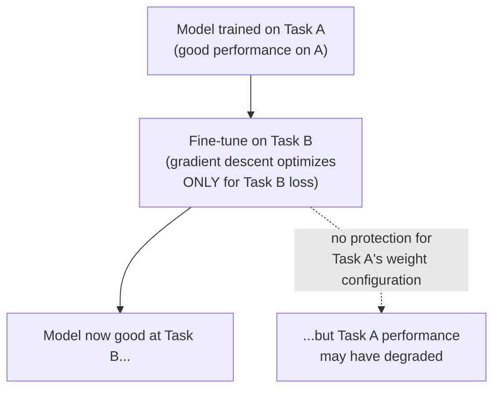
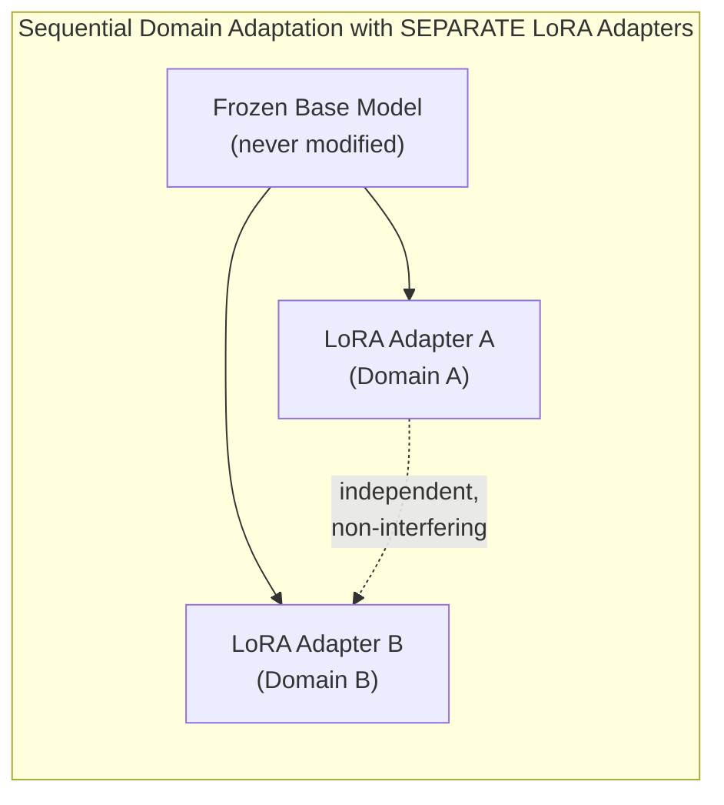
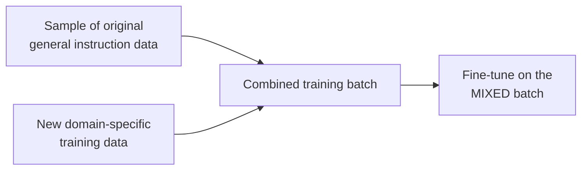
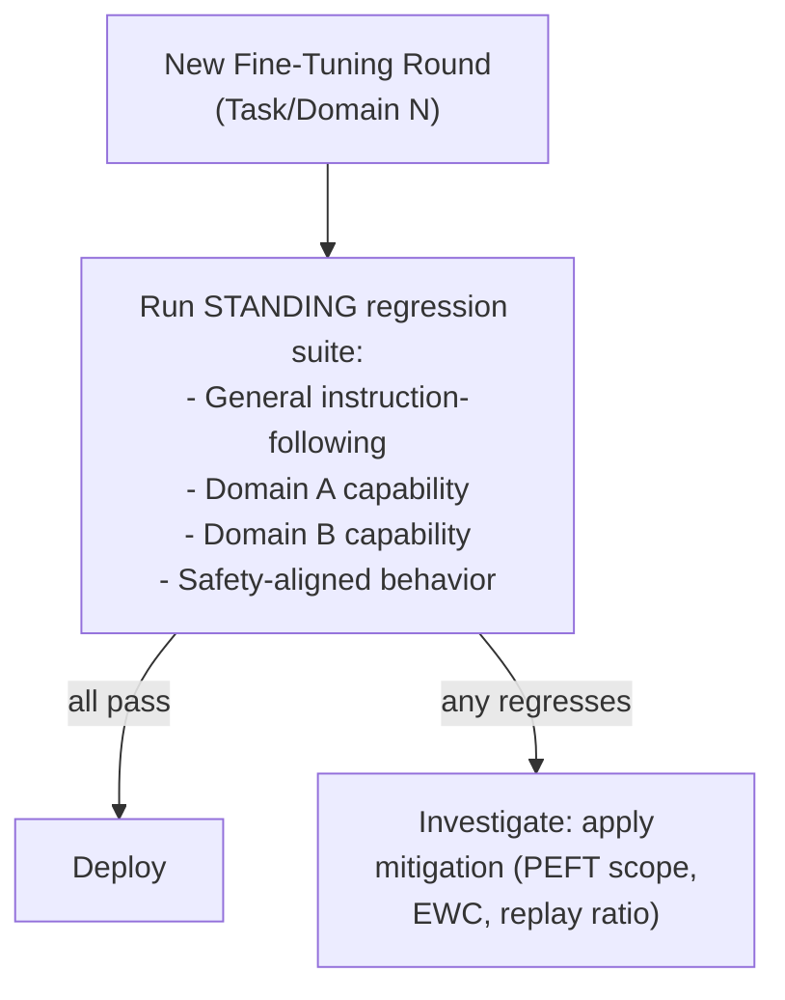

## Introduction

Chapter 47 closed with a question: if a model is domain-adapted for one domain, then later adapted for a second, does the second adaptation erode the first? This chapter addresses that question directly, generalizing it into the full **continual learning** problem — the challenge of updating a model repeatedly over time, incorporating new knowledge, tasks, or domains, without progressively eroding what it already learned. This is the LLM-era, fine-tuning-specific instance of a challenge this series has touched on since Chapter 20, now given its full, dedicated treatment.

## Catastrophic Forgetting: The Mechanism, Precisely

Chapter 20 introduced catastrophic forgetting conceptually; here's the mechanistic "why." A neural network's learned capability is encoded in its weights as a complex, continuous function shaped by every gradient update it has ever received. When a model is fine-tuned on new data (Task B), gradient descent updates weights specifically to reduce loss on Task B — with **no inherent mechanism protecting weight configurations that were important for previously-learned Task A**. If the gradient updates that improve Task B performance happen to move weights away from the configuration that was good for Task A, Task A performance degrades — not because the model "forgot" in any deliberate sense, but because the optimization process has no built-in awareness of, or incentive to preserve, capability it isn't currently being trained to demonstrate.



## Why This Is a Genuine, Not Merely Theoretical, Production Concern

This isn't an abstract research curiosity — it directly threatens the sequential adaptation scenario Chapter 47 raised: an LLM that has been instruction-tuned and RLHF'd (Chapter 46), then domain-adapted for Domain A (Chapter 47), then later domain-adapted for Domain B, risks losing some of its Domain A capability, its general instruction-following behavior, or even its safety-aligned behavior from the original RLHF stage — each subsequent training stage potentially eroding capability established by every prior stage, with no guarantee of preservation unless specifically designed for.

## Mitigation Strategies

### 1. Parameter-Efficient Fine-Tuning (Revisited)

Chapter 45's PEFT techniques (LoRA, QLoRA) are, as Chapter 47 noted, a direct and effective mitigation: by freezing the vast majority of the model's original weights and training only a small, additional set of parameters, PEFT inherently limits how much of the model's previously-learned capability can be disturbed by any single fine-tuning round — the frozen weights simply cannot forget, because they are never touched.



This directly extends Chapter 45's storage/serving efficiency discussion: rather than sequentially fine-tuning a single set of weights across Domain A then Domain B (risking forgetting), an organization can maintain **separate LoRA adapters** for each domain, all built on top of the same shared, permanently frozen base model — Domain A's adapter and Domain B's adapter never interfere with each other at all, since neither modifies the shared base weights, and the appropriate adapter is simply loaded depending on which domain a given request needs (exactly the dynamic-loading serving architecture Chapter 45 described).

### 2. Regularization-Based Methods

Techniques like **Elastic Weight Consolidation (EWC)** explicitly identify which weights were most important for previously-learned tasks (typically by estimating each weight's sensitivity — how much the loss on the prior task would increase if that specific weight changed) and add a penalty term during subsequent training that discourages large changes to those specific, identified important weights — directly building a "protection mechanism" into the training objective itself, rather than relying on architectural freezing (PEFT) alone.

```python
# A simplified illustration of the EWC penalty concept — NOT a
# complete, runnable implementation, but showing the core idea:
# penalize changes to weights that were important for a prior task.

def ewc_loss(current_loss, current_weights, old_weights, fisher_importance, lam=1000):
    """
    current_loss: the model's normal loss on the NEW task being trained.
    old_weights: the weight values from BEFORE this new training began
                 (i.e., after training on the prior task).
    fisher_importance: an estimate of how important each weight was
                        for the PRIOR task's performance (higher =
                        more important, more heavily protected).
    lam: how strongly to weight the protection against total loss.
    """
    penalty = sum(
        fisher_importance[i] * (current_weights[i] - old_weights[i]) ** 2
        for i in range(len(current_weights))
    )
    return current_loss + (lam / 2) * penalty
```

The intuition: this penalty term grows large if training on the new task pushes an *important* prior-task weight far from its previous value, discouraging the optimizer from making exactly the kind of change that would most damage prior-task performance, while leaving less-important weights (for the prior task) free to change as needed for the new task.

### 3. Replay / Rehearsal

**Replay** (or rehearsal) mitigates forgetting by including a sample of the *original* task's training data (or, for LLMs, a sample of general instruction-following data from the original SFT/RLHF stage) **alongside** the new task's training data during subsequent fine-tuning — directly reminding the model, through continued exposure during training, of the prior behavior it should retain, rather than training exclusively on new data and hoping prior capability survives incidentally.



This is a direct, practical, and widely-used technique specifically for LLM domain adaptation and instruction tuning — mixing a proportion of general-purpose instruction data into a domain-specific fine-tuning dataset is a simple, effective way to reduce the risk of losing general capability while gaining domain-specific capability, directly addressing exactly the concern Chapter 47 raised.

## Evaluating for Forgetting: A System Design Practice

Directly extending Chapter 47's "test for unintended general-capability degradation" recommendation into a formal, repeatable practice: any organization performing sequential or repeated fine-tuning on the same model lineage should maintain a **standing regression evaluation suite** covering every previously-established capability (general instruction-following, prior domain adaptations, safety-aligned behavior) and run it after every subsequent fine-tuning round — directly analogous to Chapter 31's CI/CD/CT regression testing discipline and Chapter 43's prompt regression testing, now applied to the model's evolving weights across a sequence of fine-tuning rounds.



## Key Takeaways

- Catastrophic forgetting occurs because gradient descent optimizes only for the current training objective, with no inherent mechanism protecting weight configurations important for previously-learned capability.
- PEFT (Chapter 45) mitigates forgetting architecturally by freezing the base model and training small, separate adapters per task/domain — different adapters never interfere with each other since neither touches the shared frozen weights.
- Regularization methods (like EWC) explicitly penalize changes to weights identified as important for prior tasks; replay/rehearsal mixes a sample of prior training data into new fine-tuning rounds to directly remind the model of retained behavior.
- Any organization performing sequential fine-tuning should maintain a standing regression evaluation suite covering every previously-established capability, run after every new fine-tuning round — directly extending this series' CI/CD/CT and regression-testing discipline to the model's evolving weights over time.

---

## Interview Questions

**1. Explain, mechanistically, why gradient descent has no inherent mechanism to protect a model's previously-learned capability when fine-tuning on a new task.**
Gradient descent updates a model's weights specifically and exclusively in the direction that reduces loss on whatever training objective and data it's currently being optimized against — it has no built-in awareness of, or memory of, what weight configurations were important for a different, previously-learned task, since the optimization process only "sees" the current task's loss signal at each training step; if the gradient direction that reduces the new task's loss happens to also move weights away from values that were important for good performance on a previously-learned task (a very plausible outcome, since there's no explicit constraint preventing this), that prior task's performance will degrade as a direct, mechanical consequence of the optimization process pursuing its current, singular objective without any competing consideration for previously-established capability.
*Follow-up: Why might some fine-tuning updates happen to preserve prior task performance well, while others cause severe forgetting, given that gradient descent has no explicit mechanism for either outcome?*
This depends on the degree of overlap or conflict between the weight regions/directions useful for the new task versus those useful for the prior task — if the new task's gradient updates happen to move weights in a direction that's largely orthogonal to (doesn't significantly disturb) the weight configuration important for the prior task, forgetting will be minimal, essentially by coincidental non-interference; if the new task's useful gradient direction happens to substantially overlap with or directly oppose the weight configuration important for the prior task, severe forgetting is more likely, since improving the new task's performance directly and unavoidably requires moving away from the prior task's optimal configuration — this variability in outcome, driven by the specific relationship between the two tasks' respective useful weight configurations, is exactly why forgetting's severity is empirically variable and task-dependent, rather than either a uniformly severe or uniformly negligible problem across all fine-tuning scenarios.

**2. Why does using separate LoRA adapters for different domains/tasks (rather than sequentially fine-tuning the same set of weights) provide a more robust mitigation against catastrophic forgetting than sequential full fine-tuning?**
Since each LoRA adapter is trained independently while the shared base model's weights remain permanently frozen throughout, training a new adapter for Domain B involves absolutely no modification whatsoever to the already-trained Domain A adapter's weights, or to the shared base model weights that Domain A's adapter depends on — there is structurally no mechanism by which training the Domain B adapter could disturb or degrade Domain A's capability, since these are entirely separate, non-overlapping sets of trainable parameters; sequential full fine-tuning, by contrast, updates the exact same shared set of weights for each successive task, creating the direct mechanistic risk (described in this chapter's opening mechanism explanation) that later training rounds could disturb weight configurations important for earlier tasks, since there's no structural separation between what was learned for each task.
*Follow-up: What's the trade-off of using entirely separate LoRA adapters per domain, compared to a single, unified model that has somehow successfully learned all domains together?*
Separate LoRA adapters, by design, don't allow any knowledge transfer or synergy between the different domains — each adapter captures its own narrow, domain-specific adaptation in isolation, meaning a request that might genuinely benefit from combining insights or reasoning patterns across multiple domains simultaneously wouldn't be well-served by this architecture (since only one adapter is typically active for a given request, per Chapter 45's serving discussion) — a single, unified model that successfully learned multiple domains together (without catastrophic forgetting, via careful application of mitigation techniques like replay or regularization) could, in principle, develop this kind of cross-domain synergy and integrated reasoning that entirely separate, non-interacting adapters structurally cannot provide, representing a genuine trade-off between forgetting-resistance (favoring separate adapters) and potential cross-domain integration capability (favoring a genuinely successful unified model).

**3. How does Elastic Weight Consolidation (EWC) work, and why is identifying "important" weights for a prior task a non-trivial technical challenge?**
EWC estimates, for each weight in the model, how sensitive the prior task's loss is to changes in that specific weight (typically using an approximation based on the Fisher information, reflecting how much the loss would increase if that weight were perturbed) — weights identified as highly important for the prior task (a change to them would significantly hurt prior-task performance) receive a strong penalty discouraging further training from moving them far from their current values, while weights identified as less important for the prior task are left comparatively free to change as needed for the new task; identifying this importance is non-trivial because it requires a meaningful, computationally tractable estimate of each weight's individual contribution to the prior task's overall performance — a genuinely difficult estimation problem for a model with potentially billions of parameters, where weights interact in complex, non-linear ways that make isolating any single weight's true, independent importance to overall task performance a genuinely hard approximation problem, not a straightforward, exact calculation.
*Follow-up: Why might EWC-style regularization methods be less commonly applied to very large LLMs specifically, compared to their earlier popularity in smaller-scale continual learning research?*
Computing and storing the importance estimate (the Fisher information approximation) for every single parameter in a model with billions of parameters represents a substantial additional computational and memory overhead, on top of the already-substantial cost of fine-tuning such a large model in the first place — this overhead scales with the model's total parameter count, making EWC-style approaches proportionally more expensive and less practically appealing for very large LLMs compared to their application in smaller-scale models where computing and storing this per-parameter importance information was comparatively far cheaper — this is likely part of why PEFT-based architectural separation (separate LoRA adapters) and the comparatively simpler replay/rehearsal technique have become more commonly and practically applied mitigation strategies specifically for LLM-scale continual learning, relative to the more computationally demanding EWC-style regularization approach.

**4. Explain replay/rehearsal as a catastrophic forgetting mitigation, and why mixing prior training data into a new fine-tuning round is a comparatively simple, practical technique relative to EWC.**
Replay mitigates forgetting by directly including a representative sample of the original or prior task's training data alongside the new task's training data within the same fine-tuning process — since the model continues to see and be trained on examples reflecting the prior behavior throughout the new training process, the gradient updates computed during training naturally continue to reinforce (rather than solely risk disturbing) the prior task's learned behavior, directly counteracting the pure "only optimizing for the new task" dynamic that causes forgetting in the first place; this is comparatively simple relative to EWC because it requires no additional, complex machinery for estimating per-weight importance or computing a specialized regularization penalty — it simply requires having access to (or being able to reconstruct/sample) a representative subset of the prior training data and including it in the new training batch, a data-management and mixing consideration rather than requiring any change to the underlying training algorithm or loss function itself.
*Follow-up: What practical challenge might a team face in implementing replay if the original pre-training or SFT/RLHF training data isn't readily available to them?*
For a team fine-tuning a closed-source or third-party open-weights model, they likely never had direct access to the original pre-training or SFT/RLHF training data in the first place (echoing Chapter 41's "open-weights, not open-source" distinction) — in this common scenario, "replay" would need to use a proxy: a separately-curated, representative sample of general instruction-following examples (perhaps drawn from a publicly available instruction-tuning dataset, or generated using the model itself, following patterns established in the model's known general behavior) rather than the model's actual, original training data — this proxy approach is a reasonable and commonly-used practical adaptation of the pure replay concept, though it provides a less exact match to the model's actual original training distribution than genuine, direct replay using the actual original data would provide, representing a real, practical limitation a team should be aware of when implementing this mitigation with a model whose original training data isn't available to them.

**5. Why does this chapter recommend maintaining a "standing regression evaluation suite" covering every previously-established capability, rather than only evaluating each new fine-tuning round against its own specific, new objective?**
Evaluating only against the new fine-tuning round's specific objective would only reveal whether the new capability was successfully added — it provides no visibility at all into whether this new training round has inadvertently degraded any previously-established capability (general instruction-following, an earlier domain adaptation, safety-aligned behavior) that isn't directly being tested by this narrower, new-objective-focused evaluation; maintaining and running a comprehensive, standing regression suite covering every previously-established capability after every subsequent fine-tuning round provides the necessary, comprehensive visibility to actually detect catastrophic forgetting if and when it occurs, rather than only ever measuring success on the newest, most recent training objective while remaining blind to potential regressions in everything that came before it.
*Follow-up: How would you decide what to include in this standing regression suite as a model undergoes many successive rounds of fine-tuning over a long period of time, given that this suite could otherwise grow unboundedly large and expensive to run?*
I'd apply a similar consolidation and prioritization principle to what Chapter 43 recommended for managing an accumulating, potentially unwieldy system prompt — periodically reviewing the standing regression suite to consolidate or retire specific individual test cases that have consistently passed reliably across many successive fine-tuning rounds (suggesting that particular capability has become robustly stable and less likely to be disturbed by typical, similar future fine-tuning rounds) while ensuring the suite retains strong, representative coverage of the most recently-added and most business-critical capabilities, which are more likely to still be at meaningful risk from ongoing fine-tuning activity — treating this as an ongoing, deliberate curation practice (similar in spirit to Chapter 33's guidance on managing observability data retention and Chapter 34's guidance on periodic threshold recalibration) rather than allowing the suite to either grow unboundedly or become stale and insufficiently comprehensive over time.

**6. How would you diagnose, after observing a general-capability regression following a domain-specific fine-tuning round, whether the regression is due to catastrophic forgetting versus some other cause (like a data quality issue in the new fine-tuning data)?**
I'd first confirm the regression is genuinely attributable to the fine-tuning round itself by directly comparing the model's performance on the standing regression suite immediately before and immediately after this specific fine-tuning round (isolating this specific training event as the variable under investigation, following the same "isolate the specific change" debugging discipline this series has applied throughout, e.g., Chapter 26's latency decomposition); if a clear regression is confirmed to coincide specifically with this fine-tuning round, I'd then investigate the new fine-tuning data itself for potential quality issues (following Chapter 10's data quality discipline) — checking whether the new data contains any clearly incorrect, contradictory, or poorly-formatted examples that could independently explain unexpected model behavior changes, separate from the catastrophic forgetting mechanism this chapter describes — if the new fine-tuning data itself appears sound and high-quality, and the regression specifically affects capabilities unrelated to the new training objective, this is more consistent with genuine catastrophic forgetting (per this chapter's mechanism) than a data-quality-driven cause.
*Follow-up: Why might it be important to distinguish between these two possible causes, rather than simply concluding "the fine-tuning caused a regression" and moving on to apply a general fix?*
These two possible causes call for genuinely different remediation approaches — if the regression stems from a data quality issue in the new fine-tuning data, the appropriate fix is correcting or improving that specific data (per Chapter 10's data quality remediation practices), and the underlying fine-tuning process/mitigation strategy itself may not need any change at all; if the regression instead stems from genuine catastrophic forgetting despite clean, high-quality new training data, the appropriate fix is applying or strengthening one of this chapter's specific forgetting-mitigation techniques (a more conservative PEFT scope, adding replay data, or applying regularization) — correctly diagnosing which of these two distinct root causes is actually responsible ensures the team applies the correct, targeted remediation rather than either fixing a data quality issue that wasn't actually the problem, or applying a forgetting-mitigation technique to a regression that was actually caused by a data quality issue the mitigation technique wouldn't address at all.

**7. In an interview, if asked to design a system where a customer support LLM needs to be regularly updated with new product information over time, how would you use this chapter's concepts to address the risk of the model degrading over successive updates?**
I'd first apply Chapter 44's framework to question whether frequent, repeated *fine-tuning* updates are even the right approach for incorporating new product information in the first place — new, frequently-changing product information is a classic knowledge-gap scenario better addressed by RAG (retrieving current product information from an easily, instantly updatable knowledge source) rather than repeated fine-tuning rounds, which would not only risk this chapter's catastrophic forgetting concern but also suffer from the staleness and unreliable-recall problems Chapter 44 already identified for using fine-tuning to handle frequently-changing knowledge; if some genuine behavioral adaptation (not pure knowledge) does need periodic fine-tuning updates (e.g., periodically refining the support-response tone or format based on accumulated customer feedback), I'd recommend using PEFT with separate, versioned adapters (this chapter's mitigation) combined with a standing regression suite run after each update, rather than repeatedly fine-tuning a single, evolving set of weights without this protection.
*Follow-up: How would you explain to a stakeholder why this design avoids needing frequent, repeated fine-tuning at all for the majority of the described update need?*
I'd explain that most of what the stakeholder described — "new product information" — is actually a knowledge-freshness problem, not a behavioral change, and RAG is specifically designed to solve exactly this kind of problem by retrieving current information at the moment it's needed, without ever needing to retrain or fine-tune the model itself at all; this means the majority of the described "regular updates" can be handled simply by updating the RAG system's underlying knowledge source (a fast, cheap, low-risk database update) rather than through repeated model fine-tuning (a slower, more expensive process that also introduces the very catastrophic forgetting risk this chapter has focused on) — reserving fine-tuning specifically for the smaller, genuinely behavioral subset of the stakeholder's actual need, where this chapter's mitigation techniques would then appropriately apply.

**8. Why might a model provider (like an organization building and releasing successive versions of their own LLM) need a more sophisticated continual learning strategy than an organization simply fine-tuning an existing, third-party base model for their own specific use case?**
A model provider building successive versions of their own foundation model needs to continually incorporate new, more recent training data and potentially new capabilities across successive versions, while ideally preserving and building upon the full breadth of general capability established in all prior versions — this is a much larger-scale, more comprehensive continual learning challenge than a single organization's narrower task of fine-tuning an existing base model for one specific downstream use case, since the model provider needs their model to remain broadly, generally capable across an enormous range of possible use cases (not just their own organization's specific need), making the full range of this chapter's mitigation techniques (careful regularization, extensive replay using representative samples from all prior training stages, and rigorous, comprehensive regression testing across a vast range of capabilities) considerably more critical and sophisticated for this large-scale, general-purpose model development context than for a narrower, single-organization fine-tuning use case.
*Follow-up: Why might this distinction be relevant to a system designer choosing between different providers' successive model versions, in terms of what to actually expect when upgrading to a newer model version?*
Understanding that even a leading model provider faces this same continual learning challenge (just at a much larger, more comprehensive scale) helps set realistic expectations that a newer model version, despite generally being more capable overall, could still exhibit some degree of behavioral regression or difference on certain specific tasks compared to a prior version, even if the newer version's aggregate, general benchmark performance has improved — this reinforces the recommendation (echoing this chapter's regression-testing discipline, now applied at the level of evaluating a provider's new model release for your own specific application) to always validate a new model version against your own organization's specific evaluation criteria (per Chapter 21) before assuming a "newer, generally more capable" model version is unconditionally better for your specific existing use case, rather than upgrading blindly based solely on general benchmark improvements the provider reports.

**9. How does this chapter's continual learning discussion connect to and extend the automated retraining and canary deployment concepts from Chapter 34, now applied specifically to LLM fine-tuning rather than classical ML retraining?**
Chapter 34 established automated retraining triggers and staged canary rollout as the mechanism for safely deploying updated classical ML models over time; this chapter's continual learning discussion adds a crucial, LLM-specific consideration to that same underlying framework — for classical ML models, a retrained model's evaluation (Chapter 21) typically focuses on whether the new model has improved on its core task metric; for an LLM undergoing repeated fine-tuning rounds, the standing regression suite this chapter recommends must additionally and explicitly check for forgetting of *previously-established, unrelated capabilities*, not just improvement on the newest training objective — meaning the automated evaluation gate within a Chapter 34-style CI/CD/CT pipeline, when applied to sequential LLM fine-tuning, needs to be extended to include this chapter's broader, standing regression suite as an additional, necessary gating check before any new fine-tuned version proceeds to the canary deployment stage.
*Follow-up: How would this affect the design of the automated retraining trigger POLICY itself (Chapter 34's policy engine), specifically regarding what should happen if the standing regression suite fails after a triggered fine-tuning round?*
The retraining/fine-tuning policy engine (extending Chapter 34's `RetrainingDecision` concept) should be extended to include an explicit decision branch for this scenario — if a triggered fine-tuning round successfully improves the new, targeted capability but the standing regression suite reveals a meaningful, unacceptable degradation in a previously-established capability, the policy should not simply proceed to deployment despite the targeted improvement, but instead flag this specific outcome for investigation (following this chapter's earlier diagnostic discussion) and potentially trigger a review of which specific mitigation technique (adjusted PEFT scope, more replay data, applied regularization) should be incorporated before attempting the fine-tuning round again — directly extending Chapter 34's automated decision-policy framework to account for this LLM-specific "did we forget something" gating condition that classical ML retraining policies didn't need to explicitly consider in the same way.

**10. Why might "catastrophic forgetting" be a somewhat misleading term, in the sense that it implies a more dramatic, complete loss of capability than what's typically observed in practice?**
The term "catastrophic" can suggest a complete, total loss of the prior capability, but in practice, forgetting typically manifests as a partial, graded degradation — the model doesn't usually become entirely incapable of the prior task, but rather shows measurably reduced performance or reliability on it, with the severity of this degradation varying based on factors like how much the new and prior tasks' useful weight configurations conflict (per this chapter's earlier mechanism discussion), how aggressive the fine-tuning process is (learning rate, number of training steps, full fine-tuning versus PEFT), and how much mitigation (replay, regularization, PEFT) has been applied — understanding this graded, variable nature (rather than an all-or-nothing "catastrophe") is important for correctly interpreting evaluation results and calibrating the appropriate level of mitigation investment to the actual, measured severity of degradation observed for a specific fine-tuning scenario, rather than assuming any and all fine-tuning necessarily produces complete, catastrophic capability loss.
*Follow-up: How would this more nuanced, graded understanding of forgetting severity inform a practical decision about how much mitigation effort to invest in for a specific fine-tuning project?*
Rather than assuming a fixed, one-size-fits-all mitigation strategy is always necessary regardless of the specific situation, I'd first measure the actual, empirical severity of forgetting for the specific fine-tuning scenario at hand (using the standing regression suite this chapter recommends) with a comparatively simple, low-effort initial approach (e.g., basic PEFT alone, without additional replay or regularization) — if this initial, simpler approach already keeps forgetting within an acceptable, tolerable range for the specific application's requirements, additional, more effortful mitigation techniques (replay, regularization) may not be necessary at all; only if the simpler initial approach's measured forgetting severity proves genuinely unacceptable for the specific application would the additional investment in more sophisticated mitigation techniques become clearly, empirically justified — directly applying this series' consistent "validate empirically before investing in additional complexity" principle to the specific question of how much continual-learning mitigation effort a given project actually needs.

**11. How would you use this chapter's mitigation strategies to design a system where a single base model needs to simultaneously serve THREE different, unrelated fine-tuned behaviors for three different product features, without any of them interfering with each other?**
I'd use separate, independently-trained LoRA adapters for each of the three distinct behaviors (per this chapter's PEFT-based mitigation discussion), all built on top of the same single, shared, permanently frozen base model — since each adapter is trained and stored entirely independently, with no shared, mutable weights between them, there is no mechanism by which training or updating any one adapter (for feature-specific improvements or fixes over time) could interfere with or degrade either of the other two adapters' behavior, regardless of how many times any individual adapter is independently retrained or updated in the future — this architecture directly and structurally avoids the catastrophic forgetting risk between these three unrelated behaviors that would arise from attempting to sequentially fine-tune the same, shared set of weights for all three behaviors instead.
*Follow-up: What serving infrastructure requirement does this three-adapter architecture introduce, connecting back to Chapter 45's discussion of dynamic LoRA loading?*
The serving infrastructure needs the capability to correctly identify, for each incoming request, which of the three product features (and therefore which specific LoRA adapter) is relevant, and to dynamically load and apply the correct adapter alongside the shared base model for that specific request (echoing Chapter 45's dynamic multi-variant serving discussion) — this requires either an explicit signal from the calling application indicating which feature/adapter is needed, or some form of automated request routing/classification (echoing the intent-classification discussion from Chapter 39's "dynamic decoding strategy selection" question) to correctly determine the appropriate adapter for a given request when this isn't already explicitly known from the calling context, adding a genuine, necessary piece of serving-layer complexity that a single, unified model without this adapter-based architecture wouldn't require.

**12. Why might a well-executed replay/rehearsal strategy sometimes fail to fully prevent catastrophic forgetting, even when a representative sample of prior task data is included in the new fine-tuning round?**
The effectiveness of replay depends significantly on the proportion and representativeness of the replayed prior-task data relative to the new task's training data within the mixed training batch — if the new task's data significantly outweighs the replayed prior-task data in volume (a common, practical constraint, since a new domain adaptation effort might have a much larger volume of new domain-specific data than what's practical to replay from the original, general training distribution), the gradient signal from the much larger volume of new-task data can still dominate the overall training dynamics, potentially still causing meaningful forgetting despite the replayed data's presence, simply because its influence on the overall gradient signal is proportionally small relative to the new task's much larger data volume; additionally, if the replayed sample isn't sufficiently representative of the full breadth of the original prior-task capability (a smaller, potentially biased sample rather than a comprehensive one), it may fail to adequately reinforce the full range of behaviors that a more complete, representative replay sample would have protected.
*Follow-up: How would you address this limitation practically, given that simply including more replay data isn't always feasible due to data availability or computational cost constraints?*
I'd consider deliberately up-weighting the replayed prior-task examples within the training loss calculation (giving each replayed example proportionally more influence on the gradient update than its raw count alone would suggest, directly compensating for its smaller relative volume compared to the new task's data) rather than simply mixing the two datasets with equal per-example weighting, and I'd prioritize curating the smaller, feasible replay sample to be as representative and diverse as possible across the full breadth of the original capability being protected (rather than an arbitrary or narrow, easily-obtained subset) — combining this data-curation and loss-weighting approach with this chapter's standing regression evaluation suite to empirically confirm whether these adjustments have achieved acceptable forgetting mitigation for the specific project's actual, measured needs, rather than assuming any particular replay configuration is automatically sufficient without this kind of direct, empirical validation.

**13. How would you explain to a data scientist new to LLM fine-tuning why catastrophic forgetting is a more prominent, actively-discussed concern in the LLM context than it typically was in earlier, narrower classical ML transfer learning applications (Chapter 20)?**
In many classical ML transfer learning scenarios (Chapter 20's example of fine-tuning an image classifier for a new, narrow category), the pre-trained model's valuable, general capability (learned low-level visual features) is comparatively narrow and specific, and the fine-tuning task is often the *only* thing the resulting model needs to do well — there's less concern about "forgetting" broad, general capability, since the model wasn't necessarily expected to retain a wide range of unrelated, general-purpose capabilities in the first place; LLMs, by contrast, are explicitly valued precisely for their broad, general-purpose instruction-following and reasoning capability across an enormous range of possible tasks (established through the expensive, valuable instruction tuning and RLHF process from Chapter 46) — any fine-tuning applied on top of this general-purpose foundation risks eroding exactly this broad, valuable, expensively-established general capability, making the stakes of catastrophic forgetting considerably higher and more actively concerning in the LLM fine-tuning context, where preserving this broad general capability alongside any new, narrow adaptation is often just as important as the new capability itself.
*Follow-up: How does this distinction inform a general principle about when catastrophic forgetting deserves more versus less dedicated mitigation investment, applicable beyond just the LLM-versus-classical-ML comparison?*
The general principle is that catastrophic forgetting deserves more dedicated mitigation investment specifically in proportion to how much genuinely valuable, broad capability the model already possesses before the new fine-tuning round, and how much that broad capability continues to matter for the model's overall intended use after fine-tuning — a narrow, single-purpose model being fine-tuned for an even narrower, closely related sub-task (where broad, general capability was never particularly valuable or expected to persist) warrants comparatively less forgetting-mitigation investment, while a broadly-capable, general-purpose foundation model being fine-tuned for a narrow, specific application (where the broad, general capability remains genuinely valuable and expected to persist alongside the new adaptation) warrants considerably more careful, dedicated forgetting-mitigation investment — this general principle, not the specific classical-ML-versus-LLM distinction itself, is the transferable, durable insight worth carrying forward to any future fine-tuning scenario, regardless of the specific model type or domain involved.

**14. How would you use this chapter's concepts to critically evaluate a claim that "we can just keep fine-tuning our model indefinitely on new data as it arrives, and it will just keep getting better and better"?**
I'd point out that this claim implicitly assumes fine-tuning is a purely additive, cumulative process with no risk of degradation — but this chapter's core mechanism explains why this assumption is generally false without deliberate mitigation: each successive fine-tuning round, absent the specific mitigation techniques this chapter covers (PEFT-based architectural separation, regularization, or replay), risks eroding some portion of previously-established capability even while adding new capability, meaning "indefinite fine-tuning without mitigation" is more likely to produce a model that has traded away some of its prior breadth and reliability for its newest, most recent adaptations, rather than a model that has purely, cumulatively improved along every dimension simultaneously — I'd recommend this organization implement the standing regression evaluation suite this chapter recommends specifically to test this claim empirically against their own actual model and fine-tuning process, rather than assuming indefinite, unmitigated fine-tuning is safely and purely additive without this kind of direct verification.
*Follow-up: What would be a fair, accurate way to reframe this stakeholder's aspiration in a way that's both realistic and still achievable, given this chapter's mitigation techniques?*
A fair, achievable reframing would be: "we can continue to improve and expand our model's capabilities over time through successive fine-tuning rounds, provided we deliberately apply appropriate forgetting-mitigation techniques (PEFT-based separation, replay, or regularization, chosen based on the specific situation) and continuously validate against a comprehensive, standing regression suite covering all previously-established capabilities" — this reframing preserves the stakeholder's genuine, reasonable underlying goal (continuous improvement over time) while correctly incorporating the necessary safeguards and validation practices this chapter has established as required to actually achieve that goal reliably, rather than either dismissing the goal as entirely unachievable or endorsing the original, overly optimistic "indefinite fine-tuning with no downside" framing without these necessary caveats and safeguards.

**15. How would you summarize, for someone completing Part 9's fine-tuning chapters and moving on to Chapter 49's hands-on fine-tuning pipeline chapter, why this chapter's continual learning material is important context for that upcoming hands-on implementation?**
Chapter 49 will build an actual, working fine-tuning pipeline in Python, and this chapter's continual learning concepts directly inform what that pipeline should actually include beyond just the mechanical training loop itself — a genuinely production-ready fine-tuning pipeline shouldn't just train a new model version and deploy it, but should incorporate this chapter's standing regression evaluation suite as a mandatory validation gate (directly connecting to Chapter 31 and Chapter 34's CI/CD/CT automation discipline), and should default to using PEFT-based approaches with separate, versioned adapters (per this chapter's and Chapter 45's discussion) rather than a naive, sequential full-fine-tuning approach that would carry unmitigated forgetting risk — a reader who has internalized this chapter's concepts will recognize these specific elements as essential, non-optional components of Chapter 49's pipeline design, rather than viewing them as separate, optional add-ons to a purely mechanical "run the training loop" implementation.
*Follow-up: What specific pipeline component would you expect Chapter 49 to include, directly motivated by this chapter's discussion, that a reader without this chapter's context might not think to include?*
A reader without this chapter's context might build a fine-tuning pipeline that simply trains a new model version and evaluates it solely against the new, specific fine-tuning task's own target metric — a reader who has internalized this chapter's material would instead expect (and specifically look for) an explicit, dedicated regression-evaluation step within that pipeline, running the newly fine-tuned model against a standing, comprehensive suite of previously-established capabilities (general instruction-following, any prior domain adaptations, safety-aligned behavior) as a required gate before the newly fine-tuned model is considered ready for deployment — recognizing this as a necessary, deliberate pipeline component motivated directly by this chapter's catastrophic forgetting discussion, rather than an incidental afterthought a less-informed pipeline implementation might overlook entirely.
