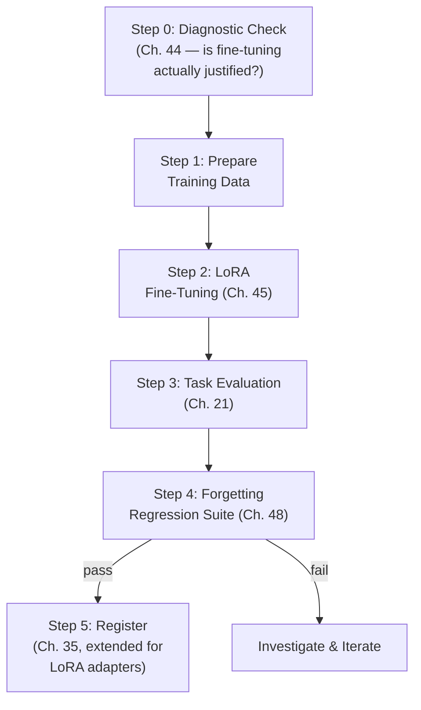

## Introduction

Part 9 closes the way Parts 6, 7, and 8 did — with a hands-on chapter that makes every preceding concept concrete. This chapter builds an actual, working LoRA fine-tuning pipeline in Python, deliberately incorporating every lesson from Chapters 44-48: a diagnostic check that fine-tuning is actually the right tool (Chapter 44), PEFT via LoRA rather than full fine-tuning (Chapter 45), a proper instruction-tuning data format (Chapter 46), domain-aware data curation (Chapter 47), and — the piece a less-informed pipeline would omit — a mandatory catastrophic-forgetting regression gate (Chapter 48) before any fine-tuned model is considered deployable.

## Pipeline Overview



## Step 0: The Diagnostic Check (Chapter 44)

Before writing any training code, the pipeline enforces Chapter 44's discipline as an explicit, non-skippable step.

```python
# diagnostics.py
from dataclasses import dataclass

@dataclass
class FineTuningJustification:
    is_justified: bool
    reasoning: str

def diagnose_finetuning_need(
    gap_type: str,  # "knowledge", "behavior", or "instruction_clarity"
    prompt_engineering_attempted: bool,
    rag_attempted: bool,
    example_count: int,
) -> FineTuningJustification:
    """
    Encodes Chapter 44's decision framework as executable logic —
    a team cannot proceed to Step 1 without explicitly passing
    this check, forcing the "have we ruled out cheaper options"
    discipline rather than leaving it as an informal suggestion.
    """
    if gap_type == "knowledge":
        return FineTuningJustification(
            False, "Knowledge gaps should be addressed with RAG (Ch. 44), not fine-tuning."
        )
    if gap_type == "instruction_clarity" and not prompt_engineering_attempted:
        return FineTuningJustification(
            False, "Attempt prompt engineering (Ch. 43) before fine-tuning for an "
                   "instruction-clarity gap."
        )
    if gap_type == "behavior" and example_count < 200:
        return FineTuningJustification(
            False, f"Only {example_count} examples available — Chapter 44 recommends "
                   "few-shot prompting over fine-tuning below ~200-1000 examples."
        )
    return FineTuningJustification(
        True, f"Behavior gap with {example_count} examples, cheaper alternatives "
              "already attempted — fine-tuning is justified."
    )
```

## Step 1: Preparing Instruction-Tuning Data (Chapter 46)

```python
# data_preparation.py
import json
from dataclasses import dataclass, asdict

@dataclass
class InstructionExample:
    instruction: str
    response: str
    source: str  # "domain_expert" or "general_replay" — see Ch. 48's replay mixing

def load_and_validate_examples(path: str) -> list[InstructionExample]:
    examples = []
    with open(path) as f:
        for line in f:
            record = json.loads(line)
            # Basic data quality validation (Ch. 10's discipline,
            # applied to fine-tuning data rather than tabular features)
            assert record.get("instruction"), "Missing instruction field"
            assert record.get("response"), "Missing response field"
            assert len(record["response"]) > 0, "Empty response"
            examples.append(InstructionExample(**record))
    return examples

def mix_with_replay_data(
    new_domain_examples: list[InstructionExample],
    general_replay_examples: list[InstructionExample],
    replay_ratio: float = 0.2,
) -> list[InstructionExample]:
    """
    Chapter 48's replay/rehearsal mitigation: mix a proportion of
    general-purpose instruction data into the domain-specific
    training set to reduce catastrophic forgetting risk.
    """
    replay_count = int(len(new_domain_examples) * replay_ratio / (1 - replay_ratio))
    import random
    replay_sample = random.sample(
        general_replay_examples, min(replay_count, len(general_replay_examples))
    )
    combined = new_domain_examples + replay_sample
    random.shuffle(combined)
    return combined
```

## Step 2: LoRA Fine-Tuning (Chapter 45)

```python
# train.py
# Illustrative use of the Hugging Face `peft` library — the standard,
# widely-used implementation of the LoRA mechanics from Chapter 45.

from peft import LoraConfig, get_peft_model, TaskType
from transformers import AutoModelForCausalLM, AutoTokenizer, TrainingArguments, Trainer

def build_lora_model(base_model_name: str, lora_rank: int = 8):
    base_model = AutoModelForCausalLM.from_pretrained(base_model_name)
    tokenizer = AutoTokenizer.from_pretrained(base_model_name)

    # Directly implements Chapter 45's LoRA mechanics: freeze the base
    # model, add small trainable low-rank matrices to targeted layers.
    lora_config = LoraConfig(
        task_type=TaskType.CAUSAL_LM,
        r=lora_rank,               # the rank discussed in Ch. 45
        lora_alpha=lora_rank * 2,  # scaling factor
        target_modules=["q_proj", "v_proj"],  # apply LoRA to attention's
                                                # Query/Value projections (Ch. 37)
        lora_dropout=0.05,
    )
    peft_model = get_peft_model(base_model, lora_config)
    peft_model.print_trainable_parameters()  # confirms the dramatic
                                                # parameter reduction from Ch. 45
    return peft_model, tokenizer

def format_for_training(example, tokenizer):
    text = f"### Instruction:\n{example.instruction}\n\n### Response:\n{example.response}"
    return tokenizer(text, truncation=True, max_length=1024)

def run_finetuning(base_model_name: str, training_examples: list, output_dir: str):
    model, tokenizer = build_lora_model(base_model_name)
    tokenized_dataset = [format_for_training(ex, tokenizer) for ex in training_examples]

    training_args = TrainingArguments(
        output_dir=output_dir,
        num_train_epochs=3,
        per_device_train_batch_size=4,
        learning_rate=2e-4,       # LoRA typically tolerates a higher
                                   # learning rate than full fine-tuning,
                                   # since far fewer parameters are updated
        logging_steps=10,
        save_strategy="epoch",
    )
    trainer = Trainer(model=model, args=training_args, train_dataset=tokenized_dataset)
    trainer.train()
    model.save_pretrained(output_dir)  # saves ONLY the small LoRA weights,
                                         # per Ch. 45's storage-efficiency point
    return model
```

## Step 3 & 4: Task Evaluation and the Forgetting Regression Gate (Chapters 21, 48)

This is the pipeline's most important structural decision, and the one a less-informed implementation would skip entirely: fine-tuning success is **not** determined by task performance alone.

```python
# evaluation_gate.py
from dataclasses import dataclass

@dataclass
class EvaluationResult:
    task_score: float
    regression_suite_results: dict[str, float]  # capability name -> score
    passed: bool
    failure_reason: str | None = None

def run_full_evaluation_gate(
    finetuned_model, tokenizer,
    task_eval_set: list,
    regression_suite: dict[str, list],  # e.g., {"general_instruction_following": [...],
                                          #        "prior_domain_A": [...]}
    task_score_threshold: float = 0.80,
    regression_tolerance: float = 0.05,  # max acceptable drop vs. baseline
    baseline_regression_scores: dict[str, float] = None,
) -> EvaluationResult:
    task_score = evaluate_task_performance(finetuned_model, tokenizer, task_eval_set)

    # Chapter 48's standing regression suite — run EVERY previously
    # established capability, not just the new task's own metric.
    regression_results = {}
    for capability_name, capability_eval_set in regression_suite.items():
        regression_results[capability_name] = evaluate_task_performance(
            finetuned_model, tokenizer, capability_eval_set
        )

    if task_score < task_score_threshold:
        return EvaluationResult(task_score, regression_results, False,
                                 f"Task score {task_score:.2f} below threshold {task_score_threshold}")

    for capability_name, score in regression_results.items():
        baseline = baseline_regression_scores.get(capability_name, 1.0)
        if baseline - score > regression_tolerance:
            return EvaluationResult(
                task_score, regression_results, False,
                f"Catastrophic forgetting detected: '{capability_name}' dropped "
                f"from {baseline:.2f} to {score:.2f} (Ch. 48)"
            )

    return EvaluationResult(task_score, regression_results, True)

def evaluate_task_performance(model, tokenizer, eval_set) -> float:
    # Simplified placeholder — a real implementation follows Ch. 21's
    # full offline evaluation discipline (task-appropriate metrics,
    # ideally including domain expert review per Ch. 47 where relevant).
    correct = 0
    for example in eval_set:
        generated = generate_response(model, tokenizer, example["instruction"])
        if matches_expected(generated, example["expected"]):
            correct += 1
    return correct / len(eval_set)
```

Notice that `run_full_evaluation_gate` can fail for two structurally different reasons — insufficient task improvement, or catastrophic forgetting — and the pipeline treats both as equally disqualifying. A fine-tuned model that excels at its new task but has silently degraded general instruction-following is **not** shipped, exactly as Chapter 48 argued.

## Step 5: Registering the LoRA Adapter (Chapter 35, Extended)

```python
# registry_integration.py
# Extends Chapter 35's model registry to track LoRA adapters as a
# distinct, lightweight artifact type referencing a base model version —
# directly answering the question Chapter 45 raised about registry design.

def register_lora_adapter(
    registry_client, base_model_version: str, adapter_name: str,
    adapter_path: str, evaluation_result: "EvaluationResult",
):
    if not evaluation_result.passed:
        raise ValueError("Cannot register an adapter that failed the evaluation gate")

    registry_client.register_adapter({
        "adapter_name": adapter_name,
        "base_model_version": base_model_version,  # the frozen base this
                                                      # adapter depends on (Ch. 45)
        "artifact_uri": adapter_path,
        "task_score": evaluation_result.task_score,
        "regression_scores": evaluation_result.regression_suite_results,
        "stage": "staging",  # enters the same staged rollout process
                              # from Ch. 22-23, 34, now for adapters
    })
```

## Running the Full Pipeline

```python
# pipeline.py
def run_pipeline(config: dict):
    justification = diagnose_finetuning_need(**config["diagnostic_inputs"])
    if not justification.is_justified:
        raise ValueError(f"Fine-tuning not justified: {justification.reasoning}")

    examples = load_and_validate_examples(config["data_path"])
    examples = mix_with_replay_data(examples, config["replay_examples"])

    model = run_finetuning(config["base_model_name"], examples, config["output_dir"])

    result = run_full_evaluation_gate(
        model, config["tokenizer"], config["task_eval_set"],
        config["regression_suite"], baseline_regression_scores=config["baselines"],
    )

    if result.passed:
        register_lora_adapter(config["registry_client"], config["base_model_version"],
                                config["adapter_name"], config["output_dir"], result)
        print("Pipeline complete: adapter registered and staged for rollout.")
    else:
        print(f"Pipeline halted: {result.failure_reason}")
```

## How This Pipeline Embodies Every Chapter in Part 9

- **Chapter 44** governs Step 0 — the pipeline structurally cannot proceed without an explicit, logged justification that fine-tuning (not RAG, not prompting) is the right tool.
- **Chapter 45** governs Step 2 — LoRA, not full fine-tuning, with the dramatic parameter reduction directly printed and verifiable.
- **Chapter 46** governs the data format in Step 1 — instruction/response pairs, the same structure Chapter 46 established for SFT.
- **Chapter 47** governs data curation quality (expert-sourced domain examples, tagged by `source` in the data model) and motivates including domain expert review in Step 3's task evaluation for domain-specific applications.
- **Chapter 48** governs Step 4 — the pipeline's defining structural feature: a fine-tuned model is only as good as its worst regression, not just its best new capability.

## Key Takeaways

- A production fine-tuning pipeline should structurally enforce Chapter 44's diagnostic check as a non-skippable first step, not an informal suggestion a team might forget to apply.
- LoRA fine-tuning (Chapter 45) is implemented via a small, well-established configuration (rank, target modules) layered on a frozen base model — the dramatic trainable-parameter reduction should be explicitly logged and verified.
- Fine-tuning data preparation should explicitly support replay mixing (Chapter 48) and should be validated for basic quality issues before training, exactly as Chapter 10 recommended for classical ML training data.
- The evaluation gate must check both new-task performance (Chapter 21) and a standing regression suite covering every previously-established capability (Chapter 48) — a model that improves on its new task but silently forgets prior capability should fail the gate and never reach the registry.

---

## Interview Questions

**1. Why does this chapter's pipeline implement Chapter 44's diagnostic check as an executable, non-skippable code step, rather than a documentation recommendation a team is simply expected to follow?**
Documentation-only recommendations are easy to skip under time pressure or simply forgotten, especially by team members newer to the codebase or under deadline pressure — encoding the diagnostic check as actual, enforced code (a function that must return a positive justification before the pipeline proceeds to training) makes it structurally impossible to bypass this discipline accidentally, directly mirroring this series' general preference (established since Chapter 10's automated data validation and Chapter 31's automated CI/CD gates) for enforcing important discipline through automated, structural mechanisms rather than relying purely on documented best practices and individual diligence, which are more fragile and prone to being skipped under real-world pressure.
*Follow-up: What's a risk of making this diagnostic check too rigid or too difficult to override, even in a genuinely exceptional situation where fine-tuning might be justified despite not meeting the coded criteria?*
An overly rigid check with no override mechanism at all risks blocking a genuinely justified, exceptional use case that the coded heuristics didn't anticipate (echoing the general risk of any automated gate being too blunt an instrument for every possible real-world nuance, a concern raised throughout this series, e.g., Chapter 31's human-review-gate discussion) — a well-designed version of this check should allow for an explicit, logged override path (perhaps requiring a senior engineer's documented sign-off explaining why the specific situation genuinely warrants an exception to the general heuristic) rather than either blocking all exceptions rigidly or having no enforcement at all, striking the same balance between automated discipline and preserved human judgment that Chapter 31 recommended for CI/CD gates generally.

**2. Why does the pipeline print and verify the "trainable parameters" count immediately after constructing the LoRA model, rather than just proceeding directly to training?**
This directly operationalizes Chapter 45's core claim — that LoRA dramatically reduces the number of trainable parameters compared to the base model's full parameter count — as something the pipeline actively verifies rather than simply assumes; printing and checking this count provides an immediate, concrete sanity check that the LoRA configuration was applied correctly (targeting the intended layers, at the intended rank) before investing time and compute in a full training run, catching a potential configuration error (e.g., accidentally leaving too many layers trainable, or a misconfigured target module list resulting in far more trainable parameters than intended) early, before it wastes a full training cycle's worth of compute on a misconfigured setup.
*Follow-up: What specific value would you expect this trainable-parameter count to show, and what would an unexpectedly high value suggest about a potential configuration problem?*
For a LoRA configuration targeting the attention layers' Query and Value projections at a modest rank (like this chapter's rank-8 example) on a multi-billion-parameter base model, you'd expect the trainable parameter count to represent a very small fraction (often well under 1%) of the base model's total parameters, consistent with Chapter 45's dramatic reduction claim; an unexpectedly high trainable-parameter count (a much larger percentage than expected) would suggest the LoRA configuration is inadvertently targeting far more layers or modules than intended (perhaps due to an overly broad `target_modules` specification), or that the base model itself isn't being properly frozen before the LoRA layers are added — either scenario would indicate a configuration bug worth investigating and fixing before proceeding with a full, potentially wastefully expensive training run under the mistaken assumption that PEFT's efficiency benefits are actually being realized.

**3. Why does the `mix_with_replay_data` function calculate `replay_count` based on a target replay RATIO relative to the new domain data, rather than simply adding a fixed number of replay examples regardless of the domain dataset's size?**
Calculating the replay count as a ratio relative to the new domain dataset's size ensures the proportion of general-purpose replay data within the combined training set remains consistent regardless of how large or small the new domain-specific dataset happens to be for a given fine-tuning project — this directly addresses the concern raised in Chapter 48's discussion of replay's potential limitations, where a fixed, small number of replay examples could be effectively "drowned out" and have minimal influence if the new domain dataset happens to be very large, while that same fixed number might be disproportionately large (unnecessarily limiting how much new domain-specific signal the training process receives) if the new domain dataset happens to be small — using a ratio-based calculation ensures the replay mitigation's relative strength remains appropriately calibrated across fine-tuning projects with very different data-volume characteristics.
*Follow-up: How would you determine an appropriate replay_ratio value for a new fine-tuning project, rather than using the illustrative 0.2 default shown in this chapter's code?*
I'd treat this as a hyperparameter to be empirically validated (following the same hyperparameter-tuning discipline from Chapter 19, now applied to this replay ratio specifically) — running the fine-tuning pipeline with a few different candidate replay_ratio values and checking, via the Chapter 48 regression suite this chapter's evaluation gate implements, which specific ratio achieves an acceptable balance between the new task's performance improvement and the preservation of prior, general capability — favoring the smallest replay ratio that still keeps the regression suite's results within an acceptable tolerance, since a higher replay ratio, while providing stronger forgetting protection, also proportionally reduces how much of the training process's capacity is devoted to learning the new, specific domain task the fine-tuning was actually intended to improve.

**4. Why does `run_full_evaluation_gate` treat "task score below threshold" and "regression suite detects forgetting" as two independently disqualifying failure conditions, rather than combining them into a single overall quality score?**
Combining these into a single overall score would risk a scenario where a very strong new-task performance improvement mathematically "outweighs" and masks a real, concerning regression in a previously-established capability within the combined score, potentially allowing a model with genuine, unacceptable catastrophic forgetting to still pass an aggregate quality bar simply because its new-task improvement was large enough to compensate numerically — treating these as two independent, separately-checked gating conditions (following Chapter 6's general principle of guardrail metrics being checked independently rather than being averaged into a single blended score, so a catastrophic guardrail failure can't be masked by strong primary-metric performance) ensures that a genuine, unacceptable regression in ANY previously-established capability blocks deployment regardless of how impressive the new task's own performance improvement might independently be.
*Follow-up: How does this design decision directly reflect the guardrail metric concept first introduced in Chapter 6, now applied specifically to LLM fine-tuning evaluation?*
Chapter 6 established that a primary metric (the main thing you're trying to optimize) should be evaluated alongside independent guardrail metrics (things you don't want to get meaningfully worse, even while optimizing the primary metric) — in this pipeline, the new task's performance score functions as the primary metric, while each capability in the Chapter 48 regression suite functions as an independent guardrail metric; exactly as Chapter 6 recommended, these guardrails are checked independently rather than blended into the primary metric's evaluation, ensuring that even a very strong primary-metric (new task) result cannot compensate for or mask an unacceptable guardrail (regression) failure — a direct, concrete application of Chapter 6's general metric-design principle to this specific fine-tuning evaluation context.

**5. Why does the registry integration code explicitly reject registering an adapter that failed the evaluation gate, rather than allowing registration with a "failed" status flag for later review?**
Allowing a failed adapter to be registered (even with a "failed" status flag) creates a risk that a later process, a different team member unfamiliar with the specific failure, or an automated system might inadvertently reference, promote, or deploy this failed adapter without properly checking its status flag first — actively preventing the registration entirely for a failed evaluation (raising an exception rather than registering with a warning status) provides a stronger, structurally-enforced safety guarantee that a fundamentally unacceptable adapter (one with a real, detected catastrophic forgetting problem or insufficient task performance) simply cannot exist within the registry's set of "available, registered adapters" at all, eliminating the possibility of this kind of accidental downstream reference or promotion entirely, rather than relying on every future consumer of the registry to correctly and consistently check and respect a status flag.
*Follow-up: What's a legitimate reason a team might still want SOME record of a failed fine-tuning attempt, even if the actual adapter artifact itself should never be registered as an available, deployable artifact?*
Maintaining a separate, clearly-distinguished experiment-tracking or fine-tuning-attempt log (distinct from the production model/adapter registry itself) — recording that a specific fine-tuning attempt was made, what its evaluation results were, and why it failed — provides valuable historical context for future fine-tuning efforts (helping avoid repeating a similar, already-known-to-fail configuration, and providing a useful audit trail of the project's overall fine-tuning history) without conflating this experiment-tracking record with the production registry's specific, more consequential guarantee that everything registered there has actually passed the full evaluation gate and is genuinely safe to consider for deployment — this is a similar distinction to the general separation this series has recommended elsewhere (e.g., Chapter 33's distinction between full experiment logs and production observability data) between comprehensive historical record-keeping and the more curated, higher-stakes production system of record.

**6. How would you extend this chapter's pipeline to support the domain-specific instruction tuning scenario from Chapter 47, where training data specifically requires expert validation?**
I'd extend the `InstructionExample` data model and the `load_and_validate_examples` function to include and check for an explicit expert-review status field (e.g., `reviewed_by: str | None` and `review_status: "approved" | "pending" | "rejected"`), and I'd add a data-quality gate (following the same automated validation philosophy from Chapter 10 and this chapter's basic `assert` checks) that rejects any training example lacking a confirmed "approved" review status from a qualified domain expert before it's allowed to proceed into the training data set — directly enforcing Chapter 47's requirement that domain-specific instruction tuning data be expert-validated as a structural, code-enforced pipeline requirement, rather than an informal expectation a team might inconsistently apply when preparing training data by hand.
*Follow-up: Why might this expert-review requirement need to be enforced differently (with a different validation mechanism) than the basic data quality checks (like checking for a non-empty response field) already shown in this chapter's code?*
Basic data quality checks (non-empty fields, correct data types, valid JSON structure) can be fully automated and checked purely programmatically, requiring no human judgment at all; confirming that a specific domain-specific instruction-response pair reflects genuinely correct, expert-validated domain reasoning inherently requires actual human domain expertise to assess (echoing Chapter 47's core point about why domain expert review can't be replaced by an automated or general-purpose check) — meaning this specific validation requirement can only be enforced by ensuring the data pipeline requires and checks for evidence of that human expert review having actually occurred (a review status field populated by an actual review process) rather than attempting to automate the substantive correctness check itself, which would require the very domain expertise the check is meant to verify was actually applied by a qualified human reviewer in the first place.

**7. Why might a team choose to run the Chapter 48 regression suite (Step 4) BEFORE the full task-specific evaluation (Step 3), rather than after, as an optimization to this chapter's pipeline?**
If a team expects catastrophic forgetting failures to occur more frequently or be cheaper/faster to detect than task-specific evaluation failures for their specific fine-tuning setup, running the regression suite first could provide a faster overall pipeline by allowing an early exit (halting the pipeline immediately upon detecting a forgetting failure) without needing to also run the potentially more time-consuming or expensive task-specific evaluation first — this is a pure pipeline-efficiency optimization (fail fast on whichever check is more likely to catch a problem, or cheaper to run) rather than a change to the pipeline's underlying evaluation logic or standards, similar in spirit to general software testing practices that order test suites to surface likely failures as quickly and cheaply as possible.
*Follow-up: Would this reordering change anything about the FINAL evaluation outcome or decision the pipeline reaches, or only the speed at which a failure is detected?*
This reordering would not change the final outcome or decision at all — the pipeline's `EvaluationResult` and its "passed" determination depend on both the task score and the regression suite results being within acceptable bounds, and a genuinely successful fine-tuning run would need to pass both checks regardless of which order they're evaluated in; the only difference from this reordering would be how quickly a pipeline that's already known to fail (for either reason) actually surfaces that failure and halts, which is purely an efficiency and fail-fast consideration, not a change to the substantive evaluation criteria or the ultimate correctness of the pipeline's final registration decision.

**8. How would you handle a situation where the pipeline's evaluation gate repeatedly fails due to catastrophic forgetting, even after applying the replay mixing mitigation from Step 1?**
I'd follow this chapter's and Chapter 48's diagnostic escalation path — first checking whether the replay ratio itself needs to be increased (following the empirical validation approach discussed earlier in this Q&A set), and if increasing the replay ratio alone doesn't sufficiently resolve the regression, considering whether the LoRA configuration itself needs adjustment (perhaps the rank is too high, allowing too much capacity for the adaptation to disturb the frozen base model's behavior more than a lower rank would, or perhaps too many layers are being targeted by the LoRA configuration) — and if these adjustments still prove insufficient, I'd consider whether the more computationally demanding EWC-style regularization technique from Chapter 48 is warranted for this specific, apparently more forgetting-prone fine-tuning scenario, escalating through this chapter's and Chapter 48's available mitigation techniques in order of increasing cost and complexity, validated empirically at each step via the same regression suite, rather than assuming any single fixed mitigation approach will necessarily work for every fine-tuning scenario without this kind of iterative, evidence-based escalation.
*Follow-up: What would repeated regression-gate failures, even after trying several of these mitigations, potentially suggest about the underlying fine-tuning task or data itself, beyond just needing a stronger forgetting mitigation?*
Persistent, hard-to-mitigate forgetting despite multiple reasonable mitigation attempts might suggest that the new task's required behavioral adaptation is genuinely, fundamentally in significant tension or conflict with the model's existing, previously-established general capability or prior domain adaptations (echoing this chapter's earlier discussion of how forgetting severity depends on the degree of overlap or conflict between the new and prior tasks' useful weight configurations) — this could be a signal worth escalating to a more fundamental review of the fine-tuning approach itself (perhaps this specific new task genuinely requires an entirely separate, non-integrated model or adapter rather than attempting to preserve full integration with the existing model's other capabilities), rather than assuming a "stronger" version of the same mitigation techniques will eventually and inevitably succeed if only enough incremental adjustment is applied without addressing this potentially more fundamental, underlying tension.

**9. In an interview, if asked to walk through how you would productionize a fine-tuning workflow that a data science team has been running manually and inconsistently, how would you use this chapter as a model for your answer?**
I'd describe converting the team's manual, inconsistent process into exactly this chapter's structured pipeline — first ensuring an explicit, code-enforced justification step (Chapter 44) exists so fine-tuning is only pursued when genuinely warranted, then standardizing the data preparation and validation step (with explicit data quality checks and, where relevant, expert-review requirements per Chapter 47), implementing the actual fine-tuning using efficient PEFT techniques (Chapter 45) rather than whatever ad-hoc approach the team may have previously used, and critically, adding the mandatory dual evaluation gate (task performance AND the standing regression suite, per Chapters 21 and 48) as a required, automated checkpoint before any fine-tuned artifact is registered and made available for deployment — explicitly noting that this transformation from manual, inconsistent process to structured, automated pipeline directly parallels the general CI/CD/CT transformation this series described in Chapter 31 for classical ML retraining, now specifically adapted for the LLM fine-tuning context this Part has covered.
*Follow-up: What would you prioritize implementing FIRST if you had to productionize this pipeline incrementally, rather than building all of these components simultaneously?*
I'd prioritize implementing the evaluation gate (Steps 3-4, particularly the Chapter 48 regression suite) first, even before fully automating the earlier pipeline stages — since this is the component most directly responsible for preventing a genuinely harmful outcome (an unvalidated, potentially forgetting-degraded model reaching production) from occurring, addressing the single highest-risk gap in a manual, inconsistent process first provides the most immediate risk-reduction value, even if the earlier pipeline stages (data preparation, the diagnostic justification check) remain comparatively more manual and less automated in this initial, incremental implementation phase — directly applying the general "prioritize the highest-risk gap first" principle this series has recommended for similarly staged, incremental infrastructure investments throughout (e.g., Chapter 31's discussion of incrementally building out CI/CD/CT capability).

**10. Why does this chapter's pipeline save "ONLY the small LoRA weights" (per the code comment) rather than saving a complete, merged model after training, and what would need to change if the team specifically wanted a merged model instead?**
Saving only the small LoRA weights (rather than merging them into a new, complete, standalone model copy) preserves the storage and serving efficiency benefits described in Chapter 45 — allowing this adapter to be dynamically loaded alongside the shared, already-existing base model at serving time, rather than requiring storage and deployment of an entirely new, full-size model copy, directly avoiding the "one full model copy per fine-tuned variant" cost problem that Chapter 45 established PEFT is specifically designed to solve; if a team specifically wanted a complete, merged, standalone model (perhaps for a use case requiring the absolute minimum possible inference latency without any LoRA-application overhead, or for deploying to an environment that doesn't support the dynamic adapter-loading serving architecture this pipeline assumes), they would need to call the underlying library's explicit merge function (e.g., a `merge_and_unload()`-style method commonly provided by LoRA implementation libraries) to combine the trained LoRA matrices back into the base model's weights, producing a new, complete model artifact — trading away the multi-variant storage/serving efficiency benefit in exchange for a standalone, dependency-free model artifact.
*Follow-up: Why might this "save only LoRA weights" default be the more appropriate choice for MOST production use cases, even though the merged-model alternative remains available when specifically needed?*
Most production use cases benefit from the ongoing flexibility and efficiency this chapter's default approach provides — the ability to serve multiple different fine-tuned variants (for different customers, domains, or tasks, per Chapter 45's and Chapter 48's discussion) from a single shared base model, and the ability to update or replace a specific adapter independently without needing to re-save or redeploy an entire, large, standalone model each time — these ongoing operational benefits generally outweigh the comparatively rare and narrow scenario where a fully merged, standalone model is specifically required, making the LoRA-weights-only default the more broadly useful and forward-compatible choice for a general-purpose fine-tuning pipeline, with the merge operation remaining available as a deliberate, occasional exception for the specific cases that genuinely need it.

**11. How would you modify this chapter's pipeline to support the automated retraining trigger policy from Chapter 34, so fine-tuning is initiated automatically rather than manually?**
I'd wrap this chapter's `run_pipeline` function as the action triggered by Chapter 34's `evaluate_retraining_policy` function — extending Chapter 34's retraining decision logic to be aware of the LLM-specific context (e.g., checking for accumulated new domain-specific instruction examples reaching a sufficient volume threshold, similar to Chapter 34's "sufficient labeled examples" check, now specifically informed by this chapter's diagnostic justification requirements from Step 0) — so that once Chapter 34's policy determines a fine-tuning round is warranted (based on accumulated new data, a detected quality gap, or a scheduled cadence), it automatically triggers this chapter's full pipeline (Steps 0 through 5) rather than requiring a data scientist to manually initiate and babysit each of these steps individually.
*Follow-up: What specific modification to Chapter 34's retraining policy logic would be needed to account for this chapter's Step 0 diagnostic check, which classical ML retraining (Chapter 34's original context) didn't need to consider?*
Chapter 34's original retraining policy focused on questions like "has enough new data accumulated" and "has drift been confirmed" — extending this policy for LLM fine-tuning specifically would need to add this chapter's Step 0 diagnostic check as an additional, required condition within the automated policy itself: even if sufficient new data has accumulated and would traditionally trigger a classical ML retraining round, the extended LLM-specific policy should first verify (using this chapter's `diagnose_finetuning_need` logic) that the underlying gap being addressed is genuinely a behavioral gap best suited to fine-tuning, rather than automatically triggering an LLM fine-tuning round for what might actually be better addressed by simply updating a RAG knowledge source instead (per Chapter 44's framework) — ensuring the automated policy doesn't inadvertently bypass this chapter's Step 0 discipline just because it's now running automatically rather than being manually initiated by a data scientist who might have applied that judgment themselves.

**12. Why is it valuable for `evaluate_task_performance` to be a shared, reused function called both for the primary task evaluation (Step 3) and for each capability in the regression suite (Step 4), rather than having separate, independently-implemented evaluation logic for each?**
Using the same underlying evaluation function for both purposes ensures methodological consistency — the primary task score and each regression-suite capability score are all computed using the exact same evaluation methodology (the same way of generating a response and checking it against an expected outcome), meaning any comparison between these different scores (checking whether a regression capability's score has dropped relative to its baseline, or comparing the primary task score against its threshold) is a fair, apples-to-apples comparison rather than potentially being confounded by subtle methodological differences between separately-implemented evaluation logic for different purposes — this also reduces code duplication and the associated risk of inconsistent bugs or subtly different behavior being introduced across what should conceptually be the same fundamental "does this model perform this task well" evaluation logic, just applied to different specific eval sets for different purposes.
*Follow-up: What limitation does this shared evaluation function's simplicity (a basic "does the generated output match the expected output" check) have, given Chapter 39's discussion of generation's inherent output variability?*
As Chapter 39 established, stochastic decoding means the same prompt can legitimately produce different, but equally valid, phrasings across different runs — a simplistic exact-match or near-exact-match evaluation function (as this chapter's illustrative `matches_expected` placeholder suggests) risks incorrectly failing a genuinely good response that happens to be phrased differently than the specific "expected" reference response, rather than correctly recognizing it as a valid, differently-worded but equally correct answer; a more robust, production-ready version of this evaluation function would need the kind of more sophisticated evaluation approach discussed in Chapter 43 (checking structural/semantic properties rather than exact text match) or the LLM-as-judge techniques Part 13 will cover, rather than relying on this chapter's deliberately simplified placeholder evaluation logic, which was chosen here specifically to keep the pipeline's core structural logic clear and readable rather than to demonstrate production-grade evaluation methodology in full depth.

**13. How would you extend this chapter's pipeline to incorporate the QLoRA quantization technique from Chapter 45, rather than the standard, full-precision LoRA shown in this chapter's `build_lora_model` function?**
I'd modify the `build_lora_model` function to load the base model using a quantization configuration (typically via a library like `bitsandbytes`, commonly used alongside the `peft` library for this purpose) specifying 4-bit quantization for the frozen base model's weights, before applying the same LoRA configuration on top of this now-quantized base model — the rest of the pipeline (data preparation, the training loop structure, and critically, the evaluation gate in Steps 3-4) would remain essentially unchanged, since QLoRA's specific innovation (Chapter 45) is specifically about the memory-efficient representation of the frozen base model during training, not a change to the overall fine-tuning workflow, data requirements, or evaluation methodology this chapter's pipeline otherwise implements.
*Follow-up: Why is it reassuring, from a system design perspective, that adopting QLoRA specifically would require changes to only this one narrow part of the pipeline (the base model loading/quantization configuration) rather than requiring broader changes throughout?*
This reflects good separation of concerns in the pipeline's overall design — the memory-efficiency mechanism used to load and represent the frozen base model (standard precision versus QLoRA's quantized representation) is appropriately isolated as an implementation detail of the `build_lora_model` function specifically, while the broader pipeline stages (data preparation, evaluation, registry integration) are correctly designed to be agnostic to this specific technical choice, since they don't need to know or care whether the underlying base model happens to be represented in full precision or in a quantized format — this kind of clean separation of concerns means a team can adopt QLoRA (perhaps because they need to fine-tune a larger model than their available hardware could otherwise accommodate, per Chapter 45's discussion) as a targeted, low-risk infrastructure change, without needing to also revalidate or modify the pipeline's broader data handling, evaluation, or registry integration logic, which remain correctly unaffected by this specific, well-isolated technical choice.

**14. How would you use this chapter's complete pipeline example to illustrate, for someone finishing Part 9, the difference between "understanding fine-tuning concepts" and "being able to build a production-ready fine-tuning system"?**
Understanding fine-tuning concepts (Chapters 44-48) means being able to explain why fine-tuning might be justified, how LoRA achieves parameter efficiency, how instruction tuning and RLHF work, why domain adaptation requires specific techniques, and why catastrophic forgetting is a risk — but this chapter demonstrates that building an actual, production-ready system requires additionally knowing how to structurally *enforce* these concepts as executable, automated pipeline logic (a diagnostic check that can't be skipped, a data validation step that rejects poor-quality data, an evaluation gate that checks both task performance and forgetting regression before allowing registration) — the gap between conceptual understanding and production-ready implementation is precisely this kind of structural, automated enforcement, which is exactly why this series has consistently closed each major Part with a hands-on code chapter (Chapters 30, 35, and now 49) specifically designed to bridge this gap between "I understand the concepts" and "I can build the actual system that reliably embodies these concepts in practice."
*Follow-up: What specific aspect of this chapter's pipeline would you point to as the clearest example of this "structural enforcement over conceptual understanding alone" principle?*
The dual evaluation gate in Step 4 is the clearest example — someone who only conceptually understands Chapter 48's catastrophic forgetting risk might, in an unstructured or purely manual workflow, simply forget to actually check for forgetting on a particular day when they're focused on validating the new task's exciting performance improvement; this chapter's pipeline makes this check structurally mandatory — the `run_full_evaluation_gate` function's logic and the `register_lora_adapter` function's explicit rejection of failed evaluations together make it *impossible* for a fine-tuned model to reach the registry without this check having been run and passed, regardless of whether the specific engineer running the pipeline that day happens to remember to think about catastrophic forgetting or not — directly illustrating how structural, code-enforced discipline provides a more reliable safety guarantee than relying on every individual engineer's conceptual understanding and diligence alone, every single time, without fail.

**15. How would you summarize, for someone moving on to Part 10's LLM inference and serving chapters, why completing Part 9's fine-tuning material — culminating in this chapter's pipeline — properly prepares them for that next Part's content?**
Part 9 has covered how to adapt a model's behavior (through fine-tuning, when genuinely justified) — but every fine-tuned model or LoRA adapter this Part's pipeline produces still needs to actually be served to real users in production, which is exactly what Part 10 will address: efficient inference (KV caching, batching), scaling LLM serving, and the specific infrastructure needed to actually deploy and serve these models (and, per this chapter's registry extension, dynamically load the right LoRA adapter) at production scale and cost-effectiveness; having just built this chapter's pipeline, which explicitly registers a validated adapter as "staged for rollout" at its final step, a reader is well-positioned to immediately recognize Part 10's content as addressing precisely the next, necessary stage this chapter's pipeline was building toward but didn't yet cover — the actual, efficient, at-scale serving of the fine-tuned models and adapters this Part has taught how to responsibly produce.
*Follow-up: What specific serving-related question would this chapter's pipeline output (a registered LoRA adapter with a "staging" status) naturally raise, that Part 10 is positioned to directly answer?*
The natural next question is: "given this registered adapter, and the shared, frozen base model it depends on, how do we actually serve requests using this specific adapter efficiently, at whatever request volume and latency requirements our application needs, especially if we have many different registered adapters that might need to be served simultaneously for different customers or tasks?" — this is precisely the question Part 10's LLM inference and serving chapters (covering KV caching, batching, multi-tenant serving, and the specific infrastructure for dynamically loading and serving LoRA adapters at scale) are positioned to directly and thoroughly answer, providing the natural, well-motivated continuation from this chapter's "we've produced a validated, registered adapter" endpoint into Part 10's "now let's actually serve it efficiently in production" starting point.
