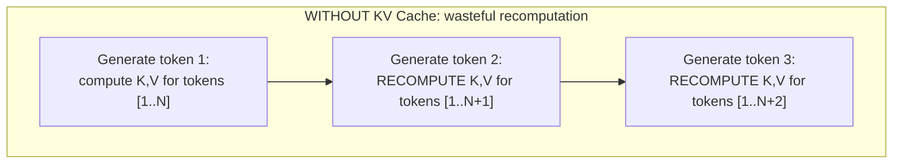
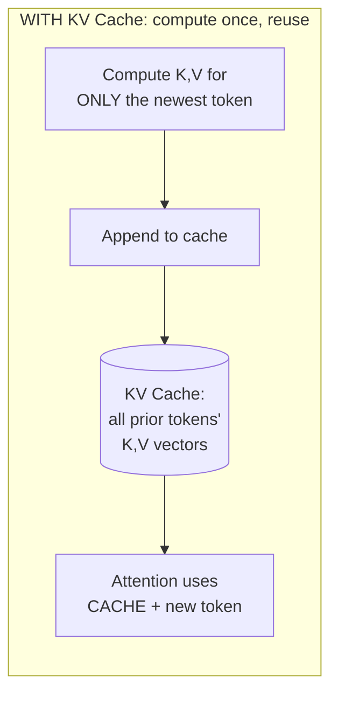
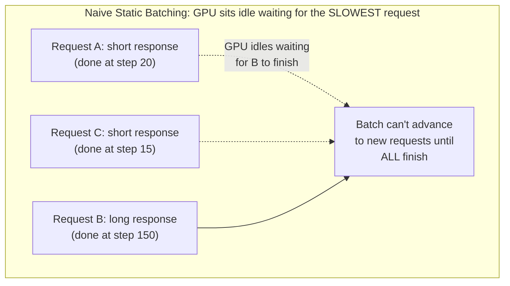
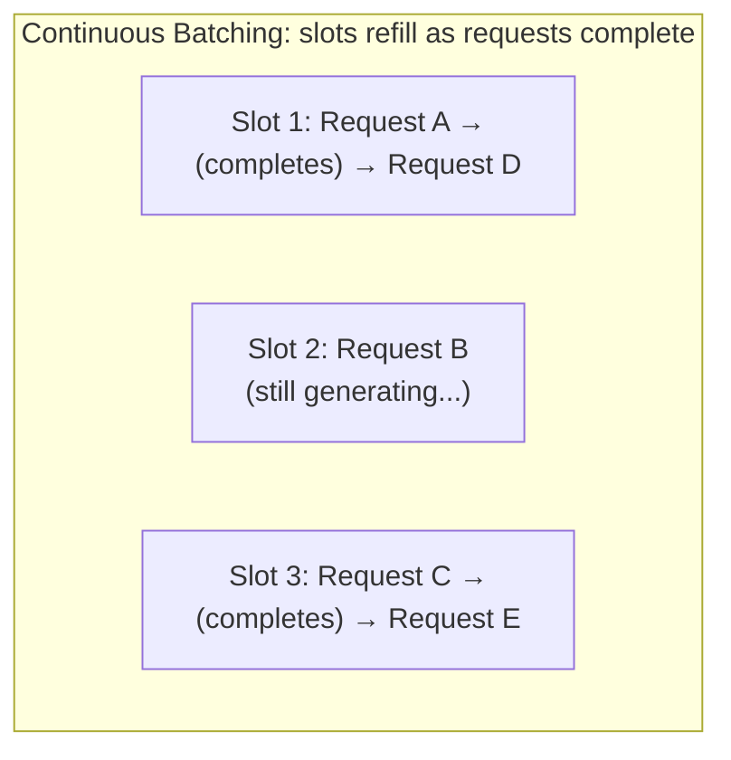
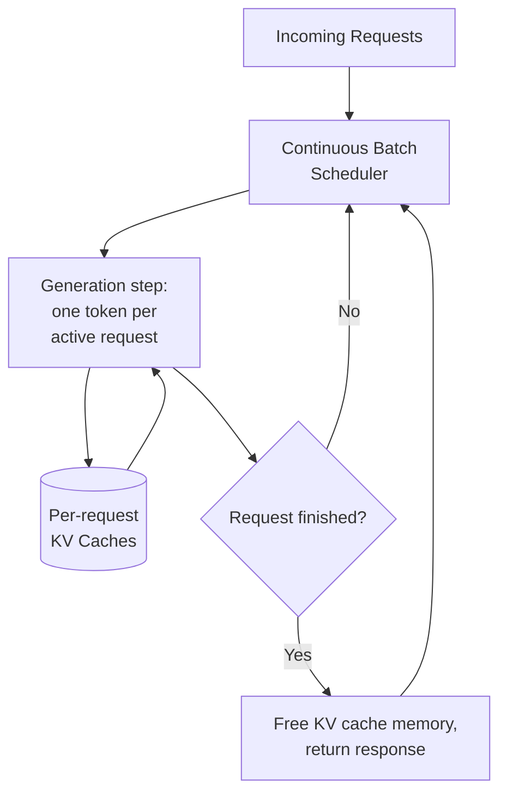

## Introduction

Part 9 closed with a fine-tuning pipeline that ends in "staged for rollout" — Part 10 picks up exactly there: how to actually serve an LLM efficiently, at scale, in production. This chapter covers the two foundational optimizations underlying virtually every modern LLM serving system: **KV caching**, which Chapter 37 explicitly set up by establishing the Key/Value concept in self-attention, and **continuous batching**, which addresses the GPU utilization challenge created by LLM generation's uniquely variable-length, sequential nature.

## KV Caching: Eliminating Redundant Computation

Chapter 37 established that self-attention computes Key and Value vectors for every token in a sequence, and that a token's own Key/Value representation — given causal masking — never changes based on what tokens come after it. This fact has a major computational consequence for autoregressive generation.

**Without caching**: generating each new token would require recomputing the Key and Value vectors for *every* token in the sequence so far — the prompt, plus every previously generated token — at every single generation step, even though the vast majority of those Key/Value vectors are identical to what was just computed one step earlier.



**With KV caching**: the Key and Value vectors for every previously-processed token are computed once and stored in a cache; each new generation step only computes the Key and Value for the single newest token, reusing the cached values for everything before it.

```python
class KVCache:
    """
    A simplified illustration of KV caching. In practice, this is
    implemented inside the model's attention layers, but the core
    idea is exactly this: store computed K/V pairs, append rather
    than recompute.
    """
    def __init__(self):
        self.cached_keys = []    # one entry per layer, per past token
        self.cached_values = []

    def append(self, layer_idx: int, new_key, new_value):
        self.cached_keys[layer_idx].append(new_key)
        self.cached_values[layer_idx].append(new_value)

    def get_full_keys_values(self, layer_idx: int):
        # Concatenates the newly computed K/V for the current token
        # with everything already cached — avoiding recomputation
        # of anything already processed.
        return self.cached_keys[layer_idx], self.cached_values[layer_idx]
```



**The trade-off KV caching introduces**: this dramatically reduces computation (turning what would be quadratic, repeated work into linear, incremental work per new token) at the direct cost of **GPU memory** — the cache must hold Key and Value vectors for every token in every active sequence, across every layer of the model, growing linearly with sequence length and multiplying with the number of concurrent sequences being served. This memory cost is the central constraint the rest of this Part continually returns to.

## Why Naive Batching Doesn't Work Well for LLM Generation

Classical ML serving (Chapter 29) batches requests together to improve GPU utilization — multiple inputs processed in a single forward pass is more efficient than one at a time. Applying this same idea naively to LLM generation runs into a problem unique to autoregressive generation: **different requests in a batch finish generating at different times**, since each request's response has a different length, and (Chapter 39) each request may have started at a different time.



With naive static batching (process a fixed batch together until every request in it completes), the GPU sits partially idle for the entire duration after a short request finishes but before the longest request in the same batch completes — a direct waste of the exact GPU capacity Chapter 16 emphasized was expensive and precious.

## Continuous Batching: The Solution

**Continuous batching** (also called dynamic or in-flight batching) solves this by **not waiting for an entire batch to finish** before admitting new requests — as soon as any individual request in the current batch completes, a new, waiting request is immediately admitted to take its place in the batch, keeping the GPU continuously occupied with useful work rather than idling for straggler requests.



```python
class ContinuousBatchScheduler:
    """
    A simplified illustration of continuous batching's core loop —
    real implementations (vLLM, TGI, covered in Chapter 52) are far
    more sophisticated, but the fundamental idea is exactly this.
    """
    def __init__(self, max_batch_size: int):
        self.max_batch_size = max_batch_size
        self.active_requests = {}
        self.waiting_queue = []

    def step(self):
        # Generate ONE token for every currently active request —
        # this is the key structural shift: batching happens at the
        # granularity of a single generation STEP, not a whole request.
        for request_id, request in list(self.active_requests.items()):
            next_token = generate_one_token(request)
            request.append(next_token)
            if next_token == EOS_TOKEN or request.exceeds_max_length():
                del self.active_requests[request_id]  # slot freed immediately
                self._admit_next_waiting_request()

    def _admit_next_waiting_request(self):
        if self.waiting_queue and len(self.active_requests) < self.max_batch_size:
            new_request = self.waiting_queue.pop(0)
            self.active_requests[new_request.id] = new_request
```

The critical structural shift: batching now happens at the granularity of a **single generation step** (one token, across all active requests), not at the granularity of a whole request's complete lifetime — directly enabling requests of wildly different lengths to share GPU capacity efficiently without any request forcing others to wait idly for it to finish.

## The Combined Picture: KV Cache + Continuous Batching



These two techniques compound: KV caching makes each individual generation step computationally cheap (avoiding redundant recomputation), while continuous batching ensures the GPU is kept maximally, continuously busy across many concurrent requests despite their varying lengths — together forming the foundational efficiency layer that every serving framework covered in Chapter 52 (vLLM, TGI) builds upon and further refines.

## Key Takeaways

- KV caching stores each token's Key and Value vectors once, reusing them across every subsequent generation step, turning redundant, repeated attention computation into cheap, incremental computation — at the direct cost of GPU memory that grows with sequence length and concurrent request count.
- Naive static batching wastes GPU capacity because requests in the same batch finish generating at different times, forcing the GPU to idle for the slowest request before admitting new work.
- Continuous batching admits new requests into a shared batch the instant any slot frees up, shifting the unit of batching from "whole request" to "single generation step" — keeping the GPU continuously occupied across requests of varying length.
- KV caching and continuous batching are complementary, foundational optimizations that compound together, forming the efficiency baseline every modern LLM serving framework builds upon.

---

## Interview Questions

**1. Why does KV caching eliminate redundant computation specifically, rather than simply making the same computation faster?**
As established in Chapter 37, causal masking means a token's Key and Value vectors are a function only of that token itself and the model's fixed weights — they never depend on tokens generated after it, meaning that once a token's K/V has been computed, it will never need to be recomputed differently later; without caching, each new generation step naively recomputes K/V for the entire sequence so far, including many tokens whose K/V values are identical to what was already computed in a previous step — this is pure, avoidable redundancy (computing the exact same values repeatedly), not merely slow computation, and KV caching eliminates it entirely by storing and reusing these already-computed, unchanging values rather than making the redundant recomputation itself somehow faster.
*Follow-up: Why is it specifically true that causal masking is the property that makes this redundancy eliminable, rather than this being a general property of all sequence models?*
Causal masking guarantees a token's K/V representation depends only on itself and preceding tokens, never on future tokens — this one-directional dependency is exactly what makes the value "stable" and safely cacheable once computed, since no future computation could ever require it to be different; a hypothetical model architecture without this causal, one-directional constraint (for example, a bidirectional encoder like BERT, discussed in Chapter 37, where a token's representation legitimately depends on the entire surrounding sequence including tokens that come after it) would not have this same stability property — a token's representation could validly need to be recomputed if new context were later added anywhere in the sequence, meaning KV caching in its standard, straightforward form specifically depends on and exploits the causal masking property unique to decoder-only, autoregressive generation architectures.

**2. Explain the direct trade-off KV caching introduces, and why this specific trade-off (computation for memory) is generally considered a favorable one for LLM serving.**
KV caching trades reduced computational cost (avoiding redundant recomputation of already-computed Key/Value vectors) for increased GPU memory usage (the cache must store these vectors for every token, in every layer, for every currently active sequence, with memory usage growing linearly as sequences get longer and multiplying with the number of concurrent sequences being served) — this trade-off is generally favorable because, per Chapter 37's discussion of self-attention's computational cost, avoiding this redundant recomputation provides a very large reduction in the actual FLOPs required per generation step (turning what would otherwise be increasingly expensive, repeated computation into much cheaper, incremental computation), while the additional memory cost, though real and significant (as this Part's later chapters on GPU memory management will explore), is generally more manageable and more directly provisionable (you can add more GPU memory, or manage it carefully) than the alternative of accepting the much larger, ever-growing computational cost that not caching would impose on every single generation step.
*Follow-up: Under what circumstance might this trade-off become LESS favorable, motivating some of the more advanced memory-management techniques covered later in this Part?*
This trade-off becomes less favorable, or at least more operationally challenging, as the number of concurrent requests and the length of individual sequences (and their context windows, per Chapter 38) both grow — since KV cache memory usage scales with both of these factors simultaneously, a serving system handling many long-context, high-concurrency requests can find its KV cache memory demand growing to consume a very large fraction of available GPU memory, potentially becoming the binding constraint on how many requests can be served concurrently, rather than raw compute capacity — this exact tension is precisely what motivates the more sophisticated KV cache memory management techniques (like PagedAttention, which Chapter 53 will cover) that this chapter's simplified illustration doesn't yet address.

**3. Why does naive static batching waste GPU capacity specifically in the context of LLM generation, in a way that doesn't apply as significantly to classical ML batch inference (Chapter 29)?**
Classical ML inference (a single forward pass producing a fixed-size output, like a classification score) typically has fairly uniform, predictable latency across different inputs within a batch, since the amount of computation required doesn't vary dramatically based on the specific content of each input — batching a group of such uniform-latency requests together doesn't create a significant "waiting for stragglers" problem, since all requests in the batch tend to finish at roughly the same time; LLM generation, by contrast, involves inherently variable numbers of sequential generation steps per request (since Chapter 39 established each request's response length varies, and generation is inherently sequential per Chapter 37), meaning a batch of LLM generation requests started together will very likely finish at meaningfully different times — one request needing only a few tokens' worth of steps, another needing hundreds — and naive static batching, which waits for the entire batch to complete before processing any new requests, wastes the GPU capacity that would otherwise be available to serve new, waiting requests during the "tail" period after shorter requests in the batch have already finished but before the longest request completes.
*Follow-up: Why might this same "variable completion time" issue NOT be a significant concern for a classical ML serving scenario involving variable-length INPUT sequences, like variable-length text classification inputs?*
Even with variable-length input sequences, classical ML inference for a task like text classification still typically involves a single, fixed-structure forward pass per input (once the input has been tokenized/encoded into a fixed or padded representation) — the actual computation to produce the classification output doesn't require a variable NUMBER of sequential, dependent computation steps the way autoregressive token-by-token generation does; the variability in classical ML batch processing is primarily in the input's size (affecting the computation for that one pass, but still completing in essentially one step), not in the NUMBER of sequential steps required to produce the complete output, which is the specific source of the "different requests finish at different times" problem that's unique and central to LLM generation's fundamentally sequential nature.

**4. Describe how continuous batching shifts the "unit of batching" and why this specific shift is what solves the straggler problem.**
Naive static batching treats an entire request's complete generation process (from first token to final EOS token) as the indivisible unit that must be batched together and completed as a whole before the batch can move on to new requests; continuous batching instead treats a **single generation step** (producing just one new token for each currently active request) as the unit of batching — at every step, the scheduler generates one token for each currently active request in the batch, and the instant any individual request finishes (reaches its EOS token or maximum length), that now-empty slot in the batch is immediately available to admit a new, waiting request, rather than the entire batch needing to wait for every member to finish; this finer-grained unit of batching directly solves the straggler problem because a slot vacated by a short, quickly-completed request no longer needs to sit idle waiting for a longer request elsewhere in the same batch to also finish — it can immediately be put to productive use serving a new request instead.
*Follow-up: What additional bookkeeping complexity does this finer-grained, per-step batching approach introduce, compared to the simpler static batching approach?*
Continuous batching requires the serving system to maintain and manage state for each individual active request independently across every generation step — tracking each request's own accumulated KV cache, its own position within its own generation sequence, and its own specific stopping criteria (has it reached its own EOS token or its own maximum length, independent of what any other request in the batch is doing) — this is meaningfully more complex bookkeeping than static batching's simpler model (where an entire batch shares the same fixed number of steps and completes together), requiring the scheduler to correctly and efficiently manage a dynamically-changing set of active requests, admitting and removing individual requests from the batch on essentially every single generation step, rather than managing a simpler, fixed, unchanging batch composition throughout its entire processing lifetime.

**5. Why is it important for a system designer to understand KV caching and continuous batching as complementary techniques that compound together, rather than as two independent, unrelated optimizations?**
KV caching addresses the computational efficiency of a SINGLE request's generation process (avoiding redundant recomputation within that one request's own sequence of generation steps), while continuous batching addresses the GPU UTILIZATION efficiency across MULTIPLE, concurrent requests (ensuring the GPU stays busy serving useful work across many different requests, rather than idling for stragglers) — these are genuinely different, non-overlapping dimensions of efficiency, and a serving system needs BOTH to achieve good overall performance: even with perfect, redundancy-free KV caching for each individual request, a serving system using naive static batching would still waste significant GPU capacity to the straggler problem; even with perfect continuous batching admitting new requests immediately as slots free up, a serving system without KV caching would still waste enormous computation on each individual request's redundant recomputation at every step — understanding them as complementary, compounding techniques (rather than either being sufficient alone, or assuming they're redundant with each other) is necessary for correctly reasoning about a serving system's overall efficiency.
*Follow-up: Could you have continuous batching WITHOUT KV caching, or KV caching WITHOUT continuous batching? What would each of these partial configurations look like, and what would their limitations be?*
Yes to both — continuous batching without KV caching would still solve the straggler/GPU-idle problem (efficiently packing many concurrent requests into shared batch slots, refilling as requests complete), but each individual generation step for each individual request would still be wastefully, redundantly recomputing the entire sequence's Key/Value vectors from scratch every time, making the overall system still computationally far less efficient than it could be, even with excellent GPU utilization across concurrent requests; KV caching without continuous batching would make each individual request's generation process computationally efficient (no redundant recomputation), but a naive static batching scheduler using this efficient per-request computation would still suffer the GPU-idling straggler problem when batching multiple such efficiently-computed requests together, wasting the GPU's availability during the tail period after shorter requests complete — both partial configurations provide a real, meaningful improvement over having neither optimization at all, but each is missing a significant, independent source of achievable efficiency that only the full combination of both techniques together fully captures.

**6. In an interview, if asked "why is serving 100 concurrent LLM chat requests harder than serving 100 concurrent classical ML classification requests," how would you use this chapter's concepts to answer?**
I'd explain that classical ML classification requests (Chapter 29's serving discussion) each complete in a single, roughly-uniform-latency forward pass, making straightforward batching reasonably effective without much special handling; LLM chat requests, per this chapter, each involve a variable, potentially very long number of sequential generation steps (Chapter 37's autoregressive generation, Chapter 39's variable response lengths), meaning 100 concurrent chat requests will naturally progress and complete at very different rates — without continuous batching (this chapter's core solution) and KV caching (avoiding the compounding computational cost of naive, redundant recomputation at each of these many sequential steps), a serving system would either waste substantial GPU capacity to the straggler problem, incur substantial unnecessary computational cost from redundant recomputation, or both — making the specific technical challenges this chapter addresses genuinely unique to, and considerably more involved for, LLM serving compared to the simpler, single-pass nature of typical classical ML inference.
*Follow-up: Why might an interviewer specifically probe this comparison, rather than just asking you to describe LLM serving optimizations directly?*
Asking for this kind of comparative framing tests whether a candidate genuinely understands the underlying, structural REASON these LLM-specific optimizations (KV caching, continuous batching) are necessary in the first place — rather than simply having memorized that "LLMs use KV caching and continuous batching" as isolated facts, a candidate who can clearly articulate WHY classical ML serving didn't need these same specific techniques (because classical ML inference doesn't share LLM generation's variable-length, sequential, redundant-computation-prone structure) demonstrates a deeper, more mechanistic understanding that would transfer well to reasoning about novel serving challenges the interviewer hasn't specifically asked about yet, which is generally a stronger signal of genuine understanding than simply reciting known optimization techniques by name without this underlying, comparative justification.

**7. How would you decide the appropriate `max_batch_size` parameter for a continuous batching scheduler, given the trade-offs involved?**
I'd recognize this as a direct trade-off between GPU memory usage (a larger max batch size means more concurrent requests, each requiring its own KV cache memory allocation, per this chapter's earlier memory discussion) and throughput/latency (a larger max batch size generally allows more concurrent requests to be served simultaneously, improving overall system throughput, but could also mean each individual generation step takes slightly longer as more requests share the same GPU's compute resources per step, potentially affecting per-request latency) — I'd determine this empirically for the specific hardware and model being used, incrementally increasing the batch size while monitoring both GPU memory utilization (to avoid running out of memory, a specific failure mode Chapter 53 will address) and per-request latency (to ensure it remains within the acceptable bounds from Chapter 5's latency budget framework), finding the largest batch size that maximizes throughput while keeping both memory usage and per-request latency within acceptable, validated bounds for the specific deployment.
*Follow-up: Why might the appropriate max_batch_size need to be different for a chat application with very interactive, low-latency requirements versus a batch-processing application (like offline document summarization) with more relaxed latency requirements?*
A chat application with strict, low per-request latency requirements (users expect a responsive, real-time-feeling conversation) would need a smaller max_batch_size that prioritizes keeping each individual request's per-step latency low, even if this means somewhat lower overall aggregate throughput across all concurrent users, since exceeding an acceptable latency bound would directly and negatively affect the interactive user experience Chapter 5's latency budget framework is specifically designed to protect; an offline batch-processing application without this same strict, real-time latency requirement can reasonably tolerate a much larger max_batch_size, prioritizing maximum aggregate throughput (processing the largest possible number of documents in the shortest total wall-clock time) over any individual document's specific processing latency, since no human is waiting in real time for any single document's specific result — this is a direct, concrete instance of the general latency-versus-throughput trade-off this series has discussed since Chapter 5, now specifically calibrated through the max_batch_size parameter in this particular LLM serving context.

**8. Why might a request with an unusually long input prompt (a large amount of retrieved RAG context, per Chapter 38) create a specific scheduling challenge for a continuous batching system, beyond the general variable-length-generation challenge this chapter has discussed?**
The initial "prefill" phase (processing the full input prompt to compute its Key/Value vectors before any generation begins, per Chapter 42's prefill-versus-decode cost discussion) for a request with a very long input prompt can itself take a meaningfully long time and consume substantial compute resources in a single step, potentially disrupting or delaying the smooth, per-step progress of other, shorter-prompt requests that are concurrently sharing the same batch and GPU resources — this creates a scheduling challenge distinct from the "different generation lengths" problem this chapter primarily addressed, since it's specifically about a single, computationally-heavy prefill step for one request potentially degrading the responsiveness of other concurrently-batched requests during that specific step, rather than being purely about differing total request durations.
*Follow-up: What kind of scheduling strategy might a sophisticated serving system use to mitigate this specific "long prefill blocking other requests" problem?*
A sophisticated serving system might use "chunked prefill" — breaking a very long input prompt's prefill computation into smaller pieces processed incrementally across multiple scheduling steps, interleaved with other requests' ongoing decode (generation) steps, rather than processing the entire long prefill as one large, monolithic, uninterruptible unit of work — this allows the scheduler to maintain more consistent, predictable per-step latency for all concurrently-batched requests (both the long-prompt request, whose prefill now proceeds incrementally over several steps, and the other, shorter-prompt requests, whose decode steps aren't blocked waiting for the long prefill to fully complete in one go) — this kind of technique is exactly the sort of refinement that production-grade serving frameworks like vLLM (Chapter 52) implement on top of this chapter's foundational continuous batching concept.

**9. How would you explain to a colleague why "just add more GPUs" doesn't automatically and proportionally solve the GPU utilization problem that continuous batching addresses?**
Adding more GPUs increases the total available compute and memory capacity, but if the serving system is still using naive static batching (without continuous batching's more efficient scheduling), each individual GPU (or replica) would still independently suffer from the same straggler-induced idle time this chapter described — more GPUs would mean more total capacity available, but each unit of that capacity would still be used inefficiently in the same proportional way, meaning the system wouldn't achieve nearly as much actual useful throughput per GPU as a properly continuous-batched system would achieve from the same number of GPUs; continuous batching is specifically about improving the EFFICIENCY of how each individual GPU's available capacity is utilized, which is a genuinely different, complementary lever from simply adding more raw capacity (more GPUs) — following the same general principle from Chapter 16 that right-sizing and efficiently utilizing existing hardware is generally a better first lever to pull than simply adding more hardware to a fundamentally inefficient underlying system.
*Follow-up: In what specific sense could adding more GPUs to a system already using naive static batching still provide SOME benefit, even without fixing the underlying inefficiency?*
Adding more GPUs (or replicas) to a system using naive static batching would still allow the system to handle more total concurrent request volume overall (by running more independent batches in parallel across the additional GPUs), even though each individual GPU's batch would still suffer the same proportional straggler-induced inefficiency — this is a genuine, if inefficient, way to scale total system capacity (a classic horizontal scaling approach, echoing Chapter 29's general auto-scaling discussion), but it would require proportionally more total GPUs (and therefore proportionally more total cost, per Chapter 42) to achieve a given level of total throughput compared to a properly continuous-batched system, which extracts meaningfully more useful throughput from the exact same number of GPUs — illustrating that while "add more GPUs" isn't a complete substitute for fixing the underlying batching inefficiency, it's not entirely without benefit either; it's simply a much less cost-efficient way to achieve a given throughput target compared to fixing the underlying inefficiency directly.

**10. Why does this chapter emphasize that KV cache memory "grows linearly with sequence length and multiplies with the number of concurrent sequences," and why is this specific growth pattern important for capacity planning?**
Each additional token generated (or included in the prompt) for a given sequence requires storing an additional Key and Value vector (per layer) in that sequence's KV cache, meaning the memory required for a single sequence's cache grows directly and linearly with how many tokens that sequence has accumulated so far (both from its prompt and its generated response); since a serving system typically handles many concurrent sequences simultaneously (per this chapter's continuous batching discussion), the total KV cache memory demand across the entire system is this per-sequence linear cost multiplied by however many sequences are concurrently active — this combined "linear per-sequence, multiplied by concurrency" growth pattern means total KV cache memory demand can grow quite large and quite quickly as either individual context lengths (Chapter 38) or the number of concurrently-served requests increases, making this a critical, carefully-planned-for capacity constraint rather than a fixed, easily-ignored overhead, directly motivating the specific per-request memory budgeting and admission-control considerations that a production serving system's capacity planning must account for.
*Follow-up: How would you use this understanding to explain why a serving system might need to REJECT or QUEUE a new incoming request, even if the GPU's raw compute capacity still has room to process more work?*
Even if the GPU's raw compute throughput could theoretically accommodate processing another concurrent request's generation steps, the KV cache MEMORY required to actually hold that new request's growing sequence of Key/Value vectors (alongside all the other currently-active requests' own KV caches) might simply not fit within the GPU's available memory capacity — since KV cache memory, not raw compute throughput, is often the actual binding constraint on how many concurrent requests a given GPU can serve (especially for longer-context requests, per this chapter's growth-pattern discussion), a well-designed serving system needs to explicitly track and admission-control based on available KV cache memory specifically, potentially rejecting or queuing a new request even when compute capacity alone would seem to allow it, precisely because the memory constraint (not the compute constraint) is what's actually being exhausted — a distinction this chapter's discussion directly sets up, and one that Chapter 53's GPU memory management discussion will develop in much greater technical depth.

**11. How would you use this chapter's concepts to explain why the latency of the FIRST generated token (often called "time to first token," or TTFT) and the latency of SUBSEQUENT tokens can behave quite differently in a production LLM serving system?**
The first generated token requires completing the full "prefill" phase — processing the entire input prompt (which could be quite long, especially for a RAG-augmented request per Chapter 38) to compute its Key/Value vectors for the first time, a computationally substantial, one-time cost per request; every SUBSEQUENT token, thanks to KV caching (this chapter's core mechanism), only requires computing the Key/Value for the single newest token and reusing the already-cached values for everything before it, making each subsequent token's incremental computation considerably cheaper and typically faster than the initial prefill-dependent first token — this structural difference (an expensive, prompt-length-dependent first step, followed by much cheaper, roughly-constant-cost subsequent steps) is exactly why TTFT and per-subsequent-token latency are tracked and reported as distinct, separately-meaningful metrics in LLM serving systems, rather than a single, undifferentiated "average latency per token" metric that would obscure this important structural difference.
*Follow-up: Why might TTFT specifically be a particularly important metric to optimize for a user-facing, interactive chat application, even more so than the per-subsequent-token generation speed?*
For an interactive chat application, TTFT directly determines how long a user perceives themselves to be "waiting" before the system appears to start responding at all — a long TTFT feels like the system is unresponsive or has stalled, directly and negatively affecting perceived interactivity and user experience (echoing Chapter 5's latency-perception discussion), even if the subsequent token-by-token generation speed, once it begins, is perfectly acceptable; this is precisely why the streaming response pattern (which Chapter 56 will cover in depth) — displaying each generated token to the user as soon as it's produced, rather than waiting for the entire response to complete — is so valuable specifically for interactive applications: it minimizes the perceived impact of TTFT by giving the user visible, continuous feedback that the system is actively working, starting from the moment the first token becomes available, rather than requiring the user to wait through the combined total latency of TTFT plus the entire subsequent generation process before seeing any response at all.

**12. Why might a serving system need to consider the specific ORDER in which it admits waiting requests into a continuous batch, rather than simply admitting them in a first-come-first-served order?**
Different admission ordering strategies can affect overall system fairness and latency distribution in different ways — a purely first-come-first-served ordering is simple and generally fair in terms of admission order, but doesn't account for the fact that a request with a very long expected generation length (if this could be estimated in advance) occupying a batch slot for a long time could delay the admission of many subsequent, potentially much shorter waiting requests behind it, potentially causing those shorter requests to experience much longer overall wait times than a different ordering strategy might have produced; a serving system optimizing for a metric like average request latency (rather than pure first-come-first-served fairness) might instead prioritize admitting shorter, quicker-to-complete requests first when possible, similar in spirit to the well-known "shortest job first" scheduling strategy from classical operating systems and job-scheduling theory, potentially reducing overall average wait time across all requests even if this means some individual longer requests experience a somewhat longer relative wait than strict first-come-first-served would have given them.
*Follow-up: Why might accurately estimating a request's expected generation length IN ADVANCE (needed to implement this kind of "shortest job first" prioritization) be a genuinely difficult problem for LLM serving, unlike for some classical computing job-scheduling contexts?*
Unlike some classical computing contexts where a job's expected execution time might be reasonably predictable or explicitly specified in advance, an LLM's eventual response length for a given prompt is generally not known with confidence until the response has actually been generated (or at least substantially underway) — the model itself decides, token by token, when to naturally stop generating (upon producing an EOS token, per Chapter 39's decoding discussion) or how extensively to elaborate on a given prompt, meaning accurately predicting this length in advance, before generation has even begun, is a genuinely difficult prediction problem in its own right (potentially requiring a separate, specifically-trained predictive model, or relying on rough heuristics based on the specific prompt's characteristics) — this genuine difficulty in advance length estimation is exactly why simpler, more robust scheduling and batching strategies (like this chapter's continuous batching, which doesn't require advance knowledge of a request's total length to function well) tend to be more commonly and practically deployed in real LLM serving systems than schemes that would require this harder-to-obtain, more speculative advance prediction.

**13. How would you use this chapter's KV cache memory discussion to explain a potential cost trade-off between using a longer context window (Chapter 38) for a RAG application versus a shorter one?**
A longer context window (more retrieved RAG context included in the prompt, per Chapter 38's discussion of RAG's context budget usage) directly and proportionally increases the KV cache memory required for that specific request throughout its entire generation process, since every token in that longer context requires its own stored Key/Value vectors across every layer — this means a serving system handling requests with longer context windows can support proportionally FEWER concurrent requests within the same fixed GPU memory budget (since each individual request now consumes more of that shared memory budget), directly translating into either reduced overall system throughput for a fixed hardware budget, or the need for proportionally more GPU memory (and therefore more hardware cost, per Chapter 42) to maintain the same level of concurrent request-handling capacity as a shorter-context-window configuration would require — this is a genuine, quantifiable cost and capacity trade-off directly connecting Chapter 38's context window discussion, Chapter 42's cost modeling, and this chapter's KV cache memory mechanics.
*Follow-up: How would this specific trade-off inform a RAG system's chunking and retrieval strategy design decision, previewed as a topic for Part 11?*
Understanding this trade-off directly motivates Part 11's emphasis (previewed in Chapter 37 and Chapter 42) on retrieving a smaller number of carefully re-ranked, highly relevant context chunks rather than naively maximizing the amount of retrieved context included in every request — since this chapter has now established that every additional token of included context carries not just the input-token cost discussed in Chapter 42, but also a direct, ongoing KV cache memory cost throughout that request's entire generation lifetime, which in turn directly limits the serving system's achievable concurrent-request capacity — this reinforces, from yet another specific angle (serving capacity, not just per-request cost), why a well-designed RAG system should prioritize retrieval precision and careful context curation over simply including as much potentially-relevant context as the context window technically allows.

**14. How would you use this chapter's concepts to critically evaluate a claim that "we just need faster GPUs to solve our LLM serving latency and cost problems"?**
I'd point out that while faster, more capable GPUs would certainly help (providing more raw compute throughput and potentially more memory capacity), this chapter has established that a substantial portion of LLM serving's efficiency challenge comes from SOFTWARE-level scheduling and memory-management techniques (KV caching, continuous batching) that determine how effectively any given GPU's available capacity is actually utilized — a serving system using naive, unoptimized techniques (no KV caching, static batching) on the fastest available GPU hardware would still suffer substantial, avoidable inefficiency from redundant computation and GPU idle time due to the straggler problem, meaning simply upgrading hardware without also ensuring these foundational software-level optimizations are properly implemented would likely leave significant, readily achievable efficiency gains unrealized — following this series' general "right-size and efficiently utilize existing resources before assuming more hardware is the only lever available" principle (echoing Chapter 16), now specifically applied to this LLM serving efficiency context.
*Follow-up: How would you structure a recommendation for an organization facing LLM serving cost and latency problems, given this chapter's insight that both software optimization AND hardware capacity are genuine, independent levers?*
I'd recommend first confirming that the foundational software-level optimizations covered in this chapter (KV caching and continuous batching) are properly implemented and correctly configured — either by using an established, well-optimized serving framework (Chapter 52 will cover specific options like vLLM and TGI that implement these techniques, among others, out of the box) rather than a naive, custom-built serving implementation, or by auditing an existing custom implementation against these specific known techniques — only after confirming this software-level efficiency foundation is solid would I then evaluate whether additional hardware investment (more GPUs, or more capable GPU models) is genuinely the correct, well-justified next lever to pull for further improving cost and latency, following a "fix the cheaper, software-level inefficiency first, then consider the more expensive, hardware-level scaling lever" sequencing that generally provides the best return on investment for addressing this kind of serving efficiency challenge.

**15. How would you summarize, for someone moving on to Chapter 51's speculative decoding discussion, why this chapter's KV caching and continuous batching material is a necessary foundation for understanding that next optimization technique?**
Chapter 51 will cover speculative decoding, a technique that further optimizes the generation process by having a smaller, faster "draft" model propose several candidate tokens ahead of time, which the larger, target model then verifies — this technique operates on top of, and interacts with, the exact KV caching and continuous batching mechanics this chapter established: understanding that generation proceeds through this chapter's per-step, KV-cache-dependent mechanism is necessary to understand how speculative decoding's multi-token proposal-and-verification process actually integrates with and modifies that underlying per-step generation loop, and understanding continuous batching's per-step scheduling is necessary to understand how a serving system accommodates speculative decoding's more variable, less uniform per-step computational pattern (verifying several candidate tokens at once, rather than always computing exactly one token per step) within the same overall batched-serving architecture this chapter has established as the foundation.
*Follow-up: What specific aspect of this chapter's KV cache mechanism would a reader need to keep especially in mind when Chapter 51 discusses discarding some of the draft model's proposed tokens that the target model ultimately rejects?*
The reader should keep in mind that KV cache entries, once computed and stored for a given token, represent a real, allocated commitment of GPU memory (per this chapter's memory-cost discussion) — when Chapter 51 discusses the target model rejecting some of the draft model's speculatively-proposed tokens (because the target model's own computation disagrees with what the smaller draft model had proposed), this necessarily means the KV cache entries that were speculatively computed and stored for those specific, now-rejected tokens must be discarded and their memory reclaimed, representing a partial, real waste of the computation and memory that went into computing those specific speculative entries — understanding this chapter's KV cache mechanism as a real, memory-consuming artifact (not just an abstract computational shortcut) makes it much easier to appreciate this specific "some speculative work gets wasted when rejected" cost that Chapter 51's efficiency analysis of speculative decoding will need to properly account for.
