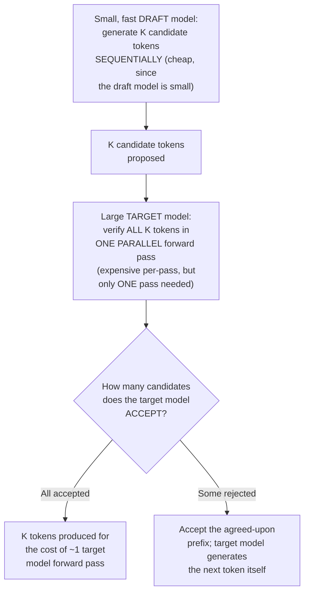
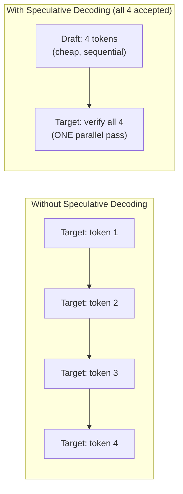
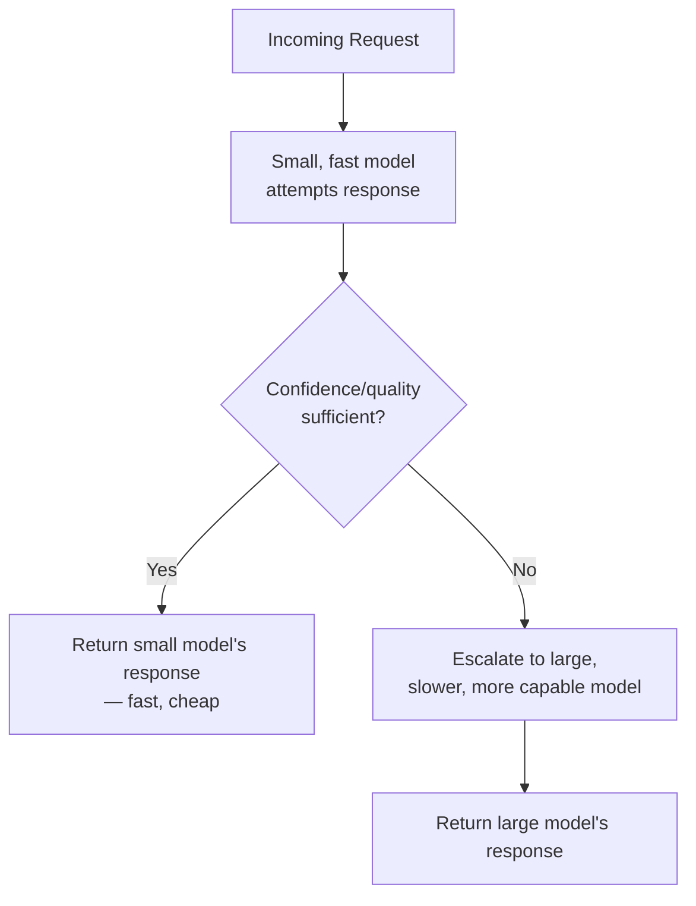

## Introduction

Chapter 50 closed by flagging that speculative decoding builds directly on KV caching and continuous batching. This chapter delivers that technique in full, plus a rounding-out of other practical latency-reduction tricks used in production LLM serving — all addressing the same fundamental constraint established in Chapters 37 and 39: autoregressive generation is inherently sequential, one token per forward pass, and that sequential dependency is the ultimate ceiling on generation speed that every technique in this chapter tries to work around.

## The Core Idea: Speculate, Then Verify in Parallel

**Speculative decoding** uses a small, fast **draft model** to propose several candidate tokens ahead of time, which the large, slow **target model** (the model whose output quality you actually want) then verifies **in a single parallel forward pass** — exploiting the fact that verifying several proposed tokens at once is much cheaper than the sequential process of generating them one at a time from the large model directly.



**Why verification can happen in parallel while generation cannot**: this is the key architectural insight, directly built on Chapter 37's discussion of why training (which sees the whole sequence at once) can be parallelized while generation (which doesn't yet know future tokens) cannot. Verifying K already-proposed candidate tokens is structurally similar to a training-time forward pass — the target model can compute its own probability distribution for every position simultaneously, since all K candidate tokens are already available as input, unlike true generation where each token must wait for the previous one to be chosen first.

## The Verification Mechanism

The target model doesn't simply check whether it "agrees" with the draft model's exact chosen tokens — it computes its own probability distribution for each position and applies a mathematically principled acceptance rule (from the original speculative decoding research) that preserves the **exact same output distribution the target model would have produced generating tokens on its own**, token by token. This is a crucial guarantee: speculative decoding is a pure speed optimization, not an approximation that changes the model's actual output quality or behavior.

```python
def speculative_decode_step(draft_model, target_model, context: list[int], k: int = 4):
    """
    A simplified illustration of one speculative decoding round.
    Real implementations handle the acceptance-probability math more
    rigorously; this shows the structural flow.
    """
    # Step 1: draft model proposes K candidate tokens, sequentially,
    # but CHEAPLY since it's a small, fast model (Ch. 28's compression
    # techniques often produce exactly this kind of small draft model).
    draft_tokens = []
    draft_context = context.copy()
    for _ in range(k):
        next_token, draft_prob = draft_model.sample_next(draft_context)
        draft_tokens.append((next_token, draft_prob))
        draft_context.append(next_token)

    # Step 2: target model verifies ALL k tokens in ONE forward pass —
    # this is the expensive computation, but it only happens ONCE
    # for all k candidates, not k separate times.
    target_probs = target_model.get_probabilities_for_sequence(
        context + [t for t, _ in draft_tokens]
    )

    # Step 3: accept tokens one by one until a rejection occurs
    accepted = []
    for i, (token, draft_prob) in enumerate(draft_tokens):
        acceptance_probability = min(1.0, target_probs[i][token] / draft_prob)
        if random.random() < acceptance_probability:
            accepted.append(token)
        else:
            # Rejected: sample a corrected token from the target
            # model's own (adjusted) distribution instead, and stop.
            corrected_token = sample_corrected(target_probs[i], draft_prob)
            accepted.append(corrected_token)
            break

    return accepted
```

## Why This Provides a Real Speedup, Not Just a Theoretical One

The efficiency gain comes from a simple economic fact: running the large target model **once** to verify K tokens in parallel is far cheaper than running it **K separate times**, sequentially, to generate those same K tokens directly — even though the draft model's own K sequential generation steps aren't free, the draft model is specifically chosen to be dramatically smaller and faster than the target model (often using the same compression techniques from Chapter 28, or simply a smaller model from the same family), making its sequential cost comparatively negligible next to the savings from avoiding K sequential target-model passes.



## The Trade-off: Acceptance Rate Determines Actual Speedup

The realized speedup depends entirely on the **acceptance rate** — how often the draft model's proposals actually match what the target model would have produced. If the draft model is well-matched to the target model's typical behavior (trained on similar data, or distilled directly from it, per Chapter 28), acceptance rates can be high, yielding substantial speedups. If the draft model's proposals are frequently rejected, the target model ends up doing nearly as much sequential work as it would have without speculation at all, while also paying for the draft model's now largely-wasted generation effort — meaning **draft model selection and quality is the single most important factor** determining whether speculative decoding provides a genuine, worthwhile speedup for a given application.

## Other Practical Latency Tricks

Beyond speculative decoding, several other techniques address latency at different points in the serving pipeline:

- **Prompt caching** (previewed in Chapter 42): caching the KV cache state for a frequently-repeated prompt prefix (like a shared system prompt, Chapter 43) so it doesn't need to be recomputed from scratch on every request — directly reducing time-to-first-token for the many requests sharing that same prefix.
- **Chunked prefill** (previewed in Chapter 50): breaking a long prompt's initial processing into smaller pieces interleaved with other requests' generation steps, improving overall system responsiveness under continuous batching.
- **Model cascades**: routing a request first to a smaller, faster, cheaper model, and only escalating to a larger, slower model if the smaller model's response doesn't meet a confidence or quality threshold — a direct architectural application of Chapter 40's diminishing-returns and right-sizing principles, now applied per-request rather than as a single fixed model choice for an entire application.



## Key Takeaways

- Speculative decoding uses a small, fast draft model to propose multiple candidate tokens, which the large target model verifies in a single parallel forward pass — exploiting the same "parallel when the full sequence is known" property that makes training parallelizable, applied here to verification rather than generation.
- The verification mechanism mathematically guarantees the output distribution matches what the target model would have produced generating alone — speculative decoding is a pure speed optimization, not a quality trade-off.
- The realized speedup depends entirely on the draft model's acceptance rate; a poorly-matched draft model can erode or eliminate the technique's benefit.
- Other practical latency techniques — prompt caching for shared prefixes, chunked prefill, and model cascades that route to a larger model only when needed — address different points in the serving pipeline and compound with speculative decoding and Chapter 50's foundational optimizations.

---

## Interview Questions

**1. Why can speculative decoding's verification step be parallelized across multiple candidate tokens, when true generation of those same tokens could not have been?**
True generation is fundamentally sequential because the model, at generation time, doesn't yet know what token comes next until it has actually decided and produced the previous one — each step's computation genuinely depends on the specific outcome of the previous step; verification is structurally different because all K candidate tokens have ALREADY been proposed by the draft model before verification begins, meaning the target model can compute its probability distribution for every position in that already-complete candidate sequence simultaneously, exactly as it would during training when the full target sequence is already known and available (Chapter 37's parallelizable-training discussion) — verification doesn't require waiting for a not-yet-determined outcome the way generation does, since the specific tokens being evaluated are already fixed and given as input, allowing the same parallel computation that makes training efficient to apply here as well.
*Follow-up: Why doesn't this same parallelization insight allow you to simply parallelize normal, non-speculative generation directly, avoiding the need for a draft model at all?*
Normal generation's fundamental constraint is that you don't know what the correct or desired next token actually is until the model has generated it — you can't "parallelize" the process of deciding what 4 sequential tokens should be, because token 2's correct value genuinely depends on what token 1 turned out to be, information that doesn't exist until token 1 has actually been produced; speculative decoding works around this specific limitation by having a separate, smaller draft model make an inexpensive GUESS about what the sequence of tokens might be, and then using the parallelizable verification computation only to check whether the large target model agrees with that guess — the parallelization applies to VERIFYING an already-made guess, not to the fundamentally sequential process of ORIGINALLY DECIDING what the correct tokens should be, which is why a draft model's speculative guess remains a structurally necessary component of this technique rather than parallelization alone being sufficient.

**2. Why is it important that speculative decoding's acceptance rule mathematically preserves the target model's exact output distribution, rather than simply being a heuristic approximation?**
If speculative decoding merely approximated the target model's behavior (accepting draft tokens based on some looser, less rigorous heuristic), it would introduce a genuine quality trade-off — the final output might differ, in distribution, from what the target model would have produced generating entirely on its own, meaning any evaluation or behavior validated for the target model (Chapter 21's offline evaluation, Chapter 46's alignment training) might not perfectly hold for the speculatively-decoded version, undermining confidence that speculative decoding is a "free," quality-neutral speedup; the mathematically rigorous acceptance rule (accepting or correcting each candidate token according to a specific probability ratio calculation) provides a formal guarantee that the overall output distribution is statistically identical to pure, un-sped-up target model generation, meaning a team can adopt speculative decoding purely as a latency optimization with full confidence that it introduces zero quality change, rather than needing to separately re-validate the target model's behavior and quality all over again specifically for the speculatively-decoded configuration.
*Follow-up: Why might this formal, distribution-preserving guarantee be a particularly important selling point for speculative decoding compared to other latency-reduction techniques (like model compression, Chapter 28) that DO involve an explicit quality trade-off?*
Techniques like quantization or distillation (Chapter 28) explicitly trade some model quality for improved speed/efficiency, requiring a team to carefully validate (per Chapter 28's compression-accuracy trade-off discussion) exactly how much quality degradation is acceptable for their specific use case, and to accept some non-zero risk of a meaningful quality regression; speculative decoding's formal, mathematically-guaranteed distribution preservation means a team adopting it doesn't need to make or justify this same kind of quality-versus-speed trade-off decision at all — it's a genuinely "free" latency improvement (aside from the added implementation complexity and the need for a well-matched draft model) rather than requiring the same careful cost-benefit quality validation that other compression-based latency techniques necessarily require, making it a particularly attractive optimization to adopt whenever it's practically applicable and a suitable, well-matched draft model is available.

**3. Why does the "acceptance rate" of the draft model's proposals determine the actual realized speedup from speculative decoding, and what happens in the worst case where the draft model's proposals are almost always rejected?**
The acceptance rate directly determines how many tokens, on average, are produced per expensive target-model verification pass — a high acceptance rate means most speculative rounds successfully produce several tokens (the full K, or close to it) for the cost of roughly one target-model pass, providing a substantial speedup; a low acceptance rate means most speculative rounds only successfully produce one or very few tokens before a rejection forces the process to fall back to a corrected, single-token generation from the target model, meaning the system pays for both the (now largely wasted) draft model's sequential generation cost AND still needs close to as many target-model verification passes as pure, non-speculative generation would have required — in the worst case, a draft model whose proposals are essentially always rejected provides no meaningful speedup at all, and can actually be net negative in efficiency compared to simply not using speculative decoding, since the draft model's computation is pure additional overhead with no compensating benefit.
*Follow-up: How would you select or validate an appropriate draft model for a specific target model, to ensure a sufficiently high acceptance rate in practice?*
I'd prioritize using a draft model that's specifically trained to closely mimic the target model's behavior — either a smaller model from the same overall model family (which likely shares similar training data and stylistic tendencies, increasing the likelihood of agreement), or a model specifically distilled (per Chapter 28's distillation technique) directly from the target model itself, since distillation explicitly trains a smaller model to approximate a larger teacher model's specific behavior, which is exactly the property that maximizes acceptance rate for this specific use case; I'd then empirically measure the actual acceptance rate on a representative sample of the target model's typical production traffic (following this series' consistent "validate empirically, don't assume" principle) before committing to this specific draft/target pairing in production, since the theoretical suitability of a draft model doesn't guarantee a sufficiently high empirical acceptance rate for every specific use case and traffic pattern.

**4. Why might a model cascade (routing simple requests to a smaller model, escalating only when needed) be described as applying Chapter 40's diminishing-returns principle "per-request" rather than as a single, fixed model choice?**
Chapter 40 established that a larger model's improved general capability doesn't always translate into meaningfully better results for every possible specific task or query — some queries are genuinely simple enough that a smaller, cheaper, faster model handles them just as well as a larger model would, while other, more complex or nuanced queries genuinely benefit from the larger model's additional capability; rather than making a single, fixed, application-wide choice between "always use the small model" (risking poor quality on the harder subset of queries) or "always use the large model" (paying unnecessary cost and latency for the easier subset of queries that didn't need it), a model cascade makes this right-sizing decision dynamically, on a PER-REQUEST basis — applying the small, cheap model by default and escalating to the large model specifically and only for the subset of requests that actually demonstrate a need for it, capturing cost and latency savings on the (often majority) easier requests while still preserving quality on the harder ones that genuinely require the larger model's capability.
*Follow-up: What mechanism would you use to determine whether the small model's response is "sufficient" or requires escalation, and what's a risk of getting this specific mechanism wrong?*
I'd use a combination of the model's own reported confidence (if available and reliable) and/or a separate, lightweight quality-check mechanism (potentially a smaller classifier trained specifically to predict whether a given response is likely to be adequate, or simple heuristics like checking whether the small model explicitly expressed uncertainty or produced an unusually short or generic response) to decide whether to escalate; a risk of getting this mechanism wrong in either direction is real and asymmetric — an overly permissive escalation threshold (escalating too rarely) risks serving genuinely inadequate responses to users for the harder queries that actually needed the larger model, directly harming quality and the business metrics quality is meant to serve (Chapter 6), while an overly conservative threshold (escalating too often) erodes most of the cost and latency savings the cascade was specifically designed to provide, since a large fraction of requests would still end up incurring the large model's full cost and latency anyway — calibrating this threshold requires the same kind of empirical validation against actual business outcomes (per Chapter 21-22) that this series has recommended for every other similar quality-versus-cost trade-off decision.

**5. How does prompt caching (for a shared system prompt prefix) directly reduce time-to-first-token, connecting to Chapter 50's TTFT discussion?**
As Chapter 50 established, TTFT is dominated by the prefill phase — processing the entire input prompt to compute its Key/Value vectors for the first time before any generation can begin; if a large portion of that prompt (a shared system prompt, per Chapter 43, that's identical across many different requests) has already had its KV cache computed and cached from a previous request using that same prefix, a new request sharing that same prefix can reuse the cached KV values for that shared portion, only needing to compute the prefill for the smaller, request-specific remainder of the prompt (the actual, unique user message and any request-specific retrieved context) — directly and substantially reducing the total prefill computation required for that specific request, and therefore directly reducing its TTFT compared to computing the full prefill (including the shared system prompt portion) from scratch on every single request.
*Follow-up: Why might this prompt caching benefit be particularly valuable specifically for applications with a long, detailed, and consistently-reused system prompt (echoing Chapter 43's discussion of system prompt design)?*
A longer, more detailed system prompt (per Chapter 43's discussion of the trade-off between comprehensive instructions and token cost) has a proportionally larger prefill computation cost when computed from scratch — meaning the potential savings from caching that portion's KV state (avoiding this cost on every subsequent request that shares it) are correspondingly larger for a longer, more detailed system prompt than for a short, minimal one; this creates an interesting, favorable interaction with Chapter 43's original cost trade-off discussion — while a longer system prompt still costs more in raw input tokens (Chapter 42), prompt caching can substantially offset the LATENCY cost (though generally not the full token cost, depending on the specific caching implementation and pricing model) of that longer prompt by avoiding repeated prefill computation for its shared, unchanging portion, partially mitigating (though not eliminating) the trade-off Chapter 43 originally identified between comprehensive system instructions and their ongoing per-request cost.

**6. In an interview, if asked to explain speculative decoding to someone unfamiliar with LLM internals, how would you construct an accessible analogy?**
I'd describe it as similar to a skilled writer working with a fast-typing assistant — rather than the skilled writer typing every single word themselves one at a time (slow, since they're being careful and deliberate about each word), the fast-typing assistant quickly drafts several words ahead based on a good guess of what the skilled writer would likely say next, and the skilled writer then quickly reviews and either approves this draft continuation or corrects it at the first point where they disagree — as long as the assistant's guesses are usually good (a high "acceptance rate"), the skilled writer ends up producing their final, correct text much faster than if they had to carefully compose every single word entirely from scratch themselves, while the final text produced is still exactly and entirely the skilled writer's own words and judgment, since they're the one making every actual decision, just reviewing/correcting the assistant's fast draft rather than typing from a blank page each time.
*Follow-up: What part of this analogy would you want to be careful NOT to overextend, given the specific technical guarantee this chapter established about speculative decoding preserving the exact target model distribution?*
I'd be careful not to suggest that the "skilled writer reviewing an assistant's draft" analogy implies any kind of casual, approximate, or "good enough" review process — the actual technical mechanism (this chapter's formal acceptance-probability calculation) provides a mathematically rigorous guarantee that the final output is statistically identical to what the skilled writer (the target model) would have produced by typing entirely from scratch themselves, not merely a "close enough" approximation that a human reviewer's more casual, potentially inconsistent judgment might suggest — I'd clarify this distinction explicitly if the audience seemed likely to interpret the analogy as implying some quality compromise, ensuring they understand that despite the accessible, human-review-based analogy, the actual technical guarantee is far more precise and rigorous than a typical human review process would provide.

**7. Why might a team choose NOT to implement speculative decoding for a specific LLM serving system, despite its "free" quality-neutral speedup property?**
Despite its theoretical quality-neutrality, speculative decoding introduces genuine implementation and operational complexity — requiring the team to select, validate, and maintain a separate, well-matched draft model (adding an additional model to manage, version, and monitor, per Chapter 35's registry discussion, now for two coordinated models instead of one), and requiring more sophisticated serving infrastructure capable of correctly implementing the draft-then-verify workflow and the specific acceptance-probability calculation; for a use case where latency isn't a particularly binding constraint (per Chapter 5's latency budget framework — perhaps an offline, non-interactive batch-processing use case where total throughput matters more than any individual request's specific latency), or where the team's available engineering resources are better allocated elsewhere given the specific magnitude of latency improvement speculative decoding would realistically provide for their specific application and traffic pattern, this added complexity may simply not be justified by the actual, demonstrated need — following this series' consistent "escalate complexity only when justified by demonstrated need" principle, now applied to this specific latency-optimization technique.
*Follow-up: What evidence would help a team decide whether this added complexity is actually justified for their specific system?*
I'd recommend the team first measure their current system's actual, real-world latency (per Chapter 33's observability discussion) and assess whether this latency genuinely represents an unacceptable business or user-experience problem (per Chapter 5's latency budget framework) that would materially benefit from the kind of speedup speculative decoding can realistically provide — and, if latency IS a genuine, demonstrated problem, I'd recommend first evaluating whether the simpler, foundational optimizations from Chapter 50 (KV caching, continuous batching, likely already provided by an established serving framework, per Chapter 52) are already fully and correctly implemented, since speculative decoding is an ADDITIONAL layer of optimization on top of these more foundational techniques, not a replacement for them — only after confirming genuine latency need and confirming the foundational optimizations are already in place would the additional complexity of implementing and maintaining speculative decoding become a well-justified next investment.

**8. How would you use this chapter's model cascade discussion to design a cost-optimization strategy for a customer support system handling a mix of simple FAQ-style questions and complex, nuanced customer issues?**
I'd propose routing every incoming customer query first to a smaller, faster, cheaper model, using this smaller model's confidence (or a lightweight quality-check heuristic, per this chapter's earlier discussion) to determine whether its response adequately addresses the query — for the likely large fraction of simple, common, FAQ-style questions, the smaller model would very likely handle these adequately and confidently, capturing significant cost and latency savings (per Chapter 42's cost modeling) on this majority-share, easier subset of traffic; for the smaller subset of more complex, nuanced, or unusual customer issues where the smaller model's confidence is low or its response quality check fails, the system would escalate to a larger, more capable (and more expensive) model specifically for this harder subset, ensuring quality is preserved where it matters most while avoiding unnecessary cost for the easier, more common queries that didn't actually need that additional capability and expense.
*Follow-up: How would you validate, empirically, that this cascade design achieves genuine cost savings without meaningfully degrading overall customer satisfaction, before fully committing to this architecture in production?*
I'd run a proper A/B test (per Chapter 22) comparing the cascade architecture against the current baseline (perhaps always using the larger model, or the team's current approach), measuring both the actual realized cost savings (per Chapter 42's cost modeling, directly quantifiable from the proportion of traffic that's successfully handled by the smaller model without escalation) and, critically, customer satisfaction and resolution-quality metrics (per Chapter 6's business-metric discipline) to confirm the escalation threshold is well-calibrated and isn't inadvertently serving inadequate responses to customers whose issues genuinely needed the larger model's capability — treating this as a genuine, evidence-based validation of the cascade's real-world cost-versus-quality trade-off, rather than assuming the architecture's theoretical benefit (based purely on the general principle this chapter described) will necessarily and automatically translate into a similarly positive real-world outcome for this specific system and customer base without this kind of direct, empirical confirmation.

**9. Why might chunked prefill be particularly important for a serving system that handles a mix of very short chat messages and very long, RAG-augmented queries simultaneously?**
Without chunked prefill, a single very long RAG-augmented query's prefill computation (potentially processing thousands of tokens of retrieved context, per Chapter 38's discussion) would need to complete as one large, uninterruptible unit of work before the continuous batching scheduler (Chapter 50) could move on to serving other requests' generation steps — this could cause noticeable delays for the many shorter, simpler chat messages that happen to be concurrently sharing the same batch and GPU resources, even though those shorter requests' own processing would otherwise be very fast; chunked prefill specifically addresses this by breaking the long query's prefill into smaller pieces, interleaving them with other requests' ongoing decode steps, ensuring the shorter, simpler requests aren't unfairly delayed by having to wait for one particularly long request's prefill to fully complete as a single, large, blocking unit of work.
*Follow-up: How would you decide the appropriate "chunk size" for chunked prefill, given the trade-offs involved?*
Smaller chunk sizes provide more frequent opportunities for the scheduler to interleave other requests' work between prefill chunks, improving fairness and responsiveness for other concurrently-batched requests (echoing this chapter's earlier "long prefill blocking others" concern), but introduce more scheduling overhead (more distinct scheduling decisions and context-switches per unit of actual prefill work completed); larger chunk sizes reduce this scheduling overhead but provide fewer interleaving opportunities, potentially reintroducing some of the "long, blocking prefill" concern this technique is meant to solve, just to a lesser degree than having no chunking at all — I'd determine an appropriate chunk size empirically, similar to the max_batch_size tuning discussed in Chapter 50, by measuring the actual latency distribution across a representative mix of short and long requests at different candidate chunk sizes, selecting the size that best balances overall system responsiveness and fairness against the added scheduling overhead for the specific traffic pattern and hardware the system actually needs to handle.

**10. How would you explain to a stakeholder why "using a smaller, faster model for everything" isn't simply a strictly better alternative to the model cascade approach, if the smaller model is genuinely much faster and cheaper?**
I'd explain that while the smaller model IS faster and cheaper on a per-request basis, Chapter 40's diminishing-returns discussion and general model-capability principles establish that a smaller model genuinely has less capability for handling complex, nuanced, or unusual queries — using the smaller model exclusively for every request, including the harder subset that genuinely benefits from a larger model's additional capability, would very likely produce meaningfully worse quality and business outcomes (a worse customer experience, more escalations to human agents, lower resolution rates, per Chapter 6's business metrics) for that specific harder subset of traffic, even though it would provide savings on the easier subset; the model cascade specifically captures the cost and latency benefit of the smaller model for the (typically larger) easier subset of traffic that doesn't need more capability, WITHOUT sacrificing quality on the smaller but genuinely more demanding subset that does — making it a more nuanced, generally superior strategy compared to either extreme (always small, or always large) for a traffic mix that genuinely varies in difficulty and required capability.
*Follow-up: Under what circumstance might "always use the smaller model" actually be the correct, well-justified choice, despite this general argument for the cascade approach?*
If empirical validation (per Chapter 21, applied to a representative sample of the system's actual traffic) reveals that the smaller model already achieves acceptable quality across the ENTIRE range of traffic the system handles — meaning there genuinely isn't a meaningful subset of harder queries that would actually benefit from escalation to a larger model for this specific application — then "always use the smaller model" would be the correct, well-justified, and simpler choice, since the added complexity of a cascade architecture (an additional escalation mechanism, a larger model to maintain and monitor for the rarely-or-never-triggered escalation path) wouldn't be providing any genuine, demonstrated benefit for this specific use case; this again reflects the "validate the actual need empirically before adding complexity" principle this series has consistently applied — a cascade is justified specifically when there's demonstrated evidence of a genuinely difficulty-varying traffic mix that benefits from this kind of differentiated handling, not simply because the general architectural pattern sounds appealing in the abstract.

**11. Why does this chapter emphasize that speculative decoding, prompt caching, chunked prefill, and model cascades all "compound" with each other and with Chapter 50's foundational optimizations, rather than being mutually exclusive alternatives?**
Each of these techniques addresses a genuinely different, largely independent source of potential inefficiency: KV caching (Chapter 50) eliminates redundant per-request computation; continuous batching (Chapter 50) maximizes GPU utilization across concurrent requests; speculative decoding reduces the number of expensive sequential target-model passes needed per token; prompt caching reduces redundant prefill computation across DIFFERENT requests sharing a common prefix; chunked prefill improves scheduling fairness for mixed-length concurrent requests; and model cascades reduce the average per-request cost by right-sizing model capability to each specific request's actual difficulty — since these each target a different specific inefficiency, a well-designed, state-of-the-art serving system typically implements ALL of them together (to the extent each is applicable to its specific traffic pattern), capturing the combined, compounding benefit of addressing every one of these distinct inefficiency sources simultaneously, rather than needing to choose only one as if they were competing, mutually-exclusive alternatives addressing the same underlying problem.
*Follow-up: Is there any pair of techniques from this chapter and Chapter 50 that might genuinely interact in a more complex, non-trivially-additive way, requiring careful joint implementation rather than simply being independently "stacked"?*
Speculative decoding and continuous batching interact in a genuinely more complex way than simple independent stacking — continuous batching's scheduling logic (Chapter 50) assumes, in its simplest form, that each active request advances by exactly one token per scheduling step; speculative decoding, when successful, can advance a request by SEVERAL tokens in a single round (when multiple draft tokens are accepted), meaning a serving system implementing both techniques together needs scheduling logic sophisticated enough to correctly account for this variable, multi-token-per-round advancement pattern when managing the batch's composition and each request's KV cache growth, rather than naively assuming a fixed "one token per step" advancement rate that Chapter 50's simpler illustrative code assumed — this is exactly the kind of more sophisticated, jointly-designed scheduling logic that production-grade serving frameworks like vLLM (Chapter 52) need to implement correctly to properly support combining these two techniques together.

**12. How would you use this chapter's speculative decoding discussion to answer a question about why some LLM providers might offer a noticeably faster (but not obviously different-quality) response for the same model, compared to their own earlier offerings or a competitor's serving of a similar model?**
I'd explain that this observed speed improvement, without a corresponding quality change, is consistent with the provider having implemented (or improved their implementation of) exactly the kind of latency-optimization techniques this chapter and Chapter 50 have covered — speculative decoding specifically fits this pattern well, since its formal guarantee (this chapter's earlier discussion) is that it provides a pure speed improvement without altering the model's actual output quality or distribution, meaning a provider successfully implementing well-tuned speculative decoding (with a well-matched draft model achieving a high acceptance rate) could very plausibly explain this kind of "faster but not different" improvement, alongside other possible contributing factors like improved KV caching efficiency, better continuous batching scheduling, or general infrastructure and hardware improvements (Chapter 50's foundational techniques, and general infrastructure investment).
*Follow-up: Why might it be difficult, as an external customer of an LLM API, to determine with certainty WHICH specific technique (among several plausible candidates) is actually responsible for an observed speed improvement?*
As an external API customer, you generally don't have visibility into the provider's specific internal serving infrastructure implementation details (which specific optimizations they've implemented, or how they're specifically configured) — you can only observe the EXTERNAL, black-box result (faster response times for the same model and quality), without direct access to the internal mechanism producing that result; this is a genuine, expected limitation of consuming a closed-source API (echoing Chapter 41's build-vs-buy discussion) — while understanding the GENERAL categories of technique that could plausibly explain such an improvement (as this chapter and Chapter 50 have covered) is valuable for reasoning about what's likely happening and for having informed conversations with the provider or in technical discussions, definitively attributing a specific observed improvement to one specific technique versus another, without the provider's own internal disclosure, generally isn't possible from the external customer's vantage point alone.

**13. How would you handle a situation where implementing speculative decoding for your serving system provides a measurable latency improvement in benchmarks, but the improvement doesn't translate into a noticeable difference in actual user-perceived experience?**
I'd investigate whether the latency improvement is occurring in a part of the request lifecycle that isn't actually the dominant contributor to the user's overall perceived experience — for example, if speculative decoding primarily improves the per-subsequent-token generation speed (per Chapter 50's TTFT-versus-subsequent-token distinction) but the application already uses streaming responses (Chapter 56) that display tokens as they're generated, users may already perceive the response as reasonably fast and responsive regardless of the exact per-token generation speed improvement, since the perceived experience is dominated more by TTFT and the qualitative sense of continuous progress than by the precise total generation time for a typically-short response; I'd also check whether other parts of the overall request latency (network round-trip time, application-level processing before and after the LLM call, any RAG retrieval steps per Part 11) are actually the dominant contributors to total perceived latency, in which case an LLM-generation-specific optimization like speculative decoding, however effective at what it specifically targets, simply wouldn't be expected to produce a large, noticeable improvement in the OVERALL user experience if it's not addressing the actual bottleneck.
*Follow-up: How does this scenario connect to and reinforce the latency budget decomposition principle first established in Chapter 26?*
This is a direct, concrete instance of Chapter 26's core lesson — optimizing one specific component of a multi-stage pipeline (here, the LLM generation step specifically) only meaningfully improves the OVERALL, end-to-end latency if that specific component was actually a significant contributor to the total latency budget in the first place; if the LLM generation step wasn't actually the dominant bottleneck (perhaps network latency, RAG retrieval, or other application logic contributes more to the total perceived latency), even a substantial, successfully-implemented optimization to that one specific step (like speculative decoding) will naturally fail to produce a correspondingly large improvement in the overall, end-to-end experience — reinforcing why Chapter 26's discipline of first decomposing and measuring where time is ACTUALLY being spent across the full request lifecycle remains essential before investing significant engineering effort in optimizing any one specific, potentially non-bottleneck component, even one as seemingly central to an LLM system as the generation process itself.

**14. Why might a team building a genuinely novel domain-specific application (with unusual, highly specialized vocabulary and response patterns, per Chapter 47's domain adaptation discussion) find it harder to achieve a high acceptance rate with an off-the-shelf, general-purpose draft model for speculative decoding?**
A general-purpose draft model's proposals are shaped by its own general-purpose training data and typical language patterns — for a genuinely novel, highly specialized domain with unusual vocabulary or response conventions (per Chapter 47's domain adaptation discussion), a general-purpose draft model is less likely to naturally and confidently predict the kind of specialized tokens and phrasing patterns that a domain-adapted TARGET model would actually produce, resulting in more frequent disagreements between the draft model's general-purpose proposals and the domain-adapted target model's actual specialized output, directly lowering the acceptance rate and therefore eroding the realized speedup speculative decoding would otherwise provide for this specific, specialized use case.
*Follow-up: What would you recommend to address this specific challenge, connecting to concepts from Part 9's fine-tuning chapters?*
I'd recommend applying the SAME domain adaptation techniques from Chapter 47 (and Chapter 45's PEFT mechanics) to the smaller draft model itself, not just the large target model — fine-tuning or domain-adapting a smaller draft model on the same domain-specific data (or, ideally, directly distilling it from the domain-adapted target model's own behavior, per Chapter 28's distillation technique, now applied specifically to produce a well-matched draft model for this specialized domain) would help the draft model's proposals more closely and reliably match the domain-adapted target model's actual specialized behavior, directly improving the acceptance rate and restoring speculative decoding's speedup benefit for this specific, specialized use case — illustrating a genuine, practical interaction between this chapter's serving-optimization concepts and Part 9's fine-tuning/adaptation concepts, where achieving good results with one (speculative decoding) can specifically depend on properly applying the other (domain adaptation, applied to BOTH models in the draft/target pairing, not just the target model alone).

**15. How would you summarize, for someone moving on to Chapter 52's serving frameworks discussion, why this chapter's speculative decoding and latency-trick material is important context for evaluating and choosing a specific serving framework?**
Chapter 52 will cover specific, established serving frameworks (like vLLM and TGI) that implement Chapter 50's foundational optimizations (KV caching, continuous batching) and often this chapter's additional techniques (speculative decoding, chunked prefill, and others) as built-in, production-ready features — having this chapter's conceptual understanding of WHAT these techniques are and WHY they matter equips a reader to meaningfully evaluate and compare different serving frameworks based on WHICH of these specific optimizations each framework actually implements, how well-configured and mature each framework's implementation of a given technique is, and whether a specific framework's supported optimizations align with the reader's own specific application's needs (e.g., does this specific application have a good potential draft model available for speculative decoding, or a traffic pattern that would particularly benefit from chunked prefill) — without this chapter's conceptual foundation, Chapter 52's framework comparison would risk being a comparison of unexplained feature checklists rather than a genuinely informed evaluation grounded in understanding what each feature actually does and why it matters.
*Follow-up: What specific question would you recommend a reader ask when evaluating a candidate serving framework, directly informed by this chapter's speculative decoding discussion?*
I'd recommend asking: "does this framework support speculative decoding, and if so, does it provide flexibility in choosing or configuring the draft model (rather than being locked into a single, fixed, potentially poorly-matched draft model choice)?" — since this chapter established that speculative decoding's actual benefit depends critically on having a well-matched draft model achieving a sufficiently high acceptance rate for your SPECIFIC target model and use case (not just any generic draft model), a framework's support for this technique is only genuinely useful if it also provides the flexibility to select or configure an appropriately well-matched draft model for your particular application, rather than offering speculative decoding support only with a fixed, potentially poorly-suited default draft model that wouldn't provide the benefit this chapter has described for your specific, particular use case.
